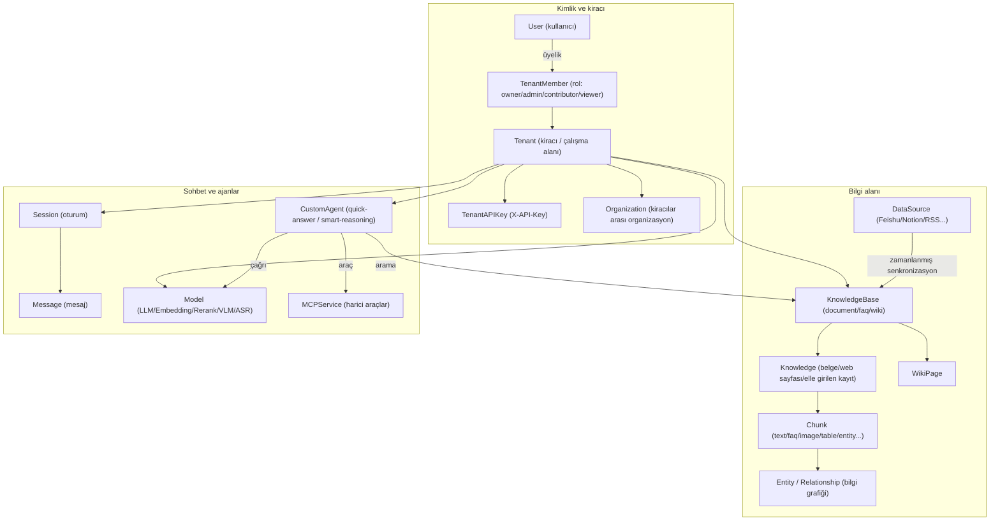
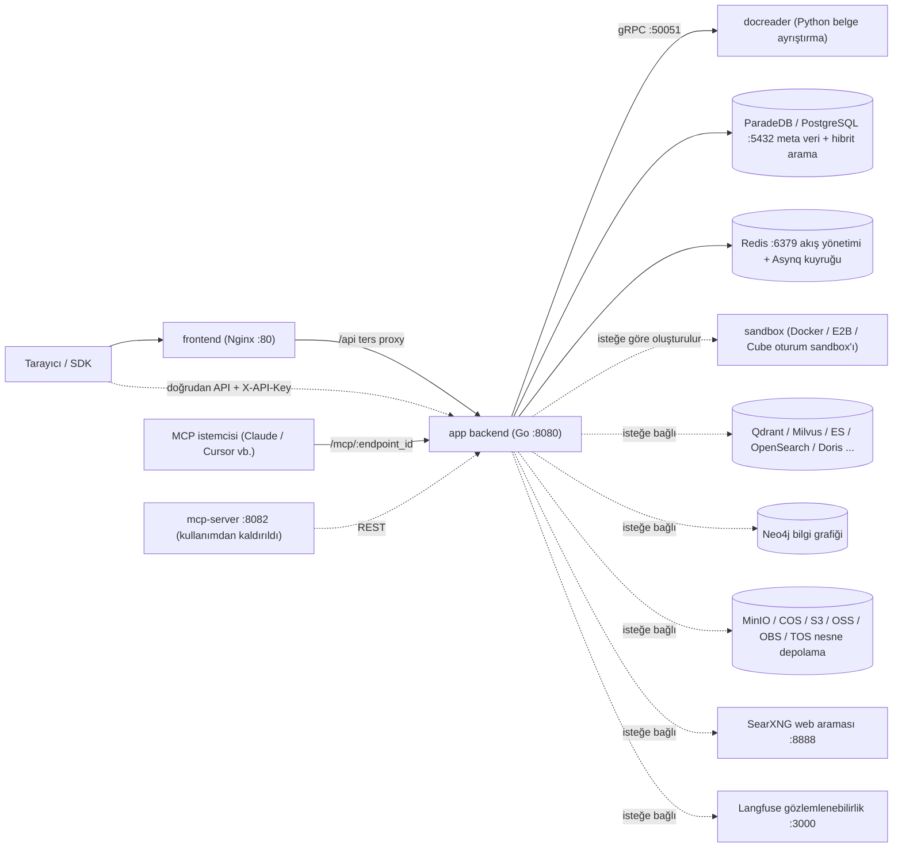

# Rethra Ürün Tanıtımı

Rethra, açık kaynaklı bir bilgi tabanı soru-cevap sistemidir; PDF, Word, web sayfaları ile Feishu, Notion, Confluence, Yuque ve DingTalk gibi platformlardaki materyallerin içe aktarılmasını destekler. Kullanıcılar bu materyaller hakkında soru sorabilir ve yanıtlardaki alıntılar aracılığıyla özgün metni görüntüleyebilir.

Sistem, geri getirme destekli üretim (RAG) yaklaşımını kullanır: önce belgeleri ayrıştırır ve dizin oluşturur, ardından soruya göre ilgili parçaları getirir; büyük dil modeli ise yanıtı üretir.

Sistem; Go arka ucu, Vue 3 ön yüzü ve Python belge ayrıştırma hizmeti docreader'dan oluşur; Docker Compose, Helm ve Lite tek ikili gibi dağıtım yöntemlerini destekler.

<Screenshot
  src="/screenshots/introduction-overview.png"
  caption="Rethra ana arayüzü: solda bilgi tabanı ve görüşmeler, sağda soru-cevap alanı"
  hint="Oturum açıldıktan sonraki ana arayüzün tamamını gösterir: kenar çubuğu (bilgi tabanı, ajanlar, ayar girişleri) ve alıntılı bir soru-cevap turu." />

## Kullanım senaryoları {#kullanim-senaryolari}

| Gereksinim | İşlev |
| --- | --- |
| Belge biçimleri çeşitlidir; PDF/taranmış belge/tablo yapılandırmak zordur | Belge işleme akışı; PDF mizanpaj analizi, taranmış belge OCR, Office dönüşümü, web sayfası tarama ve görsel açıklamalarını destekler; isteğe bağlı OpenDataLoader/Docling karma ayrıştırması sunar |
| Tekil vektör aramasında geri çağırma kararsızdır | Vektör + anahtar kelime (BM25) karma araması, RRF birleştirme, Rerank yeniden sıralama; isteğe bağlı bilgi grafiği (GraphRAG) ve Wiki gezinmesi |
| Veri güvenliği ve özelleştirilmiş kurulum | Tüm yığın özel olarak kurulabilir; hassas kimlik bilgileri (API Key vb.) AES-256 ile diske şifrelenir (`SYSTEM_AES_KEY`); çoklu kiracı yalıtımı + RBAC rol yetkilendirmesi |
| Çok adımlı görevler ve araç çağrıları | Yerleşik Agent (ReAct çok adımlı çıkarım), MCP araç entegrasyonu, Agent Skills korumalı alan yürütmesi, web araması (SearXNG vb.), veri analizi (CSV/Excel üzerinde SQL çalıştırma) |
| Ekip iş birliği | Kiracı (çalışma alanı) + üye rolleri + Organization ile kiracılar arası bilgi tabanı paylaşımı + davet mekanizması |

## Temel kavramlar

Bilgi tabanı materyalleri düzenler, çalışma alanı üyeleri ve kaynak izinlerini yönetir, ajan ise yanıtta kullanılacak modeli ve araçları belirler. Aşağıdaki terimler arayüz seçenekleriyle eşleşir; tam tür tanımları `internal/types/` altında yer alır.

### Kiracı ve Kimlik

| Kavram | Açıklama |
| --- | --- |
| Kiracı Tenant | Çalışma alanıdır; bilgi tabanlarını, modelleri, akıllı ajanları, oturumları ve depolama kotalarını yönetir. Ayrıntılar için bkz. [Alanlar ve izinler](../03-features/01-tenant-auth.md) |
| Kullanıcı User | Oturum açma hesabıdır; bir kullanıcı birden fazla çalışma alanına katılabilir |
| Üye TenantMember | Kullanıcının belirli bir alandaki üyelik ilişkisidir; rol ve durum içerir |
| Rol TenantRole | Owner, Admin, Contributor ve Viewer olmak üzere dört seviyedir; kullanıcının gerçekleştirebileceği alan işlemlerini belirler |
| API Key (TenantAPIKey) | Programatik erişim kimlik bilgisidir; belirli yetkiler verilebilir ve bilgi tabanı kapsamı sınırlandırılabilir. Alan ve platform Key izinleri ayrı ayrı yönetilir |
| Organizasyon Organization | Birden fazla çalışma alanını bağlar; bilgi tabanları ve akıllı ajanlar, organizasyon üyesi rollerine göre paylaşılır |

### Bilgi Alanı

| Kavram | Açıklama |
| --- | --- |
| Bilgi Tabanı KnowledgeBase | İlgili materyalleri düzenler ve model, parçalama ile dizinleme stratejilerini yapılandırır. Belge, FAQ ve Wiki türlerini destekler |
| Bilgi Knowledge | Bilgi tabanındaki bir dosya, web sayfası veya elle yazılmış içeriktir; sisteme eklendikten sonra ayrıştırma durumu görüntülenebilir |
| Parça Chunk | Belge ayrıştırıldıktan sonraki arama birimidir; metin, görsel tanıma sonuçları, tablolar veya diğer dizin içeriklerini içerebilir |
| FAQ | Standart soruları, benzer soruları, karşıt örnek soruları ve yanıtları içeren soru-cevap kayıtlarını yönetir. Ayrıntılar için bkz. [FAQ özellikleri](../03-features/17-faq.md) |
| Wiki sayfası WikiPage | Belgelerden oluşturulan konu sayfasıdır; kaynak alıntıları ve sayfa bağlantıları içerir, düzenleme ve sürüm yönetimini destekler |
| Bilgi grafiği Entity / Relationship | Belgelerdeki varlıklar ve ilişkilerdir; ilişkili içerik aramasını desteklemek için Neo4j'de saklanır |
| Veri kaynağı DataSource | Harici materyalleri sürekli senkronize eden bağlantıdır. Lark (bilgi tabanı ve bulut sürücüsü), Notion, Confluence, Yuque, DingTalk Documents, Tencent IMA, GitLab ve RSS desteklenir. Ayrıntılar için bkz. [Veri kaynağı içe aktarma](../03-features/10-datasource.md) |
| Arama yapılandırması RetrievalConfig | Aday sayısını, eşleşme eşiğini, birleştirme ağırlıklarını ve yeniden sıralama sonuçlarını kontrol eder. Ayrıntılar için bkz. [Arama motoru](../03-features/05-retrieval-engines.md) |

### Sohbet ve Akıllı Ajanlar

| Kavram | Açıklama |
| --- | --- |
| Oturum Session | Çok turlu soru-cevapları ve seçilen akıllı ajanı, modeli, bilgi kapsamını ve araç yapılandırmasını kaydeder |
| Mesaj Message | Tek bir soru veya yanıttır; görseller, ekler, alıntılar ve araç yürütme sonuçlarıyla ilişkilendirilebilir |
| Model Model | Sohbet, vektörleştirme, yeniden sıralama, görsel veya ses yetenekleri sunan model bağlantısıdır. Ayrıntılar için bkz. [Model yönetimi](../03-features/06-models.md) |
| Agent (Özel akıllı ajan) CustomAgent | Modele, materyal kapsamına ve araçlara göre görev yapılandırır; hızlı soru-cevap ve akıllı muhakemeyi destekler |
| Yerleşik Agent | Önceden yapılandırılmış hızlı soru-cevap, akıllı muhakeme, veri analizi ve Wiki ajanlarıdır. Ayrıntılar için bkz. [Agent motoru](../03-features/07-agent.md) |
| Yetenekler ve sandbox | Alan beceri dizini paketleri kaydeder, sandbox yapılandırmasına göre kurulur ve ardından kullanılmak üzere ajana bağlanır; Docker/Cube/E2B, kişisel değişkenler ve oluşturulan dosyaları destekler; bkz. [Yetenekler ve sandbox](../03-features/22-skills-sandbox.md) |
| Uzun süreli bellek | Verileri/tercihleri/olguları/işleri/ilgi alanlarını alana ve çağırana göre kaydeder; varsayılan olarak kapalıdır, etkinleştirme ve kişisel yönetim için bkz. [Uzun süreli bellek](../03-features/23-memory.md) |
| MCP hizmeti MCPService | Ajana harici araçlar bağlar, SSE ve Streamable HTTP'yi destekler; kimlik doğrulama isteğe bağlı olarak API Key, Bearer veya OAuth 2.0 olabilir |

### Kavram ilişki diyagramı

## Özellik listesi

- **Belge alımı**: Dosya yükleme (PDF/Word/PPT/Excel/Markdown/HTML/EPUB/XMind/görseller/ses vb.), URL tarama, elle Markdown yazma, tüm dizini yükleme, Feishu / Lark / Notion / Confluence / Yuque / DingTalk / IMA / GitLab / RSS zamanlanmış eşitlemesi.
- **Belge anlama**: Sayfa düzeni analizi, taranmış belge OCR'si, tablo çıkarma, görseller için çok modlu açıklama (VLM), ses dökümü (ASR), dosya türüne göre ayrıştırma motoru seçimi (`ParserEngineRules`, MinerU / OpenDataLoader bağlanabilir).
- **Dizinleme hattı**: Yapılandırılabilir parçalama (üst-alt parçalama ve uyarlanabilir stratejiler dahil), vektör dizini, anahtar sözcük tam metin dizini, FAQ dizini, Wiki oluşturma, bilgi grafiği çıkarma, önceden soru oluşturma (question generation).
- **Arama**: Vektör + BM25 hibrit arama, RRF birleştirme, Rerank yeniden sıralama, sorgu yeniden yazma ve genişletme, niyet tanıma (greeting/chitchat/web_search vb., bkz. `config/prompt_templates/intent_prompts.yaml`).
- **Soru-cevap ve Agent**: Akışlı SSE soru-cevap, çok turlu bağlam sıkıştırma, alıntı kaynak takibi; ReAct Agent (araçlar: `search_knowledge`, `read_document`, `list_documents`, `wiki_search`, `data_analysis` vb.), MCP harici araçları, Agent Skills (Docker, Cube veya E2B sandbox'ında betik çalıştırma), Web araması.
- **Sohbet deneyimi**: Yanıt sürerken ek gereksinim ekleme, herhangi bir geçmiş sorudan dallanma veya yerinde geri alma (sandbox çalışma alanı kontrol noktalarıyla), oturuma göre düşünme yoğunluğunu ayarlama, "çıktılar" sayfasında ajan tarafından oluşturulan dosyaların oturumlar arası birleştirilmesi; ayrıntılar için bkz. [Sohbet deneyimi](../03-features/18-chat-experience.md).
- **Çok kiracılı yapı ve güvenlik**: RBAC rol yetkilendirmesi (varsayılan olarak etkin, `RETHRA_TENANT_ENABLE_RBAC`), denetim günlükleri (varsayılan saklama süresi 90 gün), davetli kayıt (`auth.registration_mode=invite_only`, eski değişken `DISABLE_REGISTRATION=true` da kullanılabilir), OIDC tek oturum açma, SSRF koruması (isteğe bağlı olarak yalnızca beyaz listedeki çıkışlar `SSRF_DNS_WHITELIST_ONLY`), hassas alanlar için AES-256 şifreleme. Arayüz Türkçe, İngilizce, Japonca, Korece ve Rusça sağlar.
- **Gözlemlenebilirlik**: Langfuse uçtan uca izleme (LLM/Embedding/Rerank/VLM/ASR çağrıları ve token istatistikleri), sağlık denetimleri, Swagger API belgeleri (`GIN_MODE=debug` iken).
- **Ekosistem**: REST API (`/api/v1`) + API Key, yerleşik MCP Server (alana göre uç nokta oluşturur, Rethra'yı diğer Agent'lara araç olarak sunar; bkz. [MCP entegrasyonu](../03-features/08-mcp.md)), tarayıcı eklentisi kanalları, [yerel tarayıcı](../05-clients/09-local-browser.md) (ajan, Chrome/Edge eklentisi aracılığıyla kullanıcının tarayıcısını kullanır).

## Sistem bileşenlerine genel bakış

| Bileşen | Teknoloji yığını | Kaynak kod konumu | Varsayılan port | Sorumluluk |
| --- | --- | --- | --- | --- |
| app (arka uç) | Go / Gin | `cmd/server`, `internal/` | 8080 | REST API, arama ve soru-cevap, Agent motoru, eşzamansız görevler (Asynq) |
| frontend (ön uç) | Vue 3 + Nginx | `frontend/` | 80 | Web konsolu, Nginx `/api` isteklerini app'e ters vekil olarak iletir |
| docreader | Python / gRPC | `docreader/` | 50051 (yalnızca konteyner ağı içinde) | Dosyaları Markdown'a dönüştürme, web sayfası tarama, görsel çıkarma |
| postgres | ParadeDB (PostgreSQL 17 + BM25/vektör eklentileri) | İmaj `paradedb/paradedb` | 5432 | Ana veritabanı + varsayılan hibrit arama motoru (`RETRIEVE_DRIVER=postgres`) |
| redis | Redis 7 | — | 6379 | Akış yönetimi (SSE devam ettirme), Asynq görev kuyruğu |
| sandbox | Python 3.12 + Node 20 | `docker/Dockerfile.sandbox` | — | Agent Skills için oturum sandbox konteyner imajı |
| İsteğe bağlı: qdrant / milvus / weaviate / doris | — | `docker-compose.yml` profiles | 6334 / 19530 / 9035 / 9030 | Alternatif veya ek vektör arama motorları (`RETRIEVE_DRIVER`) |
| İsteğe bağlı: opensearch | — | Yalnızca `docker-compose.dev.yml` | 9200 | Geliştirme ortamı için; üretimde küme ayrıca sağlanmalıdır |
| İsteğe bağlı: elasticsearch / tencent_vectordb | — | compose ile sunulmaz | — | Kod tarafından desteklenir, ancak ayrıca dağıtıldıktan sonra `RETRIEVE_DRIVER` ile bağlanmalıdır |
| İsteğe bağlı: neo4j | Neo4j | profile `neo4j` | 7474 / 7687 | Bilgi grafiği depolama alanı (GraphRAG) |
| İsteğe bağlı: minio | MinIO | profile `minio` | 9000 / 9001 | S3 uyumlu nesne depolama alanı (`STORAGE_TYPE=minio`) |
| İsteğe bağlı: searxng | SearXNG | profile `searxng` | 8888 | Kendi barındırılan Web arama motoru |
| İsteğe bağlı: langfuse yığını | Langfuse 3 + ClickHouse + MinIO | profile `langfuse` | 3000 | LLM gözlemlenebilirliği |
| İsteğe bağlı: mcp (kullanımdan kaldırıldı) | Python | `mcp-server/`, profile `full` | 8082 | Eski bağımsız MCP Server; yeni dağıtımlarda app içindeki MCP Server uç noktasını kullanın |
| İsteğe bağlı: odl-hybrid | Docling | profile `odl-hybrid` | 5002 | OpenDataLoader PDF karma ayrıştırma arka ucu |

## Sonraki adımlar

- [Kurulum ve dağıtım](./02-installation.md): Dağıtım yöntemini seçin ve hizmetleri başlatın.
- [Hızlı başlangıç](./03-quickstart.md): Bilgi tabanı oluşturun, belgeleri yükleyin ve ilk soru-cevap işlemini tamamlayın.
- [Yapılandırma ayrıntıları](./04-configuration.md): Dağıtım parametrelerini ve yapılandırma önceliğini inceleyin.
