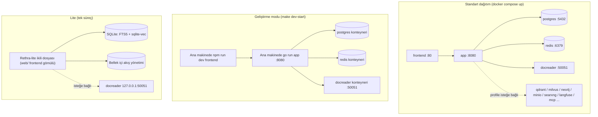
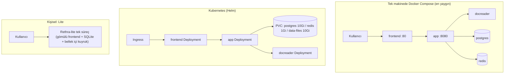

# Kurulum ve dağıtım

Rethra, Docker Compose, Kubernetes Helm ve Lite tek ikili dosyayı destekler. Sunucu dağıtımı için Compose veya Helm seçilebilir; yerel kullanım için Lite seçilebilir; geliştirmeye katılırken bağımsız geliştirme düzenlemesi kullanılır. Her yöntemin bağımlılıkları, başlatma komutları ve veri dizinleri aşağıdadır.

## Dağıtım biçimlerine genel bakış

| Biçim | Giriş noktası | Veritabanı | Kuyruk/akış | Uygun senaryolar |
| --- | --- | --- | --- | --- |
| Docker Compose (standart) | `docker-compose.yml` | ParadeDB (PostgreSQL) | Redis + Asynq | Üretim / ekip tarafından barındırma, önerilir |
| Docker Compose (geliştirme) | `docker-compose.dev.yml` | Yukarıdakiyle aynı (yalnızca altyapı kapsayıcılarda) | Yukarıdakiyle aynı | Yerel geliştirme: app / frontend ana makinede çalışır |
| Helm | `helm/` | ParadeDB (chart yerleşik) | Redis (chart yerleşik) | Kubernetes >= 1.25 |
| Lite tek ikili dosya | `make build-lite` / `scripts/package-lite.sh` | SQLite (FTS5 + sqlite-vec) | Bellek (Redis yok) | Kişisel / çevrim dışı / düşük kaynaklı ortamlar |



## Donanım ve bağımlılık gereksinimleri

- **Model hizmeti**: Kullanılabilir bir OpenAI uyumlu API hazırlayın (ör. OpenAI, DeepSeek, Tongyi veya Zhipu) ve bilgi tabanı başlatma sihirbazında adresi, model adını ve anahtarı yapılandırın.
- **Standart Docker dağıtımı**: Docker 20.10+ ve Docker Compose v2 (v1 `docker-compose` da uyumludur, `scripts/start_all.sh` otomatik algılar); en az 4 çekirdek CPU / 8GB bellek önerilir (docreader LibreOffice ve Playwright içerir, bellek tüketimi yüksektir); disk alanını bilgi tabanı ölçeğine göre ayırın (Postgres birimi + `/data/files` dosya birimi). Milvus / OpenSearch / Langfuse gibi isteğe bağlı bileşenleri etkinleştirmek, belleğin buna göre artırılmasını gerektirir.
- **Kaynak koddan derleme**: Go 1.26 (`docker/Dockerfile.app` builder aşamasındaki `golang:1.26-bookworm` bölümüne bakın), CGO (`libsqlite3-dev` bağımlılığı), Node.js + npm (ön yüz), Python 3.10 + uv (docreader).
- **Kubernetes**: >= 1.25.0 (`helm/Chart.yaml`).

Compose varsayılan ParadeDB `v0.22.6-pg17` için x86 CPU taban çizgisi `x86-64-v2`'dir (SSE4.2 ve POPCNT dahil), artık AVX2 zorunlu değildir. Bu, tüm ARM CPU'ların veya diğer isteğe bağlı hizmetlerin uyumlu olduğu anlamına gelmez.

## 1. Docker Compose standart dağıtımı (docker-compose.yml)

En hızlı yol:

```bash
git clone https://github.com/acrbaran/rag.git && cd rag
cp .env.example .env              # Zorunlu alanları düzenleyin: DB_USER/DB_PASSWORD/DB_NAME, REDIS_PASSWORD, JWT_SECRET, SYSTEM_AES_KEY
make start-all                # ./scripts/start_all.sh ile aynıdır (varsayılan olarak en yeni imajları çeker)
# Veya doğrudan:
docker compose pull           # RETHRA_VERSION ile eşleşen imajları çeker
docker compose up -d
docker compose ps                 # Tüm servisler healthy/running olana kadar bekleyin
```

`.env.example` içindeki `JWT_SECRET` ve `SYSTEM_AES_KEY` varsayılan olarak boş bırakılır; ilk dağıtımda bir kez oluşturulmaları ve güvenle saklanmaları gerekir: `JWT_SECRET` için `openssl rand -hex 32` kullanılabilir, `SYSTEM_AES_KEY` mutlaka 32 bayt olmalıdır ve `openssl rand -hex 16` kullanılabilir. Mevcut bir dağıtımı yükseltirken özgün `SYSTEM_AES_KEY` değerini kullanmaya devam edin; aksi halde şifrelenmiş kimlik bilgileri çözülemez. Her anahtarın işlevi için bkz. [yapılandırma ayrıntıları](./04-configuration.md).


Başlatıldıktan sonra tarayıcıda `http://localhost` açıldığında ön yüz görüntülenir (bağlantı noktası `FRONTEND_PORT` tarafından belirlenir, varsayılan 80'dir); ilk erişim kayıt sayfasına yönlendirilir. Ön yüz Nginx, `/api/` yolunu arka uca ters vekil olarak yönlendirir; bu nedenle API çağrıları da `http://localhost/api/v1` üzerinden yapılır; arka ucun `8080` bağlantı noktası da doğrudan ana makineye eşlenir ve `curl http://localhost:8080/health` arka ucun hazır olduğunu doğrulamak için kullanılabilir.

> Not: `docker-compose.yml` içindeki app hizmeti `env_file: [.env]` kullanır; `.env` dosyasının olmaması compose ayrıştırmasının başarısız olmasına neden olur. `make docker-run` / `start_all.sh`, otomatik olarak `cp .env.example .env` çalıştırır veya yedek olarak `touch .env` kullanır.

### Sürüm yükseltme

Mevcut bir kurulum varsa ve güncellenmiş release indirildiyse:

> Veritabanı hâlâ ParadeDB `v0.22.2-pg17` ise, önce [ParadeDB yükseltme talimatları](06-paradedb-upgrade.md) uyarınca yazmayı durdurun, yedek alın, veri birimini koruyarak imajı değiştirin ve `pg_search` eklentisi yükseltmesini tamamlayın; ardından uygulamayı geri yükleyin. Yalnızca imajı değiştirmek, mevcut veritabanındaki eklentinin SQL'ini güncellemez; `000099` geçişi Rethra veritabanında koşulları karşılayan `0.22.2–0.22.5` sürümlerini işler, diğer veritabanları ise ayrıca kontrol edilmelidir.

```bash
# .env içinde RETHRA_VERSION'ı hedef sürüme (ör. 0.7.0) ayarlayın veya latest olarak bırakın
docker compose pull
docker compose up -d
```

> Yalnızca `docker compose up -d` çalıştırmak yerel önbellekteki imajı yeniden kullanır; bu da Web UI'da gösterilen sürümün indirilen release ile uyuşmamasına neden olabilir.

### Temel hizmetler (varsayılan olarak başlatılır)

| Hizmet | İmaj | Port (ana makine:konteyner) | Bağımlılıklar | Açıklama |
| --- | --- | --- | --- | --- |
| `frontend` | `rethra-ui:${RETHRA_VERSION:-latest}` | `${FRONTEND_PORT:-80}:80` | app (sağlıklı) | Nginx, SPA'yı sunar ve app'e ters vekil olur; `APP_HOST`/`APP_BACKEND_PORT`/`APP_SCHEME` uzak bir arka uca yönlendirilebilir |
| `app` | `rethra-app` | `${APP_PORT:-8080}:8080` | postgres (sağlıklı), redis, docreader (sağlıklı) | Go arka ucu; `./config/config.yaml`, `data-files` birimi bağlanır; sağlık denetimi `GET /health` |
| `docreader` | `rethra-docreader` | yalnızca `expose: 50051` (ana makineye yayımlanmaz) | — | Belge ayrıştırma gRPC hizmeti; sağlık denetimi `grpc_health_probe`; görselleri aktarmak için app ile `docreader-tmp` birimini paylaşır |
| `postgres` | `paradedb/paradedb:v0.22.6-pg17` | Ana makine portu eşlenmez | — | ParadeDB = PostgreSQL 17 + BM25/vektör eklentileri, varsayılan arama motoru |
| `redis` | `redis:7.0-alpine` | Ana makine portu eşlenmez | — | `--appendonly yes --requirepass ${REDIS_PASSWORD}` |

### İsteğe bağlı hizmetler ve profiles

Gerektiğinde `docker compose --profile <name> up -d` ile etkinleştirin:

| profile | Hizmet | Port | Amaç |
| --- | --- | --- | --- |
| `searxng` (`full` dahil) | `searxng-init` + `searxng` | `127.0.0.1:8888` (`SEARXNG_BIND`/`SEARXNG_PORT`) | Kendi barındırılan Web araması; varsayılan olarak yalnızca loopback'e bağlanır, herkese açmadan önce `SEARXNG_SECRET` mutlaka değiştirilmelidir |
| `minio` (`full` dahil) | `minio` | 9000 (S3) / 9001 (konsol) | S3 uyumlu nesne depolama (`STORAGE_TYPE=minio`), varsayılan hesap `minioadmin/minioadmin` |
| `neo4j` (`full` dahil) | `neo4j` | 7474 / 7687 | Bilgi grafiği (`NEO4J_ENABLE=true`), varsayılan `neo4j/password` |
| `qdrant` (`full` dahil) | `qdrant` | 6333 (REST) / 6334 (gRPC) | Vektör veritabanı (`RETRIEVE_DRIVER=qdrant`) |
| `milvus` | `milvus` | 19530 / 9091 | Vektör veritabanı (standalone, gömülü etcd) |
| `weaviate` | `weaviate` | 9035 (HTTP) / 50052 (gRPC) | Vektör veritabanı |
| `doris` | `doris-fe` + `doris-be` | 8030 (FE HTTP) / 9030 (FE MySQL) / 8040 (BE) | Apache Doris 4.1 arama motoru (>= 3.0 gerekli, HNSW ANN) |
| `dex` (`full` dahil) | `dex` | 5556 | OIDC test IdP'si (`misc/dex-config.yaml` içinde yapılandırılmıştır) |
| `langfuse` (`full` dahil) | `langfuse-db-init`, `langfuse-clickhouse`, `langfuse-minio`, `langfuse-worker`, `langfuse-web` | 3000 (UI) / 9100/9101 (özel MinIO) | Kendi barındırılan Langfuse gözlemlenebilirlik yığını; Rethra'nın postgres'ini (yeni `langfuse` veritabanı) ve redis'ini (DB 1) yeniden kullanır |
| `odl-hybrid` | `odl-hybrid` | expose 5002 | OpenDataLoader/Docling PDF hibrit ayrıştırma arka ucu (yalnızca yerel derleme, `DOCREADER_ODL_HYBRID` ile kullanılır) |
| `full` | `sandbox`, `mcp` ve yukarıda full işaretli hizmetler | mcp: `${MCP_PORT:-8082}:8000` | `sandbox` yalnızca imaj build/pull işlemleri için kullanılır (`command: ["true"]`, kalıcı değildir). Docker sandbox varsayılan olarak kapalıdır; `RETHRA_SANDBOX_DOCKER_ENABLED=true` ayarlanmalı ve `docker.sock` bağlanmalıdır (ana makinede root yetkisine eşdeğerdir); Cube/E2B yerel daemon'a bağlı değildir. `mcp`, MCP Server'dır |

app kapsayıcısının `environment` bölümü, ortam değişkenlerinin tam listesidir (veritabanı, vektör veritabanı, nesne depolama, Docreader ayarlaması, kiracı politikaları, OIDC vb.); ayrıntılar için [04-configuration.md](./04-configuration.md) dosyasına bakın.

## 2. Geliştirme modu (docker-compose.dev.yml + scripts/dev.sh)

Geliştirme düzenlemesi yalnızca **altyapıyı** kapsayıcılara koyar (postgres, redis ve docreader portlarının tümü ana makineye eşlenir); app ve frontend, ana makinede canlı güncelleme ile çalışır:

```bash
make dev-start          # ./scripts/dev.sh start; DEV_ARGS=--odl-hybrid / --minio / --qdrant / --neo4j / --dex / --full eklenebilir
make dev-app            # Go backend'i ana makinede başlatır (DB_HOST/REDIS_ADDR otomatik olarak localhost'a yönlendirilir)
make dev-frontend       # Vue frontend dev server'ını ana makinede başlatır
make dev-logs / dev-status / dev-stop / dev-restart
```

Üretim düzenlemesinden farkları:

- postgres (`5432`), redis (`6379`) ve docreader (`50051`) ana makine portlarına yayımlanır; böylece yerel süreçler doğrudan bağlanabilir;
- Ek olarak, tek düğümlü `opensearch` (9200) ve `opensearch-dashboards` (5601, `opensearch-ui` profili) geliştirme ortamı sağlanır (security eklentisi kapalıdır);
- `dev.sh`, `.env` ve `.env.local` dosyalarını yükler (ikincisi birincinin üzerine yazar) ve `DEV_REMOTE_HOST` ile uzak altyapıya yönlendirmeyi destekler.

## 3. İmaj derleme (`docker/` dizini)

| Dockerfile | Çıktı imajı | Önemli noktalar |
| --- | --- | --- |
| `docker/Dockerfile.app` | `rethra-app` | Üç aşama: Önce BrowserSkill için `bsk` ve ilgili Chrome eklentisi derlenir (`/opt/rethra/browserskill/` içine yerleştirilir; bkz. [yerel tarayıcı](../05-clients/09-local-browser.md)); ardından `golang:1.26-bookworm` ile derlenir (`make build-prod`; varsayılan olarak `WITH_ANYDOC=1`, süreç içi office ayrıştırma motorunu bağlar, sürüm bilgisini ekler ve DuckDB eklentilerini `cmd/download/duckdb` ile önceden indirir) → `debian:12.12-slim` çalışma katmanı (`migrate` geçiş aracı, python3/node/uvx (stdio MCP için), ffmpeg (ASR), yetki düşürme için gosu ve üçüncü taraf lisans metinleri dahil). Giriş noktası `scripts/docker-entrypoint.sh`: bağlanan dizinlerin sahibini düzeltir; docker.sock bağlanmışsa appuser kullanıcısını socket GID değerine göre ilgili gruba ekler (`compose` içindeki `group_add`, gosu sonrasında geçersizdir); ardından `./Rethra` uygulamasını appuser ile çalıştırır. `EXPOSE 8080` |
| `docker/Dockerfile.docreader` | `rethra-docreader` | Python 3.10 + uv ile bağımlılık kilitleme; protobuf üretimi; çalışma katmanında LibreOffice, OpenJDK 17, antiword, Playwright (webkit) ve `grpc_health_probe` kuruludur. Hafif sürüm PaddleOCR içermez. `EXPOSE 50051`. `APT_MIRROR` derleme parametresini destekler |
| `docker/Dockerfile.odl-hybrid` | `rethra-odl-hybrid:local` | `opendataloader-pdf[hybrid]` (Docling) kurulur, 5002 dinlenir, varsayılan `--no-ocr` kullanılır; yalnızca yerel olarak derlenir, yayımlanmaz |
| `docker/Dockerfile.sandbox` | `rethra-sandbox` | Agent oturumları için sanal alan imajı. Temel ortam Python 3.12-slim + Node 20 + uv/pnpm'dir; varsayılan olarak `root` ile çalışır, açıkça seçilmek üzere `user` (UID 1000) korunur. Varsayılan derleme hedefi Docker arka ucu için `sandbox`tur; ayrıca `cube` (Cube envd dahil), `desktop` / `desktop-cube` (grafik masaüstü ile) gibi hedefler de vardır; bkz. [sanal alan dağıtımı](../06-development/04-sandbox-deployment.md) |
| `frontend/Dockerfile` | `rethra-ui` | İki aşama: digest ile kilitlenmiş `node:24-bookworm-slim` (`$BUILDPLATFORM`; çok mimarili CI ortamında Vite'ın QEMU üzerinde çalışmasını önler) içinde `npm ci` + `npm run build` (`VITE_IS_DOCKER` / `VITE_FRONTEND_COMMIT`); isteğe bağlı `NPM_REGISTRY` / `NODE_MAX_OLD_SPACE_SIZE`; çalışma katmanı digest ile sabitlenmiş `nginx:1.30.3-alpine`dır (CentOS 7 eski çekirdeğiyle uyumlu). Ana makinede önceden `dist/` derlemesi gerekmez |

Tüm imajları kaynak koddan derlemek için:

```bash
make build-images        # ./scripts/build_images.sh; parametreler --app/--docreader/--frontend/--sandbox/--clean
# Veya tek tek:
make docker-build-app
make docker-build-docreader
make docker-build-frontend
```

## 4. Makefile dağıtım hedefleri hızlı başvuru

Hizmetleri başlatmak ve durdurmak için make start-all / make stop-all kullanılabilir; ilgili betik scripts/start_all.sh dosyasıdır.

| Hedef | İşlev |
| --- | --- |
| `make docker-run` / `docker-stop` / `docker-restart` | Geleneksel `docker-compose up/down/restart` (`.env` için otomatik geri dönüş) |
| `make build-images*` / `clean-images` / `pull-images` | Kaynaktan imaj derleme / temizleme / imaj çekme |
| `make check-env` / `list-containers` / `show-platform` | Ortam denetimi (`scripts/check-env.sh`, .env zorunlu değişkenlerini ve araç zincirini doğrular) / kapsayıcı listesi / derleme platformu (amd64/arm64 otomatik algılanır) |
| `make migrate-up` / `migrate-down` / `migrate-version` / `migrate-create name=x` / `migrate-force version=n` / `migrate-goto version=n` | Veritabanı geçişleri (`scripts/migrate.sh`; kapsayıcı içinde varsayılan `AUTO_MIGRATE=true` ile başlangıçta otomatik geçiş yapılır) |
| `make dev-*` | Geliştirme modu (yukarıya bakın) |
| `make build` / `run` / `build-prod` | `cmd/server` yerel olarak derlenir ve çalıştırılır (`build-prod` CGO gerektirir; sürüm numarasını ve `Edition=standard` değerini ekler) |
| `make build-lite` / `run-lite` / `package-lite` | Lite modu derleme / çalıştırma (`.env.lite` okunur) / dağıtım paketi oluşturma |
| `make docs` / `install-swagger` | Swagger belgelerini oluşturur (`http://localhost:8080/swagger/index.html`, release modunda devre dışıdır) |
| `make clean-db` | postgres/minio/redis veri birimlerini siler (tehlikeli işlem) |

## 5. `scripts/` başlatma betikleri

| Betik | Sorumluluk |
| --- | --- |
| `scripts/dev.sh` | Geliştirme ortamı düzenleme (yukarıya bakın); alt komutlar: `start/stop/restart/logs/status/app/frontend` |
| `scripts/build_images.sh` | İmajları oluşturur ve sürüm bilgilerini ekler (git tag / commit / build time); çapraz mimari desteği sunar |
| `scripts/build_frontend_dist.sh` | Ana makinede frontend statik çıktısı `frontend/dist` oluşturur (Lite gibi Docker dışı senaryolar için; UI imajı bunun yerine Dockerfile çok aşamalı derlemesiyle oluşturulur) |
| `scripts/migrate.sh` | golang-migrate sarmalayıcısı |
| `scripts/docker-entrypoint.sh` | app kapsayıcı giriş noktası (sahiplik düzeltmesi + docker.sock GID ek grup ataması + gosu ile yetki düşürme) |
| `scripts/package-lite.sh` | Lite tarball paketleme |

## 6. Helm dağıtımı (helm/)

`helm/Chart.yaml`: apiVersion v2, chart adı `rethra`, appVersion sürümü izler (örneğin v0.8.2); Kubernetes >= 1.25.0 gerektirir.

Chart beş bileşen içerir: `app` (`rethra-app`), `frontend` (`rethra-ui`), `docreader`, `postgresql` (ParadeDB imajı; chart varsayılanı `paradedb/paradedb:v0.18.9-pg17`, Compose sürümünden farklıdır), `redis` (`redis:7-alpine`); ayrıca `minio` ve `neo4j` isteğe bağlı olarak etkinleştirilebilir.

`helm/values.yaml` temel yapılandırması:

```yaml
app:
  replicaCount: 1
  env:
    GIN_MODE: release
    RETRIEVE_DRIVER: postgres      # postgres / elasticsearch_v7 / elasticsearch_v8 / qdrant ...
    STORAGE_TYPE: local            # local / minio / cos / tos / s3
    STREAM_MANAGER_TYPE: redis
postgresql:
  enabled: true
  persistence: { enabled: true, size: 10Gi }
redis:
  enabled: true
  persistence: { enabled: true, size: 1Gi }
dataFiles:
  persistence: { enabled: true, size: 10Gi }
global:
  maxFileSizeMB: 50                 # Yükleme boyutu üst sınırı; frontend / app / docreader için birlikte geçerlidir
secrets:                            # Zorunludur; veya mevcut bir Secret'a existingSecret ile başvurun
  dbPassword: ""
  redisPassword: ""
  jwtSecret: ""
  systemAesKey: ""                  # 32 baytlık AES-256 ana anahtarı
```

`global.maxFileSizeMB`, Compose içindeki `MAX_FILE_SIZE_MB` ile aynı anlama gelir; chart bunu frontend'e (Nginx istek gövdesi üst sınırı), app'e (yükleme sınırı) ve docreader'a (gRPC ileti üst sınırı) yazar. İsteğe bağlı MinIO imajı, topluluk tarafından oluşturulan `pgsty/minio` imajıdır.

```bash
helm install rethra ./helm -n rethra --create-namespace \
  --set secrets.dbPassword=xxx --set secrets.redisPassword=xxx \
  --set secrets.jwtSecret=xxx --set secrets.systemAesKey=$(openssl rand -hex 16)
```

## 7. Lite modu {#lite-modu}

Lite, yerel makine ve düşük kaynaklı ortamlar için tasarlanmıştır; tek işlem, SQLite ve bellek içi kuyruk kullanır. Web arayüzüne tarayıcı üzerinden erişilir.

### Lite çalışma zamanı (sıfır harici bağımlılık) {#lite-calisma-zamani-sifir-harici-bagimlilik}

Lite modu, derleme zamanındaki `EDITION=lite` ve çalışma zamanındaki `.env.lite` ortamı aracılığıyla "tek işlemle tüm sistemi çalıştırmayı" sağlar:

- **Veritabanı**: `DB_DRIVER=sqlite` + `DB_PATH=./data/rethra.db`; derlemeye `-tags "sqlite_fts5"` eklenir;
- **Arama**: `RETRIEVE_DRIVER=sqlite`; herhangi bir vektör veritabanına gerek olmadan SQLite FTS5 tam metin araması + sqlite-vec vektör araması kullanılır;
- **Kuyruk/akış**: `STREAM_MANAGER_TYPE=memory` (`internal/stream/factory.go`); Redis gerekmez, Asynq dağıtık kuyruğu Lite modunda bellek içi/no-op olarak çalışır;
- **Frontend**: `make build-lite`, `frontend/dist` dizinini depo kökündeki `web/` dizinine kopyalar; ikili dosya statik kaynakları doğrudan gömülü olarak sunar (`RETHRA_WEB_DIR` dizini belirtebilir, router içindeki `serveFrontendStatic` hizmet sağlar);
- **Belge ayrıştırma**: Yerel docreader'a isteğe bağlı olarak bağlanmaya devam edebilir (`DOCREADER_ADDR=127.0.0.1:50051`);
- **Korumalı alan**: Tek ikili başlatıldığında önceden yapılandırılmış bir arka uç yoktur; ayarlar sayfasında alan bazında Docker, CubeSandbox veya E2B yapılandırılabilir.

```bash
cp .env.lite.example .env.lite      # SYSTEM_AES_KEY (openssl rand -hex 16) ve JWT_SECRET değerlerini girin
make run-lite                       # Derler ve ./Rethra-lite'ı .env.lite ortamıyla başlatır
make package-lite                   # Dağıtım tarball'ını paketler (scripts/package-lite.sh)
```

Tek ikili dosyaya tarayıcı üzerinden erişildiğinde, standart sürümde olduğu gibi kayıt ve oturum açma gerekir.

## 8. Kaynak koddan derleme ve çalıştırma

```bash
# Backend (standart sürüm; yerelde postgres/redis/docreader gerekir, bkz. geliştirme modu)
go mod download
make build && ./Rethra                       # veya make build-prod

# Frontend
cd frontend && npm ci && npm run dev          # Geliştirme; npm run build dist/ üretir

# docreader
cd docreader && uv sync --locked && bash scripts/generate_proto.sh && uv run -m docreader.main  # İmaj CMD'si ile aynıdır
```

Yapılandırma dosyası arama sırası (`internal/config/config.go` içindeki `LoadConfig`): geçerli dizin → `./config` → `$HOME/.appname` → `/etc/appname/`; dosya adı `config.yaml`.

## Yaygın dağıtım topolojileri



## Sonraki adım

Dağıtım tamamlandıktan sonra, başlatma işlemini ve ilk soru-cevap sürecini tamamlamak için [03-quickstart.md](./03-quickstart.md) dosyasını okuyun.
