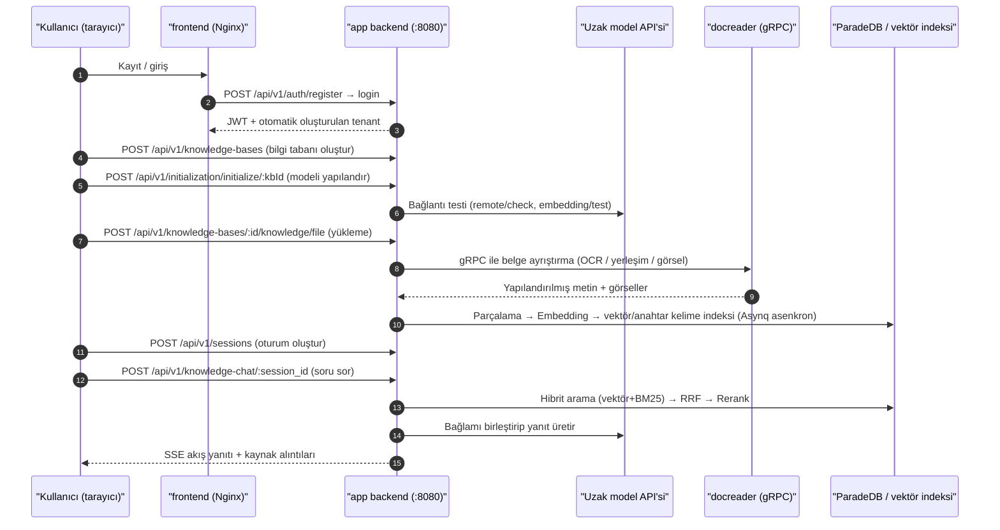

# Hızlı başlangıç

Hesap kaydedip bilgi tabanı oluşturup modelleri yapılandırarak, belgeleri yükleyerek ve sorular sorarak ilk bilgi tabanı soru-cevap işlemini tamamlayabilir, yanıtlarda kaynak metin alıntılarını görüntüleyebilirsiniz. Aşağıdaki adımlar Web arayüzünü kullanır; makalenin sonunda karşılık gelen API örnekleri sunulmuştur.

Kullanmadan önce [kurulum ve dağıtımı](02-installation.md) tamamlamalı, kullanılabilir bir konuşma modeli ve vektör modeli hazırlamalısınız.

## Başlamadan önce {#baslamadan-once}

- Hizmeti başlatın: [kurulum ve dağıtım](./02-installation.md) adımlarına göre başlattıktan sonra ön yüz `http://localhost`, arka yüz ise `http://localhost:8080` adresindedir;
- Arka yüz sağlık durumunu kontrol edin: `curl http://localhost:8080/health`, `{"status":"ok"}` döndürür.

## Kaydolma ve oturum açma {#kaydolma-ve-oturum-acma}

İlk erişimde oturum açma sayfası görüntülenir. Dağıtım herkese açık kayda (`self_serve`) izin veriyorsa sayfada kayıt sekmesi görünür; sistemde varsayılan hesap yoktur. Varsayılan yapılandırmada kayıt, kişisel bir çalışma alanı oluşturur ve yeni kullanıcıyı bu alanın Sahibi yapar.

<Screenshot
  src="/screenshots/quickstart-register.png"
  caption="İlk erişimdeki kayıt sayfası"
  hint="Kayıt formunu (kullanıcı adı / e-posta / parola) ve oturum açma girişini göstermek yeterlidir." />

Kayıt gereksinimleri ve dağıtım farklılıkları:

- Kullanıcı adı 2–50 karakter olmalıdır; parola 8–32 karakterden oluşmalı ve en az bir harf ile bir rakam içermelidir. Karmaşık parola ilkesi etkinleştirildiğinde ayrıca büyük ve küçük harflerle özel karakterler de içermelidir; arayüz ve API aynı ilkeyi kullanır;
- Ekip dağıtımları herkese açık kaydı kapatabilir ve sonrasında üyeleri davet bağlantılarıyla ekleyebilir. `DISABLE_REGISTRATION=true` ayarlanabilir (başlangıçta kayıt modunu zorla `invite_only` yapar) veya sistem yöneticisi «Ayarlar → Sistem» bölümünde `auth.registration_mode` değerini `invite_only` olarak değiştirebilir (hemen geçerli olur, yeniden başlatma gerekmez);
- Dağıtım varsayılan alan ilkesini `tenantless` (`auth.default_tenant_mode`) olarak ayarladıysa, kayıttan sonra otomatik olarak alan oluşturulmaz; bunun yerine `/onboarding/workspace` sayfasına yönlendirilir ve devam etmeden önce kendi alanınızı oluşturmanız veya daveti kabul ederek bir alana katılmanız gerekir;
- Lite tek ikili sürümüne tarayıcı üzerinden erişilir; yine de kayıt ve oturum açma gerekir.

::: tip Alan ve platform izinleri
Alan Sahibi, bulunduğu alandaki üyeleri, modelleri ve bilgi tabanlarını yönetir. Genel sistem ayarları, platform görev kuyruğu ve alanlar arası denetim için sistem yöneticisi yetkisi gerekir; bu iki yetki türü birbirinden bağımsız olarak verilir.

Sistem yöneticisini ilk kez ayarlarken önce bir hesap kaydedin, ardından app hizmeti için `RETHRA_BOOTSTRAP_SYSTEM_ADMIN_EMAIL=<bu hesabın e-posta adresi>` yapılandırmasını ekleyip yeniden başlatın. Bu işlem yalnızca dağıtımda henüz sistem yöneticisi yoksa geçerlidir. Tüm adımlar ve sınırlamalar için [platform yönetimi ve sistem yöneticisi](../03-features/20-platform-admin.md) bölümüne bakın.
:::

## Bilgi tabanı oluşturma ve model yapılandırma {#bilgi-tabani-olusturma-ve-model-yapilandirma}

«Bilgi Tabanı» sayfasında bir bilgi tabanı oluşturduktan sonra, başlatma sihirbazı bu tabanda kullanılacak modelleri yapılandırmanız için yol gösterir. Her bilgi tabanı modelleri ayrı ayrı seçer.

1. «Bilgi Tabanı» sayfasında yeni oluştur seçeneğine tıklayın, adı girin ve türü belirleyin: `document` (normal belge tabanı) veya `faq` (soru-cevap çifti tabanı);
2. Açılan başlatma sihirbazında modelleri seçin:
   - **Konuşma modeli (LLM)**: Yanıt üretir;
   - **Vektör modeli (Embedding)**: Belgeleri vektörlere dönüştürür; değiştirildikten sonra dizinin yeniden oluşturulması gerekir;
   - Yeniden sıralama Rerank, görüntü anlama VLM, ses yazıya dökme ASR, bilgi grafiği çıkarma ve soru oluşturma; veri türüne ve kullanım gereksinimlerine göre yapılandırılabilir;
3. Model bağlantısının düzgün çalıştığını doğrulamak için sihirbazdaki "Test" düğmesini kullanın, ardından kaydedin.

<Screenshot
  src="/screenshots/quickstart-init-wizard.png"
  caption="Başlatma sihirbazı: bilgi tabanı için sohbet modeli ve vektör modeli seçin" />

## Belge yükleme {#belge-yukleme}

Bilgi tabanına girdikten sonra dosyaları sürükleyin veya bir web sayfası URL'si yapıştırın. Yükleme onay iletişim kutusunda, bu dosya grubu için etiketler ve ayrıştırma seçenekleri ayarlayabilirsiniz.

Desteklenen biçimler arasında PDF, Word, Excel, PPT, Markdown, HTML, EPUB, görseller ve ses dosyaları bulunur; tam liste için [Belge ayrıştırma hizmeti](../03-features/03-document-parsing.md) sayfasına bakın.

<Screenshot
  src="/screenshots/quickstart-upload.png"
  caption="Yükleme onay iletişim kutusu: dosya seçme, etiketleme ve ayrıştırma seçeneklerini ayarlama"
  hint="Yüklenecek dosyaların listesini, etiket seçimini ve ayrıştırma motoru seçeneklerini gösterir." />

Yüklemeden sonra belgeler eşzamanlı olmayan şekilde ayrıştırılır; durumlar sırasıyla `pending → processing → finalizing → completed` olur. Taranmış PDF'ler ve büyük dosyalar biraz daha uzun sürebilir; liste sayfası ilerlemeyi gerçek zamanlı yeniler.

<Screenshot
  src="/screenshots/quickstart-document-list.png"
  caption="Belge listesi: üç belgenin ayrıştırması tamamlandı"
  hint="Belge adı, türü, ayrıştırma durumunun "tamamlandı" olması, parça sayısı gibi sütunları gösterir." />

## Soru sorma {#soru-sorma}

Sohbet sayfasına girip bilgi tabanını seçtikten sonra soru sorabilirsiniz. Varsayılan "Hızlı soru-cevap" ajanı ilgili parçaları getirir ve yanıt oluşturur; kaynağı görüntülemek için alıntıya tıklayın.

<Screenshot
  src="/screenshots/quickstart-chat.png"
  caption="Bilgi soru-cevap: yanıt ve tıklanabilir kaynak alıntıları"
  hint="Bir soru-cevap turunu, yanıt metnindeki alıntı işaretlerini ve açılmış alıntı kaynak panelini gösterir." />

Yanıt normal şekilde görüntüleniyor ve alıntılar açılabiliyorsa, bu belgenin bilgi tabanına eklenmesi ve soru-cevap akışı tamamlanmış demektir.

## Yapılandırmaya devam {#yapilandirmaya-devam}

- [Ajanları yapılandırın](../03-features/07-agent.md): Çok adımlı soruları işlemek için akıllı çıkarım kullanın; gerektiğinde web aramasını ve MCP araçlarını etkinleştirin.
- [Parçalamayı](../03-features/04-chunking.md) ve [getirme parametrelerini](../03-features/05-retrieval-engines.md) ayarlayın: Yapılandırmayı belge yapısına ve getirme sonuçlarına göre düzenleyin.
- [Veri kaynaklarına bağlanın](../03-features/10-datasource.md): Lark, Notion, Yuque veya RSS içeriklerini sürekli eşitleyin.
- [IM entegrasyonu](../03-features/12-im-integration.md) veya [web sayfasına gömme](../03-features/13-embed-channel.md) kullanın: Kullanıcıların mevcut kanallar üzerinden soru sormasını sağlayın.

## İlk soru-cevabı API ile tamamlama {#ilk-soru-cevabi-api-ile-tamamlama}

Aşağıdaki örnek, API'yi kayıt, oturum açma, bilgi tabanı oluşturma, model başlatma, yükleme ve soru-cevap sırasıyla çağırır. Yolların tümü `/api/v1` önekini kullanır; Bash, curl ve jq gerektirir. Oturum açan hesap çalışma alanına zaten eklenmiş olmalıdır; oturum açma yanıtında `active_tenant` yoksa önce bir alan oluşturun veya bir alana katılın, ardından yeniden oturum açın.

```bash
BASE=http://localhost:8080/api/v1

# 1) Kayıt olun (ilk dağıtımda; kullanıcı adı 2–50 karakter; parola 8–32 karakter olmalı, harf ve rakam içermeli; karmaşıklık politikası ayrıca kural koyabilir)
curl -s -X POST $BASE/auth/register -H "Content-Type: application/json" \
  -d '{"username":"admin","email":"admin@example.com","password":"pass123456"}'

# 2) Giriş yapın; JWT'yi ve geçerli çalışma alanı ID'sini kaydedin (daha sonra API Key oluştururken kullanılır)
LOGIN_RESPONSE=$(curl -s -X POST $BASE/auth/login -H "Content-Type: application/json" \
  -d '{"email":"admin@example.com","password":"pass123456"}')
TOKEN=$(printf '%s\n' "$LOGIN_RESPONSE" | jq -r '.token')
TENANT_ID=$(printf '%s\n' "$LOGIN_RESPONSE" | jq -r '.active_tenant.id')
AUTH="Authorization: Bearer $TOKEN"

# 3) Bilgi tabanı oluşturun
KB_ID=$(curl -s -X POST $BASE/knowledge-bases -H "$AUTH" -H "Content-Type: application/json" \
  -d '{"name":"Bilgi tabanım","description":"demo","type":"document"}' | jq -r '.data.id')

# 4) Uzak modeli yapılandırın (YOUR_OPENAI_API_KEY değerini gerçek anahtarla değiştirin)
curl -s -X POST $BASE/initialization/initialize/$KB_ID -H "$AUTH" -H "Content-Type: application/json" -d '{
  "llm":       {"source":"remote","modelName":"gpt-4o-mini","baseUrl":"https://api.openai.com/v1","apiKey":"YOUR_OPENAI_API_KEY"},
  "embedding": {"source":"remote","modelName":"text-embedding-3-small","baseUrl":"https://api.openai.com/v1","apiKey":"YOUR_OPENAI_API_KEY","dimension":1536},
  "rerank":    {"enabled":false},
  "multimodal":{"enabled":false},
  "documentSplitting":{"chunkSize":512,"chunkOverlap":50,"separators":["\n\n","\n","。"]},
  "nodeExtract":{"enabled":false},
  "questionGeneration":{"enabled":false}}'

# 5) Belge yükleyin (multipart, alan adı file)
curl -s -X POST $BASE/knowledge-bases/$KB_ID/knowledge/file -H "$AUTH" \
  -F "file=@./demo.pdf"
# Ayrıştırma durumunu yoklayın: parse_status=completed olana kadar GET /knowledge-bases/$KB_ID/knowledge

# 6) Oturum oluşturun
SESSION_ID=$(curl -s -X POST $BASE/sessions -H "$AUTH" -H "Content-Type: application/json" \
  -d '{"title":"İlk sohbet"}' | jq -r '.data.id')

# 7) Bilgi tabanlı soru-cevap (SSE akış çıktısı)
curl -N -X POST $BASE/knowledge-chat/$SESSION_ID -H "$AUTH" -H "Content-Type: application/json" \
  -d '{"query":"Bu belge ne anlatıyor?","knowledge_base_ids":["'$KB_ID'"]}'

# 7b) Agent sohbeti (bu da SSE; agent_id olarak yerleşik builtin-smart-reasoning kullanılabilir)
curl -N -X POST $BASE/agent-chat/$SESSION_ID -H "$AUTH" -H "Content-Type: application/json" \
  -d '{"query":"Belgenin ana noktalarını özetle ve dayanaklarını listele","agent_enabled":true,"agent_id":"builtin-smart-reasoning","knowledge_base_ids":["'$KB_ID'"]}'

# 8) Yalnızca arama, üretim yok (yapılandırılmış JSON sonucu)
curl -s -X POST $BASE/knowledge-search -H "$AUTH" -H "Content-Type: application/json" \
  -d '{"query":"anahtar kelime","knowledge_base_ids":["'$KB_ID'"]}'
```

Soru-cevap istek gövdesi ayrıca `knowledge_ids` (tek belgeyle sınırlama), `web_search_enabled`, `summary_model_id`, `mcp_service_ids`, `skill_names`, `images` / `attachment_uploads` (çok modlu ekler) gibi alanları da destekler; ayrıntılı açıklama için [API referansı: oturumlar ve sohbet](../04-api/02-api-chat.md) sayfasına bakın.

### Üç kimlik doğrulama yöntemi

| Yöntem | İstek başlığı | Uygun kullanım |
| --- | --- | --- |
| JWT | `Authorization: Bearer <token>` | Tarayıcı / etkileşimli çağrılar, oturum açma arayüzü tarafından verilir |
| API Anahtarı | `X-API-Key: <key>` | Sunucu tarafı entegrasyonu; «Alan Ayarları» bölümünden veya `POST /api/v1/tenants/:id/api-keys` ile oluşturulur, ayrıntılı yetenekleri (`retrieve`/`chat`/`ingest`/`manage_kbs` vb.) destekler |
| Belirli alan | `X-Tenant-ID: <id>` | Çok alanlı kullanıcıların geçerli çalışma alanını değiştirmesi |

Sunucu tarafı entegrasyonlarında JWT yerine API Anahtarı kullanılması önerilir:

```bash
# Geçerli çalışma alanının Owner'ı olarak API Key oluşturun (TENANT_ID giriş adımında alınmıştı)
curl -s -X POST $BASE/tenants/$TENANT_ID/api-keys -H "$AUTH" -H "Content-Type: application/json" \
  -d '{"name":"ci-bot","full_access":true}'
# Bundan sonraki tüm isteklerde şunu kullanın:
curl -s $BASE/knowledge-bases -H "X-API-Key: <oluştururken dönen key>"
```

### Başlatma sihirbazına karşılık gelen arayüzler

Arayüzdeki sihirbazın her adımının ayrı bir uç noktası vardır; kendi yönetim arayüzünüzü oluştururken bunları doğrudan yeniden kullanabilirsiniz:

| Adım | Uç nokta | Açıklama |
| --- | --- | --- |
| Geçerli yapılandırmayı oku | `GET /api/v1/initialization/config/:kbId` | llm / embedding / rerank / multimodal / documentSplitting / nodeExtract / questionGeneration bölümlerini ve `hasFiles` değerini döndürür (`hasFiles` mevcut dosyalar olduğunda embedding değişikliğini sınırlar) |
| Uzak modeli test et | `POST /api/v1/initialization/remote/check`, `/initialization/embedding/test`, `/initialization/rerank/check`, `/initialization/asr/check`, `/initialization/multimodal/test` | Kaydetmeden önce bağlantı doğrulaması |
| Bilgi grafiği deneme çıkarımı | `POST /api/v1/initialization/extract/text-relation` (`fabri-text` / `fabri-tag` ile örnek oluşturma) | Varlık/ilişki çıkarım sonucunu önizle |
| Yapılandırmayı kaydet | `POST /api/v1/initialization/initialize/:kbId` (ilk kez) / `PUT /api/v1/initialization/config/:kbId` (güncelleme) | Veritabanına yazar: Model kaydı oluşturur/günceller ve KnowledgeBase yapılandırmasını yazar |


### Tüm akışta neler olur



## Takıldıysanız buraya bakın {#takildiysaniz-buraya-bakin}

| Belirti | Kontrol noktası |
| --- | --- |
| Yüklemeden sonra sürekli `processing` | `docker logs Rethra-docreader`; büyük dosyalar `MAX_FILE_SIZE_MB` (varsayılan 50) ve `RETHRA_DOCUMENT_PROCESS_TIMEOUT` (varsayılan 2h) ile sınırlıdır |
| Soru-cevapta alıntı yok / geri çağırma boş | Bilgi ayrıştırmasının `completed` olduğunu doğrulayın; `vector_threshold` değerini düşürün; embedding modelinin bilgi tabanı oluşturulurken kullanılanla aynı olduğunu kontrol edin |
| Kayıt sekmesi kayboluyor | `GET /auth/config` içindeki `registration_mode` değerini kontrol edin. Değer yalnızca `DISABLE_REGISTRATION` değil, «Ayarlar → Sistem» içindeki veritabanı ayarlarından da gelebilir; davet bağlantısı ve ilk OIDC oturum açması ayrı iki yoldur ve bundan etkilenmez |
| API Anahtarı isteği 403 | Anahtarın capabilities alanı gerekli yeteneği içermiyor veya `knowledge_base_ids` izin listesi hedef bilgi tabanını içermiyor |

Sonraki adım: Ayrıntıları ayarlamak için [yapılandırma ayrıntılarına](./04-configuration.md), sistemin nasıl çalıştığını öğrenmek için [genel mimariye](../02-architecture/01-overview.md) bakın.
