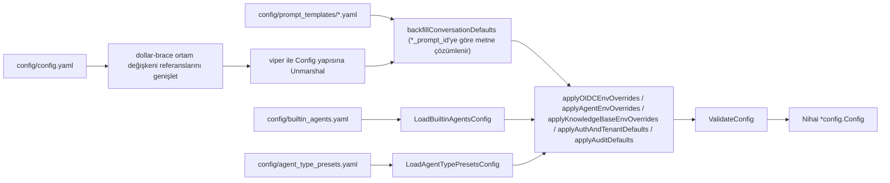

# Yapılandırma Ayrıntıları

Rethra yapılandırması dört katmandan oluşur, **öncelik düşükten yükseğe**:

| Katman | Konum | Amaç |
| --- | --- | --- |
| Ana yapılandırma dosyası | `config/config.yaml` | İmajla dağıtılan yapılandırılmış varsayılan değerler |
| Şablon / ön ayar | `config/prompt_templates/*.yaml`, `builtin_agents.yaml`, `agent_type_presets.yaml`, `builtin_models.yaml`, `models.json` | İstemler, yerleşik ajanlar, yerleşik modeller ve model sağlayıcısı kataloğu için katmanlı eklemeler |
| Ortam değişkenleri | `.env` / kapsayıcı environment | Dağıtım düzeyinde geçersiz kılmalar; değişiklikten sonra yeniden başlatma gerekir |
| Çalışma zamanı sistem ayarları | Veritabanındaki `system_settings` tablosu, arayüzde «Ayarlar → Sistem» | Desteklenen ayarlar çevrim içi değiştirilebilir, ortam değişkenlerinden önceliklidir; çoğu hemen etkili olur |

Kayıt modu, alan politikaları ve kotalar, SSRF izin listesi, görev eşzamanlılığı ve model eşzamanlılığı üst sınırları çalışma zamanında yapılandırmayı destekler. Konsolda değiştirildikten sonra veritabanındaki değer ortam değişkenlerinden önceliklidir; yalnızca ayar öğesi sıfırlandığında (`DELETE /api/v1/system/admin/settings/:key`) ortam değişkenleri veya yerleşik varsayılan değerler yeniden kullanılır. Ortam değişkenlerinin neden etkili olmadığını incelerken önce bu öğe için mevcut bir çalışma zamanı yapılandırması olup olmadığını kontrol edin. Tüm ayarlar için bkz. [Platform yönetimi ve sistem yöneticileri](../03-features/20-platform-admin.md).

Ana yapılandırma yapısı `internal/config/config.go` içinde tanımlanır. Her yapılandırmanın ve ortam değişkeninin anlamı, varsayılan değeri ve etkinleşme koşulları aşağıdadır.

## Yapılandırma yükleme mekanizması

`internal/config/config.go` içindeki `LoadConfig()` akışı:

1. viper, `config.yaml` dosyasını sırayla arar: geçerli dizin → `./config` → `$HOME/.appname` → `/etc/appname/`;
2. **Ortam değişkeni genişletme**: Dosya içeriğine düzenli ifade ile değiştirme uygulanır; `${ENV_VAR}`, aynı adlı ortam değişkeninin değeriyle değiştirilir; değişken ayarlanmamışsa `${ENV_VAR}` değişmez metin olarak korunur (yapılandırma hatalarını görünür kılmak için);
3. viper, `AutomaticEnv()` işlevini etkinleştirir ve `.` anahtar ayırıcısını `_` olarak eşler (yani `server.port`, `SERVER_PORT` ortam değişkeniyle geçersiz kılınabilir);
4. İstem şablonları `config/prompt_templates/*.yaml` dosyasından yüklenir ve `xxx_prompt_id` alanına göre conversation yapılandırmasına **geri doldurulur** (`backfillConversationDefaults`);
5. `builtin_agents.yaml` (yerleşik ajanlar) ve `agent_type_presets.yaml` (ajan türü ön ayarları) yüklenir, bunlardaki `system_prompt_id` başvuruları çözümlenir;
6. Ortam değişkeni geçersiz kılmaları uygulanır (OIDC, ajan, KnowledgeBase, Auth/Tenant, Audit grupları) ve `ValidateConfig` doğrulaması yürütülür.



## `config/config.yaml` bölüm bölüm açıklama

### server (`ServerConfig`)

| Ad | Tür | Varsayılan değer | Açıklama |
| --- | --- | --- | --- |
| `server.port` | int | 8080 | HTTP dinleme bağlantı noktası, doğrulama aralığı 1–65535 |
| `server.host` | string | "0.0.0.0" | Dinleme adresi |
| `server.log_path` | string | Boş | Günlük dosyası yolu (`LOG_PATH` ortam değişkeni de kullanılabilir) |
| `server.shutdown_timeout` | duration | 30s | Zarif durdurma için toplam süre bütçesi. Bağlantı boşaltma ve kaynak temizleme bu süreyi paylaşır; varsayılan olarak temizleme için 5s ayrılır |

### conversation (`ConversationConfig`) ——arama ve soru-cevap hattı

| Ad | Tür | Varsayılan değer (`config.yaml`) | Açıklama |
| --- | --- | --- | --- |
| `max_rounds` | int | 5 | Taşınan çok turlu geçmiş tur sayısı |
| `keyword_threshold` | float | 0.3 | Anahtar kelime araması için minimum puan |
| `embedding_top_k` | int | 30 | Vektör aramasında geri getirilecek sonuç sayısı (>=0) |
| `vector_threshold` | float | 0.2 | Vektör benzerliği eşiği (0–1) |
| `rerank_top_k` | int | 30 | Yeniden sıralama sonrası tutulacak sonuç sayısı |
| `rerank_threshold` | float | 0.3 | Yeniden sıralama minimum puanı (-10–10) |
| `fallback_strategy` | string | "model" | Geri getirilen sonuç boş olduğunda strateji: `model` (modelin devralmasına izin ver) veya sabit yanıt |
| `fallback_response` | string | "Sorry, I am unable to answer this question." | Sabit yedek yanıt metni |
| `enable_rewrite` | bool | true | Çok turlu gönderim çözümleme / sorgu yeniden yazımı |
| `enable_query_expansion` | bool | true | Sorgu genişletme |
| `enable_rerank` | bool | true | Rerank'i etkinleştir |
| `fallback_prompt_id` | string | "default_fallback_prompt" | Yedek prompt şablonu ID'si (`prompt_templates/fallback.yaml`, mode:"model") |
| `rewrite_prompt_id` | string | "default_rewrite" | Yeniden yazım şablonu ID'si (content sistem tarafı + user kullanıcı tarafı içerir) |
| `generate_summary_prompt_id` | string | "default_summary" | Belge profili şablonu ID'si (kısa özet + gist/tema/tür/tipik sorular, JSON çıktısı) |
| `generate_kb_description_prompt_id` | string | "default_kb_description" | Bilgi tabanı açıklama şablonu ID'si (girdi belge profili birleşimidir, belge gövdesi değildir) |
| `generate_session_title_prompt_id` | string | "default_session_title" | Oturum başlığı oluşturma şablonu ID'si |
| `extract_entities_prompt_id` / `extract_relationships_prompt_id` | string | "default_extract_entities" / "default_extract_relationships" | Grafik çıkarma şablonu ID'si (`graph_extraction.yaml`) |
| `generate_questions_prompt_id` | string | "default_generate_questions" | Önceden soru oluşturma şablonu ID'si |

`conversation.summary` (`SummaryConfig`, yanıt oluşturma parametreleri):

| Ad | Tür | Varsayılan değer | Açıklama |
| --- | --- | --- | --- |
| `max_input_chars` | int | 8192 | LLM'ye gönderilecek maksimum karakter sayısı. Belge profilinde temayı belirlemek için yalnızca belgenin başlangıcı yeterlidir, 8k yeterlidir; eski 16384/24576 değerleri belge başına özet maliyetini katlayarak artırır |
| `temperature` | float | 0.3 | Oluşturma sıcaklığı |
| `repeat_penalty` | float | 1.0 | Tekrar cezası |
| `max_completion_tokens` | int | 1024 | Maksimum oluşturma token sayısı (profil JSON'sindeki tüm alanlar çok kısadır) |
| `no_match_prefix` | string | `<think>\n</think>\nNO_MATCH` | Model çıktısı bu önekle başladığında "eşleşme yok" olarak değerlendirilir ve fallback tetiklenir |
| `prompt_id` | string | "default_kb" | Sistem Prompt şablonu ID'si (`system_prompt.yaml`) |
| `context_template_id` | string | "default_context" | Bağlam birleştirme şablonu kimliği (`context_template.yaml`) |
| `max_tokens` / `top_k` / `top_p` / `frequency_penalty` / `presence_penalty` / `seed` / `thinking` | Çeşitli | Ayarlanmamış | Modele iletilen isteğe bağlı örnekleme parametreleri; `thinking`, düşünme modunu denetleyen bir `*bool` değeridir |

### knowledge_base (`KnowledgeBaseConfig`) ——genel varsayılan parçalama

| Ad | Tür | Varsayılan değer | Açıklama |
| --- | --- | --- | --- |
| `chunk_size` | int | 512 | Varsayılan parça boyutu (>0 ve overlap değerinden büyük) |
| `chunk_overlap` | int | 50 | Parça çakışması |
| `split_markers` | []string | `["\n\n", "\n", "。"]` | Bölme işaretleri (`。` Çince tam noktadır) |
| `keep_separator` | bool | false | Ayırıcıyı koru |
| `document_process_timeout` | duration | 2h | Tek belge işleme görevi için toplam zaman aşımı (env `RETHRA_DOCUMENT_PROCESS_TIMEOUT` ile geçersiz kılınabilir) |
| `docreader_call_timeout` | duration | 30m | Tek bir DocReader RPC zaman aşımı (env `RETHRA_DOCREADER_CALL_TIMEOUT`); önceki değerden küçük olmalıdır |
| `image_processing.enable_multimodal` | bool | true | Yükleme sırasında görüntü çok modlu işleme özelliğini etkinleştirir (OCR/Caption) |

> Her bilgi tabanının `ChunkingConfig` değeri buradaki genel varsayılanları geçersiz kılar.

### extract (`ExtractManagerConfig`) ——bilgi grafiği çıkarma şablonları

`extract.extract_graph` / `extract.extract_entity` / `extract.fabri_text`; grafik çıkarımının açıklama metnini (`description`), izin verilen ilişki etiketlerini (`tags`, varsayılan olarak `Author` ve `Alias`) ve few-shot örneklerini (`examples`: `text` + `node` + `relation`) tanımlar. Başlatma sihirbazındaki "Deneme çıkarımı / örnek metin oluştur" işlevi bu yapılandırmaları kullanır (`fabri_text.with_tag` / `with_no_tag` içindeki `%s`, etiket listesiyle değiştirilir).

### tenant (`TenantConfig`)

| Ad | Tür | Varsayılan değer | Açıklama |
| --- | --- | --- | --- |
| `enable_cross_tenant_access` | bool | false | `CanAccessAllTenants` yetkisine sahip kullanıcıların alanlar arası erişimine izin verir (iç ağda etkinleştirilebilir) |
| `enable_rbac` | *bool | true | Alan rolleri için zorunlu yetkilendirme; açıkça `false` değeri kademeli moduna geçer, alan içindeki rol denetimleri yalnızca kaydedilir ve engellenmez, alanlar arası erişim ise yine engellenir (env `RETHRA_TENANT_ENABLE_RBAC`) |
| `max_owned_per_user` | int | 0 (handler varsayılanı kullanılır) | Süper yönetici olmayan tek bir kullanıcının oluşturabileceği alan sayısı üst sınırı; <0 sınırı kapatır (env `RETHRA_TENANT_MAX_OWNED_PER_USER`) |
| `self_service_creation_enabled` | *bool | true | Normal kullanıcıların kendi alanlarını oluşturup oluşturamayacağı (env `RETHRA_TENANT_SELF_SERVICE_CREATION_ENABLED`) |
| `default_session_name` / `default_session_title` / `default_session_description` | string | Boş | Yeni oturum varsayılan metinleri |

### Yapının desteklediği ancak varsayılan dosyada yer almayan bölümler

Aşağıdaki bölümler `Config` yapısında bulunur ve gerektiğinde `config.yaml` dosyasına eklenebilir (çoğunun ortam değişkeni girişi de vardır):

| Bölüm | Yapı | Temel alanlar ve varsayılan değerler |
| --- | --- | --- |
| `auth` | `AuthConfig` | `registration_mode`: `self_serve` (varsayılan) / `invite_only` (`DISABLE_REGISTRATION=true` olduğunda zorunlu); `default_tenant_mode`: `create_personal` (varsayılan) / `tenantless` |
| `audit` | `AuditConfig` | `retention_days`: denetim günlüklerinin saklanma gün sayısı; bölüm atlandığında varsayılan 90'dır; 0 temizlemeyi devre dışı bırakır; <0 doğrulama hatası verir (env `RETHRA_AUDIT_RETENTION_DAYS`) |
| `oidc_auth` | `OIDCAuthConfig` | `enable`, `issuer_url`, `jwks_uri`, `discovery_url` (varsayılan olarak issuer ile `/.well-known/openid-configuration` birleştirilir), `client_id`, `client_secret`, `authorization_endpoint`, `token_endpoint`, `user_info_endpoint`, `scopes` (varsayılan `openid profile email`), `user_info_mapping.username` (varsayılan `name`)/`email` (varsayılan `email`); tümü `OIDC_AUTH_*` ortam değişkenleriyle geçersiz kılınabilir |
| `agent` | `AgentConfig` | `llm_call_timeout`: tek bir LLM çağrısı için zaman aşımı saniyesi (varsayılan 120, env `RETHRA_AGENT_LLM_TIMEOUT`); `tool_approval_timeout_seconds`: MCP aracı için insan onayı bekleme süresi (varsayılan 600, env `RETHRA_AGENT_TOOL_APPROVAL_TIMEOUT`) |
| `im` | `IMConfig` | IM kanalı soru-cevap eşzamanlılığı: `workers` (5), `global_max_workers` (0=sınırsız, Redis gerekir), `max_queue_size` (50), `max_per_user` (3), `rate_limit_window` (60s), `rate_limit_max` (10) |
| `docreader` | `DocReaderConfig` | `addr` (ör. `docreader:50051` gibi gRPC adresi veya HTTP temel URL'si), `transport`: `grpc` (varsayılan) / `http`; genellikle env `DOCREADER_ADDR` / `DOCREADER_TRANSPORT` kullanılır |
| `vector_database` | `VectorDatabaseConfig` | `driver` (genellikle env `RETRIEVE_DRIVER` kullanılır) |
| `stream_manager` | `StreamManagerConfig` | `type`: `memory` / `redis`; `redis.address/username/password/db/prefix/ttl`; `cleanup_timeout` (genellikle env `STREAM_MANAGER_TYPE`, `REDIS_*` kullanılır) |
| `web_search` | `WebSearchConfig` | `timeout`: Web araması zaman aşımı saniyesi |
| `models` | `[]ModelConfig` | Eski statik model listesi (`type`/`source`/`model_name`/`parameters`); artık `builtin_models.yaml` veya arayüz yapılandırması önerilir |
| `frontend_base_url` | string | Boş | Davetler gibi mutlak bağlantılar oluşturmak için SPA dış origin'i (env `FRONTEND_BASE_URL`) |

## Önemli ortam değişkenleri

Aşağıdaki değişkenler `docker-compose.yml` içindeki app/docreader `environment` bölümü, `.env.example` ve koddaki `os.Getenv` kaynaklıdır. Üretim dağıtımında en azından şunlar değiştirilmelidir: `DB_USER/DB_PASSWORD/DB_NAME`, `REDIS_PASSWORD`, `JWT_SECRET`, `SYSTEM_AES_KEY`.

### Çalışma zamanı temelleri

| Ad | Varsayılan değer | Açıklama |
| --- | --- | --- |
| `GIN_MODE` | release | `debug` geliştirme modu (Swagger etkin) / `release` üretim |
| `LOG_LEVEL` / `LOG_PATH` / `LOG_FORMAT` | debug / boş / boş | Günlük seviyesi, dosya yolu (boşsa yalnızca stdout), özel biçim |
| `LLM_DEBUG_LOG` | false | true olduğunda `LOG_PATH` ile aynı dizine `llm_debug.log` yazılır |
| `TZ` | Europe/Istanbul | Saat dilimi |
| `DEFAULT_LOCALE` | boş | Ön yüz arayüzü varsayılan dili (frontend kapsayıcısı okur): `en-US` / `tr-TR`; geçersiz değerler yok sayılır. Yalnızca dili elle değiştirmemiş kullanıcıları etkiler; öncelik: kullanıcının seçtiği dil > bu değişken > `tr-TR`; değiştirdikten sonra frontend kapsayıcısını yeniden başlatmak yeterlidir, imajın yeniden oluşturulması gerekmez |
| `RETHRA_LANGUAGE` | boş | Belge işleme dili (soru/özet oluşturma). Öncelik: bu değişken > isteğin `Accept-Language` değeri > yerleşik `tr-TR`. Belge işleme dili arayüz dili ayarından bağımsız olabilir; örneğin İngilizce arayüzle Korece belgeler işlenebilir. Yanıt dili ayarlanmamış IM kanalları da varsayılan yanıt dili olarak bu değişkeni (ayarlanmamışsa `tr-TR`) kullanır |
| `AUTO_MIGRATE` | true | Başlangıçta veritabanı geçişlerini otomatik olarak çalıştırır |
| `AUTO_RECOVER_DIRTY` | true | golang-migrate'in dirty durumunu (önceki kesintiye uğramış geçişin bıraktığı durum) otomatik olarak düzeltir. Geçiş sorunları elle incelenirken geçici olarak false yapılmalıdır; aksi halde başlangıç, geçiş sürüm kaydını otomatik olarak yeniden yazar; bkz. [Veritabanı ve geçişler](../06-development/02-database-schema.md) |
| `RETHRA_TRUSTED_PROXIES` | boş | gin güvenilen proxy CIDR'leri (virgülle ayrılmış) |
| `MAX_SKILL_BUNDLE_SIZE_MB` | 256 MiB (varsayılan olarak MAX_FILE_SIZE_MB'den küçük değil, üst sınır 512 MiB) | Beceri ZIP yükleme ve kaynak indirme sınırı; ters proxy istek gövdesi sınırı da yeterince büyük olmalıdır |
| `MAX_FILE_SIZE_MB` | 50 | Dosya yükleme boyutu sınırı (app/frontend/docreader tarafından ortak kullanılır); Helm dağıtımında `global.maxFileSizeMB` kullanılır |
| `CONCURRENCY_POOL_SIZE` | 5 | Genel eşzamanlılık havuzu |
| `APP_EXTERNAL_URL` / `FRONTEND_BASE_URL` | boş | IM kanalı görselleri/dosyaları için harici erişilebilir URL / ön yüz harici origin |
| `RESOURCE_URL_MODE` | handle | API yanıtlarındaki dosya referanslarının varsayılan biçimi: `handle` dahili `resource://` döndürür, `public` doğrudan yüklenebilen süre sınırlı harici bağlantı döndürür. Tek bir istek için `?resource_urls=` ile geçersiz kılınabilir; ayrıntılar için bkz. [API Genel Bakış](../04-api/01-api-overview.md) |

`APP_EXTERNAL_URL`, IM kanalının bilgi tabanı görsellerini işleyip işleyemeyeceğini etkiler. IM platformunun herkese açık bir http(s) URL alması gerekir; iki seçenek vardır:

1. Depolama arka ucu zaten internetten erişilebilir olmalıdır (nesne depolamada genel endpoint kullanın veya `MINIO_ENDPOINT` değerini genel host olarak ayarlayın); bu durumda `resource://`, arka ucun önceden imzalanmış URL'sine geri döner ve bu değişkene gerek kalmaz;
2. `APP_EXTERNAL_URL` ayarlayın; `resource://` görselleri Rethra'nın kendisi üzerinden `<APP_EXTERNAL_URL>/r/<token>` olarak yeniden yazılır (`/r/` için nginx proxy gerekir; resmi ön yüz imajı bu location'ı zaten içerir).

Varsayılan MinIO iç ağ kurulumu ve `local` arka ucu yalnızca ikinci yöntemi kullanabilir. IM kanalı etkin olduğu halde bu değişken boşsa, hizmet başlangıçta bir kez WARN yazdırır; yeniden yazma sonucu http(s) URL değilse özgün referans korunur ve IM tarafının erişemeyeceği bağlantı gönderilmek yerine işlem yapılabilir bir uyarı kaydedilir.

Dört URL biçimi ve her kanalın bunları nasıl aldığı için bkz. [Görsellerin ve dosyaların dış erişimi](../03-features/21-file-access.md).

### Veritabanı ve kuyruk

| Ad | Varsayılan değer | Açıklama |
| --- | --- | --- |
| `DB_DRIVER` | postgres | `postgres` / `sqlite` (Lite) |
| `DB_HOST` / `DB_PORT` / `DB_USER` / `DB_PASSWORD` / `DB_NAME` | postgres / 5432 / boş / boş / boş | PostgreSQL bağlantısı (zorunlu) |
| `DB_PATH` | — | `DB_DRIVER=sqlite` olduğunda veritabanı dosyası yolu |
| `STREAM_MANAGER_TYPE` | boş (compose gerçekte redis kullanır) | `redis` / `memory` |
| `REDIS_ADDR` / `REDIS_USERNAME` / `REDIS_PASSWORD` / `REDIS_DB` / `REDIS_PREFIX` | redis:6379 / … | Redis bağlantısı |
| `REDIS_USE_TLS` | false | **TLS'yi etkinleştiren ana anahtar**; yönetilen Redis (ör. AWS ElastiCache) için açılması gerekir; `REDIS_TLS_SERVER_NAME`, doğrulama ve SNI için kullanılacak sunucu adını belirtir (adres IP olduğunda yararlıdır); `REDIS_TLS_INSECURE_SKIP_VERIFY` sertifika doğrulamasını atlar (güvenli değildir, yalnızca kendinden imzalı sertifikalı geliştirme ortamlarında kullanın) |
| `RETHRA_REDIS_NAMESPACE` | boş | Birden fazla dağıtımın Redis'i paylaşması durumunda kanal ad alanı son eki |
| `RETHRA_ASYNQ_CORE_CONCURRENCY` vb. | 8 / 2 / 12 / 4 / 6 | Asynq kuyruklarının eşzamanlılığı (core/postprocess/enrichment/maintenance/shared); ayrıca `RETHRA_WIKI_ASYNQ_CONCURRENCY=8`, `RETHRA_MODEL_MAX_CONCURRENCY=32` bulunur |

### Arama motoru ve vektör veritabanı

| Ad | Varsayılan değer | Açıklama |
| --- | --- | --- |
| `RETRIEVE_DRIVER` | postgres | Arama motoru: `postgres` / `elasticsearch_v7` / `elasticsearch_v8` / `qdrant` / `milvus` / `weaviate` / `opensearch` / `doris` / `tencent_vectordb` / `sqlite` (Lite); birden fazla motor paralel olarak virgülle ayrılabilir |
| `ELASTICSEARCH_ADDR/USERNAME/PASSWORD/INDEX` | boş | Elasticsearch |
| `QDRANT_HOST/PORT/COLLECTION/API_KEY/USE_TLS` | qdrant / 6334 / rethra_embeddings / boş / false | Qdrant |
| `MILVUS_ADDRESS/COLLECTION/METRIC_TYPE/...` | milvus:19530 / rethra_embeddings / IP | Milvus |
| `OPENSEARCH_ADDR/USERNAME/PASSWORD/INDEX/INSECURE_SKIP_VERIFY` | boş | OpenSearch |
| `WEAVIATE_HOST/GRPC_ADDRESS/SCHEME/AUTH_ENABLED/API_KEY` | boş | Weaviate |
| `DORIS_ADDR/HTTP_PORT/DATABASE/USERNAME/PASSWORD/TABLE_PREFIX/COMPAT_MODE` | boş | Apache Doris 4.1+ |
| `TENCENT_VECTORDB_ADDR/USERNAME/API_KEY/DATABASE/COLLECTION/REPLICA_NUMBER` | boş | Tencent Cloud VectorDB |
| `MULTI_STORE_RETRIEVE_TIMEOUT_SEC` | boş | Çok motorlu paralel arama zaman aşımı |
| `NEO4J_ENABLE` / `NEO4J_URI` / `NEO4J_USERNAME` / `NEO4J_PASSWORD` | boş / bolt://neo4j:7687 / neo4j / password | Bilgi grafiği için tek anahtar (`ENABLE_GRAPH_RAG`, v0.1.6'dan itibaren kullanımdan kaldırılmıştır) |

### Dosya depolama

| Ad | Varsayılan değer | Açıklama |
| --- | --- | --- |
| `STORAGE_TYPE` | local | `local` / `minio` / `cos` / `tos` / `s3` / `obs` / `oss` |
| `STORAGE_ALLOW_LIST` | boş | Kullanıcının seçmesine izin verilen depolama türleri beyaz listesi (virgülle ayrılır); isteğe bağlı değerler: `local`, `minio`, `cos`, `tos`, `s3`, `oss`, `ks3`, `obs` |
| `LOCAL_STORAGE_BASE_DIR` | /data/files | Yerel depolama kök dizini |
| `MINIO_ENDPOINT/ACCESS_KEY_ID/SECRET_ACCESS_KEY/BUCKET_NAME/USE_SSL` | minio:9000 / minioadmin / minioadmin / boş / false | MinIO |
| `COS_SECRET_ID/SECRET_KEY/REGION/BUCKET_NAME/APP_ID/PATH_PREFIX` | boş | Tencent Cloud COS (ayrıca TEMP_BUCKET/TEMP_REGION bulunur) |
| `S3_*` / `OBS_*` / `OSS_*` / `TOS_*` | `.env.example` dosyasının B4 bölümüne bakın | AWS S3 / Huawei OBS / Alibaba OSS / Volcengine TOS; tümü ENDPOINT/REGION/KEY/BUCKET/PATH_PREFIX ve benzerlerini içerir |

AWS S3 için `S3_ACCESS_KEY` / `S3_SECRET_KEY` **ikisi birden boş bırakılabilir**; bu durumda AWS SDK varsayılan kimlik bilgisi zinciri kullanılır ve EC2/ECS/EKS IAM Role, IRSA/Web Identity, ortam değişkenleri ile paylaşılan yapılandırma dosyaları desteklenir — AWS üzerinde dağıtım yaparken ortam değişkenlerine uzun ömürlü anahtarlar eklemeniz gerekmez. İkisi de birlikte doldurulmalı veya birlikte boş bırakılmalıdır. `S3_ENDPOINT` boş bırakılırsa Region'a karşılık gelen standart uç nokta kullanılır.

### Modeller ve çıkarım

| Ad | Varsayılan değer | Açıklama |
| --- | --- | --- |
| `BATCH_EMBED_SIZE` | boş | Toplu embedding boyutu |
| `VLM_HTTP_TIMEOUT_SECONDS` | 180 | VLM tek istek zaman aşımı |
| `BUILTIN_MODELS_CONFIG` | config/builtin_models.yaml | Yerleşik model bildirim dosyası yolu (aşağıya bakın) |
| `MODELS_CONFIG` | config/models.json | Model sağlayıcı dizini için dağıtım ekleme dosyası yolu (sağlayıcı ekler, adresleri veya model parametrelerini geçersiz kılar); biçim için bkz. [Model yönetimi](../03-features/06-models.md) |
| `RETHRA_LLM_STREAM_RAW_DUMP` / `_DIR` | boş | LLM akışı ham dökümü (sorun giderme için) |


### Kimlik doğrulama, kiracılar ve güvenlik

| Ad | Varsayılan değer | Açıklama |
| --- | --- | --- |
| `JWT_SECRET` | boş | JWT imzalama anahtarı (zorunlu; `openssl rand -hex 32` ile üretilebilir). Boş bırakıldığında veya örnek değer kullanıldığında her başlatmada rastgele üretilir; yeniden başlatma sonrasında oturum açmış kullanıcıların tekrar oturum açması gerekir; çoklu kopyalarda aynı değer yapılandırılmalıdır |
| `SYSTEM_AES_KEY` | boş | Hassas alanların diske yazılırken şifrelenmesi için AES-256 ana anahtarı; **mutlaka 32 bayt olmalıdır** (`openssl rand -hex 16` ile üretilebilir). Kaybedilirse şifrelenmiş veriler (kiracı API Key, model key, vektör veritabanı kimlik bilgileri vb.) kurtarılamaz; yükseltme sırasında önceki değer korunmalıdır. v0.4.0'dan itibaren `TENANT_AES_KEY`/`CRYPTO_MASTER_KEY`/`CRYPTO_SALT` yerine kullanılır |
| `SYSTEM_SIGNING_KEY` | boş (`SYSTEM_AES_KEY` kullanılır) | Gömülü oturumlar ve önceden imzalanmış dosya bağlantıları için imzalama anahtarı (`openssl rand -hex 32` ile üretilebilir). Ayarlanmadığında `SYSTEM_AES_KEY` kullanılır; ikisi de eksikse, uzunlukları 16'dan azsa veya örnek değerlerse imzalı bağlantılar ve gömülü oturumlar oluşturulamaz. Değiştirildikten sonra daha önce oluşturulmuş bağlantılar geçersiz olur; çoklu kopyalar aynı değeri kullanmalıdır |
| `DISABLE_REGISTRATION` | false | true olduğunda `registration_mode=invite_only` zorunlu kılınır |
| `RETHRA_AUTH_DEFAULT_TENANT_MODE` | create_personal | Kayıttan sonra alan oluşturma politikası (`create_personal` / `tenantless`) |
| `RETHRA_TENANT_ENABLE_RBAC` | (varsayılan true) | Alan rolleri için zorunlu yetkilendirme anahtarı |
| `RETHRA_TENANT_ENABLE_CROSS_TENANT_ACCESS` | false | Alanlar arası erişim |
| `RETHRA_TENANT_SELF_SERVICE_CREATION_ENABLED` | true | Normal kullanıcıların kendi alanlarını oluşturması |
| `RETHRA_TENANT_MAX_OWNED_PER_USER` | boş | Kullanıcı başına oluşturulabilecek alan sınırı |
| `RETHRA_TENANT_AUTO_CREATE_API_KEY` | false | Alan oluşturulurken full_access API Key otomatik verilir (eski davranışla uyumlu) |
| `RETHRA_TENANT_DEFAULT_STORAGE_QUOTA_GB` | 10 | Yeni alanlar için varsayılan depolama kotası |
| `RETHRA_AUTH_COMPLEX_PASSWORD_ENABLED` | false | Karmaşık parola politikası: büyük/küçük harfler, rakamlar, özel karakterler; `auth.complex_password_enabled` sistem ayarı önceliklidir |
| `RETHRA_TENANT_AUTO_ACCEPT_INVITATION` | false | E-posta davetiyle mevcut hesabın doğrudan katılması; `tenant.auto_accept_invitation` sistem ayarı önceliklidir |
| `OIDC_AUTH_JWKS_URI` | boş | id_token imza doğrulama açık anahtar kümesi; discovery üzerinden tamamlanabilir, issuer/audience/geçerlilik süresi ile birlikte doğrulanır |
| `RETHRA_INVITATION_TTL` | 168h | Davet bağlantısının geçerlilik süresi |
| `RETHRA_AUDIT_RETENTION_DAYS` | 90 | Denetim günlüklerinin saklanma gün sayısı |
| `RETHRA_BOOTSTRAP_SYSTEM_ADMIN_EMAIL` | boş | İlk sistem yöneticisini başlatır. **Kullanıcı oluşturmaz**: bu e-posta adresi önce kendi kaydını yapmalıdır; sonraki başlatmada dağıtımda hâlâ herhangi bir sistem yöneticisi yoksa bu hesap yükseltilir; bir yönetici mevcut olduktan sonra bu değişken artık etkili olmaz. Ayrıntılar için bkz. [Kiracılar, kullanıcılar ve kimlik doğrulama/yetkilendirme](../03-features/01-tenant-auth.md) |
| `OIDC_AUTH_ENABLE` ve `OIDC_AUTH_*` / `OIDC_USER_INFO_MAPPING_*` | false / boş | OIDC tek oturum açma yapılandırmasının tamamı |
| `SSRF_WHITELIST` / `SSRF_WHITELIST_EXTRA` | boş / `searxng,qdrant,milvus,weaviate,doris-fe,doris-be,minio` (yalnızca app) | Giden istekler için SSRF beyaz listesi. `SSRF_WHITELIST`, app ve docreader tarafından ortak kullanılır; compose yalnızca app için `SSRF_WHITELIST_EXTRA` varsayılanını ayarlar, docreader için aynı adlı değişken varsayılan olarak boştur |
| `SSRF_DNS_WHITELIST_ONLY` | false | Yalnızca beyaz listedeki çıkışlara izin verir (hem app hem de docreader tarafından okunur). Etkinleştirildiğinde, beyaz listede olmayan ana makineler **DNS sorgusundan önce** reddedilir; URL doğrulama noktasında beyaz listede olmayan IP'lere doğrudan bağlantılar da reddedilir. Alan adları yalnızca ada göre eşleştirilir; beyaz listede yazılı CIDR'ler artık alan adları için geçerli değildir. Değerler boole olarak ayrıştırılır (`1/t/true` etkin, `0/f/false` devre dışı); **boş olmayan ve ayrıştırılamayan değerler «etkin» olarak işlenir**. Etkinleştirmeden önceki hazırlıklar aşağıdadır |
| `IMAGE_HOST_KEEP_URL` | boş | Özgün URL'yi koruyan görüntü alan adları beyaz listesi |

#### `SSRF_DNS_WHITELIST_ONLY` etkinleştirilmeden önce

Etkinleştirildikten sonra beyaz liste tüm giden trafik politikasını oluşturur; önce tüm çıkış adreslerini `SSRF_WHITELIST` veya `SSRF_WHITELIST_EXTRA` içine yazmanız gerekir. docreader'ın da compose içindeki ana makinelere erişmesi gerekiyorsa, bunları iki hizmetin ortak kullandığı `SSRF_WHITELIST` içine yazın (`SSRF_WHITELIST_EXTRA` varsayılan olarak boştur). Genellikle şunları da eklemeniz gerekir:

- OIDC oturum açma için `dex` (veya IdP alan adınız), MCP hizmet adresi, `docreader`
- Nesne depolama (harici S3/COS/OSS vb.), harici vektör veritabanı, Langfuse adresi
- Korumalı alan denetim düzlemi adresi: etkinleştirildikten sonra «özel ağ uç noktalarına izin ver» seçeneği artık beyaz listeyi aşamaz

Hâlâ kapsanmayan giden bağlantı yolları, etki sırasına göre:

1. **gRPC vektör veritabanının çalışma zamanı çözümlemesi**: qdrant / milvus istemcileri target değerini gRPC'nin kendi resolver'ı ile çözümler; arayıcının aldığı değer zaten adres olduğundan, bu tür ana makineler her bağlantıdan önce değil, **istemci oluşturulmadan önce ada göre** değerlendirilir (ortam değişkeni yapılandırması başlatma sırasında değerlendirilir, konsolda kaydedilen yapılandırma URL doğrulamasından geçer).
2. **Langfuse'un OTLP dışa aktarıcısı** kendi HTTP istemcisine sahiptir ve bu mekanizmayı hiç kullanmaz. `LANGFUSE_HOST` varsayılan olarak SaaS adresidir; çevrim dışı dağıtımlarda izlemeyi kapatın veya dahili ağ adresi kullanın.
3. **`HTTP(S)_PROXY`**: arayıcının proxy ana makinesine izin verme koşulu, «arama adresi ile proxy URL'sinin host değerinin tamamen eşit olmasıdır». Eşit olduklarında proxy ana makinesi beyaz listede olmasa bile çözümlenir ve bağlanılır; eşit olmadıklarında (örneğin proxy URL'sinde bağlantı noktası yazılmamışsa) beyaz listede olmayan olarak doğrudan reddedilir. Çevrim dışı dağıtımlarda proxy'yi kaldırın veya proxy ana makinesini de beyaz listeye ekleyin.

### Görüntü derleme parametreleri (kaynak koddan derleme sırasında)

Aşağıdaki değişkenler yalnızca `docker compose build` / `make docker-build-frontend` ile frontend imajı oluşturulurken kullanılır; resmi imaj çekilerek dağıtım yapılırken ayarlanmaları gerekmez. Diğer derleme parametreleri (Go proxy'si, apt imaj kaynağı vb.) için `.env.example` dosyasının A1 bölümüne bakın.

| Ad | Varsayılan değer | Açıklama |
| --- | --- | --- |
| `VITE_FRONTEND_COMMIT` | unknown | "Sistem Bilgileri" sayfasına yazılan frontend kısa commit değeri. `make docker-build-frontend` ve `start_all.sh --no-pull` bunu git'ten otomatik doldurur; doğrudan `docker compose build` kullanıldığında kendiniz dışa aktarmalısınız |
| `NPM_REGISTRY` | Boş (varsayılan kaynak) | Derleme aşamasında kullanılan npm registry'si; ülke içi kullanım için `https://registry.npmmirror.com` olarak ayarlanabilir |
| `NODE_MAX_OLD_SPACE_SIZE` | 4096 | Vite derlemesi için Node bellek yığını sınırı (MB); Docker Desktop belleği düşükse 2048'e indirilebilir |

### Docreader ayrıştırma (`docreader` konteyneri)

| Ad | Varsayılan değer | Açıklama |
| --- | --- | --- |
| `DOCREADER_ADDR` / `DOCREADER_TRANSPORT` | docreader:50051 / grpc | Uygulama tarafı bağlantı adresi ve aktarımı (`grpc`/`http`) |
| `DOCREADER_GRPC_MAX_WORKERS` / `DOCREADER_GRPC_PORT` / `DOCREADER_GRPC_MAX_FILE_SIZE_MB` | 4 / 50051 / MAX_FILE_SIZE_MB değerini izler | gRPC hizmet parametreleri |
| `GRPC_TLS_ENABLED/CERT/KEY/CA/SERVER_NAME`, `GRPC_MTLS_REQUIRE_CLIENT_CERT`, `GRPC_AUTH_TOKEN` | false / boş | Uygulama↔docreader bağlantısı için TLS/mTLS ve token kimlik doğrulaması |
| `DOCREADER_PDF_RENDER_DPI` / `DOCREADER_PDF_JPEG_QUALITY` / `DOCREADER_PDF_RENDER_MAX_EDGE` | 200 / 85 / 2000 | PDF işleme |
| `DOCREADER_PDF_FORCE_SCANNED` / `DOCREADER_PDF_SCAN_IMAGE_RATIO` / `DOCREADER_PDF_SCAN_MIN_CHARS` | false / kod varsayılanı | Taranmış belge belirleme |
| `DOCREADER_ODL_HYBRID` / `DOCREADER_ODL_HYBRID_URL` / `DOCREADER_ODL_HYBRID_MODE` / `DOCREADER_ODL_HYBRID_FALLBACK` | off / http://odl-hybrid:5002 / auto / false | OpenDataLoader karma ayrıştırması |
| Diğer `DOCREADER_PDF_*` (sözcük aralığı/kenar çubuğu/gizli metin/gömülü görsel/grafik alanı vb. 20'den fazla öğe) | `docker-compose.yml` içindeki docreader bölümü açıklamalarına bakın | PDF düzeni ve çıkarma için ince ayar |
| `DOCREADER_EXTERNAL_HTTP_PROXY` / `_HTTPS_PROXY` | boş | docreader dışa giden alma proxy'si |

### Agent, Skills ve ekler

| Ad | Varsayılan değer | Açıklama |
| --- | --- | --- |
| Sandbox yapılandırması | Ayarlar sayfasında alan bazında yönetilir | Arka uç, kimlik bilgileri, şablonlar, zaman aşımı ve özel ağ erişim politikaları alan bazında kaydedilir |
| `RETHRA_SANDBOX_DOCKER_ENABLED` | false | Docker sandbox arka ucu için geri dönüş anahtarı. Sistem yöneticileri bunu "Ayarlar → Sistem Ayarları → Ağ Güvenliği" bölümünden de açabilir (DB önceliklidir, hemen etkili olur). Yerel `docker.sock` ana makine root yetkisine eşdeğer olduğundan varsayılan olarak kapalıdır |
| `RETHRA_AGENT_LLM_TIMEOUT` | 120s | Agent için tek bir LLM çağrısının zaman aşımı (Go duration veya yalnızca sayısal saniye) |
| `RETHRA_AGENT_TOOL_APPROVAL_TIMEOUT` / `_FAIL_OPEN` | 600s / fail-close | MCP aracı için manuel onay bekleme süresi ve hata politikası |
| `RETHRA_CHAT_ATTACHMENT_TTL_HOURS` / `_WAIT_TIMEOUT_SEC` / `_OCR_CONCURRENCY` / `_OCR_MAX_PAGES` | 24 / 60 / 8 / 8 | Sohbet eki ayrıştırmasının saklama süresi, bekleme zaman aşımı ve OCR eşzamanlılık/sayfa sınırı |
| `RETHRA_HOUSEKEEPING_ENABLED` | etkin | processing durumunda takılı kalan kirli verileri temizler |
| `RETHRA_DOCUMENT_PROCESS_TIMEOUT` / `RETHRA_DOCREADER_CALL_TIMEOUT` | 2h / 30m | Belge işleme görevi ve tekil RPC zaman aşımı |
| `RETHRA_PADDLEOCR_VL_TIMEOUT` | 1000s | Kendi barındırılan PaddleOCR-VL HTTP isteği zaman aşımı; pozitif Go duration değerlerini destekler (ör. `5400s`, `90m`). Boş, geçersiz veya pozitif olmayan değerlerde varsayılan kullanılır. Dış katman zaman aşımı için pay bırakılmalıdır; örneğin bu değer `90m`, DocReader `100m`, belge görevi `2h` |
| `RETHRA_MINERU_TIMEOUT` | 1000s | Kendi barındırılan MinerU için tek ayrıştırma zaman aşımı (V1 API'de tüm ayrıştırma görevi, eski sürümde `/file_parse` isteği); biçim ve varsayılan değer kuralları yukarıdakiyle aynıdır; çok büyük PDF'ler için dış zaman aşımında da pay bırakılmalıdır |
| `RETHRA_MINERU_CLOUD_TIMEOUT` | 600s | MinerU bulutunda (`mineru.net`) ayrıştırma sonuçlarının yoklanması için azami süre; biçim ve varsayılan değer kuralları yukarıdakiyle aynıdır |

Korumalı alan arka ucu, ağ politikaları, betik anahtarları ve kişisel ortam değişkenleri için alan yapılandırmasını/API yönetimini kullanın; bkz. [Yetenekler ve korumalı alan](../03-features/22-skills-sandbox.md). Uzun süreli bellek ve otomatik etiketleme varsayılan olarak kapalıdır; sırasıyla kiracı `memory_config` ve bilgi tabanı `auto_tag_config` kullanılır, alan yapılandırmaları genel ortam değişkenleriyle değiştirilmez.

### Yerel tarayıcı (BrowserSkill, isteğe bağlı)

Kullanıcılar Chrome uzantısı aracılığıyla yerel tarayıcılarını Rethra'ya bağlar. Docker uygulama imajı `bsk` ve ilgili uzantıyı içerir; varsayılan olarak kullanıcının ziyaret ettiği sayfanın adresinden bağlantı adresi oluşturulur ve genellikle yapılandırma gerekmez.

| Ad | Varsayılan değer | Açıklama |
| --- | --- | --- |
| `BROWSERSKILL_BINARY` | Docker imajında `/opt/rethra/browserskill/bsk` | `bsk` çalıştırılabilir dosyasının mutlak yolu; yerel dağıtımda kendiniz derleyip yapılandırmalısınız, açıkça boş ayarlamak bu özelliği kapatır |
| `BROWSERSKILL_EXTENSION_PATH` | Docker imajında önceden ayarlanmıştır | Kullanıcıların «Araç Kutusu → Tarayıcı bağlantısı» bölümündeki «Elle kurulum (yedek)» seçeneğinden indirdiği uzantı ZIP dosyasının yolu |
| `BROWSERSKILL_PUBLIC_URL` | Boş (sayfa adresine göre oluşturulur) | Yalnızca ağ geçidi ayrı bir alan adı veya yol kullandığında geçersiz kılın; uzak dağıtımda mutlaka `wss://` kullanılmalıdır |
| `BROWSERSKILL_MAX_CONNECTIONS` | 32 | Tek bir uygulama örneğinde aynı anda çevrimiçi olabilecek tarayıcı cihazlarının üst sınırı |
| `BROWSERSKILL_INTERNAL_URL` / `BROWSERSKILL_CLUSTER_SECRET` | Boş | Çok kopyalı dağıtım: Her düğümde diğer düğümlerin doğrudan erişebileceği adresi girin (yük dengeleyici adresini kullanmayın); tüm kopyalar aynı rastgele anahtarı kullanmalıdır (en az 32 karakter) |

Dağıtım yöntemleri ve sınırlamalar için bkz. [Yerel tarayıcı](../05-clients/09-local-browser.md).

### Gözlemlenebilirlik (Langfuse)

`LANGFUSE_PUBLIC_KEY` + `LANGFUSE_SECRET_KEY` birlikte ayarlandığında otomatik olarak etkinleşir; `LANGFUSE_HOST` (varsayılan `https://cloud.langfuse.com`, kendi barındırılan yığında `http://langfuse-web:3000` girin), `LANGFUSE_ENABLED`, `LANGFUSE_RELEASE`, `LANGFUSE_ENVIRONMENT`, `LANGFUSE_SAMPLE_RATE`, `LANGFUSE_FLUSH_AT/FLUSH_INTERVAL/QUEUE_SIZE/REQUEST_TIMEOUT/DEBUG` ince ayar seçenekleridir; `--profile langfuse` ile kendi barındırılan yığında ayrıca `LANGFUSE_SALT`, `LANGFUSE_ENCRYPTION_KEY`, `LANGFUSE_NEXTAUTH_SECRET`, `LANGFUSE_INIT_*` (ilk başlatmada otomatik kuruluş/proje/yönetici oluşturma) vb. bulunur; bkz. `.env.example` içindeki I1/I2 bölümleri.

### İsteğe bağlı hizmetler: SearXNG ve MCP Server

Bu iki değişken grubu yalnızca ilgili compose profile etkinleştirildiğinde gereklidir ve ana hizmetten bağımsızdır.

**SearXNG** (kendi barındırılan meta arama, `--profile searxng` / `full`):

| Ad | Varsayılan değer | Açıklama |
| --- | --- | --- |
| `SEARXNG_PORT` | 8888 | Ana makine portu. `APP_PORT` (varsayılan 8080) ile aynı olmayın; aksi takdirde `localhost` üzerindeki istekler önce SearXNG'ye ulaşabilir ve oturum açma arayüzü HTML 404 döndürür |
| `SEARXNG_BIND` | 127.0.0.1 | **Varsayılan olarak yalnızca yerelde dinler**. Rethra ile paketlenen yapılandırma SearXNG'nin kendi hız sınırını kapatır (aksi halde arka uç kısıtlanır); bu nedenle doğrudan LAN'a açılmamalıdır. Açmanız gerekiyorsa açıkça `0.0.0.0` olarak değiştirin ve güvenliği kendiniz sağlayın |
| `SEARXNG_SECRET` | Boş | Giriş betiği bunu `settings.yml` içindeki `secret_key` ile değiştirir; dış erişime açıldığında ayarlanması zorunludur |

Kendi SearXNG'nizi kurarken `127.0.0.1` adresini `SSRF_WHITELIST` listesine eklemeyi unutmayın; aksi halde arka ucun SSRF koruması yerel adresi engeller. Kullanım için bkz. [Web arama ve web sayfası alma](../03-features/11-web-search.md).

**MCP Server** (Rethra'yı Claude Desktop gibi MCP istemcilerine sunar, `--profile full`):

| Ad | Varsayılan değer | Açıklama |
| --- | --- | --- |
| `RETHRA_API_KEY` | Boş | mcp-server'ın Rethra REST'i çağırmak için kullandığı Key; «Ayarlar → API Keys» bölümünde oluşturulur |
| `MCP_SERVER_AUTH_TOKEN` | boş | **HTTP/SSE aktarımı için zorunludur**; eksikse süreç doğrudan başlatılmayı reddeder; istemci `Authorization: Bearer` ile taşır |
| `RETHRA_CHAT_TIMEOUT` | 300 | Rethra REST çağrılarının okuma zaman aşımı (saniye) |
| `RETHRA_VERIFY_SSL` | true | Arka uç TLS sertifikasının doğrulanıp doğrulanmayacağı; kendinden imzalı sertifikalar için false ayarlanabilir |
| `MCP_ALLOWED_UPLOAD_DIRS` | boş | Yüklemeye izin verilen dizinlerin beyaz listesi (virgülle ayrılmış); boş bırakılması dosya yükleme aracını devre dışı bırakır |

Ayrıntılı açıklama için bkz. [MCP entegrasyonu](../03-features/08-mcp.md).

## config/prompt_templates/: istem şablonları

Her Prompt türü için bir YAML dosyası bulunur; ortak yapı `templates:` listesidir. Tek bir şablonun alanları (`PromptTemplate` yapısı, `internal/config/config.go`):

| Alan | Açıklama |
| --- | --- |
| `id` | Benzersiz ID; config.yaml içindeki `*_prompt_id`, yerleşik Agent içindeki `system_prompt_id` ve tür ön ayarları tarafından kullanılır |
| `name` / `description` | Görünen ad ve açıklama |
| `content` | Sistem tarafı Prompt metni (tüm şablonlar için zorunlu) |
| `user` | Kullanıcı tarafı Prompt (yalnızca rewrite, keywords_extraction gibi system+user eşli şablonlarda kullanılır) |
| `default` | Bu tür için varsayılan şablon olup olmadığı |
| `mode` | Alt tür ayrımı (örneğin fallback içindeki `model`, model yedek promptunu belirtir) |
| `has_knowledge_base` / `has_web_search` | Şablonun geçerli olduğu senaryoyu belirten işaretler |
| `i18n` | Çok dilli name/description (anahtar locale'dir; örneğin `zh-CN`) |

Her dosyanın amacı ve içerdiği şablon ID'leri:

| Dosya | Amaç | Şablon ID |
| --- | --- | --- |
| `system_prompt.yaml` | Soru-cevap sistemi Prompt'u (quick-answer / RAG) | `default_kb` (varsayılan), `expert_assistant`, `customer_service`, `technical_support`, `pure_chat`, `web_search_assistant` |
| `context_template.yaml` | Arama sonuçlarını bağlama dönüştüren şablon | `default_context`, `detailed_context`, `simple_context`, `qa_context` |
| `rewrite.yaml` | Çok turlu sorgu yeniden yazımı (content+user eşli) | `default_rewrite`, `standard_rewrite`, `strict_rewrite` |
| `fallback.yaml` | Eşleşme olmadığında yedek (sabit yanıt + `mode:"model"` model yedeği) | `default_fallback`, `polite_fallback`, `brief_fallback`, `model_fallback`, `default_fallback_prompt` |
| `generate_session_title.yaml` | Oturum başlığı oluşturma | `default_session_title` |
| `generate_summary.yaml` | Belge özeti oluşturma | `default_summary` |
| `generate_questions.yaml` | Belge için önceden soru oluşturma | `default_generate_questions` |
| `keywords_extraction.yaml` | Anahtar kelime çıkarma | `default_keywords_extraction` |
| `graph_extraction.yaml` | Grafik varlık/ilişki çıkarma | `default_extract_entities`, `default_extract_relationships` |
| `agent_system_prompt.yaml` | Agent (`smart-reasoning`) sistem istemi | `pure_agent`, `progressive_rag_agent`, `data_analyst`, `wiki_researcher`, `wiki_fixer`, `hybrid_rag_wiki_agent` |
| `intent_prompts.yaml` | Niyet yönlendirmesi için niyet bazlı sistem istemleri (şablon ID = niyet değeri) | `greeting`, `chitchat`, `follow_up`, `image_only`, `summarize`, `web_search`, `doc_only` |

**Özelleştirme noktaları**: Doğrudan şablonun `content` alanını düzenleyin veya yeni bir şablon girdisi ekleyip config.yaml içindeki ilgili `*_prompt_id` değerini yeni ID ile değiştirin; yeniden başlatıldığında (compose zaten `./config/config.yaml` dosyasını bağlar, şablon dizini imajla/bağlantıyla gelir) etkinleşir. ID bulunamazsa başlatma günlüğü `Warning: xxx_prompt_id not found` çıktısını verir.

## config/agent_type_presets.yaml: Agent türü ön ayarları

`smart-reasoning` modundaki özel Agent'lar için tek tıkla ön doldurma sağlar: Her ön ayar (`AgentTypePresetEntry`, `internal/types/agent_type_preset.go`), `id`, `i18n` (label/description çok dilli), `config` (ön doldurma değerleri, sıfır değerler etkisizdir) ve isteğe bağlı `kb_filter` (seçilebilir bilgi tabanlarını sınırlayan yetenek yüklemleri `any_of` / `all_of` / `none_of`, yetenek adları: `vector`, `keyword`, `wiki`, `graph`, `faq`) içerir. Ön yüz bunları `GET /agents/type-presets` üzerinden okur.

Beş yerleşik ön ayar vardır:

| id | Sistem istemi | Araç izin listesi | Not |
| --- | --- | --- | --- |
| `rag-qa` | `progressive_rag_agent` | search_knowledge, read_document, list_documents | temperature 0.7, max_iterations 30, FAQ öncelikli |
| `wiki-qa` | `wiki_researcher` | wiki_search, wiki_read_page, read_document, wiki_flag_issue | Wiki etkinleştirilmiş bir bilgi tabanı gerektirir |
| `hybrid-rag-wiki` | `hybrid_rag_wiki_agent` | Wiki + tüm RAG araçları | max_iterations 40, en esnek ön ayar |
| `data-analysis` | `data_analyst` | data_schema, data_analysis | temperature 0.3; `kb_filter: none_of: [faq]`; csv/xlsx destekler |
| `custom` | Yok | Ön doldurma yok | Tamamen manuel yapılandırma |

Kaydedilmiş yapılandırmalarda görünen eski araç adları (`knowledge_search`, `grep_chunks` → `search_knowledge`; `list_knowledge_chunks`, `get_document_info`, `wiki_read_source_doc` → `read_document`) çalışma zamanında otomatik olarak yeni araçlara eşlenir; manuel yeniden yazım gerekmez.

## config/builtin_agents.yaml: Yerleşik Agent'lar

Sistemle birlikte dağıtılan ve tüm kiracılar tarafından görülebilen Agent'ları tanımlar (`BuiltinAgentEntry`, `internal/types/builtin_agent_config.go`). Her girdi `id`, `avatar`, `is_builtin: true`, `i18n` (default/zh-CN/zh-TW/ja-JP/ko-KR için ad ve açıklama) ve tam `config` (`CustomAgentConfig`) içerir. Dosyada beş yerleşik Agent bulunur:

- `builtin-quick-answer`: `agent_mode: quick-answer`, `system_prompt_id: default_kb` ve `context_template_id: default_context` kullanır; tam arama parametrelerini (`embedding_top_k: 10`, `vector_threshold: 0.5`, `rerank_threshold: 0.3`, FAQ doğrudan yanıt eşiği 0.9 vb.) içerir;
- `builtin-smart-reasoning`: `agent_mode: smart-reasoning`, `agent_type: rag-qa`, `max_iterations: 50`;
- `builtin-data-analyst`, `builtin-wiki-researcher`, `builtin-wiki-fixer`: Sırasıyla tablo analizi ve Wiki senaryolarına yöneliktir.

`config` içindeki `system_prompt_id`, başlatma sırasında `resolveBuiltinAgentPromptIDs` tarafından `agent_system_prompt.yaml` içindeki gerçek içeriğe çözülür. Bu dosyayı değiştirip yeniden başlatarak yerleşik Agent davranışını ayarlayabilirsiniz.

## config/builtin_models.yaml.example: Bildirimsel yerleşik modeller

`config/builtin_models.yaml` olarak kopyaladıktan sonra (veya yolu `BUILTIN_MODELS_CONFIG` ile belirledikten sonra), içindeki girdiler **her başlatmada** `models` tablosuna yazılır ve `is_builtin=true` olarak işaretlenir; tüm kiracılar tarafından görülebilir (compose içindeki `- ./config/builtin_models.yaml:/app/config/builtin_models.yaml:ro` bağlama satırının yorumunu kaldırın). Biçim:

```yaml
builtin_models:
  - id: builtin-llm-default        # Kararlı ID; tekrarlanan başlatmalarda ID'ye göre idempotent güncellenir
    type: KnowledgeQA              # KnowledgeQA | Embedding | Rerank | VLLM | ASR
    source: remote                 # remote (varsayılan) | local
    is_default: true               # Bu türün varsayılan modeli olarak ayarlanıp ayarlanmayacağı
    name: ${LLM_MODEL_NAME}        # Tüm metin alanları ${ENV} referansını destekler (.env, env_file ile konteynere aktarılır)
    parameters:
      base_url: ${LLM_BASE_URL}
      api_key: ${LLM_API_KEY}
      provider: ${LLM_PROVIDER}    # openai | generic | aliyun | moonshot | ...
      embedding_parameters:        # Yalnızca Embedding türü
        dimension: 1536
        truncate_prompt_tokens: 0
```

Dikkat: Ayarlanmamış `${ENV}` değişkenleri, yapılandırma hatalarını görünür kılmak için değişmez metin olarak korunur; dize olmayan alanlar (`type`, `source`, `is_default`, `dimension` vb.) değişmez değer olarak yazılmalıdır; dosyadan bir girdinin silinmesi veritabanından **otomatik olarak silmez**, manuel temizlik gerekir.


## Yapılandırma önceliği özeti

Aynı anlama sahip yapılandırmalarda etkin öncelik şudur: **veritabanı `system_settings` (yalnızca tabloda kayıtlı anahtarlar) > ortam değişkenleri > config.yaml > koddaki yerleşik varsayılan değerler**; kiracı/bilgi tabanı düzeyindeki yapılandırmalar (`RetrievalConfig`, `ChunkingConfig` vb., veritabanında saklanır) çalışma zamanında genel varsayılanları geçersiz kılar. `.env` değiştirildikten sonra kapsayıcıyı yeniden başlatmak gerekir (`docker compose up -d app`); geliştirme modundaki air sıcak yeniden yükleme `.env` dosyasını yeniden okumaz, dev betiği yeniden başlatılmalıdır.
