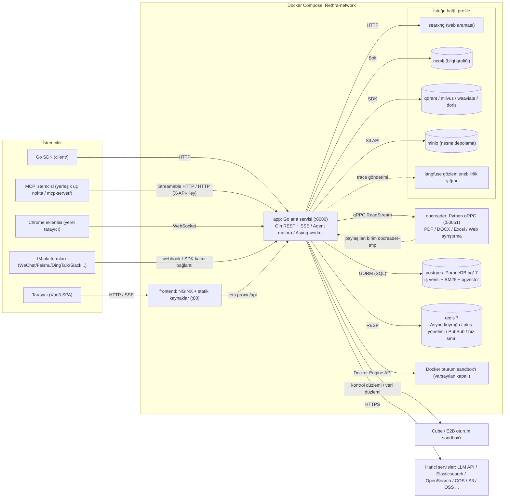
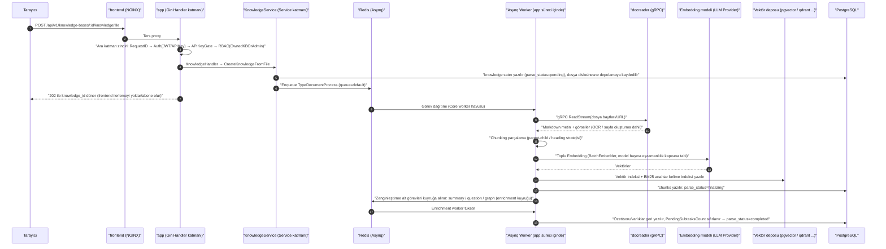

# Genel mimari

Rethra; Web ön yüzü, Go ana hizmeti ve Python belge ayrıştırma hizmetinden oluşur. İş verilerini veritabanında depolar ve asenkron görevleri Redis üzerinden planlar. Vektör depolama, nesne depolama, bilgi grafiği ve model hizmetleri dağıtım gereksinimlerine göre yapılandırılabilir.

## Sistem bileşenleri {#sistem-bilesenleri}

Rethra, "ana hizmet + ön yüz + belge ayrıştırma mikro hizmeti" şeklinde üç süreçli bir çekirdek mimari kullanır; buna ek olarak PostgreSQL ve Redis olmak üzere iki altyapı bağımlılığı vardır. Diğer bileşenlerin tümü (vektör veritabanı, bilgi grafiği, çevrim içi arama vb.) isteğe bağlıdır ve Docker Compose profile aracılığıyla gerektikçe etkinleştirilir.

### Çekirdek hizmetler (varsayılan olarak başlatılır) {#cekirdek-hizmetler-varsayilan-olarak-baslatilir}

| Hizmet | İmaj / derleme | Bağlantı noktası | Sorumluluk |
| --- | --- | --- | --- |
| `app` | `rethra-app` (`docker/Dockerfile.app`, Go) | `8080` | Ana arka uç: REST API, RAG getirme, Agent motoru, asenkron görev worker'ı, IM/Embed kanal entegrasyonu. Sağlık denetimi: `GET /health` |
| `frontend` | `rethra-ui` (`frontend/`, NGINX + Vue3 statik çıktıları) | `80` | Web UI; NGINX aynı zamanda ters vekil olarak çalışır ve `/api` isteklerini `app` hizmetine yönlendirir (`APP_HOST`/`APP_BACKEND_PORT`/`APP_SCHEME` uzak arka ucu gösterebilir) |
| `docreader` | `rethra-docreader` (`docker/Dockerfile.docreader`, Python) | `50051` (yalnızca compose ağı içinde expose edilir, ana makineye eşlenmez) | Belge ayrıştırma mikro hizmeti: gRPC sunucusu, PDF/DOCX/Excel/EPUB/web sayfası vb. 25+ biçimin ayrıştırılması ve sayfa oluşturma. Sağlık denetimi: `grpc_health_probe` |
| `postgres` | `paradedb/paradedb:v0.22.6-pg17` | `5432` (ağ içinde) | Ana veritabanı. ParadeDB dağıtımı BM25 tam metin araması ve pgvector vektör yetenekleriyle birlikte gelir; bu nedenle **varsayılan dağıtımda ayrı bir vektör veritabanına gerek yoktur** (`RETRIEVE_DRIVER=postgres`) |
| `redis` | `redis:7.0-alpine` (`appendonly` + `requirepass`) | `6379` (ağ içinde) | Asynq görev kuyruğu, SSE akış yönetimi (örnekler arası), `system_settings` yayınlama/abone olma, hız sınırlama ve dağıtık model eşzamanlılık kapısı |
| `sandbox` | `rethra-sandbox` (`docker/Dockerfile.sandbox`) | — | Rethra standart çalışma imajı; doğrudan alan Docker arka ucu için kullanılabilir veya CubeSandbox/E2B'ye bağlanıldığında şablon API'si aracılığıyla otomatik kaydedilir ve Agent Skills için kullanılır |

`app` ile `docreader` arasında, ayrıştırma çıktısı görselleri ayrıca `/tmp/docreader` konumuna bağlanan paylaşımlı `docreader-tmp` birimi üzerinden aktarılır; `app` yerel dosya depolama birimi ise `data-files` konumundadır (`/data/files`).

### İsteğe bağlı bileşenler (Compose profile) {#istege-bagli-bilesenler-compose-profile}

| Hizmet | profile | Amaç |
| --- | --- | --- |
| `searxng` (+ tek seferlik `searxng-init`) | `searxng` / `full` | Kendi barındırılan meta arama motoru; Agent için Web Search sağlar (varsayılan olarak `127.0.0.1:8888` adresine bağlanır) |
| `neo4j` | `neo4j` / `full` | Bilgi grafiği depolaması (GraphRAG); anahtar `NEO4J_ENABLE`, Bolt protokolü `7687` |
| `minio` | `minio` / `full` | Nesne depolaması (`STORAGE_TYPE=minio`) |
| `qdrant` / `milvus` / `weaviate` | Kendi adlarıyla profile | Bağımsız vektör veritabanları (`RETRIEVE_DRIVER` ile değiştirilir) |
| `doris-fe` + `doris-be` | `doris` | Apache Doris 4.1 arama motoru (FE MySQL 9030 / FE HTTP 8030 Stream Load / BE 8040) |
| `odl-hybrid` | `odl-hybrid` | OpenDataLoader PDF hibrit ayrıştırma arka ucu (docreader HTTP `:5002` üzerinden çağırır) |
| `dex` | `dex` / `full` | OIDC testi için IdP (`OIDC_AUTH_ENABLE` ile birlikte) |
| `langfuse-*` (web/worker/clickhouse/minio/db-init) | `langfuse` | Kendi barındırılan LLM gözlemlenebilirlik yığını; Rethra postgresini (yeni `langfuse` veritabanı) ve redisini (DB 1) yeniden kullanır |

Buna ek olarak Go arka ucu, compose içinde bulunmayan harici motorlara da doğrudan bağlanabilir: Elasticsearch v7/v8, OpenSearch, Tencent Cloud VectorDB ve 8 tür nesne depolaması (local/MinIO/COS/TOS/S3/OSS/KS3/OBS).

### Dağıtım biçimleri {#dagitim-bicimleri}

Standart Docker Compose dağıtımına ek olarak depo şunları da destekler:

- **Lite modu**: `DB_DRIVER=sqlite` (yerleşik sqlite-vec vektör uzantısı) + yapılandırılmamış `REDIS_ADDR` (Asynq, süreç içi `SyncTaskExecutor` olarak geriler); tek ikili dosya ile çalışır, ön uç statik kaynakları gömülüdür (`handler.Edition == "lite"` olduğunda doğrudan Go süreci tarafından sunulur);
- **Kubernetes**: `helm/` Chart; **çıplak makine**: `deploy/` systemd birimi.

## Teknoloji yığını listesi {#teknoloji-yigini-listesi}

| Katman | Teknoloji | Sürüm/Açıklama |
| --- | --- | --- |
| Arka uç dili | Go | `go.mod`, `go 1.26.0` bildirir |
| Web çatısı | `github.com/gin-gonic/gin` | v1.12.0 |
| ORM | `gorm.io/gorm` + postgres/sqlite sürücüsü | v1.31.1; SQLite, `sqlite-vec` vektör uzantısını içerir |
| Bağımlılık ekleme | `go.uber.org/dig` | v1.19.0 (kurucu işlev ekleme; arka uç tasarımı bölümüne bakın) |
| Eşzamansız görevler | `github.com/hibiken/asynq` | v0.26.0 (Redis tabanlı, 6 worker havuzu) |
| Önbellek/kuyruk | `github.com/redis/go-redis/v9` | v9.14.1 |
| Kimlik doğrulama | `github.com/golang-jwt/jwt/v5` + OIDC | JWT Bearer / X-API-Key / OIDC üç durumu |
| Veritabanı geçişi | `github.com/golang-migrate/migrate/v4` | `migrations/versioned/*.up.sql`, başlangıçta `AUTO_MIGRATE` otomatik olarak çalışır |
| Günlükleme | `github.com/sirupsen/logrus` + lumberjack rotasyonu | Özel formatter, request_id uçtan uca taşınır |
| Yapılandırma | `github.com/spf13/viper` + `config/config.yaml` + ortam değişkenleri | — |
| Gözlemlenebilirlik | OpenTelemetry + Langfuse (`internal/tracing/langfuse`) | LLM çağrısı düzeyinde iz |
| gRPC | `google.golang.org/grpc` v1.81.0 | docreader çağrısı |
| Vektör/arama | pgvector, ES v7/v8, OpenSearch, Qdrant, Milvus, Weaviate, Doris, Tencent VectorDB, sqlite-vec | `RETRIEVE_DRIVER` ve `vector_stores` tablosu tarafından dinamik olarak kurulur |
| Bilgi grafiği | `neo4j-go-driver/v6` | İsteğe bağlı |
| Veri analizi | DuckDB (`duckdb-go/v2`), `pg_query_go` SQL doğrulaması | Agent veri analizi aracı |
| Goroutine havuzu | `panjf2000/ants/v2` | Belge işleme eşzamanlılık havuzu (`CONCURRENCY_POOL_SIZE`) |
| MCP | `mark3labs/mcp-go` v0.52.0 | Agent için harici MCP araçları (OAuth dahil) |
| API belgeleri | swaggo/gin-swagger | Release olmayan modda `/swagger` sunulur |
| Ön yüz çatısı | Vue 3 (^3.5) + TypeScript + Vite 7 | `frontend/package.json` |
| Ön yüz UI/durum | TDesign Vue Next, Pinia, Vue Router 4, vue-i18n | Marked/KaTeX/Mermaid/highlight.js zengin metin oluşturma |
| Belge ayrıştırma servisi | Python + grpcio | `docreader/main.py`; ayrıştırıcılar `docreader/parser/` içinde bulunur (pdf/docx/excel/epub/web/image/markitdown/opendataloader vb.) |

## Süreçler arası iletişim yöntemleri {#surecler-arasi-iletisim-yontemleri}

| Bağlantı | Protokol | Açıklama |
| --- | --- | --- |
| Tarayıcı → `frontend`(NGINX) → `app` | HTTP/HTTPS (REST + SSE) | NGINX `/api` için ters vekil olarak çalışır; sohbet SSE akış yanıtını kullanır |
| `app` → `docreader` | **gRPC** (varsayılan `docreader:50051`, `DOCREADER_TRANSPORT=grpc`, TLS/mTLS ve `GRPC_AUTH_TOKEN` desteklenir) | Proto tanımları `docreader/proto/` içindedir; büyük dosyalar akışlı `ReadStream` kullanır |
| `app` → `postgres` | PostgreSQL wire (GORM/pgx) | İş verileri + BM25 + pgvector |
| `app` ↔ `redis` | RESP (TLS desteklenir) | 1. Asynq görev kuyruğu (belge ayrıştırma/zenginleştirme/Wiki/bellek vb. görevler); 2. SSE akışı bağlantı kesilince devam ettirme için Stream Manager (`STREAM_MANAGER_TYPE`); 3. `system_settings` değişiklikleri için Pub/Sub; 4. Embed kanalı hız sınırlaması; 5. Dağıtık model başına eşzamanlılık semaforu |
| `app` → `neo4j` | Bolt (`bolt://neo4j:7687`) | GraphRAG varlık/ilişki depolama ve erişimi |
| `app` → `searxng` / Web arama sağlayıcısı | HTTP | SSRF izin listesi doğrulaması (`SSRF_WHITELIST_EXTRA` varsayılan olarak compose içindeki `searxng,qdrant,milvus,weaviate,doris-fe,doris-be,minio` için izin verir; `SSRF_DNS_WHITELIST_ONLY` etkinleştirildiğinde yalnızca izin listesindeki çıkışlara izin verilir) |
| `app` → vektör veritabanı/nesne depolama/LLM sağlayıcısı | Kendi SDK'ları (HTTP/gRPC/MySQL protokolü) | Doris, MySQL protokolü + Stream Load HTTP kullanır |
| `app` → sanal alan arka ucu | Docker Engine API / Cube/E2B kontrol düzlemi ve veri düzlemi | Oturum yürütme, beceri kurulumu ve dosya çıktıları; alan sanal alan yapılandırmasına göre seçilir |
| MCP istemcisi → `app` | Streamable HTTP (`/mcp/:endpoint_id`, her uç nokta için ayrı Bearer Token) | Yerleşik MCP Server, alanın bilgi tabanı araması gibi yeteneklerini harici MCP istemcilerine sunar; bkz. [MCP entegrasyonu](../03-features/08-mcp.md) |
| Chrome uzantısı ↔ `app` | WebSocket (`/api/v1/local-browser/extension`, uzak dağıtımda WSS gerekir) | Yerel tarayıcı yetenekleri: app işlemi BrowserSkill artalan sürecini barındırır, uzantı kullanıcının tarayıcısında web sayfası görevlerini yürütür; bkz. [yerel tarayıcı](../05-clients/09-local-browser.md) |
| `app` ↔ IM platformu | HTTP webhook / kalıcı bağlantı SDK'sı | WeChat, Slack, Telegram, QQ (`internal/im/`) |

## Genel mimari diyagramı {#genel-mimari-diyagrami}

## Tipik istek akışı: belge yükleme, ayrıştırma ve depoya alma {#tipik-istek-akisi-belge-yukleme-ayristirma-ve-depoya-alma}

Aşağıdaki diyagram, bir belgenin yüklenmesinden aranabilir hâle gelmesine kadar olan tam akışı gösterir ve bileşenler arası etkileşimlerin büyük çoğunluğunu kapsar (senkron API, Asynq asenkron görevleri, gRPC ayrıştırma, Embedding ve vektör yazımı, zenginleştirme alt görevleri):

Sohbet akışı (`POST /api/v1/knowledge-chat/:session_id` veya agent-chat) ise senkron SSE'dir: Handler → `SessionService` → `chat_pipeline` eklenti hattı (sorgu anlama → paralel arama → rerank → birleştirme → Prompt oluşturma → LLM akışlı tamamlama) → token akışı Stream Manager (Redis/bellek) aracılığıyla istemciye geri gönderilir; ayrıntılar için arka uç tasarım bölümüne bakın.

## Kod deposu üst düzey dizin rehberi {#kod-deposu-ust-duzey-dizin-rehberi}

| Dizin | Sorumluluk |
| --- | --- |
| `cmd/` | Çalıştırılabilir giriş noktaları. `cmd/server`: ana hizmet (main/bootstrap/listen + platform sinyal işleme); `cmd/download`: model/kaynak indirme yardımcı aracı |
| `internal/` | Tüm Go arka uç iş kodları (katmanlı yapı için arka uç tasarım bölümüne bakın): `handler`, `application/service`, `application/repository`, `container` (DI), `router`, `middleware`, `types`, `agent`, `im`, `mcp`, `stream`, `sandbox` vb. |
| `frontend/` | Vue3 + Vite + TDesign kullanan Web ön ucu; derleme çıktıları NGINX tarafından veya Lite modunda gömülü olarak sunulur |
| `docreader/` | Python gRPC belge ayrıştırma mikro hizmeti: `main.py` sunucu giriş noktası, `parser/` içinde 25+ ayrıştırıcı, `splitter/` bölücüler, `proto/` iletişim kuralı tanımları, bağımsız `Dockerfile.docreader` derlemesi |
| `client/` | Go SDK: Rethra API'sini HTTP istemcisi olarak sarmalar, ikincil geliştirme entegrasyonları için kullanılır |
| `mcp-server/` | Python ile uygulanmış MCP Server (`rethra_mcp_server.py`); Rethra API'sini Claude gibi MCP istemcilerine MCP araçları olarak sunar |
| `migrations/` | golang-migrate veritabanı geçişleri: `versioned/` (Postgres ana hattı `NNNNNN_*.up/down.sql`), `sqlite/` (Lite modu), `paradedb/`, `mysql/` |
| `config/` | Çalışma yapılandırması: `config.yaml` ana yapılandırma, `builtin_agents.yaml` yerleşik Agent'lar, `agent_type_presets.yaml` Agent ön ayarları, `builtin_models.yaml.example` bildirimsel yerleşik modeller, `models.json.example` model sağlayıcı dizini katmanı, `prompt_templates/` istem şablonları |
| `docker/` | Her imaj için Dockerfile'lar (app/docreader/sandbox/odl-hybrid) ve searxng yapılandırması |
| `deploy/` | Çıplak sunucu dağıtım kaynakları (systemd hizmet birimleri vb.) |
| `helm/` | Kubernetes Helm Chart (Chart.yaml / values.yaml / templates/) |
| `examples/` | API kullanım örnek kodları; `examples/skills/`, Agent Skill paketi örneklerini içerir |
| `dataset/` | Değerlendirme için QA veri kümesi ve oluşturma betikleri |
| `scripts/` | Derleme/başlatma/geçiş yardımcı betikleri (ör. `start_all.sh`; Lite / masaüstü paketleme için `build_frontend_dist.sh`, UI imajı `frontend/Dockerfile` ile çok aşamalı olarak derlenir) |
| `testdata/` | Test verileri |
| `misc/` | Çeşitli içerikler (ör. `dex-config.yaml` OIDC test yapılandırması) |
| `docs/` | Bakımı durdurulmuş eski belgeler; Swagger oluşturma paketi, yayın kaynakları ve geçmiş görseller için geçici depolama |

> Not: Go modül yolu `github.com/acrbaran/rag` şeklindedir; kök dizin ayrıca `docker-compose.yml` (üretim düzenlemesi), `docker-compose.dev.yml` (geliştirme düzenlemesi), `Makefile`, `VERSION` vb. içerir.

Sonraki bölüm olan «Go Arka Uç Tasarımı», `internal/` iç yapısını ayrıntılı olarak ele alacaktır: katmanlı mimari, dig bağımlılık enjeksiyonu, başlatma akışı, yönlendirme ve RBAC, ara yazılım, alan modeli ve hata/günlük kuralları.
