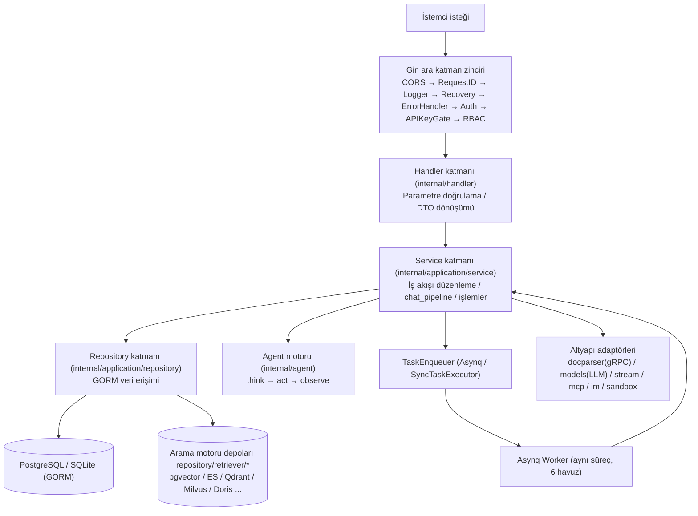
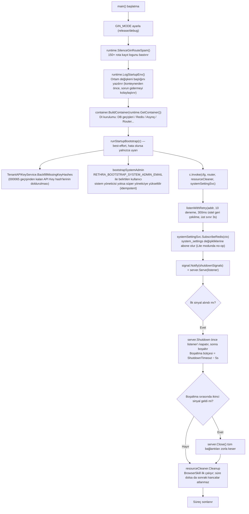

# Go Arka Uç Tasarımı

Go arka ucu, istek işlemeyi Handler, Service, Repository ve altyapı katmanlarıyla düzenler ve bağımlılıkları uber/dig üzerinden birleştirir. `cmd/server` başlatma ve kapatmadan sorumludur; `internal/` yönlendirme yetkilendirmesini, iş hizmetlerini ve depolama erişimini uygular.

## Katmanlı Mimari {#katmanli-mimari}

Arka uç, klasik **Handler → Service → Repository → Veritabanı** dört katmanlı yapısını izler. Katmanlar arası tüm bağımlılıklar arayüzler (`internal/types/interfaces/`) üzerinden ayrıştırılır ve DI konteyneri tarafından başlatma sırasında birleştirilir:

| Katman | Konum | Sorumluluk |
| --- | --- | --- |
| Router / Middleware | `internal/router/`, `internal/middleware/` | Rota kaydı, kimlik doğrulama, RBAC, hız sınırlama, günlükleme, hata zarfı |
| Handler | `internal/handler/` (oturumla ilgili olanlar `internal/handler/session/` içinde) | İstek parametrelerini ayrıştırma (DTO'lar `internal/handler/dto/` içinde), Service çağırma, yanıt yazma; iş mantığı içermez |
| Erişim kontrolü | `internal/application/access/` | Gin'den bağımsız paylaşılan yetkilendirme kuralları: bilgi tabanı için üç katmanlı erişim çözümleme, organizasyon paylaşım izinleri, paylaşılan Agent'ların bilgi tabanı kapsamı, dosya ve mesaj çıktısı yetkilendirmesi, veritabanları arası klonlama/taşıma yetkilendirmesi |
| Service | `internal/application/service/` (yaklaşık 160+ dosya) | İş orkestrasyonu: bilgi tabanı/bilgi/parçalar, oturumlar ve `chat_pipeline/` işlem hattı, Agent, kiracı ve üyeler, modeller, veri kaynağı senkronizasyonu, Wiki, denetim vb. |
| Repository | `internal/application/repository/` (yaklaşık 60 dosya) | Veri erişimi, tutarlı biçimde **GORM** kullanır (`type knowledgeRepository struct { db *gorm.DB }`, işlemler `r.db.WithContext(ctx)` üzerinden yürütülür); arama motoru depo uygulamaları motora göre `repository/retriever/{postgres,elasticsearch,qdrant,milvus,weaviate,doris,opensearch,tencentvectordb,sqlite,neo4j}` altında paketlenir |
| Alan modeli | `internal/types/` | GORM varlıkları, numaralandırmalar, context anahtarları, arayüz tanımları (`types/interfaces`) |
| Altyapı | `internal/infrastructure/` (docparser gRPC istemcisi, `web_search`), `internal/models/` (chat/embedding/rerank model uyarlamaları), `internal/stream/`, `internal/sandbox/`, `internal/mcp/`, `internal/im/` | Harici sistem uyarlamaları |



Temel kurallar:

- Handler yalnızca Service arayüzlerine (örneğin `interfaces.KnowledgeService`) bağlıdır; Service yalnızca Repository arayüzlerine ve diğer Service arayüzlerine bağlıdır;
- Tüm arayüzler merkezi olarak `internal/types/interfaces/` içinde tanımlanır ve uygulayıcılar dig üzerinden bağlanır;
- Asynq worker ile HTTP server **aynı süreç** içinde çalışır; görev işleme işlevleri aynı Service setini yeniden kullanır.

## Bağımlılık Enjeksiyonu: internal/container (uber/dig) {#bagimlilik-enjeksiyonu-internal-container-uber-dig}

Rethra, **`go.uber.org/dig` v1.19.0** kullanır (kod üretimli wire yerine yapıcı işlev enjeksiyon konteyneri). Giriş noktası `internal/container/container.go` içindeki `BuildContainer`dır:

```go
// cmd/server/main.go
c := container.BuildContainer(runtime.GetContainer())

// internal/container/container.go
func BuildContainer(container *dig.Container) *dig.Container {
    must(container.Provide(NewResourceCleaner, dig.As(new(interfaces.ResourceCleaner))))
    must(container.Provide(config.LoadConfig))
    must(container.Provide(initDatabase))     // *gorm.DB
    must(container.Provide(initRedisClient))  // *redis.Client (nil olabilir: Lite modu)
    ...
    must(container.Provide(repository.NewTenantRepository))
    must(container.Provide(service.NewTenantService))
    ...
    must(container.Provide(router.NewRouter)) // nihai çıktı *gin.Engine
    return container
}
```

`runtime.GetContainer()` (`internal/runtime/container.go`) genel tekil `dig.Container` örneğini tutar; `must(err)` kayıt hatalarında doğrudan panic oluşturur — DI birleştirme hataları başlatma aşamasında ölümcül hatalardır.

### Kullanılan dig Özellikleri {#kullanilan-dig-ozellikleri}

| Özellik | Kullanım örneği |
| --- | --- |
| `dig.As` | Somut türü bir arayüze bağlar: `container.Provide(NewResourceCleaner, dig.As(new(interfaces.ResourceCleaner)))`; `router.NewAsyncqClient`, `interfaces.TaskEnqueuer` olarak bağlanır |
| `dig.Name` adlandırılmış bağımlılık | Aynı arayüzün birden çok örneği: 4 çıkarma hizmeti (`chunkExtractor`/`dataTableSummary`/`imageMultimodal`/`knowledgePostProcess`), 6 Asynq server (`coreAsynqServer`/`postProcessAsynqServer`/`enrichmentAsynqServer`/`maintenanceAsynqServer`/`sharedAsynqServer`/`wikiAsynqServer`), `wikiIngest` |
| `dig.In` parametre yapısı | `router.RouterParams`, `dig.In` gömer ve yaklaşık 60 Handler/Service bağımlılığını tek seferde enjekte ederek aşırı uzun yapıcı işlev imzalarını önler |
| `container.Invoke` yan etki yürütme | Kayıtla birlikte başlatılan arka plan bileşenleri: `registerPoolCleanup`, `registerWebSearchProviders`, `startDataSourceScheduler`, `startHousekeepingService`, `startAuditLogRetention`, `startTemporaryDocumentCleanup`, 15 adet `chatpipeline.NewPluginXxx` (Search/Rerank/WebFetch/Merge/DataAnalysis/QueryUnderstand/LoadHistory/ChatCompletionStream vb. eklentiler EventManager'a kendini kaydeder), `router.RunAsynqServer`, `recoverPendingWikiTasks` vb. |
| Adaptör Provide | Arayüz dönüşümünü closure ile yapın: `func(s *service.StorageBackendService) interfaces.StorageBackendService { return s }`; `RetrieveEngineRegistry` aynı örnekte eşzamanlı olarak `StoreRegistry` şeklinde dışa açılır |

### Kayıt sırası ve koşullu birleştirme {#kayit-sirasi-ve-kosullu-birlestirme}


⑥. adım, tüm depodaki en önemli koşullu daldır — **Redis'in varlığı çalışma biçimini belirler**:

```go
redisAvailable := os.Getenv("REDIS_ADDR") != ""
if redisAvailable {
    must(container.Provide(router.NewAsyncqClient, dig.As(new(interfaces.TaskEnqueuer))))
    must(container.Provide(router.NewCoreAsynqServer, dig.Name("coreAsynqServer")))
    ... // toplam 6 worker havuzu + AsynqInspector
    must(container.Invoke(registerModelConcurrencyLimiter))   // Redis tabanlı dağıtık, model başına eşzamanlılık kapısı
} else {
    syncExec := router.NewSyncTaskExecutor()                  // Lite modu: süreç içi senkron yürütücü
    must(container.Provide(func() interfaces.TaskEnqueuer { return syncExec }))
    must(container.Provide(router.NewNoopTaskInspector))
    must(container.Invoke(registerLiteModelConcurrencyLimiter)) // süreç içi semafor
}
```

6 Asynq worker havuzunun eşzamanlılık düzeyi system settings / ortam değişkenleriyle ayarlanabilir (varsayılan Core=8, PostProcess=2, Enrichment=12, Maintenance=4, Shared=6, Wiki=8, `RETHRA_ASYNQ_*_CONCURRENCY`); kuyruk topolojisi `internal/types/task.go` içinde tanımlanır (default, chat_attachment, postprocess, summary, multimodal, graph, question, memory, sync, low/maintenance, wiki vb.; otomatik etiketleme ve bellek çıkarımı içerir).

### Kaynak temizliği ve fabrika {#kaynak-temizligi-ve-fabrika}

- `ResourceCleaner` (`internal/container/cleanup.go`): Her bileşen, yıkımı `RegisterWithName(name, cleanupFunc)` ile kaydeder (ants havuzu, Langfuse flush, veri kaynağı zamanlayıcısı, Housekeeping vb.); çıkışta topluca `Cleanup(ctx)` çağrılır;
- `EngineFactory` (`internal/container/engine_factory.go`): Başlatma sırasında tek bir motora statik bağlanmak yerine, `vector_stores` tablo satırlarına göre çalışma zamanında arama motoru örnekleri oluşturur (`createQdrantEngine` / `createMilvusEngine` / `createDorisEngine` / `createOpenSearchEngine` ...);
- `initDatabase`, bağlantı kurmanın yanı sıra şunlardan da sorumludur: golang-migrate otomatik geçişleri (`AUTO_MIGRATE`; başarısızlık yalnızca uyarı verir, engellemez), `__pending_env__` için depolama provider geri doldurma işlemi, eski StorageBackend geçişi, sıra eşitleme, Lite modunda pending görevlerin sıfırlanması, `config/builtin_models.yaml` ile bildirimsel yerleşik model UPSERT işlemi; SQLite kullanıldığında yazmaları sıralamak için zorunlu olarak `SetMaxOpenConns(1)` ayarlanır.

## cmd/server başlatma akışı {#cmd-server-baslatma-akisi}

`cmd/server` yalnızca üç mantıksal dosyadan oluşur: `main.go` (giriş ve HTTP yaşam döngüsü), `bootstrap.go` (tek seferlik önyükleme kancası), `listen.go` (port yeniden denemesi); ayrıca `signals_unix.go`/`signals_windows.go` platforma özgü `shutdownSignals` sağlar.



Önemli noktalar:

- **Önyükleme başarısızlığı başlatmayı engellemez**: `bootstrap.go`, başarısızlıkları `logger.Warnf` ile kaydeder. Sistem yöneticisi önyüklemesi yalnızca dağıtımda henüz sistem yöneticisi yoksa geçerlidir; yeniden başlatma, geri alınmış izinleri geri yüklemez;
- **İki aşamalı zarif kapatma**: İlk SIGTERM/SIGINT, `server.Shutdown` çağırır (önce listener'ı kapatır; port hemen ardından yeni süreç tarafından bağlanabilir); `ShutdownTimeout` içinde kaynak temizliği için 5s ayrılır, kalan sürede mevcut bağlantılar boşaltılır. `Shutdown` öncesinde `listener.Close()` işlemini elle çağırmayın: `Serve`, `ErrServerClosed` yerine `use of closed network connection` döndürür ve `logger.Fatalf` temizlikten önce süreci sonlandırır. İkinci sinyal zorla `Close` uygular;
- **Port kullanımda olduğunda yeniden deneme**: `listenWithRetry`, 300ms'den başlayan üstel geri çekilmeyle 10 kez yeniden dener (kademeli yeniden başlatmada eski süreç portu henüz bırakmadıysa doğrudan başarısız olmayı önler).

## Yönlendirme düzeni ve RBAC birleştirmesi (internal/router) {#yonlendirme-duzeni-ve-rbac-birlestirmesi-internal-router}

### NewRouter birleştirme sırası {#newrouter-birlestirme-sirasi}

`internal/router/router.go` içindeki `NewRouter(params RouterParams)` (`RouterParams`, bir `dig.In` yapısıdır) aşağıdaki sırayla birleştirilir; **sıra güvenlik anlamını belirler**:

1. `gin.New()` + `MultipartFormCleanup` (istek tamamlandıktan sonra multipart ayrıştırmasının diske yazdığı geçici dosyaları siler) + `SetTrustedProxies` (`RETHRA_TRUSTED_PROXIES`; varsayılan olarak yalnızca loopback ve özel ağ aralıklarına güvenir, sahte `X-Forwarded-For` ile IP tabanlı hız sınırlamasının aşılmasını önler);
2. Genel middleware: `cors` → `RequestID` → `Language` → `Logger` → `Recovery` → `ErrorHandler`;
3. Kimlik doğrulamasız uç noktalar: `GET /health`; release dışı modda `/swagger/*any` bağlanır;
4. Embed sayfaları için `frame-ancestors` CSP middleware'i; Lite sürümünde gömülü ön yüz statik kaynakları (`handler.Edition == "lite"`);
5. **Kimlik doğrulamadan önce** kaydedilen açık rotalar: IM platformu geri çağrıları (`/api/v1/im`, her platform kendi imza doğrulamasını içerir), Web Embed açık rotaları (`/api/v1/embed/:channel_id`, `middleware.EmbedAuth` publish-token yetkilendirmesi + Redis hız sınırlaması), yerleşik MCP Server (`/mcp/:endpoint_id`, `middleware.MCPEndpointAuth` uç nokta bazlı Bearer Token yetkilendirmesi), kısa süreli yetenek URL'leri (resource grants), sandbox terminali/masaüstü WebSocket'i (tarayıcı el sıkışması sırasında kimlik doğrulama başlığı taşıyamadığından, kimliği doğrulanmış POST ile alınan kısa süreli ticket kullanılır), yerel tarayıcı eklentisi bağlantısı (`/api/v1/local-browser/*`);
6. `middleware.Auth(...)` genel kimlik doğrulaması; ardından kimlik doğrulaması gerektiren dosya proxy rotaları, kimlik doğrulaması gerektirmeyen ancak imza doğrulamalı presigned dosya rotaları, Langfuse trace middleware'i ve `AuditServiceProvider`;
7. `v1 := r.Group("/api/v1")`: Önce `v1.Use(rbacGuards.apiKeyAuthorizer.Middleware())` uygulanır (API Key ağ geçidi; JWT oturumları doğrudan geçirilir), ardından 30'dan fazla `RegisterXxxRoutes(v1, handler, rbacGuards)` sırayla çağrılır;
8. Son öz denetim: `rbacGuards.assertAPIKeyPoliciesMatchRoutes(r)` — bildirilen bir API Key politikası var olmayan bir rota şablonuna işaret ediyorsa (yol kayması/yazım hatası), **başlatma anında panic oluşur**; böylece yayına her zaman 403 döndüren ölü bir politikanın çıkması önlenir.

### Yönlendirme gruplarına genel bakış {#yonlendirme-gruplarina-genel-bakis}

| Grup öneki | Register işlevi | API Key politika örneği |
| --- | --- | --- |
| `/auth`, `/me` | RegisterAuthRoutes / RegisterMyInvitationRoutes | Çoğu Key gerektirmez |
| `/tenants`, `/tenants/:id/*` (üye/davet/denetim) | RegisterTenantRoutes | `manage_members` / `manage_spaces`; `/:id` grubuna `PathTenantMatch()` eklenir |
| `/knowledge-bases`, `/knowledge-bases/:id/knowledge|faq|tags|shares` | RegisterKnowledgeBaseRoutes vb. | `retrieve` / `ingest` (fallback `full_access`) |
| `/knowledge`, `/chunks` | RegisterKnowledgeRoutes / RegisterChunkRoutes | `ingest` |
| `/sessions`, `/knowledge-chat`, `/agent-chat`, `/knowledge-search`, `/messages` | RegisterSessionRoutes / RegisterChatRoutes vb. | `chat` / `retrieve` |
| `/models`, `/evaluation` | RegisterModelRoutes / RegisterEvaluationRoutes | `manage_models` / `run_evaluations` |
| `/sandbox-configs`, `/me/env-vars`, `/me/browser` | RegisterSandboxConfigRoutes / RegisterMyEnvVarRoutes vb. | `full_access`; `/me/*` yalnızca JWT kullanıcısının kendisi için |
| `/system`, `/system/admin` | RegisterSystemRoutes / RegisterSystemAdminRoutes | admin grubu `g.SystemAdmin()` zorunluluğu uygular |
| `/mcp-services`, `/agent`, `/web-search`, `/web-search-providers` | İlgili Register işlevleri | `manage_mcp_services` / `manage_web_search` |
| `/vector-stores`, `/storage-backends` | RegisterVectorStoreRoutes / RegisterStorageBackendRoutes | `manage_vector_stores` / `manage_storage_backends` |
| `/agents`, `/agents/:id/shares|embed-channels|im-channels` | RegisterCustomAgentRoutes vb. | `full_access` / `manage_channels` |
| `/organizations`, `/user/favorites`, `/skills` | İlgili Register işlevleri | `manage_spaces` vb. |
| `/im-channels`, `/embed-channels`, `/mcp-endpoints`, `/wechat` | RegisterIMChannelRoutes / RegisterEmbedChannelRoutes / RegisterMCPEndpointRoutes | `manage_channels` |
| `/datasource`, `/knowledgebase/:kb_id/wiki` | RegisterDataSourceRoutes / RegisterWikiPageRoutes | `manage_datasources` / `ingest` |

### rbacGuards: merkezi yetki matrisi {#rbacguards-merkezi-yetki-matrisi}

`internal/router/rbac.go`, `rbacGuards` tanımlar; bu yapı `NewRouter` tarafından bir kez oluşturulur ve her Register işlevine aktarılır. Korumalar üç türe ayrılır, rota satırlarında satır içi kullanılır ve yetki gereksinimleri ilk bakışta görülür:

```go
kb.PUT("/:id", g.OwnedKBOrAdmin(), handler.UpdateKnowledgeBase)
```

- **Rol korumaları** ("çağıranın kiracı içindeki rolü nedir?" sorusu): `Viewer()` / `Contributor()` / `Admin()` / `Owner()` / `AdminOrSystemAdmin()` / `SystemAdmin()`, temelde `middleware.RequireRole` çağrılır;
- **Sahiplik korumaları** ("bu kaynağın oluşturucusu veya Admin+ mı?" sorusu): `OwnedKBOrAdmin()`, `OwnedAgentOrAdmin()`, `OwnedKnowledgeKBOrAdmin()`, `OwnedChunkKBOrAdmin()`, `OwnedWikiKBOrAdmin()` vb. — alt kaynaklar (chunk/wiki/FAQ/tag), `KBCreatorLookupFromKnowledgeID` gibi kapanışlar aracılığıyla URL parametrelerinden bağlı KB'nin `creator_id` değerine geri iz sürer ve üst kaynakla aynı kuralı paylaşır;
- **Bilgi tabanı erişim korumaları** (üç katmanlı çözümleme: kendi KB'si / kuruluşlar arası paylaşılan KB / paylaşılan Agent'ın görebildiği KB): `KBAccessRead|Write(param)` ile `...FromKnowledgeIDParam` / `...FromChunkIDParam` varyantları; temelde `middleware.RequireKBAccess` kullanılır;
- **Kiracı sınırı korumaları**: `CrossTenant()` (platform düzeyindeki işlemler `EnableCrossTenantAccess` + `CanAccessAllTenants` gerektirir), `PathTenantMatch()` (`/tenants/:id`, bağlam kiracısıyla eşleşmelidir).

Kaynak kod açıklamaları, koruma seçimi için karar ağacını verir (oluşturucusu olan kaynaklarda OwnedXxxOrAdmin; kiracı düzeyindeki altyapıda Admin; oluşturma girişlerinde Contributor kullanılır) ve tüm korumaların `cfg.Tenant.EnableRBAC` anahtarına uyduğunu açıkça belirtir — kapatıldığında yalnızca "reddedilmesi gerekirdi" günlüğü kaydedilir ve geçişe izin verilir (kademeli geçiş dönemi davranışı).

**API Key politikası**, rol korumalarından bağımsızdır: `apiKeyGroup(grp, policy)`, gin RouterGroup'u sarar ve rota kaydı sırasında `(method, fullPath) → APIKeyRoutePolicy` eşlemesini `APIKeyRouteAuthorizer` politika tablosuna yazar; politika oluşturucuları `apiKeyFullAccess()`, `apiKeyPlatform(...)` ve 17 yetenek sarmalayıcısıdır (`apiKeyRetrieve` / `apiKeyChat` / `apiKeyIngest` / `apiKeyManageModels`...). Politikası kaydedilmemiş rotalar, API Key özneleri için varsayılan olarak **fail-closed reddetme** uygular.

## Ara katman listesi (internal/middleware) {#ara-katman-listesi-internal-middleware}

İsteklerin geçtiği sıraya göre:

| Ara katman | Dosya | Sorumluluklar ve temel mantık |
| --- | --- | --- |
| `MultipartFormCleanup()` | multipart_cleanup.go | İstek tamamlandıktan sonra (başarısızlıklar ve panic kurtarma dahil) multipart formunun sistem geçici dizinine yazdığı dosyaları siler; kapsayıcıdaki `/tmp` dizininin sürekli büyümesini önler |
| `cors.New` (gin-contrib) | router.go | `Authorization`, `X-API-Key`, `X-Tenant-ID`, `X-Embed-Session`, `X-Rethra-Desktop-Token` ile MCP Streamable HTTP'nin gerektirdiği `MCP-Protocol-Version`/`Mcp-Session-Id` vb. başlıklara izin verir; MaxAge 12h |
| `RequestID()` | logger.go | `X-Request-ID` istek başlığını yeniden kullanır veya UUID oluşturur, bunu gin context ve `Request.Context()` içine yazar; günlükler/izleme boyunca taşınır |
| `Language()` | language.go | Belge işleme dilini belirler: `RETHRA_LANGUAGE` ortam değişkeni > ilk `Accept-Language` etiketi > varsayılan `zh-CN` |
| `Logger()` | logger.go | İstek/yanıtın tam günlüğü; parola/token alanlarını regex ile maskeler, base64 görsel data URL'lerini kısaltır, SSE yanıtlarını atlanacak olarak işaretler, tek kayıt sınırı 10KB'dir |
| `Recovery()` | recovery.go | panic yakalama + yığın kaydı + 500 yanıtı |
| `ErrorHandler()` | error_handler.go | `c.Errors` içindeki son hatayı okur: `*errors.AppError` için kendi `HTTPCode` değeriyle `{success:false, error:{code,message,details}}` standart zarfını döndürür; diğerleri 500 |
| `EmbedAuth(...)` | embed_auth.go | Yalnızca `/api/v1/embed/:channel_id` herkese açık grubuna eklenir: publish token'ını doğrular, Embed kanal bağlamını ekler; Redis ile üç seviyeli hız sınırlama uygular (IP başına/dakika, kanal geneli/dakika, kanal/gün) |
| `MCPEndpointAuth(...)` | mcp_endpoint_auth.go | Yalnızca `/mcp/:endpoint_id` için eklenir: uç nokta Bearer Token'ını doğrular, uç noktanın ait olduğu alanı, makine öznesini ve araç beyaz listesi ile bilgi tabanı kapsamından türetilen API Key benzeri yetki kapsamlarını ekler |
| `AttachAuthenticatedUser(...)` | ws_auth.go | Sanal alan terminali gibi WebSocket rotalarında: kısa süreli ticket ile çözümlenen kullanıcıyla `Auth` ile aynı kimlik doğrulama oturumu oluşturur; üyelik ve roller yine veritabanından çözülür |
| `PublicAuthRateLimit()` | auth_public_ratelimit.go | Kimlik doğrulama gerektirmeyen davet sorgulama/davetli kayıt rotaları: **süreç içi bellek** kayan penceresi, 60s/30 istek/IP; arka planda her 2 dakikada süresi dolan kovaları temizler, limit aşımında 429 döner |
| `Auth(...)` | auth.go | Çekirdek kimlik doğrulama, üç durumlu: ① JWT (`Authorization: Bearer`, `userService.ValidateToken`); ② API Key (`X-API-Key`, `AuthenticateAPIKey`); ③ `noAuthAPI` beyaz listesi. `X-Tenant-ID` ile kiracı değiştirmeyi destekler (`IsTenantAccessible` üç katmanlı doğrulama: kendi kiracısı/çapraz kiracı süper yönetici/active membership), `resolveTenantRole` kiracı içi rolü çözer. context'e şunları yazar: `TenantIDContextKey`, `TenantInfoContextKey`, `UserContextKey`, `UserIDContextKey`, `TenantRoleContextKey`, `SystemAdminContextKey`, `PrincipalContextKey` vb. |
| `langfuse.GinMiddleware()` | tracing/langfuse | LLM gözlemlenebilirlik trace'i; LANGFUSE_* yapılandırılmadığında no-op olur |
| `AuditServiceProvider()` | audit_provider.go | `AuditLogService` öğesini gin context'ine enjekte eder; RBAC reddetme yollarının denetim kaydı tutması içindir; servis nil olduğunda zarif biçimde geri düşer |
| `APIKeyRouteAuthorizer.Middleware()` | api_key_gate.go | API Key öznesi için rota düzeyinde ağ geçidi: `(method, fullPath)` politika tablosuna bakar, `PlatformOnly` / `RequireFullAccess` / `Capabilities` değerlerini doğrular; tanımlanmamış rotalar varsayılan olarak reddedilir; JWT kullanıcıları doğrudan geçirilir |
| `RequireRole(min)` vb. | rbac.go | Kiracı içi asgari rol doğrulaması (owner=40 > admin=30 > contributor=20 > viewer=10); `RequireOwnershipOrRole(min, creatorLookup)`, kaynak oluşturucusunun asgari rolü aşmasına izin verir; API Key özneleri kısa devre yapar (yetkilendirmeleri APIKeyGate'e aittir); çapraz kiracı süper yöneticileri geçici olarak Admin olur; reddedildiğinde `AuditService.LogDenied` çağrılır |
| `RequireCrossTenantAccess()` / `RequirePathTenantMatch()` | access.go | Platform düzeyi işlem ağ geçidi ve URL kiracısı tutarlılığı doğrulaması |
| `RequireKBAccess(resolver, perm, ...)` | kb_access.go | `internal/application/access` içindeki KB üç katmanlı erişim çözümlemesine uyarlanır (sahiplik → organizasyon paylaşımı → paylaşılan Agent salt okunur) ve `Request.Context()` içindeki `TenantIDContextKey` değerini KB kaynak kiracısı olarak **yeniden yazar**; böylece alt katman araması otomatik olarak doğru kiracının verilerine yönelir |
| `asynqdl.Middleware()` | asynqdl/ | HTTP dışı: Asynq görev yeniden deneme bütçesi tükendiğinde `task_dead_letters` tablosuna yazar; iş durumu ile bağlantı kurmak için `OnDeadLetter` geri çağrısı eklenebilir (ör. bilgi ayrıştırma başarısız olarak işaretlenir) |

## Etki alanı modeli genel bakışı (internal/types) {#etki-alani-modeli-genel-bakisi-internal-types}

`internal/types/` yaklaşık 26 GORM kalıcı varlığı içerir. Temel ilişkiler:

```mermaid
erDiagram
    TENANT ||--o{ USER : "ana kiracı (users.tenant_id)"
    TENANT ||--o{ TENANT_MEMBER : "üyeler"
    USER ||--o{ TENANT_MEMBER : "birden çok alana katılır"
    TENANT ||--o{ TENANT_API_KEY : "API Key (tenant_id boşsa platform düzeyi)"
    TENANT ||--o{ KNOWLEDGE_BASE : "sahip olur"
    TENANT ||--o{ MODEL : "model yapılandırması"
    TENANT ||--o{ CUSTOM_AGENT : "özel Agent"
    TENANT ||--o{ VECTOR_STORE : "vektör deposu örneği"
    TENANT ||--o{ STORAGE_BACKEND : "depolama arka ucu"
    TENANT ||--o{ DATA_SOURCE : "harici veri kaynağı"
    TENANT ||--o{ SESSION : "oturum"
    TENANT ||--o{ AUDIT_LOG : "denetim (tenant_id=0 sistem düzeyi)"
    KNOWLEDGE_BASE ||--o{ KNOWLEDGE : "belge (knowledge.knowledge_base_id)"
    KNOWLEDGE_BASE ||--o{ KNOWLEDGE_TAG : "etiket"
    KNOWLEDGE_BASE ||--o| VECTOR_STORE : "oluşturulurken vector_store_id bağlanır"
    KNOWLEDGE_BASE ||--o| STORAGE_BACKEND : "oluşturulurken storage_backend_id bağlanır"
    KNOWLEDGE_BASE ||--o{ WIKI_PAGE : "Wiki sayfası"
    KNOWLEDGE_BASE ||--o{ WIKI_FOLDER : "Wiki dizin ağacı"
    KNOWLEDGE ||--o{ CHUNK : "parça (chunk.knowledge_id)"
    DATA_SOURCE ||--o{ SYNC_LOG : "senkronizasyon kaydı"
    SESSION ||--o{ MESSAGE : "mesaj (message.session_id)"
    MESSAGE }o--|| CUSTOM_AGENT : "agent_id"
    MESSAGE }o--|| MODEL : "model_id"

    TENANT {
        uint64 id PK
        string name
        int64 storage_quota
        json retriever_engines
        json credentials_config "AES-256 şifreli"
    }
    USER {
        string id PK "UUID"
        string username UK
        string email UK
        uint64 tenant_id FK
        bool is_system_admin
        bool can_access_all_tenants
    }
    TENANT_MEMBER {
        uint64 id PK
        string user_id FK "uniq(user_id,tenant_id)"
        uint64 tenant_id FK
        string role "owner/admin/contributor/viewer"
        string status "active/invited/suspended"
    }
    KNOWLEDGE_BASE {
        string id PK "UUID"
        uint64 tenant_id FK
        string creator_id FK "RBAC sahiplik kararı"
        string type "document/faq/wiki"
        json chunking_config
        json indexing_strategy "vector/keyword/wiki/graph dört hat anahtarı"
        string embedding_model_id FK
    }
    KNOWLEDGE {
        string id PK "UUID"
        string knowledge_base_id FK
        string parse_status "pending→processing→finalizing→completed vb. 7 durum"
        string channel "web/api/wechat/feishu... 14 tür"
        int pending_subtasks_count
    }
    CHUNK {
        string id PK "UUID"
        string knowledge_id FK
        string chunk_type "text/parent_text/faq/entity/wiki_page... 12 tür"
        string parent_chunk_id "üst-alt parçalama"
        string content_hash
    }
    SESSION {
        string id PK "UUID"
        uint64 tenant_id FK
        string user_id "kullanıcı/API öznesi/embed ziyaretçisi"
        json last_request_state
    }
    MESSAGE {
        string id PK "UUID"
        string session_id FK
        string role "user/assistant/system"
        json knowledge_references "arama referansları"
        json agent_steps "Agent akıl yürütme izi"
        text rendered_content "RAG ile zenginleştirilmiş tam istem"
    }
    MODEL {
        string id PK
        uint64 tenant_id FK
        string type "Embedding/Rerank/KnowledgeQA/VLLM/ASR"
        string source "local / remote / sağlayıcı kimliği"
        json parameters "APIKey AES ile şifreli"
    }
```



Tasarım noktaları:

- **Çok kiracılı yalıtım**: Neredeyse tüm varlıklar `TenantID` taşır; `tenant_id=0` sistem düzeyini belirtir (ör. sistem denetimi);
- **Hassas alanların durağan şifrelemesi**: `Model.Parameters`, `VectorStore.ConnectionConfig`, `StorageBackend.Config`, `DataSource.Config`, `TenantAPIKey.APIKey` vb. GORM `Value()` sırasında `SYSTEM_AES_KEY` (32 bayt) ile AES-256-GCM kullanılarak şifrelenir; `Scan()` sırasında esnek olarak çözülür (çözme başarısızlığı hata yerine yapılandırılmamış kabul edilir);
- **Oluşturma sırasında değişmez bağlama**: KB'nin `VectorStoreID` değeri (gorm etiketi `<-:create`) ve `StorageBackendID` değeri oluşturulduktan sonra değiştirilemez; indeks/dosya tutarlılığını sağlar;
- **Asenkron durum makinesi**: `Knowledge.ParseStatus` yedi durum + `PendingSubtasksCount`, finalizing aşamasındaki paralel zenginleştirme alt görevlerini (summary/question/graph) izler;
- **Yalnızca ekleme denetimi**: `AuditLog` güncelleme/yumuşak silme alanlarına sahip değildir, 50'den fazla `AuditAction` türünü kapsar;
- Varlık olmayan önemli türler: `SearchResult` arama sonucu, `Pagination`, `Task`/kuyruk topolojisi (`task.go`), çeşitli JSONB yapılandırma yapıları (`ChunkingConfig`, `IndexingStrategy`, `CustomAgentConfig` vb.), context anahtarları ve değer alma yardımcıları (`context_helpers.go`).

## Hata İşleme Standartları (internal/errors) {#hata-isleme-standartlari-internal-errors}

Birleşik hata taşıyıcısı `AppError`'dır:

```go
// internal/errors/errors.go
type AppError struct {
    Code     ErrorCode // iş hata kodu
    Message  string
    Details  any
    HTTPCode int       // HTTP durum eşlemesi
}
```

- **Hata kodu bölümleri**: 1000–1999 genel HTTP anlamları (`ErrBadRequest=1000`, `ErrUnauthorized=1001`, `ErrForbidden=1002`, `ErrNotFound=1003`, `ErrTooManyRequests=1006`, `ErrServiceUnavailable=1008`); 2000–2099 kiracı; 2100–2199 Agent; 2200–2299 vektör veritabanı;
- **Oluşturucu işlevler**: `NewBadRequestError` / `NewUnauthorizedError` / `NewForbiddenError` / `NewNotFoundError` / `NewValidationError` / `NewConflictError` / `NewTooManyRequestsError` / `NewServiceUnavailableError` vb.;
- **Kullanım biçimi**: Handler/ara katman, hatayı `c.Error(appErr)` ile ekler; `ErrorHandler` ara katmanının sonunda `{success:false, error:{code,message,details}}` zarfı tek biçimde oluşturulur, ön yüz `error.code` temelinde i18n uygular; `AppError` olmayanların tümü 500'dür;
- `session.go`, oturum alanı sentinel hatalarını (`ErrSessionNotFound` vb.) sunar; `parse_error_codes.go`, belge ayrıştırma aşamasındaki dize hata kodlarını (`DOCREADER_TIMEOUT`, `EMBEDDING_RATE_LIMIT`, `VECTORSTORE_WRITE_FAILED`, `TASK_TIMEOUT` vb.) tanımlar; bunlar ön yüzün çevirerek göstermesi için `Knowledge.ErrorMessage` içine yazılır.

## Günlük Sistemi (internal/logger) {#gunluk-sistemi-internal-logger}

- **logrus** tabanlıdır; özel `appLogger` tekil örneği + özel Formatter (renkli terminal çıktısı; `LOG_FORMAT`, `%d` `%level` `%traceId` `%msg` vb. yer tutucularla özel şablon tanımlayabilir; `LOG_PATH` ayarlandığında lumberjack aracılığıyla döndürülerek dosyaya yazılır ve ANSI renk kodları kaldırılır);
- **request_id uçtan uca taşınır**: `middleware.RequestID` context içine yazar → `logger.GetLogger(ctx)` bunu otomatik çıkarır ve `request_id` alanını ekler; yaygın çıkış noktaları `logger.Infof/Warnf/Errorf(ctx, format, ...)` ve `ErrorWithFields`'tir;
- **LLM hata ayıklama günlükleri** (`llm_logger.go`): `LLM_DEBUG_LOG=true` olduğunda etkinleşir; her LLM çağrısını request_id bazında ayrı dosyalara kaydeder (`LLMCallRecord`: CallType Chat/Embedding/Rerank/VLM, model, süre, tam mesajlar ve araç çağrıları, hata); 7 gün sonra otomatik temizlenir ve istem ile bağlam sorunlarının incelenmesinde kullanılır.

## Temel Araç Kütüphaneleri (internal/common, internal/utils) {#temel-arac-kutuphaneleri-internal-common-internal-utils}

| Konum | Araç | Amaç |
| --- | --- | --- |
| `common/tools.go` | `Deduplicate` / `DeduplicateWithScore`, `ParseLLMJsonResponse`, `CleanInvalidUTF8`, `PipelineLog` serisi | Jenerik yinelenen kayıt temizleme (arama birleştirmesinde en yüksek puanı korur), LLM'nin döndürdüğü ```json kod bloklarını ayrıştırma, geçersiz UTF-8 temizleme, RAG işlem hattı aşama günlükleri |
| `common/db_retry.go` | `WithDeadlockRetry(ctx, fn)` | Veritabanı kilitlenmesi algılandığında yeniden deneme (en fazla 3 kez, 50→100→200ms geri çekilme) |
| `common/redis_tls.go` | `RedisTLSConfig()` | `REDIS_USE_TLS` vb. ortam değişkenlerine göre Redis TLS yapılandırması oluşturur |
| `utils/crypto.go` | `EncryptAESGCM` / `DecryptAESGCM` (`enc:v1:` öneki, idempotent) | Yukarıdaki tüm hassas alanların beklemedeki şifrelemesi için alt seviye uygulama |
| `utils/security.go` | `SanitizeHTML`, `ValidateFilePath`, `SanitizeForLog` | XSS temizleme, dizin geçişi koruması, günlüklerde hassas veri gizleme |
| `utils/inject.go` | `ValidateSQL` (`pganalyze/pg_query_go` tabanlı) | Agent veri analizi tarafından üretilen SQL için izinli tablo doğrulaması ve enjeksiyon deseni tespiti |
| `utils/presign.go` | `SignFileURL` / `VerifyFileURLSig`, `SystemHMACKey` | HMAC-SHA256 ön imzalı dosya URL'si (varsayılan 2h, IM gömülü görsellerinde kullanılır); imzalama anahtarı `SYSTEM_SIGNING_KEY`'den alınır, ayarlanmadığında `SYSTEM_AES_KEY`'e geri dönülür |
| `utils/oidc_state.go` | `GenerateState` / `ValidateState` | OIDC yetkilendirme state değeri için HMAC imzası ve 10 dakikalık TTL (CSRF önleme) |
| `utils/log_sanitize.go` | `CompactImageDataURLForLog` | Aşırı uzun görsel data URL'lerini keserek günlüklerin aşırı büyümesini önler |
| `utils/storage_error.go` | `SanitizeStorageConnectivityError` | Depolama bağlantı hatalarını kullanıcı dostu iletilere dönüştürür ve dahili ana makine adlarını gizler |
| Diğerleri | `taskid.go` / `fileutil.go` / `filesize.go` / `httputil.go` / `json.go` | Görev ID'si, dosya ve boyut biçimlendirme, HTTP indirme, JSON Schema oluşturma vb. |

---

Bu noktada, arka uçta süreç başlatmadan bağımlılıkların kurulmasına, isteğin alınmasından verinin veritabanına yazılmasına kadar tüm zincir tamamlanmıştır. Sonraki bölümlerde RAG arama işlem hattının (`chat_pipeline`), Agent motorunun (`internal/agent`) ve belge ayrıştırma hizmetinin (`docreader`) iç uygulaması ayrı ayrı açıklanacaktır.
