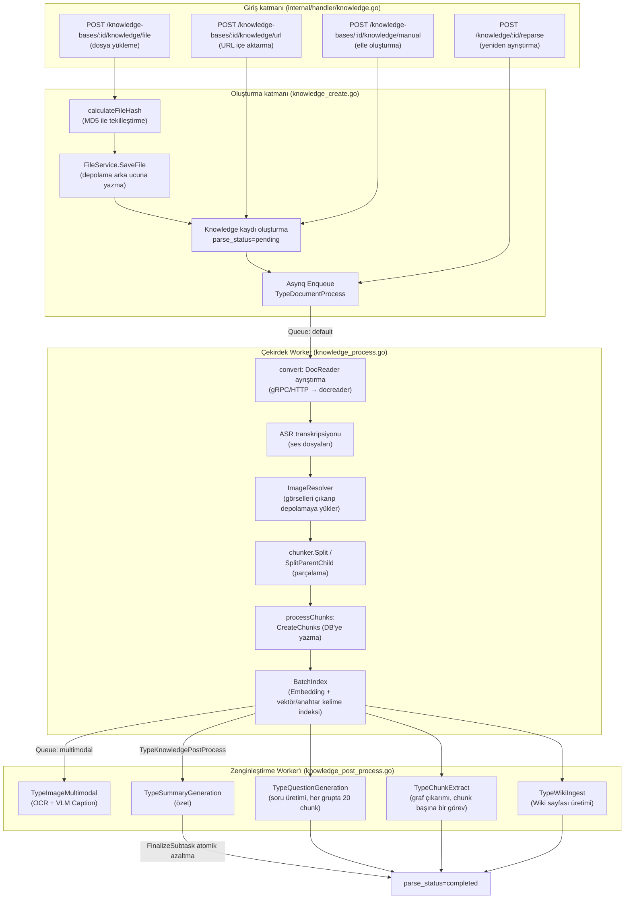
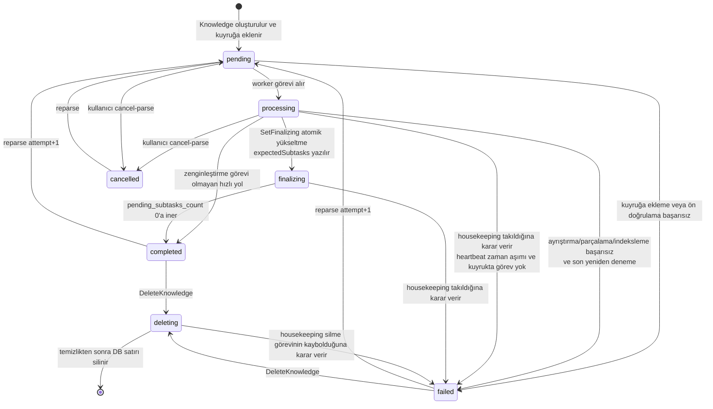

# Belge sisteme alma süreci (Document Ingestion Pipeline)

Belgeler dosya yükleme, URL içe aktarma veya manuel oluşturma yoluyla sisteme girer. Sunucu içeriği kaydeder ve işleme görevini gönderir; sırasıyla ayrıştırma, parçalara bölme ve dizinleme tamamlanır, ardından bilgi tabanı yapılandırmasına göre özetler, sorular, grafikler ve Wiki oluşturulur. Durum ve ilerleme, işleme aşamalarına göre güncellenir; başarısız görevler yeniden deneme ve denetim mekanizmalarıyla kurtarılır.

## Genel mimari {#genel-mimari}

Rethra'nın sisteme alma hattı, **Asynq (Redis) tabanlı dağıtık asenkron bir işlem hattıdır**. HTTP Handler yalnızca veritabanına kaydetme ve kuyruğa eklemeden sorumludur; tüm zaman alan işler (ayrıştırma, vektörleştirme, LLM zenginleştirmesi) bağımsız Worker havuzları tarafından kuyruktan tüketilerek tamamlanır.



## Giriş katmanı: üç oluşturma yolu {#giris-katmani-uc-olusturma-yolu}

Rota kaydı `internal/router/routes_knowledge.go` dosyasındadır:

```go
kb.POST("/file",   g.OwnedKBOrAdmin(), g.KBAccessWrite("id"), handler.CreateKnowledgeFromFile)
kb.POST("/url",    g.OwnedKBOrAdmin(), g.KBAccessWrite("id"), handler.CreateKnowledgeFromURL)
kb.POST("/manual", g.OwnedKBOrAdmin(), g.KBAccessWrite("id"), handler.CreateManualKnowledge)
```

İlgili yönetim uç noktaları: `POST /knowledge/:id/reparse` (yeniden ayrıştırma), `POST /knowledge/:id/cancel-parse` (ayrıştırmayı iptal etme), `POST /knowledge/batch-reparse`, `POST /knowledge/batch-delete`, `POST /knowledge/move` (bilgi tabanları arasında taşıma).

### Dosya yükleme (CreateKnowledgeFromFile) {#dosya-yukleme-createknowledgefromfile}

- Form parametreleri: `file`, `fileName`, `metadata`, `enable_multimodel`, `tag_ids`, `process_config` (her yükleme KB düzeyindeki işleme yapılandırmasını geçersiz kılabilir, bkz. [İşleme yapılandırması: KB varsayılanları + tek yükleme geçersiz kılma](#isleme-yapilandirmasi-kb-varsayilanlari-tek-yukleme-gecersiz-kilma)).
- Akış: uzantı doğrulama → MD5 ile yineleme önleme → `FileService.SaveFile` ile depolama → `Knowledge` kaydı oluşturma → kuyruğa alma.

### Ortak uzantı kapısı {#ortak-uzanti-kapisi}

`internal/application/service/knowledge_util.go` içindeki `supportedImportFileExtensions`, **tüm içe aktarma yolları için tek gerçek kaynağıdır** — doğrudan yükleme, dosya URL'si indirme ve worker indirmesi tamamlandıktan sonraki yeniden doğrulama aynı tabloyu kontrol eder:

```
pdf txt docx doc epub html htm mhtml md markdown xmind
png jpg jpeg gif csv xlsx xls pptx ppt json
mp3 wav m4a flac ogg
```

Önceden URL içe aktarma daha kısa ve ayrı bir beyaz liste kullanıyordu; bu da "doğrudan xlsx yükleme mümkünken URL ile xlsx içe aktarmanın reddedilmesi" gibi tutarsızlıklara yol açıyordu (#2447). Artık karar ortak olarak `isSupportedImportExtension()` / `validateImportFileType()` tarafından verilir; video türleri için "video dosyası yükleme henüz desteklenmiyor" şeklinde açık bir uyarı gösterilir.

Tablo uzantıları (`csv` / `xlsx` / `xls`, `dataTableFileExtensions`) için belge işleme görevinden sonra ek olarak bir tablo özeti görevi (`enqueueDataTableSummaryIfNeeded`) kuyruğa eklenir.

Görüntü ve ses dosyalarına yönelik ek ön doğrulamalar (nesne depolama yapılandırmasının tam olup olmadığı, VLM / ASR modelinin yapılandırılıp yapılandırılmadığı), `process_config` doğrulamasıyla birlikte `resolveFileImportProcessConfig()` içinde birleştirilmiştir; yükleme ve URL içe aktarma bunu ortak kullanır.

### URL içe aktarma (CreateKnowledgeFromURL) {#url-ice-aktarma-createknowledgefromurl}

- JSON Body: `{url, file_name?, file_type?, enable_multimodel?, title?, tag_ids?, channel?, process_config?}`.
- `isFileURL()`, bunun "dosya indirme" mi yoksa "web sayfası alma" mı olduğunu yukarıdaki birleşik uzantı kümesine göre belirler.
- Handler ve Service katmanları çift katmanlı SSRF koruması uygular (`internal/handler/knowledge.go` ve `knowledge_create.go` ikisi de çağırır):

```go
if err := secutils.ValidateURLForSSRF(req.URL); err != nil {
    c.Error(errors.NewBadRequestError(secutils.FormatSSRFError("URL", req.URL, err)))
    return
}
```

Worker tarafı, gerçek alma işleminden önce yeniden doğrulama yapar (`knowledge_process.go` içindeki `convert()`); üç katmanlı savunma TOCTOU'yu önler.

### Elle oluşturma (CreateManualKnowledge) {#elle-olusturma-createmanualknowledge}

- JSON Body, `types.ManualKnowledgePayload{Title, Content, Status, TagIDs, Channel, ProcessConfig}` biçimindedir ve taslak (Draft) durumunu destekler; yayımlandığında `triggerManualProcessing()` üzerinden dosyalarla aynı parçalama/indeksleme hattına girer (DocReader aşaması atlanır).

### Tekilleştirme mekanizması {#tekillestirme-mekanizmasi}

`knowledge_create.go`, yüklenen dosyalar için MD5 hesaplar ve veritabanında dörtlü ölçüte göre arama yapar:

```go
hash, err := calculateFileHash(file) // MD5
exists, existingKnowledge, err := s.repo.CheckKnowledgeExists(ctx, tenantID, kbID,
    &types.KnowledgeCheckParams{
        Type:     "file",
        FileName: fileName,
        FileType: getFileType(fileName),
        FileSize: file.Size,
        FileHash: hash,
    })
if exists {
    return existingKnowledge, types.NewDuplicateFileError(existingKnowledge)
}
```

Eşleşme bulunduğunda yeniden kayıt eklenmez; mevcut Knowledge, `DuplicateFileError` ile birlikte döndürülür (arayüz buna göre "dosya zaten mevcut" uyarısını gösterir). `parse_status` değeri `failed` veya `deleting` olan satırlar yineleme denetimine katılmaz; bu nedenle silinmesi henüz tamamlanmamış veya silme sürecinde takılmış dosyalar yeniden yüklenebilir. `FileType` karara katılır: yineleme yalnızca **aynı dosya türü içinde** geçerlidir; bu yüzden içeriği tamamen aynı olan `notes.md` ve `notes.txt`, iki bağımsız bilgi olarak birlikte bulunur (`CheckKnowledgeExists`, hem karma hem de "dosya adı + boyut" dallarına `LOWER(file_type)` koşulunu ekler).

### Başlangıç durumu {#baslangic-durumu}

Yeni `Knowledge` kayıtlarının temel başlangıç alanları (`knowledge_create.go`):

```go
knowledge := &types.Knowledge{
    ID:           uuid.New().String(),
    Type:         "file",        // veya "url" / "manual"
    ParseStatus:  "pending",     // başlangıç ayrıştırma durumu
    EnableStatus: "disabled",    // indeksleme bitmeden aranamaz
    FileHash:     hash,
    ...
}
```

CSV/Excel veri tablosu türündeki bilgiler için oluşturulduktan sonra ayrıca `TypeDataTableSummary` (`datatable:summary`) görevi kuyruğa eklenir; bu görev, tablo soru-cevap işlemleri için `table_summary` / `table_column` türünde Chunk üretir.

## Dosya depolama katmanı (FileService ve depolama arka uçları) {#dosya-depolama-katmani-fileservice-ve-depolama-arka-uclari}

### Arayüz tanımı {#arayuz-tanimi}

`internal/types/interfaces/file.go`:

```go
type FileService interface {
    CheckConnectivity(ctx context.Context) error
    SaveFile(ctx context.Context, file *multipart.FileHeader, tenantID uint64, knowledgeID string) (string, error)
    SaveBytes(ctx context.Context, data []byte, tenantID uint64, fileName string, temp bool) (string, error)
    GetFile(ctx context.Context, filePath string) (io.ReadCloser, error)
    GetFileURL(ctx context.Context, filePath string) (string, error)
    DeleteFile(ctx context.Context, filePath string) error
    CopyFile(ctx context.Context, srcPath string, tenantID uint64, knowledgeID string) (string, error)
}
```

### Desteklenen depolama arka uçları {#desteklenen-depolama-arka-uclari}

Fabrika işlevi `NewFileServiceFromStorageConfig()` (`internal/application/service/file/factory.go`), `types.StorageEngineConfig.DefaultProvider` değerine göre arka ucu seçer. Gerçekte desteklenen arka uçların listesi:

| Sağlayıcı | Yol öneki | Uygulama dosyası | Açıklama | Temel yapılandırma |
|----------|----------|----------|------|----------|
| `local` | `local://` | `file/local.go` | Tek makinede yerel disk | `LocalEngineConfig.PathPrefix`; temel dizin `LOCAL_STORAGE_BASE_DIR` değerinden, dış bağlantı imzası ise `APP_EXTERNAL_URL` değerinden alınır |
| `minio` | `minio://` | `file/minio.go` | MinIO / S3 uyumlu | `MinIOEngineConfig` (`mode: docker` iken `MINIO_ENDPOINT` / `MINIO_ACCESS_KEY_ID` / `MINIO_SECRET_ACCESS_KEY` / `MINIO_BUCKET_NAME` ortam değişkenleri okunur; `mode: remote` iken yapılandırma alanları okunur) |
| `cos` | `cos://` | `file/cos.go` | Tencent Cloud COS | `SecretID/SecretKey/Region/BucketName/AppID`, bağımsız geçici bucket için `TempBucketName/TempRegion` desteği |
| `oss` | `oss://` | `file/oss.go` | Alibaba Cloud OSS | `Endpoint/Region/AccessKey/SecretKey/BucketName`, geçici bucket desteği |
| `s3` | `s3://` | `file/s3.go` | AWS S3 / uyumlu protokol | `Endpoint/Region/AccessKey/SecretKey/BucketName/UseSSL/ForcePathStyle` |
| `tos` | `tos://` | `file/tos.go` | Volcengine TOS | Yukarıdakiyle aynı, geçici bucket desteği |
| `obs` | `obs://` | `file/obs.go` | Huawei Cloud OBS | `Endpoint/Region/AccessKey/SecretKey/BucketName/UseSSL` |
| `ks3` | `ks3://` | `file/ks3.go` | Kingsoft Cloud KS3 | `Endpoint/Region/AccessKey/SecretKey/BucketName` |
| `dummy` | `dummy://` | `file/dummy.go` | Test için boş uygulama | Yok |

### Nesne Key düzenleme kuralları {#nesne-key-duzenleme-kurallari}

- Asıl dosyalar: `{tenantID}/{knowledgeID}/{uuid veya nanosaniye zaman damgası}{ext}`, örneğin `local://12345/kb-001/1722045600000000000.pdf`.
- Dışa aktarma/geçici/klon çıktıları: `{tenantID}/exports/{fileName}_{timestamp}{ext}`.
- Yol güvenliği: `secutils.SafePathUnderBase` (dizin geçişine karşı), `secutils.SafeFileName`, nesne depolama tarafında `utils.SafeObjectKey`.

### İki sarmalayıcı katman {#iki-sarmalayici-katman}

- **`backend_scoped.go`**: Çoklu depolama arka ucu dağıtımında yola `storage://{backendID}/{innerPath}` biçiminde örnek öneki ekler; `wrap/unwrap` kodlama ve kod çözme işlemlerini yapar ve arka uçlar arası işlemleri reddeder. KB, belirli bir arka uç örneğine `StorageBackendID` ile bağlanabilir.
- **`resource_catalog.go`**: Fiziksel yolları kararlı `resource://{uuid}` referansları olarak kaydeder; `Bind` (kaynak ile knowledge gibi owner ilişkisi), `MarkDeleted`, `CreateAccessGrant` (geçici erişim belirteci üretir, `/r/{token}` biçiminde URL oluşturur) desteği sunar. Uygulama katmanı yalnızca `resource://` referansını tutarak alttaki depolamayı şeffaf biçimde taşıyabilir.

## Asenkron görev mekanizması (Asynq + Redis) {#asenkron-gorev-mekanizmasi-asynq-redis}

### Kuyruğa ekleme {#kuyruga-ekleme}

`knowledge_create.go`, `types.DocumentProcessPayload` öğesini (`TenantID/KnowledgeID/KnowledgeBaseID/FilePath/FileName/FileType/EnableMultimodel/EnableQuestionGeneration/QuestionCount/Language/Attempt` vb. içerir) oluşturur; görev seçenekleri `knowledge_task_options.go` dosyasından gelir:

```go
opts := []asynq.Option{
    asynq.Queue(types.QueueDefault),
    asynq.Timeout(config.DocumentProcessTimeout(cfg)), // varsayılan 2 saat
    asynq.MaxRetry(3),                                  // hata durumunda en fazla 3 yeniden deneme
}
task := asynq.NewTask(types.TypeDocumentProcess, payloadBytes, opts...)
info, err := s.task.Enqueue(task)
```

Kuyruğa ekleme başarısız olursa `ParseStatus`, `failed` olarak ayarlanır (dosya kaydedilmiştir ve reparse ile yeniden tetiklenebilir).

### Kuyruk topolojisi ve Worker havuzu {#kuyruk-topolojisi-ve-worker-havuzu}

`internal/types/task.go` içinde tanımlanan kuyruklar:

| Kuyruk sabiti | Ad | Amaç |
|----------|------|------|
| `QueueDefault` | `default` | Temel belge işleme (ayrıştırma/parçalama/yerleştirme/dizinleme) |
| `QueueChatAttachment` | `chat_attachment` | Oturum geçici belge ayrıştırması |
| `QueuePostProcess` | `postprocess` | Son işleme düzenleme görevleri |
| `QueueSummary` | `summary` | Özet, tablo özeti, otomatik etiketler, bilgi tabanı açıklaması |
| `QueueMultimodal` | `multimodal` | Görüntü OCR / VLM Başlığı |
| `QueueQuestion` | `question` | Soru oluşturma |
| `QueueGraph` | `graph` | Grafik çıkarımı |
| `QueueWiki` | `wiki` | Wiki oluşturma ve tamamlama |
| `QueueMaintenance` | `low` | Bakım görevleri (toplu FAQ içe aktarma, bilgi tabanı kopyalama/silme, toplu silme/yeniden ayrıştırma, taşıma vb.) |

Ayrıca `sync` (veri kaynağı senkronizasyonu) ve `memory` (kişisel bellek çıkarımı) kuyrukları vardır. Varsayılan eşzamanlılık değerleri (`internal/types/task.go`): çekirdek havuz `DefaultCoreWorkerConcurrency = 8`, son işleme havuzu `2`, zenginleştirme havuzu `12`, bakım havuzu `4`, esnek paylaşımlı havuz `6`, Wiki havuzu `8`. Tam topoloji için bkz. [Asenkron görev sistemi](05-async-tasks.md#alti-bagimsiz-worker-pool).

### Hata ve yeniden deneme semantiği {#hata-ve-yeniden-deneme-semantigi}

- `TypeDocumentProcess`: `MaxRetry(3)` → ilk deneme + 3 yeniden deneme, toplam 4 deneme; her deneme `DocumentProcessTimeout` (varsayılan 2 saat, ortam değişkeni `RETHRA_DOCUMENT_PROCESS_TIMEOUT`) ile sınırlıdır; tek bir docreader çağrısı ayrıca `RETHRA_DOCREADER_CALL_TIMEOUT` (varsayılan 30 dakika) ile sınırlıdır.
- İşleme fonksiyonu içindeki panic, yeniden deneme ve ölü mektup akışına iletilmek üzere hataya dönüştürülür; son deneme başarısız olduğunda belge `failed` olarak işaretlenir. Lite modundaki yürütücü de panic yakalar ve sürecin çıkmasına neden olmaz.
- Payload `Attempt` taşır (yeniden ayrıştırmada geçmişteki en yüksek attempt+1 alınır); Span Tracker her işleme turunun ilerleme ağacını attempt ile ayırır, yeni attempt eski görevin tamamlama işlemlerinin "yerine geçer" (supersede).
- İşleme fonksiyonu "son asynq denemesi olup olmadığını" (`isLastRetry`) ayırt eder: son olmayan denemelerdeki başarısızlıklar, asynq'nin yeniden denemesi için doğrudan hata döndürür; yalnızca son denemede `ParseStatus` `failed` olarak kaydedilir ve `ErrorMessage` yazılır. Kiracı okurken, bilgi satırı okurken veya `processing` durumu yazarken geçici veritabanı hatasıyla karşılaşılırsa görev doğrudan onaylanmak yerine hata döndürülerek yeniden denenir; yalnızca bilgi satırı gerçekten mevcut olmadığında sessizce sonlandırılır.
- Yeniden ayrıştırma: yeni attempt yalnızca geçersiz kılma yapılandırması doğrulandıktan ve eski kaynaklar temizlendikten sonra atanır; reddedilen yeniden ayrıştırma, devam eden önceki turu etkilemez. Önceki tur hâlâ sürüyorsa (`pending` / `processing` / `finalizing`), önce kuyruktaki görevleri iptal edilir ve çalışan görevlere durmaları bildirilir. Eski attempt'e ait görevlerin tümü atlanır: `ProcessDocument`, parça veritabanı yazımı, son işleme ve görüntü çok modlu görevleri artık satır yazmaz, chunk silmez veya sayaç düşmez; Wiki işlemleri kuyruğa alındığı andaki attempt'i taşır ve geçerliliğini yitirdiğinde yeni turun sayaçlarını serbest bırakmaz; ölü mektup geri çağrısı da yeni turu `failed` olarak işaretlemez.

## İşleme yapılandırması: KB varsayılanları + tek yükleme geçersiz kılma {#isleme-yapilandirmasi-kb-varsayilanlari-tek-yukleme-gecersiz-kilma}

`knowledge_process_config.go` içindeki `ResolveProcessConfig(kb, overrides)`, KB varsayılan yapılandırmasını ve yükleme sırasında taşınan `process_config` öğesini (`types.KnowledgeProcessOverrides`) `types.EffectiveProcessConfig` olarak birleştirir:

- Geçersiz kılınabilir öğeler: `ChunkingConfig` (chunk boyutu/örtüşme/strateji/üst-alt chunk vb.), `EnableMultimodel`, `VLMConfig`, `ASRConfig`, `QuestionGenerationConfig`, `GraphEnabled`, `ExtractConfig`, `ParserEngineRules`.
- Kısıt: `eff.GraphEnabled = eff.GraphEnabled && eff.ExtractConfig.Enabled` (grafik, çıkarım yapılandırmasının etkin olmasına bağlıdır).
- `ValidateProcessOverrides`, dosya türüne göre ön doğrulama yapar: görüntü yüklemeleri VLM modeli, ses yüklemeleri ASR modeli gerektirir; çok modlu kullanım ayrıca nesne depolama yapılandırmasının eksiksiz olmasını gerektirir (`validateImageMultimodalConfig`).
- Geçersiz kılma yapılandırması, `knowledge.SetProcessOverrides` aracılığıyla Knowledge satırında kalıcılaştırılır ve reparse sırasında kullanılmaya devam edilir.

Hangi hatların çalışacağı KB'nin `IndexingStrategy` ayarıyla (`internal/types/indexing_strategy.go`) belirlenir:

```go
type IndexingStrategy struct {
    VectorEnabled  bool // anlamsal vektör indeksi
    KeywordEnabled bool // BM25 anahtar kelime indeksi
    WikiEnabled    bool // otomatik Wiki sayfası üretimi
    GraphEnabled   bool // bilgi grafiği çıkarımı
}
```

`NeedsEmbedding() = Vector || Keyword`, `NeedsChunks() = herhangi biri etkin`. Varsayılan olarak vector+keyword etkindir.

## Çekirdek işleme hattı (knowledge_process.go) {#cekirdek-isleme-hatti-knowledge-process-go}

Worker `TypeDocumentProcess` görevini aldıktan sonra beş standart aşamada ilerler; her aşama bir Span'e karşılık gelir (bkz. [Housekeeping ile kendi kendini onarma (knowledge_housekeeping.go)](#housekeeping-kendi-kendini-iyilestirme-knowledge-housekeeping-go)):

`docreader → chunking → embedding → multimodal → postprocess`

### Ayrıştırma (convert, Stage: docreader) {#ayristirma-convert-stage-docreader}

1. `beginStage(StageDocReader)` girdiyi (file_name/file_type/is_url) kaydeder.
2. URL modu `ValidateURLForSSRF` kontrolünü yeniden yapar; başarısızlık durumunda `failStage` + `ParseStatus=failed` uygulanır.
3. Motor seçimi: `eff.ChunkingConfig.ResolveParserEngine(fileType)` (URL için sanal tür `"url"`), KB yapılandırmasındaki `ParserEngineRules` (dosya türü → motor) üzerinden yönlendirilir; `MergeParserEngineOverrides`, kiracı düzeyi ve yükleme düzeyi motor parametresi geçersiz kılmalarını birleştirir.
4. `resolveDocReader`, `interfaces.DocReader` döndürür:
   - **builtin**: Python **docreader** hizmetini gRPC (`docparser/grpc_parser.go`) veya HTTP (`http_parser.go`) üzerinden çağırır;
   - **simple**: Go yerel olarak md/txt/csv/json/görüntü/ses dosyalarını ayrıştırır (`builtin_converter.go`; CSV→Markdown tablosu, JSON→özyinelemeli bölünmüş kod blokları, görüntü/ses dosyaları yer tutucu başvurulara dönüştürülür);
   - **anydoc**: docx/doc/pptx/ppt/xlsx/xls/odf/rtf/epub/csv/pdf dosyalarını Go süreci içinde ayrıştırır (`anydoc_reader.go`); temelinde cgo ile bağlanan anydoc Rust kütüphanesi bulunur. Office belgelerindeki gömülü görüntüler, belge modeline göre Markdown içindeki özgün yerlerine geri eklenir; metin katmanı olmayan taranmış PDF'ler, DocReader kullanılabilir olduğunda builtin ile tam sayfa işleme moduna geri döner. anydoc bağlandığında, kural yapılandırılmamış karmaşık biçimler varsayılan olarak anydoc üzerinden gider, ancak PDF varsayılan olarak yine builtin kullanır. Yalnızca `anydoc` derleme etiketi bulunan ikili dosyalarda kullanılabilir; diğer derlemelerde bu motor, motor listesinde kullanılamaz olarak gösterilir;
   - **mineru / mineru_cloud / paddleocr_vl / paddleocr_vl_cloud**: HTTP dönüştürücüleri (`engines.go` içinde kaydedilir; kullanılabilirlik `mineru_endpoint`, `mineru_api_key`, `paddleocr_vl_endpoint` gibi yapılandırmalara göre belirlenir; kendi barındırılan `mineru`, MinerU 4.0 V1 API'sini ve eski `/file_parse` sürümünü otomatik olarak tanır, bkz. [Belge ayrıştırma hizmeti](../03-features/03-document-parsing.md#mineru-self-hosted)).

Motor dizini `internal/infrastructure/docparser/engines.go` içinde merkezileştirilmiştir: her motor hem meta verileri (ad, açıklama, dosya türleri, kullanılabilirlik yoklaması) hem de `NewReader` fabrikasını bildirir; `docparser.NewReader` ada göre dağıtır ve kaydedilmemiş adlar (yalnızca docreader içinde bulunan `markitdown` gibi) docreader istemcisine yönlendirilir.
5. Dosya modu: Baytlar `FileService.GetFile(payload.FilePath)` ile geri okunur ve `ReadRequest.FileContent` alanına doldurulur.

**docreader hizmeti tarafı** (`docreader/`, Python gRPC): proto tanımı `docreader/proto/docreader.proto`, hizmet yöntemleri `Read` / `ReadStream` (akışlı: ilk kare meta + her görüntü için bir kare; büyük taranmış PDF'lerin gRPC ileti sınırını tetiklemesini önler) / `ListEngines`. Yerleşik parser docx/doc/pdf/md/xlsx/xls/pptx/ppt/epub/html/htm/mhtml/xmind/görüntü/web sayfasını kapsar (`WebParser` URL'leri işler); ayrıca `markitdown` (Microsoft MarkItDown) ve `opendataloader` (PDF düzen analizi, Java 11+ gerektirir) motorları kaydedilidir. Motor listesi Go tarafında `engine_registry.go` tarafından yönetilir; Go App artık `ListEngines` çağırmaz. Dönüş biçimi birleşik olarak `ReadResult{MarkdownContent, ImageRefs, Metadata, IsAudio, AudioData}` şeklindedir — **ayrıştırma çıktısı her zaman Markdown metni + görüntü baytlarıdır**; görüntülerin kalıcı olarak saklanmasından Go tarafı sorumludur.

### ASR yazıya dökümü (ses dosyaları) {#asr-yaziya-dokumu-ses-dosyalari}

`convertResult.IsAudio` doğru olduğunda (ses dosyası yer tutucu + ham baytlar olarak ayrıştırılır):

```go
asrModel, err := s.modelService.GetASRModel(ctx, eff.ASRConfig.ModelID)
transcriptionResult, err := asrModel.Transcribe(ctx, convertResult.AudioData, knowledge.FileName)
```

Yazıya dökülen metin `MarkdownContent` yerine konur ve ardından normal metin hattına devam edilir; ASR yapılandırılmamışsa doğrudan başarısız olur.

### Görüntü çıkarma ve yükleme {#goruntu-cikarma-ve-yukleme}

`docparser/image_resolver.go` içindeki `ImageResolver.ResolveAndStore`:

1. Sırasıyla `<!link>` ile sarılmış görüntüleri, `data:` URI'lerini, HTML satır içi base64 verilerini, yalın base64 verilerini ve docreader tarafından döndürülen `ImageRefs` içindeki satır içi baytları işler;
2. Simge boyutundaki küçük görüntüleri filtreler (genişlik veya yükseklik < 64px ya da < 512 bayt; `IsOriginal=true` olan özgün yüklemeler hariç);
3. `SaveBytes`, geçerli KB'nin depolama arka ucuna yükler ve `savedRefs` önbelleği ile yinelenenleri kaldırır;
4. Markdown içindeki başvuruları depolama URL'si olarak yeniden yazar (`markdown_image_scanner.go`, `` konumlarını kesin olarak bulur).

Ardından `ResolveRemoteImages`, Markdown içindeki harici `http(s)` görüntülerini indirip yeniden depolar (aynı şekilde SSRF korumasına tabidir). Çok modlu aşamanın kullanımı için `storedImages []docparser.StoredImage` üretilir.

### Parçalama (Aşama: chunking) {#parcalama-asama-chunking}

Parçalama **Go tarafında** yapılır (`internal/infrastructure/chunker`, ayrıntılar için «Parçalama mekanizması» bölümüne bakın):

```go
chunkCfg := buildSplitterConfigFromChunking(eff.ChunkingConfig)
if eff.ChunkingConfig.EnableParentChild {
    parentCfg, childCfg := buildParentChildConfigs(eff.ChunkingConfig, chunkCfg)
    pcResult := chunker.SplitParentChild(convertResult.MarkdownContent, parentCfg, childCfg)
    // children → types.ParsedChunk (ParentIndex içerir); parents → ParsedParentChunk
} else {
    splitChunks := chunker.Split(convertResult.MarkdownContent, chunkCfg)
}
```

### Veritabanına yazma ve indeksleme (processChunks, Aşama: chunking + embedding) {#veritabanina-yazma-ve-indeksleme-processchunks-asama-chunking-embedding}

`processChunks` temel birleştirme işlevidir:

1. **Üst parçalar** (üst-alt parçalama modu): Her parent için `ChunkTypeParentText` kaydı oluşturur ve `PreChunkID/NextChunkID` bağlı listesini kurar; üst parçalar **yalnızca DB'ye yazılır, vektör indeksine eklenmez** (arama alt parçayı bulduktan sonra üst parça içeriği geri alınır).
2. **Metin parçaları**: Her `ParsedChunk` için `ChunkTypeText` kaydı oluşturulur; `StartAt/EndAt` (özgün metindeki rune ofsetleri, geri yükleme/vurgulama için kullanılabilir) ve `ContextHeader` (başlık kırıntıları, `chunks.context_header` içine kaydedilir, API yanıtında döndürülmez) taşır. Üst-alt modunda `ParentChunkID` yazılır. Parçalamadan önce, tüm ayrıştırma motorlarının ürettiği satır içi HTML tabloları Markdown tablolarına dönüştürülür (`NormalizeHTMLTables`).
3. `chunkService.CreateChunks(ctx, insertChunks)` toplu olarak veritabanına yazar; başarısız olursa `ParseStatus=failed` + `failStage(StageChunking)` uygulanır.
4. **Vektörleştirme ve dizinleme** (`kb.NeedsEmbeddingModel()` olduğunda). Embedding modeli veya bilgi tabanına bağlı vektör depolaması çözümlenemediğinde (model silinmiş, kimlik bilgileri geçersiz vb.), bu deneme doğrudan başarısız olur ve neden `error_message` içinde kaydedilir; `processing` durumunda kalmaz:

```go
indexContent := titlePrefix + chunk.EmbeddingContent() // başlık + içerik yolu + içerik
indexInfoList = append(indexInfoList, &types.IndexInfo{
    Content: indexContent, SourceID: chunk.ID, SourceType: types.ChunkSourceType,
    ChunkID: chunk.ID, KnowledgeID: knowledge.ID, KnowledgeBaseID: ..., IsEnabled: true,
})
err = retrieveEngine.BatchIndex(ctx, embeddingModel, indexInfoList)
```

   Dizinleme başarısız olduğunda **telafi geri alması** uygulanır: yazılmış chunk'lar silinir (`DeleteChunksByKnowledgeID`) ve vektör dizini temizlenir (`DeleteByKnowledgeIDList`), durum `failed` yapılır; böylece yarım kalmış çıktı bırakılmaz.
5. **Görüntü çok modlu görev dağıtımı**: `enableMultimodel && len(storedImages) > 0` olduğunda, `enqueueImageMultimodalTasks` **her görüntü** için bir `TypeImageMultimodal` görevini kuyruğa alır (`QueueMultimodal`); payload `ImageURL/EnableOCR/EnableCaption/Attempt/ImageIndex` içerir. Tek tek görüntülerin kuyruğa alınması başarısız olursa ilgili sayaç hemen serbest bırakılır; tüm kuyruklama işlemleri başarısız olursa doğrudan son işleme geçilir, böylece belge `processing` durumunda takılmaz.
6. `finalizeIndexedKnowledgeState`: Çalışacak çok modlu/son işleme kaldıysa `processing` korunur, aksi halde doğrudan `completed` yapılır; aynı anda `EnableStatus="enabled"` ayarlanır (belge artık aranabilir) ve kiracı depolama kullanımı biriktirilir.

### Son işleme düzenlemesi (knowledge_post_process.go, Aşama: postprocess) {#son-isleme-duzenlemesi-knowledge-post-process-go-asama-postprocess}

Tüm çok modlu işlemler tamamlandıktan sonra (veya çok modlu işlem yoksa) `TypeKnowledgePostProcess` kuyruğa alınır. Bu görev, **zenginleştirme alt görevlerinin düzenleyicisidir** ve nihai durumun yakınsamasını atomik sayaçla güvenceye alır:

```go
willSpawnSummary  := eff.SummaryEnabled && len(textChunks) > 0   // tek yüklemede özet kapatılabilir
willSpawnQuestion := len(textChunks) > 0 && kb.NeedsEmbeddingModel() && eff.QuestionGenerationConfig.Enabled
willSpawnWiki     := kb.IndexingStrategy.WikiEnabled && len(textChunks) > 0
graphChunks       := selectGraphChunks(textChunks)                // aşağıya bakın
// questionGenChunkBatchSize = 20: soru üretimi her 20 chunk'ta bir grup halinde yapılır (yalnızca görsel bağlantısı içeren chunk'lar atlanır)
expectedSubtasks = summary(0/1) + questionBatchCount + wiki(0/1) + len(graphChunks)(graf açıksa)

// parse_status'u atomik olarak processing'den finalizing'e yükseltir ve pending_subtasks_count yazar
promoted, err := s.knowledgeRepo.SetFinalizing(ctx, payload.KnowledgeID, expectedSubtasks)
```

- `expectedSubtasks == 0` doğrudan `completed` durumuna giden hızlı yolu kullanır.
- Grafik çıkarımının girdisi (`selectGraphChunks`): gövde metni olan metin blokları; yalnızca görüntü bağlantısı içeren metin blokları (taranmış PDF sayfaları gibi) bunun yerine `image_ocr` alt bloklarını kullanır; `image_caption` alt blokları, OCR ile tekrarı önlemek için dahil edilmez.
- `processing → finalizing` durum yazımı başarısız olduğunda görev, asynq'nin yeniden denemesi için hata döndürür; yanlışlıkla başarılı raporlanmaz ve belgenin `processing` durumunda kalmasına yol açmaz.
- Her alt görev nihai durumla çıkarken `FinalizeSubtask` çağrılır ve `pending_subtasks_count` atomik olarak azaltılır; sayaç 0'a indiğinde otomatik olarak `completed` durumuna yükseltilir.
- **Eksiklik uzlaştırması**: Gerçekte kuyruğa alınan sayı planlanandan azsa (örneğin bir kuyruğa alma işlemi başarısız olursa), fark hemen telafi edilerek azaltılır; böylece sonsuza dek `finalizing` durumunda takılması önlenir.
- `finalizeSubtaskDetached` (`knowledge.go`): azaltma işlemi, worker zarif biçimde kapanırken ctx iptalinin sayacın kaybolmasına ve bilginin kalıcı olarak `finalizing` durumunda kalmasına neden olmasını önlemek için `context.WithoutCancel` + 10 saniyelik zaman aşımı içeren **ayrık bağlamda** yürütülür.

Dört tür zenginleştirme alt görevi:

| Görev | Kuyruk | Ayrıntı düzeyi | Açıklama |
|------|------|------|------|
| `TypeSummaryGeneration` | `summary` | Bilgi başına 1 adet | Belge özeti üretir, `summary_status` bağımsız bir durum makinesidir; yükleme sırasında `process_config.summary_enabled=false` ise üretilmez |
| `TypeQuestionGeneration` | question kuyruğu | Her 20 chunk için bir grup | Chunk'lar için arama soruları üretir |
| `TypeChunkExtract` | graph kuyruğu | Her chunk için 1 adet | Varlık/ilişki çıkarımını grafik motoruna yazar |
| `TypeWikiIngest` | wiki kuyruğu | Debounce toplu işlemi | Wiki sayfaları oluşturur/günceller |

#### Belge otomatik etiketleme

Ayrıştırma sonrası son işleme, bilgi tabanının auto_tag_config ayarına göre knowledge:auto_tag'in (`summary` kuyruğu) kuyruğa alınıp alınmayacağını belirler. İşleyici, geçerli KB'deki mevcut etiketlerden seçer; model için geri dönüş `summary_model_id` olur; max_tags varsayılan olarak 3, üst sınır 10'dur ve varsayılan olarak zaten etiketi olan belgeler atlanır. Yalnızca etiketleri artımlı olarak ilişkilendirir, yeni sınıflandırma oluşturmaz ve manuel etiketleri silmez; başarısızlık belgenin depolanmasını engellemez. Yapılandırma ve yeni ayrıştırma/yeniden ayrıştırmadaki etki kapsamı için bkz. [Bilgi tabanı yönetimi](../03-features/02-knowledge-base.md).

#### Bilgi tabanı açıklaması yenilemesi (knowledgebase_profile.go)

Özet görevinin her nihai durum çıkışı, son işleme zamanlamasının tamamlanması, belge silme ve bilgi tabanları arası taşımanın tamamlanması, `requestKnowledgeBaseProfileRefresh` çağrısıyla bir kez `kb:profile` görevini (`summary` kuyruğu) kuyruğa alır. Görev ID'si bilgi tabanına ve 30 saniyelik pencereye göre gruplandırılır; bir toplu yükleme veya silme yalnızca bir toplulaştırmayı tetikler; işleyici belge profili toplamlarını yeniden hesaplar ve karma değişmemişse modeli çağırmaz. Yalnızca `profile_config.enabled` olan belge bilgi tabanları kuyruğa alınır; manuel tetikleme (`POST /knowledge-bases/:id/profile/generate`) bu kısıtlamaya tabi değildir.

#### Özet yenilemesi (knowledge_summary_refresh.go)

İlk depolamanın yanı sıra, chunk içeriği düzenlemeleri, chunk etkinleştirme/devre dışı bırakma ve özel meta veri değişiklikleri mevcut özetleri geçersiz kılar; bu durumda bir kez **özet yenilemesi** kuyruğa alınır (ayrıca `POST /knowledge/:id/regenerate-summary` ile manuel olarak da tetiklenebilir):

- Görev başlangıcında girdi anlık görüntüsünü kaydedin: her kaynak parçasının `content_revision` / `is_enabled` değerleri ve `custom_metadata` sürümü;
- Oluşturma tamamlandıktan sonra anlık görüntüyü `summarySourceChanged()` ile yeniden doğrulayın. Bu sırada tekrar düzenlendiyse `ErrSummaryRefreshStale` döndürün, **bu sonucu atın ve `summary_status` değerini değiştirmeyin**; daha yeni yenilemenin tamamlanmasına izin verin — aksi halde eski özet yeni özetin üzerine yazabilir;
- Veritabanı okuma hatalarını ve "girdi değişti" durumunu ayrı ele alın; geçici okuma hatalarının süresi geçmiş görevler olarak sessizce atılmasını önleyin;
- Yenileme görevi Asynq worker tarafından yürütülür ve HTTP ara yazılımının eklediği kiracı bağlamına sahip değildir; bu nedenle `restoreSummaryRefreshTenantInfo()` tam kiracı yapılandırmasını yeniden oluşturur — arama motoru fabrikası buna ihtiyaç duyar.

### Görsel çok kipliliği (image_multimodal.go) {#gorsel-cok-kipliligi-image-multimodal-go}

`ImageMultimodalService.Handle` tek görüntü görevlerini işler:

1. `readImageBytes` depolamadan/URL'den görüntüyü alır; `resolveVLM` KB'nin VLM yapılandırmasını alır;
2. Caption (VLM; prompt, `buildVLMCaptionPrompt` tarafından `DescriptionLanguage/CustomInstructions` temelinde oluşturulur) ve OCR metni üretir;
3. Sonuçlar ait olduğu metin Chunk'ının `ImageInfo` alanına (JSON) geri yazılır ve iki **alt Chunk** oluşturulur/güncellenir: `ChunkTypeImageCaption` ve `ChunkTypeImageOCR`; `ParentChunkID` metin parçasını gösterir, ardından ayrı olarak `indexChunks` ile vektör dizinine eklenir — böylece "görüntü açıklamasıyla arama, özgün metin parçasını da getirebilir";
4. `shouldDropOrphanedMultimodal`, üst parçanın silinip silinmediğini/değiştirilip değiştirilmediğini denetler; yetim görevler doğrudan atılır;
5. `checkAndFinalizeAllImages`: tüm görseller işlendikten sonra `enqueueKnowledgePostProcessTask`, [Son işleme düzenlemesi (knowledge_post_process.go, Stage: postprocess)](#son-isleme-duzenlemesi-knowledge-post-process-go-asama-postprocess) adımını tetikler. Son işleme görevinin kuyruğa eklenmesi yerinde 3 kez yeniden denenir; yine başarısız olursa bu görev hata döndürüp yeniden denemeye bırakılır, görev onaylanıp belge `processing` durumunda bırakılmaz. Son denemede bilgi satırı okunamasa bile bu görsel tamamlananlara sayılır. Lite modunda Redis yoktur; sayaç süreç belleğinde tutulur ve tüm görseller tamamlanınca son işlemeye geçilir.

## Durum makinesi {#durum-makinesi}

### Knowledge ana durumu (ParseStatus) {#knowledge-ana-durumu-parsestatus}

`internal/types/knowledge.go` tarafından tanımlanan tüm değerler:

| Değer | Anlamı |
|----|------|
| `pending` | Oluşturuldu, worker'ın alması bekleniyor |
| `processing` | Ayrıştırma/parçalama/gömme/çok modlu işlem yürütülüyor |
| `finalizing` | Ana akış tamamlandı, zenginleştirme alt görevleri bekleniyor (`pending_subtasks_count > 0`) |
| `completed` | Tümü tamamlandı |
| `failed` | İşleme başarısız oldu (`ErrorMessage` nedeni kaydeder) |
| `deleting` | Siliniyor (eşzamanlılığı önleyen işaret; bilgi tabanı belge sayısına dahil edilmez ve yinelenen dosya belirlemesine katılmaz) |
| `cancelled` | Kullanıcı ayrıştırmayı iptal etti |

Yardımcı durumlar: `EnableStatus ∈ {enabled, disabled}` (aranabilir olup olmadığı; dizinleme başarılı olur olmaz `enabled`, zenginleştirmeyi beklemez); `SummaryStatus ∈ {none, pending, processing, completed, failed}`.



### Aşama düzeyinde ilerleme (Span Tracker) {#asama-duzeyinde-ilerleme-span-tracker}

`knowledge_span_tracker.go` + `internal/types/knowledge_span.go`, aşama bazında ilerleme ağacı sağlar (ön yüz zaman çizelgesi bununla oluşturulur):

- Beş standart aşama: `StageDocReader / StageChunking / StageEmbedding / StageMultimodal / StagePostProcess` (`types.AllStages`).
- Span durumları: `pending / running / done / failed / skipped / cancelled`. `skipped` etkin olarak atlamak için (ör. çoklu ortam etkin değilse), `cancelled` ise üst akış başarısızlığı nedeniyle iptal için kullanılır.
- Her işlem turunun bağımsız bir `Attempt`i vardır (`repo.NextAttempt`); kök Span `name="knowledge_processing"`, `Kind=SpanKindRoot` olur. Aşamalar `beginStage / endStage / failStage / skipStage` ile işaretlenir; giriş ve çıkışlar `JSONMap` içinde kaydedilir (ör. `chunks_planned` / `chunks_written` / `total_text_chars`).
- Her ilerleme kaydında `touchKnowledgeHeartbeat` eşzamanlı olarak kalp atışını yeniler; böylece Housekeeping hâlâ işlenen görevleri güncellemesi durmuş görevlerden ayırabilir.

## Housekeeping kendi kendini iyileştirme (knowledge_housekeeping.go) {#housekeeping-kendi-kendini-iyilestirme-knowledge-housekeeping-go}

Arka plan her **5 dakikada** bir çalışır (`RETHRA_HOUSEKEEPING_ENABLED` ile kapatılabilir) ve worker çökmesi / Redis görev kaybı nedeniyle oluşan zombi durumları düzeltir:

**Tarama A —— Takılmış bilgi kurtarma**, üç aşamalı filtreleme:

1. Ön eleme: `parse_status IN (pending, processing, finalizing) AND updated_at < cutoff`;
2. `filterByLastSpanActivity`: `knowledge_processing_spans` içindeki `MAX(updated_at)` kalp atışını sorgular; kalp atışı hâlâ eşik içindekiler korunur (işlem sürüyor), hiç span olmayanlar da takılmış sayılır;
3. `filterOutQueued`: asynq TaskInspector aracılığıyla hâlâ kuyrukta görev olup olmadığını denetler; varsa korunur (yalnızca kuyruktadır).

Takılmış olduğu belirlenen bilgiler satır satır `parse_status = 'failed'`, `pending_subtasks_count = 0` olarak güncellenir; `error_message`, hangi aşamada durduğunu ve son ilerleme zamanını belirtir, örneğin:

```text
task stuck in processing at docreader stage: no progress since 2026-09-22T09:37:54Z (> 2h10m0s), recovered by housekeeping
```

Aynı zamanda bu bilginin en son attempt'inde hâlâ `pending`/`running` durumundaki span'ler kapatılır; hata kodlarının tümü `TASK_STALLED` olur ve `duration_ms` eklenir: takıldığı konum `failed`, diğerleri `cancelled` olarak işaretlenir. Takıldığı konum, çalışmakta olan aşama span'idir; çalışan aşama yoksa (`finalizing` altında son işleme aşaması kapanmışsa), en içte hâlâ çalışan alt span'dir ve metin adlarını içerir; ör. `at postprocess stage (postprocess.summary)`. Span kalp atışı sorgusu başarısız olursa metinde zaman noktası yazılmaz. Böylece zaman çizelgesi nerede takıldığını gösterir, sürekli dönen bir durum göstermez.

Ön uç, sunucu takılmış olduğuna karar vermeden önce bir uyarı gösterir: toplu sorgu ve spans arayüzü, işlemdeki bilgiler için `last_activity_at` döndürür; 20 dakikadan uzun süre ilerleme olmazsa sunucunun kararı olan `stall_state` de döndürülür (Tarama A'nın birikme kararıyla aynıdır). `stalled`, listede, kartta ve zaman çizelgesinde “muhtemelen takılmış” olarak gösterilir; zaman çizelgesinde “ayrıştırmayı durdur” seçeneği sunulur. `queued`, “kuyrukta” olarak gösterilir ve durdurma seçeneği sunmaz; algılama başarısız olursa karar verilmez, normal ayrıştırma sürüyor gibi gösterilir. Sessiz dönemlerde yoklama aralığı 15 saniyeye çıkarılır.

Eşik `staleThreshold() = max(1h, DocumentProcessTimeout) + 10min` şeklindedir.

**Tarama B —— Özet takılması kurtarma**: `summary_status = 'processing' AND updated_at < 1 saat önce` → `failed` yapılır. `summary_status = 'pending'` iken ayrıştırma sona ermişse (`completed` / `failed` / `cancelled`), 1 saati aşmışsa ve kuyrukta buna ait görev yoksa, özet görevinin erken vazgeçmesinden sonra ön ucun sürekli "özet oluşturuluyor" göstermesini önlemek için yine `failed` yapılır. Tarama A takılmış belgeyi geri aldığında veya kullanıcı ayrıştırmayı iptal ettiğinde, tamamlanmamış özet durumu da sonlandırılır (ilkinde `failed`, ikincisinde `none`).

**Tarama C —— Silme takılması kurtarma**: `parse_status = 'deleting'` ise, eşiği aşmışsa ve kuyrukta onu kapsayan `knowledge:list_delete` görevi de yoksa, `failed` yapılır ve neden yazılır; belge yeniden listede görünür, kullanıcı tekrar silebilir. Kuyruğun algılanması başarısız olursa bir sonraki tura ertelenir; Lite modunda kuyrukta görev bulunmaz, gerçek duruma göre doğrudan kurtarılır.

**Wiki kuyruğu güvenlik ağı**: Yalnızca Wiki kalıcı kuyruğu tüketilmediği için `finalizing` durumunda kalan belgelerde, denetim ilgili bilgi tabanı için Wiki oluşturmayı yeniden tetikler (aynı bilgi tabanı için her eşik döneminde en fazla bir kez). Wiki görevi tetiklendiğinde bilgi tabanının Wiki'yi kapattığı, sentez modelinin bulunmadığı veya modelin silindiği fark edilirse, henüz sahiplenilmemiş Wiki işlemleri temizlenir ve ilgili belge serbest bırakılarak `finalizing` durumunu normal biçimde tamamlaması sağlanır. Sentez modeli mevcut fakat oluşturulamıyorsa (ör. adres SSRF doğrulaması tarafından reddedilmişse), Wiki görevi son yeniden denemede de belgeyi aynı şekilde serbest bırakır. Wiki işlemleri belgeyi en fazla 48 saat korur: 48 saati aşan ve hiç ilerleme olmayan belgeler Tarama A tarafından `failed` olarak geri alınır, Wiki işlemleri de silinir.

## Silme temizleme zinciri (knowledge_delete.go) {#silme-temizleme-zinciri-knowledge-delete-go}

`DeleteKnowledge(ctx, id)` sırası dikkatle tasarlanmıştır (**önce satır silinir, sonra dosya silinir**; başarısızlık durumunda yeniden denenebilir):

1. `ParseStatus = deleting` olarak işaretlenir (eşzamanlı görevlerin yazması engellenir);
2. `pending/processing` durumundaki bilgiler için, kuyruktaki alt akış görevlerini iptal etmek üzere `dequeueKnowledgeTasks()` çalıştırılır;
3. **errgroup ile paralel temizleme** dört tür kaynağı kapsar:
   - Vektör/anahtar kelime dizini: `retrieveEngine.DeleteByKnowledgeIDList` (embedding boyutuna ve KB türüne göre yönlendirilir);
   - Wiki: `cleanupWikiOnKnowledgeDelete` (Redis tombstone yazılır → pending ingest temizlenir → mevcut sayfalar mutabık hâle getirilir → WikiRetract kuyruğa eklenir);
   - Chunks: `chunkService.DeleteChunksByKnowledgeID`;
   - Grafik: `graphEngine.DelGraph`;
4. Tag ilişkisini sil → Knowledge veritabanı satırını sil;
5. **Son olarak fiziksel dosyaları en iyi çabayla temizle**: kaynak dosya + `chunk_image_info` içinden toplanan tüm çıkarılmış görseller (`collectImageURLs` + `deleteExtractedImages`) ve kiracı depolama istatistiklerini geri güncelle.

Toplu sürüm `DeleteKnowledgeList`, goroutine içinde yinelenen sorguları önlemek için her KB'nin FileService'ini önceden yükler, görsel URL'lerini KB'ye göre gruplar ve indeksleri embedding modeline göre siler.

## FAQ türü bilgi içe aktarma (knowledge_faq.go / knowledge_faq_import.go) {#faq-turu-bilgi-ice-aktarma-knowledge-faq-go-knowledge-faq-import-go}

FAQ bilgi tabanı belge ayrıştırma hattını kullanmaz: her FAQ KB'nin yalnızca **bir** Knowledge örneği vardır (`ensureFAQKnowledge`); her soru-cevap çifti, `ChunkTypeFAQ` türünde bir Chunk'tır ve meta veriler `Chunk.Metadata` içinde saklanır:

```go
type FAQChunkMetadata struct {
    StandardQuestion  string   // standart soru
    SimilarQuestions  []string // benzer sorular
    NegativeQuestions []string // olumsuz örnek sorular (olumsuz filtreleme, indekslenmez)
    Answers           []string
    AnswerStrategy    AnswerStrategy // "all" | "random"
    ...
}
```

- **Tekli oluşturma** `CreateFAQEntry`: temizleme ve doğrulama → yinelenen kontrolü (`checkFAQQuestionDuplicate`) → Chunk oluşturma (`buildFAQChunkContent`, yanıtın Content içine yazılıp yazılmayacağını `FAQIndexMode` belirler) → `indexFAQChunks` ile eşzamanlı indeksleme → `ChunkStatusIndexed`.
- **İndeksleme modları** (KB düzeyi yapılandırma): `FAQIndexModeQuestionOnly` (`question_only`, yalnızca soruyu indeksler) / `FAQIndexModeQuestionAnswer` (`question_answer`, soru+yanıt); soru indeksi ayrıca `FAQQuestionIndexModeCombined` (standart soru+benzer sorular tek vektörde birleştirilir) ve `FAQQuestionIndexModeSeparate` (her benzer soru ayrı vektördür, source_id `{chunkID}-{index}` biçimindedir, artımlı indeksleme `incrementalIndexFAQEntry` desteklenir) olarak ayrılır.
- **Toplu içe aktarma** `UpsertFAQEntries`:
  - `append` (ekle/birleştir) veya `replace` (tamamen değiştir) modu; yalnızca doğrulama için `DryRun` desteklenir;
  - 200 kaydı veya 50KB'yi aşınca kayıtlar önce `SaveBytes` ile nesne depolamaya yüklenir, payload yalnızca `EntriesURL` içerir;
  - `TypeFAQImport` → `QueueMaintenance` kuyruğuna eklenir; `MaxRetry 5` (dry-run için 3), zaman aşımı 2 saattir; aynı KB için aynı anda yalnızca bir içe aktarma görevi izinlidir (Redis kilidi);
  - Yinelenenleri önleme `CalculateFAQContentHash` tabanlıdır: standart soru/benzer soru/karşı örnek/yanıt **normalize** edilir (URL'ler kaldırılır, küçük harfe çevrilir, geleneksel karakterler sadeleştirilir, tam genişlik yarım genişliğe dönüştürülür, akıllı boşluklar uygulanır) ve ardından SHA256 hesaplanır;
  - append modu dört aşamalı doğrulama yapar (standart soru çakışması → tüm kayıt başarısız; benzer soru/karşı örnek çakışması → yalnızca çakışan öğeler çıkarılarak kısmi başarısızlık; standart soru zaten varsa → kümeler birleştirilir);
  - İlerleme Redis'e yazılır (`FAQImportProgress`: `pending/processing/completed/failed`, başarılı/başarısız/kısmen başarısız/atlanan sayıları); başarısız kayıtlar indirme için UTF-8 BOM içeren CSV olarak dışa aktarılır.

## Bilgi klonlama ve taşıma (knowledge_clone_move.go) {#bilgi-klonlama-ve-tasima-knowledge-clone-move-go}

### Klonlama (CloneKnowledgeBase / CloneChunk) {#klonlama-cloneknowledgebase-clonechunk}

- KB düzeyi klonlama önce KB yapılandırmasını kopyalar, ardından küme farkına (`AminusB`) göre Knowledge ekler veya siler ve paralel işler (silme toplu boyutu 10, klonlama teker teker).
- Chunk düzeyi klonlama (100'lük toplular) beş tür chunk'ı kopyalar: `Text/ParentText/Summary/ImageCaption/ImageOCR`:
  - **Görsel derin kopyalama**: `cloneChunkImageInfo` kaynak depolamadan baytları okur → hedef kiracının `exports/` ad alanına yazar, `urlCache` ile yinelenenleri önler; `rewriteContentImageURLs`, Content içindeki tüm eski URL'leri değiştirir (kısmi eşleşmeleri önlemek için en uzun URL önceliklidir);
  - Etiket eşleme `getOrCreateTagInTarget` (aynı ad varsa yeniden kullanılır, aksi hâlde oluşturulur);
  - `PreChunkID/NextChunkID/ParentChunkID` eşlemesi yeniden oluşturulduktan sonra toplu ekleme yapılır;
  - Vektör indeksi `retrieveEngine.CopyIndices()` ile doğrudan kopyalanır, embedding yeniden hesaplanmaz.
- FAQ KB klonlama fark tabanlı eşitleme kullanır: `chunkRepo.FAQChunkDiff`, `content_hash` ile ekleme/silme/eşleşme olmak üzere üç grup hesaplar; eşleşen çiftlerde yalnızca durum eşitlenir (`IsEnabled/Flags/TagID/AnswerStrategy`).
- İlerleme Redis'e yazılır (`KBCloneProgress`).

### Taşıma (ProcessKnowledgeMove) {#tasima-processknowledgemove}

Eşik denetimi: kaynak/hedef KB **türleri aynı olmalı** ve **EmbeddingModelID aynı olmalı**. İki mod vardır:

- `reuse_vectors`: `sourceKB.SharesStoreWith(targetKB)` gerektirir (aynı vektör depolama örneği); `CopyIndices` indeksleri kopyalar → kaynak indeksi silinir → `MoveChunksByKnowledgeID` chunk sahipliğini değiştirir → Tag ilişkileri temizlenir → Knowledge'un KB ID'si güncellenir;
- `reparse`: vektör depoları arasında kullanılır. `cleanupKnowledgeResources` (indeksleri/chunk'ları/grafiği siler/depolama istatistiklerini geri yazar) → Knowledge hedef KB'ye bağlı olarak `pending` durumuna sıfırlanır → `TypeDocumentProcess` yeniden kuyruğa alınır (`manual` türü `triggerManualProcessing` yolunu izler).

## Uçtan uca zamanlama özeti {#uctan-uca-zamanlama-ozeti}

Çoklu ortam, soru üretimi ve grafik etkinleştirilmiş bir PDF'nin tam yolculuğu şöyledir:

1. `POST /knowledge-bases/:id/knowledge/file` → MD5 tekilleştirme → `cos://tenant/kb/uuid.pdf` → Knowledge(`pending`) → asynq `document:process`;
2. Worker: Span attempt=1 kökü açar → `docreader` aşaması Python hizmetinden gRPC ile Markdown+resim baytlarını alır → resimler depolamaya yüklenir ve URL yeniden yazılır → `chunking` aşamasında Go chunker parçalara böler → chunk'lar yazılır → `embedding` aşamasında BatchIndex → `EnableStatus=enabled` (bu anda aranabilir) → her resim için multimodal görevi kuyruğa alınır;
3. Multimodal worker her resim için OCR+Caption çalıştırır, image_caption/image_ocr alt chunk'larını oluşturup indeksler; tümü tamamlandığında post-process tetiklenir;
4. Düzenleyici `expectedSubtasks` değerini hesaplar (1 özet + N/20 soru grubu + M grafik + 0/1 Wiki) → `SetFinalizing` → dağıtım; her alt görevin son durumu `FinalizeSubtask` ile azaltılır, 0'a indiğinde → `completed`;
5. Bu sırada herhangi bir aşama kilitlenirse Housekeeping, her 5 dakikada bir "updated_at + span kalp atışı + kuyruk denetimi" üçlü ölçütüyle durumu `failed` olarak geri alır; kullanıcı reparse ile (attempt+1) yeniden başlayabilir.

## Uygulama referansı

Her aşamaya karşılık gelen kaynak kod konumları:

| Aşama | Kaynak kod konumu |
|------|----------|
| HTTP giriş noktası | `internal/handler/knowledge.go`, `internal/router/routes_knowledge.go` |
| Oluşturma ve kuyruğa alma | `internal/application/service/knowledge_create.go`, `knowledge_task_options.go` |
| Dosya depolama | `internal/application/service/file/` (`factory.go`, her arka uç uygulaması) |
| Ayrıştırma altyapısı | `internal/infrastructure/docparser/`, `docreader/` (Python hizmeti) |
| Ana işleme hattı | `internal/application/service/knowledge_process.go` |
| İşleme yapılandırması birleştirme | `internal/application/service/knowledge_process_config.go` |
| Son işleme | `internal/application/service/knowledge_post_process.go`, `image_multimodal.go` |
| İlerleme takibi | `internal/application/service/knowledge_span_tracker.go`, `internal/types/knowledge_span.go` |
| Kendi kendine iyileştirme | `internal/application/service/knowledge_housekeeping.go` |
| Silme | `internal/application/service/knowledge_delete.go` |
| FAQ | `internal/application/service/knowledge_faq.go`, `knowledge_faq_import.go` |
| Klonlama/taşıma | `internal/application/service/knowledge_clone_move.go` |
