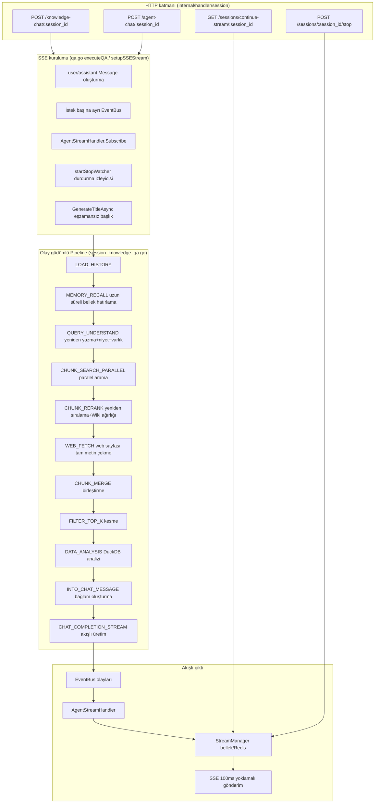
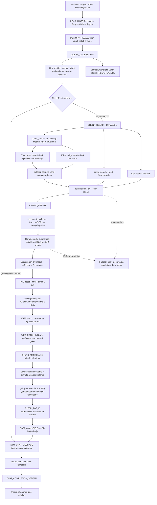
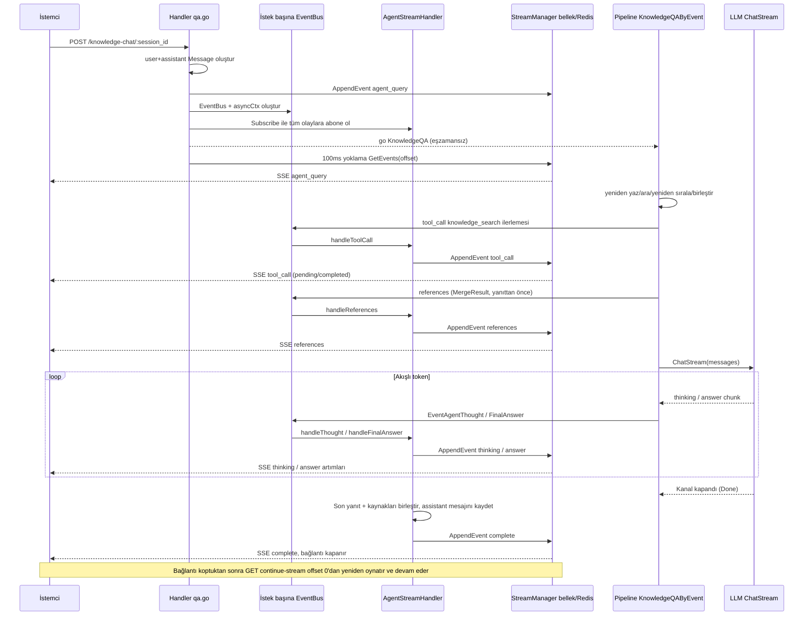

# Uçtan Uca Arama-Soru Yanıt Akışı (RAG Pipeline)

Bilgi soru-cevap isteği, olay odaklı RAG işlem hattına girer; niyet tanıma, soru yeniden yazımı, arama, yeniden sıralama ve bağlam birleştirme sonrasında yanıt üretilir. Yanıt SSE akışı olarak döner, alıntılar çıktı sırasında genişletilir; akış yöneticisi bağlantı kesilmesinden sonra olayların kurtarılmasından sorumludur.

## Genel Mimari {#genel-mimari}

Rethra'nın soru-cevap akışı, **olay odaklı bir eklenti hattıdır (Event-Driven Plugin Pipeline)**: her aşama, `Plugin` arayüzünü uygulayan ve `EventManager` üzerine kaydedilen bir eklentidir; düzenleyici (`KnowledgeQAByEvent`), dinamik olarak oluşturulan `EventType` listesindeki olayları tek tek tetikler ve eklentiler sorumluluk zinciri (`next()`) aracılığıyla birbirine bağlanır. Üretim sonucu doğrudan HTTP yanıtına yazılmaz; bunun yerine istek başına bağımsız `EventBus` üzerinden olaylar yayımlanır, `AgentStreamHandler` bunları paylaşılan `StreamManager` içine aktarır (bellek veya Redis) ve HTTP katmanı olayları 100 ms aralıklarla yoklayarak SSE istemcisine gönderir — bu tasarım doğal olarak **bağlantı kesilmesi sonrası kaldığı yerden devam etmeyi** ve **dağıtık çoklu kopya dağıtımını** destekler.



## Olay Odaklı Eklenti Çerçevesi {#olay-odakli-eklenti-cercevesi}

### Plugin Arayüzü ve Sorumluluk Zinciri {#plugin-arayuzu-ve-sorumluluk-zinciri}

`internal/application/service/chat_pipeline/chat_pipeline.go`, temel soyutlamayı tanımlar:

```go
type Plugin interface {
    OnEvent(ctx context.Context, eventType types.EventType,
        chatManage *types.ChatManage, next func() *PluginError) *PluginError
    ActivationEvents() []types.EventType
}
```

`EventManager`, `eventType → []Plugin` eşlemesini yönetir. `Register` sırasında kayıt sırasına göre ekleme yapar ve `buildHandler` ile arkadan öne doğru iç içe kapanışlardan oluşan bir sorumluluk zinciri kurar: **aynı olay için önce kaydedilen eklenti zincirin dış katmanında, sonra kaydedilen ise iç katmanında yer alır**; dış katmandaki eklenti, `OnEvent` içinde `next()` çağırdığında iç katmana geçilir. Eklentiler, `next()` öncesinde ön işlem yapabilir (çoğu eklenti) veya önce `next()` çağırıp sonra son işlem gerçekleştirebilir (`PluginWikiBoost` gibi, yeniden sıralamadan sonra ağırlık ekler).

Hatalar `*PluginError` aracılığıyla yayılır; önceden tanımlı hatalar arasında `ErrSearchNothing` (arama sonucu yoktur, başarısızlık yerine yedek yanıtı tetikler), `ErrRerank`, `ErrGetChatModel`, `ErrModelCall` ve diğerleri bulunur (`chat_pipeline.go`).

### Kayıt Sırası (container.go) {#kayit-sirasi-container-go}

Tüm eklentiler DI kapsayıcısında `container.Invoke` aracılığıyla oluşturulur ve kendilerini kaydeder (`internal/container/container.go`); kayıt sırası, aynı olay zincirindeki çalıştırma sırasıdır:

```go
must(container.Provide(chatpipeline.NewEventManager))
must(container.Invoke(chatpipeline.NewPluginSearch))               // CHUNK_SEARCH
must(container.Invoke(chatpipeline.NewPluginRerank))               // CHUNK_RERANK (zincirin dış katmanı)
must(container.Invoke(chatpipeline.NewPluginWebFetch))             // WEB_FETCH
must(container.Invoke(chatpipeline.NewPluginMerge))                // CHUNK_MERGE
must(container.Invoke(chatpipeline.NewPluginDataAnalysis))         // DATA_ANALYSIS
must(container.Invoke(chatpipeline.NewPluginIntoChatMessage))      // INTO_CHAT_MESSAGE
must(container.Invoke(chatpipeline.NewPluginChatCompletion))       // CHAT_COMPLETION
must(container.Invoke(chatpipeline.NewPluginChatCompletionStream)) // CHAT_COMPLETION_STREAM
must(container.Invoke(chatpipeline.NewPluginFilterTopK))           // FILTER_TOP_K
must(container.Invoke(chatpipeline.NewPluginQueryUnderstand))      // QUERY_UNDERSTAND (zincirin dış katmanı)
must(container.Invoke(chatpipeline.NewPluginLoadHistory))          // LOAD_HISTORY
must(container.Invoke(chatpipeline.NewPluginMemoryRecall))         // MEMORY_RECALL
must(container.Invoke(chatpipeline.NewPluginExtractEntity))        // QUERY_UNDERSTAND (zincirin iç katmanı)
must(container.Invoke(chatpipeline.NewPluginSearchEntity))         // ENTITY_SEARCH
must(container.Invoke(chatpipeline.NewPluginSearchParallel))       // CHUNK_SEARCH_PARALLEL
must(container.Invoke(chatpipeline.NewPluginWikiBoost))            // CHUNK_RERANK (zincirin orta katmanı)
must(container.Invoke(chatpipeline.NewPluginMemoryAffinity))       // CHUNK_RERANK (zincirin en iç katmanı)
```

Olaylar ve eklentilerin tam eşlemesi (aynı olay zincirinin sırası dahil):

| EventType | Eklentiler (zincir sırasına göre) | Kaynak dosya |
|-----------|---------------|--------|
| `load_history` | PluginLoadHistory | `load_history.go` |
| `memory_recall` | PluginMemoryRecall | `memory_recall.go` |
| `query_understand` | PluginQueryUnderstand → PluginExtractEntity | `query_understand.go`, `extract_entity.go` |
| `chunk_search` | PluginSearch | `search.go`, `query_expansion.go` |
| `chunk_search_parallel` | PluginSearchParallel (dahili olarak PluginSearch + PluginSearchEntity birleştirir) | `search_parallel.go` |
| `entity_search` | PluginSearchEntity | `search_entity.go` |
| `chunk_rerank` | PluginRerank → PluginWikiBoost → PluginMemoryAffinity | `rerank.go`, `wiki_boost.go`, `memory_affinity.go` |
| `web_fetch` | PluginWebFetch | `web_fetch.go` |
| `chunk_merge` | PluginMerge | `merge.go`, `merge_overlap.go`, `merge_expand.go`, `merge_faq.go`, `merge_history.go` |
| `data_analysis` | PluginDataAnalysis | `data_analysis.go` |
| `into_chat_message` | PluginIntoChatMessage | `into_chat_message.go` |
| `chat_completion` | PluginChatCompletion | `chat_completion.go` |
| `chat_completion_stream` | PluginChatCompletionStream | `chat_completion_stream.go` |
| `filter_top_k` | PluginFilterTopK | `filter_top_k.go` |

### ChatManage: Tüm Akış Boyunca Kullanılan Durum Nesnesi {#chatmanage-tum-akis-boyunca-kullanilan-durum-nesnesi}

`internal/types/chat_manage.go` içindeki `ChatManage`, üç gömülü bölümden oluşur:

- **PipelineRequest** (değişmez istek yapılandırması): `Query`, `KnowledgeBaseIDs`/`KnowledgeIDs`/`SearchTargets`, `VectorThreshold`/`KeywordThreshold`/`EmbeddingTopK`, `RerankModelID`/`RerankTopK`/`RerankThreshold`, `ChatModelID`/`SummaryConfig`, `FallbackStrategy`, `CitationEnabled`, `EnableRewrite`/`EnableQueryExpansion`, FAQ stratejileri (`FAQPriorityEnabled`/`FAQDirectAnswerThreshold`/`FAQScoreBoost`), `DataAnalysisEnabled`, çoklu ortam (`Images`/`VLMModelID`/`ChatModelSupportsVision`), Web araması (`WebSearchEnabled`/`WebFetchEnabled`/`WebFetchTopN`) vb.
- **PipelineState** (eklentiler arasında okunan ve yazılan ara durum): `RewriteQuery`, `Intent`, `History`, `SearchResult` → `RerankResult` → `MergeResult` şeklinde üç seviyeli sonuçlar, `Entity`/`EntityKBIDs`/`GraphResult`, `UserContent`, `RenderedContexts`, `SystemPromptOverride` vb.
- **PipelineContext** (çalışma zamanı tutamaçları): `EventBus`, `MessageID` (assistant mesaj kimliği), `UserMessageID`.

`ChatManage.Clone()`, derin kopyalama sağlar (paralel arama sırasında paylaşılan slice'ların eşzamanlı okunmasını ve yazılmasını önler), ancak `PipelineContext` öğesini kopyalamaz.

### Dinamik İşlem Hattı Oluşturma (PipelineBuilder) {#dinamik-islem-hatti-olusturma-pipelinebuilder}

`session_knowledge_qa.go` içindeki `KnowledgeQA`, olay listesini istek özelliklerine göre dinamik olarak oluşturur:

```go
// Yalnızca sohbet (KB yok ve Web araması kapalı)
pipeline = types.NewPipelineBuilder().
    AddIf(hasHistory, types.LOAD_HISTORY).
    Add(types.MEMORY_RECALL).
    Add(types.CHAT_COMPLETION_STREAM).Build()

// RAG
pipeline = types.NewPipelineBuilder().
    AddIf(hasHistory, types.LOAD_HISTORY).
    Add(types.MEMORY_RECALL).
    Add(types.QUERY_UNDERSTAND).
    Add(types.CHUNK_SEARCH_PARALLEL).
    Add(types.CHUNK_RERANK).
    AddIf(webSearchEnabled, types.WEB_FETCH).
    Add(types.CHUNK_MERGE).
    Add(types.FILTER_TOP_K).
    AddIf(chatManage.DataAnalysisEnabled, types.DATA_ANALYSIS).
    Add(types.INTO_CHAT_MESSAGE).
    Add(types.CHAT_COMPLETION_STREAM).Build()
```

`types.Pipeline` map'i ayrıca dinamik oluşturma gerektirmeyen çağıranlar için `chat` / `chat_stream` / `chat_history_stream` / `rag` / `rag_stream` gibi statik ön ayarları da korur.

### Düzenleyici KnowledgeQAByEvent {#duzenleyici-knowledgeqabyevent}

`KnowledgeQAByEvent` (`session_knowledge_qa.go`), her birini `eventManager.Trigger` ile tetikler ve çok sayıda çevresel işlem de gerçekleştirir:

- Her aşamayı bir Langfuse span ile sarın (`pipeline.<event_type>`); `CHAT_COMPLETION_STREAM` istisnadır (OnEvent'i hemen döner, span akış bitmeden önce tamamlanır).
- **İlerleme olayları**: `progress.go`, `CHUNK_SEARCH_PARALLEL → CHUNK_RERANK → CHUNK_MERGE → FILTER_TOP_K` aşamalarını (koşullu `WEB_FETCH`/`DATA_ANALYSIS` dahil) ön uçta görünen tek bir `knowledge_search` tool_call ilerleme penceresinde birleştirir; `QUERY_UNDERSTAND` ayrı bir `query_understand` penceresidir. Hata/kısa devre yolları da pencereyi kapatır; böylece ön uçtaki "Bilgi bankası aranıyor" göstergesi sürekli dönmez.
- **Önce kaynaklar**: `CHAT_COMPLETION_STREAM` tetiklenmeden önce `emitKnowledgeReferencesEvent` çağrılarak `MergeResult`, `references` olayı olarak gönderilir — bu, SSE bağlantısı kapanmadan önce istemcinin kaynak listesini almasını garanti eder.
- **İptal önceliği**: Her aşama bitiminde önce `ctx.Err()` denetlenir (kullanıcının stop işlemi bağlamı iptal eder); bu denetim `ErrSearchNothing` kontrolünden önce yapılmalıdır, aksi halde durdurma işlemi "arama sonucu yok" diye yanlış değerlendirilip yedek yanıt yazılır.
- **Yedek**: `ErrSearchNothing` → `handleFallbackResponse`: `FallbackStrategyFixed` doğrudan sabit `FallbackResponse` metnini gönderir; `FallbackStrategyModel`, modelin serbestçe yanıtlaması için `FallbackPrompt` kullanır.

## Her aşamadaki eklentilerin ayrıntıları {#her-asamadaki-eklentilerin-ayrintilari}

### LOAD_HISTORY — Oturum geçmişini yükle {#load-history-oturum-gecmisini-yukle}

`load_history.go`. `MaxRounds <= 0`, Agent'ın çok turlu konuşmayı açıkça kapattığı anlamına gelir (`MultiTurnEnabled=false`); doğrudan atlanır, genel varsayılana **geri** dönülmez. Aksi halde `loadAndProcessHistory` (`common.go`) çağrılır:

1. `messageService.GetRecentMessagesBySession`, en son `maxRounds*2+10` iletiyi alır;
2. `RequestID` ile user/assistant iletilerini `types.History` olarak eşler (user tarafına görsel Caption ve ek prompt'u eklenir; assistant tarafında düşünme etiketleri `regThinkTags` düzenli ifadesiyle kaldırılır ve `KnowledgeReferences` taşınır);
3. Zaman ters sırasıyla `maxRounds` tur kesilir, ardından zaman doğrusal sırasına çevrilir ve `chatManage.History` içine yazılır.

Not: Geçmiş user iletileri, özgün `Content` ile yeniden oynatılır; `RenderedContent` kullanılmaz (eski bağlam zarflarının geçerli protokole karışmasını önlemek için). Geçmiş kaynaklar ayrıca `merge_history.go` üzerinden eklenir.

### MEMORY_RECALL — Uzun süreli belleği çağır {#_3-1a-memory-recall}

`memory_recall.go`. Alan için uzun süreli bellek etkinse, mevcut soruya göre çağıranın belleği geri çağrılarak `chatManage.MemoryPrompt` içine yazılır ve ön ucun bu turda kullanılan belleği göstermesi için `memory_recalled` olayı gönderilir. Bu aşama modeli çağırmaz; başarısızlık soru-cevap akışını engellemez. Belleğin açılması ve yönetimi için bkz. [Oturumlar arası uzun süreli bellek](../03-features/23-memory.md).

### QUERY_UNDERSTAND — Sorgu yeniden yazımı + niyet tanıma (+ varlık çıkarımı) {#query-understand-sorgu-yeniden-yazimi-niyet-tanima-varlik-cikarimi}

Aynı olayda iki eklenti ardışık olarak bağlanır:

**PluginQueryUnderstand** (`query_understand.go`) yeniden yazma ve niyet sınıflandırmasından sorumludur:

- Girdi birleşimleri üç türdür: yalnızca metin (chat model), metin+görsel ve yalnızca görsel (öncelikle görmeyi destekleyen chat model, aksi halde `VLMModelID`).
- Prompt, `config/prompt_templates/rewrite.yaml` dosyasından (system + user çifti) gelir ve Agent düzeyindeki `RewritePromptSystem`/`RewritePromptUser` tarafından geçersiz kılınabilir; `{conversation}` / `{query}` / `{language}` yer tutucuları `types.RenderPromptPlaceholders` ile işlenir.
- Modelin JSON çıktısı vermesi istenir: `{"rewrite_query":"...","intent":"kb_search","image_description":"..."}`; ayrıştırma toleranslıdır (markdown sarmalayıcıları, alan eş adları, OCR alanlarının birleştirilmesi). Yanıt çıktı sınırı nedeniyle kesilirse, yazılmış olan `rewrite_query`, `intent` ve yarım kalmış `image_description` alanları kurtarılır; hiç ayrıştırılamazsa özgün sorgu korunur, niyet boş kalır (gerektiğinde arama yapılır). Görsel içeren turlarda çıktı sınırı 2048 token'dır (prompt, OCR metninin tamamının `image_description` içine konmasını ister).
- Niyet numaralandırması (`types.QueryIntent`): `kb_search`, `web_search`, `greeting`, `chitchat`, `follow_up`, `image_only`, `doc_only`, `summarize`, `clarification`. Modelin verdiği niyet önce `types.NormalizeQueryIntent` ile normalleştirilir (büyük/küçük harf ile `-`/boşluk yok sayılır; örn. `KB-Search` → `kb_search`); tanınmayan etiketler boş değer olarak işlenir. `NeedsKBRetrieval()` yalnızca `kb_search`/`clarification`/`summarize`/boş değer için true döndürür; `ChatManage.NeedsRetrieval()`, `web_search` için ayrıca `WebSearchEnabled` değerine bakar (etkin değilse, kullanıcıya çevrimiçi aramanın şu anda kullanılamadığını bildiren niyet prompt'una gider). **Sonraki tüm arama eklentileri, atlama koşulu olarak `NeedsRetrieval()` kullanır**.
- Arama dışı niyetlerde `applyIntentPromptOverride`, `config/prompt_templates/intent_prompts.yaml` dosyasını (şablon kimliği niyet değeriyle bire bir eşleşir; örn. `greeting`) veya Agent geçersiz kılma ayarı olan `SystemPromptOverride` değerini kullanır.
- Görsel açıklaması, bir sonraki tur geçmişinde kullanılmak üzere user iletisinin `Images[0].Caption` alanına eşzamansız yazılır.
- Bu aşama için küçük bir model, `QueryUnderstandModelID` ile ayrıca belirtilebilir; başarısız olursa `ChatModelID` kullanılır.

**PluginExtractEntity** (`extract_entity.go`) zincirin iç katmanında çalışır: yalnızca `NEO4J_ENABLE=true` olduğunda, bu turdaki niyet bilgi bankası araması gerektirdiğinde (selamlaşma, sohbet vb. çağırmaz) ve arama kapsamındaki bilgi bankalarından en az birinde `ExtractConfig.Enabled` bulunduğunda; öncelikle yeniden yazılmış sorguyu kullanır, `config.ExtractManager.ExtractEntity` şablonuyla (`graph_extraction.yaml`) LLM'i çağırarak sorgu varlıklarını çıkarır ve `ENTITY_SEARCH` tarafından kullanılmak üzere `chatManage.Entity` / `EntityKBIDs` / `EntityKnowledge` alanlarına yazar.

### CHUNK_SEARCH_PARALLEL — Paralel arama (chunk + grafik varlıkları) {#chunk-search-parallel-paralel-arama-chunk-grafik-varliklari}

`search_parallel.go`. `NeedsRetrieval()` yanlışsa doğrudan atlanır. Aksi takdirde `chatManage` iki kez `Clone()` edilir ve `RunParallel` ile eşzamanlı yürütülür:

- `chunk_search`: dahili (kayıtlı olmayan) `PluginSearch.OnEvent(CHUNK_SEARCH, ...)`;
- `entity_search`: varlık olduğunda `PluginSearchEntity.OnEvent(ENTITY_SEARCH, ...)` çalıştırılır; Neo4j içinde `NameSpace{KnowledgeBase, Knowledge}` ile paralel `SearchNode` yapılır, eşleşen grafik düğümleri/ilişkileri SearchResult'a dönüştürülür ve `GraphResult` oluşturulur. Chunk'lar ve belgeler ID ile sorgulanır (mevcut çalışma alanıyla sınırlı değildir; kuruluşun paylaşılan bilgi tabanındaki grafik eşleşmeleri de çözümlenebilir). Yalnızca bu arama turunun kapsamındaki bilgi tabanlarına ait, hâlâ etkin olan ve belgesi mevcut chunk'lar tutulur; en fazla 30 adet alınır. Grafik eşleşmelerinin arama puanı yoktur (`Score=0`); yeniden sıralamada bunun yerine model puanı kullanılır.

İki yolun sonuçları birleştirildikten sonra `removeDuplicateResults` ile yinelenenler kaldırılır (`chunk ID + içerik imzası` `searchutil.BuildContentSignature` temelinde). Her iki yol da boşsa `ErrSearchNothing` döndürülür.

**PluginSearch** (`search.go`) içinde de iki eşzamanlı yol vardır:

1. **KB araması** `searchByTargets`:
   - `SearchTargets`, "embedding model kimliği (`model.Name + BaseURL`, kiracılar arasında paylaşılabilir)" temelinde gruplandırılır (`ResolveEmbeddingModelKeys`); her grup için sorgu vektörü yalnızca bir kez hesaplanır (`GetQueryEmbedding`);
   - Grup içindeki etiketsiz/belge kısıtsız tüm bilgi tabanı hedefleri **tek** bir `HybridSearch` çağrısında birleştirilir (`params.KnowledgeBaseIDs` birden fazla taban taşır); kısıtlı hedefler tek tek `searchSingleTarget` ile aranır (`KnowledgeIDs`/`TagIDs`/`ScopeTagIDs` taşınır ve kapsamı açıkça belirlenmiş hedeflerde geri çağırma eşikleri `DisableRecallThresholds` ile kapatılabilir);
2. **Web araması** `searchWebIfEnabled`: `WebSearchEnabled` durumunda kiracı/Agent tarafından çözümlenen `WebSearchProviderID` ile `webSearchService.Search` çağrılır; sonuçlar `searchutil.ConvertWebSearchResults` üzerinden SearchResult'a dönüştürülür (URL, ID olarak kullanılır; `KnowledgeSource="web_search"`).

**Sorgu genişletme** (`query_expansion.go`): `EnableQueryExpansion` etkin olduğunda ve ilk geri çağırma sayısı `EmbeddingTopK` değerinden düşükse tetiklenir. LLM çağrılmaz; sorgu varyantları yerelde üretilir (durak sözcüklerin kaldırılması, sözcük sırasının değiştirilmesi, anahtar ifadelerin çıkarılması vb.). Çince sözcükleme `types.Jieba.CutForSearch` üzerinden yapılır: ardışık Han karakteri paragrafları bir bütün olarak jieba'ya verilerek sözcüklere ayrılır, İngilizce/sayılarla karışık metinler yazı sistemi geçişlerine göre bölümlere ayrılarak işlenir; artık "her Han karakteri bir token" durumuna düşülmez. Durak sözcük ve uzunluk filtreleri rune sayısına göre uygulanır; böylece çok baytlı karakterler tek karakter sanılmaz. Her (varyant × SearchTarget) birleşimi için, yalnızca anahtar sözcük kullanan `HybridSearch` eşzamanlı olarak (semafor üst sınırı 16) yürütülür. Varyantlar geri çağırmayı yalnızca anahtar sözcük tarafında artırır; vektör tarafı özgün sorguyla neredeyse aynıdır ve her varyant için yeniden embedding oluşturulmaz. Anahtar sözcük eşiği özgün değerin 0.8'ine gevşetilir, TopK ise `max(EmbeddingTopK, RerankTopK) * 2` değerine çıkarılır; anahtar sözcük araması kapalıysa genişletme yapılmaz.

### CHUNK_RERANK — Yeniden sıralama, bileşik puanlama, MMR, Wiki ağırlıklandırması {#chunk-rerank-yeniden-siralama-bilesik-puanlama-mmr-wiki-agirliklandirmasi}

**PluginRerank** (`rerank.go`, 720 satır):

1. **Passage temizleme** `cleanPassageForRerank`: Yeniden sıralama modeli anlamsal benzerlik üzerinde çalışır; Markdown yapı sözdizimi gürültüdür. Kod blokları ve `$$...$$` formül bloklarında **yalnızca çerçeveler kaldırılır, iç metin korunur** (eski uygulama bloğun tamamını siliyordu; yalnızca kod veya formül içeren adaylar boş dizeye dönüşerek puan kaybediyordu). HTML etiketleri, görsel başvuruları, bağlantı işaretleri (metin korunur), yalın URL'ler, tablo ayırıcı satırları (veri satırları virgülle birleştirilir), başlık/alıntı/kalın/liste işaretleri sırayla kaldırılır; son olarak fazladan boş satırlar sıkıştırılır.
2. **Passage zenginleştirme** `getEnrichedPassage`: `ImageInfo` içindeki Caption/OCR metni ve `ChunkMetadata` içindeki üretilmiş sorular (GeneratedQuestions) eklenir; ana metinle aynı olan görsel metinleri (OCR / açıklama chunk'ının kendisi) tekrar eklenmez. Model yapılandırmasında tek passage veya tek istek için uzunluk sınırı varsa, aşırı uzun passage sonundan sınıra kadar kesilir; adaylardan arama puanına göre en fazla 200 tanesi puanlamaya gönderilir.
3. `rerankModel.Rerank(ctx, RewriteQuery, passages)` çağrılır ve `RerankThreshold` ile filtrelenir:
   - Tümü eşik altında olsa da top1 ≥ `rerankFallbackMinScore` ise (varsayılan 0.15; kullanıcı etiket/belge kapsamını açıkça belirlediğinde 0, yetkili kapsamın en iyi adayını korur) → güvence olarak top1 tutulur;
   - Sonuç yoksa ve eşik > 0.3 ise → **eşik düşürülerek** bir kez yeniden denenir (`threshold * 0.7`, alt sınır 0.3);
   - Rerank modeli yüklenemezse (silinmiş, yapılandırma hatalı) veya API başarısız olursa (varsayılan 60 saniyelik zaman aşımı dahil) → özgün arama sonuçlarına geri dönülerek işlem hattına devam edilir.
4. **Bileşik puanlama** `compositeScore`: `0.6*model puanı + 0.3*arama taban puanı + 0.1*kaynak ağırlığı` (`web_search` kaynak ağırlığı 0.95, diğerleri 1.0), [0,1] aralığına sınırlandırılır. Grafik varlık aramasından gelen chunk'ların arama puanı yoktur; taban puanı olarak model puanı kullanılır. Taban/model/bileşik puanlar `Metadata["base_score"]` / `["model_score"]` / `["composite_score"]` içinde kaydedilir. Eski sürümlerde ayrıca "belgenin başına yaklaştıkça daha yüksek" bir konum önseliyle (±0.05) çarpılırdı; chunk düzenlemelerinden sonraki ofset değişimlerine bağlı olması ve faydasının belirsiz olması nedeniyle kaldırılmıştır.
5. **FAQ ağırlıklandırması**: `FAQPriorityEnabled` etkin ve `FAQScoreBoost > 1.0` olduğunda FAQ chunk puanı boost ile çarpılır, `Metadata["faq_boosted"]` kaydedilir. Sonuçlar 1.0 ile sınırlandırılmaz; sınırlandırmak yüksek puanlı FAQ'ların tümünü 1.0'da eşitleyerek aralarındaki sıralamayı tie-breaker'a indirger.
6. **MMR çeşitlilik seçimi** `applyMMR` (λ=0.7, k=`RerankTopK`): `mmr = 0.7*relevance - 0.3*max_jaccard_redundancy`; `searchutil.TokenizeSimple` + `Jaccard` ile token kümeleri paralel olarak önceden hesaplanır ve `RerankResult` yinelemeli açgözlü seçimle belirlenir.

**PluginMemoryAffinity** (`memory_affinity.go`) zincirin en iç katmanında kayıtlıdır; aynı şekilde önce `next()` çağrılır, ardından son işlem yapılır: Bu çağıranın geçmiş yanıtlarında en az 2 kez alıntılanmış belgeler, kullanım sayısının logaritmik artışına göre ağırlıklandırılır; en fazla ×1.15 uygulanır ve yalnızca yakın adaylar arasındaki eşitlikleri bozmak için kullanılır. Bundan sonra WikiBoost'un son işlem ağırlıklandırması uygulanır.

**PluginWikiBoost** (`wiki_boost.go`) aynı olay zincirinin orta katmanında kayıtlıdır; OnEvent önce `next()` çağırır (yeniden sıralama tamamlanana kadar), ardından son işlem yapar: `RerankResult` içinde `wiki_page` türünde bir chunk varsa ve arama hedeflerinde Wiki etkin bir KB gerçekten bulunuyorsa, puan `wikiBoostFactor = 1.3` ile çarpılır ve kararlı biçimde yeniden sıralanır — Wiki sayfaları LLM tarafından önceden sentezlenmiş bilgidir ve ham chunk'lara öncelik verilir.

### WEB_FETCH — Web sayfasının tam metnini getirme {#web-fetch-web-sayfasinin-tam-metnini-getirme}

`web_fetch.go`. Yalnızca `WebFetchEnabled && WebSearchEnabled` olduğunda. `RerankResult` içindeki ilk `WebFetchTopN` (varsayılan 3) web sonucunu alır, gövdeleri paralel olarak `web_fetch.FetchURLContent(ctx, url)` ile çeker, özet snippet'ini değiştirir (8000 bayta kesilir). Yeniden sıralamadan sonra, birleştirmeden önce yer alır — çekme maliyeti yalnızca bağlama girecek yüksek puanlı web sayfaları için ödenir.

### CHUNK_MERGE — Sekiz adımlı kaynaştırmalı birleştirme {#chunk-merge-sekiz-adimli-kaynastirmali-birlestirme}

`merge.go` içindeki `OnEvent` yorumu zaten akış açıklamasıdır:

1. **Girdileri seçme**: Önce `RerankResult`, boşsa `SearchResult` kullanılır (puana göre sıralanır ve `RerankTopK` ile kesilir; böylece tüm geri çağrılan sonuçlar için tabloya dönüş ve genişletme yapılmaz);
2. **Yinelenenleri kaldırma**: ID + içerik imzası;
3. **Geçmiş referanslarını ekleme** (`merge_history.go`): Referans içeren en son geçmiş turundan `KnowledgeReferences` alınır; referansın kaç sorgu sözcüğünü kapsadığına göre filtrelenir (örtüşme katsayısı `|q∩c|/min(|q|,|c|)` ≥ 0.3; Jaccard birleşime bölünür, yaklaşık 8 sözcüklü bir sorgu yüzlerce sözcüklük bir parçayla asla eşiğe ulaşamaz), puan 0.6 ile çarpılır, en fazla 3 kayıt eklenir ve `MatchTypeHistory` olarak işaretlenir;
4. **Üst-alt parça çözümleme** `resolveParentChunks`: text alt parçaları ile image_ocr/image_caption alt parçaları, bağlamı **geçerli** parent_text içeriğiyle tamamlar; resim Markdown'ının daraltılması ayrıştırıcı koordinatlarıyla değil, kararlı resim URL'siyle (`PruneMarkdownImagesByImageInfo`) yapılır; ImageInfo yalnızca eşleşen text alt parçalarıyla sıkı biçimde sınırlandırılır, böylece resim yoğun bir üst parça kardeş sayfaların tüm OCR içeriğini bağlama doldurmaz. image → text → parent_text zinciri, yalnızca gerçekten bir resim sonucu eşleştiğinde büyük ebeveyn parçaya bir kez daha bakar;
5. **Gruplandırılmış sıralı birleştirme** `groupAndMergeCurrentContent`: `KnowledgeID + ChunkType` ile gruplandırılır, grup içinde `ChunkIndex` ile sıralandıktan sonra `mergeSequentialChunks` uygulanır — sıra numaraları ardışıksa veya taraflardan birinin içeriği diğerini içeriyorsa `searchutil.JoinChunkContent` ile birleştirilir, en yüksek puan korunur, `SubChunkID` birleştirilen parçaları kaydeder, `mergeImageInfo` resim bilgisini URL'ye göre tekilleştirip birleştirir;
6. **FAQ yanıtını doldurma** (`merge_faq.go`): FAQ türündeki chunk'lar için `FAQMetadata` toplu olarak tablodan okunur, Content `Q: standart soru + Answer: yanıt listesi` biçiminde yeniden yazılır;
7. **Kısa bağlam komşusu genişletme** (`merge_expand.go`): text parçasının içeriği 350 karakterden azsa, `PreChunkID`/`NextChunkID` komşuları toplu olarak alınır ve yaklaşık en fazla 850 karaktere kadar birleştirilir. Eşleşen parça bütünüyle korunur; kalan uzunluk, hemen yanındaki önceki metnin sonu ile sonraki metnin başı arasında paylaştırılır. Komşular aynı belgeye ait olmalıdır; kuruluşun paylaşılan bilgi tabanındaki parçalar da genişletilebilir;
8. Genişletmenin getirdiği yeni yinelenenler **bir kez daha birleştirilir**, son olarak tekilleştirme + `removePartialOverlaps` uygulanır (normalleştirilmiş içerme denetimi / token örtüşme oranı ≥ 0.85 olan bilgi tabanları arası yakın yinelenenler silinir, düşük puanlı olan kaldırılır; örtüşme oranı yalnızca iki tarafın token sayıları 3 kattan fazla farklı değilse karşılaştırılır; böylece uzun web sayfalarının veya üst parçaların kısa parçaları "kapsaması" önlenir; her metin yalnızca bir kez token'lara ayrılır).

Sonuç `chatManage.MergeResult` içine yazılır.

::: tip Neden artık karakter ofsetleri kullanılmıyor
Parçalar elle düzenlemeyi destekledikten sonra, `StartAt` / `EndAt` gibi ayrıştırıcı koordinatları artık "geçerli içeriğin özgün metindeki konumunu" güvenilir biçimde gösteremez — tek bir düzenleme bile aralık uzunluğunu gövde uzunluğuyla uyumsuz hâle getirebilir. Bu nedenle birleştirme aşaması, komşuluk ve içerme ilişkilerini belirlemek için tamamen **geçerli gövde + `ChunkIndex` sıra numarası** kullanır (`JoinChunkContent` / `ContainsChunkContent` metin düzeyinde tekilleştirilmiş birleştirme yapar); kaynak koordinatlar yalnızca referans konumlandırması için korunur. `FILTER_TOP_K` eşitlik bozma anahtarı da `StartAt`/`EndAt` yerine `ChunkIndex` oldu.
:::

### FILTER_TOP_K — Belirlenimci sıralama ve kesme {#filter-top-k-belirlenimci-siralama-ve-kesme}

`filter_top_k.go`. `MergeResult` üzerinde (`RerankResult`/`SearchResult` sırasıyla varsayılan geri dönüşlerdir) `sortSearchResultsDeterministically` çalıştırılır — puan azalan sırada, `KnowledgeID`/`ChunkType`/`ChunkIndex`/`ID` kararlı eşitlik bozucuları olarak kullanılır (merge aşamasındaki map gezintisi sırayı bozabilir; burada küresel olarak yeniden üretilebilir sıralama geri yüklenir), ardından `RerankTopK` ile kesilir.

### DATA_ANALYSIS — DuckDB tablo verisi analizi {#data-analysis-duckdb-tablo-verisi-analizi}

`data_analysis.go`. Varsayılan olarak kapalıdır (`DataAnalysisEnabled`, Agent yapılandırmasından gelir). `MergeResult` bir CSV/Excel dosyasıyla eşleşirse: önce `table_column`/`table_summary` türündeki chunk'lar filtrelenir, ilk veri dosyası alınır, `tools.NewDataAnalysisTool` ile dosya DuckDB'ye yüklenip schema alınır; LLM'nin veri analizinin gerekli olup olmadığına karar vermesi ve DuckDB SQL üretmesi sağlanır (`DataAnalysisInput` yapılandırılmış çıktısı), yürütmeden sonra sonuç `MatchTypeDataAnalysis`, score=1.0 olan sentetik bir SearchResult olarak `MergeResult` içine eklenir.

### INTO_CHAT_MESSAGE — Bağlam oluşturma {#into-chat-message-baglam-olusturma}

`into_chat_message.go`:

- `utils.ValidateInput`, sorgu güvenliğini doğrular (enjeksiyon koruması);
- Geri getirme dışı niyet yolu: `current_time` gibi çalışma zamanı meta verilerini eklemek için `ContextTemplate` ile yine işlenir (`contexts` boştur);
- **FAQ öncelik stratejisi**: `FAQPriorityEnabled` etkin olduğunda FAQ ve belge sonuçları, `source type="faq" priority="high"` ile `source type="document" priority="supplementary"` olmak üzere iki bölüme ayrılır; ağırlıklandırma öncesi puanı (`composite_score`, yeniden sıralama yoksa geri getirme puanıdır) ≥ `FAQDirectAnswerThreshold` olan ilk FAQ'nın context'i `match="exact"` olarak işaretlenir (modele bu yanıtı doğrudan benimseyebileceği bildirilir). FAQ/Wiki/bellek ağırlıklandırmasının orta düzey eşleşmeleri eşiğin üzerine çıkarmasını önlemek için ağırlıklandırma öncesi puan karşılaştırılır;
- Normal yol, geliştirilmiş her passage'ı `context id="N"` sırasıyla numaralandırıp sarar (`getEnrichedPassageForChat`, ImageInfo'yu Markdown resmi + açıklaması olarak içeriğe satır içi ekler);
- Başlık `buildDocumentHeader`, tekilleştirilmiş belge meta bilgilerini (title/description) üretir;
- `SummaryConfig.ContextTemplate` işlenir (`config/prompt_templates/context_template.yaml` kaynağından), yer tutucular `{query}` / `{contexts}` / `{language}`; resim açıklamaları (görsel olmayan modeller için), alıntı bağlamı `QuotedContext`, ek prompt'u eklenir;
- Birleştirilmiş `UserContent`, denetim ve hata ayıklama için user mesajının `RenderedContent` alanına **eşzamansız olarak geri yazılır** (`persistRenderedContent`); `RenderedContexts`, referans değiştirme için salt contexts dizgesini saklar.

### CHAT_COMPLETION / CHAT_COMPLETION_STREAM — Üretim {#chat-completion-chat-completion-stream-uretim}

İki eklenti, `common.go` içindeki yardımcı işlevleri paylaşır:

- `prepareChatModel`: chat modelini alır ve `SummaryConfig` üzerinden `ChatOptions` değerlerini (Temperature/TopP/Seed/MaxTokens/Thinking vb.) yapılandırır;
- `prepareMessagesWithHistory`: system prompt = `SystemPromptOverride` (niyet geçersiz kılması) veya `SummaryConfig.Prompt` (`system_prompt.yaml`); yer tutucular işlendikten sonra, getirilen bağlam Markdown resimleri içeriyorsa "getirilen resim çıktı gereksinimleri" bölümü eklenir (`appendRetrievedImageOutputRequirement`); ardından zaman sırasıyla geçmiş Q/A çiftleri ve son olarak mevcut user mesajı eklenir (görsel modelde `Images` de bulunur).

`references.go` içindeki `prepareMessagesWithModelContext` bunun üzerine **kaynak takma adı değişimi** yapar (ayrıntılar için bkz. [Kaynak (Citation) üretim mekanizması](#kaynak-citation-uretim-mekanizmasi)): `RenderedContexts` içindeki konum numaralı bağlamı, `modelcontext.Registry` tarafından üretilen ve isteğe göre yalıtılmış chunk takma adı görünümüyle değiştirir ve system prompt'un sonuna kaynak gösterme protokolünü ekler.

**Akışlı sürüm** (`chat_completion_stream.go`), `EventBus` öğesinin mutlaka mevcut olmasını gerektirir; `chatModel.ChatStream` çağrısından sonra yanıt kanalını tüketmek için bir goroutine başlatır:

- `ResponseTypeThinking` → `modelcontext.StreamDecoder` üzerinden (aynı kod çözücü hem res:// kaynak takma adlarını geri yükler hem de ref atıf etiketlerini genişletir) `EventAgentThought` olarak gönderilir;
- `ResponseTypeAnswer` → aynı şekilde kod çözüldükten sonra `EventAgentFinalAnswer` olarak gönderilir. `Done` içeren son durum yanıtı **yalnızca bir kez iletilir**: bazı sağlayıcılar önce `finish_reason` ile bir tamamlanma, ardından akış sonu işaretçisiyle bir tane daha gönderir; yinelenen iletim, yanıt olayının oturum complete olayından sonra sıralanmasına neden olur;
- **Kesilme**: `finish_reason`, `length` / `max_tokens` / `max_output_tokens` olduğunda (büyük/küçük harf duyarsız), yanıt olayı `truncated` içerir ve ön yüz yanıtta içeriğin kesildiğini belirtir; kesilmeden önce hiçbir metin üretilmemişse, yanıt olarak sabit bir uyarı gösterilir ve sorunun küçültülmesi veya `max_completion_tokens` değerinin artırılması önerilir. Getirme sonuç vermediğinde modelin yedek yanıtı (`handleFallbackResponse`) da aynı şekilde işlenir;
- `ResponseTypeError` → `EventError`;
- Kanal kapandığında veya ctx iptal edildiğinde, `flushDecoders` kod çözücü önbelleğindeki son baytları temizler (chunk'lar arası takma adlar kaybolmaz), ardından thinking akışını kapatır.

**Akışsız sürüm** (`chat_completion.go`) doğrudan `Chat` çağrısı yapar, ardından `modelContext.DecodeResponse` ile tüm metni tek seferde geri yükler (kaynak tanıtıcıları ve atıf etiketleri) ve sonucu `chatManage.ChatResponse` alanına yazar.

## Tam RAG akış şeması {#tam-rag-akis-semasi}



## Oturum ve mesaj yönetimi {#oturum-ve-mesaj-yonetimi}

### Session Service (`session.go`) {#_5-1-session-service-session-go}

- Tam CRUD seti: `CreateSession` / `GetSession` (kiracı+paylaşım kapsamı) / `GetOwnedSession` (stop gibi yıkıcı işlemler için katı sahiplik) / sayfalı liste / `SetSessionPinned` / `UpdateSessionLastRequestState` (Agent/model/KB/Web araması/düşünme yoğunluğu gibi giriş çubuğu seçimlerinin durumunu hatırlar; yalnızca UI içindir) / tekli silme, toplu silme, temizleme.
- **Dallandırma ve geri alma**: `session_fork.go`, geçmişi yeni bir oturuma kopyalar (`parent_session_id` / `forked_from_message_id` kaydeder); `session_rewind.go`, geri alma noktasından sonraki mesajları yerinde siler; ikisi de `/workspace` alanını geri yüklemek için her tur sonunda yazılan sandbox çalışma alanı git denetim noktasından (`workspace_checkpointer.go`) yararlanır; arayüz için bkz. [Oturum ve sohbet API'si](../04-api/02-api-chat.md).
- **Başlık oluşturma**: `GenerateTitleAsync`, SSE birleştirme aşamasında (oturumun başlığı yoksa) eşzamansız olarak tetiklenir; `generate_session_title.yaml` şablonunu kullanarak sohbetle aynı modeli çağırır, sonuç `EventSessionTitle` olayıyla akar (SSE `response_type=session_title`); HTTP katmanı complete sonrasında başlık olayını almak için en fazla 3 saniye daha bekler.

### Message Service (`message.go`) {#_5-2-message-service-message-go}

- user ve assistant mesajları, aynı `RequestID` ile bir tur olarak ilişkilendirilir; user mesajı istekle birlikte `IsCompleted=true` olur, assistant mesajı ise akış tamamlandıktan (veya stop sonrasında) sonra `completeAssistantMessage` tarafından içerik ve atıflarla tamamlanır.
- `UpdateMessageRenderedContent` / `UpdateMessageImages`, sırasıyla `INTO_CHAT_MESSAGE` ve `QUERY_UNDERSTAND` tarafından eşzamansız olarak çağrılarak geri yazılır.
- `GetRecentMessagesBySession`, geçmiş yükleme için veri kaynağıdır.
- Ek yetenekler: `IndexMessageToKB` (soru-cevap çiftlerini oturumlar arası arama için "sohbet geçmişi bilgi tabanına" yazar), `SearchMessages` (vektör+rerank ile mesaj araması).

## Akışlı çıktı mekanizması {#akisli-cikti-mekanizmasi}

### StreamManager: append-only olay akışı {#streammanager-append-only-olay-akisi}

`internal/stream/factory.go`, `STREAM_MANAGER_TYPE` ortam değişkenine göre uygulamayı seçer:

| Uygulama | Depolama | Temel noktalar |
|------|------|--------|
| `memory` (varsayılan) | Süreç içi `map[sessionID]map[messageID]*events` + RWMutex | Tek makine dağıtımı; `GetEvents` yarış durumlarını önlemek için olay kopyaları döndürür |
| `redis` | Redis List, anahtar = `{REDIS_PREFIX veya stream:events}:{sessionID}:{messageID}` | `AppendEvent` = RPUSH + TTL yenileme (fabrika 1 saat iletir); `GetEvents` = LRANGE offset..-1; çoklu kopya dağıtımları paylaşır, `stop` olayı da bununla düğümler arasında iletilir |

Arayüz yalnızca iki yönteme sahiptir: `AppendEvent(ctx, sessionID, messageID, StreamEvent)` ve `GetEvents(ctx, sessionID, messageID, fromOffset) (events, nextOffset, error)` — **üretici yalnızca ekler, tüketici offset ile çeker**; bu, herhangi bir anda ve herhangi bir düğümde baştan yeniden oynatmayı mümkün kılar.

### Olay akışı: EventBus → AgentStreamHandler → StreamManager → SSE {#olay-akisi-eventbus-agentstreamhandler-streammanager-sse}

1. `setupSSEStream` (`qa.go`), her istek için **bağımsız** bir `event.EventBus` ve iptal edilebilir bir `asyncCtx` oluşturur;
2. `AgentStreamHandler.Subscribe()` (`agent_stream_handler.go`), `thought` / `tool_call` / `tool_result` / `references` / `final_answer` / `reflection` / `error` / `session_title` / `agent.complete` / araç onayı / MCP OAuth vb. olaylara abone olur, bunları StreamManager'a eklenen `StreamEvent` öğelerine dönüştürür. Aynı zamanda bellekte `answerSegments` öğelerini (answer olay kimliğine göre bölümlenmiş; nihai olmayan turdaki "giriş" sonraki `tool_call` göründüğünde superseded olarak işaretlenir ve kalıcı yanıta dahil edilmez) ve `knowledgeRefs` öğelerini biriktirir; akış sonunda assistant mesajını birleştirip veritabanına kaydeder;
3. HTTP katmanı `handleAgentEventsForSSE` (`stream.go`), `GetEvents` yöntemini 100ms ticker ile yoklar, her `StreamEvent` öğesini `buildStreamResponse` aracılığıyla `types.StreamResponse` olarak paketledikten sonra `c.SSEvent("message", response)` ile gönderir; `complete` olayı alındığında biter (yeni oturumlar için başlık olayı 3s daha beklenebilir).

### SSE protokolü ve response_type olay türleri {#sse-protokolu-ve-response-type-olay-turleri}

SSE başlıkları `setSSEHeaders` tarafından ayarlanır (`text/event-stream`, `no-cache`, `keep-alive`, `X-Accel-Buffering: no`). Her SSE `message`, bir JSON `StreamResponse` nesnesidir (`internal/types/chat.go`):

```go
type StreamResponse struct {
    ID                  string       `json:"id"`            // request_id
    ResponseType        ResponseType `json:"response_type"`
    Content             string       `json:"content"`       // artımlı chunk, biriktirmeyi ön yüz yapar
    Done                bool         `json:"done"`
    KnowledgeReferences References   `json:"knowledge_references,omitempty"`
    SessionID           string       `json:"session_id,omitempty"`
    AssistantMessageID  string       `json:"assistant_message_id,omitempty"`
    Data                map[string]interface{} `json:"data,omitempty"`
    ...
}
```

`response_type` tam listesi (`internal/types/chat.go`; ayrıca handler katmanının kullandığı `stop` vardır; `steer` yalnızca sunucu tarafındaki kuyruk alt listesinde bulunur, SSE'de görünmez):

| response_type | Anlamı |
|---------------|------|
| `agent_query` | Sorgu kabul edildi; `session_id` / `assistant_message_id` taşır (istemci, devam ettirme için gereken message_id değerini buradan alır) |
| `thinking` | Düşünme süreci artışı (`reasoning_content`) |
| `answer` | Yanıt metni artışı; modelin tek seferlik çıktı sınırı nedeniyle kesildiğinde `data.truncated: true` içerir |
| `references` | Bilgi referansları listesi (`knowledge_references` alanı) |
| `tool_call` / `tool_result` | Agent/ilerleme araç çağrıları ve sonuçları (RAG hattındaki `knowledge_search`, `query_understand` ilerlemesi de bu iki türü kullanır); araç yürütme hataları da `tool_result` ile döner, `data.success=false` |
| `command_output` / `install_output` | Komut yürütme / beceri yükleme sürecindeki artımlı çıktı; yalnızca devam eden araç kartını günceller |
| `reflection` | Agent değerlendirmesi |
| `session_title` | Eşzamansız oluşturulan oturum başlığı |
| `error` | Tüm tur yürütmesi başarısız oldu (`Done=true` nihai hata olduğunu belirtir); tekil araç hataları bu türü kullanmaz |
| `complete` | Akış sonu işareti (ön yüz bunu sonlandırmak için kullanır, artık boş answer+done değerine bağlı değildir) |
| `tool_approval_required` / `tool_approval_resolved` | Tehlikeli MCP araç onayı isteği/sonucu |
| `mcp_oauth_required` / `mcp_oauth_resolved` | MCP OAuth yetkilendirme isteği/sonucu |
| `memory_recalled` | Bu tura eklenen uzun süreli bellek |
| `artifacts_pending` | Yanıt sona erdi, sandbox çıktıları hâlâ kalıcı olarak kaydediliyor; dosya listesi `complete` ile gönderilir |
| `user_message_injected` | Çalışma sırasında eklenen mesaj ajana ulaştırıldı ve geçmişe yazıldı |
| `context_compacted` | Ajan bağlamı sıkıştırıldı |
| `install_prompt` | Beceri kurulum kaydının ilk olayı (kurulum talimatı) |
| `stop` | Kullanıcı durdurma bildirimi (handler katmanında oluşturulur) |

### Bağlantı kopunca devam (continue-stream) ve durdurma {#baglanti-kopunca-devam-continue-stream-ve-durdurma}

**Devam ettirme**: `GET /sessions/continue-stream/:session_id?message_id=...` (`stream.go` ContinueStream). Oturum ve mesaj doğrulandıktan sonra, offset 0'dan `GetEvents` ile **tüm geçmiş olaylar yeniden oynatılır** (`continue_stream_coalesce.go`, aynı olay kimliği altındaki ardışık tamamlanmamış answer/thinking/reflection artışlarını gönderilmeden önce tek karede birleştirir; böylece uzun bir yanıt on binlerce kare olarak yeniden oynatılmaz); `complete` zaten varsa doğrudan tamamlanır, aksi hâlde complete gelene kadar yeni olaylar 100 ms aralıklarla yoklanıp gönderilmeye devam edilir. Üretim goroutine'i ile SSE bağlantısı tamamen ayrık olduğundan (olaylar StreamManager'a yazılır), sayfayı yenilemek veya kısa ağ kesintileri üretimi durdurmaz.

**Durdurma**: `POST /sessions/:id/stop` (sıkı sahiplik doğrulaması) StreamManager'a bir `stop` olayı ekler; bunu iki yol tüketir: SSE yoklama döngüsü algıladığında EventBus'a `EventStop` gönderir; bağımsız `startStopWatcher` (300 ms yoklama, istemci bağlantısından bağımsız, 2 saatlik güvenlik zaman aşımı) istemci bağlantısı kesilmişken de stop işleminin üretimi iptal etmesini garanti eder. `setupStopEventHandler`, `EventStop` aldıktan sonra asyncCtx için `cancel()` çağırır ve dışarı aktarılmış kısmi içeriği `context.WithoutCancel` ile korur.

### Akışlı soru-cevap zaman şeması {#akisli-soru-cevap-zaman-semasi}



## Kaynak (Citation) üretim mekanizması {#kaynak-citation-uretim-mekanizmasi}

### İstek düzeyinde kaynak takma adları ve ref açılımı (sources.go / citations.go) {#istek-duzeyinde-kaynak-takma-adlari-ve-ref-acilimi-sources-go-citations-go}

`internal/modelcontext/` (`sources.go`, `citations.go`; dışarıya `registry.go` içindeki `Registry` aracılığıyla birleşik olarak sunulur; önceki `internal/llmreference/` bu pakete dahil edilmiştir). Amaç: **dahili kimlikler model bağlamına girmez ve model çıktısındaki alıntılar güvenle genişletilebilir**.

- `Registry` (her yanıt için bir örnek; Agent'ın tüm araç turlarını içerir ve istekler arasında asla kalıcı olmaz) kaynaklara düşük entropili takma adlar atar: `cN`=bilgi chunk'ı, `wN`=web sayfası, `dN`=belge, `bN`=bilgi tabanı.
- `ProtocolPrompt()` system prompt'a eklenir (alıntıların etkin olup olmadığı `NewRegistry(citationsEnabled)` sırasında belirlenir): Alıntılar etkin olduğunda modelin `ref id="cN"` biçiminde kendiliğinden kapanan etiketlerle satır içi alıntı yapması istenir (kb/web etiketlerini kendisinin oluşturması yasaktır); devre dışıyken (`PipelineRequest.CitationEnabled=false`, varsayılan olarak etkindir) her türlü alıntı çıktısı yasaktır.
- `references.go` içindeki `prepareMessagesWithModelContext`, `MergeResult` öğelerini FAQ öncelik sırasına göre `RegisterSearchResults` ile kaydeder; `ModelToolResult` (dahili olarak `model_output.go` içindeki `ModelOutput` kullanılır) ile bilgi/web sonuçlarını model odaklı kompakt bir XML görünümü olarak (`display_type=search_results` / `web_search_results`) işler ve mesajlardaki özgün `RenderedContexts` değerlerini **değiştirir**.
- Model çıktısındaki `ref` etiketleri, `ExpandText` / `StreamDecoder` tarafından (akışlı olarak, chunk'lar arasında bölünen etiketleri işler) herkese açık etiketlere genişletilir: chunk → `kb` etiketi (chunk_id, knowledge_id vb. öznitelikleri taşır), web sayfası → `web url title` etiketi; bilinmeyen takma adlar fail-closed olarak doğrudan silinir. Ön yüz bunlara göre dipnot alıntılarını işler.
- Satır içi alıntılardan bağımsız olarak, `MergeResult` alıntılar devre dışı olsa bile her zaman `references` SSE olayıyla bütün olarak gönderilir (`geri çağırma sonuçları` panelini besler).

### Depolama kaynak tutamacı takma adları (resources.go) {#depolama-kaynak-tutamaci-takma-adlari-resources-go}

`internal/modelcontext/resources.go` (eski `internal/llmresource/`) başka bir sorunu çözer: `resource://`, `minio://`, `cos://` gibi yüksek entropili depolama tanıtıcıları ve wiki `summary/<uuid>` slug'ları model bağlamına girdikten sonra, model bunları tekrar aktarırken URL'leri kolayca değiştirebilir. Aynı `Registry` içindeki `EncodeMessages`, bunları `res://0001` biçimindeki düşük entropili takma adlarla değiştirir (kaynak tanıtıcıları kaynak takma adlarından önce kodlanır; sıra `Registry` içinde sabittir, `registry.go` tür açıklamasına bakın); akışlı çıktı `StreamDecoder` ile geri yüklenir (`Flush`, chunk'lar arası takma adların kesilerek kaybolmamasını sağlar), araç çağrısı parametreleri ise `DecodeToolCalls` ile gerçek tanıtıcılarla doldurulur.

## Tabanlar arası eşzamanlı arama ve birleştirme (HybridSearch) {#tabanlar-arasi-eszamanli-arama-ve-birlestirme-hybridsearch}

`internal/application/service/knowledgebase_search.go`, tüm aramaların toplama noktasıdır (chat pipeline, Agent araçları ve arama API'si tarafından ortak kullanılır):

1. **Yetkilendirme ve doğrulama**: KB'ler toplu olarak yüklenir (kiracılar arası Organization paylaşımlı kitaplıkları dahil); her kitaplık için `authorizeKBAccess` çalıştırılır; `validateSameEmbeddingModel`, embedding uzayları arasındaki çoklu kitaplık aramalarını reddeder (vektör deposu olmayan wiki/graph için istisna vardır).
2. **Girdi normalizasyonu + aşırı geri çağırma**: `MatchCount <= 0` (çağıran iletmediğinde JSON serileştirmesinden çıkarma sonucu 0 olur) önce `normalizedMatchCount` ile `types.DefaultRetrievalTopK` (50) değerine normalize edilir; böylece aşırı geri çağırma alt sınırı, FAQ yineleme tetikleme koşulu ve sondaki kesme aynı değeri okur. Aksi hâlde kesme sonuç kümesini `[:0]` olarak keser, negatif değerler de sınır dışı panic oluşturabilir; ardından `matchCount = max(MatchCount*5, 50) * len(KBs)` uygulanır ve üst sınır `maxRetrievalPoolSize` (500) olur.
3. **Sorgu vektörü yalnızca bir kez hesaplanır** ve `params.QueryEmbedding` ile tüm store gruplarına aktarılır.
4. **storeGroup gruplaması** (`knowledgebase_search_storegroup.go`): `(VectorStoreID, sahip kiracı)` temelinde gruplama yapılır; her grup için `retriever.CreateRetrieveEngineForKB` ile `CompositeRetrieveEngine` çözülür. `buildRetrievalParams`, grup içindeki her KB'nin türüne göre yönlendirir: FAQ kitaplıkları FAQ vektör dizinini (`KnowledgeType=faq`, anahtar sözcük dizini yok), belge kitaplıkları ise varsayılan vektör dizini + anahtar sözcük dizinini kullanır.
5. **fan-out** (`knowledgebase_search_fanout.go`): Tek grup doğrudan sorgulanır ve ek yük oluşturmaz; çoklu gruplarda `errgroup` ile eşzamanlı çalışma yapılır (üst sınır 4), her grup için `MULTI_STORE_RETRIEVE_TIMEOUT_SEC` zaman aşımı uygulanır (varsayılan 30s), başarısızlık stratejisi all-or-nothing'tir; sonuçlar motor türleri arasında olduğunda `EngineAwareNormalizer`, vektör puanlarını [0,1] aralığına normalize eder (ayrıntılar için arama motoru belgelerine bakın).
6. **Birleştirme** (`knowledgebase_search_fusion.go`):
   - Yalnızca vektör veya yalnızca anahtar kelime → `deduplicateByScore` (chunk başına en yüksek puanı korur);
   - Karma → **ağırlıklı RRF**: `score = vectorWeight/(k+vectorRank) + keywordWeight/(k+keywordRank)`, ardından teorik maksimum değer `(vectorWeight+keywordWeight)/(k+1)` ile bölünerek [0,1] aralığına normalize edilir; `k` ve ağırlıklar kiracı `RetrievalConfig` ayarından gelir (varsayılan değerleri vardır), rank her arama sonuç listesinde puana göre ayrı hesaplanır (1-indexed), chunk en iyi sıralamayı alır;
   - Her üç yolun çıktısı [0,1] aralığındadır (vektör için cosine benzerliği kullanılır); farklı arama çağrılarının sonuçları birlikte sıralanabilir.
7. **FAQ eşleşme stratejisi** (`knowledgebase_search_faq.go`, yalnızca FAQ türü KB):
   - **Yinelemeli arama** (ana KB bir FAQ deposu olduğunda): tekilleştirme sonrası sonuç sayısı `MatchCount` değerinin altındaysa ve herhangi bir vektör sonuç listesi dolmuşsa → ilk tur derinliğinin 2 katından başlayarak TopK yeniden araması en fazla 5 tur boyunca ikiye katlanır; tüm store gruplarında ortak uygulanır, her tur ilk turla aynı şekilde birleştirilir (puan ölçeği tutarlıdır), chunk verisi tekrar veri tablosuna erişimi önlemek için önbelleğe alınır; başlangıç değeri ve her turdaki büyüme `maxRetrievalPoolSize` ile sınırlandırılır, ilk tur zaten üst sınıra ulaştıysa yineleme yapılmaz ve sınıra ulaşınca durur;
   - **Negatif örnek soru filtresi**: sorgu, FAQ içindeki `NegativeQuestions` ile tam eşleşirse (küçük harfe çevrilip boşluklar kaldırılarak) bu kayıt elenir; bu, "bu soru için bu FAQ yanıtlanmasın" şeklindeki operasyonel yapılandırmayı destekler.
8. `MatchCount` değerine kırpıldıktan sonra `processSearchResults`, chunk meta verilerini tamamlar (pipeline senaryosunda `SkipContextEnrichment=true`; bağlam oluşturma merge aşamasına bırakılır).

FAQ'nun hat tarafındaki eşlik eden stratejileri (Agent yapılandırması `FAQPriorityEnabled` / `FAQScoreBoost` / `FAQDirectAnswerThreshold`) için bkz. [CHUNK_RERANK — yeniden sıralama, bileşik puanlama, MMR, Wiki ağırlığı](#chunk-rerank-yeniden-siralama-bilesik-puanlama-mmr-wiki-agirliklandirmasi) ve [INTO_CHAT_MESSAGE — bağlam oluşturma](#into-chat-message-baglam-olusturma).

## Anahtar sözcük çıkarımı ve searchutil {#anahtar-sozcuk-cikarimi-ve-searchutil}

`config/prompt_templates/keywords_extraction.yaml` "sorudan en fazla 5 anahtar sözcük çıkar" amaçlı bir system+user şablon çifti sağlar; bu çift `internal/config/config.go` içindeki `prompt_templates` yükleyicisiyle yüklenir ve kiracı şablon API'si (`internal/handler/tenant.go`) üzerinden ön yüz yapılandırmasına açılır. Hat içindeki sorgu genişletme ([CHUNK_SEARCH_PARALLEL — paralel arama (chunk + grafik varlıkları)](#chunk-search-parallel-paralel-arama-chunk-grafik-varliklari)) ise LLM kullanmayan yerel sezgisel yöntemlerle anahtar sözcük varyantları üretir.

`internal/searchutil/`, arama ve merge tarafından ortak kullanılan saf işlev kitaplığıdır:

| Dosya | Temel işlevler | Amaç |
|------|----------|------|
| `textutil.go` | `BuildContentSignature` / `NormalizeContent` / `IsContentContained` / `ContentOverlapRatio` | İçerik imzasıyla tekilleştirme, normalleştirme, içerme/örtüşme oranı belirleme (merge tekilleştirmesi) |
| `textutil.go` | `TokenizeSimple` / `Jaccard` | Basit tokenleştirme (Çince karakter bazında, İngilizce sözcük bazında) ve Jaccard benzerliği (MMR, geçmiş alıntı filtresi) |
| `chunkmerge.go` | `AppendWithOverlap` / `MergeTextChunks` | Örtüşen chunk'ları metin eşleştirmesine göre birleştirme |
| `imageinfo.go` / `imageinfo_match.go` | `CollectImageInfoByChunkIDs`, `EnrichContentWithImageInfoForChat`, `FilterImageInfoByMatchRange`, `PruneMarkdownImagesOutsideRange`, `SliceContentByDocumentRange` | Görsel bilgisi toplama, eşleşme penceresine göre filtreleme, içerik zenginleştirme |
| `conversion.go` | `ConvertWebSearchResults` | Web arama sonuçlarını SearchResult'a dönüştürme |
| `normalize.go` | `NormalizeKeywordScores` | Anahtar kelime puanı normalleştirme aracı |

## Prompt şablonları ve kod karşılıkları {#prompt-sablonlari-ve-kod-karsiliklari}

Şablonlar, `internal/config/config.go` içindeki `loadPromptTemplates` tarafından `config/prompt_templates/` dizininden `PromptTemplatesConfig` içine yüklenir; her yaml, `id`/`i18n`/`default` içeren bir şablon listesi grubudur; `system_prompt_id` / `context_template_id` gibi yapılandırma alanları id üzerinden varsayılan şablon metnini çözümler.

| Şablon dosyası | Yapılandırma alanı | Kullanım yeri |
|----------|----------|----------|
| `rewrite.yaml` | `Conversation.RewritePromptSystem/User` | `query_understand.go` yeniden yazma + niyet sınıflandırması (`{conversation}`/`{query}`/`{language}` yer tutucularını içerir) |
| `intent_prompts.yaml` | `Conversation.IntentSystemPrompts` | Arama dışı niyetler için system prompt geçersiz kılma (şablon id = niyet değeri) |
| `system_prompt.yaml` | `Conversation.Summary.Prompt` | RAG yanıtı system prompt'u (`common.go prepareMessagesWithHistory`) |
| `context_template.yaml` | `Conversation.Summary.ContextTemplate` | Alma bağlamı işleme (`into_chat_message.go`) |
| `fallback.yaml` | `Conversation.FallbackPrompt/Response` | Alma sonucu olmadığında yedek işlem (`handleFallbackResponse`) |
| `generate_session_title.yaml` | — | Oturum başlığının eş zamansız oluşturulması (`session.go GenerateTitle`) |
| `keywords_extraction.yaml` | `PromptTemplates.KeywordsExtraction` | Anahtar kelime çıkarma şablonu (kiracı şablonu API'si üzerinden sunulur) |
| `generate_questions.yaml` / `generate_summary.yaml` | — | Depolama zenginleştirmesi (soru oluşturma/özet; belge depolama dokümantasyonuna bakın) |
| `generate_kb_description.yaml` | `Conversation.GenerateKBDescriptionPrompt` | Belge profiline göre bilgi tabanı açıklaması oluşturma |
| `graph_extraction.yaml` | `ExtractManager.ExtractEntity/ExtractGraph` | Sorgu varlık çıkarımı (`extract_entity.go`) ve grafik oluşturma |
| `agent_system_prompt.yaml` | — | Agent modu system prompt'u (Agent dokümantasyonuna bakın) |

Yer tutucular hep `types.RenderPromptPlaceholders` ile işlenir (`{query}`, `{contexts}`, `{conversation}`, `{language}` vb.). Kaynak gösterme protokolü ([İstek düzeyinde kaynak takma adları ve ref açılımı](#istek-duzeyinde-kaynak-takma-adlari-ve-ref-acilimi-sources-go-citations-go)) sistem düzeyinde eklenir ve kullanıcının düzenleyebildiği hiçbir şablonda **yer almaz**.

## Uygulama referansı

Her aşamaya karşılık gelen kaynak kod konumları:

| Aşama | Kaynak kod konumu |
|------|----------|
| HTTP girişi / SSE kurulumu | `internal/handler/session/qa.go`, `helpers.go`, `stream.go` |
| EventBus → akış olayı köprüleme | `internal/handler/session/agent_stream_handler.go` |
| Pipeline düzenlemesi | `internal/application/service/session_knowledge_qa.go` |
| Eklenti çerçevesi ve tüm aşama eklentileri | `internal/application/service/chat_pipeline/` |
| Eklenti kaydı (DI kapsayıcısı) | `internal/container/container.go` |
| Olay/durum türleri | `internal/types/chat_manage.go`, `internal/types/chat.go`, `internal/event/event.go` |
| Veritabanları arası karma arama | `internal/application/service/knowledgebase_search*.go` |
| Akış yöneticisi (bağlantı kesildikten sonra devam etme) | `internal/stream/` (`factory.go`, `memory_manager.go`, `redis_manager.go`) |
| Oturum / mesaj yönetimi | `internal/application/service/session.go`, `message.go` |
| Alıntı takma adları ve genişletme | `internal/modelcontext/` (`sources.go`, `citations.go`, `resources.go`, `stream.go`) |
| Metin araçları | `internal/searchutil/` |
| Prompt şablonları | `config/prompt_templates/`, `internal/config/config.go` |
