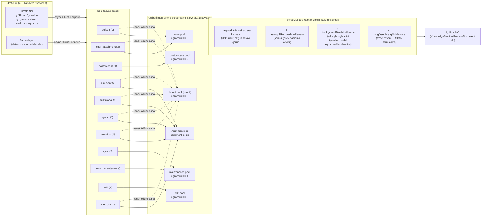
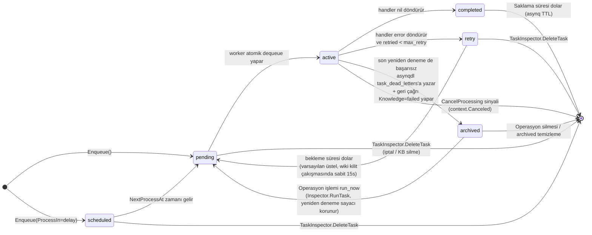
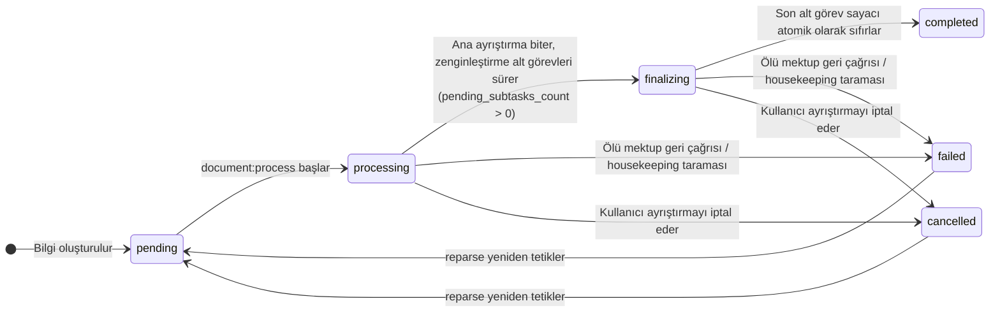

# Asenkron görev sistemi

Belge ayrıştırma, indeks oluşturma, özet ve soru üretimi, grafik çıkarma, Wiki üretimi, veri kaynağı eşitleme ve toplu işlemler görev sistemi tarafından planlanır. Standart kurulum [asynq](https://github.com/hibiken/asynq) ve Redis kullanır; Lite modu Redis'siz bir yürütücü kullanır. Her iki mod da görev işleme mantığını paylaşır, ancak yürütme biçimi ve operasyonel yetenekleri farklıdır.

## Genel mimari: iki yürütme modu {#genel-mimari-iki-yurutme-modu}

Rethra, dağıtım biçimine göre seçilen iki görev yürütme moduna sahiptir:

- **asynq modu (standart dağıtım)**: Görevler, `asynq.Client` aracılığıyla JSON payload olarak serileştirilir ve Redis kuyruğuna yazılır; birden fazla bağımsız `asynq.Server` (worker pool) tarafından tüketilir. `internal/router/task.go` içindeki `RunAsynqServer()`, ortak bir `asynq.ServeMux` oluşturur ve bunu 6 pool üzerinde çalıştırır.
- **Lite modu (tek makine dağıtımı, Redis olmadan)**: `internal/router/sync_task.go` içindeki `SyncTaskExecutor`, aynı `interfaces.TaskEnqueuer` arayüzünü uygular. `Enqueue`, görevleri doğrudan bir goroutine içinde yürütülmek üzere dağıtır ve `ProcessIn` / `ProcessAt` (gecikme), `MaxRetry`, `Timeout` ve `Deadline` seçeneklerini destekler. Bu seçenekler ister `asynq.NewTask` ister `Enqueue` üzerinde yazılsın etkili olur (ikincisi önceliklidir). Zaman aşımı ayarlanmayan görevlerin süre sınırı yoktur; bu, asynq'nun varsayılan 30 dakikasından farklıdır. Yeniden deneme doğrusal geri çekilmedir (`attempt * 5s`, üst sınır 30s); `asynq.SkipRetry` döndüren görevler yeniden denenmez. Handler içindeki panic yakalanır ve başarısızlık olarak işlenir; sürecin sonlanmasına neden olmaz. Yeniden denemeler tükendikten sonra, standart moddaki ölü mektup geri çağrısıyla aynı tamamlama işlemleri yürütülür: belge türündeki görevler bilgiyi `failed` olarak işaretler.

```go
// internal/router/sync_task.go
// SyncTaskExecutor executes tasks synchronously (in a goroutine) without Redis.
// Used in Lite mode as a drop-in replacement for *asynq.Client.
```

Her iki modun kaydettiği handler kümeleri tamamen aynıdır (`RunAsynqServer` ile `RegisterSyncHandlers` karşılaştırın); böylece görev anlamının dağıtım biçimine göre değişmemesi sağlanır.

## Redis'in sistemdeki rolü {#redis-in-sistemdeki-rolu}

| Rol | Açıklama | Kaynak kod konumu |
| --- | --- | --- |
| asynq broker | Tüm görev kuyrukları (pending list, scheduled/retry ZSET, archived ZSET) Redis'te depolanır; dequeue atomiktir (`BRPOPLPUSH`) ve bir görevin yalnızca bir worker tarafından yürütülmesini sağlar | `internal/router/task.go` `getAsynqRedisClientOpt()` |
| Görev denetim veri kaynağı | `asynq.Inspector` + doğrudan `LPos`/`ZRank`/`ZRevRank` ile sayfalı okuma | `internal/router/task_inspector.go` |
| Wiki ingest karşılıklı dışlama kilidi | `wiki:active:<kbID>`, finalize kilidi ve slug kilidi `SetNX` + TTL kullanır | `internal/application/service/wiki_ingest.go`, `wiki_ingest_batch.go` |
| Çok modlu alt görev sayacı | Görüntü alt görevi tamamlanma sayacı (DECR); son attempt finalize işlemini tetikler; Lite modu bunun yerine süreç içi sayaç kullanır | `image_multimodal` ile ilgili servisler |
| Hız sınırlama | Kayan pencere hız sınırlama ZSET'i (gözlemlenebilirlik belgesine bakın) | `internal/ratelimit/limiter.go` |

Redis bağlantı parametreleri `REDIS_ADDR` / `REDIS_USERNAME` / `REDIS_PASSWORD` / `REDIS_DB` ortam değişkenlerinden ve TLS yapılandırmasından gelir. Okuma ve yazma zaman aşımları `RETHRA_REDIS_OP_TIMEOUT_MS` tarafından kontrol edilir; varsayılan değer 500ms'dir (kuyruk başı engellemeyi karşılamak için yazma zaman aşımı bunun 2 katıdır):

```go
// internal/router/task.go
const defaultRedisOpTimeoutMs = 500
opt := &asynq.RedisClientOpt{
    Addr:        os.Getenv("REDIS_ADDR"),
    ReadTimeout: time.Duration(timeoutMs) * time.Millisecond,
    WriteTimeout: time.Duration(timeoutMs*2) * time.Millisecond,
    ...
}
```

## Görev türleri listesi {#gorev-turleri-listesi}

Görev türü sabitleri `internal/types/task.go` içinde tanımlanır:

| Görev türü | Sabit | Amaç | Kuyruk |
| --- | --- | --- | --- |
| `document:process` | `TypeDocumentProcess` | Belge ayrıştırma giriş noktası (DocReader / bölme / vektörleştirme) | `default` |
| `manual:process` | `TypeManualProcess` | Manuel bilgi güncellemesi (cleanup + yeniden indeksleme) | `default` |
| `temporary_document:process` | `TypeTemporaryDocumentProcess` | Oturum geçici belgesi (sohbet eki) ayrıştırması | `chat_attachment` |
| `knowledge:post_process` | `TypeKnowledgePostProcess` | Bilgi son işlemesi için ortak zamanlama (fan-out zenginleştirme alt görevleri) | `postprocess` |
| `knowledge:auto_tag` | `TypeKnowledgeAutoTag` | Belgenin mevcut etiketlerinin otomatik ilişkilendirilmesi | `summary` |
| `memory:extract` | `TypeMemoryExtract` | Kişisel belleğin arka plan çıkarımı | `memory` |
| `summary:generation` | `TypeSummaryGeneration` | Özet + belge profili oluşturma | `summary` |
| `kb:profile` | `TypeKnowledgeBaseProfile` | Bilgi tabanı açıklaması (profil toplama + tek küçük model çağrısı; karma değişmediyse atlanır) | `summary` |
| `datatable:summary` | `TypeDataTableSummary` | Tablo özeti | `summary` |
| `image:multimodal` | `TypeImageMultimodal` | Görüntü OCR + VLM başlığı | `multimodal` |
| `chunk:extract` | `TypeChunkExtract` | Grafik varlık/ilişki çıkarma (chunk bazında) | `graph` |
| `question:generation` | `TypeQuestionGeneration` | Soru oluşturma (chunk toplu fan-out bazında) | `question` |
| `datasource:sync` | `TypeDataSourceSync` | Veri kaynağı senkronizasyonu | `sync` |
| `faq:import` | `TypeFAQImport` | FAQ içe aktarma (dry run dahil) | `low` (maintenance) |
| `kb:clone` | `TypeKBClone` | Bilgi tabanı kopyalama | `low` |
| `kb:delete` | `TypeKBDelete` | Bilgi tabanı silme | `low` |
| `index:delete` | `TypeIndexDelete` | Dizin silme | `low` |
| `knowledge:list_delete` | `TypeKnowledgeListDelete` | Bilgileri toplu silme | `low` |
| `knowledge:list_reparse` | `TypeKnowledgeListReparse` | Toplu yeniden ayrıştırma | `low` |
| `knowledge:move` | `TypeKnowledgeMove` | Bilgi taşıma | `low` |
| `wiki:ingest` | `TypeWikiIngest` | Wiki sayfası oluşturma/senkronizasyonu | `wiki` |
| `wiki:finalize` | `TypeWikiFinalize` | Wiki KB düzeyinde tamamlama (debounce: dizin yeniden oluşturma/ölü bağlantı temizleme/çapraz bağlantılar) | `wiki` |

Tüm payload yapıları (ör. `DocumentProcessPayload`, `ImageMultimodalPayload`), süreçler arası Langfuse/W3C traceparent aktarımı için `types.TracingContext` gömer (gözlemlenebilirlik belgelerine bakın) ve ayrıca ölü mektup arşivleme ile iptal eşleştirmede kullanılmak üzere `tenant_id` / `knowledge_id` / `knowledge_base_id` gibi yönlendirme alanlarını tutarlı biçimde taşır.

Otomatik etiketler, özetler ve bilgi tabanı açıklamaları summary kuyruğunu paylaşır ve isteğe bağlı zenginleştirme görevleridir; otomatik etiketler yalnızca belge bilgi tabanında auto_tag_config etkin olduğunda kuyruğa alınır. Bilgi tabanı açıklaması (`kb:profile`) yalnızca profile_config etkin olduğunda özetin son durumu/silme/taşıma tarafından tetiklenir ve 30 saniyelik pencereye göre tekilleştirilir; başarısızlıkların hiçbiri tamamlanmış ayrıştırmayı etkilemez. Bellek çıkarma, enrichment pool tarafından tüketilen bağımsız memory kuyruğunu kullanır ve shared pool esnek ödünç almaya ağırlık 1 ile katılır; worker pool toplam sayısı yine 6'dır.

Bellek görevleri kişi öznesine göre tekilleştirilir ve gecikmeli olarak birleştirilir; memory_subjects içindeki extract_cursor, pending_sessions ve zamanlama zamanı, her soru sorulduğunda hemen bir model çıkarımının başlatılmasını önlemek için devamlılık sağlar. Alan belleği kapattığında veya write_mode auto olmadığında arka plan damıtması çalışmaz. Lite'ın senkron yürütücüsü de otomatik etiket ve bellek görevlerini kaydeder; aynı iş kurallarına uyar.

## Worker Pool Topolojisi ve Yönetim Stratejisi {#worker-pool-topolojisi-ve-yonetim-stratejisi}

`internal/types/task.go` içindeki `queueDefinitions`, kuyruk topolojisinin **tek gerçek kaynağıdır** (single source of truth); worker server oluşturma (`QueueWeightsForPool`) ve operasyon paneli gösterimi (`QueueStats`) ağırlık sapmasını önlemek için bu kayıt defterini birlikte kullanır.

### Altı Bağımsız Worker Pool {#alti-bagimsiz-worker-pool}

Her pool bağımsız bir `asynq.Server`'dır ve eşzamanlılık **kesin olarak yalıtılmıştır** (ağırlık tercihi değildir). Varsayılan eşzamanlılık ve yapılandırma anahtarları (system_settings anahtarı / ortam değişkeni, `types.ResolveWorkerPoolConcurrency` bölümüne bakın):

| Pool | Varsayılan eşzamanlılık | Tüketilen kuyruklar (ağırlık) | Yapılandırma anahtarı / ortam değişkeni |
| --- | --- | --- | --- |
| `core` | 8 | `default`(1), `chat_attachment`(3) | `asynq.core_concurrency` / `RETHRA_ASYNQ_CORE_CONCURRENCY` |
| `postprocess` | 2 | `postprocess`(1) | `asynq.postprocess_concurrency` / `RETHRA_ASYNQ_POSTPROCESS_CONCURRENCY` |
| `enrichment` | 12 | `summary`(2), `multimodal`(1), `graph`(1), `question`(1), `memory`(1) | `asynq.enrichment_concurrency` / `RETHRA_ASYNQ_ENRICHMENT_CONCURRENCY` |
| `maintenance` | 4 | `sync`(2), `low`(1) | `asynq.maintenance_concurrency` / `RETHRA_ASYNQ_MAINTENANCE_CONCURRENCY` |
| `shared` (esnek katman) | 6 | core + enrichment içinde `SharedWeight > 0` olan kuyruklar | `asynq.shared_concurrency` / `RETHRA_ASYNQ_SHARED_CONCURRENCY` |
| `wiki` | 8 | `wiki`(1) | `asynq.wiki_concurrency` / `RETHRA_WIKI_ASYNQ_CONCURRENCY` |

Tasarımın temel noktaları (kaynak kodu yorumları bunların tümünü doğrular):

- **Garantili kapasite + esnek ödünç alma**: core/postprocess/enrichment/maintenance asgari garantili kapasite sağlar; `shared` pool aynı anda core ve enrichment kuyruklarına abonedir, boş kapasite her iki aşama tarafından da ödünç alınabilir (`NewSharedAsynqServer`: Redis dequeue atomiktir; aynı kuyruğa abone birden çok server olsa bile her görev yalnızca bir kez yürütülür). post-process ve maintenance shared pool'a katılmaz: ilki bağımsız gecikme garantisi gerektirir, ikincisi ise uzun çalışma süresiyle etkileşimli görevlerin ani kapasitesini işgal edebilir. Kapsam `QueueWeightsForSharedPool` tarafından tanımlanır.
- **Wiki kesin yalıtımı**: `wiki` pool yalnızca `wiki` kuyruğunu çeker; ayrıştırma işlem hattı ile Wiki oluşturmanın birbirini aç bırakmasını önler (`NewWikiAsynqServer` yorumu).
- **Sohbet ekleri önceliklidir**: `chat_attachment`, core pool ağırlığı 3 ile `default` değerinin 1 olan ağırlığından yüksektir; büyük hacimli KB içe aktarımları etkileşimli sohbet yüklemelerinin kuyrukta beklemesine neden olmaz.
- **Kademeli yükseltme uyumluluğu**: `QueueMaintenance` sabitinin fiziksel Redis kuyruk adı eski sürümdeki `"low"` olarak korunur; eski sürümlerin kuyruğa eklediği görevler kademeli dağıtım sırasında da tüketilebilir.

### Kapasite tahmini ve ölçeklendirme {#capacity-planning}

Eski birleşik yapılandırma `asynq.concurrency` / `RETHRA_ASYNQ_CONCURRENCY` artık kullanılmamaktadır; mevcut dağıtımlar yukarıdaki tablodaki her havuzun yapılandırmasına geçmelidir. Ayar değişikliklerinden sonra hizmetin yeniden başlatılması gerekir. Varsayılan ilk beş havuz, örnek başına toplam 32 worker içerir; Wiki için olan 8 ayrıca hesaplanır.

Aşağıdaki tahmin başlangıç noktası olarak kullanılabilir, ardından çalışma zamanı panelleri ve gerçek yük temelinde ayarlanabilir:

```text
Gereken worker ≈ ceil(en yüksek görev geliş hızı × ortalama çalışma süresi / 0.70)
```

Buradaki 0.70, sistem yapılandırması veya sabit kapasite garantisi değil, örnek hedef kullanım oranıdır. Varış hızı, fan-out sonrası görev sayısına göre hesaplanmalıdır: bir belge birden çok soru grubu, parça bazında grafik ve birden çok görsel görevi üretebilir. Kuyruk sayısı tek başına işlem kapasitesini göstermez.

Worker, her hizmet örneğinin aynı anda kaç görevi çalıştırmasına izin verildiğini kontrol eder; model kotası, replikalar arası eşzamanlılığı, RPM ve TPM'yi kontrol eder; DocReader, vektör veritabanı, veritabanı ve nesne depolamanın ayrıca kapasite sınırları vardır. Model hız sınırlaması bekleme süresi zaten yüksekse worker eklemek yalnızca bekleyenlerin sayısını artırır. En eski görevin bekleme süresi, etkin örneklerin toplam kapasitesi, worker kullanımı ve alt kaynaklar birlikte değerlendirilmelidir: alt katmanda kapasite boşluğu varken birikme sürekli artıyorsa ilgili havuz artırılmalı; DocReader doluysa core kabul miktarı azaltılmalıdır.

### Worker Pool mimari diyagramı {#worker-pool-mimari-diyagrami}



### Ara katman yönetimi {#ara-katman-yonetimi}

`RunAsynqServer` (`internal/router/task.go`), aynı mux üzerinde dört ara katmanı sırayla kurar:

1. **`asynqdl.MiddlewareWithCallback` (ölü mektup)** — handler'ın döndürdüğü özgün hatayı görebilmesi için ilk kurulmalıdır (sonraki ara katmanlar hatayı dönüştürebilir). Bkz. [Başarısızlıkta yeniden deneme ve ölü mektup işleme](#basarisizlik-yeniden-denemeleri-ve-olu-mektup-isleme).
2. **`asynqdl.RecoverMiddleware`** — Handler panic durumlarını normal görev hatalarına dönüştürür. Asynq, panic durumlarından yalnızca tüm ara katmanların dışında kurtulur; bu katman olmadan ölü mektup geri çağrısı hatayı göremez ve son denemedeki belge sürekli `processing` durumunda kalır.
3. **`backgroundTaskMiddleware`** — Her görev context'ine `types.WithBackgroundTask` işareti ekler; böylece model başına sohbet eşzamanlılık yöneticisi (chat concurrency governor), ingestion/enrichment LLM çağrılarını hız sınırlar, ancak etkileşimli kullanıcı sohbetini etkilemez.
4. **`langfuse.AsynqMiddleware`** — Langfuse kapalıyken doğrudan geçer; açıkken üst HTTP trace'ini sürdürür veya bağımsız yeni bir trace başlatır ve handler yürütmesini bir SPAN içine alır.

### Yeniden deneme bekleme stratejisi {#yeniden-deneme-bekleme-stratejisi}

Varsayılan olarak asynq'nin üstel geri çekilmesi kullanılır (yaklaşık 10s, 40s, 90s, 2.5m…); ancak Wiki ingest kilit çakışmaları için özelleştirme yapılmıştır (`asynqRetryDelayFunc`):

```go
// internal/router/task.go
func asynqRetryDelayFunc(n int, e error, t *asynq.Task) time.Duration {
    if errors.Is(e, service.ErrWikiIngestConcurrent) {
        return wikiIngestRetryDelay // Sabit 15s
    }
    return asynq.DefaultRetryDelayFunc(n, e, t)
}
```

Nedeni: Yetim kilit TTL'si ≤ 60s olduğundan, sabit 15s yeniden deneme neredeyse kesin olarak başarılı olur; üstel geri çekilme ise çökme sonrası yeniden başlatılan KB'nin 7–10 dakika takılı kalmasına yol açar.

## Görev yaşam döngüsü durum makinesi {#gorev-yasam-dongusu-durum-makinesi}

Asynq tarafındaki çalışma zamanı durumları (`internal/router/task_inspector.go` içindeki `runtimeTaskState`, `types.RuntimeTaskState` olarak eşlenir): `pending`, `active`, `scheduled`, `retry`, `archived`, `completed`. İş tarafındaki bilgi satırının `parse_status` değeri (`internal/types/knowledge.go`): `pending` → `processing` → `finalizing` → `completed`; ayrıca `failed` / `deleting` / `cancelled`.



Karşılık gelen bilgi satırı durumları (görev tarafından yönlendirilir):



## Görev denetimi, iptal ve operasyon paneli (TaskInspector) {#gorev-denetimi-iptal-ve-operasyon-paneli-taskinspector}

`internal/router/task_inspector.go`, `interfaces.TaskInspector` uygular; asynq modunda `asynq.Inspector` + yerel Redis istemcisi tarafından desteklenir; Lite modunda `noopTaskInspector` kullanılır (goroutine'ler başlatılmadan önce kaldırılamaz; checkpoint tabanlı durdurma tek durdurma sinyalidir).

### Bilgiye / bilgi tabanına göre iptal {#bilgiye-bilgi-tabanina-gore-iptal}

- `CancelTasksForKnowledge(ctx, knowledgeID)`: Tüm kayıtlı kuyruklarda (`queuesScanned`, `types.QueueDefinitions()` kaynağından gelir) pending/scheduled/retry/active olmak üzere dört durumu tarar; payload içindeki `knowledge_id` eşleşirse işleme alır. İptal edilebilir görev türleri beyaz listesi `taskTypesForKnowledgeCancel`: `document:process`, `manual:process`, `image:multimodal`, `knowledge:post_process`, `question:generation`, `summary:generation`, `chunk:extract` (FAQ içe aktarma ve bilgi tabanı düzeyi görevler dahil değildir).
- İptal akışı üç aşamadan oluşur (`cancelMatchingTasks`): ① Önce kuyruktaki durumlar tamamen silinir; ② active görevlerin anlık görüntüsü alındıktan sonra sinyal göndermek için `Inspector.CancelProcessing` çağrılır ve 1s yerleşme penceresinde (25ms aralıklarla) `context.Canceled` nedeniyle retry durumuna geçen kayıtlar silinir (`deleteCancelledTransitions`); ③ İptal sırasında yeni kuyruğa eklenen alt görevleri kapsamak için kuyruktaki durumlar yeniden taranır.
- `CancelTasksForKnowledgeBase`: KB silindikten sonra sahipsiz görevleri temizler; `kb:delete` ve `index:delete` açıkça hariç tutulur (anlık görüntü taşırlar ve gerçek depolama temizliğinden sorumludurlar; silinmeleri kaynak sızıntısına yol açar). clone/move işlemlerinin anlamsal KB alanları (`source_id`/`target_id`/`source_kb_id`/`target_kb_id`) da eşleştirmeye katılır.
- Her şey best-effort yaklaşımıyladır: Redis dalgalandığında Warn günlüğü yazılır ve hata yutulur; iptal API'si yine başarı döndürür.
- `HasQueuedTasksForKnowledge`: salt okunur bir yoklamadır; housekeeping temizliği bunu, yanlışlıkla failed olarak işaretlemeyi önlemek için "birikmiş ancak sahipsiz olmayan" satırları ayırt etmekte kullanır. `HasQueuedDeleteTasksForKnowledge`, silme sırasında takılma kurtarması için özellikle `knowledge:list_delete` toplu payload'larını eşleştirir.
- `QueuedKnowledgeIDs`: tüm kuyrukları tek taramada inceler ve hâlâ kuyruktaki görevlerce referans verilen bilgi ID'leri kümesini döndürür; bilgi listesi API'si buna göre `stall_state` (`queued` / `stalled`) verir. Sonuç 60 saniye önbelleğe alınır ve eşzamanlı istekler arasında paylaşılır; tarama başarısız olursa önbelleğe alınmaz.

### Operasyon paneli (SystemAdmin Runtime Dashboard) {#operasyon-paneli-systemadmin-runtime-dashboard}

- `QueueStats()`: her kuyruk için `GetQueueInfo` çağırır, `types.QueueStat` çıktısını verir (size/pending/active/scheduled/retry/archived/completed, gün içi processed/failed, paused, `latency_ms` (en eski pending görevin yaşı), bellek kullanımı) ve statik pool/weight meta verilerini ekler. Hiç oluşturulmamış kuyruklar sıfır değerli satır döndürür (`isAsynqQueueNotFound`, asynq v0.26 tarafından sızdırılan dahili `NOT_FOUND` hata dizgesiyle de uyumludur; bkz. `task_inspector_errors.go`).
- `ListRuntimeTasks()`: doğrudan Redis anahtarı `asynq:{<queue>}:<state>` temelinde sayfalama yapar — pending/active bir LIST'tir (en yeni önde), scheduled/retry `NextProcessAt` artan sırasına göre ZSET'tir, archived/completed ise skora göre azalan sıradadır. İmleç, base64 ile kodlanmış bir sabitleyici penceresidir (en fazla 32 sabitleyici, `runtimeTaskCursorMaxAnchors`); sabitleyici kaybolduğunda (görev tamamlanması/yeniden deneme/silme) sayfalama sürdürülebilir. Payload yalnızca izin listesindeki yönlendirme meta verilerini (tenant/kb/knowledge/task/sync vb. ID'ler) yansıtır; **belge içeriği veya gizli anahtarlar asla açığa çıkarılmaz**.
- Görev eylemleri, `runtimeTaskActions` durum denetimleriyle sınırlandırılır: `cancel` (pending/active/scheduled/retry ve iptal edilebilir türler), `run_now` (scheduled/retry/archived, asynq yeniden deneme sayısını korur), `delete` (yalnızca archived); ayrıca `PurgeArchivedRuntimeTasks`, tek kuyruğun archived kümesini tek tıklamayla temizler.
- `WorkerServerStats()`: asynq sunucu kalp atışlarını okur (eşzamanlılık, etkin worker sayısı, durum, kuyruk ağırlıkları) ve replikalar arasında toplulaştırdıktan sonra "yapılandırılmış tek örnek kapasitesi" ile "gerçek küme kapasitesi"ni ayırır.

İlgili HTTP API'leri (`internal/router/routes_auth_tenant.go`, SystemAdmin + platform API Key capability geçidi):

| Yöntem | Yol | Açıklama |
| --- | --- | --- |
| GET | `/api/v1/system/admin/runtime/queues` | Kuyruk derinliği anlık görüntüsü + worker kalp atışı |
| GET | `/api/v1/system/admin/runtime/queues/:queue/tasks` | Duruma göre imleçli sayfalı görev listesi |
| POST | `/api/v1/system/admin/runtime/queues/:queue/tasks/:task_id/actions/:action` | `cancel` / `run_now` / `delete` (platform denetim kaydı yazar) |
| DELETE | `/api/v1/system/admin/runtime/queues/:queue/archived` | archived öğelerini temizler (platform denetim kaydı `system.queue_archived_purged` yazar) |

## Başarısızlık yeniden denemeleri ve ölü mektup işleme {#basarisizlik-yeniden-denemeleri-ve-olu-mektup-isleme}

### asynq ölü mektup ara katmanı (`internal/middleware/asynqdl/asynqdl.go`) {#asynq-olu-mektup-ara-katmani-internal-middleware-asynqdl-asynqdl-go}

- Yalnızca **son deneme** başarısız olduğunda (`isFinalAttempt`: `retried >= max_retry`) bir `task_dead_letters` satırı yazar; böylece geçici dalgalanmalar her seferinde bir satır üretmez.
- `buildDeadLetter`, herhangi bir payload içinden `tenant_id` / `knowledge_base_id` / `kb_id` / `knowledge_id` / `source_kb_id` değerlerini çıkarmak için toleranslı `payloadProbe` kullanır; `inferScope`, scope'u "etki alanına" göre çıkarır (`knowledge_base` > `knowledge` > `tenant` > `unknown`). Payload olduğu gibi korunur (ileride yeniden oynatma için kullanılabilir), `last_error` 8KB ile kesilir.
- Ekleme best-effort yaklaşımıyladır: DB hatası yalnızca günlüğe yazılır, özgün görev hatası her zaman değiştirilmeden asynq'ya yeniden iletilir (archived durumuna girer).
- `OnDeadLetter` geri çağrısı (`internal/router/task.go` içindeki `newDeadLetterKnowledgeFailer`): `document:process` / `knowledge:post_process` / `manual:process` yeniden denemeleri tükendiğinde, yalnızca bilgi satırı hâlâ `pending` / `processing` / `finalizing` durumundaysa ve tenant, bilgi tabanı ile payload eşleşiyorsa, tek bir koşullu güncellemeyle `parse_status=failed` + `error_message` birlikte yazılır (yarım güncellemeyi önler; ayrıca zaten iptal edilmiş veya silinmiş satırların üzerine yazmaz; `SkipRetry` ile biten görevler tetiklemez) ve ilgili attempt'in kök span'ını kapatmak için `SpanTracker.FinalizeAttempt` çağrılır; böylece zaman çizelgesi artık "devam ediyor" göstermez. `knowledge:list_delete` için özel `markKnowledgeListDeleteFailed` dalı vardır. `image:multimodal`, üst bilgiyi başarısız olarak işaretlemez (finalize-on-last-attempt ilerlemeyi zaten garanti eder). Geri çağrı `context.Background()` ile çalışır ve panic yakalanır; özgün görev hatası asla değiştirilmez.

### Kalıcı görev kuyruğu ve servis düzeyi ölü mektup (`internal/application/repository/task_queue.go`) {#kalici-gorev-kuyrugu-ve-servis-duzeyi-olu-mektup-internal-application-repository-task-queue-go}

`task_pending_ops` tablosu, Redis list kuyruğunun kalıcı alternatifidir (yeniden başlatmada kaybolmaz, TTL ile atılmaz); kuyruk kimliği `(task_type, scope, scope_id)` üçlüsüdür ve şu anda başlıca tüketicisi Wiki ingest'tir:

- `Enqueue` / `EnqueueIfKnowledgeBaseActive`: ikincisi, işlem içinde KB'nin hâlâ etkin olduğunu ve ait olduğu tenant'ın soft-delete edilmediğini doğrulamak için Postgres `SHARE` satır kilidi kullanır; böylece KB veya tenant silindikten sonra yeni kalıcı iş yazılmasını önler.
- **Silinmiş tenant**: tenant silme işlemi yalnızca soft-delete uygular; bilgi tabanları ve `task_pending_ops` satırları kalır. Servis başlatılırken kurtarma işlemi, soft-delete edilmiş tenant'ların bekleyen satırlarını temizler; Wiki ingest / finalize görevleri model çağrısından önce tenant'ın etkin olup olmadığını denetler, tenant silinmişse o bilgi tabanının kuyruğunu atar ve artık model isteği üretmez.
- `ClaimBatch`: `dedup_key` (= belge) temelinde **tüm grup** atomik olarak sahiplenilir. Temel değişmez: Aynı belgenin birden çok op'u (ör. ingest'i retract'ın izlemesi) asla iki eşzamanlı batch'e bölünmez; yeni bir claim'i (`claimed_at >= staleBefore`) olan key bütünüyle atlanır, geç gelen kardeş op'lar sahibin tamamlamasını veya claim'in süresinin dolmasını bekler. Postgres'te, key başına anchor satırı üzerindeki `FOR UPDATE SKIP LOCKED`, eşzamanlı sahiplenenlerin **kesişmeyen** key kümeleri almasını sağlar; SQLite (Lite/test) tek yazıcılı motora dayanır. Sahiplenme sırası `fail_count` artan düzende, eşit başarısızlık sayısında ise kuyruğa giriş sırasınadır: Tekrar tekrar başarısız olan belgeler sürekli kuyruğun başında kalmaz, yeni belgeler aç bırakılmaz (Lite modundaki `PeekBatch` aynı sırayı kullanır).
- `IncrFailCount` (`UPDATE ... RETURNING` ile tek gidiş-dönüşte atomik artırma), servis tarafı üst sınırıyla (wiki'nin `wikiMaxFailRetries` değeri) birlikte çalışır: Sınır aşıldığında bu op, `task_pending_ops` içinden `task_dead_letters` içine taşınır (`internal/application/service/wiki_ingest.go` doğrudan `deadLetterRepo.Insert` çağırır).
- `ReleaseByIDs` / `DeleteByIDs` / `DeleteByScope` / `DeleteByDedupKey` / `PendingCount`; serbest bırakma, tüketim onayı, KB yaşam döngüsü temizliği ve birikme gözlemi sağlar.

Ölü mektup deposu `taskDeadLetterRepository`, `ListByScope` / `ListByTaskType` (id azalan sıralı cursor sayfalama, limit 1–200) ve `DeleteByID` sağlar; operasyon ekibi, günlükleri incelemeden görev türü / scope / kiracı bazında başarısızlıkları doğrudan SQL ile sorgulayabilir.

### Son güvence: housekeeping taraması {#son-guvence-housekeeping-taramasi}

`internal/application/service/knowledge_housekeeping.go`: cron her 5 dakikada bir (`0 */5 * * * *`) çalışır ve asynq yeniden denemeleri, ölü mektup callback'leri ve multimodal finalize işlemlerinin ötesindeki son savunma hattıdır (worker'ın handler'ın ortasında kill edilmesi, defer'ın çalışmaması gibi durumlar). `RETHRA_HOUSEKEEPING_ENABLED=false` ile kapatılabilir.

Eşik `max(1h, RETHRA_DOCUMENT_PROCESS_TIMEOUT) + 10min` şeklindedir. Her tur şunları içerir:

| Temizlik | Nesne | İşlem |
| --- | --- | --- |
| Ayrıştırma takılması | `pending` / `processing` / `finalizing` eşik süresini aşmış, span heartbeat'i de eşik süresini aşmış ve hem asynq kuyruğunda hem Wiki kalıcı kuyruğunda ilgili görev bulunmayan kayıtlar | `failed` olarak ayarlanır, `error_message` hangi aşamada takıldığını ve son ilerleme zamanını belirtir; en son attempt içindeki bitmemiş span'ler `TASK_STALLED` ile kapatılır (takılan aşama `failed`, diğerleri `cancelled`) |
| Özet takılması | `summary_status = processing` 1 saati aşmış | `summary_status`, `failed` olarak ayarlanır |
| Silme takılması | `deleting` eşik süresini aşmış ve kuyrukta onu kapsayan bir silme görevi bulunmayan kayıtlar | `failed` olarak ayarlanır ve neden yazılır; belge yeniden görünür olur ve tekrar silinebilir; kuyruk yoklaması başarısız olursa ertelenir |
| Wiki kuyruğunu yeniden tetikleme | Yalnızca Wiki kalıcı kuyruğu tüketilmediği için `finalizing` durumunda kalan belgeler | İlgili bilgi tabanı için Wiki tetikleme görevi yeniden kuyruğa alınır; her bilgi tabanı için her eşik döneminde en fazla bir kez |

Sürekli görülen "tasks still queued (backpressure, not stuck)" günlüğü, darboğazın kuyruk kapasitesinde olduğunu gösterir; denetimin yanlış sınıflandırıldığından şüphelenmek yerine ilgili worker pool eşzamanlılığı artırılmalıdır.

## Olay veri yolu (`internal/event`) {#olay-veri-yolu-internal-event}

Olay veri yolu, **süreç içi** oturum/Agent akış olaylarının dağıtımı (ör. SSE gönderimi, IM callback'leri) için kullanılır ve asynq'yu (süreçler arası kalıcı görevler) tamamlar.

### Yapı ve teslim garantisi {#yapi-ve-teslim-garantisi}

```go
// internal/event/event.go
type Event struct {
    ID        string                 // Olay ID'si (otomatik UUID üretilir, akış güncellemelerini izlemek için)
    Type      EventType
    SessionID string
    Data      interface{}
    Metadata  map[string]interface{}
    RequestID string
}
```

- `EventBus.On(type, handler)` kayıt yapar (aynı tür için birden çok handler olabilir), `Off` / `Clear` kaldırır; `HasHandlers` / `GetHandlerCount` sorgular.
- **Senkron mod** (`NewEventBus`, varsayılan): `Emit`, handler'ları sırayla çalıştırır; herhangi bir handler hata verirse hemen hatayı döndürür (at-most-once, hata sonrası sonraki handler'lar kesilir).
- **Asenkron mod** (`NewAsyncEventBus`): `Emit`, her handler için goroutine başlatır; fire-and-forget çalışır, hatalar atılır, panic'ler recover edilerek günlüğe yazılır.
- `EmitAndWait`: Her iki modda da tüm handler'ları paralel çalıştırır ve tamamlanmalarını bekler; hata ve panic'leri toplar.
- **Teslim garantisi süreç içidir ve kalıcı değildir**: Kayıtlı handler olmadığında olay sessizce atılır (`nil` döner); süreç çökerse uçuş halindeki olaylar kaybolur. Kalıcılık gereksinimleri için asynq veya `task_pending_ops` kullanılmalıdır.
- `global.go` genel singleton sağlar (`event.On` / `event.Emit`); uygulamada oturum düzeyindeki akış işlemleri **ayrı bus örnekleri** kullanır (abonelere bakın).
- `middleware.go`, handler middleware'leri sağlar: `WithLogging` (tetikleme/başarısızlık günlükleri), `WithTiming` (süreyi metadata'ya yazar), `WithRecovery` (panic'i `PanicError`'a dönüştürür), `Chain` / `ApplyMiddleware` birleştirme için kullanılır.
- `adapter.go` içindeki `EventBusAdapter`, döngüsel bağımlılığı önlemek için `*EventBus`'ı `types.EventBusInterface` olarak uyarlar.

### Olay türleri listesi (`internal/event/event.go`) {#olay-turleri-listesi-internal-event-event-go}

| Grup | Olay türü |
| --- | --- |
| Sorgu işleme | `query.received`, `query.validated`, `query.preprocess`, `query.rewrite`, `query.rewritten` |
| Getirme | `retrieval.start`, `retrieval.vector`, `retrieval.keyword`, `retrieval.entity`, `retrieval.complete` |
| Yeniden sıralama | `rerank.start`, `rerank.complete` |
| Birleştirme | `merge.start`, `merge.complete` |
| Sohbet oluşturma | `chat.start`, `chat.complete`, `chat.stream` |
| Agent yaşam döngüsü | `agent.query`, `agent.plan`, `agent.step`, `agent.tool`, `agent.complete` |
| Agent akışı (gerçek zamanlı geri bildirim) | `thought`, `tool_call`, `tool_result`, `reflection`, `references`, `final_answer` |
| MCP aracı için manuel onay | `tool_approval_required`, `tool_approval_resolved` |
| MCP OAuth oturum içi yetkilendirme | `mcp_oauth_required`, `mcp_oauth_resolved` |
| Hata / oturum / denetim | `error`, `session_title`, `stop` |

Her olay türünün veri yapısı `internal/event/event_data.go` içinde tanımlanır (örneğin `AgentToolCallData`, `tool_call_id`/`tool_name`/`arguments`/`hint` taşır; `AgentFinalAnswerData` ise `content`/`done`/`is_fallback` vb. taşır).

### Başlıca aboneler {#baslica-aboneler}

| Abone | Kaynak kodu | Abonelik içeriği |
| --- | --- | --- |
| SSE Agent akış işleyicisi | `internal/handler/session/agent_stream_handler.go` | `thought`, `tool_call`, `tool_result`, `references`, `final_answer`, `reflection`, `error`, `session_title`, `agent.complete`, araç onayı ve MCP OAuth ile ilgili dört tür |
| Bilgi soru-cevap işleyicisi | `internal/handler/session/qa.go`, `helpers.go` | `thought`, `final_answer`, `stop` |
| IM entegrasyonu (WeCom vb.) | `internal/im/service.go` | `final_answer`, `error`, `references`, `agent.complete`, `thought`, `tool_call`, `tool_result`, `mcp_oauth_required` vb.; çeşitli IM platformu mesajlarına dönüştürülür |

## `internal/runtime` paketi {#internal-runtime-paketi}

Bu paket küçüktür; worker mantığı değil, çalışma zamanı altyapısıdır:

- `container.go`: `init()` genel `*dig.Container` (uber dig) oluşturur; `GetContainer()` diğer paketlerin bağımlılıkları kaydetmesi/çözmesi içindir. Tüm asynq sunucuları, işleyiciler ve depolar bunun üzerinden yapılandırılır (asıl büyük ölçekli yapılandırma `internal/container/container.go` içindedir).
- `server.go`: `MarkServerStarted()` / `ServerStartedAt()` / `ServerUptime()` —— süreç başlangıç zamanını kaydeder; işletim panelinde çalışma süresini göstermek için kullanılır.
- `startup.go`: `SilenceGinRouteSpam()` yaklaşık 150 satırlık Gin rota kayıt günlüklerini bastırır ve tek satırda özetler (`LogGinRouteCount`); `LogStartupEnv()` seçilmiş ortam değişkenlerini başlık olarak yazdırır (hassas değerler yalnızca `set (N chars)` olarak gösterilir) ve yaygın tuzaklar için açık uyarılar verir (örneğin `SYSTEM_AES_KEY` uzunluğu 32 olmadığında şifreleme fiilen devre dışı kalır, `REDIS_TLS_INSECURE_SKIP_VERIFY=true`).

## Görevler nasıl izlenir {#gorevler-nasil-izlenir}

1. **İşletim paneli / Runtime API** (Bölüm 6.2): kuyruk derinliği, en eski pending gecikmesi (`latency_ms`), gün içindeki processed/failed sayıları, worker kalp atışı; görevleri duruma göre tarama, `last_error` ile `retried/max_retry` değerlerini görüntüleme, `run_now`/`cancel`/`delete` çalıştırma.
2. **Ölü mektup tablosu SQL'i**: `SELECT * FROM task_dead_letters WHERE scope='knowledge_base' AND scope_id='<kbID>' ORDER BY id DESC;` veya başarısızlık oranını `task_type` bazında toplulaştırma; `task_pending_ops` içindeki `PendingCount` / `enqueued_at`, hiç boşaltılmamış birikimleri tespit edebilir.
3. **Günlükler**: worker tarafında standart olarak `internal/logger` kullanılır; önemli önekler `[TaskInspector]` (iptal/denetim), `asynq dead-letter`, `[SyncTask]` (Lite modu), `[Housekeeping]` şeklindedir; başlangıçta her pool `asynq <pool> server starting with concurrency=...` yazdırır.
4. **Langfuse trace**: Etkinleştirildiğinde her asynq görevi, queue, retry ve payload boyutu meta verilerini içeren bir `asynq.<task_type>` SPAN olur; onu tetikleyen HTTP isteğiyle aynı trace içinde yer alır (gözlemlenebilirlik dokümantasyonuna bakın).
5. **Platform denetimi**: archived görevlerdeki `run_now`/`delete`/purge işlemleri `audit_logs` içine (`system.queue_task_*` eylemleri) yazılır; böylece sorumluluk izlenebilir.

## Uygulama referansı

| Modül | Kaynak kod yolu |
| --- | --- |
| Görev kaydı ve worker pool oluşturma | `internal/router/task.go` |
| Lite modu eşzamanlı yürütücüsü (Redis olmadan) | `internal/router/sync_task.go` |
| Görev denetimi / iptal / operasyon paneli | `internal/router/task_inspector.go`, `internal/router/task_inspector_errors.go` |
| Kuyruk topolojisi ve görev türü tanımları | `internal/types/task.go` |
| Ölü mektup ara katmanı | `internal/middleware/asynqdl/asynqdl.go` |
| Kalıcı görev kuyruğu / ölü mektup deposu | `internal/application/repository/task_queue.go` |
| Ölü mektup / bekleyen işlem modelleri | `internal/types/task_dead_letter.go`, `internal/types/task_pending_op.go` |
| Olay veri yolu | `internal/event/` (`event.go`, `event_data.go`, `global.go`, `middleware.go`, `adapter.go`) |
| Çalışma zamanı yardımcıları (DI kapsayıcısı, başlangıç başlığı, uptime) | `internal/runtime/` (`container.go`, `server.go`, `startup.go`) |
| Takılı kalan görevler için yedek temizleme | `internal/application/service/knowledge_housekeeping.go` |
