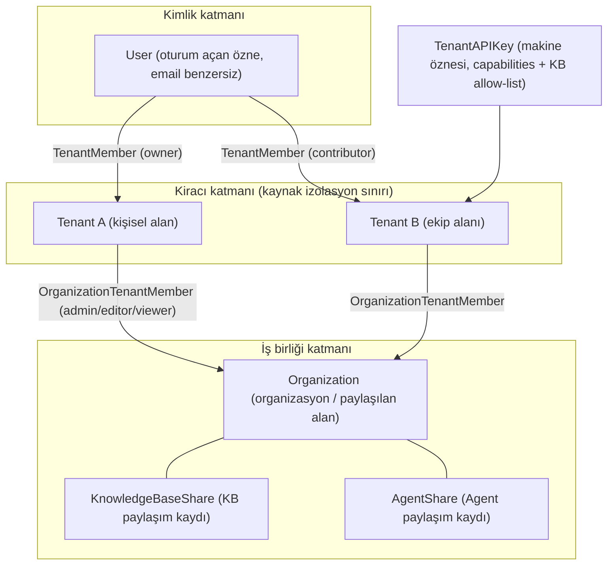
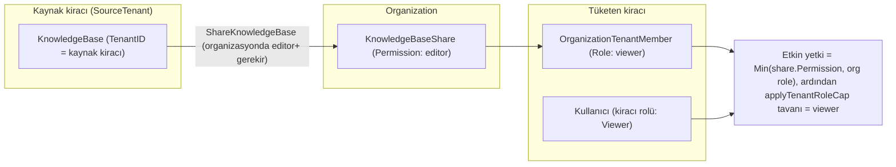
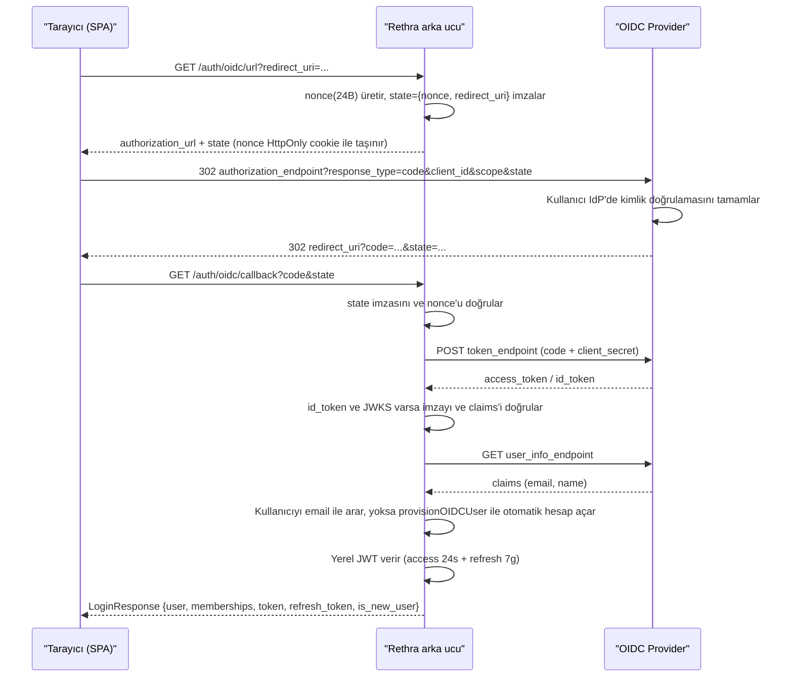

# Kiracılar, kullanıcılar ve kimlik doğrulama/yetkilendirme

Çalışma alanı, Rethra'nın kaynak ve yetki sınırıdır; bilgi tabanları, modeller, ajanlar, oturumlar ve depolama kotaları alana aittir. Bir kullanıcı birden fazla alana katılabilir ve her alanda farklı rollere sahip olabilir. Organizasyonlar, birden fazla alanı bağlamak ve bilgi tabanları ile ajanları paylaşmak için kullanılır. Arka uç, çalışma alanını Tenant ile ifade eder.

Üye daveti, kaynak paylaşımı ve API erişimi için girişler aşağıdadır. Tüm dağıtımı yönetmek ayrı platform yetkisi gerektirir.

| İşlem | Giriş ve gereksinimler |
| --- | --- |
| Ekip üyesi davet et | Alan ayarları → Üyeler → Davet et; karşı tarafa bir rol verin (Owner / Admin / Contributor / Viewer) |
| Bilgi tabanını başka bir ekiple paylaş | Organizasyon oluştur → iki alanı da ekle → bilgi tabanında "Organizasyonla paylaş" |
| API'ye bağlan | Alan ayarları → API Key; gereken yetenekleri seçin (arama / soru yanıtlama / içe aktarma / yönetim), gerekirse erişilebilir bilgi tabanlarını sınırlayın |
| Tüm dağıtımı yönet (genel ayarlar, görev kuyruğu, alanlar arası denetim) | Alan Owner yetkisinden bağımsız olarak verilen **Sistem yöneticisi** kimliği gerekir; bkz. [Platform yönetimi ve sistem yöneticileri](20-platform-admin.md) |
| Tüm alanı sil | Alan ayarlarında **Owner** tarafından başlatılır (`DELETE /tenants/:id`); alan ve tüm üye ilişkileri geçici olarak silinir, üyeler erişimi hemen kaybeder ve arayüzden geri yüklenemez |

<Screenshot
  src="/screenshots/settings-members.png"
  caption="Alan üye yönetimi: üye rolleri ve davet girişi"
  hint="Üye listesini, rol açılır menüsünü ve "Üye davet et" düğmesini gösterin; tercihen bir pending davet de içersin." />

Viewer görüntüleyebilir ve soru sorabilir, Contributor bilgi tabanı oluşturabilir ve belge yükleyebilir, Admin üyeleri ve alan ayarlarını yönetir, Owner ise ayrıca alanı silebilir veya devredebilir. Kaynak değişiklikleri aynı zamanda sahiplik veya paylaşım yetkileriyle sınırlıdır; rol matrisi için referans bölümüne bakın.

Kullanıcılar parola veya OIDC tek oturum açma ile erişebilir; programlar API Key ile erişir. Oturum açmış kullanıcıların yetkileri alan rolleri ve kaynak sahipliğine göre belirlenirken API Key, verilen yetenekler ve bilgi tabanı kapsamına göre doğrulanır.

## Üye davet etme ve rol atama

Kullanıcıları alan ayarlarındaki "Üyeler" bölümünden davet edin ve çalışma kapsamlarına göre rol atayın. Davet edilen kullanıcı kabul ettikten sonra mevcut alana katılır; açık kayıt kapalı olduğunda geçerli bir davet üzerinden kayıt tamamlanabilir. Mevcut kullanıcılar da ikinci bir hesap oluşturmadan daveti kabul ederek yeni bir alana katılabilir.

Alan üyesi rolleri ve organizasyon üyesi rolleri ayrı yönetilir. Materyal paylaşımı gerektiğinde bilgi tabanının paylaşım yetkilerini, alıcı alanın organizasyondaki rolünü ve kullanıcının kendi alan rolünü birlikte kontrol edin.

## Bilgi tabanları ve ajanları paylaşma

Önce kaynak alanın ve alıcı alanın aynı organizasyona katılmasını sağlayın, ardından yetkili bir üye bilgi tabanını veya ajanı bu organizasyonla paylaşsın. Alıcının gerçek yetkileri paylaşım kaydı ve üye rolleri tarafından birlikte sınırlanır; organizasyon paylaşımı kullanıcının alan rolünü otomatik olarak yükseltmez.

## Programlar için API Key yapılandırma

Alan ayarlarında bir API Key oluşturun; göreve göre arama, soru-cevap, içeri aktarma veya yönetim yetkilerini seçin. Kaynak kapsamını sınırlamanız gerektiğinde erişilebilecek bilgi tabanlarını da belirtin. Uygulama kimlik bilgilerini `X-API-Key` istek başlığıyla taşır; belirli yetenekler ve kaynak sınırları için referans bölümüne bakın.

## Alan ve platform yetkilerini yönetme

Alan silme işlemi Owner tarafından gerçekleştirilir. Alan kayıtları ve üye ilişkileri geçici olarak silinir; tüm üyeler anında erişimlerini kaybeder. Alan içindeki bilgi tabanları, modeller ve diğer veriler hemen fiziksel olarak temizlenmez; ancak v0.8.2 sürümünden itibaren silinmiş alanların kuyruktaki Wiki görevleri artık model çağırmaz. Genel ayarlar, platform görev kuyruğu ve alanlar arası denetim sistem yöneticileri tarafından yönetilir; ayrıntılar için bkz. [Platform yönetimi ve sistem yöneticileri](20-platform-admin.md).

## Kavramlara genel bakış



Temel noktalar:

- Bir User, `tenant_members` tablosu aracılığıyla aynı anda birden fazla Tenant'a ait olabilir ve her üyelik ilişkisinin bağımsız bir rolü vardır.
- Organizasyon üyelik ilişkileri **kiracı düzeyindedir** (`OrganizationTenantMember`, `tenant_id` temelindedir); paylaşım da "belirli bir kiracının bir KB'yi belirli bir organizasyonla paylaşması" şeklindedir.
- API Key, JWT kullanıcısından tamamen bağımsız bir makine öznesidir; kiracı rol hiyerarşisini yeniden kullanmaz.

## Kimlik doğrulama ve yetkilendirme referansı

### Kayıt ve giriş {#kayit-ve-giris}

#### Kayıt modu (invite-only) {#kayit-modu-invite-only}

`internal/handler/auth.go` + `internal/config/config.go`:

```go
type AuthConfig struct {
    RegistrationMode  string // "self_serve" (varsayılan, herkese açık kayıt) | "invite_only" (yalnızca davetle)
    DefaultTenantMode string // "create_personal" (varsayılan, otomatik kişisel kiracı oluşturur) | "tenantless" (kiracısız, davet bekler)
}

func (c *AuthConfig) IsInviteOnly() bool {
    return c != nil && c.RegistrationMode == AuthRegistrationModeInviteOnly
}
```

Değerlendirme iki katmanda yapılır; "env değiştirildi ama etkili olmadı" durumunu açıklamak için bunu anlamak gerekir:

**Başlangıçta** (`applyAuthAndTenantDefaults()`), `cfg.Auth.RegistrationMode` birleştirilir: `DISABLE_REGISTRATION=true`, bunu doğrudan `invite_only` olarak değiştirir ve YAML içindeki değeri **geçersiz kılar**. Env'nin YAML'yi geçersiz kılması, "arayüzün kaydı reddetmesi" ile "ön yüzün kayıt girişini gizlemesi" (`/auth/config` ön yüz tarafından okunur) olmak üzere iki kapının tutarlı olması içindir; aksi halde düğme görünür kalır ancak tıklandığında 403 hatası oluşur.

**Her istekte** (`resolveRegistrationMode()`), yalnızca iki kaynak karşılaştırılır: veritabanındaki `system_settings` içindeki `auth.registration_mode` satırı > yukarıda birleştirilen cfg değeri > sabit kodlu yedek `self_serve`. `DISABLE_REGISTRATION`, her istek için yeniden okunmaz.

Sonuç olarak: sistem yöneticisi arayüzden `auth.registration_mode` değerini `self_serve` olarak ayarladıktan sonra, dağıtımda hâlâ `DISABLE_REGISTRATION=true` yazsa bile herkese açık kayıt etkin kalır. Tamamen kapatmak için veritabanındaki o satırı sıfırlamak gerekir (`DELETE /system/admin/settings/auth.registration_mode`).

`invite_only` modunda `POST /auth/register` 403 döndürür, ancak bu yalnızca **parolayla kendi kendine kayıt** yolunu engeller; aşağıdaki iki yol etkilenmez:

- **Davetle kayıt uç noktası** `POST /auth/register-by-invite` (tasarım gereği; bkz. [Davetle kayıt (register-by-invite)](#davetli-kayit-register-by-invite));
- **OIDC ile ilk giriş**: `LoginWithOIDC()` e-postayı bulamadığında doğrudan `provisionOIDCUser()` ile hesap oluşturur ve kayıt modunu hiç okumaz. Başka bir deyişle, OIDC etkinleştirildiğinde `invite_only`, IdP'deki hiç kimseyi engelleyemez; kapsamı sınırlamak için bunu IdP tarafında yapmanız (uygulama görünürlüğü / kullanıcı grupları) veya OIDC'yi tamamen kapatmanız gerekir.

#### Parolayla kayıt / giriş {#parolayla-kayit-giris}

- `POST /auth/register`: `{username(2-50), email, password}`; kişisel kiracının otomatik oluşturulup oluşturulmayacağı `DefaultTenantMode` tarafından belirlenir (`TenantProvisioningCreatePersonal` / `TenantProvisioningTenantless`).
- `POST /auth/login`: `{email, password}`, `LoginResponse{user, active_tenant, memberships[], token, refresh_token}` döndürür; etkin kiracı `Preferences.LastActiveTenantID` üzerinden geri yüklenir.
- Kayıt, davetli kayıt, parola değiştirme ve yöneticinin yeni parola belirlemesi, birleşik parola politikasını uygular: varsayılan olarak 8–32 karakter, en az harf ve sayı. `GET /auth/config`, geçerli complex_password_enabled değerini döndürür; etkinleştirildiğinde büyük/küçük harfler ve özel karakterler de gerekir.
- Sistem yöneticisi `auth.complex_password_enabled` ile ayarlayabilir; veritabanına kaydedilmemişse `RETHRA_AUTH_COMPLEX_PASSWORD_ENABLED` değerine geri dönülür. Politika değişikliği yalnızca bundan sonra oluşturulan veya değiştirilen parolaları kısıtlar, mevcut hesapları hemen parola değiştirmeye zorlamaz.
- Profilde kendi kendine parola değiştirmek için eski parola sağlanmalıdır ve yeni parola aynı olamaz; başarılı olduktan sonra kullanıcının tüm oturumları iptal edilir, yeniden giriş yapılması gerekir. Arayüz hataları ve parametreler için bkz. [Kimlik doğrulama API'si](../04-api/02-api-auth.md).

#### Davetli kayıt (register-by-invite) {#davetli-kayit-register-by-invite}

`internal/handler/auth_register_by_invite.go`. Kiracı Owner'ının oluşturduğu **paylaşılan davet bağlantısı** (share link; bkz. [Paylaşılan davet bağlantısı (invite link)](#paylasilan-davet-baglantisi-invite-link)) bir token taşır; kayıt sayfası bu token ile kaydı tamamlar, sistem `invite_only` modunda olsa bile:

```go
// POST /auth/register-by-invite
type registerByInviteRequest struct {
    Token    string `binding:"required"`
    Email    string `binding:"required,email"` // Kayıt olan kişi kendisi doldurur, token'a bağlı değildir
    Username string `binding:"required"`
    Password string `binding:"required"`       // Ayrıca ortak parola politikasıyla doğrulanır (8–32 karakter, harf ve rakam içermeli)
}
```

Akış: token doğrulanır (`LookupByToken`) → e-postanın kayıtlı olmadığı denetlenir (kayıtlıysa 409 döner) → kullanıcı `tenantless` modunda oluşturulur → davet kiracısı kullanıcının ilk kiracısı olarak ayarlanır → `AcceptByToken`, bir `tenant_members` satırı oluşturur (durum `active`, rol davette belirtilen roldür).

Destekleyici uç nokta `POST /auth/invitations/lookup` (kimlik doğrulama gerekmez), kayıt sayfasında gösterilmek üzere davet bağlamını `{tenant_id, tenant_name, role, expires_at}` olarak döndürür; token, URL erişim günlüklerinde görünmesini önlemek için POST istek gövdesiyle iletilir; geçersiz/iptal edilmiş token 410 döndürür.

#### Kayıtlı kullanıcılar davet bağlantısıyla katılır

`invite_only` dağıtımında davet sayfası kullanıcıyı önce oturum açmaya yönlendirir, ardından alana katılmak için token'ı `POST /me/invitations/accept-by-token` uç noktasına gönderir; kayıtlı e-posta için yeniden hesap oluşturulması gerekmez. Varsayılan alanı olmayan kullanıcılar ilk katılımdan sonra bu alanı varsayılan alan olarak kullanır. `register-by-invite`, geçerli davetle yeni hesap oluşturmaya yönelik API olmaya devam eder.

Kayıtlı kullanıcıya e-posta daveti ayrıca `tenant.auto_accept_invitation` tarafından denetlenir: varsayılan değer false'tur; pending davet oluşturulur ve gelen kutusu onayı beklenir. true olduğunda doğrudan katılır, active üyeyi döndürür ve mevcut pending davetleri işler. Ön yüz bu anahtarı `GET /auth/me` içindeki `capabilities.auto_accept_invitation` üzerinden algılar. Bu, herhangi bir paylaşımlı bağlantıyı oturum açmadan erişim noktası hâline getirmez.

### Kiracı üyeleri, davetler ve davet bağlantıları {#kiraci-uyeleri-davetler-ve-davet-baglantilari}

#### Üye yönetimi ve hedefli davet {#uye-yonetimi-ve-hedefli-davet}

Handler: `internal/handler/tenant_member.go`, `tenant_invitation.go`. `/tenants/:id` grubu genel olarak `PathTenantMatch()` kullanır (URL'deki kiracı, token'daki etkin kiracıyla aynı olmalıdır; süper kullanıcılar hariç).

| Uç nokta | En düşük rol | Açıklama |
| --- | --- | --- |
| `GET /tenants/:id/members` | Viewer | active üyeleri sayfalı olarak listeler, `q` e-posta/kullanıcı adına göre bulanık filtreleme yapar |
| `POST /tenants/:id/members` | Owner | Mevcut kullanıcıyı doğrudan ekler `{email, role}` |
| `PUT /tenants/:id/members/:user_id` | Owner | Rolü değiştirir |
| `DELETE /tenants/:id/members/:user_id` | Owner | Üyeyi kaldırır |
| `POST /tenants/:id/invitations` | Owner | Mevcut kullanıcıya hedefli davet gönderir `{email, role, message}` |
| `GET /tenants/:id/invitations` | Viewer | Davetleri listeler |
| `DELETE /tenants/:id/invitations/:inv_id` | Owner | Daveti iptal eder |
| `GET /me/invitations` | Kendisi | Davet gelen kutusu |
| `POST /me/invitations/:inv_id/accept` / `.../decline` | Kendisi | Kabul et / Reddet |

`TenantInvitation` durum makinesi: `pending → accepted / declined / revoked / expired` (süre dolumu, tembel temizleme tarafından geçişe uğratılır ve `rbac.invitation_expired` denetlenir). Üye ve davetlerin tüm yaşam döngüsünde denetim olayları bulunur: `rbac.member_added` / `member_removed` / `member_role_changed` / `member_left` / `invitation_sent` / `invitation_accepted` / `invitation_declined` / `invitation_revoked` (`internal/types/audit_log.go`).

#### Paylaşılan davet bağlantısı (invite link) {#paylasilan-davet-baglantisi-invite-link}

`internal/handler/tenant_invite_link.go`. Hedefli davetlerle aynı tabloda saklanır: `InviteeUserID` boşsa paylaşımlı bağlantıdır (birden fazla kişi kullanabilir, `AcceptedCount` sayılır); boş değilse hedefli davettir.

- `POST /tenants/:id/invite-links` (Owner): `{role, message}` → `invite_url` döndürür (`{FrontendBaseURL}/register?token=...`; `FrontendBaseURL` YAML `frontend_base_url` → ortam değişkeni `FRONTEND_BASE_URL` → göreli yol yedeği sırasıyla alınır);
- Davet bağlantıları ve hedefli davetler aynı tablodadır; listeleme için `GET /tenants/:id/invitations` (Viewer), iptal için `DELETE /tenants/:id/invitations/:inv_id` (Owner) kullanılır.

Bağlantı süresi dolana ya da iptal edilene kadar geçerlidir; [Davetle kayıt (register-by-invite)](#davetli-kayit-register-by-invite) bölümündeki `register-by-invite` ile birlikte invite-only modunda hesap açma akışını uçtan uca tamamlar.

### Organizasyonlar ve paylaşılan alanlar {#organizasyonlar-ve-paylasilan-alanlar}

#### Organizasyon yaşam döngüsü {#organizasyon-yasam-dongusu}

`internal/application/service/organization.go`:

- Organizasyon oluşturulurken benzersiz bir `InviteCode` üretilir; geçerlilik süresi `invite_code_validity_days ∈ {0(kalıcı), 1, 7, 30}` olup varsayılan değer 7 gündür (`ValidInviteCodeValidityDays` beyaz listesi, geçersiz değerler `ErrInvalidValidityDays` döndürür);
- `GetOrganizationByInviteCode`, davet koduyla organizasyona katılım sağlar (`ErrInviteCodeNotFound` / `ErrInviteCodeExpired` ayrımı yapılır); `RequireApproval=true` olduğunda onay bekleyen bir join request oluşturulur;
- `Searchable=true` olan organizasyonlar `SearchSearchableOrganizations` tarafından bulunabilir;
- Davet kodu ve onay bekleyen sayı yalnızca "organizasyon admin'i veya owner kiracısı" tarafından görülebilir (`internal/handler/organization.go` içindeki `isAdmin || isOwner` kontrolü).

#### Davet adayları: alan ID'sine göre kesin çözümleme {#davet-adaylari-alan-id-sine-gore-kesin-cozumleme}

Organizasyon davetleri çalışma alanını hedefler. `GET /organizations/:id/search-tenants?q=<alan ID>` yalnızca organizasyon admin'i tarafından çağrılabilir; v0.8.2'den itibaren adaylar yalnızca **tam alan ID'sine** göre çözümlenir, artık alanlar arasında ada göre arama yapılmaz (bununla diğer alanların adlarının numaralandırılması önlenir): `q` geçerli bir ID değilse, alan zaten organizasyondaysa veya mevcut değilse boş liste döndürülür; aksi halde tek bir `{tenant_id, tenant_name}` döndürülür. Davet edilen taraf kendi alan ayarlarından alan ID'sini bulup organizasyon yöneticisine iletebilir; ayrıca organizasyon davet kodunu veya davet bağlantısını kullanarak katılmaya devam edebilir.

Eski uç nokta `GET /organizations/:id/search-users`, uyumluluk takma adı olarak korunur ve `search-tenants` ile aynı davranışı gösterir.

`POST /organizations/:id/invite` (yalnızca organizasyon admin'i) üyeleri doğrudan ekler: öncelikle `tenant_id` kullanılır, eski SDK'lerle uyumluluk için `user_id` yolu da desteklenir (bu kullanıcının varsayılan alanı tersine aranır). Doğrudan ekleme artık temsilci kullanıcı içermez (`representative_user_id` yok sayılır); organizasyon üye listesi temsilci kullanıcının e-postasını yalnızca çağıranın kendi alanına döndürür.

#### KB paylaşım modeli ve yetki hesaplama {#kb-paylasim-modeli-ve-yetki-hesaplama}

`internal/types/organization.go` + `internal/application/service/kbshare.go`:

```go
type KnowledgeBaseShare struct {
    ID              string
    KnowledgeBaseID string
    OrganizationID  string
    SharedByUserID  string
    SourceTenantID  uint64        // Paylaşımın kaynak kiracısı
    Permission      OrgMemberRole // Paylaşımla verilen en yüksek yetki (viewer/editor/admin)
}
// AgentShare aynı yapıdadır, Agent'lar içindir.
```

**Paylaşım ön koşulları** (`ShareKnowledgeBase`): çağıran kiracı bu KB'ye **sahip** olmalıdır (`kb.TenantID == tenantID`) ve hedef organizasyondaki rolü **editor+** olmalıdır. Yinelenen paylaşım, yetki güncellemesine dönüştürülür.

**Paylaşımı kim yönetebilir** (`canManageShare`, KB paylaşımı ve Agent paylaşımı tarafından ortak kullanılır; yetki değiştirme / paylaşımı geri çekme için):

1. Özgün paylaşan kişi, kaynak kiracıda işlem yapmaya devam ediyorsa ve kiracı rolü Contributor+ ise;
2. Kaynak kiracının Admin+ kullanıcıları (sahiplik kiracı düzeyindedir; özgün paylaşan ayrıldıktan sonra da kiracı Admin'i yönetmeye devam edebilir);
3. Hedef organizasyonda admin rolüne sahip kiracının Admin+ kullanıcıları paylaşımı geri çekebilir veya yetkiyi **azaltabilir**, ancak yetkiyi mevcut değerin üzerine çıkaramaz; aksi halde başka birinin KB yazma yetkisi tüm editor üyelerine verilmiş olur.

Rotadaki `share_id`, yoldaki KB / Agent'e ait olmalıdır; aksi halde 404 döndürülür.

**Alıcının paylaşılan KB yapılandırmasına yönelik kısıtlamaları**: yalnızca KB'nin bulunduğu alan `POST /initialization/initialize/:kbId` çağrısını yapabilir; diğer alanların KB yapılandırmasını değiştirmesi (`PUT /initialization/config/:kbId`) admin düzeyinde paylaşım gerektirir ve depolama bağını değiştiremez; alıcı yapılandırmayı okurken yalnızca kimlik bilgilerinin yapılandırılıp yapılandırılmadığını görür, model Base URL'si ve depolama kovası konumu gibi ayrıntıları göremez; KB ayrıntıları da artık eski satır içi depolama/VLM kimlik bilgilerini döndürmez.

**Paylaşım ne zaman geçersiz olur**: paylaşım yalnızca organizasyon silinmemişse ve kaynak kiracı hâlâ organizasyon üyesiyse geçerlidir. Kaynak kiracı ayrıldığında veya kaldırıldığında, bu organizasyona paylaştığı KB'ler ve Agent'lar birlikte geri çekilir; sorgu tarafı da kaynak kiracının üyelik ilişkisine göre filtreleme yapar, eski sürümlerden kalan paylaşımlar da artık geçerli değildir.

**Etkili yetki = çok katmanlı kesişim (en düşük değer alınır)**:

```go
// Nihai yetki = Min(paylaşım kaydının Permission'ı, çağıranın kiracısının organizasyondaki OrgMemberRole'ü)
// Ardından kiracı rolü tavanı uygulanır:
func applyTenantRoleCap(p types.OrgMemberRole, callerTenantRole types.TenantRole) types.OrgMemberRole {
    // Kiracıda yalnızca Viewer olan kullanıcı, paylaşım tarafı editor+ verse bile viewer'a düşürülür
    if callerTenantRole == types.TenantRoleViewer && p.HasPermission(types.OrgRoleEditor) {
        return types.OrgRoleViewer
    }
    return p
}
```

Paylaşım ile ilgili işlemler KB etkinlik akışına yazılır: `kb.share_added` / `kb.share_permission_changed` / `kb.share_removed`.

**Agent paylaşımı için ek kurallar** (`internal/application/service/agent_share.go`, `agent_share_scope.go`):

- Yerleşik akıllı ajanlar paylaşılamaz: her alan aynı ID'ye sahip yerleşik akıllı ajanlara sahiptir ve paylaşım sonrasında alıcı bunları ayırt edemez. Kaynak alan belirtilmeyen konuşma istekleri her zaman önce kendi alanının akıllı ajanını kullanır.
- Paylaşılan Agent, KB kapsamını organizasyon üyelerine salt okunur olarak açar; bu nedenle paylaşan kişinin bu KB'leri doğrudan paylaşma yetkisi, yani KB oluşturucusu veya kiracı Admin+ yetkisi olmalıdır. `kb_selection_mode: all`, daha sonra oluşturulan yeni KB'leri otomatik olarak içerir ve yalnızca Admin+ tarafından paylaşılabilir. Paylaşılmış bir Agent düzenlendiğinde, kapsama yeni eklenen KB'ler için de aynı kural geçerlidir.
- Paylaşılmış çalışma zamanında, Agent için MCP seçim modu ayarlanmamışsa "kullanma" olarak ele alınır; bu, paylaşım kapsamındaki gösterimle tutarlıdır. Hızlı soru-cevap modunda çevrimiçi arama için Agent'ın kendisinin etkinleştirilmiş olması gerekir; istekteki `summary_model_id` yok sayılır.
- Alıcının gördüğü paylaşılan Agent, sistem istemini ve oluşturucunun kullanıcı ID'sini içermez; yetenekler ve bilgi tabanı kapsamı görünür kalır.
- Beceri etkinleştirilmiş bir Agent paylaşıldığında, beceri kaynak alanın sanal ortamında çalışır ve yöneticinin beceri için yapılandırdığı ortam değişkenlerini (ör. API Key) taşır; üyeler ajanın bu değerleri okumasını sağlayabilir. Paylaşım ayarları sayfası bununla ilgili uyarı gösterir.



### RBAC: roller, sahiplik ve koruma matrisi {#rbac-roller-sahiplik-ve-koruma-matrisi}

Yetkilendirme, üç ortogonal mekanizmadan oluşur ve tümü `internal/router/rbac.go` içindeki `rbacGuards` altında birleşir:

1. **Rol korumaları** (yalnızca rol): `Viewer()` / `Contributor()` / `Admin()` / `Owner()` / `SystemAdmin()`; "çağıranın bu kiracıdaki rolü nedir" sorusunu sorar.
2. **Sahiplik korumaları** (sahiplik veya rol): `OwnedKBOrAdmin()` vb.; "çağıran **bu kaynağın** oluşturucusu mu, yoksa en az Admin+ mı" sorusunu sorar.
3. **KB erişim korumaları** (KB erişimi): `KBAccessRead()` / `KBAccessWrite()`; "çağıranın kiracısı bu KB'ye erişebilir mi" sorusunu sorar (kendi / kuruluş tarafından paylaşılmış / paylaşılan Agent aracılığıyla görünür).

#### Rol yetenek matrisi {#rol-yetenek-matrisi}

| Yetenek | Owner (40) | Admin (30) | Contributor (20) | Viewer (10) |
| --- | --- | --- | --- | --- |
| Kiracıyı silme / sahipliği devretme / API Key yönetimi | ✓ | ✗ | ✗ | ✗ |
| Üye ekleme / çıkarma, rol değiştirme, davet gönderme | ✓ | ✗ (handler Owner ile sınırlıdır) | ✗ | ✗ |
| Kiracı altyapısını yapılandırma (model / vektör veritabanı / IM / MCP / Web arama / depolama arka ucu / veri kaynağı) | ✓ | ✓ | ✗ | ✗ |
| Bilgi tabanı içeriğini temizleme (`DELETE /knowledge-bases/:id/knowledge`) | ✓ | ✓ | ✗ | ✗ |
| **Başkalarının** oluşturduğu KB / Agent / bilgi / chunk / Wiki / etiketi değiştirme / silme | ✓ | ✓ | ✗ | ✗ |
| KB / Agent oluşturma; Agent'ı kendine kopyalama | ✓ | ✓ | ✓ | ✗ |
| **Kendisinin oluşturduğu** KB'leri ve alt kaynaklarını değiştirme / silme | ✓ | ✓ | ✓ | ✗ |
| Kendi oturumlarını oluşturma/yönetme, soru-cevap başlatma (`/sessions`, `/knowledge-chat`, `/agent-chat` için Viewer+ yeterlidir) | ✓ | ✓ | ✓ | ✓ |
| Üye listesi / davet listesi / KB listesi / bilgi / arama / önizleme görüntüleme | ✓ | ✓ | ✓ | ✓ |

`internal/router/rbac.go` dosyasının başındaki tasarım notu ürün semantiğini özetler:

> - Owner / Admin: kiracı içindeki her şeyi yönetir;
> - Contributor: kendisinin oluşturduğu kaynakları yönetir, başkalarının kaynakları salt okunur kabul edilir;
> - Viewer: her şey salt okunurdur;
> - Yeni kaynak oluşturmak için en az Contributor gerekir; kiracı altyapısını yapılandırmak için Admin+ gerekir.

Kolayca gözden kaçan iki istisna vardır: **üye ekleme, çıkarma, rollerin değiştirilmesi ve davet gönderme yalnızca Owner'a özgüdür**; Admin bunu da yapamaz (`routes_auth_tenant.go` üzerinde `g.Owner()` bağlıdır, yalnızca üye listesi Viewer+ düzeyindedir); **Viewer, "hiçbir şey oluşturamaz" anlamına gelmez** — oturumlar kendi çalışma verileridir; Viewer da oturum oluşturabilir ve soru sorabilir, yalnızca bilgi tabanı ve Agent oluşturamaz.

#### Koruma seçim kuralları (Q1 / Q2) {#koruma-secim-kurallari-q1-q2}

`rbac.go`, yeni rotalar için koruma seçimi yöntemini açıkça belirtir:

- **S1: Kaynağın creator'ı var mı?** Var (KB, Agent, bilgi belgesi, Chunk, WikiPage, FAQ öğesi, KB etiketi) → değişiklik rotalarında `OwnedXxxOrAdmin` kullanın; yoksa (Model, VectorStore, IM kanalı, WebSearchProvider, DataSource, MCPService gibi kiracı düzeyi altyapılar) → `Admin()` kullanın; oluşturma girişinde (kaynak henüz mevcut değilse) → `Contributor()` kullanın.
- **S2: Yan etki özel mi yoksa herkese açık mı?** Özel (örneğin `POST /agents/:id/copy` yalnızca kendiniz için kopyalama yapar) → `Contributor()` yeterlidir; herkese açık (KB'yi organizasyonla paylaşma, kiracı genelindeki Agent'ı devre dışı bırakma, sahipliği devretme) → `OwnedXxxOrAdmin` veya `Admin`.

#### Sahiplik korumaları listesi {#sahiplik-korumalari-listesi}

| Koruyucu | Çözümleme yolu | Uygun rotalar |
| --- | --- | --- |
| `OwnedKBOrAdmin` | `:id` → KB.CreatorID | KB güncelleme / silme / sabitleme / bilgi yükleme / etiket CRUD |
| `OwnedKBOrAdminFromKbIDParam` | `:kbId` → KB.CreatorID | `/initialization/*` KB yapılandırma rotaları |
| `OwnedAgentOrAdmin` | `:id` → Agent.CreatorID (yerleşik Agent creator'ı boştur, yalnızca Admin+ değiştirebilir) | Agent değişiklikleri |
| `OwnedKnowledgeKBOrAdmin` | knowledge `:id` → bağlı KB.CreatorID | Bilgi güncelleme / silme / yeniden ayrıştırma / görsel düzenleme |
| `OwnedChunkKBOrAdmin` / `...FromChunkID` | `:knowledge_id` veya chunk `:id` → KB.CreatorID | chunk değişiklikleri |
| `OwnedWikiKBOrAdmin` | `:kb_id` → KB.CreatorID | Wiki sayfası CRUD |

Alt kaynaklar, üst KB'nin erişim kontrolünü devralmalıdır (yorumlarda FAQ/Tag, agent paylaşımı ve KB paylaşımında yanlış eksene bağlanan hataların daha önce düzeltildiği özellikle belirtilir).

#### Ara katman semantiği (`internal/middleware/rbac.go`) {#ara-katman-semantigi-internal-middleware-rbac-go}

`RequireRole` / `RequireOwnershipOrRole` için değerlendirme sırası:

1. API Key özneleri doğrudan geçirilir (yetkilendirmeleri [Rota bildirim mekanizması](#rota-beyan-mekanizmasi) içindeki APIKeyGate üzerinden yapılır ve sentetik sistem kullanıcısı `creator_id` ile asla eşleşemez);
2. Rol koşulu karşılanır → izin verilir;
3. Kiracılar arası süper kullanıcı (`IsCrossTenantSuperuser`) → izin verilir;
4. RBAC zorunlu uygulanmıyorsa (`tenant.enable_rbac=false`, kademeli kullanım modu) → yalnızca günlük kaydı tutularak izin verilir;
5. ownership koruyucusu creator sorgusunu yürütür: kaynak yoksa → handler'ın 404 döndürmesi için izin verilir; sorgu başarısızsa → 503; creator == geçerli kullanıcıysa → izin verilir;
6. Aksi halde 403 + denetim günlüğü (`AuditActionAccessDenied = "rbac.access_denied"`).

Zorunlu uygulama anahtarı `TenantConfig.EnableRBAC`: `nil` veya `true` = zorunlu (mevcut varsayılan), `false` = yalnızca günlük kaydı tutar, reddetmez (yayın geçişi için); `RETHRA_TENANT_ENABLE_RBAC` ortam değişkeniyle geçersiz kılınabilir. Bu anahtar yalnızca alan içindeki rol kontrollerine uygulanır; bilgi tabanı erişim koruyucusu (`RequireKBAccess`) alanlar arası erişimi her zaman engeller.

`RequireSystemAdmin`: JWT kullanıcısında `IsSystemAdmin=true` olmalıdır; API Key platform key olmalıdır (tenant key her durumda 403 alır).

#### KB erişim koruması (kiracılar arası paylaşım kanalı) {#kb-erisim-korumasi-kiracilar-arasi-paylasim-kanali}

`middleware/kb_access.go` (`rbac.go` içindeki `KBAccess*` ailesi tarafından sarılır; değerlendirme kuralları `internal/application/access` içindedir) üç erişim yolunu birleştirir:

```text
1. Kendi KB'si                    → Admin düzeyine eşdeğer tam erişim
2. Organizasyonda paylaşılan KB (Plan 3) → Paylaşım yetkisiyle sınırlı
3. Paylaşılan Agent üzerinden görünür    → Yalnızca okuma (sadece KBAccessRead katmanında etkin)
```

Koruyucu başarılı olduğunda `(KB, geçerli kiracı ID'si, izin)` context içine yerleştirilir ve **isteğin kiracı ID'si geçerli kiracıyla değiştirilir**; alt handler'ın KB'nin kendisine mi ait yoksa paylaşılmış mı olduğunu bilmesine gerek kalmaz. `KBAccessReadFromKnowledgeIDParam` / `...FromChunkIDParam` varyantları, knowledge / chunk ID üzerinden KB'nin geriye doğru bulunmasını destekler. Okuma rotaları için en düşük `OrgRoleViewer`, yazma rotaları için en düşük `OrgRoleEditor` gereklidir.

### API Key sistemi {#api-key-sistemi}

#### Yetenekler (Capabilities) listesi {#yetenekler-capabilities-listesi}

`internal/types/tenant_api_key.go`. API Key, **kiracı rollerini yeniden kullanmaz**: bir key ya `FullAccess` olur ya da açık bir yetenek kümesi taşır; politika belirtilmemiş rotalar API Key için varsayılan olarak reddedilir (default-deny).

| Yetenek | Açıklama |
| --- | --- |
| `retrieve` | Bilgi tabanı verilerini okuma / arama (KB listesi, bilgi ayrıntıları, hybrid-search vb.) |
| `chat` | Sohbet akışı: session oluşturma, knowledge-chat / agent-chat, mesajları yükleme ve silme |
| `read_agents` | Agent'ları listeleme ve görüntüleme (oluşturma ve değiştirme hariç) |
| `ingest` | İçerik yazma: belge yükleme, chunk / FAQ / etiket / Wiki düzenleme, toplu bilgi silme ve taşıma |
| `manage_kbs` | KB yaşam döngüsü: oluşturma / kopyalama / klonlama / güncelleme / silme / yapılandırmayı başlatma |
| `manage_agents` | Agent ekleme, silme, değiştirme ve kopyalama |
| `message_history` | Kiracı düzeyindeki sohbet geçmişini arama ve görüntüleme (`POST /messages/search` vb., chat'ten bağımsız) |
| `manage_models` | Model tanımlarını ve kimlik bilgilerini yönetme |
| `manage_mcp_services` | MCP hizmetlerini ve kimlik bilgilerini yönetme |
| `manage_datasources` | Veri kaynağı bağlayıcılarını ve senkronizasyon görevlerini yönetme |
| `manage_channels` | Embed / IM kanal entegrasyonlarını yönetme |
| `manage_vector_stores` | Vektör depolarını ve ayrıştırıcıları yönetme |
| `manage_storage_backends` | Nesne depolama arka uçlarını yönetme |
| `manage_web_search` | Web arama yapılandırmasını yönetme |
| `run_evaluations` | Değerlendirme görevlerini çalıştırma ve görüntüleme |
| `manage_members` | Kiracı üyelerini ve davetleri yönetme |
| `manage_spaces` | Organizasyon / paylaşılan alan üyeliklerini yönetme |
| `manage_tenant_settings` | Kiracı entegrasyon ayarlarını okuma ve yazma |
| `system_tenants_read` / `system_tenants_manage` | Platform düzeyi: kiracı yönetimi (yalnızca platform key) |
| `system_settings_read` / `system_settings_manage` | Platform düzeyi: sistem ayarları |
| `system_runtime_read` / `system_runtime_manage` | Platform düzeyi: çalışma zamanı kuyrukları / görevleri |
| `system_audit_read` | Platform düzeyi: denetim günlükleri |

#### Rota beyan mekanizması {#rota-beyan-mekanizmasi}

`internal/router/rbac.go` içindeki API-Key ile erişilebilir her rota, `apiKeyGroup` / `apiKeyRoute` aracılığıyla bir `APIKeyRoutePolicy` olarak açıkça kaydedilir (`middleware.APIKeyRouteAuthorizer` tek gerçek kaynaktır):

```go
// Politika oluşturucular
apiKeyAny()                    // Geçerli herhangi bir key
apiKeyFullAccess()             // Yalnızca FullAccess key
apiKeyPlatform(caps...)        // Yalnızca platform key + belirtilen yetenekler
apiKeyRetrieve(base) / apiKeyChat(base) / apiKeyIngest(base) / ...
```

Başlatma sırasında `assertAPIKeyPoliciesMatchRoutes`, beyan edilen her politikanın gerçekten kaydedilmiş bir rotaya karşılık geldiğini doğrular; yapılandırma sapması doğrudan panic üretir. `router_api_key_capabilities_test.go` tarafından desteklenen tipik eşlemeler:

| Rota | Gerekli yetenek |
| --- | --- |
| `POST /sessions`, `POST /knowledge-chat/:session_id`, `POST /agent-chat/:session_id`, `GET /messages/:session_id/load` | `chat` |
| `GET /agents`, `GET /agents/:id`, `GET /agents/:id/suggested-questions` | `read_agents` |
| `POST/PUT/DELETE /agents`, `POST /agents/:id/copy` | `manage_agents` |
| `PUT/DELETE /knowledge-bases/:id`, `POST /initialization/initialize/:kbId` | `manage_kbs` |
| `POST /messages/search`, `GET /messages/chat-history-stats` | `message_history` (`chat` değil) |
| `GET /system/admin/settings` | platform key + `system_settings_read` |
| `POST /system/admin/runtime/queues/:queue/tasks/:task_id/actions/:action` | platform key + `system_runtime_manage` |

#### KB Allow-list {#_4-3-kb-allow-list}

`KnowledgeBaseIDs` boş değilse anahtar yalnızca listedeki KB'lere erişebilir (`knowledge_api_key_scope_test.go` bunu destekler):

```go
// Tek bir KB kapsam dışındaysa → 403
requireTenantAPIKeyKnowledgeBase(ctx, "kb-2") // kapsam yalnızca kb-1 içeriyor → forbidden
// Toplu işlemde herhangi bir KB kapsam dışındaysa → tamamı 403 (kısmi örtüşme reddedilir)
requireTenantAPIKeyKnowledgeBases(ctx, "kb-1", "kb-2") // → forbidden
```

Diğer katı sınırlar: platform key başka bir platform key oluşturamaz; API Key özneleri ownership kararına katılmaz (bkz. [RBAC: roller, sahiplik ve koruma matrisi](#rbac-roller-sahiplik-ve-koruma-matrisi)).

### OIDC tek oturum açma {#oidc-tek-oturum-acma}

#### Yapılandırma {#yapilandirma}

`internal/config/config.go` içindeki `OIDCAuthConfig`:

| Yapılandırma öğesi | Açıklama |
| --- | --- |
| `enable` | OIDC'nin etkin olup olmadığı |
| `issuer_url` | Beklenen Issuer; `id_token` doğrulamasına katılır |
| `jwks_uri` | İmzalama açık anahtar kümesinin adresi; ortam değişkeni OIDC_AUTH_JWKS_URI |
| `discovery_url` | OpenID Connect Discovery adresi (`.well-known/openid-configuration`) |
| `provider_display_name` | Oturum açma düğmesinde gösterilen ad |
| `client_id` / `client_secret` | İstemci kimlik bilgileri (`secret`, `json:"-"` olarak serileştirilir ve ön uca gönderilmez) |
| `authorization_endpoint` / `token_endpoint` / `user_info_endpoint` | Uç noktaları elle belirtme |
| `scopes` | İstenen scope'lar (ör. `openid email profile`) |
| `user_info_mapping.username` / `.email` | Claims alanı eşlemesi (varsayılan: `name` / `email`) |

Yetkilendirme/Token uç noktaları açıkça yapılandırılabilir; ikisi de doldurulmuş olsa bile issuer veya jwks_uri eksikse doğrulama bilgilerini tamamlamak için discovery gerekir. Güvenilir doğrulama yapılandırması yoksa yalnızca `id_token` yükü ayrıştırılarak oturum açılamaz.

Rotalar (`internal/router/routes_auth_tenant.go`):

```go
r.GET("/auth/oidc/config",   handler.GetOIDCConfig)           // Ön yüz etkin olup olmadığını yoklar
r.GET("/auth/oidc/url",      handler.GetOIDCAuthorizationURL) // Yetkilendirme URL'sini alır
r.GET("/auth/oidc/start",    handler.OIDCStart)              // Doğrudan 302 ile oturum açmayı başlatır
r.GET("/auth/oidc/callback", handler.OIDCRedirectCallback)    // Yetkilendirme kodu geri çağrısı
```

Kurumsal portal doğrudan `/api/v1/auth/oidc/start` bağlantısına yönlendirebilir; arka uç, IdP'ye 302 yönlendirmesi döndürür ve istek origin'ine göre geri çağrı adresini oluşturur. Ters vekil arkasında dağıtım yapıldığında harici scheme/host doğru iletilmeli ve IdP'de ilgili geri çağrı adresi kaydedilmelidir. Bu arayüz rastgele oturum sonrası yönlendirme hedeflerini kabul etmez.

#### Akış ve güvenlik tasarımı {#akis-ve-guvenlik-tasarimi}

`internal/application/service/user.go`:

- `GetOIDCAuthorizationURL`: 24 baytlık rastgele bir `nonce` üretir, `secutils.SignOIDCState` ile `{nonce, redirect_uri}` değerlerini **state içine imzalar** (CSRF / yeniden oynatma / geri çağrı adresi değiştirmeyi önleme); nonce, HttpOnly çereziyle gönderilir (yanıt JSON'unda `json:"-"` ile atlanır).
- `LoginWithOIDC`: Yetkilendirme kodunu token ile değiştirir → id_token kullanılıyorsa önce JWKS ile imzayı, issuer'ı, audience'ı ve geçerlilik süresini doğrular → UserInfo uç noktasındaki kullanıcı bilgilerini birleştirir (`user_info_mapping` ile eşler) → **email'e göre yerel kullanıcıyı eşler**; bulunamazsa `provisionOIDCUser` ile otomatik hesap oluşturur → parola girişiyle tamamen aynı yerel JWT çiftini verir.

Yalnızca access_token olduğunda kimlik UserInfo'dan alınabilir; JWKS olmadan doğrulanmamış id_token claims'leri kullanılamaz, ancak access_token ve UserInfo uç noktası varsa yine UserInfo kullanılabilir. Doğrulanmış id_token, UserInfo isteği başarısız olduğunda geri dönüş olarak kullanılabilir.

Otomatik hesap oluşturma ayrıntıları:

- Kiracı modu `auth.default_tenant_mode` değerinden alınır (`create_personal` otomatik kişisel kiracı oluşturur / `tenantless` davet bekler);
- Kullanıcı adı adayları: OIDC kullanıcı adı → email öneki → `oidc-user`; çakışma durumunda `-1..-20` sayısal son ekleri eklenir, çakışma sürerse Unix zaman damgası kullanılır;
- Veritabanına 32 karakterlik rastgele parola yazılır (kullanıcı bunu bilmez, yalnızca OIDC ile giriş yapabilir);
- Yanıt, SPA'nın ilk giriş yönlendirmesi yapabilmesi için `is_new_user` içerir; `IsActive=false` olan hesapların girişi reddedilir.



### Yapılandırma özeti {#yapilandirma-ozeti}

| Yapılandırma öğesi | Değer | Varsayılan | İşlev |
| --- | --- | --- | --- |
| `auth.registration_mode` | `self_serve` / `invite_only` | `self_serve` | Açık kayıt anahtarı (DB system_settings ile çalışma sırasında değiştirilebilir) |
| `auth.default_tenant_mode` | `create_personal` / `tenantless` | `create_personal` | Yeni kullanıcılar için kişisel kiracının otomatik oluşturulup oluşturulmayacağı |
| `tenant.enable_rbac` | `true` / `false` | `true` | RBAC zorunlu uygulama / yalnızca günlük modu |
| `JWT_SECRET` (ortam değişkeni) | Herhangi bir dize | Rastgele 32 bayt | JWT HMAC anahtarı |
| `SYSTEM_AES_KEY` (ortam değişkeni) | AES anahtarı | Ayarlanmamış | API Key düz metninin veritabanında şifrelenmesi |
| `oidc.*` | Bkz. [Yapılandırma](#yapilandirma) | Kapalı | OIDC tek oturum açma |
| `frontend_base_url` / `FRONTEND_BASE_URL` | URL | Göreli yol | Davet bağlantısı kayıt sayfası adresi |
| `Tenant.StorageQuota` | Bayt | 10737418240 (10GB) | Kiracı depolama kotası |

### JWT mekanizması {#jwt-mekanizmasi}

`internal/application/service/user.go` içinde uygulanmıştır ve `github.com/golang-jwt/jwt` (HMAC-SHA256) kullanır.

#### Anahtar kaynağı {#anahtar-kaynagi}

```go
func getJwtSecret() string {
    // 1) JWT_SECRET ortam değişkeni
    // 2) Yoksa başlangıçta 32 baytlık güvenli rastgele anahtar (Base64) üretilir; süreç yeniden başlayınca eski token'lar geçersiz olur
}
```

#### Verme (Access + Refresh çift token) {#verme-access-refresh-cift-token}

```go
accessClaims := jwt.MapClaims{
    "user_id":   user.ID,
    "email":     user.Email,
    "tenant_id": activeTenantID, // İstenen kiracı kapsamı token'a sabit yazılır
    "exp":       time.Now().Add(24 * time.Hour).Unix(),
    "iat":       time.Now().Unix(),
    "type":      "access",
}
refreshClaims := jwt.MapClaims{
    "user_id": user.ID,
    "exp":     time.Now().Add(7 * 24 * time.Hour).Unix(),
    "type":    "refresh",
}
```

| Token | Geçerlilik süresi | Claims önemli noktaları |
| --- | --- | --- |
| Access Token | 24 saat | `user_id` / `email` / `tenant_id` / `type=access` |
| Refresh Token | 7 gün | `user_id` / `type=refresh` (`tenant_id` içermez) |

Her iki token da **sunucu taraflı iptal** için `auth_tokens` tablosuna yazılır.

#### Doğrulama ve yenileme {#dogrulama-ve-yenileme}

`ValidateToken` denetim zinciri:

1. İmza algoritması HMAC ailesinden olmalıdır (algoritma karışıklığı saldırılarını önlemek için);
2. `type=refresh` olan token'lar access token olarak **kullanılamaz** (`isRefreshTokenClaims`);
3. `IsRevoked` değerini denetlemek için `auth_tokens` tablosunu sorgular (çıkış yapma = kaydı iptal etme);
4. Kullanıcıyı yüklemek için claims içinden `user_id`, etkin kiracı olarak kullanmak için `tenant_id` çıkarılır.

**Kiracı değiştirme, token'ların yeniden düzenlenmesi demektir**: `SwitchTenant`, hedef kiracı için active üyelik durumunu doğruladıktan sonra (kiracılar arası süper kullanıcılar hariç), önce hedef alanı “son etkin kiracı” tercihine (`Preferences.LastActiveTenantID`) yazar, ardından yeni `tenant_id` claim'ini içeren bir token çifti oluşturur ve eski refresh token'ı mümkün olduğunca iptal eder. Refresh JWT, `tenant_id` içermez; sonraki giriş ve refresh işlemleri bu tercihe göre hedefe yönelir. Tercih yazımı başarısız olursa token yenileme işleminin tamamı başarısız olur. Home'a geri dönüşte home ID yazılır (SPA'nın `0` göndererek tercihi temizlemesi, mevcut hedef semantiğinde eşdeğerdir). Bu tercih hesap düzeyindedir; tek bir token yenileme işlemi tüm cihazların sonraki hedefini değiştirir.

### Veri modeli {#veri-modeli}

#### Tenant (kiracı / çalışma alanı) {#tenant-kiraci-calisma-alani}

`internal/types/tenant.go`:

```go
type Tenant struct {
    ID                      uint64               `json:"id" gorm:"primaryKey"`
    Name                    string               `json:"name"`
    Description             string               `json:"description"`
    Status                  string               `json:"status" gorm:"default:'active'"`
    RetrieverEngines        RetrieverEngines     `json:"retriever_engines" gorm:"type:json"`
    Business                string               `json:"business"`
    StorageQuota            int64                `json:"storage_quota" gorm:"default:10737418240"` // Varsayılan 10GB
    StorageUsed             int64                `json:"storage_used"  gorm:"default:0"`
    ContextConfig           *ContextConfig       `json:"context_config" gorm:"type:jsonb"`
    WebSearchConfig         *WebSearchConfig     `json:"web_search_config" gorm:"type:jsonb"`
    ParserEngineConfig      *ParserEngineConfig  `json:"parser_engine_config" gorm:"type:jsonb"`
    Credentials             *CredentialsConfig   `json:"credentials" gorm:"type:jsonb"`
    StorageEngineConfig     *StorageEngineConfig `json:"storage_engine_config" gorm:"type:jsonb"`
    DefaultStorageBackendID *string              `json:"default_storage_backend_id,omitempty"`
    ChatHistoryConfig       *ChatHistoryConfig   `json:"chat_history_config" gorm:"type:jsonb"`
    RetrievalConfig         *RetrievalConfig     `json:"retrieval_config" gorm:"type:jsonb"`
    APIPrincipalConfig      *APIPrincipalConfig  `json:"-" gorm:"type:jsonb"`
    // CreatedAt / UpdatedAt / DeletedAt (yumuşak silme)
}
```

Kiracı; kota (`StorageQuota` / `StorageUsed`, varsayılan 10GB) ile çeşitli kiracı düzeyindeki yapılandırmaların (arama motoru, Web araması, ayrıştırma motoru, kimlik bilgileri, depolama motoru, sohbet geçmişi vb.) bağlanma noktasıdır.

#### User (kullanıcı) {#user-kullanici}

`internal/types/user.go`:

```go
type User struct {
    ID                  string          `json:"id" gorm:"type:varchar(36);primaryKey"`
    Username            string          `json:"username" gorm:"uniqueIndex;not null"`
    Email               string          `json:"email" gorm:"uniqueIndex;not null"`
    PasswordHash        string          `json:"-" gorm:"not null"`
    Avatar              string          `json:"avatar"`
    TenantID            uint64          `json:"tenant_id" gorm:"index"` // Tercih edilen/varsayılan kiracı
    IsActive            bool            `json:"is_active" gorm:"default:true"`
    CanAccessAllTenants bool            `json:"can_access_all_tenants" gorm:"default:false"` // Kiracılar arası süper kullanıcı
    IsSystemAdmin       bool            `json:"is_system_admin" gorm:"default:false;index"`  // Platform yöneticisi
    Preferences         UserPreferences `json:"preferences" gorm:"type:jsonb"`
}

type UserPreferences struct {
    // Son etkin kiracı ID'si; oturum açarken bağlamı geri yüklemek için kullanılır
    LastActiveTenantID *uint64 `json:"last_active_tenant_id,omitempty"`
}
```

İki özel işaret:

- `CanAccessAllTenants`: Kiracılar arası süper kullanıcı. Yalnızca **iki anahtar da true olduğunda** etkili olur: kullanıcı satırındaki `CanAccessAllTenants` ile dağıtım düzeyindeki `tenant.enable_cross_tenant_access` / `RETHRA_TENANT_ENABLE_CROSS_TENANT_ACCESS` (`middleware/access.go` içindeki `IsCrossTenantSuperuser()` önce yapılandırmayı, sonra kullanıcıyı denetler; yapılandırma kapatıldığında giriş yanıtındaki bu alan da false olarak sıfırlanır). Etkin olduğunda alan rolü denetimlerini atlayabilir ve `/tenants/all`, `/tenants/search` gibi alanlar arası uç noktalara erişebilir. `POST /tenants` (yeni alan oluşturma) işleminin alanlar arası bir uç nokta olmadığını unutmayın; tüm oturum açmış kullanıcılar bunu çağırabilir (self-service oluşturma ilkesi ve kota kısıtlamalarına tabidir).
- `IsSystemAdmin`: Herhangi bir kiracı rolünden bağımsız, `/system/admin/*` kontrol düzlemi için kullanılan platform düzeyi yönetici (system admin). Belirli bir alanı değil, dağıtımın tamamını yönetir; ilkinin nasıl oluşturulacağı ve neler yapabileceği için bkz. [Platform yönetimi ve sistem yöneticileri](20-platform-admin.md).

#### TenantMember ve kiracı rolleri {#tenantmember-ve-kiraci-rolleri}

`internal/types/tenant_member.go`:

```go
type TenantRole string

const (
    TenantRoleOwner       TenantRole = "owner"       // Tam denetim: kiracıyı silme, sahipliği devretme, API Key ve üye yönetimi
    TenantRoleAdmin       TenantRole = "admin"       // Üyeleri, modelleri, vektör depolarını, MCP'yi, IM'yi ve diğer kiracı altyapısını yönetir
    TenantRoleContributor TenantRole = "contributor" // KB / Agent oluşturur, kendi oluşturduğu kaynakları düzenler
    TenantRoleViewer      TenantRole = "viewer"      // Yalnızca okuma
)

var tenantRoleLevel = map[TenantRole]int{
    TenantRoleOwner: 40, TenantRoleAdmin: 30,
    TenantRoleContributor: 20, TenantRoleViewer: 10,
}

func (r TenantRole) HasPermission(required TenantRole) bool {
    return r.Level() >= required.Level()
}
```

```go
type TenantMember struct {
    ID        uint64
    UserID    string
    TenantID  uint64
    Role      TenantRole         // Varsayılan contributor
    Status    TenantMemberStatus // active / invited / suspended
    InvitedBy *string
    JoinedAt  time.Time
}
```

Giriş yanıtı, ön ucun çalışma alanı değiştiricisini oluşturmak için kullandığı `Membership{TenantID, TenantName, Role}` projeksiyon listesini döndürür.

#### TenantAPIKey (API Key) {#_1-4-tenantapikey-api-key}

`internal/types/tenant_api_key.go`:

```go
type TenantAPIKey struct {
    ID               uint64
    TenantID         *uint64         // platform key için NULL
    ScopeType        APIKeyScopeType // "tenant" | "platform"
    Name             string
    KeyHash          string      `json:"-" gorm:"uniqueIndex"` // Arama için hash
    APIKey           string      // Düz metin (veritabanına yazılmadan önce AES-256-GCM ile şifrelenir; bkz. BeforeSave/AfterFind)
    FullAccess       bool        // Tam erişim (capabilities ile sınırlanmaz)
    KnowledgeBaseIDs StringArray // KB allow-list (boş = sınırsız)
    Capabilities     StringArray // Yetenek listesi
    LastUsedAt / ExpiresAt / RevokedAt *time.Time
}
```

- **Veritabanında şifreleme**: `SYSTEM_AES_KEY` yapılandırıldığında, `BeforeSave` kancası `api_key` sütununu AES-GCM ile şifreleyerek saklar; `AfterFind` otomatik olarak çözer. Tablo sorguları her zaman geri döndürülemez `KeyHash` üzerinden yapılır.
- **Doğrulama akışı**: İstek `X-API-Key` taşır → hash hesaplanır → `KeyHash` ile tablo sorgulanır → `RevokedAt` / `ExpiresAt` denetlenir → `TenantAPIKeyScope{KeyID, ScopeType, FullAccess, KnowledgeBaseIDs, Capabilities}` context içine eklenir; sonrasında `types.TenantAPIKeyScopeFromContext` ile okunur.

#### Organization (organizasyon / paylaşılan alan) {#organization-organizasyon-paylasilan-alan}

`internal/types/organization.go`:

```go
type Organization struct {
    ID                     string
    Name / Description / Avatar string
    OwnerID                string  // Oluşturan kullanıcı
    OwnerTenantID          uint64  // Organizasyonun sahibi olan kiracı
    InviteCode             string  `gorm:"uniqueIndex"` // Organizasyon davet kodu
    InviteCodeExpiresAt    *time.Time
    InviteCodeValidityDays int     // İzin verilenler: 0 (süresiz)/1/7/30, varsayılan 7
    RequireApproval        bool    // Katılım onay gerektirir
    Searchable             bool    // Aramayla bulunabilir mi
    MemberLimit            int     // Varsayılan 50
}

type OrganizationTenantMember struct { // Üyelik birimi "kiracı"dır
    OrganizationID       string
    TenantID             uint64
    Role                 OrgMemberRole // admin / editor / viewer, varsayılan viewer
    RepresentativeUserID string        // Temsilci kullanıcı (bilgi amaçlı alan)
}

const (
    OrgRoleAdmin  OrgMemberRole = "admin"  // Organizasyon ve paylaşılan kaynaklar üzerinde tam denetim
    OrgRoleEditor OrgMemberRole = "editor" // Paylaşılan KB içeriğini düzenleyebilir, organizasyon ayarlarını değiştiremez
    OrgRoleViewer OrgMemberRole = "viewer" // Yalnızca okuma
)
```

## Uygulama başvurusu

Aşağıdaki yolların tümü depo kök dizinine göredir:

| Katman | Dosya |
| --- | --- |
| Kiracı modeli | `internal/types/tenant.go` |
| Kullanıcı modeli | `internal/types/user.go` |
| Kiracı üyeleri ve rolleri | `internal/types/tenant_member.go` |
| Kiracı davetleri | `internal/types/tenant_invitation.go` |
| API Key modeli ve yetenekleri | `internal/types/tenant_api_key.go` |
| Organizasyon / paylaşım modeli | `internal/types/organization.go` |
| Kayıt / giriş işleyicisi | `internal/handler/auth.go` |
| Davetle kayıt işleyicisi | `internal/handler/auth_register_by_invite.go` |
| Üye / davet / davet bağlantısı işleyicileri | `internal/handler/tenant_member.go`, `tenant_invitation.go`, `tenant_invite_link.go` |
| Organizasyon işleyicisi | `internal/handler/organization.go` |
| JWT / OIDC / kullanıcı hizmeti | `internal/application/service/user.go` |
| Organizasyon / KB paylaşım hizmeti | `internal/application/service/organization.go`, `kbshare.go` |
| RBAC ara katmanı | `internal/middleware/rbac.go` |
| RBAC rota koruma matrisi | `internal/router/rbac.go` |
| Kimlik doğrulama yapılandırması | `internal/config/config.go` (`AuthConfig` / `OIDCAuthConfig` / `TenantConfig`) |
