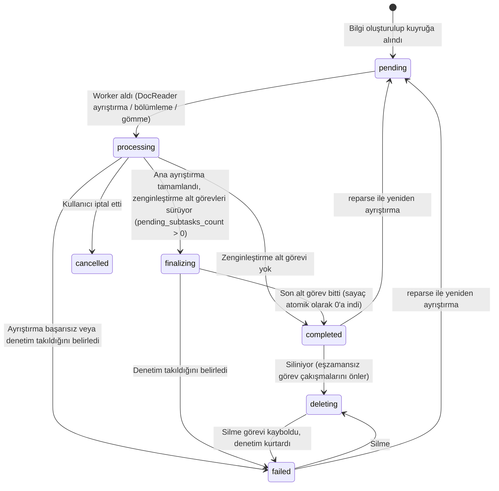

# Bilgi Tabanı ve Bilgi Yönetimi

Bilgi tabanı ilgili belgeleri düzenlemek ve bölümleme, vektör modeli, arama indeksi, Wiki ve bilgi grafiğini tek yerden yapılandırmak için kullanılır. Dosyalar, web sayfaları, elle yazılmış Markdown ve FAQ gibi içerikler bilgi öğeleri olarak yönetilir; içe aktarıldıktan sonra yapılandırmaya göre ayrıştırılır ve indekslenir.

Her bilgi tabanı kendi işleme yapılandırmasını kullanabilir. Soru sorarken arama kapsamı sınırlandırılabilir; üye erişimi ve kuruluş paylaşımı da bilgi tabanı düzeyinde yetkilendirilir.

<Screenshot
  src="/screenshots/kb-document-list.png"
  caption="Bilgi tabanı belge listesi: ayrıştırma durumu, etiketler ve toplu işlemler"
  hint="Belge listesi sayfasını gösterir: ayrıştırma durumu sütunu, etiket sütunu, üstteki filtre çubuğu ve sıralama düğmesi, ayrıca seçim yapıldıktan sonra görünen toplu işlem çubuğu (etiket, taşıma, toplu indirme)." />

## Yönetim İşlemlerinin Giriş Noktaları {#yonetim-islemlerinin-giris-noktalari}

| İşlem | Arayüz giriş noktası |
| --- | --- |
| Bilgi tabanı oluşturma, parça boyutunu ve indeks anahtarlarını değiştirme | Bilgi tabanı düzenleme penceresindeki "Bölümleme" ve "İndeks stratejisi" sekmeleri |
| Dosya yükleme, web sayfası içe aktarma veya Markdown yazma | Belge listesi sayfasındaki yükleme alanı veya "Yeni" açılır menüsü; yükleme ilerlemesi sağ alttaki yükleme görevleri panelinde izlenir |
| Belge listesi sırasını değiştirme | Belge listesi araç çubuğundaki "Sırala": güncelleme zamanı, yükleme/oluşturma zamanı (varsayılan olarak en son yüklenen önce) veya dosya adı |
| Ayrıştırma ilerlemesini görme veya takılan belgeleri inceleme | Belge kartındaki durum ya da belgenin ayrıştırma zaman çizelgesi (bkz. [Ayrıştırma İlerlemesini Görme](#ayristirma-ilerlemesini-gorme)) |
| Belgeleri klasörlerle düzenleme | Belge listesinin solundaki klasör ağacı; bir dizinin tamamı yüklendiğinde dizin yapısı korunur (bkz. [Klasör Ağacı](#klasor-agaci)) |
| Belgelere etiket ekleme (bir belgeye birden fazla) | Tek belge için ayrıntılar sayfasında değiştirilir; birden fazla belge seçildikten sonra toplu işlem çubuğundaki "Etiket" kullanılır (bkz. [Etiketler (KnowledgeTag)](#etiketler-knowledgetag)) |
| Ayrıştırma sonucunu kontrol etme, yazım hatalarını düzeltme | Belgeyi aç → parça listesi → parçayı doğrudan düzenle (bkz. [Parça Düzenleme ve Sürüm Geçmişi](#parca-duzenleme-ve-surum-gecmisi)) |
| Departman, gizlilik düzeyi gibi özel alanlar ekleme | Belge ayrıntılarındaki özel meta veriler (bkz. [Model Özeti](#model-ozeti)) |
| İşlem kayıtlarını görme | Bilgi tabanı ayarları → Etkinlik (bkz. [Bilgi Tabanı Etkinlik Akışı (KB Activity)](#bilgi-tabani-etkinlik-akisi-kb-activity)) |
| Bilgi tabanını kopyalama veya belgeleri tabanlar arasında taşıma | Bilgi tabanı listesindeki kopyalama ya da belge toplu işlemlerindeki taşıma (bkz. [Bilgi Tabanı Kopyalama ve Bilgi Taşıma](#bilgi-tabani-kopyalama-ve-bilgi-tasima)) |
| Orijinal dosyaları toplu indirme | Belgeleri seçtikten sonra toplu işlem çubuğundaki "Toplu indir" (bkz. [Toplu İndirme](#orijinal-dosyalari-toplu-indirme)) |

<Screenshot
  src="/screenshots/kb-settings.png"
  caption="Bilgi tabanı ayarları: bölümleme parametreleri ve indeks stratejisi anahtarları"
  hint="Parça boyutu/örtüşme/üst-alt parça ayarlarını ve vektör, anahtar kelime, Wiki, grafik olmak üzere dört indeks anahtarını gösterir." />

## Bilgi Tabanı Oluşturma ve Belgeleri İçe Aktarma {#bilgi-tabani-olusturma-ve-belgeleri-ice-aktarma}

Bilgi tabanı oluştururken içerik türünü, modeli ve indeksleme yöntemini seçin; ardından dosya yükleyin, web sayfası içe aktarın veya Markdown yazın. Sıradan belgeler için belge tabanı, standart soru-cevaplar için [FAQ tabanı](17-faq.md) kullanılır. Vektör deposu oluşturulduktan sonra değiştirilemez, bu yüzden bilgi tabanı oluşturulmadan önce belirlenmelidir.

Yükleme onay sayfasında etiketler ve bu gruptaki dosyaların ayrıştırma seçenekleri ayarlanabilir; belge özeti oluşturulup oluşturulmayacağı da buna dahildir (varsayılan olarak açıktır; kapatıldığında ayrıştırma, indeksleme ve diğer işlemler normal şekilde yürütülür). Tek seferlik işleme seçenekleri bilgi tabanı yapılandırmasından, bilgi tabanı yapılandırması da alan varsayılanlarından önceliklidir. Mevcut belgelerin değiştirilmiş bölümleme parametrelerini kullanabilmesi için yeniden ayrıştırılması gerekir.

Toplu yüklemede sayfanın sağ alt köşesindeki yükleme görevleri paneli tüm dosyaları özetler: aynı anda en fazla 3 dosya aktarılır; aktarılan baytlar, kalan süre ve aranabilir, işleniyor, başarısız ve zaten mevcut sayıları gösterilir. Tek bir dosya iptal edilebilir veya yeniden denenebilir; tüm yüklemeler tamamlandıktan sonra sayfadan ayrılabilirsiniz, ayrıştırma arka planda devam eder. Büyük dosyaların yükleme zaman aşımı dosya boyutuna göre otomatik olarak uzatılır.

<Screenshot
  src="/screenshots/kb-upload-tasks.png"
  caption="Yükleme görevleri paneli: toplu yüklemenin genel ilerlemesi ve dosya bazında durum"
  hint="Sağ alttaki kayan paneli gösterir: üstte ilerleme halkası ve 'x/y yükleniyor' başlığı, kalan süre, aranabilir/işleniyor/başarısız/zaten mevcut bölümlü ilerleme çubuğu ve dosya listesindeki iptal ve yeniden dene düğmeleri." />

### Ayrıştırma İlerlemesini Görme {#ayristirma-ilerlemesini-gorme}

Belge listesi ve kartlar her belgenin ayrıştırma durumunu gösterir. 20 dakikadan uzun süre ilerleme olmazsa durum "Kuyrukta" veya "Takılmış olabilir" olarak değişir: ilki görevin hâlâ kuyrukta beklediğini gösterir ve genellikle müdahale gerekmez; ikincisi belgeyi ilerleten bir görev kalmadığını gösterir, ayrıştırma zaman çizelgesini açıp hangi aşamada durduğunu görebilir veya ayrıştırmayı durdurup yeniden deneyebilirsiniz. Uzun süre ilerleme olmayan belgeler sistem tarafından otomatik olarak başarısız işaretlenir, hata kodu `TASK_STALLED` olur.

Ayrıştırma zaman çizelgesi her aşamanın süresini ve sonucunu gösterir. Başarısızlık durumunda üstteki hata kartı hatanın oluştuğu aşamayı ve nedeni açıklar ve yeniden deneme seçeneği sunar.

<Screenshot
  src="/screenshots/kb-parse-timeline.png"
  caption="Ayrıştırma zaman çizelgesi: aşama süreleri, başarısızlık nedeni ve takılma uyarısı"
  hint="Belge ayrıştırma zaman çizelgesi çekmecesini gösterir: aşama şelale grafiği (belge ayrıştırma/bölümleme/vektörleştirme/çok kipli/son işleme), başarısızlık durumundaki hata kartı (aşama adı, hata kodu, arka uç nedeni ve yeniden dene düğmesi) ile 'N dakikadır ilerleme yok' uyarı çubuğu ve ayrıştırmayı durdur düğmesi." />

## Klasörleri ve Etiketleri Düzenleme {#klasorleri-ve-etiketleri-duzenleme}

Klasörler dizin bazında arşivleme için kullanılır; bir belge yalnızca bir klasöre aittir. Bir dizinin tamamı yüklendiğinde hiyerarşi korunabilir; klasör ağacında yeniden adlandırma veya taşıma yapıldığında alt dizin yolları da birlikte güncellenir, hedef dizin zaten varsa içerikler birleştirilir. Belgenin aynı bilgi tabanı içinde klasör değiştirmesi yalnızca sınıflandırmayı değiştirir, yeniden ayrıştırma yapılmaz.

Etiketler çapraz sınıflandırma için kullanılır; bir belge birden fazla etiketle ilişkilendirilebilir. Etiketler yükleme sırasında önceden atanabilir veya belgeler seçilerek toplu olarak değiştirilebilir; toplu işlem penceresinde seçili belgelerin ortak etiketleri önceden seçili gelir. Birden fazla etiketle filtrelerken etiketlerden herhangi biriyle eşleşen belgeler döndürülür.

Otomatik etiketleme açıldığında sistem ayrıştırma tamamlanınca mevcut aday etiketler arasından eşleşenleri seçer. Varsayılan olarak her belgeye en fazla 3 etiket eklenir, zaten etiketi olan belgeler atlanır. Yapılandırma yalnızca sonraki ayrıştırmaları etkiler, geçmiş belgeleri otomatik olarak tamamlamaz; model başarısız olsa da belgenin tamamlanmasını engellemez.

<Screenshot
  src="/screenshots/kb-batch-tag.png"
  caption="Toplu etiketleme: seçili belgelerin ortak etiketleri önceden seçilir"
  hint="Birden fazla belge seçildikten sonra açılan etiket penceresini gösterir: seçili etiketler alanı, arama kutusu ve seçilebilir etiket listesi." />

## Parçaları Düzenleme ve Meta Veri Ekleme {#parcalari-duzenleme-ve-meta-veri-ekleme}

Belge ayrıntılarında metin parçalarını düzenleyerek ayrıştırma hatalarını düzeltebilir ve indeksi yeniden oluşturabilirsiniz. Her düzenleme veya geri alma yeni bir sürüm oluşturur; başka bir kullanıcı aynı parçayı güncellemişse arayüz sayfayı yenileyip yeniden denemenizi ister. İndeks güncellemesi başarısız olursa düzenlenen içerik korunur ve başarısız durumu gösterilir; yeniden göndererek tekrar deneyebilirsiniz.

Özel meta veriler departman, gizlilik düzeyi veya sürüm numarası gibi bilgileri eklemek için kullanılır, en fazla 20 öğe olabilir. Meta verileri değiştirmek özet yenilemesini tetikler; alan uzunlukları ve desteklenen türlerle ilgili ayrıntılar başvuru bölümündedir.

<Screenshot
  src="/screenshots/kb-chunk-edit.png"
  caption="Parça düzenleme: metni değiştirme, sürüm geçmişini görme ve geri alma"
  hint="Bir parçanın düzenleme durumunu, sürüm geçmişi listesini (düzenleyen ve zaman ile) ve geri alma seçeneğini gösterir." />

## İçerik Kopyalama ve Taşıma {#icerik-kopyalama-ve-tasima}

Bilgi tabanını kopyalayarak mevcut yapılandırma ve içerik yeniden kullanılabilir. Tabanlar arasında taşırken vektörleri yeniden kullanmayı veya yeniden ayrıştırmayı seçebilirsiniz: yeniden kullanım iki tabanın aynı vektör deposuna bağlı olmasını gerektirir, yeniden ayrıştırma ise hedef tabanın depolama ve işleme yapılandırmasını kullanmaya izin verir. Taşıma eşzamansız bir görevdir ve ilerlemesi sorgulanabilir.

### Orijinal Dosyaları Toplu İndirme {#orijinal-dosyalari-toplu-indirme}

Belgeleri seçip "Toplu indir"e tıkladığınızda seçilen dosyaların orijinalleri ZIP olarak paketlenir ve bilgi tabanındaki klasör yapısı korunur; arşiv açıldıktan sonra klasörlere göre yeniden yüklenebilir. Her grup en fazla 200 belge içerebilir ve orijinal dosyaların toplamı 512 MiB'ı aşamaz; web sayfası içe aktarma gibi orijinal dosyası olmayan öğeler atlanır. "Yüklenenlerin tümünü seç" yalnızca o anda yüklenmiş belgeleri kapsar. Toplu indirme tek dosya indirmeyle aynı yetkileri gerektirir: Contributor veya üstü rol ve bilgi tabanında düzenleme yetkisi.

## Etkinlik ve Kullanımı Görme {#etkinlik-ve-kullanimi-gorme}

Bilgi tabanı ayarlarındaki "Etkinlik", yapılandırma, belge, parça, paylaşım ve Wiki değişikliklerini kaydeder. Bu giriş noktası kaynak yönetim yetkisine sahip oturum açmış kullanıcılara yöneliktir; API Key ile erişilemez. API Key ile başlatılan işlemlerde işlemi yapanın altında ayrıca Key adı gösterilir.

Kuruluş paylaşımı yoluyla salt okunur (Viewer) yetkiyle erişilen bilgi tabanlarında arayüz yükleme, düzenleme, silme ve ayar seçeneklerini göstermez.

Depolama kotası çalışma alanı bazında hesaplanır; dosyaları, metni, vektörleri ve indeksleri kapsar. Bilgi tabanı oluşturmadan ve yüklemeden önce kota kontrol edilir; içerik silindikten sonra ilgili kullanım geri kazanılır.

<Screenshot
  src="/screenshots/kb-activity.png"
  caption="Bilgi tabanı etkinlik akışı: zamana göre ters sıralı işlem kayıtları"
  hint="Etkinlik listesini (işlemi yapan, eylem, hedef belge, zaman) ve açıldığında görünen ayrıntı çekmecesini gösterir." />

## Yapılandırma ve Arayüz Başvurusu {#yapilandirma-ve-arayuz-basvurusu}

### Bilgi Tabanı Modeli ve Yapılandırma Seçenekleri {#bilgi-tabani-modeli-ve-yapilandirma-secenekleri}

#### KB Türleri {#kb-turleri}

`internal/types/knowledgebase.go`:

```go
const (
    KnowledgeBaseTypeDocument = "document" // Belge türü
    KnowledgeBaseTypeFAQ      = "faq"      // FAQ türü
    KnowledgeBaseTypeWiki     = "wiki"     // Wiki türü
)
```

KB güncellenirken türüyle uyuşmayan yapılandırmalar temizlenir (ör. FAQ olmayan tabanlarda `FAQConfig`). `VectorStoreID` GORM `<-:create` etiketini kullanır ve **oluşturulduktan sonra değiştirilemez** (indeks ile depolamanın uyumsuz hale gelmesini önlemek için).

#### Yapılandırma Yapısına Genel Bakış {#yapilandirma-yapisina-genel-bakis}

```mermaid
graph TB
    KB["KnowledgeBase (id, name, type, tenant_id, creator_id)"]
    KB --> CC["ChunkingConfig (bölümleme)"]
    KB --> IS["IndexingStrategy (indeks hattı anahtarları)"]
    KB --> EMB["EmbeddingModelID / SummaryModelID"]
    KB --> VLM["VLMConfig (görsel model)"]
    KB --> ASR["ASRConfig (konuşma tanıma)"]
    KB --> IMG["ImageProcessingConfig (görsel anlama)"]
    IMG --> ICP["ImageAttrsEnabled + ImageActions (öznitelik gözlemi + koşullu OCR)"]
    KB --> EXT["ExtractConfig (bilgi grafiği)"]
    KB --> FAQ["FAQConfig (yalnızca faq türü)"]
    KB --> QG["QuestionGenerationConfig (soru üretimi)"]
    KB --> WIKI["WikiConfig (wiki_enabled açıkken)"]
    KB --> ST["StorageProviderConfig / StorageBackendID / StorageConfig (eski)"]
    KB --> VS["VectorStoreID (oluşturulduktan sonra değiştirilemez)"]
    CC --> PCR["ParserEngineRules (dosya türüne göre ayrıştırma motoru seçimi)"]
    CC --> PC["Üst-alt parçalar (parent_chunk_size / child_chunk_size)"]
    EXT --> GN["GraphNode / GraphRelation"]
    IS --> V["vector (varsayılan true)"]
    IS --> KW["keyword / BM25 (varsayılan true)"]
    IS --> WK["wiki (varsayılan false)"]
    IS --> GR["graph (varsayılan false)"]
```



#### ChunkingConfig (Bölümleme Yapılandırması) {#chunkingconfig-bolumleme-yapilandirmasi}

| Alan | Tür | Varsayılan | Açıklama |
| --- | --- | --- | --- |
| `chunk_size` | int | Zorunlu | Parça boyutu (karakter sayısı) |
| `chunk_overlap` | int | - | Komşu parçalar arasındaki örtüşme |
| `separators` | []string | - | Ayırıcı listesi |
| `parser_engine_rules` | []ParserEngineRule | - | Dosya türüne göre ayrıştırma motoru belirler: `{file_types, engine, xlsx_first_row_as_header?}` |
| `enable_parent_child` | bool | false | Üst-alt parça stratejisini etkinleştirir |
| `parent_chunk_size` | int | 4096 | Üst parça boyutu (bağlam döndürmek için) |
| `child_chunk_size` | int | 384 | Alt parça boyutu (gömme ile arama için) |
| `strategy` | string | boş (= `legacy`) | Bölümleme stratejisi: `legacy` (eski özyinelemeli bölme) / `auto` (profilleyici katmanı otomatik seçer) / `heading` / `heuristic` / `recursive` (belirli bir katmanı sabitler), ayrıntılar için bkz. [Bölümleme Mekanizması](04-chunking.md) |
| `token_limit` | int | 0 | Token üst sınırı (0 = sınırsız) |
| `languages` | []string | Otomatik algılama | Dil ipucu |
| `table_metadata_instructions` | string | - | Tablo meta verisi üretim talimatı |

#### IndexingStrategy (İndeks Hattı Anahtarları) {#indexingstrategy-indeks-hatti-anahtarlari}

| Alan | Varsayılan | Açıklama |
| --- | --- | --- |
| `vector_enabled` | true | Anlamsal vektör araması |
| `keyword_enabled` | true | Anahtar kelime (BM25) araması |
| `wiki_enabled` | false | Wiki sayfası üretimi |
| `graph_enabled` | false | Bilgi grafiği çıkarımı |

#### Çok Kipli ve Zenginleştirme Yapılandırması {#cok-kipli-ve-zenginlestirme-yapilandirmasi}

**VLMConfig (görsel dil modeli)**:

| Alan | Açıklama |
| --- | --- |
| `enabled` / `model_id` | Yeni sürüm: etkinleştirme anahtarı + model ID |
| `description_language` | Görsel açıklama dili (boş = belge dilini izler) |
| `custom_instructions` | KB düzeyinde görsel yorumlama yönergesi |

Etkinlik koşulu: `Enabled && ModelID != ""` veya eski sürümde `ModelName != "" && BaseURL != ""`.

**ASRConfig**: `enabled` / `model_id` / `language` (dil ipucu, isteğe bağlı).

**ImageProcessingConfig (görsel öznitelik gözlemi ve koşullu OCR)**:

| Alan | Tür | Varsayılan | Açıklama |
| --- | --- | --- | --- |
| `model_id` | string | - | Görsel anlama için kullanılan VLM model ID'si (model kullanım takibine dahil edilir) |
| `image_attrs_enabled` | bool | false | Görsel öznitelik gözlem hattı anahtarı. Kapalı (varsayılan) = eski davranış: her görsel için bir açıklama isteği ve bir OCR isteği gönderilir, öznitelik gözlemi yapılmaz; açıldığında ilk turda "öznitelik gözlemi + açıklama" yapılır, ardından saf kod fonksiyonu gözlem sonucuna göre görselin ayrıca bir OCR turuna değip değmediğine karar verir |
| `image_actions` | object | Aşağıya bakın | OCR tetikleme koşulları: `{ ocr: { on: ImageAttrCondition[], on_unobserved: bool } }`. `on`, "öznitelik=değer" tetikleme koşulları listesidir; `on_unobserved`, öznitelik model tarafından gözlemlenmediğinde kullanılan temkinli yedektir (varsayılan true = yine OCR yapılır) |

`image_attrs_enabled` açıldıktan sonra model **görselleri artık sınıflandırmaz**, yalnızca öznitelikleri tek tek "gözlemler" ve açıklama üretir. Bu sürümde iki gözlem öğesi etkindir (tam kayıt için bkz. `GET /api/v1/image-attrs/schema`; salt okunurdur, Viewer yetkisi gerekir; bu kayıt geneldir ve bilgi tabanına göre değişmez):

| Öznitelik | Değerler | Anlamı |
| --- | --- | --- |
| `contain.text` | `none` / `sparse` / `block` | Görseldeki paragraf halindeki metnin yoğunluğu. `block` = OCR'a değer gövde metni |
| `contain.data_visual` | `true` / `false` | Grafik / veri görselleştirmesi içerip içermediği (eksen etiketleri vb. de metin içerebilir) |

OCR kararı saf kod fonksiyonu `DecideOCR` ile verilir (`internal/application/service/image_attr_decision.go`) ve veritabanına yazılmaz:

- `contain.text == block` **veya** `contain.data_visual == true` sağlanırsa → OCR çalışır;
- Stratejinin okuduğu öznitelikte **anahtar eksikse** (model o satırı yanıtlamadıysa veya geçersiz değer verdiyse) → `on_unobserved` yedeği uygulanır (varsayılan yine OCR);
- Tüm öznitelikler gözlemlendi ve hiçbiri eşleşmediyse → OCR atlanır.

Model alakasız yanıt verirse / öznitelik eksikse her durumda yedek strateji uygulanır; gözlem hatası yalnızca bir çağrı fazlasına mal olur, içerik kaybolmaz. **Özniteliğin eksik olmasının normal bir sonuç** olduğunu unutmayın: gözlem başarısız olduğunda temkinli varsayılan değerler yazılmaz (schema sürümü `attrs/2`), bu yüzden `image_attrs` boş bir nesne olabilir; okuyan tarafın "gözlemlenmedi" ile "negatif değer gözlemlendi" durumlarını ayırması gerekir.

Hat ve gözlem sonuçları, doğrulama ve sorun giderme için her görselin işleme izindeki alt span'e kaydedilir: input `pipeline` = `observation_driven` (bu anahtar açık) veya `caption_ocr` (kapalı, eski davranış); output `attr_policy` (bu turun OCR kararı), `image_attrs` (gözlemlenen öznitelikler), `ocr_skipped` (`attr_policy` = strateji tarafından atlandı / `disabled` = OCR ana anahtarı kapalı), `observation_failed` (geçerli bir gözlem oluşmadı), `chunks_created`.

Tek bir yükleme / yeniden ayrıştırma, istek gövdesindeki `process_config` (`KnowledgeProcessOverrides`) içinde belge bazında `image_attrs_enabled` ve `image_actions` değerlerini geçersiz kılabilir; gönderilmeyen öğeler bilgi tabanı ayarlarını kullanır. `image_actions` action key'e göre birleştirilir (`on` bütünüyle değiştirilir). Arayüz alanları için bkz. [Bilgi Tabanı API](../04-api/02-api-knowledge.md), hat ayrıntıları için bkz. [Belge Ayrıştırma](03-document-parsing.md).

**QuestionGenerationConfig (soru üretimi)**: `enabled`; `question_count` parça başına üretilecek soru sayısı (varsayılan 3, üst sınır 10); `custom_instructions` hedef kitle / üslup açıklaması.

**ExtractConfig (bilgi grafiği)**: `enabled`, `text`, `tags`, `nodes []*GraphNode{name, chunks, attributes}`, `relations []*GraphRelation{node1, node2, type}`, `custom_instructions` (alana özgü çıkarım yönergesi).

**FAQConfig (yalnızca FAQ tabanı)**: `index_mode` (`question_only` / `question_answer`, varsayılan ikincisi), `question_index_mode` (`combined` / `separate`, varsayılan combined); ayrıntılar FAQ bölümünde.

**WikiConfig (`indexing_strategy.wiki_enabled` açık olan bilgi tabanları)**: Bunun yalnızca `type = "wiki"` için olmadığını unutmayın; sıradan bir belge tabanında Wiki indeksi açıldığında `UpdateKnowledgeBase` bu ayarlanabilir öğeleri taşıması için otomatik olarak boş bir `WikiConfig` oluşturur:

| Alan | Varsayılan | Açıklama |
| --- | --- | --- |
| `synthesis_model_id` | - | Wiki üretimi için LLM |
| `max_pages_per_ingest` | 0 (sınırsız) | Tek bir alımda oluşturulacak/güncellenecek en fazla sayfa sayısı |
| `extraction_granularity` | `standard` | `focused` (yalnızca ana konular) / `standard` / `exhaustive` (tüm varlık ve kavramlar) |
| `content_instructions` / `extraction_instructions` | - | Üretim ve çıkarım üslubu yönergesi |
| `ingest_batch_size` / `ingest_map_parallel` / `ingest_reduce_parallel` / `ingest_max_inflight` | 5 / 10 / 10 / 4 | Alım eşzamanlılık parametreleri |

Tüm `custom_instructions` türündeki alanların uzunluğu ve geçerliliği güncelleme sırasında `validateKnowledgeBasePromptInstructions` ile doğrulanır (`internal/handler/knowledgebase.go`).

#### Depolama Yapılandırması {#depolama-yapilandirmasi}

- **StorageProviderConfig** (yeni): `provider ∈ {local, minio, cos, tos, s3, oss, ks3, obs}`;
- **StorageBackendID**: Belirli bir depolama arka ucu örneğine bağlar;
- **StorageConfig** (eski `cos_config` sütunu): `secret_id / secret_key / region / bucket_name / app_id / path_prefix / provider / endpoint / use_ssl / force_path_style`.

#### KB Hesaplanan Alanları {#kb-hesaplanan-alanlari}

Liste / ayrıntı yanıtlarında şunlar bulunur: `knowledge_count` (silinmekte olan belgeler hariç, belge listesiyle tutarlı), `chunk_count`, `is_processing` (FAQ tabanı), `processing_count` (belge tabanında işlenmekte olan bilgi sayısı), `share_count` (paylaşıldığı kuruluş sayısı), `creator_name`, `is_pinned` / `pinned_at` (geçerli kullanıcının sabitleme durumu).

Ayrıca bir depolama alanı olan `is_temporary` bulunur: **geçici (ephemeral) bilgi tabanlarını** işaretler ve bunlar normal bilgi tabanı listesinde gösterilmez. Sistem tarafından dahili olarak kullanılır; tipik senaryo, web aramasının getirdiği sayfaları aranabilir içerik olarak önbelleğe almasıdır. Elle oluşturulan bilgi tabanları geçici taban oluşturmaz.

#### Otomatik Etiketleme {#otomatik-etiketleme}

Belge bilgi tabanının etiketle ilgili ayarlarında otomatik etiketlemeyi açın; önce aday etiketleri hazırlayın, ardından bir sohbet modeli seçin. Ayrıştırma tamamlandıktan sonra sistem eşzamansız olarak mevcut etiketler arasından eşleşenleri seçer, yeni etiket oluşturmaz. `auto_tag_config` yalnızca document türü için geçerlidir:

| Alan | Varsayılan | Açıklama |
| --- | --- | --- |
| enabled | false | Otomatik etiketlemeyi açar |
| model_id | boş | Boşsa bilgi tabanının summary_model_id değeri kullanılır |
| max_tags | 3 | Her belgeye otomatik eklenecek en fazla etiket sayısı, üst sınır 10 |
| skip_if_tagged | true | Zaten etiketi olan belgeleri atlar (elle veya veri kaynağı tarafından eklenen etiketler dahil); false ise artımlı olarak ekler |

Yapılandırma yalnızca bundan sonra yeni ayrıştırılan veya yeniden ayrıştırılan belgelere uygulanır, geçmiş belgeleri otomatik olarak doldurmaz. Model başarısız olsa da belgenin tamamlanmasını engellemez; eşzamansız görev kuyruk stratejisine göre yeniden denenir. Aday etiketler bilgi tabanındaki sıralamada ilk 500 etiketten alınır; otomatik ilişkilendirme elle eklenen etiketleri silmez. Veri kaynaklarının kaynak adına göre etiket eklemesi ayrı bir mekanizmadır.

#### Yapay Zekâ ile Bilgi Tabanı Açıklaması Üretme {#yapay-zeka-ile-bilgi-tabani-aciklamasi-uretme}

Bilgi tabanının iki açıklaması vardır: `description`, kullanıcının elle yazdığı "bu taban ne için kullanılır" metnidir; `generated_profile` ise sistemin belge profillerinden çıkardığı "bu tabanda gerçekte neler var" metnidir. İkisi birbirinin üzerine yazmaz; ajan çalışma zamanı bağlamında ikisini birlikte okur ve bir sorunun hangi bağlı bilgi tabanında aranması gerektiğine bunlarla karar verir.

Üretim üç katmanlıdır, yalnızca son katman model çağırır:

1. **Belge profili**: Belge özeti görevi kısa özeti üretirken aynı zamanda yapılandırılmış bir profil de çıkarır (`knowledges.profile`): tek cümlelik gist, 3 ila 5 konu terimi, belge türü ve bir tipik soru. Profil belgeyle birlikte saklanır ve belge silinince kaybolur.
2. **Bilgi tabanı toplama**: Saf veritabanı istatistikleri: belge sayısı, dosya türleri, etiket sayıları, konu terimi sayıları (büyük/küçük harf ve noktalama normalleştirilir), belge türü sayıları, konulara göre sırayla örneklenen tipik sorular, eşit dağılımla örneklenen başlıklar; girdiler için ayrıca bir hash hesaplanır. Silme, taşıma ve yeniden ayrıştırma için özel işlem gerekmez; yeniden hesaplama tam doğru sonucu verir.
3. **Açıklama metni**: Toplanan veri (bir iki bin token, belge sayısından bağımsız) modele verilir ve gist, birleştirilmiş konu listesi ve 3 ila 5 tipik soru elde edilir. Toplama hash'i değişmediyse model çağrısı atlanır.

`profile_config` yalnızca document türü için geçerlidir:

| Alan | Varsayılan | Açıklama |
| --- | --- | --- |
| enabled | false | Belge ekleme/silme/özet güncellemesinden sonra otomatik yenileme (30 saniyelik debounce, aynı pencerede yalnızca bir kez çalışır) |
| model_id | boş | Boşsa bilgi tabanının summary_model_id değeri kullanılır |
| custom_instructions | boş | Sistem istemine eklenen ek gereksinimler, ör. hedef okuyucu veya korunması gereken terimler |

Otomatik yenileme açık olsun olmasın, bilgi tabanı ayarlar sayfasında "Yapay zekâ açıklaması üret"e tıklayarak hemen bir kez üretebilir ve tek tıkla gist'i elle yazılmış açıklama olarak benimseyebilirsiniz. `generated_profile.status` değeri `ready`/`empty` (ayrıştırılmış belge yok, model çağrılmaz)/`failed` (önceki metin korunur ve hata kaydedilir) olur. Belge özeti kapatılmış yüklemeler yalnızca başlık, tür ve etiket katkısı sağlar, konu terimi katkısı sağlamaz.

### Bilgi (Knowledge) Yönetimi {#bilgi-knowledge-yonetimi}

#### Model Özeti {#model-ozeti}

`internal/types/knowledge.go`. Temel alanlar: `type` (`manual` elle yazılmış Markdown / `faq` / dosya türü), `source` / `channel` (alım kanalı), `parse_status`, `summary_status`, `enable_status`, `file_name/type/size/hash/path`, `storage_size`, `metadata` (JSON; elle yazılan bilgi için `ManualKnowledgeMetadata{content, format, status(draft/publish), version}` saklanır), `custom_metadata` (JSON, kullanıcının doldurduğu meta veriler), `last_faq_import_result`.

`custom_metadata`, kullanıcının yönettiği departman, gizlilik düzeyi, sürüm numarası gibi tanımlayıcı alanları saklar; `metadata` ise işleme akışının iç durumunu ve ID'lerini saklar. Özel meta veriler en fazla 20 öğe olabilir; anahtarlar 1–64 karakterdir, değerler string, sayı, boolean veya null olabilir ve 1000 karakteri aşamaz. Değiştirildikten sonra özet otomatik olarak yenilenir.

Uygulamada `Knowledge.CustomMetadataText()`, anahtarlara göre sıralanmış `anahtar: değer` metni üretir; bu metin özet üretiminde ve belge düzeyindeki model bağlamında kullanılır. Alan `000078` numaralı migration ile eklenmiştir.

Alım kanalı sabitleri: `web`, `api`, `browser_extension`, `wechat`, `feishu`, `feishu_drive`, `lark_drive`, `dingtalk`, `slack`, `im`, `notion`, `confluence`, `yuque`, `rss`, `ima`.

Ayrıştırma durum makinesi:



Tek bir zenginleştirme alt görevinin (özet, soru üretimi, grafik, Wiki) başarısız olması belgeyi `failed` yapmaz; belge tüm alt görevler bittikten sonra `completed` durumuna geçer. `pending`, `processing`, `finalizing` veya `deleting` durumunda takılan belgeler arka plan denetimiyle kurtarılır, bkz. [Eşzamansız Görev Sistemi](../02-architecture/05-async-tasks.md#son-guvence-housekeeping-taramasi).

Özetin bağımsız durumu: `summary_status ∈ {none, pending, processing, completed, failed}`.

#### Bilgi Rotaları {#bilgi-rotalari}

| Yöntem | Yol | Açıklama | Erişim denetimi |
| --- | --- | --- | --- |
| POST | `/knowledge-bases/:id/knowledge/file` | Dosya yükleme | OwnedKBOrAdmin + KBAccessWrite |
| POST | `/knowledge-bases/:id/knowledge/url` | URL içe aktarma | Aynı |
| POST | `/knowledge-bases/:id/knowledge/manual` | Elle yazılan Markdown bilgisi | Aynı |
| GET | `/knowledge-bases/:id/knowledge` | Liste (sayfalama + filtre + sıralama) | Viewer+ + KBAccessRead |
| POST | `/knowledge-bases/:id/knowledge/batch-download` | Orijinal dosyaları toplu indirme (ZIP) | Contributor+ + KBAccessWrite |
| GET / PUT | `/knowledge-bases/:id/knowledge/folders` | Klasör ağacı / klasörü yeniden adlandırma veya taşıma | Viewer+ + KBAccessRead / OwnedKBOrAdmin + KBAccessWrite |
| DELETE | `/knowledge-bases/:id/knowledge` | KB içeriğini temizleme | Admin + KBAccessWrite |
| GET | `/knowledge/:id`, `/knowledge/batch` | Ayrıntı / toplu getirme | Viewer+ |
| GET | `/knowledge/:id/stages`, `/knowledge/:id/spans` | İşleme aşamaları / span'ler | Viewer+ |
| PUT / DELETE | `/knowledge/:id`, `/knowledge/manual/:id` | Güncelleme (`custom_metadata` dahil) / silme | OwnedKnowledgeKBOrAdmin + KBAccessWrite |
| POST | `/knowledge/:id/reparse`, `/knowledge/:id/cancel-parse` | Yeniden ayrıştırma / ayrıştırmayı iptal etme | Aynı |
| POST | `/knowledge/:id/regenerate-summary` | Belge özetini yeniden üretme | Aynı |
| GET | `/knowledge/:id/download` | Orijinal dosyayı indirme | Contributor+ + KBAccessWrite |
| GET | `/knowledge/:id/preview` | Dosya önizleme | Viewer+ + KBAccessRead |
| PUT | `/knowledge/tags` | Etiketleri toplu güncelleme | Contributor+ / `ingest` |
| POST | `/knowledge/batch-reparse`, `/knowledge/batch-delete` | Toplu yeniden ayrıştırma / silme | Contributor+ / `ingest` |
| POST | `/knowledge/folder` | Belgeleri bir klasöre yerleştirme | Contributor+ / `ingest` |
| POST | `/knowledge/move` | Bilgi taşıma | Contributor+ / `ingest` |
| GET | `/knowledge/move/progress/:task_id` | Taşıma ilerlemesi | Viewer+ |

#### Liste Filtre Parametreleri {#liste-filtre-parametreleri}

`internal/types/knowledge.go` içindeki `KnowledgeListFilter` + `internal/handler/knowledge.go`:

| Parametre | Açıklama |
| --- | --- |
| `page` / `page_size` | Sayfalama (varsayılan 1 / 20) |
| `sort_by` / `sort_order` | Sıralama: `updated_at` / `created_at` / `file_name`, `asc` / `desc`; varsayılan `created_at desc` |
| `keyword` | Dosya adına / başlığa göre arama |
| `file_type` | Dosya türü filtresi (`pdf` / `manual` / `url` …) |
| `parse_status` | Ayrıştırma durumu filtresi |
| `source` | Alım kanalı filtresi (`api` / `web` / `feishu` …) |
| `tag_ids` | Etiket filtresi, birden fazlası virgülle ayrılır (**OR anlamı**) |
| `start_time` / `end_time` | Güncelleme zamanı aralığı (RFC3339) |
| `folder_path` | Klasöre göre filtreler. **Bu parametrenin gönderilip gönderilmemesi liste modunu belirler**: gönderilmezse tüm tabanın düz görünümü, boş string gönderilirse bilgi tabanının kök dizini (alt dizinler hariç) |
| `folder_recursive` | `folder_path` ile birlikte kullanılır; `true` olduğunda alt dizinlerdeki belgeler de döndürülür |

#### Klasör Ağacı {#klasor-agaci}

Klasörler belgeleri proje, kaynak veya dizin hiyerarşisine göre düzenlemek için kullanılır; yükleme sırasında dizin yapısının korunmasını ve içe aktarıldıktan sonra yeniden adlandırma ile taşımayı destekler.

Klasör işlemleri:

- **Bir dizinin tamamını yükleme**: Dizin yapısı olduğu gibi korunur, sonradan elle klasör oluşturmak gerekmez;
- **Klasör oluşturma / yeniden adlandırma / taşıma**: Belge listesinin solundaki klasör ağacında yapılır. Yeniden adlandırma alt dizinlerin yollarını da değiştirir; hedef yol zaten varsa iki klasör birleştirilir; bir klasör kendi alt dizinine taşınamaz;
- **Belgeleri yeniden sınıflandırma**: Belgeleri seçip belirli bir klasöre taşıyın (kök dizine geri de taşınabilir). Bu yalnızca sınıflandırmayı değiştirir; yeniden ayrıştırma yapmaz ve indeksi etkilemez;
- **Dizine göre gezinme**: Liste arayüzündeki `folder_path` görünüm modunu belirler: gönderilmezse tüm taban düz listelenir, boş string gönderilirse kök dizin (alt dizinler hariç) listelenir, `folder_recursive=true` ile birlikte kullanılırsa alt dizinler de listelenir.

Klasörler ve etiketler farklı sorunları çözer ve birlikte kullanılabilir: **klasör tekil aidiyettir** (bir belge yalnızca bir dizinde bulunur; proje/kaynak bazında arşivleme için uygundur), **etiket çoktan çoğadır** (bir belge birden fazla etiket taşıyabilir; konu, gizlilik düzeyi, durum gibi çapraz filtreleme için uygundur). Aramada ikisi de kapsam sınırlama koşulu olarak kullanılabilir.

Dizin yolu `knowledges.folder_path` içinde saklanır, `file_name` yalnızca dosya adını saklar. `000079` numaralı migration, dizin yollarını eski dosya adlarından geri doldurmuştur.

Klasör arayüzleri `GET/PUT /knowledge-bases/:id/knowledge/folders` ve `POST /knowledge/folder`'dır; ayrıntılar için bkz. [Bilgi Tabanı API](../04-api/02-api-knowledge.md).

#### Etiketler (KnowledgeTag) {#etiketler-knowledgetag}

`internal/types/tag.go` + `internal/handler/tag.go`:

```go
type KnowledgeTag struct {
    ID              string // UUID
    SeqID           int64  // Otomatik artan tam sayı ID (API tarafından kullanılır)
    TenantID        uint64
    KnowledgeBaseID string
    Name            string // KB içinde benzersiz
    Color           string
    SortOrder       int
}
type KnowledgeTagRelation struct { KnowledgeID, TagID string } // Çoktan çoğa
```

**Bir belge birden fazla etiket taşıyabilir.** Başlangıçta tek etiket vardı (`knowledges.tag_id` sütunu); `000063` numaralı migration bunu `knowledge_tag_relations` ilişki tablosuyla değiştirdi: tablo oluşturulurken mevcut tek etiket verileri buraya taşındı, ardından **`knowledges.tag_id` sütunu silindi**. Bu yüzden şu anda:

- Okuma: `Knowledge.Tags` sorgu sırasında `knowledge_id`'ye göre toplu JOIN ile elde edilir (`gorm:"-"`, knowledges tablosunda saklanmaz);
- Yazma: Bütünüyle değiştirme anlamı; `PUT /knowledge/tags` ile `{knowledge_id: [tag_ids]}` gönderilir, uygulama önce belgenin tüm ilişkilerini siler, sonra yeni kümeyi yazar;
- Filtreleme: `tag_ids` **OR anlamı** taşır (herhangi bir etiketle eşleşen döndürülür), SQL `knowledges.id IN (SELECT knowledge_id FROM knowledge_tag_relations WHERE tag_id IN (...))` biçimindedir;
- FAQ girdileri farklı bir düzendir: kendileri chunk'tır ve etiket `chunks.tag_id` üzerinde saklanır (**tek etiket**); belgelerin çoklu etiket ilişki tablosuyla aynı yol değildir.

Etiketlerin kendi yönetim rotaları: `GET /knowledge-bases/:id/tags` (Viewer+), `POST` (OwnedKBOrAdmin), `PUT/DELETE /knowledge-bases/:id/tags/:tag_id` (OwnedKBOrAdmin); `tag_id` yol parametresi hem UUID'yi hem tam sayı `seq_id`'yi kabul eder.

Ön yüzde iki giriş noktası vardır:

- **Toplu etiketleme**: Belge listesinde birkaç belge seçildikten sonra toplu işlem çubuğundaki "Etiket" düğmesi `BatchTagDialog.vue`'yu açar. Pencere seçili belgelerin **ortak** etiketlerini önceden seçer, arama yapmayı ve doğrudan etiket yönetimine geçmeyi destekler; gönderildikten sonra liste yenilenir;
- **Yüklemede etiket ayarlama**: Yükleme onay penceresi (`UploadConfirmDialog.vue`), dosya içe aktarılmadan önce etiketleri ve ayrıştırma seçeneklerini doğrudan belirlemeye izin verir; önce yükleyip sonra değiştirme adımı ortadan kalkar.

#### Parça Düzenleme ve Sürüm Geçmişi {#parca-duzenleme-ve-surum-gecmisi}

Belge ayrıntılarında parça metni düzenlenerek OCR, tablo veya formül ayrıştırma hataları düzeltilebilir. Kaydedildikten sonra indeks yeniden oluşturulur ve görüntüleme ile geri alma için geçmiş sürümler tutulur.

Uygulamada (`internal/application/service/chunk.go`, `000078` numaralı migration):

Veri modeli:

| Alan / tablo | Görev |
| --- | --- |
| `chunks.source_content` | Ayrıştırıcının orijinal çıktısı, **değiştirilemez**. Yeni parça oluşturulurken yazılmaz, ilk elle düzenlemede `content`'ten tembel olarak doldurulur |
| `chunks.content` | Geçerli içerik (arama ve alıntı gösterimi bunu kullanır) |
| `chunks.content_revision` | Her düzenleme veya geri almada +1 artar, iyimser kilit olarak kullanılır |
| `chunks.index_status` | `ready` / `processing` / `failed`; geçerli içeriğin arama deposuna yansıyıp yansımadığını gösterir |
| `chunks.last_editor_id` | Geçerli sürümü oluşturan kişi |
| `chunk_revisions` tablosu | Üzerine yazılan geçmiş sürümlerin anlık görüntüleri (içerik, etkin/devre dışı, düzenleyen, kaynak, zaman) |

Davranış özeti:

- **Yalnızca `text` türündeki parçalar düzenlenebilir**; içerik boşluklardan arındırıldıktan sonra boş olamaz, üst sınır 200000 bayttır;
- **İyimser eşzamanlılık**: İstek `expected_revision` taşıyabilir; geçerli sürümle uyuşmazsa 409 döner ve ön yüz yenileyip yeniden denemeyi önerir;
- **Yeni görsel eklenemez**: Düzenlenen içerikte kaynak içerikte olmayan bir görsel URL'si varsa reddedilir; bir görselin Markdown başvurusu silindiğinde ilgili OCR / caption alt parçaları kalıcı olarak silinmez, **devre dışı bırakılır**; böylece geçmiş bir sürüme geri dönüldüğünde yeniden etkinleştirilebilirler;
- **Üst-alt parça tutarlılığı**: Alt parça düzenlendikten sonra değişiklik ofsete göre üst parçaya yansıtılır (üst parçanın `source_content`'i değişmez kalır, değiştirmeler ters sırada uygulanır, böylece uzunluk değişiklikleri koordinat sistemini bozmaz);
- **İndeks hatası işleme**: İndeks yeniden oluşturma başarısız olursa satır yine kaydedilir, ancak `index_status = failed` olur ve arayüz buna göre uyarı gösterir; aynı içeriği yeniden göndermek tekrar denemeyi tetikler;
- **Üretilmiş sorular korunur**: İçerik düzenlendikten sonra mevcut arama soruları korunur, yalnızca "geçerli metin sürümüyle eşleşmiyor" olarak işaretlenir; tek tek yeniden yazılabilir (`PUT /chunks/by-id/:id/questions`) veya topluca yeniden üretilebilir (`POST /chunks/by-id/:id/questions/regenerate`);
- **Özet bağlantısı**: İçerik veya etkin/devre dışı durumu değiştiğinde bir belge özeti yenilemesi kuyruğa alınır ve `summary_status` `pending` olur; `POST /knowledge/:id/regenerate-summary` ile elle de tetiklenebilir.

Geri alma (`POST /chunks/:knowledge_id/:id/revert`) da yeni bir düzenlemedir: hedef geçmiş sürümün içeriği geçerli içerik olarak yazılır, sürüm numarası artmaya devam eder ve önceki içerik geçmiş listesine girer; bu yüzden "geri almayı geri almak" da mümkündür.

Arayüz listesi için bkz. [API Başvurusu: Parçalar ve Etiketler](../04-api/02-api-chunks.md).

#### Özeti Elle Düzenleme ve Parçalara Göz Atma {#ozeti-elle-duzenleme-ve-parcalara-goz-atma}

Belge içerik önizlemesinde özet düzenlenip kaydedilebilir; bu, otomatik özeti düzeltmek için kullanılır. `PUT /knowledge/:id` isteğinde description atlanırsa mevcut özet korunur, açıkça boş string gönderilirse temizlenir; özeti güncellemek orijinal belge içeriğini değiştirmekle aynı şey değildir. Yeniden üretmek gerektiğinde "Özeti yeniden üret" kullanılır; içerik/meta veri değişiklikleri de özet yenilemesini tetikleyebilir.

Belge parçaları sayfa sayfa yüklenir; belge değiştirildiğinde ve aramadan atlandığında sayfalama durumu güncellenir. Tüm alanlar için bkz. [Bilgi API](../04-api/02-api-knowledge.md) ve [Parça API](../04-api/02-api-chunks.md).

#### İndirme ve Önizleme Güvenliği {#indirme-ve-onizleme-guvenligi}

`GET /knowledge/:id/preview` güvenlik mekanizması `internal/handler/knowledge_preview_security_test.go` ile sabitlenip doğrulanır:

| Denetim | Uygulama | Amaç |
| --- | --- | --- |
| Uzantıya göre `Content-Type` ayarlama | PDF, görsel, metin vb. türlerine göre satır içi önizlenir; HTML, SVG, XML, JS, CSS gibi tarayıcının çalıştırabileceği türler zorla `application/octet-stream` yapılır | Tarayıcının yüklenen içeriği sayfa olarak çalıştırmasını engeller (depolanmış XSS'e karşı) |
| `X-Content-Type-Options: nosniff` | Yanıt başlığı | MIME koklama yoluyla atlatmayı engeller |
| `Content-Disposition` | Çalıştırılabilir türler için `attachment`, diğerleri için `inline` | Tehlikeli türler yalnızca indirilebilir, satır içi işlenemez |
| Yol doğrulaması | `ValidateKBScopedStoragePath()` | Dosya yolu o KB'nin yetkili depolama kapsamında olmalıdır (yol geçişine / yetkisiz okumaya karşı) |
| Boyut sınırı | GetFile yanıt gövdesi sınırı | Çok büyük dosyaların önizlemeyi çökertmesini önler |

Test senaryoları açıkça doğrular: HTML dosyasının içeriği `<script>alert(1)</script>` olsa bile yalnızca ikili ek olarak aktarılır. İndirme uç noktaları (`/knowledge/:id/download` ve toplu indirme `/knowledge-bases/:id/knowledge/batch-download`) daha yüksek olan Contributor+ rolünü ve KBAccessWrite erişim denetimini gerektirir.

Önizleme orijinal dosyanın kendisini döndürür; salt okunur paylaşım (kuruluş paylaşımındaki viewer, paylaşılan ajan üzerinden görünürlük) yoluyla erişildiğinde de önizleme yapılabilir. "Yalnızca Editor ve üstü indirebilir" kuralı ürün düzeyinde bir kolaylık kısıtlamasıdır, erişim denetimi sınırı değildir: bir KB'yi okuyabilen kişi içindeki orijinal dosyalara da ulaşabilir.

### Bilgi Tabanı Kopyalama ve Bilgi Taşıma {#bilgi-tabani-kopyalama-ve-bilgi-tasima}

#### Kopyalama (Copy / Duplicate) ve Preflight {#kopyalama-copy-duplicate-ve-preflight}

`internal/application/service/knowledge_clone_move.go`; preflight kuralları `internal/handler/knowledgebase_copy_preflight_test.go` ile sabitlenmiştir:

- `POST /knowledge-bases/copy`: Tabanın tamamını kopyalar (yapılandırma + içerik), gövdede `source_id` gönderilir; eşzamansız bir görevdir, ilerleme `GET /knowledge-bases/copy/progress/:task_id` ile sorgulanır (etkinlik akışına `kb.clone_started` / `kb.clone_completed` / `kb.clone_failed` kaydedilir).
- `POST /knowledge-bases/:id/duplicate`: **Yalnızca yapılandırmayı kopyalar** (içerik / indeks / paylaşım kayıtları kopyalanmaz), etkinlik akışına `kb.duplicated` kaydedilir.

Preflight (kopyalamadan önce doğrulama, eşzamanlı olarak doğrudan reddeder):

1. Kaynak / hedef KB kiracı yalıtımı (kiracılar arası istek reddedilir);
2. Kaynak KB'nin varlığı;
3. **VectorStore uyumluluğu**: `reuse_vectors` modu farklı vektör depolarındaki KB'leri desteklemez (vektörler doğrudan taşınamaz);
4. **StorageBackend uyumluluğu**: Farklı depolama arka uçları arasında kopyalama desteklenmez;
5. API Key ile çağrıldığında kaynak ve hedef KB'nin ikisi de allow-list içinde olmalıdır.

#### Bilgi Taşıma Erişim Denetimi (move gate) {#bilgi-tasima-erisim-denetimi-move-gate}

`POST /knowledge/move` iki modu destekler; kısıtlar **handler ve service katmanlarının ikisinde birden** doğrulanır (`internal/handler/knowledge_move_gate_test.go` ve `internal/application/service/knowledge_move_gate_test.go` bunu birlikte kanıtlar):

- **`reuse_vectors` modu**: Mevcut vektörler doğrudan yeniden kullanılır; **kaynak KB ile hedef KB'nin aynı VectorStore'a bağlı olması gerekir**;
- **`reparse` modu**: Hedef kütüphane vektörleri yeniden ayrıştırarak üretir; vektör depoları arasında taşımaya izin verir.

Aynı depo kararını veren `SharesStoreWith()` fonksiyonunun normalleştirme semantiği (boş string nil'e normalleştirilir, nil ortamın varsayılan store'u anlamına gelir):

```text
nil & nil               → true   (ikisi de env-store)
"" & nil                → true   (boş string nil'e normalleştirilir)
"store-a" & "store-a"   → true
"store-a" & "store-b"   → false
"store-a" & nil         → false  (açık bağlama ile env-store aynı depo sayılmaz)
```

`GET /knowledge-bases/:id/move-targets` geçitten geçen aday hedef kütüphaneleri döndürür; taşıma asenkron bir görevdir, ilerleme `GET /knowledge/move/progress/:task_id` ile sorgulanır.

### Depolama Kotası ve Kullanım {#depolama-kotasi-ve-kullanim}

Kota kiracıya bağlıdır (`internal/types/tenant.go`):

| Alan | Varsayılan | Açıklama |
| --- | --- | --- |
| `storage_quota` | 10737418240 (10GB) | Kiracının toplam kotası |
| `storage_used` | 0 | Kullanılan miktar (orijinal dosyalar, metin, vektörler ve indekslerin kapladığı alanı kapsar) |

KB oluşturmadan ve bilgi yüklemeden önce kota kontrolü yapılır (`internal/handler/knowledgebase.go` oluşturma doğrulama zinciri); sınır aşılırsa yazma reddedilir. Her bilgi kaydı kendi `file_size` ve `storage_size` değerini tutar, silindiğinde kullanım geri kazanılır.

### KB Rotaları ve Yetkiler {#kb-rotalari-ve-yetkiler}

(Geçit semantiği için «Kiracı, Kullanıcı ve Kimlik Doğrulama/Yetkilendirme» bölümüne bakın; `KBAccessRead/Write` organizasyon paylaşım yollarını çözümler.)

| Metot | Yol | Handler | Geçit |
| --- | --- | --- | --- |
| POST | `/knowledge-bases` | CreateKnowledgeBase | Contributor+ / API Key `manage_kbs` |
| GET | `/knowledge-bases` | ListKnowledgeBases | Viewer+ / `retrieve` |
| GET | `/knowledge-bases/:id` | GetKnowledgeBase | Viewer+ + KBAccessRead |
| PUT | `/knowledge-bases/:id` | UpdateKnowledgeBase | OwnedKBOrAdmin + KBAccessWrite |
| DELETE | `/knowledge-bases/:id` | DeleteKnowledgeBase | OwnedKBOrAdmin + KBAccessWrite |
| PUT | `/knowledge-bases/:id/pin` | TogglePinKnowledgeBase | Viewer+ + KBAccessRead |
| POST/GET | `/knowledge-bases/:id/hybrid-search` | HybridSearch | Viewer+ + KBAccessRead |
| POST | `/knowledge-bases/copy` | CopyKnowledgeBase | Contributor+ / `manage_kbs` |
| POST | `/knowledge-bases/:id/duplicate` | DuplicateKnowledgeBase | Contributor+ / `manage_kbs` + KBAccessRead |
| POST | `/knowledge-bases/:id/profile/generate` | GenerateKnowledgeBaseProfile | OwnedKBOrAdmin + KBAccessWrite / `manage_kbs` |
| GET | `/knowledge-bases/copy/progress/:task_id` | GetKBCloneProgress | Viewer+ / `retrieve` veya `manage_kbs` |
| GET | `/knowledge-bases/:id/move-targets` | ListMoveTargets | Viewer+ + KBAccessRead |
| GET | `/knowledge-bases/:id/activity` | ListKnowledgeBaseActivity | OwnedKBOrAdmin + KBAccessRead (yalnızca JWT) |

**Oluşturma akışı** (`internal/handler/knowledgebase.go`): Contributor doğrulaması → kiracı depolama kotası kontrolü → `EmbeddingModelID` doğrulaması → `VectorStoreID` bağlama doğrulaması → oluşturma → KB + `vector_store_display` döndürülür.

**Silme kademesi**: KB altındaki tüm Knowledge → Chunk → vektör indeksi → anahtar kelime indeksi → Wiki sayfaları → etiketler → depolama dosyaları silinir → KB'nin kendisi soft delete edilir. Paylaşım tarafındaki editor kaynak KB'yi silemez (silme için sahip kiracı + Admin tarafı yetki gerekir).

### Hibrit Arama (Hybrid Search) {#hibrit-arama-hybrid-search}

`POST /knowledge-bases/:id/hybrid-search` (`internal/handler/knowledgebase.go` + `internal/application/service/knowledgebase_search*.go`), KB'nin `IndexingStrategy` ayarına göre geri getirmeyi birleştirir: vektör (vector_enabled) + anahtar kelime BM25 (keyword_enabled), rank fusion ile birleştirilip yeniden sıralanır (rerank), üzerine bilgi grafiği güçlendirmesi eklenebilir (graph_enabled). Çoklu KB senaryosunda `knowledgebase_search_fanout.go` eşzamanlı dağıtım yapar, `knowledgebase_search_fusion.go` birleştirir; paylaşılan KB arama yolu için `knowledgebase_search_shared.go` dosyasına bakın. FAQ kütüphanesi aramasının kendine özgü eşleşme stratejisi vardır (negatif örnek filtreleme / yinelemeli geri getirme), FAQ bölümüne bakın.

### Bilgi İşleme Hattı {#bilgi-isleme-hatti}

`internal/application/service/knowledge_create.go` / `knowledge_process.go` / `knowledge_process_config.go`:

```text
Yükleme (file/url/manual)
  → Knowledge oluştur (parse_status=pending) → Asynq kuyruğuna ekle
  → Worker: DocReader ayrıştırma → parçalama (ChunkingConfig)
      → Vektör gömme          (indexing_strategy.vector_enabled)
      → Anahtar kelime indeksi (keyword_enabled)
      → Grafik çıkarımı       (graph_enabled + ExtractConfig)
      → Wiki üretimi          (wiki_enabled + WikiConfig)
      → Soru üretimi          (QuestionGenerationConfig.enabled)
      → Belge özeti           (process_config.summary_enabled, varsayılan açık)
  → parse_status=finalizing, pending_subtasks_count=N
  → Her zenginleştirme alt görevi bitince atomik olarak azaltılır; sıfıra inince → parse_status=completed
```

**Yapılandırma birleştirme önceliği** (`EffectiveProcessConfig`): `Knowledge.ProcessOverrides` (tek seferlik yükleme geçersiz kılması; bilgi metadata'sındaki `KnowledgeProcessOverrides` içinde saklanır, parser kuralları / parçalama / VLM / ASR / soru üretimi / grafik anahtarı / özet anahtarı vb. geçersiz kılınabilir) > KB yapılandırması > kiracı varsayılanı.

Chunk türleri (`internal/types/chunk.go`): `text`, `parent_text`, `image_ocr`, `image_caption`, `summary`, `entity`, `relationship`, `faq`, `web_search`, `table_summary`, `table_column`, `wiki_page`; chunk'lar `is_enabled` anahtarını ve `flags` bit bayraklarını destekler (bit0 = önerilebilir).

### Bilgi Tabanı Etkinlik Akışı (KB Activity) {#bilgi-tabani-etkinlik-akisi-kb-activity}

Bilgi tabanı ayarlarındaki «Etkinlik» sekmesi yapılandırma değişikliklerini, belge yükleme ve silmeleri, parça düzenlemelerini, paylaşım değişikliklerini ve Wiki güncellemelerini; işlemi yapan kişi, zaman ve sonuçla birlikte kaydeder.

`internal/application/service/kb_activity.go` denetim günlüğü altyapısını (`AuditLog`, scope knowledge_base) yeniden kullanır ve `recordKBActivity(ctx, audit, tenantID, kbID, action, targetType, targetID, outcome, details)` ile kayıt tutar:

- **Etkinlik eylemleri** (`internal/types/audit_log.go`): `kb.created` / `kb.updated` / `kb.deleted` / `kb.duplicated` / `kb.clone_started` / `kb.clone_completed` / `kb.clone_failed`, `kb.share_added` / `kb.share_permission_changed` / `kb.share_removed` ile bilgi / chunk düzeyindeki ekleme, silme ve değiştirme eylemleri;
- **Tetikleyici kaynak**: context içindeki `kbActivityTaskMetadata{TaskID, Trigger}` (`user` kullanıcı işlemi / `system` arka plan görevi) otomatik olarak details'e eklenir; outcome'a göre `processing_status` otomatik doldurulur (accepted→pending, success→completed, partial→partial, failed/denied→failed, canceled→canceled);
- **API Key kimliği**: `X-API-Key` çağrıları `details.api_key_id` / `details.api_key_name` (ad anlık görüntüsü) yazar. Etkinlik sayfası asıl başlatıcının yanında ayrıca Key adını gösterir; JWT ile yapılan web işlemlerine bu iki alan eklenmez. Asenkron görevler yalnızca Key'in görünen kimliğini `TaskInitiator` içine koyar, Key yetki scope'unu worker'a geri yüklemez;
- **Toplu işlem örnek başlıkları**: `kbActivityAppendSampleTitles` toplu işlemlere en fazla 5 tekilleştirilmiş başlık ekler (ilki `title` olur, kalanlar `titles` dizisine girer); böylece etkinlik akışı okunabilir ve sınırlı kalır;
- **Bastırma mekanizması**: `withKBActivitySuppressed(ctx)` dahili kademeli işlemlerin yinelenen etkinlik kaydı üretmesini engeller.

Sorgu uç noktası: `GET /knowledge-bases/:id/activity` (OwnedKBOrAdmin, yalnızca JWT kullanıcıları; API Key ile erişilemez).

## Uygulama Referansı {#uygulama-referansi}

Aşağıdaki yolların tümü depo kök dizinine görelidir:

| Katman | Dosya |
| --- | --- |
| KB modeli ve yapılandırma yapısı | `internal/types/knowledgebase.go`, `indexing_strategy.go` |
| Bilgi / Chunk / etiket modelleri | `internal/types/knowledge.go`, `chunk.go`, `tag.go` |
| İşleme yapılandırması geçersiz kılma | `internal/types/knowledge_process.go` |
| KB Handler | `internal/handler/knowledgebase.go` |
| Bilgi Handler | `internal/handler/knowledge.go` |
| Etiket Handler | `internal/handler/tag.go` |
| KB servisi | `internal/application/service/knowledgebase.go` |
| Bilgi oluşturma / işleme hattı | `internal/application/service/knowledge_create.go`, `knowledge_process.go`, `knowledge_process_config.go` |
| Kopyalama ve taşıma | `internal/application/service/knowledge_clone_move.go` |
| Etkinlik akışı | `internal/application/service/kb_activity.go` |
| Rotalar ve geçitler | `internal/router/routes_knowledge.go`, `internal/router/rbac.go` |
| Temel test kanıtları | `internal/handler/knowledge_preview_security_test.go`, `knowledge_move_gate_test.go`, `knowledgebase_copy_preflight_test.go` |
