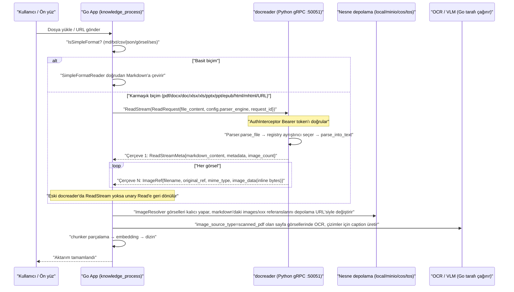
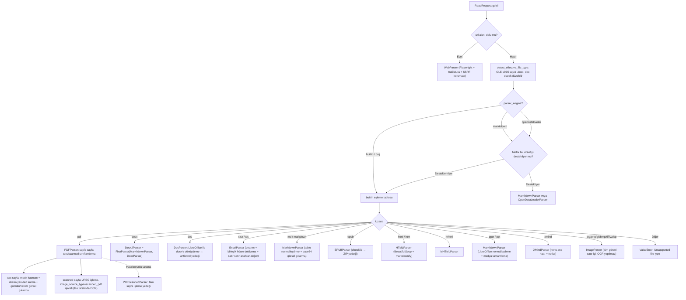

# Belge Ayrıştırma Servisi docreader

Belge ayrıştırma, yüklenen dosyaları aranabilir metne dönüştürür ve özgün görsel referanslarını çıkarır. Rethra birçok biçimi destekler ve ayrıştırma motoru dosya türüne göre seçilebilir; taranmış belgeler, görseller ve ses dosyaları için ayrıca uygun görsel veya konuşma modelleri gerekir.

Desteklenen biçimler:

| Kategori | Biçim |
| --- | --- |
| Belge | PDF, Word (doc/docx), PPT (ppt/pptx), Excel (xls/xlsx), EPUB, XMind |
| Metin | txt, Markdown, CSV, JSON |
| Web | Çevrimiçi URL çekme, yerel HTML / MHTML arşivleri |
| Görsel | jpg, png, gif, bmp, tiff, webp (içeriğin anlaşılması için görsel model yapılandırılmalıdır) |
| Ses | mp3, wav, m4a, flac, ogg (konuşma tanıma modeli yapılandırılmalıdır) |

Ayrıştırma sonucu tatmin edici değilse şunları ayarlayabilirsiniz:

- **PDF düzeni kötü geri kuruluyor, tablolar kayıyor**: Bilgi tabanının ayrıştırma ayarlarında `pdf` için başka bir ayrıştırma motoru seçin (MarkItDown / OpenDataLoader / MinerU);
- **Taranmış belgede metin tanınmadı**: Görsel modelin yapılandırıldığından emin olun, gerekirse taranmış belge modunu zorlayın;
- **Excel'in ilk satırı sütun adı olduğu halde veri olarak işleniyor**: `xlsx`/`xls` için "İlk satırı başlık olarak kullan" seçeneğini açın;
- **Parça içeriğinin düzeltilmesi gerekiyor**: Parça listesinde metni düzenleyin; bkz. [Bilgi Tabanı ve Bilgi Yönetimi](02-knowledge-base.md#parcalari-duzenleme-ve-meta-veri-ekleme).

## Ayrıştırma Mekanizması ve Yapılandırma Başvurusu

docreader, dosyaları veya URL'leri Markdown'a ve özgün görsel referanslarına dönüştüren bağımsız bir Python gRPC servisidir. Ardından Go ana servisi parçalama, görsel depolama, OCR, görsel açıklaması ve vektörleştirme işlemlerini tamamlar.

Ayrıştırma servisi ile sonraki işlemlerin sorumlulukları `docreader/parser/base_parser.py` içinde tanımlanır:

```python
class BaseParser(ABC):
    """Base parser interface.

    After the lightweight refactoring, BaseParser only extracts markdown text
    and raw image references from documents. Chunking, image storage, OCR,
    and VLM caption are handled by the Go App module.
    """
```

### Servisin Konumu ve Dış Arayüzü {#servisin-konumu-ve-dis-arayuzu}

#### Arayüz Protokolü: Yalnızca gRPC (HTTP Yok) {#arayuz-protokolu-yalnizca-grpc-http-yok}

Servis girişi `docreader/main.py` dosyasıdır ve yalnızca bir gRPC sunucusu başlatır (`grpc.server` + `ThreadPoolExecutor`). Varsayılan olarak `50051` portunu dinler ve K8s / Docker canlılık denetimi için standart gRPC Health servisini (`grpc_health.v1`) de kaydeder (imajdaki `grpc_health_probe` ikili dosyasıyla birlikte). **Hiçbir HTTP arayüzü yoktur**.

Proto tanımı `docreader/proto/docreader.proto` içindedir ve toplam 3 RPC içerir:

```protobuf
service DocReader {
  rpc Read(ReadRequest) returns (ReadResponse) {}
  // Akış sürümü: önce 1 meta çerçevesi (markdown/metadata/error), ardından her çerçevede 1 görsel gönderilir.
  // Büyük taranmış PDF'lerin (yüzlerce sayfa görsel) unary mesaj boyutu sınırına (RESOURCE_EXHAUSTED) takılmasını önler.
  rpc ReadStream(ReadRequest) returns (stream ReadStreamResponse) {}
  rpc ListEngines(ListEnginesRequest) returns (ListEnginesResponse) {}
}
```

`ReadRequest` birleşik istektir: `file_content`/`file_name`/`file_type` ayarlanırsa dosya modu, `url`/`title` ayarlanırsa URL modu kullanılır. `config.parser_engine` motoru belirtir (`builtin` / `markitdown` / `opendataloader`), `config.parser_engine_overrides` ise motor düzeyinde geçersiz kılma parametrelerini taşır (ör. `pdf_force_scanned`, `odl_hybrid`).

`ReadResponse`, `markdown_content` + `repeated ImageRef image_refs` döndürür (görseller **inline bytes** olarak satır içinde döner, `image_dir_path` her zaman boş dizedir; görsellerin kalıcı saklanması tamamen Go App'in sorumluluğundadır ve proto'daki eski `image_storage` alanı 3 `reserved` yapılmıştır). İsteğe bağlı olarak `repeated SourceBlock source_blocks` da döner: `markdown_content` içindeki bir bölümü (Unicode kod noktası ofsetleri `start`/`end`) özgün dosyadaki konuma (`locator_json`) eşler ve alıntı konumlandırmada kullanılır; bkz. [Özgün konum](#source-locators). `ReadStreamMeta` aynı alanları taşır.

`ReadStream`'in değeri (bkz. `main.py::ReadStream` ve `_iter_image_refs`): her çerçeve bağımsız ve küçüktür; sunucu base64'ü çözerken `images.pop(ref_path)` ile kaynak veriyi serbest bırakır, böylece iki tarafın da tüm görselleri aynı anda tutması gerekmez. Bu, büyük taranmış PDF'lerde tepe bellek ve mesaj boyutu sorunlarını çözer. Go tarafındaki `internal/infrastructure/docparser/grpc_parser.go` öncelikle `ReadStream` çağırır; eski docreader sürümleri `Unimplemented` döndürürse otomatik olarak unary `Read`'e geri döner.

`ListEngines` geriye dönük uyumluluk için korunur. Yorumlar, motor listesinin artık Go tarafında `internal/infrastructure/docparser/engine_registry.go` (`docparser.ListAllEngines`) tarafından yönetildiğini açıkça belirtir; Go App bu RPC'yi artık çağırmaz ve MinerU gibi uzak motorlar Go tarafından yerel olarak işlenir.

#### Kimlik Doğrulama ve TLS (auth.py) {#kimlik-dogrulama-ve-tls-auth-py}

`docreader/auth.py` iki katmanlı güvenlik mekanizması sağlar; ikisi de ortam değişkenleriyle açılır:

**Token kimlik doğrulaması (`AuthInterceptor`)**: `GRPC_AUTH_TOKEN` ayarlandığında etkinleşir. İstemci metadata içinde `authorization: Bearer <token>` (veya çıplak token) göndermelidir. Doğrulama, zamanlama saldırılarını önlemek için `hmac.compare_digest` kullanır; token 16 bayttan kısaysa uyarı yazılır. İki sağlık denetimi yöntemi (`/grpc.health.v1.Health/Check`, `/Watch`) kimlik doğrulamadan önce geçirilir, böylece canlılık denetimi etkilenmez. Kimlik doğrulama başarısız olduğunda `_make_abort_handler`, özgün RPC türüne (unary/stream) uygun bir abort handler oluşturur ve çatının `INTERNAL` fırlatmasına izin vermek yerine `UNAUTHENTICATED` döndürür.

**TLS / mTLS (`load_tls_credentials`)**: `GRPC_TLS_ENABLED=true` olduğunda `GRPC_TLS_CERT` / `GRPC_TLS_KEY` zorunludur, `GRPC_TLS_CA` isteğe bağlıdır. `GRPC_MTLS_REQUIRE_CLIENT_CERT=true` istemci sertifikasını zorunlu kılar (ayarlanmamışsa `GRPC_TLS_CA` bulunup bulunmadığına göre otomatik karar verilir). Herhangi bir TLS yapılandırması eksikse veya yüklenemezse `TLSConfigError` fırlatılır; `main()` bunu yakalayıp `sys.exit(1)` ile **hızlıca başarısız olur ve sessizce düz metne düşmeyi reddeder**.

Go tarafındaki istemci `docreader/client/auth.go` içindedir (`LoadAuthConfigFromEnv` aynı adlı `GRPC_TLS_ENABLED/CERT/KEY/CA/SERVER_NAME` ve `GRPC_AUTH_TOKEN` ortam değişkenlerini okur). `docreader/client/client.go` içindeki `NewClient`, round_robin yük dengelemeli ve `MAX_FILE_SIZE_MB` mesaj sınırlı bir bağlantı kurar.

#### Ana Servisle Etkileşim Sırası {#ana-servisle-etkilesim-sirasi}

Go App'teki `internal/application/service/knowledge_process.go`, belge aktarım hattının docreader aşamasında ayrıştırmayı çağırır (zaman aşımı `docreader_call_timeout` yapılandırmasıyla denetlenir; böylece takılan bir docreader worker'ı uzun süre meşgul etmez). Dikkat: **md/markdown/txt/csv/json/görsel/ses dosyaları Go tarafındaki `SimpleFormatReader` ile yerel olarak işlenir ve docreader'dan geçmez** (bkz. `internal/infrastructure/docparser/builtin_converter.go` içindeki `simpleFormats`).



---

### Ayrıştırıcı Kaydı ve Yönlendirme Mekanizması {#ayristirici-kaydi-ve-yonlendirme-mekanizmasi}

#### Motor Kayıt Defteri (parser/registry.py) {#motor-kayit-defteri-parser-registry-py}

`ParserEngineRegistry`, `motor adı → {dosya uzantısı → ayrıştırıcı sınıfı}` biçiminde iki düzeyli bir eşleme tutar ve her motorun bir `check_available` yoklayıcısı kaydetmesini destekler (`ListEngines` ile kullanılabilirliği ve kullanılamama nedenini bildirmek için).

`_build_default_registry()` üç motor kaydeder:

| Motor | Dosya türü | Açıklama |
| --- | --- | --- |
| `builtin` | `docx`(Docx2Parser), `doc`(DocParser), `pdf`(PDFParser), `md`/`markdown`(MarkdownParser), `xlsx`/`xls`(ExcelParser), `pptx`/`ppt`(MarkitdownParser), `epub`(EPUBParser), `html`/`htm`(HTMLParser), `mhtml`(MHTMLParser), `xmind`(XMindParser), `jpg`/`jpeg`/`png`/`gif`/`bmp`/`tiff`/`webp`(ImageParser) | Yerleşik ayrıştırma motoru; PPT/PPTX için MarkItDown ayrıştırıcısı yeniden kullanılır |
| `markitdown` | `md`, `markdown`, `pdf`, `docx`, `doc`, `pptx`, `ppt`, `xlsx`, `xls`, `csv` (tümü MarkitdownParser) | Microsoft MarkItDown kütüphanesi |
| `opendataloader` | `pdf`(OpenDataLoaderParser) | OpenDataLoader PDF sayfa düzeni analizi, Java 11+ gerekir; `check_available` java'yı, Python paketlerini ve hybrid servis sağlığını yoklar |

Yönlendirme kuralı (`get_parser_class`): İstekte belirtilen motor bu dosya türünü desteklemiyorsa **otomatik olarak `builtin` motoruna geri dönülür**; builtin de desteklemiyorsa `ValueError("Unsupported file type")` fırlatılır.

#### Cephe ve Dosya Sihirli Sayısıyla Tür Düzeltme (parser/parser.py) {#cephe-ve-dosya-sihirli-sayisiyla-tur-duzeltme-parser-parser-py}

`Parser` bir cephe (facade) sınıfıdır: `parse_file()` kayıt defterini kullanır, `parse_url()` ise her zaman `WebParser` kullanır. Önemli savunmalardan biri `detect_effective_file_type()` işlevidir: OOXML `.docx` aslında bir ZIP kapsayıcısıdır, eski `.doc` ise bir OLE Compound File'dır. WPS/Word, `.doc` dosyasının `.docx` olarak yeniden adlandırılmasını tolere eder; bu yüzden OLE sihirli sayısıyla (`b"\xd0\xcf\x11\xe0\xa1\xb1\x1a\xe1"`) başlayan "docx" dosyaları zorla DOC ayrıştırıcısına yönlendirilir ve ikili OLE verisi DOCX ayrıştırıcısına verilmez.

Motor geçersiz kılma parametreleri `engine_overrides` (proto'daki `parser_engine_overrides` alanından gelir) ayrıştırıcı kurucusuna `**kwargs` olarak geçirilir; örneğin `pdf_force_scanned` değeri `PDFParser.__init__` tarafından yakalanır.

#### Zincir Ayrıştırıcılar (parser/chain_parser.py) {#zincir-ayristiricilar-parser-chain-parser-py}

İki "sorumluluk zinciri" birleştiricisi vardır; ikisi de sınıf fabrikası `create(*parser_classes)` ile alt sınıfları dinamik olarak üretir:

- **`FirstParser`**: Birden çok ayrıştırıcıyı sırayla dener ve `document.is_valid()` (yani `content != ""`) sonucunu ilk üreteni döndürür; istisnalar yakalanır ve bir sonraki denenir. Tipik kullanım: `Docx2Parser = FirstParser.create(MarkitdownParser, DocxParser)`.
- **`PipelineParser`**: İşlem hattıdır; her ayrıştırıcının çıktı metni (yeniden bytes olarak kodlanır) bir sonrakinin girdisi olur ve her aşamada üretilen `images`/`metadata` biriktirilerek birleştirilir. Tipik kullanım: `MarkdownParser = PipelineParser.create(MarkdownTableFormatter, MarkdownImageBase64)`, `WebParser = PipelineParser.create(StdWebParser, MarkdownParser)`, `MarkitdownParser = PipelineParser.create(StdMarkitdownParser, MarkdownParser)`.

#### Eşzamanlılık Modeli (parser/concurrency.py ve diğer yerler) {#eszamanlilik-modeli-parser-concurrency-py-ve-diger-yerler}

Eşzamanlılık denetimi dört katmandan oluşur:

1. **gRPC iş parçacığı havuzu**: `ThreadPoolExecutor(max_workers=CONFIG.grpc_max_workers)` (varsayılan 4), yani aynı anda en fazla 4 istek işlenir.
2. **Adlandırılmış semafor ile sınırlama** (`parser_worker_limit(name, max_workers)`): Süreç düzeyindeki `threading.BoundedSemaphore` ada göre yeniden kullanılır ve ağır arka uçların eşzamanlılığını sınırlar. Mevcut sınırlama noktaları: `"markitdown"` (varsayılan 1), `"opendataloader"` (varsayılan 1; her convert bir JVM başlatır), `"pdf_render"` (varsayılan 1). `max_workers <= 0` olduğunda sınırlama yapılmaz.
3. **pdfium genel kilidi** (`pdf_parser.py::_PDFIUM_LOCK`): pdfium C kütüphanesi süreç genelindedir ve **iş parçacığı güvenli değildir**; iki gRPC worker aynı anda PDF ayrıştırırsa paylaşılan durum bozulabilir, hatta tüm süreç kilitlenebilir (isteklerin "Parsing document with PDFParser" adımında kalıcı olarak takıldığı gözlemlenmiştir). Bu yüzden **tüm pdfium işlemleri (metin çıkarma, sayfa işleme, görsel çıkarma) bu genel kilidin arkasında sıralı yürütülür** ve eşzamanlı PDF yüklemeleri sıraya alınır; PDF dışı ayrıştırıcılar etkilenmez.
4. **Süreç düzeyinde paralellik**:
   - PDF taranmış sayfa işleme: `_render_pages_parallel`, `ProcessPoolExecutor` kullanarak (çok iş parçacıklı süreçte fork riskinden kaçınmak için öncelikle `forkserver` başlatma yöntemiyle) tek bir PDF'in taranmış sayfalarını birden çok worker sürecine böler (her süreç geçici dosyadan kendi `PdfDocument` nesnesini açar). Paralellik derecesi `DOCREADER_PDF_RENDER_PARALLELISM` ile belirlenir (varsayılan `min(4, cpu)`). CPU sınırlı konteynerlerde "büyük taranmış belgenin işlenmesi 1 saati aşıyor" sorununu azaltmanın ana yolu budur; hata olursa şeffaf biçimde sıralı işlemeye geri döner.
   - DOCX sayfa bazında paralellik: `docx_parser.py::Docx` sayfa görevlerini `ProcessPoolExecutor` + `Manager` paylaşılan listesine dağıtır; görseller `/tmp/docx_img_*` geçici dosyalarıyla süreçler arasında aktarılır ve sonunda ana süreçte topluca kodlanıp yüklenir.
   - LibreOffice dönüştürme (doc→docx, ppt→pptx, xls→xlsx): `subprocess` ile `soffice --headless` çağrılır; eşzamanlı soffice süreçlerinin kullanıcı profili kilidi için yarışıp sessizce başarısız olmasını önlemek amacıyla her denemede ayrı bir `-env:UserInstallation=<geçici profil>` kullanılır; hata durumunda geri çekilmeli olarak 3 kez yeniden denenir.

---

### Ayrıştırıcıların Tek Tek Ayrıntıları {#ayristiricilarin-tek-tek-ayrintilari}

#### pdf_parser.py — PDFParser / PDFScannedParser (builtin motorunun PDF ayrıştırıcısı) {#pdf-parser-py-pdfparser-pdfscannedparser-builtin-motorunun-pdf-ayristiricisi}

**Bağımlılıklar**: `pypdfium2` (+ Pillow). Hiçbir harici servis (MinerU / Docling vb.) gerekmez; docreader kendisi OCR yapmaz.

**Temel tasarım: sayfa bazında yönlendirme (per-page routing)**. Her sayfa bağımsız olarak `"text"` veya `"scanned"` olarak sınıflandırılır (`_classify_page`). Ana sinyal **görsel alanı kaplama oranıdır** (sayfadaki image nesnelerinin sınırlayıcı kutu alanı / sayfa alanı, eşik `DOCREADER_PDF_SCAN_IMAGE_RATIO=0.5`): taranmış sayfa özünde tüm sayfayı kaplayan büyük bir görseldir, (çoğu zaman düşük kaliteli) gömülü bir OCR metin katmanı olsa bile. İkincil sinyal, metin katmanındaki karakter sayısının `DOCREADER_PDF_SCAN_MIN_CHARS` (10) değerinden az olması ve belirli miktarda görsel içerik bulunmasıdır. Bu tasarım MinerU / Docling / DeepDoc'un yönlendirme yaklaşımıyla uyumludur ve kalitesiz metin katmanına güvenip bozuk RAG içeriği üretmeyi önler.

İşlem akışı (`_route_locked`, üç geçiş):

1. **Geçiş 1 metin çıkarma + sınıflandırma**: text sayfaları metin katmanını kullanır. `DOCREADER_PDF_LAYOUT_ORDERING=true` (varsayılan) ise ve pdfium düz metni "iyi biçimli" değilse (`_plain_is_well_formed`) **geometrik düzen yeniden kurulumu** yapılır: glyph düzeyinde çıkarma (gizli metin render-mode 3 ve sayfa dışı glifler filtrelenir; gizli metinle prompt injection önlenir), XY-cut ile özyinelemeli sütun bölme (çok sütunlu metin sütun sütun doğrusallaştırılır), kenar çubuğu/dikey filigran sütunlarının çıkarılması (arXiv kenar çubuğu), karakter aralığına göre sözcük arası boşluk çıkarımı (`WORD_GAP_WIDTH_RATIO`), satır yüksekliğinin sayfa medyanına göre büyük yazı tipli satırları Markdown başlığına yükseltme (`DETECT_HEADINGS`). Yeniden kurulum sonucu dağınık görünürse (`_should_prefer_plain` sezgiselleri) düz metne geri dönülür. Ardından `_postprocess_pdf_text` temizlik yapar: U+FFFE gibi yer tutucular, arXiv filigran satırları, sayfa numarası satırları, vektör grafiklerden metin katmanına sızan eksen/açıklama kırıntıları (`STRIP_CHART_TEXT_DEBRIS`). text sayfasında `Figure N` başlığı algılanırsa başlığın üstündeki **vektör şekil alanı JPEG olarak işlenir** (`RENDER_VECTOR_FIGURES`) ve `` olarak başlığın önüne eklenir.
2. **Geçiş 2 taranmış sayfa işleme**: Yalnızca scanned sayfalar JPEG olarak işlenir (DPI `DOCREADER_PDF_RENDER_DPI=200`, kalite `DOCREADER_PDF_JPEG_QUALITY=85`, uzun kenar sınırı `DOCREADER_PDF_RENDER_MAX_EDGE=2000` px; çok büyük sayfa kutusu bildiren PDF'lerin 100+ MP görsel üretip gRPC sınırına takılmasını önler). Markdown'da `` yer tutucusu kullanılır, metadata `image_source_type=scanned_pdf` olarak işaretlenir ve **bu sayfa görsellerinde OCR'ı Go App yapar** (Go tarafındaki `image_multimodal.go`, `scanned_pdf` kaynağı için özel bir `ocr_prompt` kullanır).
3. **Geçiş 3 gömülü görsel çıkarma**: text sayfalarındaki gömülü çizimler/grafikler çıkarılır (`EXTRACT_EMBEDDED_IMAGES`). En küçük piksel (80), en küçük sayfa alanı oranı (%1), sayfalar arası tekrar oranı (aynı MD5 text sayfalarının ≥%50'sinde görünüyorsa logo/filigran sayılıp çıkarılır) ve belge başına üst sınır (50 adet) ile filtrelenir; sayfa içinde yukarıdan aşağı sırayla markdown'a eklenir.

Ayrıca `_strip_repeating_lines` sayfalar arasında tekrarlanan üst ve alt bilgileri temkinli biçimde çıkarır (adaylar yalnızca her sayfanın ilk ve son satırlarıdır; kısa olmalı ve text sayfalarının ≥%60'ında görünmelidir).

Herhangi bir istisnada **`PDFScannedParser`** kullanılır: her sayfayı JPEG olarak işleyen yedek ayrıştırıcıdır (`pdf_force_scanned` zorunlu taranmış modu için de kullanılır; yükleme başına override veya `DOCREADER_PDF_FORCE_SCANNED` ile açılabilir).

**Çıktılar**: Markdown (text sayfası metni + görsel yer tutucuları), `images` sözlüğü, metadata (`page_count`/`scanned_page_count`/`text_page_count`/`embedded_image_count`/`vector_figure_count`/`image_source_type`).

**Sınırlamalar**: Tablo yapısı tanıma yapılmaz (metin katmanındaki tablolar satır satır çıkar); başlık tanıma yazı tipi boyutu sezgiseline dayanır; taranmış sayfa metni tamamen Go tarafındaki OCR'a bağlıdır.

#### doc_parser.py — DocParser (.doc eski Word) {#doc-parser-py-docparser-doc-eski-word}

`Docx2Parser` sınıfından türetilir; işlem zinciri (sırayla denenir):

1. `_parse_with_docx`: LibreOffice (`soffice --headless --convert-to docx`, ayrı profil + 3 yeniden deneme) ile DOC dosyası DOCX'e dönüştürülür, ardından üst sınıfın DOCX zinciriyle ayrıştırılır (**görsel çıkarabilen tek yol**);
2. `_parse_with_antiword`: `antiword` komut satırı aracıyla düz metin çıkarılır (`SandboxExecutor` üzerinden çalıştırılır, vekil sunucu ortam değişkenleri zorla eklenir; varsayılan `http://128.0.0.1:1` "kara delik vekili" alt sürecin beklenmedik dış bağlantılarını engeller);
3. `_parse_with_textract`: **Devre dışı** (textract'ta SSRF açığı var; kod korunmuş ama yorum satırına alınmıştır).

**Bağımlılıklar**: LibreOffice (soffice), antiword (imajda kurulu); arama yolu `LIBREOFFICE_PATH`/`ANTIWORD_PATH` ortam değişkenlerini destekler. Harici komutların varsayılan zaman aşımı 60 saniyedir; zaman aşımında tüm süreç grubu (soffice'in başlattığı alt süreçler dahil) sonlandırılır, böylece artık süreçler docreader worker'ını meşgul etmez. **Sınırlama**: LibreOffice yoksa antiword düz metnine düşülür (görsel yok, tablo yapısı yok).

#### docx2_parser.py ile docx_parser.py Arasındaki Fark {#docx2-parser-py-ile-docx-parser-py-arasindaki-fark}

- **`Docx2Parser` (kayıt defterinde docx için gerçek giriş)** yalnızca 3 satırlık çekirdek koddan oluşur: `FirstParser.create(MarkitdownParser, DocxParser)`. **Önce MarkItDown denenir** (hızlıdır, tabloları kaliteli Markdown'a çevirir); başarısız olursa veya boş içerik üretirse şirket içi `DocxParser`'a geri dönülür.
- **`DocxParser` (docx_parser.py, 1500+ satır)** şirket içinde geliştirilmiş python-docx ayrıştırıcısıdır:
  - python-docx için `load_from_xml_v2` yaması uygulanır (`target_ref` değeri `../NULL` olan bozuk ilişkiler atlanır; python-docx issue #1105'ten gelir);
  - `Docx` işleyici sınıfı sayfa sonlarını tanır (`lastRenderedPageBreak` / `w:br type="page"` / `sectPr`; 1000'den fazla paragraf içeren büyük belgelerde "sayfa başına yaklaşık 25 paragraf" sezgisel eşlemesi kullanılır) ve **sayfa bazında çok süreçli paralel** işleme yapar;
  - Paragraf paragraf metin + gömülü görseller çıkarılır (`a:blip/@r:embed` → related_part blob → PIL; <50px süsleme görselleri atlanır, >1920px olanlar küçültülür); metin/görsel özgün sırası korunur (`content_sequence`) ve görseller `_inline_upload` geri çağrısıyla base64 olarak `images/<uuid>.<ext>` biçiminde satır içine alınır;
  - Tablolar HTML `<table>` yapısına dönüştürülür (aynı metne sahip bitişik hücreler colspan olarak birleştirilir);
  - Tümüyle başarısız olursa `_parse_using_simple_method` yöntemine geri dönülür (yalnızca python-docx ile paragraflar + tablo satırları sırayla çıkarılır, görsel yok).
  - Sayfa sınırı `DOCREADER_DOCX_MAX_PAGES` (varsayılan 0 = sınırsız).

#### excel_parser.py ve Üç Yardımcı Modül (.xlsx / .xls) {#excel-parser-py-ve-uc-yardimci-modul-xlsx-xls}

**`ExcelParser`** pandas tabanlıdır: her sayfayı DataFrame olarak okur, tamamen boş satırları siler, **her satırı `sütun adı: değer,sütun adı: değer` biçiminde anahtar-değer metnine dönüştürür** ve her satır için bir `Chunk` üretir (start/end konumlarını taşır). WPS `=DISPIMG("ID",mode)` ve Office 365 `=_xlfn.IMAGE(...)` gibi gömülü görsel işlev dizelerini çıkarır (`_IMAGE_FUNC_RE`). Görsel çıkarmaz.

**Başlık modu**: XLSX ve eski XLS davranışı birleştirilmiştir. Varsayılan olarak 1. satır veri olarak işlenir ve sütun adları `A`/`B`/`C` harfleriyle verilir (veri satırının yanlışlıkla başlık sayılıp kaybolmasını önler). Tablo gerçekten "ilk satırı sütun adı" olan düz bir tabloysa ayrıştırma motoru kuralı üzerinden `xlsx_first_row_as_header` açılabilir: bu durumda ilk satır sütun etiketine yükselir ve anahtar-değer metni `Ad: Ahmet,Bölüm: Ar-Ge` gibi anlamlı bir biçim alır. Boş hücreler veya görsel işlev değerleri sütun harfine geri döner; aynı adlı etiketlere benzersizlik için otomatik olarak `_2`, `_3` sonekleri eklenir.

Bu anahtar KB'nin `parser_engine_rules[].xlsx_first_row_as_header` alanıyla yapılandırılır (yükleme onay penceresinde her yükleme için ayrıca geçersiz kılınabilir). Arka uçtaki `applyParserRuleOverrides()` yalnızca `xlsx`/`xls` için ve motoru `builtin` (veya boş) olan kurallarda geçerlidir; sonuç `parser_engine_overrides` olarak docreader'a iletilir. Alan türü `*bool`'dur: `null` ayrıştırıcı varsayılanının kullanılacağı, açık `false` ise kapalı olduğu anlamına gelir.

Üç yardımcı modül gerçek hayattaki kirli dosyaları ele alır:

- **`excel_convert.py`**: Sihirli sayı/`inspect_excel_format` ile gerçek biçimi (xlsx/xls/xlsb/ods) algılar ve her biçim için pandas engine seçer (`xlrd`/`openpyxl`/`odf`). Tanınamayan durumlarda (ör. WPS `.et`, yeniden adlandırılmış csv) LibreOffice `convert-to xlsx` ile normalleştirir (`normalize_excel_bytes` sırasıyla `.xlsx/.xls/.et/.csv` soneklerini dener).
- **`xlsx_merge.py`**: `fill_merged_cells_xlsx` birleştirilmiş hücreleri çözer ve sol üst ana değeri **kapladığı alandaki her hücreye kopyalar**. openpyxl değeri yalnızca sol üstte tutar, pandas diğerlerini NaN olarak okur; doldurmadan sonra satır bazında bölünen RAG parçaları bağlamı koruyabilir.
- **`xlsx_repair.py`**: Yaygın XLSX paketleme sorunlarını onarır. `sharedStrings.xml` yolunun büyük/küçük harfi veya konumu standart dışıysa yeniden adlandırıp yerine koyar; manifest sharedStrings'e başvurduğu halde paket içinde yoksa ve çalışma sayfaları yalnızca inline string kullanıyorsa, openpyxl'in okuyabilmesi için başvuruyu `[Content_Types].xml` ve workbook rels içinden çıkarır.

XLSX okunmadan önce her zaman `repair → fill_merged_cells` ön işlemesinden geçer ve kararlı sütun adları olarak `header=None` + A/B/C sütun harfleri kullanılır (xls'de önce ilk satır başlık olarak denenir, `Unnamed:` sütunu görülürse sütun harflerine dönülür).

#### ppt_convert.py / pptx_media.py (.ppt / .pptx, markitdown motoruna hizmet eder) {#ppt-convert-py-pptx-media-py-ppt-pptx-markitdown-motoruna-hizmet-eder}

PPT ailesinin **bağımsız bir ayrıştırıcısı yoktur**; `MarkitdownParser` tarafından işlenir ve bu iki modül onun ön ve son işlem yardımcılarıdır:

- **`ppt_convert.py`**: `normalize_ppt_bytes` sihirli sayıya göre karar verir (ZIP=pptx doğrudan geçer; OLE=eski ppt ise LibreOffice `convert-to pptx`, ayrı profil + 3 yeniden deneme). LibreOffice yoksa .ppt için doğrudan hata fırlatır ve kurulum önerir.
- **`pptx_media.py`**: MarkItDown'ın satır içine alamadığı PPTX medyaları (özellikle WMF/EMF/SVG vektör görselleri) için çözümdür. `ppt/media/` altındaki tüm kaynakları açar, sırayla Pillow (bit eşlem) veya ImageMagick `convert` (vektör; her biçim için yedek) ile PNG'ye dönüştürür, ardından markdown'daki çözülmemiş `` başvurularını sırayla `images/<uuid>.png` ile değiştirir ve görsel verisini satır içine alır.

#### image_parser.py — ImageParser (bağımsız görsel dosyaları) {#image-parser-py-imageparser-bagimsiz-gorsel-dosyalari}

En basit ayrıştırıcıdır (29 satır): **Hiç OCR yapmaz**. Tüm görseli base64 olarak `Document.images` içine alır; metin gövdesi yalnızca tek satırdır: ``. **OCR motoru Go tarafındadır**: docreader'ın Dockerfile yorumu "OCR/PaddleOCR ile ilgili bağımlılıklar kaldırıldı" diye açıkça belirtir. Go tarafı `internal/infrastructure/docparser/paddleocr_vl_converter.go` / `paddleocr_vl_cloud_converter.go` (PaddleOCR-VL) ve `image_multimodal.go` ile OCR ve caption işlerini yapar. Ayrıca Go'nun `simpleFormats` listesi görsel biçimlerini zaten Go tarafında yerel işlemeye almıştır; docreader'daki ImageParser esas olarak gRPC'yi doğrudan çağıran SDK senaryolarına hizmet eder.

#### markdown_parser.py — MarkdownParser (.md / .markdown) {#_3-7-markdown-parser-py-—-markdownparser-md-markdown}

`PipelineParser.create(MarkdownTableFormatter, MarkdownImageBase64)`:

- **`MarkdownTableFormatter`**: Kodlamayı otomatik algıladıktan sonra (`endecode.decode_bytes`: utf-8 → gb18030 → gb2312 → gbk → big5 → ascii → latin-1) tabloları normalleştirir. `| cell |` aralıklarını ve hizalama işaretlerini birleştirir, `normalize_spurious_table_prefixes` MarkItDown'ın ürettiği sahte boş satır/ayraç satırı öneklerini düzeltir ve başlıksız Word tablolarına `| --- |` GFM ayraç satırı ekler.
- **`MarkdownImageBase64`**: `` gömülü görsellerini `images/<uuid>.<ext>` başvurusu + `Document.images` verisi olarak çıkarır (MIME alt türü `x-emf` gibi tireli biçimleri destekler). Çözülemeyen görseller (ör. base64'ten hemen sonra Çince görsel başlığı gelmesi) atlanır ve günlüğe yazılır; tüm belgenin ayrıştırılması başarısız olmaz.

Bu ayrıştırıcı aynı zamanda MarkitdownParser / WebParser işlem hatlarının ortak son işlem aşamasıdır.

#### web_parser.py — WebParser (URL modu) {#web-parser-py-webparser-url-modu}

`PipelineParser.create(StdWebParser, MarkdownParser)`. `StdWebParser`, sayfayı **Playwright (WebKit çekirdeği)** ile işler ve **trafilatura** ile ana metni çıkarıp Markdown'a dönüştürür:

- **Çift SSRF koruması**: Gezinmeden önce `is_ssrf_safe_url(url)` ile doğrulanır; ardından `page.route("**/*")` ile bir yönlendirme koruyucusu kurulur ve **her alt istek ile yönlendirme hedefi** aynı şekilde doğrulanır (`utils/ssrf.py`, Go tarafındaki `internal/utils/security.go` politikasını yansıtır: iç ağ/geri döngü/link-local/bulut metadata alan adları, `.local`/`.internal` gibi sonekler, doğrudan IP, IP benzeri ana makine adları, DNS çözümlemesinden çıkan kısıtlı IP'ler ve tehlikeli portlar engellenir; `SSRF_WHITELIST` / `SSRF_WHITELIST_EXTRA` ortam değişkenleriyle izin verilir).
- **SPA desteği**: `domcontentloaded` sonrasında networkidle (10 sn) beklenir ve `#app`/`main`/body içinde görünür metnin ≥80 karakter olması beklenir (15 sn); böylece JS ile işlenen sayfalara uyum sağlanır.
- **WeChat resmi hesap uyumu**: trafilatura'nın iç `utils.IMAGE_EXTENSION` değeri (uzantısız `mmbiz.qpic.cn/...wx_fmt=` görsellerini tanımak için) ve `xpaths.BODY_XPATH` değeri (`#js_content` / `.rich_media_content` öncelikli) monkey-patch ile değiştirilir.
- **Geri dönüş**: trafilatura ana metni çıkaramazsa Playwright görünür metni (≥50 karakter) + sayfa title değeri yedek olarak kullanılır.
- Vekil sunucu olarak `DOCREADER_EXTERNAL_HTTPS_PROXY` kullanılır. metadata içinde `title` çıkarılır.

#### mhtml_parser.py — MHTMLParser (.mhtml web arşivi) {#mhtml-parser-py-mhtmlparser-mhtml-web-arsivi}

MIME yapısı standart kütüphanedeki `email` ile ayrıştırılır: tüm `text/html` parçaları toplanır ve ana metin olarak **reklam olmayan en büyük parça seçilir** (`googleads`/`doubleclick` gibi alan adlarından oluşan kara listeyle filtrelenir). `image/*` parçaları `images/...` olarak çıkarılır (öncelikle Content-Location dosya adı kullanılır, çakışmada `_2` soneki eklenir). `Content-Location`/`Content-ID`(`cid:`)/`X-Attachment-Id` için çeşitli yazımlarla (HTML kaçışlı, URL kodlu, basename, göreli yol urljoin) bir takma ad tablosu kurulur ve `` değerleri geri yazılır. HTML → Markdown için BeautifulSoup (script/style/noscript/iframe kaldırılır, site içi bağlantılar unwrap edilir) + `markdownify` kullanılır, ardından kod çiti farkındalıklı boş satır normalleştirmesi yapılır. Hepsi başarısız olursa ```` ```html ```` kod bloğuna düşülür. metadata: `source_format=mhtml`, `file_size`, `image_count`.

#### html_parser.py — HTMLParser (.html / .htm statik web sayfası dosyaları) {#html-parser-py-htmlparser-html-htm-statik-web-sayfasi-dosyalari}

Kullanıcının doğrudan yüklediği HTML dosyaları bu yoldan geçer ve `parse_url()` ile yapılan çevrimiçi taramadan ayrıdır: `HTMLParser = PipelineParser.create(HTMLToMarkdownParser, MarkdownParser)`.

- `HTMLToMarkdownParser` önce ham baytları `BeautifulSoup(content, "lxml")` ile çözer; önce BOM'a ve HTML içindeki charset bildirimine bakar, ardından ortak Markdown dönüşümüne devreder;
- HTML → Markdown için `MHTMLParser.html_to_markdown()` yeniden kullanılır, ancak `extract_images=False` (yerel HTML dosyasında çıkarılacak MIME eki yoktur), `strip_internal_links=False` (site içi bağlantılar korunur) ve `fallback_to_raw_html=False` (dönüşüm içerik üretmezse koca bir ```` ```html ```` bloğu yerine boş döner) parametreleriyle;
- Metin içinde `` ile başvurulan uzak görseller Go tarafında tamamlanır: `internal/infrastructure/docparser/image_resolver.go` bu uzak görselleri SSRF denetimiyle indirip nesne depolamaya aktarır, ardından başvuruları yeniden yazar; böylece yerel olarak yüklenen görsellerle aynı OCR / caption akışından geçerler.

#### xmind_parser.py — XMindParser (.xmind zihin haritası)

XMind arşivindeki `content.json` (yeni sürüm) veya `content.xml` (eski sürüm) okunur; tek bir içerik dosyası için üst sınır 32 MiB'dir. Her tuval bir `# Tuval başlığı` bölümü olarak çıkar, konu hiyerarşisi girintili Markdown listesine dönüştürülür, düz metin notlar ilgili konunun altına alıntı bloğu olarak eklenir ve tuvaller arasında `---` ayırıcısı kullanılır. Görsel çıkarılmaz; işlenecek konu yoksa ayrıştırma başarısız olur.

#### epub_parser.py — EPUBParser (.epub e-kitap) {#epub-parser-py-epubparser-epub-e-kitap}

Ana yol **ebooklib** kullanır (geçici dosya üzerinden okunur): DC meta verileri (title/author/publisher/language/description/date/isbn) çıkarılır, bölümler öncelikle TOC sırasına göre tek tek işlenir (her bölümde ilk h1/h2 bölüm başlığı olarak alınır, `## Bölüm başlığı` + markdownify ile dönüştürülmüş metin üretilir), tüm `ITEM_IMAGE` öğeleri `images/<uuid>.<ext>` olarak çıkarılır ve yolun birden çok varyantından oluşan takma adlarla `` geri yazılır; EPUB iç bağlantıları (bölümler arası geçişler, `#fragment`) unwrap edilerek yalnızca metin bırakılır. ebooklib başarısız olursa **ZIP'ten doğrudan okuma** yedeğine geçilir: html/xhtml dosyaları `chapter(\d+)` ile sıralanıp tek tek dönüştürülür. metadata `chapter_count`/`image_count` içerir.

#### markitdown_parser.py — MarkitdownParser (markitdown motoru) {#markitdown-parser-py-markitdownparser-markitdown-motoru}

`PipelineParser.create(StdMarkitdownParser, MarkdownParser)`. `StdMarkitdownParser`, Microsoft'un **MarkItDown** kütüphanesini (`markitdown[docx,pdf,xls,xlsx]`) sarmalar: ppt/pptx önce `normalize_ppt_bytes` ile normalleştirilir; önce `keep_data_uris=True` ile dönüştürülür (görseller data URI olarak kalır ve sonraki `MarkdownImageBase64` adımında çıkarılır), başarısız olursa `keep_data_uris=False` ile yeniden denenir; pptx dönüşümünden sonra markdown'da hâlâ çözülmemiş görsel başvuruları varsa eksik görselleri eklemek için `attach_pptx_media_to_markdown` çağrılır. Tamamı `parser_worker_limit("markitdown", DOCREADER_MARKITDOWN_MAX_WORKERS=1)` ile sınırlandırılır. **Sınırlamalar**: MarkItDown PDF için pdfminer metin çıkarımını kullanır, taranmış belgelerle başa çıkamaz (`parse_local.py --scanned` yorumunda pdfminer'ın takılabileceği de belirtilir); tablo/sayfa düzeni geri kazanımı builtin PDF yolundan zayıftır.

#### opendataloader_parser.py — OpenDataLoaderParser (opendataloader motoru, yalnızca PDF) {#opendataloader-parser-py-opendataloaderparser-opendataloader-motoru-yalnizca-pdf}

Apache-2.0 lisanslı **opendataloader-pdf**'i (Java ile yazılmış sayfa düzeni analizi) sarmalar: her `convert()` çağrısı bir JVM başlatır (`parser_worker_limit("opendataloader", 1)` ile sınırlandırılır) ve markdown + harici görsel dizini üretir; ardından çıktı ağacındaki tüm görseller toplanır, bir takma ad tablosu kurulur (köşeli parantezle sarılmış `<images/foo.png>`, HTML varlıkları, basename, `imageFileN` numara eşleştirmesi) ve markdown görsel başvuruları yeniden yazılır. **Hybrid modu** desteklenir (`DOCREADER_ODL_HYBRID=docling-fast` vb.): ayrı olarak dağıtılan `opendataloader-pdf-hybrid` HTTP hizmeti çağrılır (`DOCREADER_ODL_HYBRID_URL`, varsayılan `http://127.0.0.1:5002`, Docker tarafında karşılığı `docker/Dockerfile.odl-hybrid`); erişilebilirlik yoklaması yeniden denemelidir (hızlı yoklama 2 sn×1; ayrıştırma öncesi yoklama hizmetin soğuk başlatmasını tolere etmek için 5 sn×6). Üretilen metin 20 karakterden kısaysa başarısız sayılır ve **builtin `PDFScannedParser`'a geri düşülür**. Kullanılabilirlik denetimi: `java` PATH'te olmalı (Java 11+ gerekir, imajda openjdk-17-jre-headless kuruludur) + Python paketi kurulu olmalı + hybrid sağlıklı olmalı.

#### Ayrıştırıcı Seçim Karar Akışı {#ayristirici-secim-karar-akisi}



---

### Görsel İşleme ve Çok Kipli İş Bölümü {#gorsel-isleme-ve-cok-kipli-is-bolumu}

docreader tarafındaki görsel sözleşmesi çok basittir: her ayrıştırıcı görselleri `Document.images = {"images/<dosya adı>": "<base64>"}` olarak döndürür ve markdown metninde `` ile göreli olarak başvurur.

`main.py` içindeki iki geri dönüş yolu:

- unary `Read`: `_resolve_images()` tüm görsellerin base64'ünü çözerek `ImageRef.image_data` **satır içi baytları** olarak tek seferde döndürür (`image_dir_path` her zaman boştur; eskiden kullanılan "paylaşılan birim dizinine yazma" modeli kaldırılmıştır ve yorumda açıkça *"The Go App is solely responsible for persisting images to the configured storage backend (local/minio/cos/tos)"* yazar);
- streaming `ReadStream`: `_iter_image_refs()` görselleri tek tek yield eder ve gönderdikçe `pop` ile belleği serbest bırakır.

Go tarafı devraldıktan sonra (`internal/infrastructure/docparser/image_resolver.go`): satır içi baytlar nesne depolamaya yüklenir ve markdown'daki `images/...` başvuruları depolama URL'lerine yeniden yazılır; ardından `internal/application/service/image_multimodal.go`, metadata'daki `image_source_type` değerine göre karar verir: `scanned_pdf` tam sayfa görselleri OCR'dan geçer (özel `ocr_prompt` ile), sıradan resimler VLM caption'dan geçer. Bu hizmetin iki hattı vardır (işleme izinde `pipeline` sırasıyla `caption_ocr` / `observation_driven` olarak kaydedilir): eski hat (KB'de `image_attrs_enabled` açık değilken) her görsel için bir açıklama ve bir OCR isteği gönderir; öznitelik gözlem hattı (açıldığında) ilk turda aynı görselin "öznitelik gözlemi + açıklama" sonucuyla öznitelikleri (`contain.text` / `contain.data_visual`) belirler, ardından saf kod fonksiyonu `DecideOCR`, KB'nin `image_actions` ayarına göre görselin ayrıca OCR'a değip değmediğine karar verir; `contain.text ∈ {sparse, none}` olan, gözlemi doğrulanmış ve `data_visual == false` olan görseller varsayılan olarak yalnızca açıklamayı tutar ve OCR harcamaz. Her iki hatta da **görsel anlama Go tarafındadır**. Bilgi tabanında yapılandırılan görsel ayrıştırma özel talimatları (`vlm_config.custom_instructions`) yalnızca açıklama istemine eklenir (öznitelik gözlem hattında "öznitelik gözlemi + açıklama" istemine); OCR'ın çıktı sözleşmesini bozmamak için OCR istemine girmez (örneğin metin içermeyen görsel için `No text content` yanıtı verilmelidir).

Ayrıştırma motorlarının çıktısındaki satır içi HTML `<table>` öğeleri (MinerU, PaddleOCR-VL ve VLM OCR'da sık görülür) bölümlemeden önce topluca Markdown tablolarına dönüştürülür; birleşik hücreler gibi dönüştürülemeyen tablolar HTML olarak kalır, ancak bölümleyicinin satır sınırlarında kesebilmesi için her satır ayrı bir satıra yazılır. **docreader içinde hiçbir VLM çağrısı yoktur**; `models/read_config.py` içindeki `vlm_config`/`storage_config` alanları yalnızca eski kurucu imzasıyla uyumluluk için tutulan boş kabuklardır ("Legacy config kept for backward compatibility").

---

### Orijinal Konum (source locators) {#source-locators}

Her parça kaydedilirken orijinal dosyadaki konumunu tutan bir `source_locators` kümesiyle birlikte saklanır; sohbette bir alıntıya tıklandığında orijinal belge açılır ve ilgili kısım vurgulanır (bkz. [Oturum ve Sohbet Deneyimi](18-chat-experience.md#yanitlari-ve-kaynaklari-goruntuleme)). Konum bilgisi ayrıştırma motoruna göre ayrı ayrı üretilir, önce ortak biçimde Markdown aralığından orijinal konuma eşleme (source block) olarak ifade edilir, bölümlemeden sonra aralık kesişimiyle her parçanın locator'ı elde edilir:

| Kaynak | Üretim yöntemi | locator |
| --- | --- | --- |
| builtin PDF (`pdf_parser.py`) | Metin sayfalarında pdfium glif koordinatlarıyla sütunlara ayırıp satırlar oluşturulur, sonra satır aralığı, liste numarası ve cümle sonu kısa satırlarına göre paragraflara bölünür, her paragraf bir kutu olur; taranmış sayfalar ve gömülü görseller için yalnızca sayfa numarası kaydedilir | `pdf`: `page` + `bbox` |
| MinerU (kendi barındırılan / bulut / V1) | Dönen `content_list` okunur (`page_idx` + 0–1000 aralığında normalleştirilmiş `bbox`) ve metin üzerinden Markdown ile hizalanır; yalnızca PDF ve görseller | `pdf`: `page` + `bbox` |
| PaddleOCR-VL (kendi barındırılan / bulut) | Sayfa başına sonuçlardaki düzen blokları (`prunedResult.parsing_res_list`), düzen bloğu yoksa sayfa bazında | `pdf`: `page` (+ `bbox`) |
| Word / PPT / Excel / CSV / EPUB (herhangi bir motor) | Go tarafı orijinal dosya yapısını okur (docx gövde paragrafları ve tablolar, pptx slayt metinleri, çalışma sayfası satırları, EPUB spine bölümleri) ve ayrıştırıcının Markdown çıktısıyla metin üzerinden hizalar; belirli bir motora bağlı değildir | `docx`: `block`; `slide`: `slide`; `sheet`: `sheet` + `row_start`/`row_end`; `section`: `section` |
| builtin Excel (`excel_parser.py`) | Her satırın çalışma sayfası adı ve satır numarası doğrudan kaydedilir | `sheet` |
| Markdown / TXT (olduğu gibi aktarılır) | Paragraf bazında orijinal karakter aralığı kaydedilir | `text`: `start`/`end` |
| Ses | Konuşma tanıma segment zamanlarını döndürdüğünde döküm segment segment satırlara yazılır ve zaman kaydedilir | `time`: `start_ms`/`end_ms` |

Hizalama yalnızca harfleri ve rakamları karşılaştırır; Markdown sözdizimi, boşluk ve noktalama işaretlerinden bağımsızdır. Ayrıştırma sonucu Go tarafında ayrıca satır sonu normalleştirmesi, HTML tablo dönüşümü ve görsel adresi yeniden yazımından geçer; blokların aralıkları satır karşılaştırmasıyla son metne yeniden eşlenir. Her locator bir `quote` (alıntılanan metin, en fazla 300 karakter) taşır; ön yüz bununla işlenmiş orijinal metinde tam arama yapar ve yanıt cümlesine en çok uyan paragrafı seçer. Eski doc/ppt/xls sürümleri ve web sayfalarında yapısal konum yoktur; ön yüz metin aramasına veya orijinal web sayfasını açmaya geri döner.

### splitter/ Bölümleyici ile Go Tarafındaki chunker İlişkisi {#splitter-bolumleyici-ile-go-tarafindaki-chunker-iliskisi}

`docreader/splitter/splitter.py` içindeki `TextSplitter`, koruma kalıplarına sahip özyinelemeli bir bölümleyicidir:

- Varsayılanlar `chunk_size=512`, `chunk_overlap=80`; kod yorumunda açıkça **"Aligned with internal/infrastructure/chunker/splitter.go (DefaultChunkOverlap = 80, DefaultChunkSize = 512). The Go splitter is now the production path; this Python splitter is kept for the docreader sidecar where it's still used."** yazar; yani **üretim yolundaki bölümleme Go tarafındadır** (`internal/infrastructure/chunker/`; heading_splitter, heuristic_splitter, header_tracker vb. içerir), Python sürümü yalnızca sidecar senaryoları/yerel hata ayıklama için tutulur ve iki tarafın algoritması/varsayılanları uyumlu tutulur.
- Bölme akışı: ayırıcı önceliğine göre (`\n`, `。` (Çince tam nokta), boşluk, karakter düzeyinde yedek) özyinelemeli bölme → `protected_regex` ile bölünmemesi gereken parçaların çıkarılması (`$$...$$` matematik formülleri, `` görseller, `[](...)` bağlantılar, Markdown tablo başlığı + gövde satırları, kod bloğu başları) → `_join` ile korumalı parçaların bütünlüğünün sağlanması → `_merge` ile chunk_size/overlap'e göre birleştirilip `(start, end, text)` üçlülerinin üretilmesi (`restore_text` ile orijinal metin kayıpsız geri elde edilebilir).
- `splitter/header_hook.py` içindeki `HeaderTracker`, birleştirme sırasında Markdown tablo başlıklarını izler: yeni chunk tablo gövdesinin ortasından başlıyorsa tablo başlığını (ayırıcı satırı dahil) otomatik olarak chunk'ın başına ekler (sütun sayısı uyuşmazsa eklemez, `header_column_mismatch`; boş başlık satırında sütun adları ilk veri satırıyla tamamlanır, Go tarafındaki header_tracker ile aynı davranış), böylece RAG ile getirilen tablo parçaları sütun adı bağlamını kendileri taşır.

gRPC yanıtında artık chunks döndürülmez (`ReadResponse` içinde chunk alanı yoktur); `ExcelParser`, `Document.chunks` içine satır satır chunk koysa da ana yol yalnızca `content` alanını kullanır.

---

### Tüm Yapılandırma Seçenekleri {#tum-yapilandirma-secenekleri}

#### config.py (`DocReaderConfig`, başlangıçta geçerli değerleri yazdırır) {#config-py-docreaderconfig-baslangicta-gecerli-degerleri-yazdirir}

| Ortam değişkeni (takma ad) | Varsayılan | Açıklama |
| --- | --- | --- |
| `DOCREADER_GRPC_MAX_WORKERS` (`GRPC_MAX_WORKERS`) | 4 | gRPC iş parçacığı havuzu eşzamanlılığı |
| `DOCREADER_GRPC_MAX_FILE_SIZE_MB` (`MAX_FILE_SIZE_MB`) | 50 (MB) | gRPC mesaj gönderme/alma üst sınırı (bayta çevrilir) |
| `DOCREADER_GRPC_PORT` (`PORT`) | 50051 | gRPC dinleme portu |
| `DOCREADER_DOCX_MAX_PAGES` | 0 (sınırsız) | DOCX için işlenecek en fazla sayfa |
| `DOCREADER_MARKITDOWN_MAX_WORKERS` | 1 | MarkItDown eşzamanlılık sınırı (≤0 sınırı kapatır) |
| `DOCREADER_ODL_MAX_WORKERS` | 1 | OpenDataLoader (JVM) eşzamanlılık sınırı |
| `DOCREADER_ODL_HYBRID` | `off` | ODL hybrid modu (ör. `docling-fast`) |
| `DOCREADER_ODL_HYBRID_URL` | `http://127.0.0.1:5002` | hybrid hizmet adresi |
| `DOCREADER_ODL_HYBRID_MODE` | `auto` | hybrid mod parametresi |
| `DOCREADER_ODL_HYBRID_FALLBACK` | false | hybrid başarısız olursa geri düşülüp düşülmeyeceği |
| `DOCREADER_ODL_MARKDOWN_WITH_HTML` | false | ODL markdown'da HTML'e izin verir |
| `DOCREADER_PDF_RENDER_MAX_WORKERS` | 1 | PDF işleme aşaması sınırı (istekler arası) |
| `DOCREADER_PDF_RENDER_PARALLELISM` | `min(4, cpu)` | Tek bir PDF içinde taranmış sayfa işleme için worker süreç sayısı |
| `DOCREADER_PDF_RENDER_DPI` | 200 | Taranmış sayfa işleme DPI değeri |
| `DOCREADER_PDF_JPEG_QUALITY` | 85 | Sayfa görseli JPEG kalitesi |
| `DOCREADER_PDF_RENDER_MAX_EDGE` | 2000 | İşlenen/çıkarılan görselin uzun kenarı için piksel üst sınırı (0 sınırsız) |
| `DOCREADER_EXTERNAL_HTTP_PROXY` / `DOCREADER_EXTERNAL_HTTPS_PROXY` (`EXTERNAL_HTTP_PROXY`/`EXTERNAL_HTTPS_PROXY`) | boş | Dış ağ vekil sunucusu (WebParser, DOC dönüştürme alt süreci) |
| `DOCREADER_IMAGE_OUTPUT_DIR` (`IMAGE_OUTPUT_DIR`) | `/tmp/docreader` | Geçici görsel dizini (local modunda yedek olarak kullanılır, mevcut ana yol diske yazmaz) |

#### PDF Yönlendirme Ayrıntıları (pdf_parser.py modül düzeyi ortam değişkenleri, sık kullanılanlardan seçme) {#pdf-yonlendirme-ayrintilari-pdf-parser-py-modul-duzeyi-ortam-degiskenleri-sik-kullanilanlardan-secme}

| Ortam değişkeni | Varsayılan | Açıklama |
| --- | --- | --- |
| `DOCREADER_PDF_SCAN_IMAGE_RATIO` | 0.5 | Görsel alan kapsama oranı bu değere eşit veya büyükse sayfa taranmış sayılır |
| `DOCREADER_PDF_SCAN_MIN_CHARS` | 10 | Bu karakter sayısının altında kullanılabilir metin katmanı yok sayılır |
| `DOCREADER_PDF_FORCE_SCANNED` | false | Tüm sayfalar taranmış olarak işlenir (yükleme başına `pdf_force_scanned` ile de geçersiz kılınabilir) |
| `DOCREADER_PDF_EXTRACT_EMBEDDED_IMAGES` | true | text sayfalarından gömülü resimleri çıkarır |
| `DOCREADER_PDF_EMBED_MIN_PIXELS` / `_EMBED_MIN_AREA_RATIO` / `_EMBED_REPEAT_PAGE_FRAC` / `_EMBED_MAX_IMAGES` | 80 / 0.01 / 0.5 / 50 | Gömülü görsel filtresi: en küçük kenar / sayfa alanı oranı / logo sayılacak tekrar oranı / belge başına üst sınır |
| `DOCREADER_PDF_LAYOUT_ORDERING` | true | Geometrik düzen yeniden kurma (çok sütunlu okuma sırası) |
| `DOCREADER_PDF_DETECT_HEADINGS` | true | Yazı boyutu sezgisiyle başlık tanıma |
| `DOCREADER_PDF_FILTER_HIDDEN_TEXT` | true | Görünmeyen/sayfa dışı metni filtreler (prompt injection'a karşı) |
| `DOCREADER_PDF_SANITIZE_TEXT` / `_STRIP_CHART_DEBRIS` | true | Yer tutucu karakterleri / grafik kırıntısı satırlarını temizler |
| `DOCREADER_PDF_RENDER_VECTOR_FIGURES` | true | Vektör grafik alanlarını JPEG olarak işler |
| `DOCREADER_PDF_SOURCE_BOXES` | true | Metin sayfalarında her paragrafın sayfadaki kutusunu kaydeder (alıntı vurgulama için); kapatılırsa yalnızca sayfa numarası kaydedilir ve karakter karakter koordinat okuma adımı atlanır |
| `DOCREADER_PDF_WORD_GAP_WIDTH_RATIO` / `_MARGIN_COL_WIDTH_RATIO` / `_MIN_HEADING_LINE_CHARS` vb. | 0.4 / 0.12 / 8 | Düzen yeniden kurma ince ayar parametreleri (ayrıntılar için kaynak koddaki sabitler bölümüne bakın) |

#### Go Tarafında Ayrıştırma Zaman Aşımları {#go-tarafinda-ayristirma-zaman-asimlari}

Aşağıdaki ortam değişkenleri docreader konteynerine değil, Go ana hizmetine etki eder:

| Ortam değişkeni | Tür | Varsayılan | Açıklama |
| --- | --- | --- | --- |
| `RETHRA_DOCUMENT_PROCESS_TIMEOUT` | Go duration | `2h` | Tek bir belge işleme görevinin toplam zaman aşımı |
| `RETHRA_DOCREADER_CALL_TIMEOUT` | Go duration | `30m` | Tek bir docreader çağrısının zaman aşımı; belge işleme zaman aşımından küçük olmalıdır |
| `RETHRA_PADDLEOCR_VL_TIMEOUT` | Go duration | `1000s` | Kendi barındırılan PaddleOCR-VL motorunun HTTP istek zaman aşımı; boş, geçersiz veya pozitif olmayan değerlerde varsayılan kullanılır |
| `RETHRA_MINERU_TIMEOUT` | Go duration | `1000s` | Kendi barındırılan MinerU motorunun tek ayrıştırma zaman aşımı (V1 API'de yüklemeden indirmeye kadar tüm görevi, eski sürümde `/file_parse` isteğini kapsar); boş, geçersiz veya pozitif olmayan değerlerde varsayılan kullanılır |
| `RETHRA_MINERU_CLOUD_TIMEOUT` | Go duration | `600s` | MinerU bulut (mineru.net) ayrıştırma sonucunu yoklamak için en uzun süre; boş, geçersiz veya pozitif olmayan değerlerde varsayılan kullanılır |

Büyük dosyaları işlerken içten dışa doğru her katmanda pay bırakın; örneğin PaddleOCR-VL veya MinerU `90m`, docreader `100m`, belge işleme `2h`.

#### Güvenlik ve Diğerleri {#guvenlik-ve-digerleri}

| Ortam değişkeni | Açıklama |
| --- | --- |
| `GRPC_AUTH_TOKEN` | Ayarlandığında token kimlik doğrulaması etkinleşir (metadata `authorization: Bearer <token>`) |
| `GRPC_TLS_ENABLED` / `GRPC_TLS_CERT` / `GRPC_TLS_KEY` / `GRPC_TLS_CA` / `GRPC_MTLS_REQUIRE_CLIENT_CERT` | TLS / mTLS; yapılandırma geçersizse başlatma reddedilir |
| `SSRF_WHITELIST` / `SSRF_WHITELIST_EXTRA` | SSRF beyaz listesi (virgülle ayrılır, `*.suffix` ve CIDR desteklenir) |
| `SSRF_DNS_WHITELIST_ONLY` | `true` yapıldığında yalnızca beyaz listedeki ana bilgisayar adlarına erişilebilir; listede olmayan ana bilgisayarlar DNS çözümlemesinden önce reddedilir; Go ana hizmetiyle aynı anahtarı kullanır |
| `LOG_LEVEL` | Günlük düzeyi (varsayılan INFO; günlük biçimi request_id ve süreyi içerir, bkz. `utils/request.py`) |
| `LIBREOFFICE_PATH` / `ANTIWORD_PATH` | soffice / antiword çalıştırılabilir dosya yolunu geçersiz kılar |

---

### Dağıtım ve Ölçekleme Önerileri {#dagitim-ve-olcekleme-onerileri}

#### İmaj ve Sistem Bağımlılıkları (docker/Dockerfile.docreader) {#imaj-ve-sistem-bagimliliklari-docker-dockerfile-docreader}

Temel imaj `python:3.10.18-bookworm`, iki aşamalı derleme (builder aşaması bağımlılıkları `uv sync --locked` ile kurar + `docreader/scripts/generate_proto.sh` ile pb kodunu üretir; runner aşaması venv'i kopyalar), `EXPOSE 50051`, `CMD ["uv", "run", "-m", "docreader.main"]`. Çalışma aşaması sistem bağımlılıkları:

- **LibreOffice** (doc→docx, ppt→pptx, bozuk tablo→xlsx dönüşümleri) + bir dizi X/yazı tipi kütüphanesi (libxinerama1, libfontconfig1, libcairo2, libcups2 vb.);
- **antiword** (.doc için düz metin yedeği);
- **openjdk-17-jre-headless** (OpenDataLoader PDF, Java 11+ gerektirir);
- **Playwright WebKit**: `python -m playwright install webkit` + `install-deps webkit`; imajdaki tek "model/tarayıcı ikili dosyası indirme" adımı budur (hafifletme sonrasında **OCR modeli indirilmez**, Dockerfile yorumunda açıkça "OCR/PaddleOCR ile ilgili bağımlılıklar kaldırıldı" yazar);
- **grpc_health_probe** (konteyner orkestrasyonunun canlılık denetimi için gRPC sağlık yoklaması);
- ImageMagick `convert` varsa `pptx_media.py` tarafından WMF/EMF rasterleştirmesi için kullanılır (isteğe bağlı iyileştirme).

`scripts/` altında iki araç daha vardır: `generate_proto.sh` (grpc_tools.protoc ile Python/Go kodu üretir ve import yollarını düzeltir) ve `parse_local.py` (gRPC'den geçmeden Parser'ı yerelde doğrudan çağırarak ayrıştırma sonuçlarında hata ayıklar; `--engine`, `--scanned`, `--out` ile markdown ve görselleri dışa aktarmayı destekler).

Python bağımlılıkları (`pyproject.toml` + `uv.lock` ile kilitlenir): `grpcio`, `pypdfium2`, `markitdown[docx,pdf,xls,xlsx]`, `opendataloader-pdf`, `python-docx`, `pandas`/`openpyxl`/`xlrd`, `playwright`, `trafilatura`, `beautifulsoup4`/`markdownify`/`lxml`, `ebooklib`, `pillow`, `pydantic`, `textract` (devre dışı yol) vb.

#### Ölçekleme ve Ayar {#olcekleme-ve-ayar}

- **Önce yatay ölçekleme**: pdfium genel kilidi **tek örnek içinde PDF ayrıştırmayı sıralı** hale getirir, bu yüzden PDF iş hacmi esas olarak çoklu kopyayla ölçeklenir. Go istemcisi `dns:///` + `round_robin` ile bağlanır; K8s'te headless service kullanmak kopyalar arasında yükü dengelemek için yeterlidir.
- **Tek örnek dikey ayarı**: CPU boşta kaldığında `DOCREADER_PDF_RENDER_PARALLELISM` (tek belge işleme hızını neredeyse doğrusal artırır) ve `DOCREADER_GRPC_MAX_WORKERS` (PDF dışı biçimler gerçekten eşzamanlı çalışabilir) artırılabilir; bellek kısıtlıysa Go tarafının `ReadStream` kullanması (varsayılan davranış) öncelikle sağlanmalıdır.
- **Büyük dosyalar**: `MAX_FILE_SIZE_MB`, Go istemcisi ve docreader **iki tarafta birlikte ayarlanmalıdır**; taranmış belge sayfa görsellerinin boyutu `DOCREADER_PDF_RENDER_MAX_EDGE`/`_DPI`/`_JPEG_QUALITY` ayarlarıyla denetlenir.
- **JVM/tarayıcı yüklerinin yalıtımı**: OpenDataLoader her ayrıştırmada bir JVM, WebParser her seferinde bir WebKit başlatır; ikisi de ağır süreçlerdir. `DOCREADER_ODL_MAX_WORKERS` ve `DOCREADER_MARKITDOWN_MAX_WORKERS` için varsayılan 1 temkinli bir değerdir; kaynaklar yeterliyse gevşetilebilir veya ≤0 yapılarak sınır kapatılabilir. ODL hybrid hizmeti (`Dockerfile.odl-hybrid`) ayrı olarak dağıtılmalı ve `DOCREADER_ODL_HYBRID_URL` yapılandırılmalıdır.
- **Zaman aşımı koruması**: Go tarafındaki `RETHRA_DOCREADER_CALL_TIMEOUT` (yapılandırma dosyasında `docreader_call_timeout`, varsayılan 30 dakika) tek bir docreader çağrısını sınırlar ve takılan bir docreader'ın içe aktarma worker'ını uzun süre meşgul etmesini önler; büyük dosyaların ayrıştırılması daha uzun sürüyorsa belge işleme zaman aşımını da birlikte artırın (bkz. [Go Tarafında Ayrıştırma Zaman Aşımları](#go-tarafinda-ayristirma-zaman-asimlari)).
- **Güvenlik temeli**: Üretim ortamında `GRPC_AUTH_TOKEN` (≥16 bayt) + `GRPC_TLS_ENABLED` açılmalıdır; ayarlanmazsa hizmet düz metin + kimlik doğrulamasız modda başlar ve WARNING yazdırır.

---

### anydoc Motoru (Go süreci içinde ayrıştırma, docreader kullanılmaz) {#anydoc-motoru-go-sureci-icinde-ayristirma-docreader-kullanilmaz}

`anydoc`, Go tarafında isteğe bağlı bir ayrıştırma motorudur: [anydoc](https://github.com/firecrawl/anydoc) kütüphanesini (Rust ile yazılmış belge dönüştürme kütüphanesi) cgo ile Rethra ana sürecine bağlar ve office belgelerini doğrudan Markdown'a dönüştürür. Bu belgenin geri kalanında anlatılan docreader'dan farklı olarak **Python hizmetinden geçmez, süreç sınırını aşmaz ve harici ikili dosya çağırmaz**; docreader dağıtmak istemeyen hafif kurulumlar veya ayrıştırma gecikmesine duyarlı senaryolar için uygundur.

Desteklenen dosya türleri: `doc`, `docx`, `docm`, `odt`, `rtf`, `ppt`, `pptx`, `pptm`, `odp`, `xls`, `xlsx`, `xlsm`, `ods`, `epub`, `csv`, `pdf`.

#### Etkinleştirme {#etkinlestirme}

Ayrıştırma kütüphanesi bir Rust statik kütüphanesidir ve derlemek için Rust araç zinciri gerekir. Resmî Docker imajı (`rethra-app`) ve `docker compose build` anydoc'u **varsayılan olarak bağlar**; ayarlar sayfasında doğrudan seçilebilir. Yerel `go build` varsayılan olarak bağlamaz: `-tags anydoc` eklenmezse bu motor "Ayrıştırma motoru" listesinde kullanılamaz olarak görünür, diğer motorlar etkilenmez.

```bash
make build-anydoc                  # Statik kütüphaneyi + anydoc etiketli ikili dosyayı derler
# Eşdeğeri:
scripts/build-anydoc-lib.sh && go build -tags anydoc ./cmd/server
```

Docker imajında varsayılan `WITH_ANYDOC=1`'dir. Rust araç zincirini atlayıp derlemeyi kısaltmak için:

```bash
docker build -f docker/Dockerfile.app --build-arg WITH_ANYDOC=0 -t rethra-app .
# veya .env içinde WITH_ANYDOC=0 ayarlayıp docker compose build çalıştırın
```

Açıkça tanımlanmış ayrıştırma kuralları önceliklidir. Kural yapılandırılmamışsa, anydoc bağlıyken desteklediği karmaşık biçimler varsayılan olarak öncelikle anydoc'tan geçer; PDF bunun dışındadır ve varsayılan olarak yine builtin kullanılır (anydoc yalnızca PDF metin katmanını çıkarır, görselleri, tabloları ve sayfa düzenini kaybeder; builtin ise taranmış sayfaları sayfa sayfa tanıyıp OCR'a devredebilir). Basit biçimler Go SimpleFormatReader ile işlenmeye devam eder. anydoc bağlı değilse PPT/PPTX varsayılan olarak markitdown'a geri düşer. Motoru sabitlemek gerekiyorsa, dağıtımın derleme seçeneklerine bağlı kalmadan bilgi tabanı ayrıştırma ayarlarında açıkça belirtilebilir (`pdf`'i anydoc'a atamak dahil).

#### Yetenek Sınırları {#yetenek-sinirlari}

- **Taranmış PDF**: anydoc yalnızca PDF'nin metin katmanını çıkarır. Metin katmanı olmayan taranmış belgeler "OCR gerekli" hatası verir; DocReader (builtin) bağlıysa AnydocReader dosyayı otomatik olarak builtin'e devreder, sayfalar JPEG olarak işlenip `image_source_type=scanned_pdf` ile işaretlenir ve sonrasında yine Go tarafında OCR'dan geçer. DocReader bağlı değilse dönüştürme başarısız olur; bunun yerine `builtin`, `mineru` veya `paddleocr_vl` kullanın.
- **Dikey birleşik hücreler geri doldurulmaz**: docreader'ın `Docx2Parser`'ı dikey olarak birleştirilmiş değeri her satıra kopyalar (bkz. issue #2634); anydoc bu değeri yalnızca başlangıç satırında çıkarır, sonraki satırlar boş kalır. Tablonun satır satır anlamına dayanan bilgi tabanları için `builtin` daha sağlamdır.
- **Görsel konumu**: Görsel çıkarma açıkken belge modelindeki gömülü görseller önce `images/image-N.ext` bağlantılarına dönüştürülür, ardından anydoc'un resmî GFM serileştirmesine verilir; böylece görseller özgün paragraf/tablo/liste konumunda kalır. Motor geçersiz kılma parametresi `anydoc_extract_images=false` ayarlanarak görsel çıkarma kapatılabilir ve daha hızlı düz metin işlemeye geçilir (gömülü görseller alt metne indirgenir).
- **URL, görsel ve ses işlenmez**: Bunlar yine `WebParser`, `SimpleFormatReader` ve ASR yolu tarafından ele alınır.

#### Kod Konumu {#kod-konumu}

| Yol | Görev |
| --- | --- |
| `internal/infrastructure/docparser/anydoc/` | Uyarlama katmanı: biçim eşleme, kullanılabilirlik denetimi ve cgo / stub olmak üzere iki arka uç |
| `internal/infrastructure/docparser/anydoc_reader.go` | `DocReader` uygulaması: dönüştürme sonucu ile görsel başvurularının birleştirilmesi |
| `internal/infrastructure/docparser/engines.go` | Motor kaydı (meta veri + Reader fabrikası) |
| `third_party/anydoc-go/` | Vendor olarak eklenmiş üst akış Go bağlamaları ve C ABI shim'i (kaynak ve yerel değişiklikler için bu dizindeki README'ye bakın) |

### Kendi Barındırılan MinerU Motoru (Go süreci doğrudan bağlanır, docreader kullanılmaz) {#mineru-self-hosted}

`mineru` motorunda Go App, kendi barındırılan MinerU hizmetini doğrudan çağırır (`internal/infrastructure/docparser/mineru_converter.go`). MinerU 4.0 eski `/file_parse` arayüzünü kaldırıp V1 API'ye geçtiği için Rethra her ayrıştırmadan önce `GET {mineru_endpoint}/v1/health` isteği gönderir ve sonuca göre protokolü seçer:

| Yoklama sonucu | Protokol | Akış |
| --- | --- | --- |
| `200` ve `status=ok` | V1 (MinerU ≥ 4.0, `mineru_v1_client.go`) | `POST /v1/uploads` → dönen `upload_url` adresine baytları yükle → `POST /v1/uploads/{id}/complete` → `POST /v1/parse/jobs` (yalnızca `zip` çıktısı istenir) → `GET /v1/parse/jobs/{id}` yoklaması → `GET /v1/files/{id}/content` ile zip'i indir, içinden `markdown.md` ve `images/` alınır |
| `404` / `405` | Eski sürüm (MinerU ≤ 3.x) | `POST /file_parse`, Markdown ve base64 görselleri eşzamanlı döndürür |
| Hata yapısıyla `503` | V1, ancak hizmet hazır değil | Doğrudan hata verilir (genellikle model ön yüklemesi başarısız olduğunda), eski protokole geri düşülmez |

MinerU'yu yükseltmek için Rethra yapılandırmasını değiştirmek gerekmez. İki protokolün parametre karşılıkları:

| Ayar (`ParserEngineConfig`) | MinerU ≥ 4.0 | MinerU ≤ 3.x |
| --- | --- | --- |
| `mineru_endpoint` | V1 hizmet adresi (ör. `http://mineru:8000`) | Aynı |
| `mineru_server_api_key` | Hizmet `--api-key` ile başlatıldıysa `Authorization: Bearer` olarak gönderilir | Kullanılmaz |
| `mineru_tier` | `tier`: `flash` / `basic` / `standard` / `advanced`; boş bırakılırsa varsayılan katmanı sunucu seçer (öncelikle `standard`) | Kullanılmaz |
| `mineru_parse_method` | `ocr_mode` (`auto` / `txt` / `ocr`) | `parse_method` |
| `mineru_model`, `mineru_vlm_server_url`, `mineru_enable_formula`, `mineru_enable_table`, `mineru_language` | Yok sayılır (4.0 bu parametreleri kaldırdı; VLM adresi artık MinerU'nun `config.yaml` dosyasında yapılandırılır) | Olduğu gibi gönderilir |

V1 akışının birkaç ayrıntısı:

- Yüklemede `sha256sum` gönderilir; sunucuda aynı dosya varsa doğrudan yeniden kullanılır ve baytlar tekrar gönderilmez.
- API Key yalnızca `upload_url` ile `mineru_endpoint` aynı kaynaktaysa (scheme, host ve port aynıysa) eklenir; farklı kaynaklı adreslere (ör. resmî API'nin verdiği önceden imzalanmış nesne depolama URL'si) Key eklenmez ve bu adresler her zamanki gibi SSRF denetiminden geçer.
- Yoklama 2 saniyeden başlayarak üstel geri çekilmeyle yapılır, en fazla 30 saniyede bir; toplam süre eski sürümdeki gibi varsayılan 1000 saniyedir ve `RETHRA_MINERU_TIMEOUT` ile ayarlanabilir. Zaman aşımında veya çağıran iptal ettiğinde sunucudaki görevi iptal etmek için `DELETE /v1/parse/jobs/{id}` gönderilir.
- MinerU V1 hizmetinin yüklemeleri ve görev durumları süreç belleğinde tutulur; hizmet yeniden başlatılırsa yoklanmakta olan görev 404 döndürür ve bu ayrıştırma doğrudan başarısız olur.
- "Bağlantıyı test et", V1 hizmetinde API Key'in eksik veya hatalı olduğunu fark etmek için ek olarak kimlik doğrulaması gerektiren bir `GET /v1/parse/jobs?limit=1` isteği gönderir (`/v1/health` Key'i doğrulamaz).

`mineru_cloud` (mineru.net) şu anda hâlâ `/api/v4/file-urls/batch` toplu arayüzünü kullanır ve 4.0 kendi barındırılan hizmetindeki değişikliklerden etkilenmez.

---

### Ek: Temel Bilgiler Hızlı Başvuru {#ek-temel-bilgiler-hizli-basvuru}

- **Dış arayüz**: Yalnızca gRPC, port `50051` (`DOCREADER_GRPC_PORT`/`PORT`), RPC'ler: `Read` / `ReadStream` / `ListEngines` + standart Health hizmeti.
- **docreader'ın doğrudan desteklediği dosya biçimlerinin tamamı**: `pdf`, `docx`, `doc`, `xlsx`, `xls`, `pptx`, `ppt`, `xmind` (markitdown motorunda ek olarak `csv`), `md`/`markdown`, `epub`, `html`/`htm`, `mhtml`, görseller `jpg/jpeg/png/gif/bmp/tiff/webp` ve URL web sayfası taraması; `txt`/`csv`/`json`/görsel/ses ana yolda Go tarafındaki `SimpleFormatReader` tarafından yerel olarak işlenir ve bu hizmetten geçmez.
- **OCR / VLM**: docreader içinde hiç OCR ve VLM yoktur; taranmış sayfalar ve resimler görsel olarak geri döndürülür, OCR (PaddleOCR-VL) ve caption işlemini Go App yapar.
- **Görsel geri dönüşü**: inline bytes (`ImageRef.image_data`); local/minio/cos/tos'a kalıcı olarak kaydetmekten Go sorumludur.
- **Bölümleme**: Üretim yolu Go tarafındaki chunker'dır; Python `TextSplitter` (512/80) yalnızca sidecar için tutulur ve Go ile uyumlu hale getirilmiştir.
