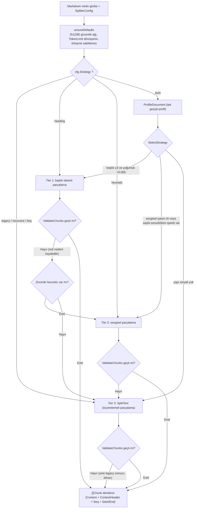
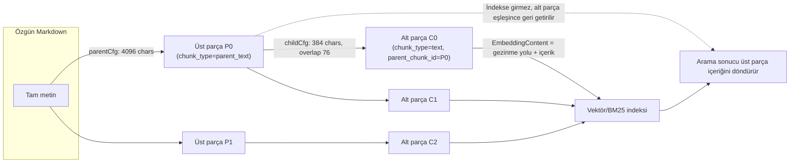

# Parçalama Mekanizması (Chunking)

Parçalama, belgeyi arama birimlerine böler. Küçük parçalar konuya odaklanmaya yardım eder, büyük parçalar daha fazla bağlam korur; parça boyutu ve örtüşme aralığı belge yapısına ve arama sonuçlarına göre ayarlanmalıdır.

Önce arayüzdeki varsayılan yapılandırmayı (512 karakter parça, 80 karakter örtüşme, uyarlanabilir strateji) kullanıp ardından aşağıdaki durumlara göre ayarlayabilirsiniz:

| Karşılaşılan durum | Öneri |
| --- | --- |
| Yanıtta bağlam eksik, bilgi tamamlanmamış | `chunk_size` değerini artırın veya üst-alt parçalamayı açın (alt parçayla arama, üst parçayla yanıt) |
| Aramada bulunan parçalar soruyla pek ilgili değil | Her parçanın konusu daha odaklı olsun diye `chunk_size` değerini azaltın |
| İçerik madde madde (SSS, sözlük, parametre tablosu) | Komşu maddelerin birbirini kirletmemesi için örtüşmeyi 0 yapın |
| İçerik uzun anlatı (rapor, makale) | Parçalar arası anlam bağını korumak için örtüşmeyi 150–200 yapın |

Parçalama yapılandırması değiştirildikten sonra mevcut belgelerin yeni yapılandırmayı kullanması için yeniden ayrıştırılması gerekir.

## Parametre Özeti ve Ayar Önerileri {#parametre-ozeti-ve-ayar-onerileri}

| Senaryo | strategy | chunk_size | chunk_overlap | Diğer |
|------|----------|------------|---------------|------|
| Genel belgeler (önerilen başlangıç) | `auto` | 512 | 80 | — |
| Yapılandırılmış teknik belgeler / kılavuzlar | `auto` (heading'e düşer) | 512–1024 | 80 | Gezinme yolu otomatik uygulanır |
| OCR PDF / düz metin kitaplar | `auto` (heuristic'e düşer) | 512–1024 | 80–150 | `languages` ile dil belirtmek yanlış algılamayı azaltır |
| Uzun anlatı / argümantatif belgeler | `auto` | 1000–2000 | 150–200 | Üst-alt parçalama eklenebilir |
| Kesin arama + uzun bağlam | Herhangi | — | — | `enable_parent_child=true`, parent 4096 / child 384 |
| SSS / atomik kayıtlar | Uygulanmaz (FAQ KB her kaydı ayrı parça yapar) | — | 0 | `FAQIndexMode` yanıtın indekse girip girmeyeceğini belirler |
| Katı token sınırlı embedding modeli | Herhangi | — | — | `token_limit` ayarlayın, karakter bütçesi otomatik hesaplanır |
| Eski sürüm davranışını yeniden üretme | `legacy` | Özgün değer | Açıkça 64 ayarlayın | [ChunkingConfig (KB düzeyinde, tek yüklemede geçersiz kılınabilir)](#chunkingconfig-kb-duzeyinde-tek-yuklemede-gecersiz-kilinabilir) bölümündeki taşıma notuna bakın |

## Parçalama Mekanizması Başvurusu

Rethra'da parçalama **Go tarafında** yapılır (`internal/infrastructure/chunker` paketi) ve "belge profili → katmanlı strateji → sonuç doğrulama → kademeli geri dönüş" şeklinde uyarlanabilir bir mimari kullanır. Python tarafındaki `docreader/splitter/` aynı kökenli özyinelemeli parçalayıcıyı docreader sidecar için korur (üretimdeki ana yol Go uygulamasıdır; `docreader/splitter/splitter.py` yorumları ikisinin varsayılan değerlerinin eşitlendiğini açıkça belirtir).

### Yapılandırma modeli {#yapilandirma-modeli}

#### ChunkingConfig (KB düzeyinde, tek yüklemede geçersiz kılınabilir) {#chunkingconfig-kb-duzeyinde-tek-yuklemede-gecersiz-kilinabilir}

`internal/types/knowledgebase.go`:

| Alan | Tür | Varsayılan | Açıklama |
|------|------|--------|------|
| `chunk_size` | int | 512 (karakter) | Tek parçanın hedef boyutu. Yaklaşık 100–130 İngilizce token / 300 Çince token. SSS tarzı atomik içerik için 200–400, uzun anlatı belgeleri için 1000–2000 önerilir |
| `chunk_overlap` | int | 80 (yaklaşık %15) | Komşu parçaların örtüşen karakter sayısı. Atomik veride 0, uzun anlatıda 150–200 olabilir. `chunk_size/2` değerini aşarsa yarıya sabitlenir |
| `separators` | []string | `["\n\n", "\n", "。"]` | Özyinelemeli parçalamanın ayırıcı öncelik dizisi (`。` Çince tam noktadır) |
| `strategy` | string | `""` (= legacy) | Parçalama stratejisi: `auto` / `heading` / `heuristic` / `recursive` / `legacy`; bkz. [Uyarlanabilir strateji: üç Tier ve geri dönüş zinciri](#uyarlanabilir-strateji-uc-tier-ve-geri-donus-zinciri) |
| `token_limit` | int | 0 (kapalı) | Parça boyutunu yaklaşık token üst sınırıyla kısıtlar; >0 olduğunda dile göre karakter bütçesine çevrilir ve küçük olan alınır (0.9 güvenlik katsayısı) |
| `languages` | []string | boş (otomatik algılama) | Sezgisel mod için dil ipucu, ör. `["zh"]`, `["en","de"]` |
| `enable_parent_child` | bool | false | Üst-alt (iki düzeyli) parçalamayı etkinleştirir; bkz. [Üst-alt parçalama (Parent-Child / çok ayrıntı düzeyli)](#ust-alt-parcalama-parent-child-cok-ayrinti-duzeyli) |
| `parent_chunk_size` | int | 4096 | Üst parça boyutu (yalnızca üst-alt modunda) |
| `child_chunk_size` | int | 384 | Alt parça boyutu (yalnızca üst-alt modunda); alt parça örtüşmesi `child_size/5` olarak sabittir (yaklaşık %20) |
| `parser_engine_rules` | []ParserEngineRule | boş | Dosya türü → ayrıştırma motoru yönlendirmesi; `xlsx_first_row_as_header` gibi ayrıştırıcı düzeyi anahtarlar içerir (parçalamaya değil ayrıştırmaya aittir ama aynı yapıdadır) |
| `table_metadata_instructions` | string | boş | CSV/Excel tablo özeti üretilirken kullanılacak iş yönergesi |

Varsayılan değerlerin tek kaynağı `chunker` paketindeki sabitlerdir (`splitter.go`):

```go
const (
    DefaultChunkSize    = 512
    DefaultChunkOverlap = 80
)
```

> Taşıma notu (kaynak kod yorumunun çevirisi): Geçmişte Go DefaultConfig 64, knowledge.go 50, Python docreader 100 olmak üzere üç farklı varsayılan örtüşme değeri kullanıyordu; artık hepsi 80'e eşitlendi. Mevcut bir KB'nin veritabanında `ChunkOverlap=0` saklanıyorsa indeks yeniden oluşturulurken 80 kullanılır ve embedding'ler eski değerle bit düzeyinde aynı olmaz.

#### SplitterConfig (çalışma zamanı yapılandırması) {#splitterconfig-calisma-zamani-yapilandirmasi}

Servis katmanı `buildSplitterConfigFromChunking` (`knowledge_process.go`) ile `ChunkingConfig` değerini `chunker.SplitterConfig{ChunkSize, ChunkOverlap, Separators, Strategy, TokenLimit, Languages}` yapısına eşler; chunker paketindeki `ensureDefaults` ardından güvenlik ağı uygular:

- `TokenLimit > 0` olduğunda: `charBudget = CharsForTokenLimit(TokenLimit, lang)`; bu değer `ChunkSize`'dan küçükse onun yerine geçer (`tokens.go`; karakter/token oranları: en 4.0, de 4.5, zh 1.7, mixed 3.0 ve 0.9 güvenlik katsayısı — parçaların embedding modelinin token sınırını aşmamasını sağlar);
- `ChunkOverlap > ChunkSize/2` olduğunda `ChunkSize/2` değerine sabitlenir.

#### IndexingStrategy ile parçalama ilişkisi {#indexingstrategy-ile-parcalama-iliskisi}

`internal/types/indexing_strategy.go` içindeki dört anahtar, parçalama çıktısının hangi hatlara gideceğini belirler:

```go
type IndexingStrategy struct {
    VectorEnabled  bool // Vektör indeksi
    KeywordEnabled bool // BM25 anahtar kelime indeksi
    WikiEnabled    bool // Wiki üretimi
    GraphEnabled   bool // Grafik çıkarımı
}
```

- `NeedsChunks()` (herhangi biri açık) yanlışsa parçalama gerekmez;
- `NeedsEmbedding()` (vector || keyword) yanlışsa parçalar yalnızca veritabanına yazılır ve `BatchIndex` atlanır (`processChunks` içinde `skipStage(StageEmbedding)`);
- Wiki / Graph metin chunk'larını girdi olarak son işleme aşamasında tüketir.

### Uyarlanabilir strateji: üç Tier ve geri dönüş zinciri {#uyarlanabilir-strateji-uc-tier-ve-geri-donus-zinciri}

Herkese açık giriş noktası `chunker.Split(text, cfg)` (`strategy.go`) işlevidir. `cfg.Strategy` değerleri ve çözümlenmesi (`resolveChainWithProfile`):

| Strategy değeri | Deneme zinciri (Tier Chain) | Açıklama |
|-------------|----------------------|------|
| `auto` | Profil çıkarıcı belirler; `[heading, heuristic, legacy]` dizisinin bir alt dizisi olabilir | Önerilen değer; belge yapısına göre otomatik seçer |
| `heading` | `[heading, legacy]` | Başlık tabanlı parçalamayı zorlar, başarısız olursa legacy'ye döner |
| `heuristic` | `[heuristic, legacy]` | Sezgisel parçalamayı zorlar |
| `recursive` | `[legacy]` | `recursive`, `legacy` için herkese açık bir takma addır |
| `legacy` / `""` (boş) | `[legacy]` | Geçmişten gelen özyinelemeli parçalayıcı; geriye dönük uyumlu varsayılan |

Her Tier'ın çıktısı kabul edilmeden önce **Validator**'dan (`validator.go`) geçmelidir; aksi hâlde zincir sonraki Tier'a ilerler. `legacy` son güvence katmanıdır — o da doğrulamadan geçemese bile sonucunu döndürür (asla boş döndürmez):

Validator'ın reddetme kuralları:

| Kural | Reddetme nedeni dizesi |
|------|----------------|
| Çıktı yok | `no chunks produced` |
| Belge `2*chunkSize`'dan büyük ama yalnızca 1 parça üretilmiş | `single chunk for large document` |
| Son parça dışındaki <50 karakterlik küçük parçalar toplamın 1/4'ünden fazla ve 2'den çok | `too many tiny chunks` |
| En büyük parça `chunkSize/4`'ten küçük (aşırı parçalanma) | `all chunks far below target size` |
| En büyük parça `2*chunkSize`'ı aşıyor (bütçe yok sayılmış) | `chunk exceeds 2x target size` |

#### Belge profili (profiler.go) {#belge-profili-profiler-go}

`ProfileDocument(text)` tek geçişte tarayarak `DocProfile` üretir: toplam karakter/satır sayısı, satır uzunluğu ortalaması ve varyansı, her düzeydeki Markdown başlık sayıları, numaralı bölüm sayısı, tamamı büyük harfli kısa satır sayısı, ardışık boş satır blokları, sayfa sonu karakteri `\f` sayısı, yatay ayırıcı çizgi sayısı, Almanca/İngilizce/Çince bölüm işaretleri, sayfa altbilgisi satırları, tablo/kod içerip içermediği, kod oranı ve dil algılama (ilk 4096 bayt örneklenir; `DetectLanguage` CJK/Latin oranına göre `zh/de/en/mixed` belirler).

`SelectStrategy(profile)` deneme zincirini oluşturur:

```go
// Tier 1 adayı: Markdown başlık yapısı
if p.MdHeadingTotal >= 3 && p.HeadingDensity() > 0.005 && p.DominantHeadingLevel() > 0 {
    chain = append(chain, TierHeading)
}
// Tier 2 adayı: sezgisel sınırlar
if p.HeuristicMarkerTotal() >= 5 || p.FormFeedCount > 0 ||
    p.GermanChapterCount+p.EnglishChapterCount+p.ChineseChapterCount > 0 {
    chain = append(chain, TierHeuristic)
}
chain = append(chain, TierLegacy) // her zaman son güvence
```

`DominantHeadingLevel` ana bölme düzeyini seçer: önce "en az 3 kez görülen en sığ düzey" (belgenin gerçek yapısal iskeleti) alınır, yoksa görülen en derin düzey kullanılır.

#### Parçalama karar akış şeması {#parcalama-karar-akis-semasi}



### Üç parçalama algoritmasının ayrıntıları {#uc-parcalama-algoritmasinin-ayrintilari}

#### Tier 1: Başlığa duyarlı parçalama (heading_splitter.go) {#tier-1-basliga-duyarli-parcalama-heading-splitter-go}

**Uygun olduğu durum**: Düzgün Markdown başlık yapısına sahip belgeler (teknik belgeler, dışa aktarılmış Word/yer imli PDF vb.).

Algoritma:

1. `DominantHeadingLevel` ana düzey olarak alınır; `findHeadingBoundaries`, `level <= primaryLevel` olan tüm başlık satırlarını bölüm sınırı olarak bulur (fenced code içindeki sahte başlıklar atlanır); sınır sayısı ≤1 ise doğrudan `SplitText`'e dönülür.
2. `HeadingHierarchy` (`heading_hierarchy.go`) 6 katmanlı bir başlık yığını tutar: level-N başlık eklendiğinde ≥N olan tüm katmanlar çıkarılır; `BreadcrumbWithHashes()` `"# Bölüm 1\n## 1.2 Kısım"` gibi bir gezinme yolu üretir.
3. Her section için:
   - `gezinme yolu uzunluğu + 2 + bölüm uzunluğu <= ChunkSize` ise bölümün tamamı tek bir Chunk olur ve gezinme yolu **`ContextHeader` içine konur (Content'e girmez)**;
   - Çok uzunsa bölüm içi `SplitText` ile ikinci kez bölünür; her alt parça `sectionBreadcrumbs` + `breadcrumbAtOffset` ile "o konumda geçerli olan en derin başlık yolunu" ContextHeader olarak alır (bölüm içindeki `###`/`####` alt başlıklar bölüm düzeyindeki başlığa ezilmez).
4. `coalesceTinyChunks`: Komşu, `ChunkSize/2`'den (alt sınır 200) küçük, başlık önekini paylaşan ve konumu kesintisiz olan (`cur.End == next.Start`) küçük parçalar birleştirilir — SSS tarzı kısa bölümlü belgeler artık "too many tiny chunks" yüzünden tümüyle legacy'ye düşmez.

**Konum değişmezi**: `End - Start == utf8.RuneCountInString(Content)` her zaman geçerlidir (gezinme yolu Content'e sayılmaz); belgenin geri oluşturulması ve arayüzde vurgulama buna dayanır.

#### Tier 2: Sezgisel sınır tabanlı parçalama (heuristic_splitter.go + patterns.go) {#tier-2-sezgisel-sinir-tabanli-parcalama-heuristic-splitter-go-patterns-go}

**Uygun olduğu durum**: Markdown başlığı olmayan ama tanınabilir yapısal ipuçları içeren belgeler (OCR'dan çıkmış PDF'ler, düz metin kılavuzlar, taranmış kitaplar vb.).

Önce tüm aday sınırlar taranır (aynı konumda yalnızca en yüksek öncelikli olan tutulur):

| Sınır türü | Düzenli ifade (patterns.go) | Öncelik |
|----------|---------------------|--------|
| Sayfa sonu karakteri `\f` | `FormFeedPattern` | 100 |
| Numaralı bölüm (`1.2.3 Başlık`, `IV. Results`) | `NumberedSectionPattern` | 90 |
| Bölüm işaretleri (`Chapter 3` / `Kapitel 2` / `第一章`, `第3节` — Çince "1. bölüm", "3. kısım") | `EnglishChapterPattern` / `GermanChapterPattern` / `ChineseChapterPattern` (`Languages` ipucuna göre filtrelenir, boşsa hepsi kullanılır) | 85 |
| Tamamı büyük harfli kısa satır başlığı | `AllCapsHeadingPattern` | 70 |
| Görsel ayırıcı çizgi (`---`, `===`, `***`) | `VisualSeparatorPattern` | 60 |
| Sayfa altbilgisi (`Page 3 of 10` / `Seite 3 von 10` / `页码 3` — Çince "sayfa 3") | `PageFooterPattern` | 50 |
| Ardışık ≥3 satır sonu | `ExcessiveBlanksPattern` | 40 |

Ardından:

- `dropBoundsInsideSpans`: Korunan aralıkların (tablo/kod bloğu/formül; bkz. [Tier 3: özyinelemeli parçalama legacy (splitter.go, Python'dan taşınmış)](#tier-3-ozyinelemeli-parcalama-legacy-splitter-go-python-dan-tasinmis)) **içine** düşen sınırlar atılır, kenara hizalı olanlar korunur;
- **Açgözlü paketleme**: Sınırlar boyunca parça biriktirilir; birikim `ChunkSize`'ı aştığında ve en az `max(ChunkSize/4, 50)` içerik varsa bir Chunk oluşturulur;
- İki sınır arasındaki çok büyük bloklar özyinelemeli olarak `SplitText`'e verilir;
- Örtüşme hizalaması: `applyOverlapAligned`, `[curEnd-2*overlap, curEnd)` penceresinde önce en yakın anlamsal sınıra, sonra satır sonuna yapışır; böylece sonraki parça kelimenin ortasından başlamaz.

#### Tier 3: Özyinelemeli parçalama legacy (splitter.go, Python'dan taşınmış) {#tier-3-ozyinelemeli-parcalama-legacy-splitter-go-python-dan-tasinmis}

Bu, `docreader/splitter/splitter.py`'den taşınan temel uygulamadır; aynı zamanda tüm Tier'ların güvenlik ağı ve "bölüm içi ikinci bölme" motorudur. Üç adımdan oluşur:

**Step 1 — Korunan aralıkların tanınması** (`protectedSpans`); bu içerikler asla ortadan bölünmez:

```go
var protectedPatterns = []*regexp.Regexp{
    regexp.MustCompile(`(?s)\$\$.*?\$\$`),                        // LaTeX blok formülü
    regexp.MustCompile(`!\[[^\]\n]{0,200}\]\([^)\n]{1,500}\)`),   // Markdown görseli (tek satır, uzunluk sınırlı)
    regexp.MustCompile(`\[[^\]\n]{1,200}\]\([^)\n]{1,500}\)`),    // Markdown bağlantısı (tek satır, uzunluk sınırlı)
    /* tablo başlığı + ayırıcı satır */ /* tablo veri satırları */ // Markdown tablosu
    regexp.MustCompile("(?s)```(?:\\w+)?[\\r\\n].*?```"),          // fenced kod bloğu
    regexp.MustCompile("`[^`\\r\\n]+`"),                            // satır içi kod
}
```

Görsel ve bağlantı eşleşmeleri tek satırla sınırlıdır; bağlantı metni en fazla 200, adres en fazla 500 karakter olabilir (CommonMark'ın boş satır aşmayı yasaklayan kuralıyla uyumludur). Böylece OCR'dan kalan yalnız bir `[` uzaktaki bir `](` ile eşleşip bütün bir paragrafı bölünemez korunan alan olarak yakalamaz.

`maxProtectedSize = 7500` rune'u aşan korunan alanlar (çok büyük tablolar/kod blokları) embedding API sınırını aşmamak için satır sonu veya boşlukta zorla bölünür.

**Step 2 — Özyinelemeli ayırma** (`splitBySeparators`): `Separators` önceliğine göre bölünür (varsayılan `\n\n` → `\n` → `。`); hâlâ `ChunkSize`'ı aşan parçalara bir sonraki ayırıcı özyinelemeli uygulanır (Python `_split` anlamıyla aynıdır, ayırıcılar parçada korunur).

**Step 3 — Birleştirme ve örtüşme** (`mergeUnits`): Küçük birimler parçalara dönüştürülür; `curLen + uLen + headersLen > chunkSize` olduğunda parça kapatılır ve `computeOverlap` geçerli parçanın sonundan bir bölümü sonraki parçanın başı olarak alır; mutlak üst sınır `absoluteMaxSize = 7500`'dür.

`computeOverlap` sabit uzunluklu karakter dilimi yerine **anlamsal bir sonek** alır:

- `ChunkOverlap` hedef değer değil katı bir üst sınırdır. Pencere parça sonundan `min(ChunkOverlap, ChunkSize - sonraki birimin uzunluğu)` karakter alır ve ek olarak 4 karakter geriye bakar (`semanticOverlapLookbehind`, en uzun ayırıcı `\r\n\r\n`'nin uzunluğu); böylece ayırıcı pencere sınırında kesilip görünmez hâle gelmez. Aday sınırın son karakteri pencere içinde olmalıdır (özgün pencereye göre ≥ -1); bu yüzden korunan içerik üst sınırı aşmaz;
- Sınır önceliği: paragraf ayırıcı (`\n\n`) > satır sonu (`\n`) > cümle sonu (Çince tam genişlikli `。`, `？`, `！` ve İngilizce `. ` / `? ` / `! ` — İngilizce noktalama işaretlerinden sonra boşluk gerekir; böylece `3.14`, `v1.2` bölünmez). Öncelik aynıysa pencere içindeki **en öndeki** seçilir; böylece etkin örtüşme olabildiğince büyük olur;
- Pencere tek bir `splitUnit`'in içine girebilir (eski uygulama birimi yalnızca bütün olarak tutabildiği için sıradan paragraflar çoğu zaman sıfır örtüşmeye düşüyordu); ancak `Start/End` konumları ile Content arasındaki değişmezi korumak için tablo başlığı işaretleri gibi `start == end` olan sıfır genişlikli sentetik birimleri aşmaz;
- Korunan aralıkların (kod blokları, satır içi kod `` ` ``, formüller, tablolar, görseller/bağlantılar) içindeki ayırıcılar sınır sayılmaz; sınırdan sonra yalnızca boşluk kalıyorsa da sınır geçersizdir;
- Pencere içinde geçerli bir anlamsal sınır bulunamazsa örtüşme tutulmaz; böylece kelimenin ortasından kesilmesi önlenir.

#### Tablo işleme: tablo başlığı izleme (header_tracker.go) {#tablo-isleme-tablo-basligi-izleme-header-tracker-go}

Büyük Markdown tabloları birden çok parçaya bölündüğünde sonraki parçalar sütun adı bağlamını kaybeder. `headerTracker` (`docreader/splitter/header_hook.py`'den taşınmıştır) bu sorunu çözer:

- "Tablo başlığı satırı + ayırıcı satır" (`| A | B |` + `| --- | --- |`) **etkin tablo başlığı** olarak algılanır ve tablo bitene kadar (boş satır / `|` ile başlamayan satır) etkin kalır;
- `mergeUnits` yeni parça oluştururken, etkin tablo başlığı örtüşme alanında/sonraki birimde yoksa ve sütun sayısı eşleşiyorsa (`headerAlreadyPresent` / `headerColumnMismatch`) tablo başlığını `start==end` olan sıfır genişlikli bir birim olarak **yeni parçanın başına ekler** — her tablo parçası kendi sütun adlarını taşır;
- Boş tablo başlıkları (MarkItDown'da sık görülen `||` + `|---|---|`) ilk veri satırıyla tamamlanır (`pendingExtend`);
- Tablo sınırı farkındalığı: parça sonundaki `\n\n`'den sonra yeni bir tablo satırı geldiğinde veya yeni satırın sütun sayısı başlıkla uyuşmadığında eski tablo başlığı sonlandırılır ve parça zorla kapatılır (`headerEndedThisUnit`); böylece önceki tablonun başlığı sonraki tabloyu kirletmez.

Ayrıca tüm ayrıştırma motorlarının (MinerU, PaddleOCR-VL, VLM OCR vb.) ve elle yazılmış Markdown'ın içindeki satır içi HTML tabloları, parçalamadan önce `docparser/html_table_normalizer.go` içindeki `NormalizeHTMLTables` ile GFM Markdown tablolarına dönüştürülür ve yukarıdaki koruma ile tablo başlığı izleme mantığına girer. Gerçek birleştirilmiş hücre içeren (`rowspan`/`colspan` 1'den büyük) veya dönüştürülemeyen tablolar HTML olarak kalır; ancak her `<tr>` ayrı satıra alınır ve önüne/arkasına boş satır eklenir; böylece parçalayıcı 7500 karakter sınırında zorla kesmek yerine satır sınırlarında bölebilir.

#### Görsel işleme {#gorsel-isleme}

- Markdown görsel başvurusu `` korunan bir kalıptır ve asla bölünmez;
- `chunker.ExtractImageRefs(text)` (`splitter.go`), tek düzey parantez iç içeliğini destekleyen bir düzenli ifadeyle parça içindeki görsel başvurularını çıkarır; `processChunks` bunları chunk ↔ görsel ilişkisi kurmak için kullanır;
- Her görsel çok kipli aşamada `image_caption` / `image_ocr` olmak üzere iki alt Chunk üretir (`ParentChunkID` metin parçasını gösterir) ve ayrı indekslenir — görselin anlamı aranabilir, eşleşince özgün metin parçasına dönülür.

### Bağlam başlığı (ContextHeader) {#baglam-basligi-contextheader}

`Chunk.ContextHeader`, Content'ten **ayrı saklanan** bağlam dizesidir (başlık gezinme yolu):

```go
// internal/types/chunk.go
// ContextHeader is a Markdown heading breadcrumb prepended when indexing.
// It is persisted so a later content edit can rebuild the same index input.
ContextHeader string `json:"-" gorm:"type:text"`

func (c *Chunk) EmbeddingContent() string {
    body := strings.TrimSpace(c.Content)
    if c.ContextHeader == "" { return body }
    return c.ContextHeader + "\n\n" + body
}
```

Tasarım noktaları:

- **Yalnızca embedding'i etkiler, özgün metni etkilemez**: `processChunks` indeks içeriğini `bilgi başlığı + "\n" + chunk.EmbeddingContent()` olarak oluşturur; vektör bölüm bağlamını taşır. Content ise özgün metnin birebir dilimi olarak kalır ve `StartAt/EndAt` konum değişmezi geçerlidir;
- **`chunks.context_header` sütununa kalıcı yazılır** (`000078` taşıması). Erken sürümlerde bellekte tutulan bir alandı (`gorm:"-"`) ve indeksleme bitince atılıyordu; parçaların elle düzenlenmesi eklendikten sonra tek bir parçayı yeniden indekslerken aynı indeks girdisinin yeniden üretilmesi gerektiği için veritabanına yazılmaya başlandı. `json:"-"` değişmedi; arayüz yanıtlarında hâlâ döndürülmez;
- Üst-alt parçalamada `mergeBreadcrumbs` (`strategy.go`) üst/alt gezinme yollarını birleştirir ve ilk satırdaki tekrarı kaldırır; alt parça üst parçadan daha ayrıntılı bir yol alır.

### Üst-alt parçalama (Parent-Child / çok ayrıntı düzeyli) {#ust-alt-parcalama-parent-child-cok-ayrinti-duzeyli}

`EnableParentChild = true` olduğunda iki düzeyli parçalama etkinleşir (`chunker.SplitParentChild` stratejiye duyarlı sürümdür; legacy sürüm `SplitTextParentChild`'dır):

1. Önce `parentCfg` ile (varsayılan 4096 karakter, yapılandırılmış örtüşmeyi kullanır, Strategy'yi devralır) **üst parçalar** kesilir;
2. Her üst parça `childCfg` ile (varsayılan 384 karakter, örtüşme = alt parça boyutu/5, Strategy'yi devralır) **alt parçalara** bölünür;
3. Alt parçaların `Seq` değeri belge boyunca kesintisizdir, `Start/End` belge düzeyindeki konuma kaydırılır ve `ParentIndex` üst parçayı gösterir; bir üst parça kendisiyle birebir aynı tek bir alt parça üretirse gereksizliği önlemek için üst parça saklanmaz (`ParentIndex = -1`).

Servis tarafındaki veritabanına yazma kuralları (`knowledge_process.go` `processChunks`):

- Üst parça → `ChunkTypeParentText`; **yalnızca veritabanına yazılır, vektör indeksine girmez**; üst parçalar `PreChunkID/NextChunkID` bağlı listesiyle birbirine bağlanır;
- Alt parça → `ChunkTypeText` + `ParentChunkID`; embedding/indeksleme yapılan tek ayrıntı düzeyidir;
- Aramada alt parça eşleşir, üst parçanın içeriği döndürülür — küçük pencereyle kesin eşleşme + büyük pencereyle bağlam.

`buildParentChildConfigs` Strategy'nin mutlaka aktarılması gerektiğini özellikle vurgular: aksi hâlde boş Strategy legacy tier olarak çözülür ve üst-alt parçalar başlık hizalamasını ve ContextHeader gezinme yolunu sessizce kaybeder.



### SSS parçalamasının özellikleri {#sss-parcalamasinin-ozellikleri}

SSS bilgi tabanı **hiçbir parçalama algoritmasından geçmez**: her soru-cevap çifti kendi başına bir `ChunkTypeFAQ` Chunk'ıdır (`knowledge_faq.go`); Content, `buildFAQChunkContent` tarafından indeks moduna göre üretilir:

```go
builder.WriteString(fmt.Sprintf("Q: %s\n", meta.StandardQuestion))
// Similar Questions: tek tek listelenir
// Negatif örnekler (NegativeQuestions) Content'e yazılmaz — indekslenmemeli
if mode == types.FAQIndexModeQuestionAnswer && len(meta.Answers) > 0 {
    // Answers: tek tek listelenir
}
```

- Yapılandırılmış veri `Chunk.Metadata` içinde saklanır (`FAQChunkMetadata`); `ContentHash` (normalleştirilmiş SHA256) içe aktarmada tekilleştirme ve klonlarda fark eşitlemesi için kullanılır;
- İndeks modları: `question_only` / `question_answer` (KB düzeyinde `FAQIndexMode`); soru indeks modları `combined` (standart soru + benzer sorular tek vektör) / `separate` (her benzer soru ayrı vektör, artımlı güncellemeyi destekler);
- SSS senaryosunda `chunk_overlap = 0` önerisi burada doğal olarak sağlanır — kayıtlar arasında örtüşme yoktur.

### İçe aktarma hattıyla bağlantı {#ice-aktarma-hattiyla-baglanti}

`knowledge_process.go` içindeki çağrı zinciri:

```
processDocument
  └─ convert()                          // docreader → Markdown
  └─ imageResolver.ResolveAndStore()    // görseller depolamaya yazılır, URL yeniden yazılır
  └─ buildSplitterConfigFromChunking()  // ChunkingConfig → SplitterConfig
  └─ chunker.Split / SplitParentChild   // bu belgede anlatılan algoritma
  └─ processChunks()                    // Chunk satırlarını oluşturur, EmbeddingContent → BatchIndex
```

Parçalama aşamasının ayrı bir Span'i vardır (`StageChunking`; `chunks_planned/chunks_written/total_text_chars` kaydedilir), hata kodu `ErrCodeChunkingFailed`'dır.

### Python tarafı parçalayıcı (docreader/splitter/) {#python-tarafi-parcalayici-docreader-splitter}

`docreader/splitter/splitter.py` içindeki `TextSplitter`, Go legacy uygulamasının prototipidir ve docreader sidecar ile birlikte hâlâ korunur:

- Varsayılan değerler Go ile eşitlenmiştir: `DEFAULT_CHUNK_SIZE = 512`, `DEFAULT_CHUNK_OVERLAP = 80`; kurucunun varsayılan ayırıcıları `["\n", "。", " "]` olup en sonda karakter düzeyinde bölme güvenlik ağı vardır;
- Aynı korunan düzenli ifadeler (formül/görsel/bağlantı/tablo başlığı/tablo satırı/kod bloğu) kullanılır: `_split` (özyinelemeli ayırma) → `_split_protected` + `_join` (korunan aralık yalıtımı) → `_merge` (örtüşmeli birleştirme + `HeaderTracker` ile tablo başlığı ekleme);
- `(start, end, text)` üçlüleri üretir ve `"".join(splits) == text` ile tam geri oluşturulabildiğini doğrular; `restore_text` örtüşmeyi kaldırarak geri oluşturma algoritmasını gösterir;
- `docreader/splitter/header_hook.py` içindeki `HeaderTracker`, Go `header_tracker.go` ile aynı davranır (tablo başlığı tanıma, boş başlık tamamlama, sütun sayısı uyuşmadığında sonlandırma).

## Uygulama Başvurusu

İlgili kaynak kod:

| Modül | Dosya |
|------|------|
| Strateji girişi ve geri dönüş zinciri | `internal/infrastructure/chunker/strategy.go` |
| Belge profili | `internal/infrastructure/chunker/profiler.go` |
| Tier 1 başlık tabanlı parçalama | `internal/infrastructure/chunker/heading_splitter.go`, `heading_hierarchy.go` |
| Tier 2 sezgisel parçalama | `internal/infrastructure/chunker/heuristic_splitter.go`, `patterns.go` |
| Tier 3 özyinelemeli parçalama (legacy) | `internal/infrastructure/chunker/splitter.go` |
| Tablo başlığı izleme | `internal/infrastructure/chunker/header_tracker.go` |
| Sonuç doğrulama | `internal/infrastructure/chunker/validator.go` |
| Token tahmini | `internal/infrastructure/chunker/tokens.go` |
| Yapılandırma yapısı | `internal/types/knowledgebase.go` (`ChunkingConfig`), `internal/types/indexing_strategy.go` |
| Hat entegrasyonu | `internal/application/service/knowledge_process.go` (`buildSplitterConfigFromChunking` / `buildParentChildConfigs` / `processChunks`) |
| Python tarafı | `docreader/splitter/splitter.py`, `docreader/splitter/header_hook.py` |
