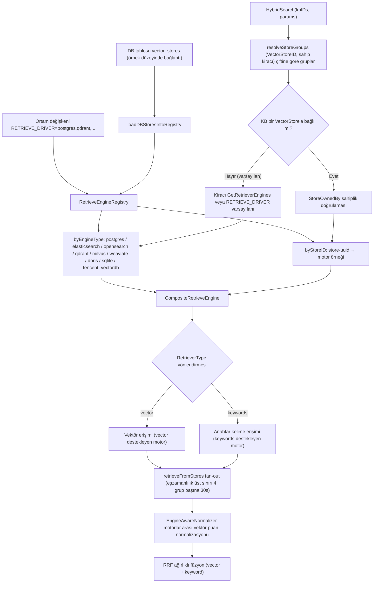
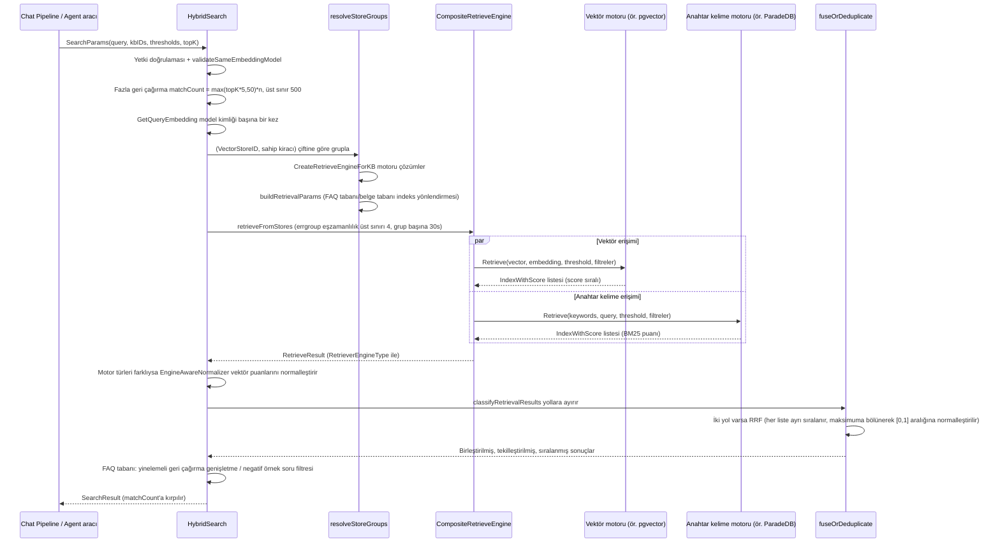

# Erişim Motorları ve Vektör Depolama (Retrieval Engines)

Erişim motoru indeksleri saklar ve vektör, anahtar kelime veya hibrit erişimi yürütür. Varsayılan PostgreSQL dağıtımı, pgvector ve BM25 sağlamak için ParadeDB imajını kullanır ve iş verileriyle aynı veritabanını paylaşabilir. Bağımsız ölçeklendirme veya mevcut altyapının yeniden kullanılması gerektiğinde başka arka uçlar seçilebilir.

Arka uç seçerken dağıtım bağımlılıklarını, kapasiteyi ve veri yalıtımı gereksinimlerini birlikte değerlendirin:

| Durum | Değerlendirilecek seçenek |
| --- | --- |
| Tek makine veya masaüstü dağıtımı, gömülü veritabanı | SQLite (gömülü, sıfır bağımlılık) |
| Vektör erişim hizmetinin bağımsız ölçeklenmesi gerekiyor | Qdrant, Milvus |
| Şirkette zaten Elasticsearch / OpenSearch yığını var | Mevcut kümeyi yeniden kullanın |
| Verileri bilgi tabanına göre ayrı saklamak gerekiyor | Varsayılan motoru koruyun; ayrıca «Ayarlar → Vektör depolama» altında örnek kaydedip belirli bilgi tabanına bağlayın |

Motor değiştirmek indeksin yeniden oluşturulmasını gerektirir. Bilgi tabanına bağlanan vektör depolama oluşturulduktan sonra değiştirilemez; örnek, bilgi tabanı oluşturulmadan önce belirlenmelidir.

## Yetenek Matrisi ve Seçim Karşılaştırması {#yetenek-matrisi-ve-secim-karsilastirmasi}

| Motor | RETRIEVE_DRIVER değeri | Vektör erişimi | Anahtar kelime/tam metin | Anahtar kelime puanlama | Çince sözcük bölme | Boyut yönetimi | Eşik aktarımı | Dağıtım karmaşıklığı | Uygun senaryo |
|------|-------------------|----------|------------|-----------|---------|----------|---------|-----------|----------|
| PostgreSQL | `postgres` | pgvector halfvec + HNSW ifade indeksi | ParadeDB BM25 (`\|\|\|`) | BM25 (paradedb.score) | ParadeDB tokenizer | Tek tabloda karışık boyut, ifade indeksi boyuta göre cast | Mesafe eşiği SQL içinde | Düşük (varsayılan imajda yerleşik) | Varsayılan seçim; iş verisiyle aynı veritabanı, işlem tutarlılığı |
| SQLite | `sqlite` | sqlite-vec vec0 (cosine) | FTS5 contentless | FTS5 | Uygulama tarafında bigram | Her boyut için bir vec0 sanal tablo | Uygulama tarafı | Çok düşük (gömülü) | Lite / geliştirme / mikro dağıtım |
| Elasticsearch v8 | `elasticsearch_v8` | script_score cosineSimilarity | match (BM25) | BM25 | ES analyzer | dense_vector tek indeks | Uygulama tarafı | Orta | Mevcut ES 8 kümesi |
| Elasticsearch v7 | `elasticsearch_v7` | Desteklenmez (Support yalnızca keywords) | match (BM25) | BM25 | ES analyzer | — | — | Orta | Mevcut ES 7; yalnızca anahtar kelime motoru, başka bir vektör motoruyla birlikte kullanılmalı |
| OpenSearch | `opensearch` | k-NN eklentisi knn (HNSW) | match (BM25) | BM25 | OS analyzer | knn_vector bildirimsel mapping + parmak izi doğrulaması | k-NN yerel | Orta | Denetim/alias/reindex gerektiren üretim ES ailesi çözümü; sürüm 2.11+/3.x |
| Qdrant | `qdrant` | Yerel HNSW Cosine | Tam metin indeksi MatchText (token OR) | Puanlama yok (Scroll isabeti doğrudan döner, RRF rank'ine dayanır) | Çok dilli tokenizer | Her boyut için bir collection | score_threshold yerel | Orta | Ağırlıklı olarak saf vektör, payload filtresi gereken senaryolar |
| Milvus | `milvus` | HNSW (IP/COSINE/L2) | BM25 Function seyrek vektör | BM25 | Milvus analyzer | Her boyut için bir collection | Uygulama tarafı | Orta-yüksek | Büyük ölçekli vektör, yerel BM25 hibrit erişim gerektiğinde |
| Weaviate | `weaviate` | nearVector (certainty) | Yerel BM25 | BM25 | Weaviate tokenizer | Dinamik Class | certainty yerel | Orta | GraphQL ekosistemi, replika/parça yapılandırması gerektiğinde |
| Doris | `doris` | ANN HNSW inner_product/cosine | Ters indeks MATCH_ANY | Ters indeks isabeti | Tablo oluştururken chinese parser bildirilir | Her boyut için bir tablo | SQL içinde | Yüksek | Mevcut Doris veri ambarı, erişim ve analiz bir arada |
| Tencent Cloud VectorDB | `tencent_vectordb` | HNSW COSINE | Seyrek vektör BM25 (SPARSE_INVERTED) | BM25 | SDK SparseEncoder | Her boyut için bir collection | Uygulama tarafı | Düşük (bulut yönetimli) | Tencent Cloud yönetimli, bakım gerektirmez |

> Not: Motorun kendisi "hibrit erişim" sunsa da sunmasa da Rethra'nın hibrit erişimi her zaman **üst katmanda birleşik RRF füzyonudur** (`knowledgebase_search_fusion.go`). Vektör ve anahtar kelime erişimi birbirinden bağımsız yürütülür ve rank'e göre ağırlıklı olarak birleştirilir ([Hibrit erişim puanlaması ve normalizasyon](#hibrit-erisim-puanlamasi-ve-normalizasyon) bölümüne bakın). Bu nedenle her motorun yalnızca iki tür tek kipli erişimi ayrı ayrı sağlaması yeterlidir.

## Yapılandırma Yöntemlerinin Özeti {#yapilandirma-yontemlerinin-ozeti}

Temel anahtarlar (`.env.example` C1 bölümü, `docker-compose.yml`):

| Ortam değişkeni | Varsayılan | Açıklama |
|----------|------|------|
| `RETRIEVE_DRIVER` | `postgres` | Virgülle ayrılmış çoklu sürücü: `postgres` / `sqlite` / `elasticsearch_v7` / `elasticsearch_v8` / `opensearch` / `qdrant` / `milvus` / `weaviate` / `doris` / `tencent_vectordb`. Çoklu sürücüde yazma işlemleri tümüne yayınlanır, erişim türe göre yönlendirilir |
| `MULTI_STORE_RETRIEVE_TIMEOUT_SEC` | 30 | Çoklu store paralel erişiminde grup başına zaman aşımı |
| `ELASTICSEARCH_ADDR` / `_USERNAME` / `_PASSWORD` / `_INDEX` | — / `Rethra` | ES v7/v8 tarafından ortak kullanılır |
| `OPENSEARCH_ADDR` / `_USERNAME` / `_PASSWORD` / `_INDEX` / `_INSECURE_SKIP_VERIFY` | — | OpenSearch |
| `QDRANT_HOST` / `_PORT` / `_COLLECTION` / `_API_KEY` / `_USE_TLS` | `localhost` / 6334 / `rethra_embeddings` | Qdrant (gRPC portu) |
| `MILVUS_ADDRESS` / `_COLLECTION` / `_METRIC_TYPE` / `_USERNAME` / `_PASSWORD` / `_DB_NAME` | `localhost:19530` / `rethra_embeddings` / `IP` | metric değiştirildikten sonra collection yeniden oluşturulmalı |
| `WEAVIATE_HOST` / `_GRPC_ADDRESS` / `_SCHEME` / `_AUTH_ENABLED` / `_API_KEY` / `_COLLECTION` | `weaviate:8080` / `weaviate:50051` / `http` | Konteyner içinde hizmet adı kullanılır |
| `DORIS_ADDR` / `_HTTP_PORT` / `_DATABASE` / `_USERNAME` / `_PASSWORD` / `_TABLE_PREFIX` / `_COMPAT_MODE` | `doris-fe:9030` / 8030 / `rethra` / `root` / — / `rethra_embeddings` / `auto` | Doris 4.1+; compat modu tablo oluşturulduktan sonra değiştirilemez |
| `TENCENT_VECTORDB_ADDR` / `_USERNAME` / `_API_KEY` / `_DATABASE` / `_COLLECTION` | — | Üç temel ayardan biri eksikse kayıt atlanır |
| `NEO4J_ENABLE` / `NEO4J_URI` / `_USERNAME` / `_PASSWORD` | `false` / `bolt://neo4j:7687` | Graf erişimi (vektör motoru sisteminden bağımsız) |

Ortam değişkenlerine (env store, süreç düzeyinde genel) ek olarak yönetim panelinde kiracı için `VectorStore` kaydı (DB store) oluşturulup belirli bir KB'ye bağlanabilir. Aynı motor türüne birden çok küme örneği bağlanabilir; erişim sırasında KB bağlantısına göre otomatik yönlendirme yapılır ve kiracı sahipliği doğrulanır ([Erişim sırasında motor seçimi](#erisim-sirasinda-motor-secimi)).

## Motor Uygulama Başvurusu

### Katmanlı Mimari: Repository → KVHybridRetrieveEngine → Composite → Registry {#katmanli-mimari-repository-kvhybridretrieveengine-composite-registry}

Her arka uç `interfaces.RetrieveEngineRepository` arayüzünü uygular (`EngineType()` / `Support()` / `Save` / `BatchSave` / `Retrieve` / `DeleteBy*` / `CopyIndices` / `BatchUpdateChunkEnabledStatus` / `BatchUpdateChunkTagID` / `EstimateStorageSize`). Bunun üzerinde sırasıyla şunlar bulunur:

- **KVHybridRetrieveEngine** (`retriever/keywords_vector_hybrid_indexer.go`): Repository'yi `RetrieveEngineService` olarak sarar; Index sırasında desteklenen erişim türlerine göre embedding hesaplayıp yazar;
- **CompositeRetrieveEngine** (`retriever/composite.go`): Bileşik desen. `Retrieve`, her `RetrieveParams.RetrieverType` (`vector` / `keywords`) için ilgili türü destekleyen ilk motora yönlendirip eşzamanlı çalıştırır; `Index` / `Delete` / `CopyIndices` gibi yazma işlemleri tüm üye motorlara yayınlanır;
- **RetrieveEngineRegistry** (`retriever/registry.go`): Çift indeksli kayıt defteri. `byEngineType` (`RETRIEVE_DRIVER` ortam değişkeniyle yönetilen "env store", tür başına yalnızca bir tane) ve `byStoreID` (veritabanındaki `VectorStore` tablosuyla yönetilen örnek düzeyinde kayıt; aynı motor türü için birden çok örnek kaydedilebilir, örneğin iki ES kümesi).

##### İsteğe Bağlı Yeniden Oluşturma (rehydrate)

Başlangıçta bir vektör depolama tam o anda erişilemezse (arka uç henüz ayağa kalkmamış, ağ dalgalanması) `byStoreID`'ye girmez; sonrasında bu store'a bağlı tüm bilgi tabanı erişimleri, hatta bilgi tabanı silme işlemleri bile sürekli başarısız olur. Bu yüzden kayıt defteri **isteğe bağlı yeniden oluşturmayı** destekler:

- `GetOrLoadByStoreID` kaydı bulamadığında enjekte edilen `VectorStoreRepository` + `EngineFactory` ile motoru anında oluşturup kaydeder; depo veya fabrikadan biri nil ise normal aramaya geri döner;
- Tek bir oluşturma işleminin `EngineBuildTimeout` (10s) üst sınırı vardır; `singleflight` eşzamanlı istekleri tek bir oluşturmada birleştirir;
- Oluşturma başarısız olursa `rebuildCooldown` (30s) bekleme süresine girilir; böylece arka uç uzun süre erişilemez olduğunda her istek tam bir zaman aşımı boyunca boşuna beklemez;
- Yarış durumlarını önlemek için `storeGen` nesil sayacı kullanılır: oluşturma başlamadan önce örneklenir ve sonuç yalnızca nesil değişmemişse yayımlanır; böylece oluşturma sırasında yapılan kayıt veya silme işlemlerinin üzerine eski sonuç yazılmaz.

Bilgi tabanı silinirken motor henüz hazır değilse doğrudan başarısız sayılmaz; bu yeniden oluşturma yolu üzerinden tekrar denenir.

#### Motor Kaydı: initRetrieveEngineRegistry {#motor-kaydi-initretrieveengineregistry}

`internal/container/container.go`. Başlangıçta `RETRIEVE_DRIVER` (virgülle ayrılmış) ayrıştırılır, her sürücü için istemci oluşturulur ve `registry.Register(retriever.NewKVHybridRetrieveEngine(repo, engineType))` çağrılır; tek bir sürücünün başlatılamaması yalnızca günlüğe yazılır, başlangıcı engellemez. Ardından `loadDBStoresIntoRegistry`, `vector_stores` tablosundan kiracıların oluşturduğu vektör depolama örneklerini yükler; `createEngineServiceFromStore` (`engine_factory.go`) ile motor oluşturulduktan sonra `RegisterWithStoreID` ile kaydedilir.

#### Erişim Sırasında Motor Seçimi {#erisim-sirasinda-motor-secimi}

Erişim girişi `HybridSearch` (`knowledgebase_search.go`), KB'nin bağlantı ilişkisine göre motor seçer:

1. `resolveStoreGroups`, erişime katılan KB'leri `(VectorStoreID, sahip kiracı)` çiftine göre gruplar;
2. Her grup için `retriever.CreateRetrieveEngineForKB` (`factory.go`) çağrılır:
   - KB bir store'a bağlı değilse (`VectorStoreID` boş, şu anki varsayılan) → kiracının `GetRetrieverEngines()` yolu izlenir: kiracı `RetrieverEngines.Engines` yapılandırdıysa o kullanılır, aksi halde `GetDefaultRetrieverEngines()` `RETRIEVE_DRIVER` ortam değişkenine göre üretir (`internal/types/tenant.go`);
   - KB bir store'a bağlıysa → önce `ownership.StoreOwnedBy` ile kiracı sahipliği doğrulanır (kiracılar arası yoklamayı engeller, başarısızsa `ErrVectorStoreForbidden` döner), ardından `registry.GetByStoreID` ile örnek alınır (kayıtlı değilse `ErrVectorStoreNotFound` döner) ve tek üyeli bir Composite olarak sarılır;
3. `buildRetrievalParams`, motorun `SupportRetriever` yeteneğine ve KB türüne göre vektör/anahtar kelime olmak üzere iki tür `RetrieveParams` üretir (FAQ tabanı yalnızca FAQ vektör indeksini, belge tabanı varsayılan vektör indeksi + anahtar kelime indeksini kullanır);
4. Birden çok grup olduğunda `retrieveFromStores` errgroup ile eşzamanlı fan-out yapar (en fazla 4 grup, grup başına zaman aşımı `MULTI_STORE_RETRIEVE_TIMEOUT_SEC`, varsayılan 30s); sonuçlar farklı motor türlerinden geliyorsa puan normalizasyonu yapılır.



### Motorların Tek Tek Ayrıntıları {#motorlarin-tek-tek-ayrintilari}

Motor türü sabitleri `internal/types/retriever.go` içindedir: `postgres`, `elasticsearch`, `opensearch`, `qdrant`, `milvus`, `weaviate`, `doris`, `sqlite`, `tencent_vectordb` (ayrıca `infinity` ve `elasticfaiss` eski numaralandırmalardır, dağıtılabilir uygulamaları yoktur). Aksi belirtilmedikçe tüm motorların `Support()` çağrısı `[keywords, vector]` olmak üzere iki tür döndürür.

#### PostgreSQL (pgvector + ParadeDB) — Varsayılan Motor {#postgresql-pgvector-paradedb-varsayilan-motor}

`internal/application/repository/retriever/postgres/repository.go`. Veriler iş veritabanıyla aynı veritabanındadır (`embeddings` tablosu, GORM ile yönetilir).

- **Vektör erişimi**: pgvector `halfvec` (yarım hassasiyet, boyut başına 2 bayt). `embedding` sütununun boyutu sabit değildir; HNSW indeksi `(embedding::halfvec(dim)) halfvec_cosine_ops` ifadesi üzerine kurulur. **ORDER BY ifadesi indeks ifadesiyle birebir aynı olmalıdır** (iki tarafta da açık cast); aksi halde sıralı taramaya düşer (kaynak kod yorumu pgvector issue [#702](https://github.com/pgvector/pgvector/issues/702)/[#835](https://github.com/pgvector/pgvector/issues/835) bağlantılarını verir). Sorgu önce alt sorguyla `expandedTopK` (TopK*2, [100,200] aralığına sıkıştırılır; büyük LIMIT'in HNSW'yi yavaşlatmasını önler) aday alıp `distance = embedding <=> query` hesaplar, ardından `distance <= 1-threshold` ile filtreler; `score = 1 - distance`. İşlem içinde `SET LOCAL hnsw.ef_search` (≥40) ve `SET LOCAL hnsw.iterative_scan = strict_order` (pgvector ≥ 0.8; seçici filtrelerde geri çağırmayı sürdürür) ayarlanır; eski sürümlerde GUC yoksa otomatik olarak düşürülüp yeniden denenir.
- **Anahtar kelime erişimi**: ParadeDB `pg_search` BM25: `content ||| query` (herhangi bir token eşleşmesi) + `paradedb.score(id) as score`.
- **Filtreleme**: `knowledge_base_id` / `knowledge_id` / `tag_id` IN filtresi (AND anlamı), `is_enabled` NULL veya true.
- **İndeks oluşturma**: `BatchSave` + `ON CONFLICT DO NOTHING`; silme işlemi chunk/source/knowledge ID'ye göre fiziksel olarak yapılır.

#### SQLite (FTS5 + sqlite-vec) — Hafif Tek Makine {#sqlite-fts5-sqlite-vec-hafif-tek-makine}

`internal/application/repository/retriever/sqlite/repository.go`. Harici bağımlılığı olmayan tamamen gömülü çözüm.

- **Vektör erişimi**: `sqlite-vec` eklentisi (cgo bindings), **her boyut için bir vec0 sanal tablo**: `CREATE VIRTUAL TABLE ... USING vec0(embedding float[dim] distance_metric=cosine)`; sorgu `WHERE v.embedding MATCH ?` (serileştirilmiş sorgu vektörü) `ORDER BY v.distance`, `score = 1 - distance`. Başlangıçta `ensureExistingVecTables` mevcut verilerin boyutlarına göre eksik sanal tabloları oluşturur.
- **Anahtar kelime erişimi**: FTS5 contentless tablosu `lite_embeddings_fts`; yazma sırasında elle **bigram sözcük bölme** yapılır (Çince için uygundur), sorgu da `sanitizeFTS5Query` ile aynı şekilde bigram'a dönüştürülüp `MATCH` edilir.
- **Filtreleme**: Bilgi tabanı, belge, etiket ve etkin/devre dışı koşulları `lite_embeddings` ana tablosuna uygulanır. Vektör yolu `v.rowid IN (SELECT ... FROM lite_embeddings filtered WHERE ...)` kullanır ve filtrelemeyi top-k seçiminden önce tamamlar. Önce genel top-k alınıp sonra filtrelenseydi kapsam içindeki geçerli eşleşmeler geri çağrılamayabilirdi;
- **Hata yayılımı**: Herhangi bir erişim yolu başarısız olursa hata döndürülür; böylece üst katman başarısızlığı "erişim başarılı ama eşleşme yok" olarak yanlış yorumlamaz;
- **Eşik**: Vektör eşiği 0 olduğunda filtre uygulanmamış sayılır; tüm sonuçlar elenmez.
- Lite / geliştirme ortamı / çok küçük ölçekli dağıtımlar için uygundur.

#### Elasticsearch v8 {#_2-3-elasticsearch-v8}

`internal/application/repository/retriever/elasticsearch/v8/repository.go`. Typed client, tek indeks (`ELASTICSEARCH_INDEX`, varsayılan `Rethra`); belgeler `dense_vector` embedding alanı içerir.

- **Vektör erişimi**: `script_score` sorgusu, betik `Math.max(cosineSimilarity(params.query_vector, 'embedding'), 0.0)`; threshold filtresi uygulama tarafında yapılır. Lucene negatif nihai puanları reddeder; kırpılmadığında sorguyla ters yönlü tek bir vektör bile tüm erişim isteğinin 400 döndürmesine yol açar. 0'a kırpıldıktan sonra değer aralığı [0,1] olur; bu tür belgeler en sona düşer ve herhangi bir pozitif eşik tarafından da elenir.
- **Anahtar kelime erişimi**: content alanında `match` sorgusu (BM25).
- **Filtreleme**: bool filter (KB/knowledge/tag ID terms; `is_enabled` must_not ile ters eşleştirilir, bu alanı olmayan eski veriler etkin sayılır); başlangıçta mapping yoklanarak ID alanlarının `.keyword` son ekine ihtiyaç duyup duymadığı belirlenir.
- **İndeks oluşturma**: Bulk API ile toplu yazma; boş vektörler reddedilir.

#### Elasticsearch v7 — Yalnızca Anahtar Kelime {#elasticsearch-v7-yalnizca-anahtar-kelime}

`internal/application/repository/retriever/elasticsearch/v7/repository.go`. Dikkat: **`Support()` yalnızca `[keywords]` döndürür**. v7 sürücüsü Rethra'da yalnızca BM25 anahtar kelime motoru olarak kaydedilir (kodda `script_score cosineSimilarity` vektör sorgusu oluşturma kodu korunmuştur, ancak yetenek bildirimi vector içermediği için Composite vektör isteklerini ona yönlendirmez). Vektör erişimi gerekiyorsa başka bir sürücüyle birlikte kullanın (örneğin `RETRIEVE_DRIVER=postgres,elasticsearch_v7`) veya v8'e yükseltin.

#### OpenSearch {#_2-5-opensearch}

`internal/application/repository/retriever/opensearch/` (birden çok dosyaya bölünmüştür: `repository.go`, `retrieve.go`, `query.go`, `mapping.go`, `crud.go` vb.).

- **Sürüm kapısı** `probeVersion`: ES dağıtımlarını ve OS 1.x / 2.0-2.3'ü (Lucene HNSW önizleme sürümü) reddeder; 2.4-2.10 uyarıyla kabul edilir; 2.11+ / 3.x sorunsuz kabul edilir (ana test 3.3.2). `probeKNNPlugin` tüm düğümlerde `opensearch-knn` eklentisinin kurulu olmasını ister.
- **Vektör erişimi**: k-NN eklentisi `knn` sorgusu (`query.go buildKNNQuery`); k-NN'in `COSINESIMIL` space type'ı `(1+cosine)/2` döndürür. Sürücü eşiği `min_score = (1+threshold)/2` olarak dönüştürüp aşağı aktarır, dönüşte cosine benzerliğine geri çevirir (`2*score-1`); böylece diğer motorlarla aynı ölçekte olur.
- **Anahtar kelime erişimi**: content üzerinde `match` (BM25). Hibrit erişim OS'nin yerel hybrid pipeline'ını kullanmaz, tamamen üst katmandaki RRF füzyonuna bırakılır (`query.go` yorumunda açıkça belirtilir).
- **İndeks oluşturma**: `mapping.go` bildirimsel mapping (method/engine parametreli `knn_vector` alanı); başlangıçta mapping parmak izi doğrulanır, sapma olursa `ErrConfigInvalid` bildirilir; alias yönetimi + `copy.go` reindex desteği sağlar; indeks oluşturma/yeniden oluşturma olayları AuditSink üzerinden denetim günlüğüne yazılır.
- Yapılandırma `OPENSEARCH_INSECURE_SKIP_VERIFY` ve SSRF güvenli aktarım katmanını (`transport.go`) içerir.

#### Qdrant {#_2-6-qdrant}

`internal/application/repository/retriever/qdrant/repository.go`. gRPC istemcisi (varsayılan port 6334).

- **Koleksiyon yönetimi**: **Her boyut için bir collection**: `{QDRANT_COLLECTION|rethra_embeddings}_{dim}`, Distance=Cosine; payload alanları (kb_id/knowledge_id/chunk_id/tag_id vb.) için keyword indeksi, content için **çok dilli tokenizer'lı tam metin indeksi** oluşturulur.
- **Vektör erişimi**: `Query` API; score normalleştirilmiş vektör iç çarpımıdır (≈cosine, IR embedding'de [0,1]); threshold, score_threshold ile aşağı aktarılır.
- **Anahtar kelime erişimi**: `tokenizeQuery` yerelde sözcük böldükten sonra her token için `MatchText(content, token)` içeren bir **should (OR) filtresi** oluşturur ve `Scroll` ile eşleşen boyutlardaki tüm collection'ları dolaşarak sonuçları alır; BM25 puanlaması yoktur (isabet doğrudan döner, puan üst katmandaki RRF rank'i ile belirlenir).
- **Filtreleme**: `getBaseFilter`, `MatchKeywords` ile KB/knowledge/tag/is_enabled üzerinde kesin filtreleme yapar.
- **Yazma ve silme**: Metin payload'larındaki geçersiz UTF-8 ve NUL karakterleri yazmadan önce temizlenir; silme sırasında ilgili boyutun collection'ı henüz yoksa (ilk yazmadan önce eski vektörler siliniyorsa veya Qdrant boşaltıldıysa) "silinecek bir şey yok" olarak işlenir ve sonraki yazmayı engellemez; etkinleştirme/devre dışı bırakma ve etiket toplu güncellemeleri collection bazında yürütülür, herhangi biri başarısız olursa yalnızca günlüğe yazılmaz, hata döndürülür.
- Yapılandırma: `QDRANT_HOST` / `QDRANT_PORT` / `QDRANT_API_KEY` / `QDRANT_USE_TLS`.

#### Milvus {#_2-7-milvus}

`internal/application/repository/retriever/milvus/repository.go`.

- **Koleksiyon yönetimi**: Her boyut için bir collection (`{MILVUS_COLLECTION|rethra_embeddings}_{dim}`). Şema yoğun vektör `embedding` (HNSW indeksi, M=16 efConstruction=128; metric `MILVUS_METRIC_TYPE` ile belirlenir: varsayılan IP / COSINE / L2) ve seyrek vektör `content_sparse` içerir. Seyrek vektör, **yerleşik BM25 Function** (`entity.FunctionTypeBM25`) ile content'ten otomatik üretilir ve `AutoIndex(BM25)` ile eşleştirilir. Yeni oluşturulan Collection'larda `content` Milvus çok dilli çözümleyicisini kullanır: İngilizce `english`, Çince `chinese` (yerleşik Jieba), bilinmeyen diller `default` (ICU); çözümleyici `language` alanıyla seçilir.
- **Vektör erişimi**: `Search` + `WithANNSField(embedding)`. IP / COSINE doğrudan cosine benzerliği döndürür; L2 kare Öklid mesafesi döndürür, sürücü bunu `1 - d/2` olarak dönüştürür ve eşiği arama yarıçapı `2(1 - threshold)` olarak çevirir.
- **Anahtar kelime erişimi**: `content_sparse` üzerinde BM25 seyrek vektör erişimi (Milvus 2.5+ yerel tam metin erişimi); sorgu sırasında soru metninin diline göre `analyzer_name` iletilir. Milvus'un verdiği gerçek BM25 puanları döndürülür; birden çok boyut collection'ında erişim yapılırken önce puana göre birleştirilip sıralanır, ardından TopK alınır.
- **Filtreleme**: `filter.go` boolean ifade oluşturur (kb/knowledge/tag/is_enabled).
- **Etkinlik eşitlemesi**: `BatchUpdateChunkEnabledStatus` collection bazında güncelleme yapar; hatalar `errors.Join` ile toplanıp yalnızca warn yazmak yerine **hata olarak döndürülür**. Ana veritabanında devre dışı bırakılmış bir parça, indeks güncellemesinin sessizce başarısız olması nedeniyle erişilebilir kalmamalıdır.
- Yapılandırma: `MILVUS_ADDRESS` / `MILVUS_USERNAME` / `MILVUS_PASSWORD` / `MILVUS_DB_NAME` / `MILVUS_METRIC_TYPE` (değiştirildikten sonra collection yeniden oluşturulmalı). Eski Collection'ların şeması doğrudan çok dilli çözümleyiciye çevrilemez; mevcut yoğun vektörleri yeniden kullanmak ve kaynak Collection'ın metric değerini korumak için `go run ./cmd/milvus-migrate --source <eski önek> --target <yeni önek>` çalıştırılabilir. Erişimin düzgün çalıştığı doğrulandıktan sonra `MILVUS_COLLECTION` yeni öneke değiştirilir.

#### Weaviate {#_2-8-weaviate}

`internal/application/repository/retriever/weaviate/repository.go`. HTTP + gRPC çift kanal.

- **Sınıf yönetimi**: Class dinamik olarak oluşturulur (`WEAVIATE_COLLECTION` ayrıştırılır), ReplicationConfig / ShardingConfig desteklenir.
- **Vektör erişimi**: GraphQL `nearVector` + certainty eşiği aşağı aktarımı; certainty = `(2-distance)/2 = (1+cos)/2`. Sürücü `(1+threshold)/2` değerini aşağı aktarır, dönüşte cosine benzerliğine geri çevirir (`2*certainty-1`); böylece diğer motorlarla aynı ölçekte olur.
- **Anahtar kelime erişimi**: GraphQL **BM25** sorgusu (`Bm25ArgBuilder`).
- **Filtreleme**: GraphQL where ile KB/knowledge/tag/is_enabled filtrelenir.
- Yapılandırma: `WEAVIATE_HOST` / `WEAVIATE_GRPC_ADDRESS` / `WEAVIATE_SCHEME` / `WEAVIATE_AUTH_ENABLED` + `WEAVIATE_API_KEY`.

#### Apache Doris (4.1+) {#_2-9-apache-doris-4-1}

`internal/application/repository/retriever/doris/` (`repository.go` 699 satır + `schema.go` + `structs.go`). FE'ye MySQL protokolüyle bağlanır (9030); HTTP (8030) üzerinden Stream Load kullanılır (SSRF güvenli istemci).

- **Tablo oluşturma**: Her boyut için bir tablo (önek `DORIS_TABLE_PREFIX|rethra_embeddings`); `schema.go` DDL üretir: ANN indeksi HNSW + `inner_product` (yazma/sorgu öncesinde vektörler birim vektöre çevrilir, cosine'a eşdeğerdir); content sütunu için **inverted ters indeks oluşturulur ve chinese parser bildirilir** (uygulama tarafında sözcük bölme gerekmez). DDL'den sonra ANN indeksinin hazır olması yoklanarak beklenir.
- **Uyumluluk modu** `DORIS_COMPAT_MODE`: `auto` (yoklama) / `inner_product_duplicate` (DUPLICATE KEY tablosu + `inner_product_approximate`) / `legacy` (`1 - cosine_distance_approximate`); tablo oluşturulduktan sonra değiştirilemez.
- **Vektör erişimi**: `inner_product_approximate(embedding, query)` (birim vektöre çevrildikten sonra cosine'a eşittir) veya legacy formülü, SQL LIMIT TopK.
- **Anahtar kelime erişimi**: `content MATCH_ANY ?` ters indeksi kullanır.
- **Yazma**: DUPLICATE KEY tablosunda değiştirme anlamını korumak için id'ye göre açıkça delete + insert yapılır; enabled/tag güncellemeleri Stream Load partial update ile yapılır.
- Yapılandırma: `DORIS_ADDR` / `DORIS_HTTP_PORT` / `DORIS_DATABASE` / `DORIS_USERNAME` / `DORIS_PASSWORD` / `DORIS_TABLE_PREFIX` / `DORIS_COMPAT_MODE`.

#### Tencent Cloud VectorDB {#tencent-cloud-vectordb}

`internal/application/repository/retriever/tencentvectordb/repository.go`. RpcClient, EventualConsistency, 10s zaman aşımı.

- **Koleksiyon yönetimi**: Her boyut için bir collection (`{TENCENT_VECTORDB_COLLECTION|rethra_embeddings}_{dim}`); üçlü indeks seti: yoğun vektör HNSW+COSINE (M=16, efConstruction=200), **seyrek vektör SPARSE_INVERTED+IP** (sunucu tarafında BM25), skaler FILTER indeksi (id birincil anahtar + content/source/chunk/knowledge/kb/tag filtre alanları).
- **Vektör erişimi**: Search COSINE; SDK değer aralığı [-1,1] (IR embedding'de pratikte [0,1]).
- **Anahtar kelime erişimi**: Yerel `encoder.SparseEncoder` (BM25) sorguyu seyrek vektöre kodlar, `sparse_vector` alanı üzerinde seyrek erişim yapar ve eşleşen boyuttaki tüm collection'ları dolaşır.
- Yapılandırma: `TENCENT_VECTORDB_ADDR` / `TENCENT_VECTORDB_USERNAME` / `TENCENT_VECTORDB_API_KEY` / `TENCENT_VECTORDB_DATABASE` / `TENCENT_VECTORDB_COLLECTION`. Üç temel ayardan biri eksikse kayıt atlanır.

#### Neo4j — Graf Erişimi (Registry sisteminin dışında) {#neo4j-graf-erisimi-registry-sisteminin-disinda}

`internal/application/repository/retriever/neo4j/repository.go` bir vektör/anahtar kelime motoru değil, `RetrieveGraphRepository` (`SearchNode(ctx, NameSpace, entities)`) uygular: `NameSpace{KnowledgeBase, Knowledge}` kapsamında varlık düğümlerini ve ilişkileri getirir; chat pipeline'ın `ENTITY_SEARCH` aşamasına (GraphRAG) hizmet eder. `NEO4J_ENABLE=true` + `NEO4J_URI`/`NEO4J_USERNAME`/`NEO4J_PASSWORD` ile etkinleştirilir. Tek bir sorgu en fazla 200 tohum varlıktan genişler ve en fazla 2000 satır döndürür; ayrıntılar için [Bilgi grafiği](09-knowledge-graph.md) belgesine bakın.

### Embedding Boyut Yönetimi {#embedding-boyut-yonetimi}

Rethra farklı KB'lerin farklı embedding modelleri (farklı boyutlar) kullanmasına izin verir. Motorların boyut yalıtım stratejileri:

| Motor | Strateji |
|------|------|
| PostgreSQL | Tek `embeddings` tablosunda karışık saklama, satır içi `dimension` sütunu; HNSW `embedding::halfvec(dim)` ifadesine kurulur, erişimde `WHERE dimension = ?` + aynı boyutta cast ile ilgili indekse isabet edilir |
| SQLite | Her boyut için bir `vec0` sanal tablo (başlangıçta mevcut veri boyutlarına göre eksikler otomatik oluşturulur) |
| Qdrant / Milvus / TencentVectorDB | Her boyut için bir collection: `{base}_{dim}`; ilk yazmada `ensureCollection` tembel olarak oluşturur (sync.Map oluşturulmuş boyutları hatırlar) |
| Doris | Her boyut için bir tablo: `{prefix}_{dim}`; `schema.go` DDL üretir ve ANN indeksinin hazır olmasını yoklar |
| Elasticsearch | Tek indeks `dense_vector` mapping (`ELASTICSEARCH_INDEX`); boyut mapping içinde sabittir |
| OpenSearch | Boyuta göre `{OPENSEARCH_INDEX}_{dim}` alias'ı ve fiziksel indeks oluşturulur; ayrıca boyutsuz bir anahtar kelime indeksi vardır |

Sorgu vektörü üretildikten sonra model yapılandırmasındaki boyutla karşılaştırılır. Uyuşmadığında (örneğin model hizmeti çıktı boyutunu değiştirdiyse) doğrudan 2201 hata kodu döndürülür; ayrıntılarda model adı, beklenen boyut ve gerçek boyut yer alır ve Embedding model yapılandırmasının kontrol edilip indeksin yeniden oluşturulması önerilir. İstek vektör veritabanına gönderilip belirsiz bir hata veya boş sonuç alınmaz.

Erişim tarafındaki tutarlılık `validateSameEmbeddingModel` (`knowledgebase_search_shared.go`) ile sağlanır: Tek bir çoklu tabanlı erişimdeki tüm KB'ler aynı embedding model kimliğini (`model.Name + BaseURL`, kiracılar arasında eşdeğer olabilir) paylaşmalıdır; aksi halde istek reddedilir. Bu, farklı vektör uzaylarındaki puanların karşılaştırılamaması sorununu önler. Sorgu vektörü model kimliğine göre gruplanıp yalnızca bir kez hesaplanır (`ResolveEmbeddingModelKeys` + `GetQueryEmbedding`) ve `params.QueryEmbedding` ile tüm store gruplarına iletilir; böylece yinelenen embedding API çağrıları önlenir.

### Hibrit Erişim Puanlaması ve Normalizasyon {#hibrit-erisim-puanlamasi-ve-normalizasyon}

#### Motorlar Arası Vektör Puanı Normalizasyonu (EngineAwareNormalizer) {#motorlar-arasi-vektor-puani-normalizasyonu-engineawarenormalizer}

Tüm sürücülerin döndürdüğü vektör puanları **cosine benzerliğidir** ve vektör eşiği de cosine benzerliği olarak yorumlanır; motorun yerel ölçeği farklıysa dönüşümü sürücünün kendisi yapar:

| Motor | Motorun yerel puanı | Sürücü dönüşümü |
|------|---------|--------|
| Postgres / SQLite | cosine mesafesi | `1 - distance` |
| Qdrant / TencentVectorDB / Doris | cosine (veya normalleştirilmiş vektörlerin iç çarpımı) | Doğrudan |
| Milvus (IP / COSINE) | İç çarpım / cosine | Doğrudan |
| Milvus (L2) | Kare Öklid mesafesi; birim vektörlerde = `2 - 2cos` | Puan `1 - d/2`, eşik yarıçapa çevrilir `2(1 - threshold)` |
| Elasticsearch v8 | `cosineSimilarity` script_score (Lucene negatif olmayan değer ister) | Doğrudan |
| OpenSearch | k-NN COSINESIMIL: `(1+cos)/2` | Puan `2*score-1`, eşik `(1+threshold)/2` |
| Weaviate | certainty: `(1+cos)/2` | Puan `2*certainty-1`, eşik `(1+threshold)/2` |

`internal/application/service/retriever/normalizer.go`, çoklu store fan-out'unda sonuçlar farklı motor türlerinden geldiğinde (`hasMixedEngineTypes`) vektör puanlarına bir kez daha clamp01 uygular; böylece teorik negatif cosine ve NaN/Inf değerleri güvenceye alınır. Bilinmeyen motorlara da clamp01 uygulanır ve istek başına bir kez WARN yazılır.

**Anahtar kelime (BM25) puanları bu adımda normalleştirilmez**; değer aralıklarının üst sınırı yoktur ve sıkıştırma uzun kuyruğu çökertir. Füzyon aşamasında her liste kendi içinde işlenir (aşağıya bakın). `clamp01` aynı zamanda NaN/Inf değerlerini de sindirerek aşağı akıştaki sıralamanın katı zayıf sıralama değişmezini korur.

#### RRF Ağırlıklı Füzyon {#rrf-agirlikli-fuzyon}

`knowledgebase_search_fusion.go`. Vektör ve anahtar kelime yollarının ikisinde de sonuç olduğunda:

```go
// fuseWithRRF
rrf   = vectorWeight/(rrfK + vectorRank) + keywordWeight/(rrfK + keywordRank)
score = rrf / ((vectorWeight + keywordWeight) / (rrfK + 1))   // [0,1] aralığına normalleştirilir
```

- Her `RetrieveResult` (farklı motor, store grubu, belge/FAQ parametrelerinin her biri ayrı bir listedir) puana göre **ayrı ayrı** sıralanır; chunk, listeler içindeki en iyi sırasını alır. Listeler goroutine tamamlanma sırasına göre birleştirilir ve birleştirme sonrasındaki indekslerin anlamı yoktur; aksi halde sonra gelen listenin 1. sırası N+1. sıra gibi sayılırdı;
- Puan teorik maksimuma bölünür: iki yolda da birinci olan chunk 1 alır, yalnızca bir yolda birinci olan o yolun ağırlık payını alır (varsayılan 0.7 / 0.3). Normalleştirilmemiş RRF'nin en yüksek değeri yaklaşık 0.016'dır; tek yollu erişimin cosine değerleriyle (yaklaşık 0.5–0.9) karışık sıralandığında toplu olarak geriye itilir, bileşik puanlamanın temel puan terimi ve MMR'ın alaka terimi de işlevini yitirir;
- `rrfK`, `vectorWeight`, `keywordWeight` kiracının `RetrievalConfig` ayarından gelir (varsayılanları `GetEffectiveRRFK` / `GetEffectiveRRFWeights` sağlar);
- Tek yollu sonuçlarda RRF kullanılmaz; `deduplicateByScore` her chunk için en yüksek puanı korur. Yalnızca vektör sonuçları olduğunda cosine benzerliği korunur; yalnızca anahtar kelime sonuçları olduğunda her liste kendi en yüksek puanına göre [0,1] aralığına ölçeklenir (farklı motorların BM25 puanları karşılaştırılamaz). Göreli sıra korunur ve üst sınırı olmayan BM25 puanlarının sonraki bileşik puanlamayı doyurması önlenir. Erişim trace'inde özgün BM25 puanları yine kaydedilir.

Üç yolun çıktısı da [0,1] aralığındadır; bu nedenle farklı erişim çağrılarının sonuçları (belgeye/etikete göre target, farklı embedding modeli grupları, FAQ ve belge çağrıları) birlikte sıralanabilir.

Füzyondan sonraki bileşik puanlama (rerank model puanı 0.6 + erişim temel puanı 0.3 + kaynak ağırlığı 0.1, MMR, FAQ/Wiki ağırlıklandırması) chat pipeline'ın `CHUNK_RERANK` aşamasında gerçekleşir; bkz. [Erişim tabanlı soru-cevap akışının yeniden sıralama aşaması](../02-architecture/04-rag-pipeline.md#chunk-rerank-yeniden-siralama-bilesik-puanlama-mmr-wiki-agirliklandirmasi).

### Erişim Yürütme Veri Akışı {#erisim-yurutme-veri-akisi}



## Uygulama Başvurusu

| Aşama | Kaynak kod konumu |
|------|----------|
| Motor kaydı (env + DB store) | `internal/container/container.go` (`initRetrieveEngineRegistry`), `engine_factory.go` |
| Kayıt defteri / bileşik motor / fabrika | `internal/application/service/retriever/` (`registry.go`, `composite.go`, `factory.go`, `normalizer.go`) |
| Motor uygulamaları | `internal/application/repository/retriever/{postgres,sqlite,elasticsearch,opensearch,qdrant,milvus,weaviate,doris,tencentvectordb,neo4j}` |
| Hibrit erişim zamanlaması ve füzyonu | `internal/application/service/knowledgebase_search*.go` |
| Motor türü sabitleri | `internal/types/retriever.go` |
| Kiracı varsayılan motoru | `internal/types/tenant.go` (`GetDefaultRetrieverEngines`) |
| Ortam değişkeni listesi | `.env.example` (C1 bölümü), `docker-compose.yml` |

## Yerel Doğrulama ve Yükseltme

- [ParadeDB mevcut veritabanı yükseltmesi](../01-getting-started/06-paradedb-upgrade.md): Veri birimini koruma, eklenti SQL yükseltmesi ve geri yükleme.

### OpenSearch Yerel Entegrasyon Testi {#opensearch-local-testing}

Depo kök dizininde geliştirme kümesini başlatın:

```bash
docker compose -f docker-compose.dev.yml --profile opensearch up -d opensearch
curl -fsS 'http://localhost:9200/'
curl -fsS 'http://localhost:9200/_cat/plugins?format=json'
```

Sürümü ve `opensearch-knn` eklentisini doğrulayın. Varsayılan port 9200'dür; `OPENSEARCH_PORT` değiştirildiyse adresi de buna göre ayarlayın. Bu profile güvenlik eklentisini kapatır ve yalnızca yalıtılmış yerel testler içindir; isteğe bağlı Dashboards `--profile opensearch-ui up -d opensearch-dashboards` ile başlatılır.

Ana makinedeki arka uç için `.env` içinde şunları ayarlayıp yeniden başlatın:

```dotenv
RETRIEVE_DRIVER=opensearch
OPENSEARCH_ADDR=http://localhost:9200
SSRF_WHITELIST=localhost
```

Ayrıca yönetim arayüzü/API üzerinden `engine_type: opensearch` türünde bir depolama kaydedilebilir; `connection_config.addr` bu adresi kullanır. Konteyner içindeki arka uç erişilebilir bir hizmet adresi kullanmalıdır; üretim bağlantıları ayrıca TLS, kimlik doğrulama ve gerçek hedefe göre yapılandırılmış SSRF kuralları gerektirir. Yapılandırma için [Altyapı API](../04-api/02-api-infra.md) belgesine bakın.

**Tek düğüm replika sınırlaması**: Mevcut sürücü varsayılan olarak 1 replika kullanır; `index_config.number_of_replicas: 0` da 1'e geri döner (`opensearch/config.go` içindeki sıfır değer işlemesi). Bu nedenle 0 girilerek kümenin Green olması garanti edilemez. Birincil parçalar normal ama replikalar atanamıyorsa Yellow görünebilir; asıl nedeni `/_cluster/health` ve `/_cat/shards?v` ile birlikte kontrol edin, ardından gerçek okuma/yazmayı doğrulayın.

Bir test bilgi tabanı oluşturup bu depolamaya bağlayın, birkaç belge yükleyin, ayrıştırma tamamlandıktan sonra vektör ve anahtar kelime erişimini doğrulayın. `/_cat/indices?v` ve `/_cat/aliases?v` çıktısını kontrol edin, ardından girdileri değiştirme, devre dışı bırakma, yeniden etkinleştirme ve silme işlemlerinden sonraki erişim sonuçlarını doğrulayın; test bilgi tabanı kopyalandıysa hedef tabanın içeriğini de kontrol edin. İndeksler ihtiyaç duyuldukça oluşturulur; depolama yapılandırması kaydedilir kaydedilmez tüm indekslerin görünmesi beklenmemelidir.

Bittiğinde yalnızca bu seferde kullanılan hizmetleri durdurun, geliştirme verilerini koruyun:

```bash
docker compose -f docker-compose.dev.yml --profile opensearch stop opensearch
# Dashboards başlatıldıysa
docker compose -f docker-compose.dev.yml --profile opensearch-ui stop opensearch-dashboards
```
