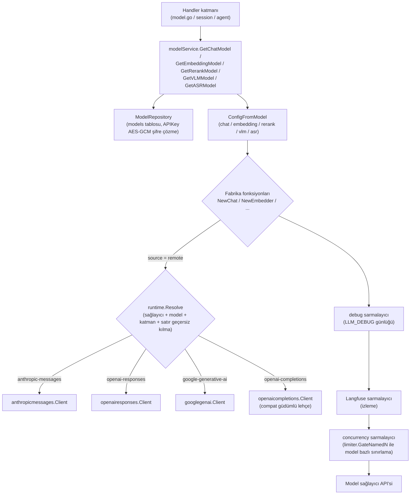

# Model yönetimi


<Screenshot
  src="/screenshots/settings-models.png"
  caption="Model ayarları: eklenen modelleri türe göre yönetin"
  hint="Model listesini (ad, tür, sağlayıcı simgesi ve adı, varsayılan işareti) ve «Model ekle» girişini gösterir." />

Model eklerken bağlantı yapılandırması ve dizin uyumluluğu kontrol edilmelidir:

- **Vektör modelini değiştirmek dizinin yeniden oluşturulmasını gerektirir**. Model, vektörlerin anlamsal uzayını ve boyutunu belirler; eski ve yeni vektörler doğrudan birlikte kullanılamaz;
- **Kaydetmeden önce bağlantıyı test edin**. Hizmet adresi, kimlik bilgileri ve model adının kullanılabilir olduğunu doğruladıktan sonra modeli bilgi tabanı veya agent için kullanın.

Model türleri, yapılandırma alanları ve kullanım durumları aşağıdaki açıklamalara göre sorgulanabilir.

## Model türünü seçin

| Tür | Amaç |
| --- | --- |
| Sohbet modeli | Soru-cevap, özet ve akıllı çıkarım içeriği üretir |
| Vektör modeli | Belgeleri ve soruları vektörlere dönüştürür, anlamsal aramayı destekler |
| Yeniden sıralama modeli | Geri çağrılan parçaları yeniden sıralar |
| Görsel model | Belgelerdeki veya konuşmalardaki görüntüleri tanır |
| Ses modeli | Sesi metne dönüştürür |

## Bağlantı ekleme ve doğrulama


1. **Sağlayıcıyı seçin**. Liste yalnızca mevcut model türünü destekleyen sağlayıcıları gösterir; seçimden sonra bu sağlayıcının veya modelin dokümantasyon sayfasına gidebilirsiniz. Uygun sağlayıcı yoksa "Özel (OpenAI uyumlu arayüz)" seçeneğini seçin.
2. **Model adını girin**. Sağlayıcının yerleşik model kataloğundan seçim yapabilirsiniz; seçeneklerde bağlam penceresi, vektör boyutu, çıkarım ve görsel yetenekler belirtilir. Katalogda olmayan bir model adını doğrudan da girebilirsiniz. Katalogdaki bir modeli seçtiğinizde, henüz doldurulmamış bağlam penceresi, maksimum çıktı tokens, görsel desteği ve vektör boyutu otomatik olarak doldurulur.
3. **Base URL ve API Key'i girin**, ayrıca sağlayıcının gerektirdiği ek alanları doldurun (bkz. [Sağlayıcıya özgü ek alanlar](#saglayici-ek-alanlari)). Kurumsal ağ geçidi üzerinden erişim gerekiyorsa özel istek başlıkları eklenebilir.
4. **"Gerçek çağrı yöntemini" kontrol edin**. Konuşma ve görsel modeller; istek protokolünü, yetenek kaynağını (yerleşik model profili veya sağlayıcı genel varsayılanı), istek adresini, düşünme anahtarı parametresini, isteğe bağlı düşünme yoğunluğunu, bağlam penceresini ve maksimum çıktı tokens değerini gerçek zamanlı gösterir; böylece kaydetmeden önce yapılandırmanın nasıl çağrılacağını doğrulayabilirsiniz.
5. **Bağlantıyı test ettikten sonra kaydedin**. Test, formda o anda girilmiş yapılandırmayı kullanır ve önce kaydetmeniz gerekmez; mevcut bir modeli düzenlerken API Key ayrı olarak kaydedilmiş değeri kullanır. Testten sonra yapılandırmayı değiştirirseniz yeniden test etmeniz gerekir.

<Screenshot
  src="/screenshots/model-editor-catalog.png"
  caption="Model ekleme: sağlayıcı kataloğundan model seçin ve gerçek çağrı yöntemini görüntüleyin"
  hint="'Model ekle' çekmecesini açın, tür olarak konuşmayı, kaynak olarak API'yi seçin; sağlayıcı olarak yerel bir sağlayıcıyı seçin (ör. Aliyun DashScope), bağlam penceresi / çıkarım / görsel işaretlerini göstermek için model adı açılır listesini genişletin; aynı anda aşağıdaki 'Gerçek çağrı yöntemi' paneli (istek protokolü, yetenek kaynağı, isteğe bağlı düşünme yoğunluğu) ve alttaki 'Bağlantıyı test et' düğmesi görünür olsun." />

"Gelişmiş seçenekler" altında şunları da ayarlayabilirsiniz:

| Seçenek | Uygulanabilir türler | Açıklama |
| --- | --- | --- |
| Vektör boyutu / Özel çıktı boyutu | Vektör | Boyut, dizinle aynı olmalıdır. "Özel çıktı boyutu" seçeneğini yalnızca modelin belirtilen boyutu desteklediğinden eminseniz etkinleştirin |
| Bağlam penceresi | Konuşma, görsel | Boş bırakılırsa varsayılan 200000 kullanılır. Sağlayıcı dokümantasyonundaki gerçek değeri girin; çok büyük bir değer girilmesi aracının geçmiş sıkıştırmasını tetiklemez ve üst akışın isteği doğrudan reddetmesine yol açar |
| Görsel/çok modlu destek | Konuşma | Modelin görüntü girdisini kabul edip etmediği |
| Maksimum çıktı tokens | Konuşma, görsel | Tek bir yanıtın çıktı üst sınırı; boş bırakılırsa katalogdaki ilgili modelin varsayılan değeri kullanılır |
| Arka plan eşzamanlılık sınırı | Konuşma, görsel, vektör | Belge içe aktarma, zenginleştirme gibi arka plan görevlerinin bu model için eşzamanlılık sayısını sınırlar; 0 veya boş değer genel varsayılanı kullanır ve etkileşimli konuşmaları etkilemez |
| Gelişmiş → Protokol geçersiz kılma | Konuşma, görsel | Belirli bir istek protokolünü zorla kullanır; genellikle "Otomatik" olarak bırakın |
| Gelişmiş → Uzak model adı | Uzak model | Sağlayıcıya gerçekte gönderilen model ID'si; model adından farklıysa doldurun |
| Gelişmiş → Protokol uyumluluk geçersiz kılma (JSON) | Uzak model | Tek tek arayüzlerin katalog varsayılanlarıyla uyuşmayan istek alanlarını düzeltir, ör. `{"max_tokens_field": "max_tokens"}`; boş bırakılırsa geçersiz kılma yapılmaz. Yazım ve alanlar için bkz. [Protokol uyumluluk geçersiz kılma](#protokol-uyumlulugu-gecersiz-kilma-compat-json) |

Eski sürümlerde kaydedilmiş konuşma modellerinde `thinking_control` ayarı varsa, gelişmiş bölümde ek olarak "Düşünme parametresi biçimi (eski yapılandırma)" gösterilir. "Katalog varsayılanına uy" olarak değiştirildiğinde düşünme parametrelerinin yazımı model kataloğu tarafından belirlenir.

Model kataloğu, konuşma modelinin düşünüp düşünemeyeceğini ve seçilebilir düşünme yoğunluklarını belirler (kapalı, otomatik, çok düşük, düşük, orta, yüksek, çok yüksek ve maksimumun bir kısmı). Aracıda veya konuşmada seçilen yoğunluk model tarafından desteklenmiyorsa en yakın kullanılabilir seviyeye ayarlanır.

### Protokol uyumluluğu geçersiz kılma compat JSON {#protokol-uyumlulugu-gecersiz-kilma-compat-json}

Hepsi "OpenAI uyumlu" arayüz olsa da sağlayıcıların istek alanı gereksinimleri farklıdır: bazıları yalnızca `max_tokens` kabul eder, bazıları düşünmeyi farklı alanlarla açıp kapatır, çıkarım modelleri `temperature` değerini reddedebilir. Yerleşik sağlayıcılar ve eklenmiş modeller için bu farklılıklar model kataloğunda zaten tanımlıdır; genellikle bu alanı doldurmanız gerekmez. Bu seçenek, uzak modellerin (Rethra bulut hizmeti hariç) "Gelişmiş seçenekler → Gelişmiş" bölümünde bulunur ve yalnızca aşağıdaki durumlarda elle geçersiz kılınmalıdır:

- Kendi çıkarım hizmetleri (vLLM, SGLang vb.) veya aktarma ağ geçitleri için arayüz davranışı ve sağlayıcı varsayılanları farklıdır;
- Sağlayıcının yeni yayımladığı model henüz kataloğa eklenmemiştir, "Gerçek çağırma yöntemi" panelinde "Sağlayıcı genel varsayılanı (bu model eklenmemiş)" görüntülenir ve çağrı hata verir;
- Sağlayıcı arayüzü değiştirmiştir ve yükseltmeden önce geçici bir düzeltme gerekir.

#### Doldurma kuralları

1. **Önce protokole bakın**. Sohbet ve görsel modellerin alanları, "Gerçek çağırma yöntemi" panelindeki "İstek protokolü"ne bağlıdır ve yalnızca bu protokolün alanları kabul edilir; "Protokol geçersiz kılma" değiştirilirse JSON da yeni protokolün alanlarına göre değiştirilmelidir. Vektör, yeniden sıralama ve ses modellerinin her biri protokolden bağımsız kendi alan grubunu kullanır.
2. **Yalnızca değiştirilecek anahtarları yazın**. Yazılmayan anahtarlar katalog varsayılanlarını kullanmaya devam eder. `extra_body` gibi nesneler anahtara göre birleştirilir, diziler ise tamamen değiştirilir.
3. **Kaydederken doğrulama yapılır**. Girdi bir JSON nesnesi olmalıdır. Anahtar adı yanlış yazılırsa, değer türü hatalıysa veya numaralandırma değeri yoksa kayıt başarısız olur ve nedeni gösterilir; hata sohbet sırasında ortaya çıkana kadar beklenmez.
4. **Değişiklikten sonra test edin**. "Bağlantıyı test et", önce kaydetmeye gerek olmadan mevcut formdaki yapılandırmayı kullanır.

Buradaki geçersiz kılmalar sağlayıcı varsayılanlarından ve model kataloğundan daha yüksek önceliğe sahiptir; eski yapılandırmalardaki "Düşünme parametresi biçimi" ve "Uzak model adı" yine en son uygulanır. Model kataloğunda düşünmenin desteklenmediği belirtilen modeller için düşünmeyle ilgili alanlar yok sayılır.

`extra_body` yalnızca Rethra'nın yazmadığı alanları ekler; Rethra tarafından oluşturulan `model`, `messages`, `max_tokens` gibi alanların üzerine yazamaz.

#### Yaygın senaryolar

| Belirti | Doldurulacak değer |
| --- | --- |
| `max_completion_tokens` tanınmıyor hatası | `{"max_tokens_field": "max_tokens"}` |
| Çıkarım modeli `temperature` / `top_p` değerlerini reddediyor | `{"supports_temperature": false}` |
| Arayüz yalnızca sabit sıcaklığı kabul ediyor (örneğin 1) | `{"fixed_temperature": 1}` |
| vLLM / SGLang ile dağıtılan Qwen3 gibi karma düşünme modellerinde düşünme kapatılamıyor veya açılamıyor | `{"thinking_format": "chat-template-kwargs"}` |
| Ağ geçidi akışlı kullanım bilgisini desteklemiyor, akışlı istek hata veriyor | `{"supports_usage_in_streaming": false}` |
| Ağ geçidi resim içeren ileti yapısını reddediyor | `{"supports_multi_content": false}` (Yalnızca metin gönderilir, resimler atılır) |
| Sağlayıcıya özgü parametreler eklemek gerekiyor, örneğin Alibaba Cloud çevrim içi arama | `{"extra_body": {"enable_search": true}}` |
| Çok turlu sohbette düşünme içeriği geri gönderilirken hata oluşuyor | `{"replay_reasoning_content": false}` |
| Kendi vektör hizmeti tek istekte yalnızca 16 öğe kabul ediyor | `{"max_batch_size": 16}` |
| Vektör veya yeniden sıralama hizmeti yavaş yanıt veriyor, daha uzun zaman aşımı gerekiyor | `{"request_timeout_seconds": 120}` |
| Kendi yeniden sıralama hizmeti normalize edilmemiş puanlar (logit) döndürüyor | `{"score_scale": "logit"}` |

#### Alan başvurusu

Aşağıdaki tablodaki "Protokol varsayılanı", herhangi bir sağlayıcı, katalog veya geçersiz kılma olmadığındaki değerdir; belirli bir sağlayıcının gerçek değerleri için "Gerçek çağırma yöntemi" panelini esas alın.

**OpenAI Chat Completions (`openai-completions`) **: Çoğu "OpenAI uyumlu" sağlayıcı, kendi barındırılan hizmet ve ağ geçidi bu protokolü kullanır.

| Alan | Tür | Protokol varsayılanı | Açıklama |
| --- | --- | --- | --- |
| `max_tokens_field` | string | `max_completion_tokens` | Çıktı sınırı alanının adı: `max_tokens` veya `max_completion_tokens`; yalnızca biri gönderilir |
| `thinking_format` | string | `none` | Düşünme anahtarının biçimi: `none` gönderilmez; `openai` yalnızca `reasoning_effort` gönderir; `thinking-type` `{"thinking": {"type": ...}}` gönderir; `enable-thinking` `enable_thinking` gönderir (bütçe alanıyla birlikte); `chat-template-kwargs` `chat_template_kwargs.enable_thinking` gönderir (vLLM / SGLang); `openrouter` `{"reasoning": ...}` gönderir |
| `thinking_enabled_value` | string | `enabled` | `thinking-type` biçiminde düşünme etkinleştirildiğinde kullanılan `type` değeri (örneğin MiniMax `adaptive` kullanır) |
| `thinking_always_send` | bool | false | Düşünme tercihi belirtilmemiş olsa da anahtarı gönder |
| `thinking_disable_on_non_stream` | bool | false | Akışsız çağrılarda düşünmeyi zorla devre dışı bırakır (bazı modeller yalnızca akışta düşünmeye izin verir) |
| `thinking_budget_field` | string | boş | Düşünme bütçesi alanının adı; örneğin `thinking_budget`; boşsa gönderilmez |
| `thinking_budget_excludes_effort` | bool | false | Sağlayıcı bütçe ile `reasoning_effort` değerinin aynı anda bulunmasına izin vermiyorsa true yapın; yalnızca düşünme yoğunluğu korunur |
| `supports_reasoning_effort` | bool | false | Düşünme yoğunluğunun ayrıca gönderilip gönderilmeyeceği |
| `reasoning_effort_field` | string | `reasoning_effort` | Düşünme yoğunluğu alanının adı |
| `supports_developer_role` | bool | false | Akıl yürütme modellerinin sistem istemi için `developer` rolünü kullanır |
| `supports_store` | bool | false | Sunucunun konuşmayı saklamamasını istemek için `store: false` gönderir |
| `supports_usage_in_streaming` | bool | true | Kullanımı hesaplamak için akış istekleriyle `stream_options.include_usage` gönderir |
| `supports_temperature` | bool | true | false olduğunda hiçbir örnekleme parametresi gönderilmez (sıcaklık, top_p, ceza öğeleri) |
| `fixed_temperature` | number | yok | Sabit olarak gönderilen sıcaklık değeri |
| `supports_seed` | bool | true | `seed` gönderilip gönderilmeyeceği |
| `tool_choice_modes` | string[] | `none`, `auto`, `required`, `function` | İzin verilen `tool_choice` değerleri |
| `supports_parallel_tool_calls` | bool | true | `parallel_tool_calls` gönderilip gönderilmeyeceği |
| `supports_response_format` | bool | true | JSON çıktısı gerektiğinde `response_format` gönderilip gönderilmeyeceği |
| `supports_multi_content` | bool | true | false olduğunda metin ve görsel karışık iletilerde yalnızca metin kısmı korunur |
| `replay_reasoning_content` | bool | true | Çok turlu konuşmalarda önceki düşünme içeriğini modele geri gönderir |
| `reasoning_fields` | string[] | `reasoning_content`, `reasoning`, `reasoning_text` | Yanıttan düşünme metninin okunacağı alanlar; sırayla ilk bulunan alınır |
| `tool_call_extra_fields` | string[] | boş | Araç çağrılarında olduğu gibi geri gönderilmesi gereken ek alanlar (örneğin OpenAI uyumlu uç nokta üzerinden Gemini çağrılırken kullanılan `extra_content`) |
| `prompt_cache_key` | bool | false | Aynı konuşmanın istem önbelleğine ulaşmasını sağlamak için `prompt_cache_key` gönderir |
| `cache_control_format` | string | boş | `anthropic` olarak ayarlandığında önbellek kesme noktalarını Anthropic biçiminde ekler |
| `prompt_cache_accounting` | bool | false | Sağlayıcı, istatistikler için önbellek isabeti kullanımını döndürür |
| `extra_body` | object | boş | Her isteğe eklenecek alanlar |

**OpenAI Responses (`openai-responses`) **: OpenAI resmi arayüzü (`api.openai.com`) tarafından varsayılan olarak kullanılır.

| Alan | Tür | Protokol varsayılanı | Açıklama |
| --- | --- | --- | --- |
| `supports_developer_role` | bool | true | Sistem istemi `developer` rolünü kullanır |
| `supports_max_output_tokens` | bool | true | `max_output_tokens` gönderilip gönderilmeyeceği |
| `supports_reasoning_summary` | bool | true | Düşünme özeti istenip istenmeyeceği |
| `supports_encrypted_reasoning` | bool | true | Şifrelenmiş düşünme içeriğinin istenip geri gönderilip gönderilmeyeceği |
| `supports_store` | bool | true | `store: false` gönderir |
| `supports_temperature` | bool | true | false olduğunda örnekleme parametreleri gönderilmez |
| `prompt_cache_key` | bool | true | İstem önbellek anahtarını gönderir |
| `supports_long_cache_retention` | bool | true | 24 saatlik uzun önbelleğe izin verir |
| `supports_parallel_tool_calls` | bool | true | `parallel_tool_calls` gönderilip gönderilmeyeceği |
| `extra_body` | object | boş | Her isteğe eklenecek alanlar |

**Anthropic Messages (`anthropic-messages`) **: Anthropic ve `base_url` değeri `/anthropic` ile biten uyumlu arayüzler.

| Alan | Tür | Protokol varsayılanı | Açıklama |
| --- | --- | --- | --- |
| `thinking_mode` | string | `budget` | `budget`, düşünmeyi bütçeye göre etkinleştirir; `adaptive`, kararın modeli tarafından verilmesini sağlar ve yoğunluk `output_config.effort` üzerinden iletilir |
| `supports_effort` | bool | false | Düşünme yoğunluğunun gönderilip gönderilmeyeceği |
| `thinking_budgets` | object | minimal 1024, low 2048, medium 8192, high 16384, xhigh 32768, max 63999 | Her düşünme yoğunluğuna karşılık gelen `budget_tokens`; anahtarlar `minimal`/`low`/`medium`/`high`/`xhigh`/`max` şeklindedir |
| `default_max_tokens` | int | 4096 | Çıktı üst sınırı ayarlanmadığında kullanılan `max_tokens` (bu protokolde zorunludur) |
| `supports_temperature` | bool | true | Sıcaklığın gönderilip gönderilmeyeceği |
| `temperature_with_thinking` | bool | false | Düşünme etkinleştirildiğinde sıcaklığın yine de gönderilip gönderilmeyeceği |
| `supports_top_p` | bool | true | `top_p` gönderilip gönderilmeyeceği |
| `supports_cache_control` | bool | true | Önbellek kesme noktalarının eklenip eklenmeyeceği |
| `supports_cache_control_on_tools` | bool | true | Araç tanımlarına önbellek kesme noktası eklenip eklenmeyeceği |
| `long_cache_ttl` | string | `1h` | Uzun önbelleğin geçerlilik süresi |
| `version` | string | `2023-06-01` | `anthropic-version` istek başlığı |
| `beta_headers` | string[] | Boş | Ek `anthropic-beta` istek başlıkları |
| `interleaved_thinking_beta` | string | `interleaved-thinking-2025-05-14` | Düşünme ve araçlar birlikte kullanıldığında eklenen beta tanımlayıcısı; boş dize gönderilmemesi anlamına gelir |
| `prompt_cache_accounting` | bool | true | Sağlayıcı önbellek isabeti kullanımını döndürür |
| `extra_body` | object | Boş | Her isteğe eklenen alanlar |

**Gemini (`google-generative-ai`) **: Gemini yerel arayüzü.

| Alan | Tür | Protokol varsayılanı | Açıklama |
| --- | --- | --- | --- |
| `thinking_mode` | string | `budget` | `budget`, `thinkingBudget` gönderir (Gemini 2.5); `level`, `thinkingLevel` gönderir (Gemini 3 ve sonrası); `none`, düşünme yapılandırması göndermez |
| `thinking_budgets` | object | minimal 128, low 2048, medium 8192, high 24576, xhigh 32768, max 32768 | Her düşünme yoğunluğuna karşılık gelen `thinkingBudget` |
| `include_thoughts` | bool | true | Düşünme içeriğinin döndürülüp döndürülmeyeceği |
| `supports_seed` | bool | true | `seed` gönderilip gönderilmeyeceği |
| `supports_penalty` | bool | true | Sıklık / varlık cezalarının gönderilip gönderilmeyeceği |
| `extra_generation_config` | object | Boş | `generationConfig` içine eklenen alanlar |
| `prompt_cache_accounting` | bool | true | Sağlayıcı önbellek isabeti kullanımını döndürür |
| `api_version_prefix` | string | `/v1beta` | `base_url` yalnızca ana makineyle doldurulduğunda eklenen sürüm yolu |

**Vektör Modelleri**

| Alan | Tür | Protokol varsayılanı | Açıklama |
| --- | --- | --- | --- |
| `api` | string | Sağlayıcı varsayılanı | Vektör protokolü: `openai-embeddings`, `dashscope-embeddings`, `ark-embeddings`, `google-embeddings` |
| `path` | string | Boş | `base_url` sonrasına eklenen yol |
| `send_encoding_format` | bool | false | `encoding_format: "float"` gönderilip gönderilmeyeceği |
| `dimensions_field` | string | Boş | Çıktı boyutunu belirten alan adı; yalnızca "özel çıktı boyutu" etkinleştirildiğinde gönderilir |
| `truncate_field` / `truncate_value` | string | Boş | Girdi çok uzun olduğunda sunucunun kırpması için anahtar alan ve değeri |
| `input_type_field` | string | Boş | "belge" ve "sorgu"yu ayıran alan adı |
| `input_type_values` | object | boş | `document` ve `query` olmak üzere iki girdi türü için karşılık gelen değerler |
| `max_batch_size` | int | 0 (sınırsız) | Tek istekteki azami öğe sayısı; aşılırsa otomatik olarak gruplara ayrılır |
| `max_input_chars` | int | 0 (sınırsız) | Tek bir girdinin azami karakter sayısı |
| `accepts_truncate_prompt_tokens` | bool | false | Hizmetin vLLM `truncate_prompt_tokens` desteği olup olmadığı |
| `request_timeout_seconds` | int | 60 | Tek istek zaman aşımı (saniye) |
| `extra_body` | object | boş | Her isteğe eklenen alanlar |

**Yeniden sıralama modeli**

| Alan | Tür | Protokol varsayılanı | Açıklama |
| --- | --- | --- | --- |
| `path` | string | boş | `base_url` sonrasına eklenen yol |
| `send_top_n` | bool | false | `top_n` gönderilip gönderilmeyeceği (gönderilmezse tüm belgeler döndürülür) |
| `send_return_documents` | bool | false | Sunucunun belge özgün metnini geri göndermesinin istenip istenmeyeceği |
| `score_scale` | string | `probability` | Puan anlamı: `probability` (0-1) veya `logit` (normalize edilmemiş). Hatalı değer, alaka eşiğini geçersiz kılar |
| `truncate` | string | boş | Sunucu tarafı kesme ayarı (ör. NIM `END`) |
| `max_documents` / `max_query_chars` / `max_document_chars` / `max_request_chars` | int | 0 (sınırsız) | Tek istekte belge sayısı, sorgu uzunluğu, belge başına uzunluk ve toplam uzunluk sınırı; aşılırsa otomatik olarak gruplara ayrılır |
| `max_concurrency` | int | 0 (varsayılan kullanılır) | Gruplamadan sonra eşzamanlı gönderilen istek sayısı |
| `accepts_truncate_prompt_tokens` | bool | false | Hizmetin vLLM `truncate_prompt_tokens` desteği olup olmadığı |
| `request_timeout_seconds` | int | 0 (varsayılan 60 saniye) | Tek istek zaman aşımı (saniye); zaman aşımı çağrı hatası olarak işlenir, arama geri dönüşü çağırma sırasına göre yapılır |
| `extra_body` | object | boş | Her isteğe eklenen alanlar |

**Konuşma tanıma modeli**

| Alan | Tür | Protokol varsayılanı | Açıklama |
| --- | --- | --- | --- |
| `api` | string | sağlayıcı varsayılanı | `openai-transcriptions` (ses dosyası yükleme) veya `openai-chat-audio` (sohbet isteğinde ses taşıma) |
| `path` | string | `/audio/transcriptions` | `base_url` sonrasına eklenen yol |
| `response_format` | string | boş | Gönderilen `response_format`; segmentli sonuçlar gerektiğinde `verbose_json` girin |
| `language_param` | string | boş | Dil ipucunun konumu: `form`, `header`, `asr_options`; boşsa gönderilmez |
| `max_file_bytes` / `max_encoded_bytes` | int | 0 (sınırsız) | Ses dosyası ve base64 kodlamasından sonraki boyut için üst sınır |
| `formats` | string[] | Boş (sınırsız) | Kabul edilen ses uzantıları (nokta olmadan) |
| `request_timeout_seconds` | int | 300 | Tek istek zaman aşımı (saniye) |

## Yerleşik sağlayıcılar {#yerlesik-saglayicilar}


| Sağlayıcı | ID | Sohbet | Vektör | Yeniden sıralama | Görsel | Ses |
| --- | --- | :-: | :-: | :-: | :-: | :-: |
| Özel (OpenAI uyumlu arayüz) | `generic` | ✓ | ✓ | ✓ | ✓ | ✓ |
| Alibaba Cloud DashScope | `aliyun` | ✓ | ✓ | ✓ | ✓ | ✓ |
| Zhipu BigModel | `zhipu` | ✓ | ✓ | ✓ | ✓ | ✓ |
| Volcengine | `volcengine` | ✓ | ✓ | ✓ | ✓ | |
| Tencent Hunyuan | `hunyuan` | ✓ | ✓ | | | |
| SiliconFlow | `siliconflow` | ✓ | ✓ | ✓ | ✓ | ✓ |
| MiniMax | `minimax` | ✓ | | | | ✓ |
| Moonshot | `moonshot` | ✓ | | | ✓ | |
| Xiaomi MiMo | `mimo` | ✓ | | | | ✓ |
| ModelScope | `modelscope` | ✓ | ✓ | | ✓ | |
| Baidu Qianfan | `qianfan` | ✓ | ✓ | ✓ | ✓ | |
| Qiniu Cloud | `qiniu` | ✓ | | | | |
| Meituan LongCat | `longcat` | ✓ | | | | |
| Tencent Cloud LKEAP | `lkeap` | ✓ | | ✓ | | |
| DeepSeek | `deepseek` | ✓ | | | | |
| OpenAI | `openai` | ✓ | ✓ | | ✓ | ✓ |
| Azure OpenAI | `azure_openai` | ✓ | ✓ | | ✓ | |
| Anthropic | `anthropic` | ✓ | | | | |
| Google Gemini | `gemini` | ✓ | ✓ | | | |
| OpenRouter | `openrouter` | ✓ | ✓ | ✓ | ✓ | ✓ |
| LiteLLM | `litellm` | ✓ | ✓ | ✓ | ✓ | ✓ |
| Requesty | `requesty` | ✓ | ✓ | | ✓ | ✓ |
| Jina | `jina` | | ✓ | ✓ | | |
| NVIDIA | `nvidia` | ✓ | ✓ | ✓ | ✓ | |
| Novita AI | `novita` | ✓ | ✓ | ✓ | ✓ | |
| GPUStack | `gpustack` | ✓ | ✓ | ✓ | ✓ | ✓ |

Tablodaki “Görsel”, görsel model türünde bu sağlayıcının seçilebileceğini belirtir; sohbet modelinin görüntü kabul edip etmediği, model kataloğuna ve “Görsel/çok modlu desteği” anahtarına bağlıdır. Rethra bulut hizmeti için önce ayarlarda bulut hizmeti kimlik bilgilerini kaydetmeniz gerekir; model adı olarak `chat`, `embedding`, `rerank`, `vlm` seçilebilir.

Sağlayıcı listesi, varsayılan adresler ve model kataloğu sunucu tarafından gönderilir (`GET /api/v1/models/providers`); operasyon ekibi [dağıtım katmanı](#dagitim-katmani-config-models-json) ile sağlayıcıları değiştirebilir veya ekleyebilir.

## Başvuruları görüntüleme ve yapılandırmayı ayarlama

Bilgi tabanları ve aracılar modellere yönelik başvuruları kaydeder. Bir modeli silmeden önce bağımlılık ayrıntıları kontrol edilmelidir; yerleşik modeller YAML yapılandırmasıyla yönetilir ve yapılandırma dosyasında korunmalıdır.

Model hata ayıklayıcısı, kaydedilmiş modellere gerçek istekler gönderir; süreyi, hassas verileri maskelenmiş istekleri ve yanıt sonuçlarını gösterir; vektör boyutlarını, yeniden sıralama puanlarını veya akış çıktısını kontrol etmek için kullanılabilir. Düşünebilen sohbet modelleri için hata ayıklayıcıda düşünme yoğunluğu seçilebilir; sonuçlarda gerçek istek protokolü ve düşünme anahtarı parametreleri gösterilir. Çağrı hacmi ve önbellek kullanım durumu [gözlemlenebilirlik ve denetim](16-observability.md) ile birlikte incelenebilir.

## Yapılandırma ve çağrı başvurusu

### Model türleri ve kullanım amaçları

Model türleri `internal/types/model.go` içinde tanımlanır:

```go
const (
    ModelTypeEmbedding   ModelType = "Embedding"   // Embedding model
    ModelTypeRerank      ModelType = "Rerank"      // Rerank model
    ModelTypeKnowledgeQA ModelType = "KnowledgeQA" // KnowledgeQA model
    ModelTypeVLLM        ModelType = "VLLM"        // VLLM model
    ModelTypeASR         ModelType = "ASR"         // ASR model
)
```

| Tür | Ön yüz tanımlayıcısı | İstemci paketi | Arayüz | Kullanım amacı |
|------|---------|---------|------|------|
| `KnowledgeQA` | `chat` | `internal/models/chat` | `Chat` / `ChatStream` (Tools, Thinking ve çok modlu mesajları destekler) | Bilgi soru-cevap, Agent çıkarımı, özet / soru üretimi / grafik çıkarımı gibi tüm LLM çağrıları |
| `Embedding` | `embedding` | `internal/models/embedding` | `Embed` / `BatchEmbed` (`GetDimensions` dahil) | Vektör arama indeksleme ve sorgulama için metin vektörleştirme |
| `Rerank` | `rerank` | `internal/models/rerank` | `Rerank(query, documents)`, `RankResult` döndürür | Arama sonuçlarının yeniden sıralanması |
| `VLLM` | `vllm` | `internal/models/vlm` | `Predict(imgBytes, prompt)` | Görsel dil modeli (VLM), belge görseli anlama / çok modlu ayrıştırma |
| `ASR` | `asr` | `internal/models/asr` | `Transcribe(audioBytes, fileName)` metin döndürür; model sağladığında bölüm zaman damgaları da eklenir (ör. OpenAI `whisper-1`) | Ses dökümü (otomatik konuşma tanıma) |

Ön yüz ve arka uç tür eşlemesi için `internal/handler/model_catalog.go` içindeki `modelTypeToFrontend()` işlevine bakın (`KnowledgeQA -> chat` vb.). Model oluşturma REST arayüzü `type` değerini olduğu gibi saklar; çağıran taraf arka uç değerini (`KnowledgeQA` vb.) göndermelidir. Ancak `model_type` sorgu parametresi her iki yazımı da kabul eder.


### Model yapılandırma alanları {#model-yapilandirma-alanlari}

Model varlığı `types.Model` içindeki `Parameters` (`internal/types/model.go` içindeki `ModelParameters`):

| Ad | Tür | Varsayılan değer | Açıklama |
|------|------|--------|------|
| `base_url` | string | Boş (sağlayıcının varsayılan adresi kullanılır) | Model API adresi; oluşturma/güncelleme sırasında SSRF denetiminden geçirilir (`ValidateURLForSSRF`) |
| `api_key` | string | Boş | API anahtarı, **AES-256-GCM ile şifrelenerek veritabanında saklanır** (`ModelParameters.Value/Scan`). Oluşturma sırasında istekle gönderilebilir; sonrasında yalnızca `PUT /models/:id/credentials` alt kaynağı üzerinden değiştirilebilir |
| `embedding_parameters.dimension` | int | 0 | Vektör boyutu |
| `embedding_parameters.truncate_prompt_tokens` | int | 0 | Sunucu tarafı token kesme sayısı. Bu, vLLM genişletme parametresidir ve yalnızca `generic`, `gpustack` için gönderilir (0 olduğunda önceki değer 511 kullanılır); yönetilen sağlayıcıların belgelerinde bulunmadığından asla gönderilmez |
| `embedding_parameters.supports_dimension_override` | bool | false | İstekte vektör boyutunun belirtilip belirtilmeyeceği. Alan adı sağlayıcı tarafından belirlenir (OpenAI ailesi `dimensions`, Gemini `outputDimensionality`, Bailian çok modlu `parameters.dimension`); sağlayıcı belgelerinde bu parametresi olmayan modellerde (NVIDIA NIM, Hunyuan, Novita, ada-002 vb.) işaretlense bile gönderilmez |
| `provider` | string | boş (BaseURL'ye göre otomatik algılanır) | Sağlayıcı ID'si, değerler için bkz. [Yerleşik sağlayıcılar](#yerlesik-saglayicilar) |
| `extra_config` | map[string]string | nil | Sağlayıcıya özgü ek alanlar (sonraki bölüme bakın); ayrılmış anahtarlar: `api` (zorunlu sohbet protokolü), `remote_model_name` (uzak model adı), `thinking_control` (eski düşünme parametresi biçimi) |
| `spec` | object | nil | Tek satırlık katalog geçersiz kılma: `api`, `reasoning`, `input`, `context_window`, `max_output_tokens`, `thinking_levels`, `compat` (protokolle ilgili düz JSON) |
| `custom_headers` | map[string]string | nil | Ek özel HTTP istek başlıkları (OpenAI SDK `extra_headers` benzeri; `Authorization`, `api-key` gibi ayrılmış başlıklar çalışma zamanında yok sayılır) |
| `supports_vision` | bool | false | Sohbet modelinin görsel çok modlu girdileri kabul edip etmediği |
| `context_window` | int | 0 (200000 değerine geri döner) | Sohbet/VLM bağlam penceresi (token). Aracı, geçmişi bu üst sınıra göre yükler ve sıkıştırır; hizmetin gerçekten desteklediği pencere boyutu girilmelidir, çok yüksek bir değer sıkıştırmanın zamanında tetiklenmemesine yol açar |
| `max_output_tokens` | int | 0 (katalog varsayılanı kullanılır) | Sohbet/VLM tek yanıtı için çıktı üst sınırı |
| `max_concurrency` | int | 0 (genel `model.max_concurrency` değerine geri döner) | Bu modelin arka plan görevleri için eşzamanlılık üst sınırı (yalnızca chat/vlm/embedding için geçerlidir) |
| `app_id` / `app_secret` | string | Boş | Rethra bulut hizmeti kimlik bilgileri; LKEAP / Volcengine yeniden sıralama için ikinci bölüm anahtarı da `app_secret` içinde saklanır. `app_secret` AES ile şifrelenerek saklanır |

Model düzeyi alanlar ayrıca `name` (çalışma zamanında gerçekten çağrılan model adı), `display_name`, `type`, `source`, `is_default` (aynı `(tenant_id, type)` kümesinde tek varsayılan), `is_builtin`, `managed_by`, `status` (`active` / `downloading` / `download_failed`) alanlarını içerir.

Uzak sohbet ve görsel modellerin sorgu yanıtları, sunucunun katalogdan ayrıştırarak belirlediği `capabilities` değerlerini (protokol, düşünebilme durumu, isteğe bağlı düşünme düzeyleri, bağlam penceresi vb.) içerir.

### Sağlayıcı ek alanları {#saglayici-ek-alanlari}

Sağlayıcılar tanımlarında ek alanlar bildirir; düzenleyici bunları buna göre dinamik olarak oluşturur ve değerler `extra_config` içine kaydedilir (gizli olarak işaretlenen alanlar tekrar gösterilmez, yalnızca yapılandırılmış olup olmadıkları döndürülür):

| Sağlayıcı | Alan | Uygulanabilir tür | Açıklama |
| --- | --- | --- | --- |
| Azure OpenAI | `api_version` | Tümü | Boş bırakılırsa `/openai/v1` veri düzlemi kullanılır; sürüm numarası (ör. `2025-04-01-preview`) girilirse eski `/openai/deployments/{dagitim_adi}` yolu kullanılır |
| Tencent Cloud LKEAP | SecretKey (zorunlu, gizli olarak şifrelenip kaydedilir), `region` (varsayılan `ap-guangzhou`) | Yeniden sıralama | Yeniden sıralama arayüzü TC3 imzasını kullanır; API Key alanına SecretId girilir |
| Volcengine | SecretKey (zorunlu, gizli olarak şifrelenip kaydedilir), `region` (varsayılan `cn-beijing`), `instruction` | Yeniden sıralama | Yeniden sıralama arayüzü AK/SK imzasını kullanır; API Key alanına Access Key ID girilir; `instruction` varsayılan olarak konsoldaki özgün metindir |
| Özel, GPUStack, LiteLLM | `score_scale` | Yeniden sıralama | "Rerank puan ölçeği": `probability` (0~1 alaka düzeyi, BGE türü) veya `logit` (sınırsız puan, Qwen3-Reranker türü; yeniden sıralama eşiğiyle karşılaştırılmadan önce 0~1 aralığına dönüştürülür). Uç noktanın arkasında gerçekten dağıtılmış modele göre seçin |
| Özel, GPUStack | `truncate_prompt_tokens` | Yeniden sıralama | vLLM genişletme parametresi; varsayılan olarak gönderilmez. Yalnızca arka uç belge çok uzun olduğu için hata verdiğinde girin |

#### Yönetim API'si (`internal/router/routes_infra.go`)

| Yöntem & yol | Açıklama |
|-------------|------|
| `GET /models/providers` | `model_type` ile desteklenen sağlayıcı tanımlarını sorgular (simge, varsayılan adres, ek alanlar, model kataloğu dahil) |
| `GET` / `POST /models/catalog/resolve` | Bir yapılandırma satırının gerçek çağrı yöntemini (protokol, düşünme düzeyi, bağlam), yani düzenleyicideki "Gerçek çağrı yöntemi"ni çözümler |
| `POST /models` / `GET /models` / `GET /models/:id` / `PUT /models/:id` / `DELETE /models/:id` | Model CRUD |
| `PUT /models/:id/credentials`, `DELETE /models/:id/credentials/:field` | Kimlik bilgisi alt kaynağı; `PUT /models/:id` istek gövdesindeki `api_key` zorla yok sayılır ve uyarı verilir |
| `POST /models/:id/debug` | Model hata ayıklama (aşağıya bakın) |

Tam istek ve yanıtlar için bkz. [API başvurusu: modeller ve başlatma](../04-api/02-api-model-system.md).

### Model sağlık denetimi / bağlantı testi

İki mekanizma da kimlik bilgilerini sunucuda tutar ve düz metin gizli anahtarları geri göndermez:

1. **Bağlantıyı test et** (`internal/handler/initialization.go`, model düzenleyicisindeki "Bağlantıyı test et" düğmesi için):
   - `POST /initialization/remote/check` — Chat modeli (`CheckRemoteModel` / `checkChatModelConnection`)
   - `POST /initialization/embedding/test` — Embedding (`TestEmbeddingModel`)
   - `POST /initialization/rerank/check` — Rerank (`CheckRerankModel`)
   - `POST /initialization/asr/check` — ASR (`CheckASRModel`)
   - `POST /initialization/multimodal/test` — VLM çok modlu ayrıştırma (`TestMultimodalFunction`)

   İstek gövdesi `ModelTestRequest`, `modelId` taşıyabilir: `fillSecretsFromStoredModel`, istekte eksik olan `APIKey` / `AppSecret`, `extraConfig` ve `spec` değerlerini kaydedilmiş modelden (şifresi çözüldükten sonra) tamamlar; böylece "BaseURL'yi değiştirip eski gizli anahtarla tek tıkla doğrulama" sağlanır ve ön yüzün düz metin gizli anahtarı alması gerekmez veya mümkün değildir. `buildTestModel`, isteği **veritabanına kaydedilmeyen** geçici bir `*types.Model` nesnesine dönüştürür ve üretim yoluyla aynı `ConfigFromModel` eşlemesini paylaşır.

2. **Model hata ayıklayıcı** (`POST /models/:id/debug`, `ModelHandler.DebugModel`): Kaydedilmiş model için türüne göre gerçek çağrı başlatır ve tam normalleştirilmiş yanıtı döndürür — Chat akışlı çalışır, düşünme yoğunluğu (`options.reasoning_effort`) belirtilebilir ve protokol, düşünme anahtarı parametreleri gibi gözlem öğeleri toplanır; Embedding vektörü ve boyutu döndürür; Rerank puanlama sonuçlarını döndürür; VLM / ASR dosya yüklemeyi kabul eder. Yanıt, `elapsed_ms`, maskelenmiş istek ön izlemesi ve `observations` içerir.

### Yerleşik model mekanizması

`internal/types/builtin_models_config.go`, bildirime dayalı yerleşik modelleri uygular: başlangıçta `config/builtin_models.yaml` dosyasını (`BUILTIN_MODELS_CONFIG` tarafından belirtilen yol veya şablon için `config/builtin_models.yaml.example`) okur, her girdiyi `models` tablosuna UPSERT eder; `is_builtin=true`, `managed_by="yaml"`, varsayılan `tenant_id=10000` (`DefaultBuiltinModelTenantID`) olarak ayarlanır ve tüm kiracılar tarafından görünür olur.

Temel davranışlar (`LoadBuiltinModelsConfig`):

- Tüm dize alanları `${ENV_NAME}` ortam değişkeni enterpolasyonunu destekler; ayarlanmamış değişkenler, yapılandırma hatalarını görünür kılmak için değişmez olarak korunur.
- Her başlangıçta `id` üzerinden UPSERT yapılır ve `deleted_at` zorla NULL olarak sıfırlanır (dosyada yeniden görünen girdiler yeniden etkinleşir).
- **Sapma temizliği**: `managed_by='yaml'` olan ancak kimliği artık dosyada bulunmayan satırlar geçici olarak silinir; YAML'den bir girdiyi kaldırmak, yerleşik bir modeli devre dışı bırakmanın resmi yoludur.
- Bir yönetici çalışma zamanında bir satırı devraldıktan (`managed_by` boşlandıktan) sonra, YAML yükleyicisi bu satırı atlar (`"preserving runtime override"`).
- `is_default: true` girdileri, önce aynı `(tenant_id, type)` kümesindeki diğer varsayılanları temizler; böylece API yoluyla tutarlı olan tek varsayılan değişmezi korunur.
- Doğrulama kuralları: id boş olmamalı ve ≤64 karakter olmalıdır (`ModelIDMaxLen`); type şu değerlerden biri olmalıdır: `KnowledgeQA | Embedding | Rerank | VLLM | ASR`; status geçerli veya boş olmalıdır. YAML ayrıştırması başarısız olursa uzlaştırma durdurulur (sapma temizliği yapılmaz).
- `parameters`, REST arayüzüyle aynı katalog doğrulamasını kullanır (`runtime.ValidateRow`): ayrıştırılamayan satırlar (bilinmeyen protokol, yanlış yazılmış compat anahtarı, geçersiz düşünme seviyesi) yalnızca WARN üretir ve başlangıcı engellemez.

YAML örneği (`builtin_models.yaml.example` dosyasından):

```yaml
builtin_models:
  - id: builtin-llm-default
    type: KnowledgeQA
    source: remote
    is_default: true
    name: ${LLM_MODEL_NAME}
    parameters:
      base_url: ${LLM_BASE_URL}
      api_key: ${LLM_API_KEY}
      provider: ${LLM_PROVIDER}
      context_window: 200000     # İsteğe bağlı; atlanırsa varsayılan 200K kullanılır
```

### Dağıtım katmanı `config/models.json` {#dagitim-katmani-config-models-json}

Kod değiştirmeden sağlayıcı ekleyebilir, adresleri değiştirebilir ve model ekleyebilirsiniz: `config/models.json.example` dosyasını `config/models.json` olarak kopyalayın (veya `MODELS_CONFIG` ile yol belirtin). `providers`, sağlayıcı ID'sine göre anahtarlanır; bilinen ID'lere yama uygulanır, yeni ID'ler yeni sağlayıcıları bildirir.

| Alan | Açıklama |
| --- | --- |
| `name` / `names` / `description` / `descriptions` / `website` | Görüntüleme adı, dile göre ad ve açıklama, resmi web sitesi |
| `api` | Varsayılan sohbet protokolü (`openai-completions`, `openai-responses`, `anthropic-messages`, `google-generative-ai`) |
| `base_url` / `base_urls` | Varsayılan adres; `base_urls`, `chat`, `embedding`, `rerank`, `vlm`, `asr` için ayrı ayrı belirtilir |
| `api_key` | Dağıtım düzeyi anahtar; model satırında anahtar saklanmadığında kullanılır. `${ENV}` / `$ENV` enterpolasyonunu destekler; ayarlanmamış değişkenler boş olarak genişletilir |
| `auth` / `requires_auth` | Kimlik doğrulama yöntemi (`bearer`, `api-key`, `x-api-key`, `x-goog-api-key`, `none`) ve anahtar girilmesinin zorunlu olup olmadığı |
| `headers` | Ek istek başlıkları |
| `model_types` / `url_patterns` | Yeni sağlayıcının desteklediği model türleri; provider belirtilmeyen eski satırlarda sağlayıcı, URL alt dizelerine göre tanınır |
| `compat` / `thinking_levels` | Sağlayıcı düzeyi protokol uyumluluk anahtarları ve düşünme seviyesi eşlemesi |
| `models` | ID'ye göre upsert: mevcut ID'lerde yalnızca yazılan alanlar üzerine yazılır; yazılmayan `reasoning`, `thinking_levels`, `compat`, `input` alanları olduğu gibi kalır; yeni ID'ler tamamen oluşturulur |
| `model_overrides` | Mevcut girdileri ID'ye göre yamalar (örneğin `context_window`, `max_output_tokens`) |
| `icon` | Satır içi `<svg …>` dizesi veya katman dosyasının bulunduğu dizine göre `.svg` yolu; mutlak yollar kabul edilmez, bu dizinin dışına çıkılamaz, boyut 256 KB'yi aşamaz (simge, model sayfasını açabilen herkese data URI olarak sunulur) |

Katman, başlangıçta bütün olarak doğrulandıktan sonra etkinleşir: bilinmeyen anahtarlar, geçersiz kimlik doğrulama yöntemi veya ayrıştırılamayan model girdileri varsa katmanın tamamı uygulanmaz; başlangıç günlüğünde `Load models catalog overlay failed` yazdırılır ve hizmet yerleşik kataloğu kullanmaya devam eder. Dosya değişiklikleri şu anda izlenmez; değişikliklerden sonra hizmet yeniden başlatılmalıdır. Çalışma zamanında dış kaynaklardan model verisi çekilmez; alan adları ve düşünme biçimi gibi davranışsal bilgiler insanlar tarafından korunur.

Katmanlama yalnızca sağlayıcı tanımlarını ve model kataloğunu değiştirir; her model kendi URL'sini, API Key'ini, ek alanlarını ve `spec` değerini ayrı olarak saklamaya devam eder, mevcut model ID'lerini veya başvuru ilişkilerini değiştirmez.

### Sistem yöneticileri model kataloğunu yönetir {#sistem-yoneticileri-model-katalogunu-yonetir}

Tüm katalog modellerini "Ayarlar → Sistem Yönetimi → Model Kataloğu" altında görüntüleyin: liste her modelin sağlayıcısını, türünü, bağlam penceresini / azami çıktısını, yeteneklerini (düşünme, görüntü vb. girdiler) ve yapılandırma kaynağını (yerleşik / dağıtım dosyası / yönetici değişikliği) gösterir. Sağlayıcıya veya türe göre filtreleyebilir ya da yalnızca yöneticinin değiştirdiği kayıtları görebilirsiniz. Joker eşleşme kuralları her sağlayıcının belirli modellerinden sonra sıralanır; yalnızca varsayılan parametreler sağlar ve aday listesine girmez.

Yönetici değişiklikleri veritabanında ayrı saklanır ve öncelik sırası şöyledir: **yerleşik katalog → başlangıçta okunan dağıtım dosyası → yönetici değişiklikleri → tek modelin açık yapılandırması**. Sayfa bağlanmış yapılandırma dosyalarını yeniden yazmaz; dağıtım dosyasını değiştirmek yine yeniden başlatmayı gerektirir ve tüm örnekler tutarlı dosyalar kullanmalıdır.

Sık kullanılan işlemlerin tümü "kaydettiğiniz anda etkinleşir": bu örnek tam kataloğa hemen geçer, diğer örnekler ise her 5 saniyede sürümü denetleyip eşitler. Doğrulama başarısız olduğunda veya veritabanı arızasında önceki etkin katalog korunur. Başka bir yönetici önce yayımlarsa 409 döner; sayfa uyarı gösterir ve en güncel sürüme yenilenir.

- **Modeli düzenle**: Listedeki modele tıklayın; çekmecede görünen adı, bağlam penceresini ve aday listesinde gizlenip gizlenmeyeceğini değiştirin. Sohbet modellerinde ayrıca azami çıktıyı, girdi kiplerini (görüntü / ses / video; görüntü işaretlenirse görsel model olarak kullanılabilir), düşünme desteğini ve düşünme seviyelerini değiştirebilirsiniz; Embedding modellerinde vektör boyutu değiştirilebilir (model eklerken önceden doldurulur). Her öğe varsayılan değeri (dağıtım dosyasındaki veya yerleşik katalogdaki değer) gösterir ve yöneticinin değiştirdiği alanları belirtir; giriş kutusunu boş bırakmak varsayılana döndürür. Alttaki "Katman değerleri" yerleşik kataloğu, dağıtım dosyasını ve mevcut etkin değeri karşılaştırır. "Varsayılanları geri yükle" bu model için tüm yönetici değişikliklerini tek seferde kaldırır.
  - Düşünme seviyeleri sunucu ayrıştırma sonucuna göre gösterilir (sağlayıcı seviye eşlemesi ve protokol yetenekleri birleştirilmiştir). İşareti kaldırmak, desteklenmediğini belirtmek için `null` yazar; yeniden işaretlemek sağlayıcı eşlemesinin canlı değerlerini kullanır. Varsayılanla aynı seviyeler için geçersiz kılma yazılmaz ve sağlayıcıyı izlemeye devam eder. "Kapat" seçeneğini işaretlememek, modelin her zaman düşündüğü anlamına gelir. Seviyelerin sağlayıcı değerlerine özel eşlemesi JSON düzenlemesinde yönetilmeye devam eder.
- **Model ekle**: Bir sağlayıcı için katalogda bulunmayan bir model ekleyin (sağlayıcı, tür, model ID'si, isteğe bağlı görünen ad ve varsayılan parametreler; düşünme seviyeleri sağlayıcının varsayılanını kullanır ve ekledikten sonra ayarlanabilir). Yöneticinin eklediği modeller düzenleme çekmecesinden silinebilir.
- **JSON düzenleme** ("Daha fazla" menüsü): `models.json` biçimindeki yönetici değişiklik belgesini doğrudan düzenleyin (en fazla 1 MiB, üst düzey `_comment` desteklenir ve yayımlanırken kaldırılır); toplu ayarlamalar veya taşıma için uygundur. Önce "Değişiklikleri denetle" seçeneğine tıklayarak sunucu tarafında doğrulama yapın; eklenecek, değiştirilecek ve kaldırılacak kayıtlar ile değişen alanlar listelenir. Onaydan sonra "N değişikliği yayımla" seçeneğine tıklayın. "JSON içe aktar" dosyayı bu düzenleyiciye yükler ve yalnızca onaydan sonra yayımlar; "Değişiklikleri dışa aktar" mevcut etkin yönetici değişikliklerini indirir.
- **Sürüm geçmişi** ("Daha fazla" menüsü): Son 20 sürümü saklar; yayımlayan kişiyi, zamanı ve değiştirilen model sayısını gösterir. "Geri yükle", bu sürümün içeriğiyle yeni bir sürüm yayımlar.

Katalog belgesi meta veri yönetimi içindir. Konsol sağlayıcı `api_key`, `headers`, `base_url` / `base_urls`, `url_patterns`, `auth` veya sunucu simge dosya yollarını kabul etmez; bunlar model yapılandırması / dağıtım dosyalarında tutulmaya devam eder (ortam değişkeni referansları da yalnızca dağıtım dosyasındaki bu alanlarda genişletilir; konsol belgesindeki `$` düz metin olarak işlenir). Konsol simgeleri yalnızca satır içi SVG kabul eder. Üretilen `models.generated.json` dosyasının `version + providers:dizi` yapısı doğrudan geçersiz kılma belgesi olarak içe aktarılamaz; `config/models.json.example` içindeki `providers:nesne` yapısına göre yazılmalıdır.

Katalog güncellendikten sonra model düzenleyicisini yeniden açmak sağlayıcı ve model adaylarını yeniler. Model yönetimi sayfasında sistem yöneticilerine özel bir "Model Kataloğu" girişi bulunur. Katalogdaki modeller yapılandırılmış model olarak otomatik oluşturulmaz; `deprecated` yalnızca açılır adayları gizler. Mevcut modellerin bağlam penceresi gibi açık değerleri korunur ve topluca yeniden yazılmaz. Katalogdaki API / compat gibi, tek satırda geçersiz kılınmamış değerler daha sonra oluşturulan model istemcilerini etkiler; önceden oluşturulmuş istemciler ilk anlık görüntüyü kullanmaya devam eder.

### Model kullanım istatistikleri

- **Token kullanımı**: `types.TokenUsage` (`internal/types/chat.go`), `prompt_tokens / completion_tokens / total_tokens` ile prompt önbelleği ayrıntılarını (`cache_read_tokens / cache_write_tokens / cache_miss_tokens / cache_status`) kaydeder. Tüm protokol istemcileri, `internal/models/api/usage_log.go` içindeki `LogUsage` aracılığıyla birleşik yapılandırılmış günlük satırları üretir:

  ```go
  logger.Infof(ctx,
      "[LLM Usage] model=%s, purpose=%s, prompt_prefix=%s, prompt_tokens=%d, completion_tokens=%d, ...",
      ...)
  ```

  Buradaki `purpose`, `types.WithLLMCallMetadata` üzerinden gelir (`document_summary`, `entity_extraction` gibi) ve amaca göre gruplandırılabilir.
- **İzleme**: Langfuse etkinleştirildiğinde, her model türü çağrıları (usage dahil) trace/span olarak bildiren bir `langfuse_wrapper.go` dekoratörüne sahiptir.
- **Akış yanıtı**: usage, son `StreamResponse` olayıyla döner (model hata ayıklayıcısı bunu `usage` alanında birleştirir).
- **Eşzamanlılık seviyesi**: `GET /system/admin/runtime/queues`, her model için anlık `active / waiting / limit` değerlerini gösterir (aşağıdaki [Eşzamanlılık ve hız sınırlama](#eszamanlilik-ve-hiz-sinirlama-limiter) bölümüne bakın).

## Model çağrıları ve uygulama başvurusu

### Katmanlı yapı {#katmanli-yapi}

Model entegrasyonu; protokol, sağlayıcı, katalog ve çalışma zamanı arasında paylaştırılır:

| Katman | Konum | Sorumluluk |
|----|------|------|
| Protokol katmanı | `internal/models/api/<protocol>` | Her wire protokolü için bir paket. Sohbet: `openaicompletions`, `openairesponses`, `anthropicmessages`, `googlegenai`; yeniden sıralama: `cohererank`, `dashscoperank`, `nimrerank`, `tencentlkeap`, `volcengineknowledge`; vektör: `openaiembeddings`, `dashscopeembeddings`, `arkembeddings`, `googleembeddings`; ses: `openaitranscriptions`, `openaichataudio`. Her biri istek/yanıt yapılarını ve ayrıştırmayı barındırır; sağlayıcı tanımlarına veya model kataloğuna bağlı değildir |
| Sağlayıcı katmanı | `internal/models/providers/<id>.go` | Her sağlayıcı için bir tanım; desteklenen model türlerini, her türün varsayılan adreslerini, kimlik doğrulama yöntemlerini, ek alanları, protokol uyumluluğu varsayılanlarını ve özel uç nokta kancalarını bildirir. Simgeler `providers/assets/` altında bulunur ve `builtin.go` içindeki `Builtins()` içinde açıkça listelenir |
| Katalog katmanı | `internal/models/catalog` | Oluşturulmuş model kataloğu `catalog/data/models.generated.json` yüklenir, tür ve model adına göre kayıtlar sorgulanır; sağlayıcı davranışı içermez |
| Çalışma zamanı | `internal/models/runtime` | Sağlayıcı tanımları ile kataloğu, dağıtım katmanlarını (`overlay.go`) birleştirir; tekil model yapılandırmalarını kaynaştırır, protokol seçer, kimlik doğrulama ve uç noktaları oluşturur, eski alan çıkarımlarını yalıtır |

`runtime.Resolve(Ref{Provider, Model, BaseURL, ModelType, Extra, Override})` için düşükten yükseğe birleştirme sırası:

1. Protokol varsayılanları (`DefaultOpenAICompletions()` vb.);
2. Sağlayıcı düzeyi `Compat` (`providers/<id>.go` içinde tanımlanır; örneğin DeepSeek için `max_tokens_field: max_tokens`; dağıtım katmanındaki sağlayıcı düzeyi `compat` de bu katmandadır);
3. Katalogda eşleşen kayıt (tam id → `aliases` → `match` joker karakteri; en uzun düz önek önceliklidir; dağıtım katmanındaki `models` / `model_overrides` zaten kataloğa birleştirilmiştir);
4. Model satırındaki `parameters.spec` (düzenleyicideki "Gelişmiş" bölümünde protokol geçersiz kılmaları ve compat JSON);
5. `extra_config.api` ile zorlanan protokol, `extra_config.thinking_control` eski düşünme kodlaması, `extra_config.remote_model_name`.

Sağlayıcı parametreleri sağlayıcı belgelerine göre sürdürülür; her `providers/<id>.go` dosyasının yorumu dayanağı ve belge bağlantılarını listeler, katalog kayıtlarının `source` alanı ise kaynağı kaydeder. Karşılık gelen giden JSON, her protokol paketindeki golden testleriyle sabitlenmiştir (ör. `openaicompletions/golden_test.go`).

Her protokolün compat alanları, protokol varsayılanları ve yaygın kullanımları için bkz. [Protokol uyumluluk geçersiz kılma](#protokol-uyumlulugu-gecersiz-kilma-compat-json); yapı tanımları `internal/models/api/compat_settings.go` (sohbet protokolü) ile aynı dizindeki `embeddings_settings.go`, `rerank_settings.go`, `transcriptions_settings.go` dosyalarındadır.

Düşünme yoğunluğu dahili olarak `off / auto / minimal / low / medium / high / xhigh / max` şeklinde birleştirilir; her modelin `thinking_levels` alanı birleşik seviyeleri sağlayıcı değerlerine eşler (`null` desteklenmediğini, `"off": null` ise düşünmenin kapatılamadığını belirtir; ör. DeepSeek Reasoner, QwQ, Kimi K3). İstenen seviye desteklenmiyorsa önce yukarı, sonra aşağı doğru en yakın desteklenen seviye alınır.

#### Protokol seçimi

Anthropic Messages protokolünü kullanır; Gemini varsayılan olarak yerel `generateContent` kullanır (`base_url` `/v1beta/openai` işaret ediyorsa OpenAI uyumluluğu korunur); OpenAI, `api.openai.com` üzerinde Responses protokolünü kullanır, aktarıcılar/proksiler Chat Completions kullanmaya devam eder; herhangi bir sağlayıcının `base_url` değeri `/anthropic` ile bitiyorsa otomatik olarak Messages protokolüne geçer (MiniMax, Zhipu ve Kimi'nin Anthropic uyumlu uçları). Tek satırlı `spec.api` açık seçimi, URL ve sağlayıcı çıkarımına göre önceliklidir; eski yapılandırmalarla uyumlu `extra_config.api` ise hâlâ en yüksek önceliğe sahiptir. `extra_config.api` sohbet protokolünü zorlayabilir ve yalnızca chat / VLM satırlarında etkilidir; embedding satırlarının protokol geçersiz kılması `spec.compat` içindeki `"api"` alanına yazılır ve değerleri vektör protokolleridir (`openai-embeddings`, `dashscope-embeddings`, `ark-embeddings`, `google-embeddings`).

Katalog kayıtları model türüne göre aranır: embedding satırları yalnızca embedding kayıtlarıyla eşleşir; aynı adlı öneke sahip sohbet joker karakterleri (ör. Bailian'ın `qwen3*` ve OpenAI'nin `gpt-5*` değerleri) sohbet compat'ini uygulamaz. Katalogda henüz bulunmayan yeni id'ler ve tarih içeren anlık görüntüler her zamanki gibi sağlayıcı varsayılanlarına göre çözülür.

Yazma tarafında da bir kontrol vardır: `runtime.ValidateRow`, model oluşturulurken / güncellenirken (REST) ve `config/builtin_models.yaml` yüklenirken (başlangıçta) bu satır yapılandırmasını çözümleyerek (tüm model türleri) bilinmeyen protokolleri, yanlış yazılmış compat anahtarlarını ve geçersiz düşünme seviyelerini yazma anında reddeder (YAML satırları yalnızca WARN kaydı oluşturur ve başlangıcı engellemez; böylece tek bir yeniden başlatma çevrimiçi modelleri devre dışı bırakmaz).

Yeni sağlayıcı ekleme, model kataloğu ve sağlayıcı davranışlarının bakımı için geliştirme süreci [Genişletme noktaları kılavuzunda](../06-development/03-extension-points.md#yeni-model-saglayici-ekleme-internal-models-providers) anlatılır.

### v0.8.0'dan yükseltmedeki davranış değişiklikleri

Eski veritabanındaki model satırları **hiçbir geçiş gerektirmez**: `parameters` sütununa yalnızca isteğe bağlı `spec` alanı eklenmiştir, v0.8.0'daki tüm `provider` değerleri hâlâ kayıtlıdır, `extra_config` içindeki eski anahtarların (`thinking_control` için her değer, `remote_model_name`, `api_version`, `secret_key`, `region`, `instruction`, `truncate_prompt_tokens`) anlamı değişmemiştir; katalogda artık bulunmayan model id'leri (özel ince ayarlar, kullanımdan kaldırılmış modeller) her zamanki gibi çözülür ve düşünme anahtarını korur. Bunlar `internal/models/runtime/legacy_rows_test.go` ve `internal/types/legacy_persisted_json_test.go` tarafından sabitlenmiştir.

Aşağıdaki mevcut model satırlarının çalışma zamanı davranışı değişecektir; yükseltme sırasında kullanıcılar bilgilendirilmelidir.

Sohbet modelleri (sağlayıcı bazındaki doğrulamalar için bkz. `internal/models/parity/parity_test.go`):

2. **`api_version` doldurulmamış Azure OpenAI satırları artık `/openai/v1` GA veri düzlemini kullanır**, artık `/openai/deployments/{model}/...?api-version=2024-10-21` kullanılmaz. Eski yolu korumak için ek alanlara açıkça bir `api_version` girin.
3. **`api.openai.com` trafiğinin bir kısmı artık Responses protokolünü kullanır**. Her türlü aktarıcı / ağ geçidi Chat Completions kullanmaya devam eder.
4. **7 sağlayıcının çıktı sınırı alanı belgelere göre düzeltildi**: hunyuan, modelscope, qiniu, requesty, longcat ve novita `max_completion_tokens` yerine yeniden `max_tokens` kullanır; moonshot ise tersine `max_completion_tokens` kullanır. aliyun `max_completion_tokens` kullanmaya devam eder.

Yeniden sıralama modelleri (sağlayıcı bazındaki giden istekler için bkz. `internal/models/rerank/wire_test.go`):

1. **OpenAI artık yeniden sıralama sağlayıcıları listesinde yer almıyor**. OpenAI'nin rerank arayüzü yoktur; OpenAI tarzı bir adresin arkasında çalışan ve kendi rerank özelliğine sahip aktarıcılar `generic` satırı olarak oluşturulmalıdır. Mevcut satırlar her zamanki gibi çözülür.
2. **Volcano Engine yeniden sıralaması her seferinde en fazla 200 kayıt alır** (eski uygulama 50 kayıtlık parçalara bölüyordu); varsayılan talimat, konsoldaki özgün metin olan `Whether the document answers the query or matches the content retrieval intent` olarak değiştirildi. Talimatı ek alanlarda zaten kaydetmiş satırlar etkilenmez.

Vektör modelleri (sağlayıcı bazında giden istekler için bkz. `internal/models/embedding/wire_test.go`):

1. **Yönetilen sağlayıcılar artık `truncate_prompt_tokens` almaz**, `generic` ve `gpustack` eskisi gibi gönderir.
2. **NVIDIA NIM arama sorguları artık `input_type: query` kullanır** (belge tarafı hâlâ `passage` kullanır, mevcut dizinler etkilenmez); aşırı uzun girdiler `truncate: END` ile kırpılır ve artık `dimensions` gönderilmez; katalogdan NVIDIA tarafından kullanımdan kaldırılan `nv-embed-v1`, `llama-3.2-nemoretriever-300m-embed-v1`, `baai/bge-m3` kaldırıldı.
3. **Alibaba Cloud model bazında yönlendirme yapar**: metin modelleri `/compatible-mode/v1/embeddings` üzerinden gider; `qwen3-vl-embedding`, `qwen2.5-vl-embedding`, `tongyi-embedding-vision*`, `multimodal-embedding*` yerel çok modlu API'yi kullanır. `base_url` yalnızca ana makine, uluslararası site veya çalışma alanı alan adıyla doldurulursa bu ana makine korunur.
4. **Volcengine Ark'ın metin vektör API'si arşivlenerek kaldırıldı**. `doubao-embedding-text*` / `doubao-embedding-large-text*` kullanan satırlar artık arşiv belgelerindeki `/api/v3/embeddings` adresine gönderilir; diğerleri çok modlu API'yi kullanır.
5. **Gemini'nin boyut küçültmesi `embedContentConfig.outputDimensionality` içine taşındı**; istek üst seviyesinde artık `output_dimensionality` gönderilmez.
6. **SiliconFlow her seferinde en fazla 32 öğe, Bailian `text-embedding-v1/v2` ise en fazla 25 öğe kabul eder**; aşım durumunda otomatik olarak partilere bölünür. v1/v2 sabit 1536 boyutludur ve `dimensions` göndermez.
7. **Jina'nın `task` değeri, Gemini'nin `taskType` değeri, OpenRouter'ın `input_type` değeri, Volcengine'in `instructions` değeri ve Bailian yerel API'sinin `text_type` / `instruct` değerleri gönderilmez**; böylece aynı bilgi tabanındaki eski ve yeni vektörlerin farklı uzaylarda olması önlenir.

Ses modelleri (sağlayıcı bazında giden formlar için bkz. `internal/models/asr/wire_test.go`):

1. **Artık her zaman `response_format=verbose_json` gönderilmez**. Yalnızca belgelerde desteklediği belirtilen modeller (OpenAI `whisper-1`) bölümlere ayrılmış sonuç döndürür; bölümlere ayrılmış sonuç gerektiren özel satırlar `spec.compat` içine `{"response_format": "verbose_json"}` yazabilir.
2. **Yükleme öncesinde boyut ve biçim sağlayıcı belgelerine göre denetlenir**: OpenAI / Zhipu / OpenRouter 25 MB, Requesty 32 MB, SiliconFlow / MiniMax 50 MB; Alibaba Cloud ve Xiaomi, base64 ile kodlanmış `data:` URI'nin boyutunu 10 MB olarak hesaplar. Zhipu ve Xiaomi yalnızca wav/mp3 kabul eder.
3. **Yanıtta `text` alanı yoksa hata verilir**; sessiz ses dosyaları boş dize `text` döndürür ve normal şekilde işlenir.
4. **Ses desteği eklenen sağlayıcılar**: OpenAI uyumlu biçimde (multipart yükleme) openai, siliconflow, gpustack, generic, Zhipu (`glm-asr-2512`, tek dosya ≤30 saniye), MiniMax (`asr-1.0`), OpenRouter, Requesty, LiteLLM; sohbet API'si üzerinden ses ileten Alibaba Cloud `qwen3-asr-flash`, Xiaomi `mimo-v2.5-asr`. Alibaba Cloud'un diğer ses model adları reddedilir ve neden açıklanır.
5. **Bilgi tabanındaki «ses dili ipucu» destekleyen sağlayıcılara gönderilir** (OpenAI / Requesty / OpenRouter / GPUStack / generic / MiniMax / Alibaba Cloud / Xiaomi); Zhipu, SiliconFlow ve LiteLLM bu parametreyi desteklemez ve gönderilmez. `auto` girmek boş bırakmakla aynıdır.

Aşağıdaki hizmetler henüz ses transkripsiyonuna entegre edilmemiştir: Volcengine Doubao Speech, Qianfan, Qiniu, Novita, Tencent Cloud ASR, NVIDIA Riva, Gemini, Azure OpenAI (ses transkripsiyonu yalnızca v1 preview API'sinde sunulur).

### Model çağrı zinciri



Fabrika işlevleri, gerçek istemcinin dışına sırayla üç dekoratör sarar (bkz. `chat.NewChat` / `embedding.NewEmbedder` / `vlm.NewVLM`):

```go
c, err = wrapChatDebug(c, err)
c, err = wrapChatLangfuse(c, err)
// Outermost: hold the per-model concurrency slot only around the real
// provider round-trip, so the wait is excluded from debug/langfuse timing.
return wrapChatConcurrency(c, config.MaxConcurrency, err)
```

### Eşzamanlılık ve hız sınırlama (limiter) {#eszamanlilik-ve-hiz-sinirlama-limiter}

`internal/models/limiter`, **model kimliğine göre dağıtık arka plan eşzamanlılık kapısı** sağlar; temel tasarım (`limiter.go` paket açıklaması): paylaşılan kıt kaynak, model sağlayıcısının istek bütçesidir; bu nedenle hız sınırlama asynq kuyruğu katmanında değil, model istemcisi katmanında (tüm görev türlerini görebilen tek yerde) yapılır.

- **Redis arka ucu** (`NewRedisLimiter`): kendi kendini iyileştiren dağıtık semafor. Tutulan her yuva, ZSET üyesidir (benzersiz token); score kira süresinin bitiş zamanıdır. `acquireScript` Lua betiği, süresi dolmuş kiraları atomik olarak temizler, sayar ve sınır dahilinde erişim sağlar. Kira TTL'si 30s'tir; tutucu her TTL/3 süresinde kalp atışıyla kirayı yeniler (aynı anda ZSET anahtarının kendi TTL'sini de yeniler); süreç çöktükten sonra kira doğal olarak sona erer ve geri alınır. **Herhangi bir arka uç hatası fail-open olur** — hız sınırlayıcı arızası model trafiğini asla engellememelidir.
- **Local arka ucu** (`NewLocalLimiter`): Lite modunda (Redis olmadan tek süreç) süreç içi sayma semaforu.
- **Yalnızca arka plan görevleri hız sınırlamasına tabi olur**: `GateNamedN` (`governor.go`), yalnızca `types.IsBackgroundTask(ctx)` doğru olduğunda (asynq worker: özetleme, soru üretimi, grafik çıkarımı, çok modlu zenginleştirme vb.) kuyruğa alır; etkileşimli kullanıcı istekleri asla kapı tarafından engellenmez.
- Sınır öncelikle modelin kendi `parameters.max_concurrency` değerinden alınır; 0 olduğunda süreç düzeyindeki varsayılan `model.max_concurrency` değerine geri dönülür (sistem ayarları aracılığıyla çalışma zamanında `SetGlobalLimit` ile anında güncellenebilir).
- Çalışma zamanı gözlemi: `GET /system/admin/runtime/queues` (`internal/handler/system.go`), `limiter.RuntimeStats()` içindeki model başına `active / waiting / limit` değerlerini döndürür (Redis arka ucunda active küme genelindedir, waiting süreç yerelindedir).

### rerank_server_demo.py'nin amacı

Depo kök dizinindeki `rerank_server_demo.py`, **kendi barındırılan Rerank hizmeti için en küçük referans uygulamasıdır**: FastAPI + HuggingFace `AutoModelForSequenceClassification`, `POST /rerank` sunar; istek gövdesi `{query, documents}` şeklindedir ve `{"results": [{index, document: {text}, score}]}` döndürür.

Örnek hizmet, istemci uyumluluğunu doğrulamak için kullanılabilen `score` alanını döndürür. `cohererank` protokolü (`internal/models/api/cohererank`) öncelikle `relevance_score` alanını, yoksa `score` alanını okur; `document` hem dizeyi hem de `{text}` nesnesini kabul eder. Bu protokole uyan özel yeniden sıralama hizmetleri `generic` sağlayıcısı üzerinden bağlanabilir.
