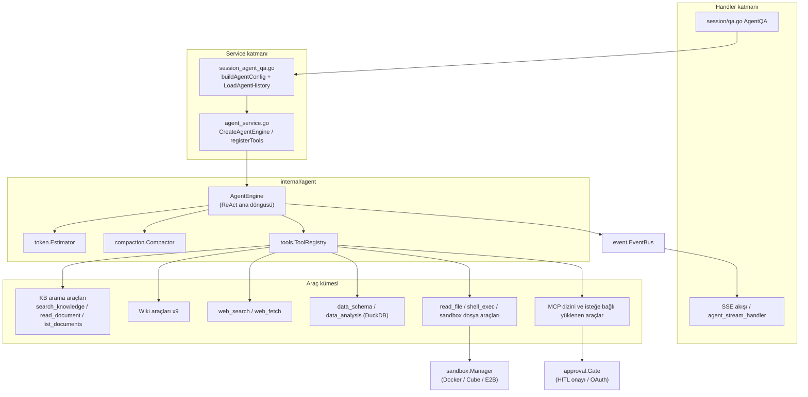
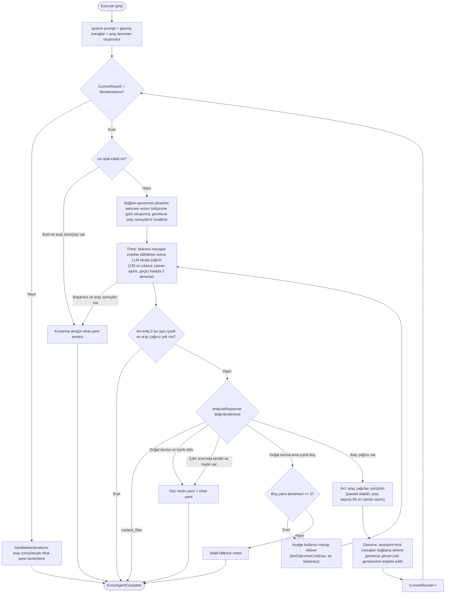
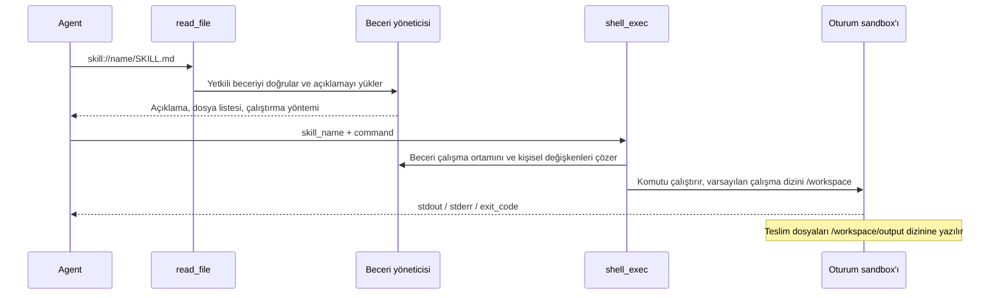

# Agent Motoru

İstem bölümleri, şablon referansları ve özel metnin nasıl yönetildiği için [Sohbet istemi birleştirme ve düzenlenebilir kapsam](../06-development/05-agent-prompts.md) sayfasına, tarayıcı eşleştirme ve dağıtım için [Yerel tarayıcı](../05-clients/09-local-browser.md) sayfasına bakın.

Akıllı ajanlar bilgi tabanı araması, web araması ve harici araçları birleştirerek çok adımlı görevleri yürütebilir; örneğin birden fazla sözleşmenin maddelerini karşılaştırabilir. Akıllı akıl yürütme modu soruya göre araç seçer, birden fazla tur çağrı yapar ve elde edilen sonuçlara dayanarak yanıt üretir.

Sohbet kutusunun üst kısmından hızlı yanıt veya akıllı akıl yürütme seçilebilir:

| Mod | Uygun görevler | Çalışma özellikleri |
| --- | --- | --- |
| Hızlı yanıt (quick-answer) | Belgelere dayalı olgu sorguları | Aramadan sonra yanıt üretir, genellikle az çağrı yapar |
| Akıllı akıl yürütme (smart-reasoning) | Belgeler arası analiz, web sorguları veya araç işlemleri | Birden fazla tur çağrı yapabilir; süre ve kullanım göreve bağlıdır |

«Akıllı Ajanlar» sayfasında özel ajan oluşturabilir, mod ve model seçebilir, bilgi tabanı kapsamını sınırlayabilir; istem, web araması, MCP araçları ve becerileri yapılandırabilirsiniz. Kaydedilen ajan web sohbetinde kullanılabilir, ayrıca IM veya gömülü kanallara bağlanabilir.

<Screenshot
  src="/screenshots/agent-editor.png"
  caption="Özel Agent yapılandırması: mod, model, bilgi kapsamı ve araçlar"
  hint="Agent düzenleme penceresini gösterir: mod seçimi, model seçimi, bilgi tabanı kapsamı, web araması anahtarı ve MCP araç seçimi." />

<Screenshot
  src="/screenshots/agent-chat.png"
  caption="Agent sohbeti: akıl yürütme süreci ve araç çağrısı zaman çizelgesi"
  hint="Bir Agent yanıt turunu gösterir: açılmış düşünme adımları, araç çağrısı kartları ve nihai yanıttaki alıntılar." />

Yapılandırma, ajanın erişebileceği kaynakları ve araçları belirler; gerçek çağrılar yine de geçerli kullanıcının veya kanalın yetkileriyle sınırlıdır.

## Akıllı Ajan Oluşturma ve Kullanma {#akilli-ajan-olusturma-ve-kullanma}

1. «Akıllı Ajanlar» sayfasında yeni bir ajan oluşturun, hızlı yanıt veya akıllı akıl yürütme modunu seçin.
2. Modeli, bilgi tabanı kapsamını ve istemi seçin. Tür ön ayarları yapılandırmayı önceden doldurur; kaydetmeden önce yine de değiştirilebilir.
3. Göreve göre web aramasını etkinleştirin veya MCP araçlarını seçin; beceri betiklerini çalıştırmak için ayrıca becerilerin kurulu olduğu bir sandbox bağlanmalıdır.
4. Kaydettikten sonra sohbet sayfasında bu ajanı seçin, bir soru sorun ve yanıt kaynaklarını ve araç sonuçlarını kontrol edin.

İlk kullanımda doğrudan yerleşik ajanlardan birini seçebilirsiniz. Hızlı yanıt belge sorguları için uygundur; veri analizi ajanı CSV ve Excel içindir; Wiki ajanı Wiki içeriğini gezmek ve bakımını yapmak için kullanılır.

Ajan yapılandırmasındaki düşünme yoğunluğu (`reasoning_effort`) varsayılan değerdir; sohbet sırasında giriş kutusundan geçici olarak değiştirilebilir. Akıllı akıl yürütme yanıt üretirken ek istekler de gönderilebilir. Bkz. [Oturum ve sohbet deneyimi](18-chat-experience.md).

## Kaynak ve Araç Kapsamını Ayarlama {#kaynak-ve-arac-kapsamini-ayarlama}

Ajan, bilgi tabanları ve beceriler için tümü, seçili veya devre dışı kapsamlarını kullanabilir. Sohbetteki bahsetmeler bu turun kaynaklarını seçmek veya öncelikli becerileri belirtmek içindir, mevcut yetkileri aşamaz. Giriş kutusundaki @Beceri ve @MCP menüleri yalnızca bu turda gerçekten çalışan ajanın kullanabildiği kaynakları listeler; paylaşılan bir ajan kullanılırken kaynak alanın becerileri ve ajanın açıkça seçtiği MCP hizmetleri listelenir. Web araması hem ajan yapılandırmasına hem de bu turun istek anahtarına bağlıdır.

Bir ajan organizasyon üzerinden paylaşıldığında alıcı, yetki kapsamı içinde kaynak alanın modellerini ve kaynaklarını kullanır. Paylaşılan ajan salt okunurdur, alıcı yapılandırmasını değiştiremez. Alıcı kullanırken:

- Her zaman ajanda yapılandırılmış model kullanılır, istekteki `summary_model_id` yok sayılır;
- MCP seçim modu ayarlanmamış ajanlar MCP hizmeti kullanmaz;
- Sohbet kayıtları kaynak alana değil, alıcının kendi alanındaki sohbet kaydı bilgi tabanına yazılır;
- Alıcı ajanın yeteneklerini ve kaynak kapsamını (model, bilgi tabanı, MCP, web araması) görebilir, istemi ve oluşturanı göremez.

Becerileri etkin bir ajan paylaşıldığında beceriler kaynak alanın sandbox'ında, yöneticinin beceri için yapılandırdığı ortam değişkenleriyle çalışır; üyeler ajandan bu değerleri okumasını isteyebilir. Paylaşım kuralları için [Alan ve yetkiler](01-tenant-auth.md) sayfasına bakın.

## Araç Onayı ve Yetkilendirmeyi Yönetme {#arac-onayi-ve-yetkilendirmeyi-yonetme}

İnsan onayı gerektiren MCP araçları çalışmadan önce bir onay kartı gösterir; kullanıcı onaylayabilir, reddedebilir veya parametreleri değiştirebilir. Varsayılan bekleme üst sınırı 10 dakikadır; ret, zaman aşımı veya iptal araç sonucu olarak döner ve ajan buna göre işlemeye devam edebilir. Bu onay mekanizması yalnızca MCP araçları için kullanılır.

Bir MCP hizmeti OAuth yetkilendirmesi gerektirdiğinde yetkilendirme mevcut sohbette tamamlanabilir; başarılı olunca sistem araç çağrısını yeniden dener.

## Beceri, Ek ve Bellek Kullanımı {#beceri-ek-ve-bellek-kullanimi}

Sandbox bağlandıktan sonra akıllı akıl yürütme ekleri okuyabilir, betik çalıştırabilir ve dosya üretebilir. İndirilebilir çıktılar `/workspace/output` dizinine yazılmalıdır; yanıt tamamlandıktan sonra oturumda önizlenip indirilebilir. Her yanıt turu bittiğinde sistem `/workspace` için bir git kontrol noktası kaydeder; oturum dallandırma ve geri alma işlemlerinde ilgili turun çalışma alanı buna göre geri yüklenir. Kurulum ve değişken yapılandırması için [Beceri dizini ve sandbox](22-skills-sandbox.md), ek işlemleri için [Oturum ve sohbet deneyimi](18-chat-experience.md) sayfasına bakın.

Uzun süreli bellek alana ve çağırana göre yalıtılır; ajan bellek okuma/yazmayı ayrıca kapatabilir. Ayrıntılar için [Oturumlar arası uzun süreli bellek](23-memory.md) sayfasına bakın.

## Yapılandırma Referansı {#yapilandirma-referansi}

### Özel Agent {#ozel-agent}

#### Modlar ve Tür Ön Ayarları {#modlar-ve-tur-on-ayarlari}

`CustomAgent` (`internal/types/custom_agent.go`) iki çalışma moduna sahiptir (`Config.AgentMode`):

- `quick-answer`: klasik RAG hattı (arama → bağlam birleştirme → tek seferlik üretim), Agent motoruna girmez;
- `smart-reasoning`: ReAct Agent modu; `IsAgentMode()` true döner ve `MultiTurnEnabled = true` zorunlu kılınır.

smart-reasoning altında ayrıca bir **tür ön ayarı** seçilebilir (`Config.AgentType`; `config/agent_type_presets.yaml` içinde tanımlanır, `internal/types/agent_type_preset.go` tarafından yüklenir). Ön ayar yalnızca düzenleyicide **formu önceden doldurur**, kullanıcı istediği gibi değiştirebilir:

| Ön ayar ID | Sistem istemi şablonu | Sıcaklık | Maks. iterasyon | Önceden doldurulan araçlar | KB filtresi |
| --- | --- | --- | --- | --- | --- |
| `rag-qa` | `progressive_rag_agent` | 0.7 | 30 | search_knowledge, read_document, list_documents | Araçlardan türetilir: any_of vector/keyword |
| `wiki-qa` | `wiki_researcher` | 0.7 | 30 | wiki_search, wiki_read_page, read_document, wiki_flag_issue | Araçlardan türetilir: any_of wiki |
| `hybrid-rag-wiki` | `hybrid_rag_wiki_agent` | 0.7 | 40 | wiki_search, wiki_read_page, search_knowledge, read_document, list_documents, wiki_flag_issue | any_of vector/keyword/wiki |
| `data-analysis` | `data_analyst` | 0.3 | 30 | data_schema, data_analysis; web araması kapalı; dosya türleri csv/xlsx ile sınırlı | Açıkça `none_of: [faq]` |
| `custom` | Yok | — | — | Önceden doldurulmaz | Sınırsız |

`thinking` ve `todo_write` varsayılan olarak ön ayar araçlarına dahil değildir, kullanmak için elle seçilmeleri gerekir; etkinleştirmek token maliyetini artırır.

#### Yapılandırılabilir Alanlar (CustomAgentConfig) {#yapilandirilabilir-alanlar-customagentconfig}

`internal/types/custom_agent.go` içindeki `CustomAgentConfig`'in başlıca alanları (`CreateAgent`/`UpdateAgent` handler'ları bu yapıyı doğrudan alır):

| Kategori | Alan | Açıklama / Varsayılan (EnsureDefaults) |
| --- | --- | --- |
| Temel | `agent_mode` | `quick-answer` / `smart-reasoning` |
| Temel | `agent_type` | smart-reasoning altındaki ön ayar kategorisi; boş/bilinmeyen değer custom kabul edilir |
| Temel | `system_prompt` / `system_prompt_id` | Doğrudan metin önceliklidir; özel Agent'ın şablon referansı istek anında `ResolveCustomAgentPrompts` tarafından çözülür |
| Temel | `context_template` / `context_template_id` | Normal modda arama parçalarını birleştirme şablonu |
| Model | `model_id`, `rerank_model_id`, `temperature`, `max_completion_tokens`, `thinking`, `reasoning_effort`, `citation_enabled` | temperature<0 → 0.7; max_completion_tokens=0 çalışma zamanı varsayılanını kullanır: quick-answer 2048, smart-reasoning 4096, sandbox bağlı smart-reasoning 24576; sandbox bağlıyken 8192'nin altındaki açık değerler 8192 olarak uygulanır; `reasoning_effort` `off`/`auto`/`minimal`/`low`/`medium`/`high`/`xhigh`/`max` değerlerini alır, ayarlandığında `thinking`'e göre önceliklidir (`thinking: true` `auto` ile eşdeğerdir), modelin desteklemediği seviyeler çağrı sırasında en yakın seviyeye otomatik ayarlanır; ikisi de ayarlanmamışsa düşünme açılmaz; tek bir sohbet için istek alanı `reasoning_effort` ile geçici olarak geçersiz kılınabilir; citation ayarlanmamışsa true kabul edilir |
| Agent | `max_iterations` | Varsayılan 10; negatif değer tur sınırı olmadığı anlamına gelir (servis katmanı üst sınırı 100) |
| Agent | `llm_call_timeout` | Tek bir model akış çağrısında çıktısız geçebilecek ardışık saniye sayısı; 0 varsayılan 120 sn'yi kullanır; toplam süre model aktarım katmanı tarafından denetlenir |
| Agent | `allowed_tools` | Araç beyaz listesi; boşsa DefaultAllowedTools'a düşer |
| MCP | `mcp_selection_mode` (all/selected/none), `mcp_services`, `mcp_auth_wait_timeout` | OAuth bekleme saniyesi <=0 ise Gate varsayılanı kullanılır |
| Beceri | `skills_selection_mode` (all/selected/none), `selected_skills`, `sandbox_config_id` | Alan sandbox'ını ve kurulu becerilerini seçer, bkz. [Beceri dizini ve sandbox](22-skills-sandbox.md) |
| Bellek | `memory_enabled` | nil alandan devralır, false bu ajanın bellek okuma/yazmasını kapatır |
| Bilgi tabanı | `kb_selection_mode` (all/selected/none), `knowledge_bases`, `retrieve_kb_only_when_mentioned`, `retain_retrieval_history` | retain=true olduğunda geçmiş KB arama sonuçları maskelenmez |
| Çok kipli | `image_upload_enabled`, `vlm_model_id`, `audio_upload_enabled`, `asr_model_id`, `image_storage_provider` | VLM, MCP araçlarının döndürdüğü görsellerin açıklanmasında da kullanılır |
| Dosya | `supported_file_types`, `chat_parser_engine_rules`, `attachment_image_understanding`, `attachment_ocr_max_pages`, `attachment_parse_wait_timeout_sec` | Veri analizi türü Agent genellikle csv/xlsx ile sınırlanır |
| FAQ | `faq_priority_enabled`, `faq_direct_answer_threshold`, `faq_score_boost` | — |
| Web | `web_search_enabled`, `web_search_max_results`, `web_search_provider_id`, `web_fetch_enabled`, `web_fetch_top_n` | max_results varsayılanı 5; `web_fetch_*` yalnızca quick-answer hattında etkilidir, akıllı akıl yürütmede `web_fetch`'i model kendisi çağırır |
| Çok turlu | `multi_turn_enabled`, `history_turns` | history_turns varsayılanı 5, yalnızca normal modu (KnowledgeQA) sınırlar; smart-reasoning multi_turn'ü zorunlu kılar, geçmişi bağlam penceresine göre yükler ve history_turns'ü okumaz |
| Arama | `embedding_top_k` (10), `keyword_threshold` (0.3), `vector_threshold` (0.5), `rerank_top_k` (5), `rerank_threshold` | Parantez içindekiler varsayılan değerlerdir |
| Gelişmiş | `enable_query_expansion`, `enable_rewrite`, `rewrite_prompt_*`, `query_understand_model_id`, `fallback_strategy` (varsayılan model), `fallback_response`, `fallback_prompt`, `intent_prompts`, `data_analysis_enabled` | Esas olarak quick-answer hattında etkilidir |
| Öneri | `question_suggestions` (starters / follow_ups) | starters varsayılanı hybrid modda 6 adet; follow_ups varsayılan olarak kapalı, 3 adet |

Handler katmanı (`internal/handler/custom_agent.go`) `CreateAgent`, `GetAgent`, `ListAgents`, `UpdateAgent`, `DeleteAgent`, `CopyAgent`, `GetPlaceholders` (`types.PlaceholdersByField(PromptFieldAgentSystemPrompt)` yer tutucu listesini döndürür), `GetAgentTypePresets` (i18n destekli ön ayar listesi) ve `GetSuggestedQuestions` sağlar. Oluşturma/güncelleme sırasında `authorizeAgentKnowledgeScope` kısıtlı API Key'lerin KB kapsamını doğrular: KB kısıtlı bir key için `kb_selection_mode: all` doğrudan 403 döner, `selected` ise tek tek yetkilendirilir.

Çalışma zamanı eşlemesi: `buildAgentConfig` (`session_agent_qa.go`) `CustomAgentConfig`'i motorun `types.AgentConfig` yapısına (`internal/types/agent.go`) dönüştürür ve şunları ekler: web araması hem Agent'ta hem istekte açık olmalıdır (`customAgent.Config.WebSearchEnabled && req.WebSearchEnabled`), web sağlayıcısı kiracı varsayılanına düşer, `SearchTargets` KB/@belge/@etiket kapsamından tek elden oluşturulur, `MaxContextTokens` için yedek değer 200000'dir, `@Skill` ve `@MCP` için tur başına öncelik ipuçları verilir (yapılandırılmış diğer kaynaklar kaldırılmaz; paylaşılan Agent'ın @MCP'si yalnızca Agent'ın ön ayar kümesi içinde kalabilir). Ayrıca rerank modeli yalnızca `search_knowledge` gerçekten kullanılabilir olduğunda zorunludur (`agentRequiresRerankModel`; eski adlar `knowledge_search` / `grep_chunks` de `SuccessorToolName` ile normalleştirildikten sonra sayılır).

#### Paylaşım Mekanizması (agent_share) {#paylasim-mekanizmasi-agent-share}

`internal/application/service/agent_share.go`: Agent'lar **organizasyonlarla (Organization)** paylaşılabilir:

- Yalnızca Agent'ın sahibi olan kiracı paylaşabilir (`ErrNotAgentOwner`); paylaşan kiracı organizasyonda Editor veya üstü üye olmalıdır;
- Paylaşmadan önce Agent yapılandırmasının eksiksiz olduğu doğrulanır: `model_id` zorunludur; `search_knowledge` araç kümesindeyse (veya araç kümesi boş olup varsayılan kümeye düşüyorsa) ve KB kapsamı devre dışı değilse `rerank_model_id` de zorunludur, aksi halde `ErrAgentNotConfigured` döner;
- **Yetki zorunlu olarak salt okunurdur**: `permission = types.OrgRoleViewer` (kiracılar arası düzenleme v1 kapsamında değildir); tekrar paylaşım idempotent güncelleme yapar;
- Alıcı kiracı, `TenantDisabledSharedAgentRepository` ile paylaşılan bir Agent'ı kendi kiracısında devre dışı bırakabilir;
- Paylaşılan Agent ile sohbet edilirken (`session_agent_qa.go`) arama ve model kapsamı **Agent'ın sahibi olan kiracıya** geçer (`resolveRetrievalTenantID`); böylece paylaşanın KB'leri kullanana açık olur, kullananın kendi MCP @bahsetmeleri ise Agent ön ayarlarıyla sınırlanır.

### Yerleşik Agent'lar (config/builtin_agents.yaml) {#yerlesik-agent-lar-config-builtin-agents-yaml}

Yerleşik Agent'lar `config/builtin_agents.yaml` içinde tanımlanır; başlangıçta `types.LoadBuiltinAgentsConfig` tarafından yüklenir ve `BuiltinAgentRegistry` (`internal/types/builtin_agent_config.go`) yeniden oluşturulur. default/zh-CN/zh-TW/ja-JP/ko-KR çok dilli ad ve açıklamaları desteklenir; `system_prompt_id`/`context_template_id` başlangıçta `ResolveBuiltinAgentPromptRefs` ile somut şablon içeriğine çözülür.

| ID | Ad (zh-CN) | agent_mode / agent_type | Temel yapılandırma |
| --- | --- | --- | --- |
| `builtin-quick-answer` | Hızlı yanıt | `quick-answer` | Şablon `default_kb` + `default_context`; temperature 0.7; FAQ önceliği (doğrudan yanıt eşiği 0.9, ağırlık 1.2); query expansion + rewrite; web araması açık, 5 sonuç; Agent motoruna girmez |
| `builtin-smart-reasoning` | Akıllı akıl yürütme | `smart-reasoning` / `rag-qa` | `max_iterations: 50`; araçlar: search_knowledge, read_document, list_documents, query_knowledge_graph; web araması açık; çok turlu (geçmiş bağlam penceresine göre yüklenir) |
| `builtin-data-analyst` | Veri analisti | `smart-reasoning` / `data-analysis` | Şablon `data_analyst`; temperature 0.3; `max_iterations: 30`; araçlar yalnızca data_schema + data_analysis; csv/xlsx ile sınırlı; web araması kapalı; çok turlu (geçmiş bağlam penceresine göre yüklenir) |
| `builtin-wiki-researcher` | Wiki soru-cevap | `smart-reasoning` / `wiki-qa` | Şablon `wiki_researcher`; `max_iterations: 30`; araçlar: wiki_search, wiki_read_page, read_document, wiki_flag_issue (salt okuma + sorun bildirme); web araması kapalı |
| `builtin-wiki-fixer` | Wiki düzeltme | `smart-reasoning` / `custom` | Şablon `wiki_fixer`; `retain_retrieval_history: true` (düzeltme için sayfa içeriğinin turlar arasında hatırlanması gerekir); toplam 9 araç: wiki_search, wiki_read_page, read_document, wiki_write_page, wiki_replace_text, wiki_rename_page, wiki_delete_page, wiki_read_issue, wiki_update_issue (wiki_flag_issue hariç); `kb_selection_mode: selected` |
| `builtin-skill-installer` | Beceri yükleyici | `smart-reasoning` / `custom` | Şablon `skill_installer`; temperature 0.2; `max_completion_tokens: 24576`; `max_iterations: 30`; araçlar: shell_exec, write_skill_file, edit_skill_file; `kb_selection_mode: none`; sandbox yapılandırmasının beceri yükleme akışı tarafından çağrılır |

Ek notlar (`internal/types/custom_agent.go` kaynaklı):

- `builtin-wiki-fixer` ve `builtin-skill-installer` kullanıcıya görünen Agent listesinde yer almaz (`builtinAgentIDsOrdered` bunları hariç tutar). İlki Wiki düzenleyicisi, ikincisi beceri yükleme akışı tarafından programatik olarak çağrılır; yine de `GetAgentByID` ile kullanılabilirler;
- `builtinAgentIDsOrdered` içinde `builtin-deep-researcher`, `builtin-knowledge-graph-expert`, `builtin-document-assistant` gibi ID sabitlerinin sıra yerleri de korunur, ancak mevcut YAML bu girdileri tanımlamaz; kayıt defteri YAML'ı esas alır;
- `builtin_agents.yaml` içinde hızlı yanıt dışındaki tüm girdilerde `reflection_enabled` bulunur (veri analistinde `true`, diğerlerinde `false`), ancak **arka uç şu anda bu alanı kullanmaz**: `internal/` altında ne karşılık gelen bir struct alanı ne de bir referans vardır, yalnızca YAML'da ve ön uç tip tanımlarında bulunur. Yani şu anda Agent'ın gerçek davranışını etkilemez; `true` görmeniz fazladan bir yansıma turu olduğu anlamına gelmez.

Bu arada, `internal/agent/prompts_wiki.go` içindeki `WikiSummaryPrompt`, `WikiKnowledgeExtractPrompt`, `WikiTaxonomyPlanPrompt` gibi sabitler **Wiki ingest hattına** (belge içe aktarılırken LLM'in wiki sayfası/dizin planı üretmesi) ait istemlerdir ve wiki türü Agent'ların çalışma zamanı araçlarını tamamlar: ilki Wiki içeriğini üretir, ikincisi tüketir ve bakımını yapar.

### Önerilen Sorular (Starters ve Takip Soruları) {#onerilen-sorular-starters-ve-takip-sorulari}

Sohbet kutusu iki yerde tıklanabilir sorular gösterir: oturum henüz boşken **açılış soruları** (starters) ve her yanıt turundan sonra **takip önerileri** (follow-ups). Bu yapılandırma Agent'a aittir (`QuestionSuggestionConfig`, `internal/types/custom_agent.go`); kanal ayarları yalnızca gösterimi bastırabilir, içerik stratejisini değiştiremez.

#### Yapılandırma Alanları {#yapilandirma-alanlari}

İki yapılandırma grubunun her biri ayrı açılıp kapatılır; `mode` soruların nereden geleceğini belirler:

| mode | Kaynak | Kullanım |
| --- | --- | --- |
| `curated` | Yalnızca elle girilen `items` | Açılış soruları |
| `knowledge` | Bilgi tabanı içeriğinden alınır | Açılış soruları, takip soruları |
| `generated` | Model sohbete göre üretir | Takip soruları |
| `hybrid` (varsayılan) | Yukarıdaki kaynakların karışımı | Açılış soruları, takip soruları |

| Yapılandırma | Varsayılan | Açıklama |
| --- | --- | --- |
| `starters.enabled` / `mode` / `items` / `count` | Açık / `hybrid` / boş / 6 | Açılış soruları; `count` 1–8 arası |
| `follow_ups.enabled` / `mode` / `count` | Kapalı / `hybrid` / 3 | Takip önerileri; `count` 1–5 arası |
| `follow_ups.model_id` | Boş (oturum modeli kullanılır) | Takip sorularını üretecek model; maliyeti düşürmek için küçük bir model belirtilebilir |
| `follow_ups.categories` | Üç türün tümü seçili | Soru türlerini sınırlar: `clarify` (netleştirme) / `deepen` (derinleştirme) / `action` (eylem) |
| `follow_ups.max_context_turns` | 2 | Üretim sırasında geriye bakılacak sohbet turu sayısı, 1–5 arası |
| `follow_ups.additional_instruction` | Boş | Üretim istemine eklenen iş kısıtları, en fazla 2000 karakter |
| `follow_ups.suppress_on_fallback` | Açık | Yanıt yedek stratejiye düştüğünde öneri gösterilmez |
| `follow_ups.suppress_when_answer_asks_question` | Açık | Yanıt kullanıcıya soru soruyorsa öneri gösterilmez (iki sorunun çakışmasını önler) |
| `follow_ups.knowledge_fallback` | Açık | Üretim başarısız olursa bilgi tabanı kaynağına düşülür |
| `follow_ups.allow_regenerate` | Kapalı | Kullanıcının elle yeni bir grup istemesine izin verilip verilmeyeceği |

Kullanıcının az önce sorduğu soruyla aynı olan takip soruları (büyük/küçük harf, boşluk ve yaygın noktalama yok sayılarak) elenir; eksik sayı bilgi tabanı kaynaklı adaylarla tamamlanır. Kullanıcı bilgi tabanından gelen önerilen bir soruyu seçtiğinde akıllı akıl yürütme modu yanıtlamadan önce o sorunun kaynak bilgi tabanında veya belgesinde arama yapar.

#### Üretim, Önbellek ve Olay Takibi {#uretim-onbellek-ve-olay-takibi}

- Sonuçlar `message_suggestion_sets` tablosunda saklanır ve `(assistant_message_id, placement, config_hash, locale)` ile önbelleğe alınır. `config_hash` «geçerli Agent yapılandırmasının» özetini önbellek anahtarına katar; böylece yapılandırma değişince eski önbellek okunmaz, doğal olarak yeni bir grup üretilir. `locale` her dilin ayrı önbelleğe alınmasını sağlar;
- Durumlar: `generating` → `ready`; ayrıca `suppressed` (yukarıdaki bastırma kurallarıyla atlanan) ve `failed` vardır. `lease_until` birden fazla örneğin aynı grubu tekrar üretmesini önler;
- Uç noktalar: `GET /sessions/:id/messages/:message_id/suggestions` okur, aynı yola `POST` üretimi tetikler (idempotent), `POST /sessions/:session_id/suggestion-events` olay bildirir;
- Olay türleri: `impression` (gösterim) / `click` (tıklama) / `dismiss` (kapatma) / `regenerate` (yeni grup), `message_suggestion_events` içinde saklanır. Tıklamadan sonra gönderilen bir sonraki kullanıcı mesajı `SuggestionAttribution` (`suggestion_set_id` + `question_id`) taşır; böylece istatistiklerde «öneriye tıkladı» ile «aynı soruyu kendisi yazdı» ayırt edilebilir.

## Çalışma Mekanizması Referansı {#calisma-mekanizmasi-referansi}

### Genel Bakış ve Mimari {#genel-bakis-ve-mimari}

#### Temel Bileşenler {#temel-bilesenler}

| Bileşen | Kaynak kod konumu | Sorumluluk |
| --- | --- | --- |
| `AgentEngine` | `internal/agent/engine.go` | ReAct ana döngüsünü yürütür; yapılandırmayı, araç kayıt defterini, Chat modelini, olay veri yolunu vb. tutar |
| `ToolRegistry` | `internal/agent/tools/registry.go` | Araç kaydı, arama, parametre doğrulama, çalıştırma, çıktı kırpma, kaynak temizliği |
| Yerleşik araç kümesi | `internal/agent/tools/*.go` | Yeteneğe göre kaydedilen yerleşik araçlar + dinamik MCP araçları |
| Token tahmini ve sıkıştırma | `internal/agent/token/` + `internal/agent/compaction/` | `Estimator` (BPE tahmini) ve uzun turlarda bağlam sıkıştırma (sandbox araç geçmişi) |
| Bellek birleştirme | `internal/application/service/memory/` | Oturumlar arası uzun süreli bellek: çıkarma, geri çağırma, konu yükseltme, belge yakınlığı, düzenleme |
| Beceri sistemi | `internal/agent/skills/` | SKILL.md keşfi, yüklenmesi ve betik çalıştırma (Progressive Disclosure) |
| Çalışma sandbox'ı | `internal/sandbox/` | Beceri betikleri ve `shell_exec` için Docker / Cube / E2B oturum düzeyinde yalıtılmış çalıştırma ve güvenlik doğrulaması |
| Araç onayı | `internal/agent/approval/gate.go` | Tehlikeli MCP araçları için insan onayı (HITL) ve oturum içi OAuth yetkilendirmesi |
| Agent servis katmanı | `internal/application/service/agent_service.go` | Motoru kurar: araçları kaydeder, KB meta bilgisini çözer, beceri/sandbox/VLM'i başlatır |
| Oturum soru-cevap girişi | `internal/application/service/session_agent_qa.go` | `CustomAgent`'ten çalışma zamanı `AgentConfig`'i oluşturur ve çalıştırır |
| Geçmişi yeniden oluşturma | `internal/application/service/agent_history.go` | Çok turlu LLM bağlamını DB'den yeniden oluşturur (`LoadAgentHistory`) |

`AgentEngine` struct tanımı (`internal/agent/engine.go`, alıntı):

```go
type AgentEngine struct {
	config               *types.AgentConfig
	toolRegistry         *agenttools.ToolRegistry
	chatModel            chat.Chat
	eventBus             *event.EventBus
	knowledgeBasesInfo   []*KnowledgeBaseInfo    // Detailed knowledge base information for prompt
	selectedDocs         []*SelectedDocumentInfo // User-selected documents (via @ mention)
	pinnedMCPServices    []*PinnedMCPServiceInfo // User @mentioned MCP services for this turn
	pinnedSkills         []*PinnedSkillInfo      // User @mentioned skills for this turn
	questionOrigin       *QuestionOriginInfo     // Source of a picked suggested question, if any
	memoryPrompt         string                  // Long-term memory envelope appended to the system prompt
	skillsManager        *skills.Manager         // Skills manager for Progressive Disclosure (optional)
	tokenEstimator       *agenttoken.Estimator   // Token estimator for context window management, calibrated
	compactor            *compaction.Compactor   // Summarizes older history to fit the context window (nil = disabled)
	checkpointSink       types.ContextCheckpointSink // persists compactions that end on a stored turn
	modelContext         *modelcontext.Registry  // single request-local boundary for every model handle
	steerSink            types.SteerSink         // lets users append messages into the running turn
	// ... geri kalanlar tahmin kalibrasyonu, taşma kurtarma gibi çalışma zamanı durumlarıdır
}
```

Motorun sorumlulukları ve kısıtları:

1. **Motor turlar arasında durumsuzdur (stateless across turns)**. Motor kaynak kodundaki yorum bunu açıkça belirtir: oturum geçmişi her turda çağıran tarafından `service.LoadAgentHistory` ile DB'den yeniden oluşturulur ve `llmContext` olarak `Execute`'a verilir; motorun kendisi önbellek, system prompt deposu veya turlar arası tampon tutmaz.
2. **Olay güdümlü çıktı**. Motor doğrudan SSE yazmaz; tüm çıktılar (düşünme, araç çağrısı, araç sonucu, nihai yanıt, tamamlanma olayı) `event.EventBus` üzerinden yayılır, Handler katmanındaki aboneler bunları SSE akışına çevirip veritabanına yazar. İlgili olay türleri `EventAgentThought`, `EventAgentFinalAnswer`, `EventAgentToolCall`, `EventAgentToolResult`, `EventAgentTool`, `EventAgentComplete` ve `EventError`'dur.
3. **Alıntı/kaynak takma adları**. `modelContext` (`modelcontext.Registry`, bkz. `internal/modelcontext/`) her LLM çağrısından önce mesajlara `EncodeMessages` uygular; kalıcı ID'leri (chunk/document/web UUID'leri) kısa takma adlarla (`cN`/`dN`/`bN`/`wN`, `res://NNNN`) değiştirir ve akış dönerken yeniden çözer. Böylece model gerçek UUID'leri hiç görmez. Kodlama sırası (kaynak tutamaçları kaynak takma adlarından önce) `Registry` içinde sabittir ve çağıran tarafından tersine çevrilemez (bkz. `registry.go` tip yorumu); aksi halde wiki summary sayfası slug'ına gömülü belge UUID'leri citation sıkıştırması tarafından yanlışlıkla `d1` gibi takma adlarla değiştirilir ve ölü bağlantılar oluşur.
4. **Gözlemlenebilirlik**. Her çalıştırma Langfuse span hiyerarşisi açar: `agent.execute` → `agent.round.N` → `agent.tool.<name>`; içinde tur, token kullanımı, araç çıktısı önizlemesi (4000 rune'a kırpılmış) gibi bilgiler bulunur. `database_query`'nin SQL parametresi hem Langfuse'ta hem UI ipucunda maskelenir (`toolHintSensitiveArgs`).

#### Bileşen İlişki Diyagramı {#bilesen-iliski-diyagrami}



#### System Prompt'un Oluşturulması {#system-prompt-un-olusturulmasi}

`internal/agent/prompts.go` içindeki `BuildSystemPromptSections` önce temel şablonu seçer: açık metin önceliklidir; yoksa bilgi tabanı olmadığında `pure`, bilgi tabanı olduğunda `rag` kullanılır. Ardından sırasıyla ara ekler, çalışma zamanı kuralları, kaynaklar, araçlar, çıktı, beceriler, bellek ve alıntı protokolü bölümleri eklenir. Beceri bölümü yalnızca `read_file` mevcutsa, kullanılabilir beceri varsa ve beceri yükleme modunda değilse eklenir.

Geçerli turun bilgi tabanı özeti, sabitlenmiş belgeler, tarih ve oturum bilgileri `observe.go` tarafından kullanıcı mesajının `runtime_context` alanına konur ve geçmişe kalıcı olarak yazılmaz; genel yanıt kuralları sistem bölümündedir. `@MCP` / `@Skill` yetkili kaynaklar için öncelikli kullanım ipucu üretir, diğer kullanılabilir kaynakları otomatik olarak dışlamaz.

Bölüm sırası, yer tutucular, şablon referanslarının kaydı ve mesaj rolü sınırları tek yerde, [Sohbet istemi birleştirme](../06-development/05-agent-prompts.md) sayfasında tutulur.

### ReAct Döngüsünün Aşama Aşama Açıklaması {#react-dongusunun-asama-asama-aciklamasi}

#### Giriş: Execute {#giris-execute}

`AgentEngine.Execute` (`internal/agent/engine.go`) akışı:

1. `defer e.toolRegistry.Cleanup(ctx)`: çalıştırma bittiğinde `types.Cleanable` uygulayan araçları temizler (ör. `data_analysis` bu oturumda oluşturduğu DuckDB tablolarını DROP eder);
2. Langfuse `agent.execute` span'ini açar;
3. `types.AgentState`'i başlatır (`RoundSteps`, `KnowledgeRefs`, `IsComplete=false`, `CurrentRound=0`);
4. `buildSystemPrompt` + `buildMessagesWithLLMContext` (system + geçmiş + geçerli kullanıcı mesajı, görsel URL'leri ekli);
5. `buildToolsForLLM` kayıt defterindeki araçları function calling tanımlarına dönüştürür;
6. `executeLoop`'a girer.

#### Ana Döngü: executeLoop ve runReActIteration {#ana-dongu-executeloop-ve-runreactiteration}

```go
for state.CurrentRound < e.config.MaxIterations {
    // ctx iptal kontrolü → araç sonuçları varsa kurtarma amaçlı nihai yanıt sentezlenir
    outcome, iterErr := e.runReActIteration(...)
    switch outcome {
    case iterOutcomeContinue: continue loop   // boş yanıtta yeniden dener, tur tüketmez
    case iterOutcomeBreak:    break loop      // sonlanır (doğal durma/takılma/iptal/içerik filtresi)
    case iterOutcomeNext:     state.CurrentRound++
    }
}
if !state.IsComplete && ctx.Err() == nil {
    e.handleMaxIterations(ctx, query, state, sessionID) // yedek olarak nihai yanıt sentezlenir
}
```

`executeLoop`, `defer emitCompletion()` ile **her çıkış yolunda `EventAgentComplete`'in tam olarak bir kez yayılmasını** garanti eder (`context.WithoutCancel` kullanılır, böylece kullanıcı "Durdur"a bastıktan sonra da olay ulaşır). Bu olay `state.RoundSteps`'i taşır ve stream handler bunu assistant mesajının `AgentSteps` alanına yazarak kalıcı hale getirir.

Tek bir `runReActIteration` yinelemesi sırasıyla dört aşamadan oluşur:

**① Think (düşünme)**: Önce bağlam penceresi yönetimi yapılır (bkz. [Bellek ve bağlam sıkıştırma](#bellek-ve-baglam-sikistirma)), ardından kullanıcının çalışma sırasında eklediği `inject` mesajları geçmişe yazılıp mesaj listesinin sonuna eklenir (bkz. [Çalışan yanıta mesaj ekleme](../04-api/02-api-chat.md#steer)), sonra `callLLMWithRetry` (`internal/agent/think.go`) çağrılır:

- `agenttools.SanitizeMessages` ardışık aynı rol, sahipsiz tool result gibi sorunları düzeltir;
- LLM akışla çağrılır (`streamThinkingToEventBus`); yalnızca ardışık `defaultLLMStallTimeout = 120s` boyunca hiç çıktı gelmezse iptal edilir (`AgentConfig.LLMCallTimeout` ile geçersiz kılınabilir). Sürekli çıktı veren uzun turlar toplam süreyle sınırlanmaz; toplam süreyi model aktarım katmanı güvenceye alır;
- Geçici hatalar (429/5xx/timeout/overloaded vb., bkz. `transientErrorMarkers`) en fazla `maxLLMRetries = 2` kez, 1 sn ve 2 sn geri çekilmeyle yeniden denenir;
- Yeniden denemeler de başarısız olur ama daha önce araç sonuçları varsa **zarif düşüş** uygulanır: `streamFinalAnswerToEventBus` mevcut araç sonuçlarından nihai yanıtı sentezler, `state.IsComplete = true` olur.

Akış sırasında: `reasoning_content` kanalı (DeepSeek vb.) ve gömülü `<think>` blokları (`ThinkStreamSplitter` ile ayrılır) "düşünme" alanına (`EventAgentThought`) yönlendirilir; normal content iyimser biçimde doğrudan nihai yanıt alanına (`EventAgentFinalAnswer`) akar. Bu turda daha sonra bir araç çağrısı yapılırsa bu metin UI tarafından preamble sayılarak adım ağacına taşınır ve aynı zamanda turun `Thought`'u olarak saklanır.

**② Analyze (değerlendirme)**: `analyzeResponse` (`internal/agent/observe.go`) durma koşullarını kontrol eder:

- `finish_reason == "content_filter"` ve araç çağrısı yoksa → sonlanır; yanıt filtrelenen içerik veya sabit bir özür metnidir;
- Doğal durma (`isNaturalStopFinishReason`: `stop` / `end_turn` / `stop_sequence`) ve araç çağrısı yoksa → **Agent biter**, düz metin yanıt nihai yanıttır (**ayrı bir final_answer aracı yoktur**; geçmiş verilerde kalan `final_answer` araç çağrıları yeniden oynatılırken `filterNonTerminalToolCalls` tarafından filtrelenir);
- Doğal durma ama içerik boşsa → bir nudge kullanıcı mesajı `"Please provide your complete answer now as plain text."` eklenip yeniden denenir, en fazla `maxEmptyResponseRetries = 2` kez (`iterOutcomeContinue` döner, tur tüketmez). Yeniden denemeler sırasında son durum yanıt olayı yayılmaz; denemeler tükendiğinde tek nihai yanıt olarak sabit bir fallback metni kullanılır;
- Çıktı sınırı nedeniyle kesilme (`finish_reason` `length` / `max_tokens` / `max_output_tokens`) varsa, metin mevcut ve araç çağrısı yoksa → kesilmeden önceki metin teslim edilir ve tur biter; yanıt olayı ve `AgentStep` `truncated` işareti taşır. Kesilme anında metin yoksa (yalnızca düşünme içeriği varsa) boş yanıt gibi yeniden denenir. Ardışık `maxConsecutiveLengthRounds = 3` tur kesilme olursa (genellikle araç çağrısı parametrelerinde kesilir) durulur; metin yoksa soruyu daraltmayı veya `max_completion_tokens`'u artırmayı öneren sabit bir ileti döner;
- Doğal durmak üzereyken kullanıcının eklediği bir `inject` mesajı varsa bu turun yanıtı ara yanıt olarak saklanır, ajan eklenen içeriği okuyup devam eder; bu durumda iterasyon sınırına ulaşılmış olsa bile bir tur daha çalıştırılabilir (`maxSteerOverruns = 1`).

Analyze'dan önce bir de **takılma tespiti** vardır: ardışık `maxRepeatedResponseRounds = 2` tur tamamen aynı içerik dönerse (ardışık boş yanıtlar dahil) ve araç çağrısı yoksa (genellikle işlenmeyen bir finish reason nedeniyle), çalıştırma zorla sonlandırılır ve bu içerik nihai yanıt olur; içerik boşsa sabit fallback metni kullanılır.

**③ Act (eylem)**: `executeToolCalls` (`internal/agent/act.go`) bu turdaki tüm araç çağrılarını yürütür:

- Çağrı sayısı ≥ 2 olduğunda `errgroup` ile **paralel çalıştırılır** (`buildAgentConfig` `ParallelToolCalls`'ı her zaman açar; best-effort, tek bir hata kardeş görevleri iptal etmez) ve sonuçlar orijinal sırayla geri yazılır. Yalnızca salt okunur araçlar (`CanRunConcurrently`: arama, okuma, sorgu türü) çakışarak çalışır; diğer araçlar bariyerdir, önceki çağrılar bitince tek başına çalışır, sonra sonraki çağrılara geçilir;
- Her çağrı önce `NormalizeToolCallID`'den geçer, sonra JSON parametreleri ayrıştırılır. Ayrıştırma başarısız olursa önce `RepairJSON` ile onarılıp yeniden denenir; yine başarısız olursa ipucu içeren bir hata sonucu döner (`"[Analyze the error above and try a different approach.]"`); böylece tüm tur başarısız olmaz, model farklı bir yol dener;
- Tek bir aracın çalışma zaman aşımı `defaultToolExecTimeout = 60s`'dir; `shell_exec` için `shellExecToolTimeout = 10m5s`'dir (komutun kendi 600 sn sınırından biraz uzundur, böylece yapılandırılmış bir zaman aşımı sonucu dönebilir); `local_browser`'ın insan devralma adımları ayrı bir bekleme süresi kullanır. `ToolExecContext` ayrıca bu zaman aşımını taşımayan bir `ApprovalCtx` içerir; MCP insan onayı/OAuth gibi meşru uzun beklemeler için kullanılır;
- `EventAgentToolCall` (yerelleştirilmiş görünen ad içeren ipucuyla, ör. `Web'de ara("...")`), `EventAgentToolResult` ve `EventAgentTool` olayları yayılır. Araç çalışma hataları da istemciye `tool_result` olarak gönderilir (`success: false` ve `error`); artık `error` olayı olarak gönderilmez, ajan hataya göre işlemeye devam eder.

**④ Observe (gözlem)**: `appendToolResults` (`internal/agent/observe.go`) OpenAI protokolüne göre bu turu mesaj dizisine ekler: `tool_calls` içeren bir assistant mesajı + her sonuç için bir `role:"tool"` mesajı (içerik `modelContext.ModelToolResultForTool` ile takma adlandırılır). Ardından `state.CurrentRound++` ile sonraki tura geçilir.

#### Sonlanma Koşulları Özeti ve Maksimum İterasyon {#sonlanma-kosullari-ozeti-ve-maksimum-iterasyon}

| Sonlanma yolu | Tetikleyici koşul | Nihai yanıtın kaynağı |
| --- | --- | --- |
| Doğal durma | finish_reason ∈ {stop, end_turn, stop_sequence}, araç çağrısı yok, içerik boş değil | O turun düz metin yanıtı |
| Boş yanıt denemeleri tükendi | Doğal durma ama içerik boş, 2 nudge denemesinden sonra hâlâ boş | Sabit fallback metni |
| Çıktı kesilmesi | Çıktı sınırında kesildi, metin var, araç çağrısı yok | Kesilmeden önceki metin (`truncated` işaretli) |
| Ardışık kesilme | Art arda 3 tur çıktı sınırında kesildi | Son metin parçası veya sabit ileti |
| İçerik filtresi | finish_reason == content_filter ve araç çağrısı yok | Filtrelenen içerik veya güvenlik iletisi |
| Takılma tespiti | Art arda 2 tur aynı içerik ve araç çağrısı yok | Tekrarlanan içeriğin kendisi |
| Kullanıcı iptali / zaman aşımı | ctx.Done(); araç sonuçları varsa kurtarma sentezi | Sentezlenmiş yanıt veya kısmi adımlar korunur |
| LLM kurtarılamaz hata | Denemeler tükendi; araç sonucu varsa → düşürülmüş sentez, yoksa hata | Sentezlenmiş yanıt / hata olayı |
| Maksimum iterasyona ulaşıldı | `CurrentRound == MaxIterations` (`max_iterations` negatifse tur sınırı yoktur) | `handleMaxIterations` → `streamFinalAnswerToEventBus` sentezi |

Maksimum iterasyon sayısının katmanlı varsayılanları:

- Servis katmanı `ValidateConfig`: `0` ise yedek değer 5'tir, negatif değer tur sınırı olmadığı anlamına gelir, kesin üst sınır `MAX_ITERATIONS = 100`'dür (`internal/application/service/agent_service.go`);
- `CustomAgent.EnsureDefaults`: yapılandırılmamışsa 10'dur (`internal/types/custom_agent.go`);
- Yerleşik Agent'lar: akıllı akıl yürütme 50, veri analisti 30, Wiki soru-cevap/düzeltme 30 (`config/builtin_agents.yaml`).

Sınıra ulaşıldığında `handleMaxIterations`, `internal/agent/finalize.go` aracılığıyla mevcut mesaj listesini kullanır; orijinal mesaj rollerini, görselleri ve araç çağrısı eşleşmelerini korur ve nihai yanıtı üretmek için bir kapanış isteği ekler. Bu çağrıda araç sağlanmaz, `tool_choice=none` ayarlanır ve thinking kapatılır.

#### ReAct Döngüsü Akış Diyagramı {#react-dongusu-akis-diyagrami}



### Yerleşik Araçların Tamamı {#yerlesik-araclarin-tamami}

#### Araç Tablosu {#arac-tablosu}

Araç adı sabitleri `internal/agent/tools/definitions.go` içinde tanımlanır. Aşağıdaki tablo tüm yerleşik araçları kapsar (parametre sütunu yalnızca schema'daki alanları listeler, `*` zorunlu demektir):

| Araç adı | Temel parametreler | Davranış / Dönüş |
| --- | --- | --- |
| `thinking` | `thought`\*, `next_thought_needed`\*, `thought_number`\*, `total_thoughts`\*, `is_revision`, `revises_thought`, `branch_from_thought`, `branch_id`, `needs_more_thoughts` | Sequential Thinking: düşünme adımlarını kaydeder/düzeltir/dallandırır; düşünme ilerlemesini döndürür (`incomplete_steps` dahil); düşünme içinde araç adları ve nihai yanıtın yer almaması istenir |
| `todo_write` | `task`, `steps[]`\* (`id`/`description`/`status`: pending/in_progress/completed) | Arama türü görev planı oluşturur/günceller, yalnızca arama görevleri içindir (özetleme thinking'e bırakılır); biçimlendirilmiş plan döndürür, `display_type: "plan"` |
| `search_knowledge` | `query`\* (tek bir doğal dil sorusu veya ifade; keyword modunda tam terim yazılır), `mode` (`hybrid` varsayılan / `semantic` / `keyword`), `knowledge_base_ids[]` (`bN`, en fazla 10), `limit` (varsayılan 10, üst sınır 30) | Tek bilgi tabanı arama girişi: `hybrid` vektör + anahtar kelime RRF birleştirmesi kullanır, `semantic` yalnızca vektör kullanır, `keyword` anahtar kelime indeksinden (BM25 / motorun anahtar kelime araması) gelir; chunks tablosunda artık indekssiz regex taraması yapılmaz. Geri çağırma eşikleri ve aday havuzu genel `conversation.vector_threshold` / `keyword_threshold` / `embedding_top_k` değerlerinden alınır (birlikte gelen `config.yaml`'da 0.2 / 0.3 / 30, yapılandırılmamışsa 0.6 / 0.5 / 30), ajanın kendi eşikleri okunmaz. Rerank modeli varsa yeniden sıralanır (puanlanan metin «belge başlığı + parça metni»dir, FAQ hariç; eşik varsayılanı 0.3, hiçbiri eşiği geçmezse puanı ≥ 0.15 olan en iyi aday tutulur), sonuçlar ayrıca MMR (λ=0.7) ile tekrarlardan arındırılır. Yeniden sıralama tümünü reddederse sonuç `rerank_rejected` taşır ve tanımlayıcı türü terimler için `keyword`'e geçilmesi önerilir. Sonuçlar `cN`/`dN` kısa ID'leri taşır, aynı çağrı içinde tekrarlar giderilir, aynı belgenin meta veri başlığı yalnızca bir kez yazılır. Arama komşu / üst / ilişkili parçaları eklemez (bağlam gerektiğinde `read_document(id=cN, context=k)` kullanılır); yeniden sıralamaya giden aday sayısı en fazla 200'dür. Çıktı araç çıktı bütçesinin 4/5'ini aşarsa sıralamada geride kalan sonuçlardan başlanarak atılır (en az bir sonuç kalır) ve modele `<omitted count=... reason="output_budget">` ile bildirilir. Seçilen KB'de ilgili indeks yoksa hata yerine kütüphane bazında düşülür: `keyword` FAQ kütüphanesine veya yalnızca vektör kütüphanesine denk gelirse anlamsal aramaya, `semantic` yalnızca anahtar kelime kütüphanesine denk gelirse anahtar kelime aramasına geçer; sonuçta `requested_mode` ve `mode_fallbacks` hangi kütüphanelerin neden düştüğünü belirtir. Yalnızca kapsamda hiç parça indeksi yoksa (ör. tümü yalnızca Wiki kütüphaneleriyse) hata verilir |
| `read_document` | `id`\* (`dN` belge tutamacı veya `cN` parça tutamacı), `offset` (okuma sırasındaki konum, 0'dan başlar, chunk indeksi değildir; sayfalamak için dönen `next_offset` kullanılır), `limit` (varsayılan 20, üst sınır 100), `query` (belge içi arama: boşluklara göre birden fazla kelimeye bölünür, parça tüm kelimeleri içermelidir, sıra önemsiz, büyük/küçük harf duyarsız), `regex` (tüm `query`'yi tek bir regex olarak ele alır, büyük/küçük harf duyarsız), `context` (`cN`'nin önünden ve arkasından kaç komşu parça ekleneceği, üst sınır 5) | Her zaman önce belge meta veri başlığını (başlık, tür, parse_status, parça sayısı, metadata), ardından gerektiğinde parçaları döndürür: `dN` `offset`'ten itibaren sayfa sayfa gezilir; `cN` o parçayı okur ve önceki/sonraki `context`'i ekleyebilir (komşular chunk_index sırasına göre alınır, üst parçaların, özetlerin ve görsel parçaların kullandığı indekslerden etkilenmez). `query` verildiğinde `id` `cN` olsa bile ait olduğu belge içinde arama yapılır; eşleşen parçalar önceki ve sonraki birer parça bağlamla döner (en fazla 20 eşleşme). Kesilirse `next_offset` (döndürülmeyen ilk eşleşmenin konumu) döner; aynı sorgu `offset` ile tekrarlanarak devam edilir. Eşleşme yoksa ipucu eklenir. Tek bir sayfa veya tek bir arama sonucu araç çıktı bütçesinin %80'ini aşmaz; fazlası `next_offset` ile okunur. FAQ girdileri de aynı şekilde okunur. KB'nin searchTargets ve @mention kapsamında olduğu doğrulanır |
| `list_documents` | `knowledge_base_id`\* (`bN`), `keyword` (başlık veya dosya adı alt dizesine göre filtre), `page` (varsayılan 1), `page_size` (varsayılan 20, üst sınır 100) | Tek bir bilgi tabanındaki belgeleri sayfa sayfa listeler; doğrudan `read_document`'e verilebilecek `dN` tutamaçlarını döndürür |
| `query_knowledge_graph` | `knowledge_base_ids[]`\* (1–10 adet `bN`), `query`\* (varlık adı veya varlık adı içeren soru) | Her KB'nin bilgi grafiğini eşzamanlı sorgular: sorgunun kendisi ve bölünmüş hâlindeki uzun terimlerle grafik deposunda ada göre varlık eşler; varlıklar arası ilişkileri (`relations`, model görünümünde `<relation>`) ve varlıkların kaynak parçalarını (en başta) döndürür, ardından metin araması eşleşmelerini ekler. Her KB'nin hataları modele `<error>` ile bildirilir. Yalnızca kapsamda grafiği etkin bir KB varsa modele sunulur (`agent_service.go` beyaz listeyi kurarken kaldırır); yetenek gereksinimi `all_of: [graph]` |
| `database_query` | `sql`\* (yalnızca SELECT) | Beyaz listedeki tabloları (`knowledge_bases`/`knowledges`/`chunks`) salt okunur sorgular; tenant_id filtresi ve `deleted_at IS NULL` otomatik eklenir; SQL parametresi UI/Langfuse'ta maskelenir |
| `data_schema` | `knowledge_id`\* (`dN`) | CSV/Excel dosyalarının `table_summary` + `table_column` türündeki parçalarını okur, sütun bilgisi ve satır sayısını döndürür; ayrıca modele bu belgeye `data_analysis`'te sabit olarak `dataset` tablo adıyla erişileceğini bildirir |
| `data_analysis` | `knowledge_id`\*, `sql`\* | CSV/Excel'i DuckDB'ye yükledikten sonra SQL çalıştırır. Belge `knowledge_id` ile seçilir, SQL'de sabit olarak `dataset` tablo adıyla başvurulur (her sorguda ayrı bir bağlantıda fiziksel tabloya eşlenen geçici bir görünüm oluşturulur, model SQL'de hiçbir zaman belge ID'si yazmak zorunda kalmaz). Çok sayfalı Excel tek bir tabloda birleştirilir ve `__sheet_name` sütunu sunulur; sütun adlarındaki büyük/küçük harf ve boşluk farkları otomatik düzeltilir; oturum sonunda Cleanup oluşturulan tabloları DROP eder |
| `web_search` | `query`\*; isteğe bağlı `count` (yapılandırılmış sınırı aşmaz, en fazla 20), `country` (iki harfli ülke kodu veya `ALL`), `freshness` (`pd`/`pw`/`pm`/`py`; Brave ayrıca tarih aralığını destekler), `content` | Web araması; sağlayıcının başlık, özet ve `wN` sayfa kısa ID'lerini doğrudan döndürür. Göreve göre bilgi tabanı veya web araması seçilir; Agent araması artık otomatik RAG sıkıştırması yapmaz. `country`/`freshness` yalnızca Brave ve Serply'de desteklenir, diğer sağlayıcılarda verilirse hata döner. `content=true` 15 saniye içinde ilk 3 sonucu paralel çeker ve her birinden 5000 karakterlik metin alıntısı alır |
| `web_fetch` | `items[]`\* (her öğe `url`\*=`wN` veya HTTP(S) URL; isteğe bağlı `offset`, `limit`; `limit` karakter cinsindendir, varsayılan ve üst sınır 8000, öğeler çıktı bütçesini paylaşır) | En fazla 8 web sayfasını eşzamanlı çeker (SSRF güvenli istemci + DNS pinning, gerekirse chromedp ile render), Markdown veya desteklenen metin gövdesini doğrudan döndürür; 60 sn zaman aşımı. Karakter bazında sayfalanır, `next_offset` ile devam edilir; tam metin `full_output_path`'te saklanır (`web://` adresi, yalnızca aynı oturumdan okunabilir) ve `read_file` ile turlar arasında satır satır okunabilir. Her URL için `success`/`failed`/`skipped` durumu ve yeniden denenebilir hata kodları döner (ör. anlık görüntüsü süresi dolmuş `snapshot_expired`); kısmi hatalar diğer sayfaları etkilemez |
| `read_file` | `path`\*, `offset` (1'den başlayan satır numarası), `limit` (varsayılan 2000 satır), `max_bytes` (üst sınır 64 KiB, web sayfası anlık görüntüsü için 50 KiB); web sayfaları için `line_offset` verilebilir | Çalışma alanı metinlerini, skill:// kaynaklarını ve web:// sayfa anlık görüntülerini okur, sonuca göre devam edilir |
| `shell_exec` | `command`\*; isteğe bağlı `skill_name`, `work_dir`, `timeout_sec`, `stdin` (≤ 64 KiB), `max_output_bytes` (varsayılan 16 KiB, üst sınır 64 KiB), `max_stderr_bytes` (varsayılan 8 KiB, üst sınır 16 KiB), `env` | Komutu geçerli oturum sandbox'ında çalıştırır, varsayılan çalışma dizini `/workspace`; beceri belirtilirse beceri dizini ve değişkenleri çözülür |
| `list_sandbox_files` | `path`, `max_entries` (varsayılan 200, üst sınır 500) | Sandbox dosyalarına ve kullanılabilir çıktılara göz atar; yalnızca `shell_exec` kayıtlı değilse sunulur |
| `write_sandbox_file` | `path`\*, `content`\*, `mode` (`overwrite` varsayılan / `append`) | Çalışma alanı dosyasına yazar veya ekler; `/workspace/input`'a yazamaz |
| `edit_sandbox_file` | `path`\*, `edits`\* (her öğe `old_string`\*, `new_string`\*, `replace_all`) | Özgün sürüme göre toplu tam metin değiştirme yapar |
| `search_memory` | `query`\*, `limit` (varsayılan 10, üst sınır 20) | Geçerli çağıranın kapsamında uzun süreli bellekte arar |
| `search_conversations` | `query`\*, `limit` (varsayılan 5, üst sınır 8) | Geçerli çağıranın geçmiş sohbetlerinde arar; kapsam çağıranın kimliğine göre belirlenir, kapsam parametresi kabul edilmez |
| `wiki_search` | `query`\* (büyük/küçük harf duyarsız POSIX regex, ör. `stardust\|skyvault`; `C++` gibi geçerli regex olmayan metinler harfiyen eşlenir), `regex` (`false` harfiyen eşlemeyi zorlar, `true` geçerli regex ister), `knowledge_base_ids[]` (`bN`), `limit` (KB başına varsayılan 10, üst sınır 50); eski `queries[]` ve `knowledge_base_id` parametreleri hâlâ kabul edilir | Wiki sayfalarında (başlık/slug/takma ad/özet/içerik) arar, `bN` işaretli sayfa slug'larını ve özetlerini döndürür; daha önce döndürülmüş sayfalar yine listelenir ama özetleri atlanır. Kapsam belgelere veya etiketlere sınırlıysa önce fazladan alınır (`limit`'in 5 katı, en fazla 100), sonra kaynağa göre filtrelenip ilk `limit` sonuç tutulur; hepsi filtrelenirse `filtered_out_of_scope` ile açıklanır |
| `wiki_read_page` | `slugs[]`\* | Slug'a göre Wiki sayfasının tam metnini, meta verisini, gelen/giden bağlantılarını okur (bağlantılara özet eklenir, görülmüş olanlar atlanır); bilgi tabanı slug'a göre otomatik yönlendirilir; `index` slug'ı türe göre gruplanmış bir dizin özeti döndürür (tür başına ilk 20) |
| `wiki_write_page` | `slug`\*, `title`\*, `summary`\*, `content`\*, `page_type`\*, `aliases[]`, `source_refs[]` | Wiki sayfası oluşturur veya sayfanın tamamını üzerine yazar; yazmadan önce slug normalleştirilip doğrulanır; giden bağlantılar otomatik işlenir |
| `wiki_replace_text` | `slug`\*, `old_text`\*, `new_text`\*, `source_refs[]` | Tam metin değiştirme, küçük düzeltmeler için uygundur |
| `wiki_rename_page` | `slug`\*, `new_slug`\* | Slug'ı yeniden adlandırır ve ona başvuran tüm sayfa bağlantılarını zincirleme günceller |
| `wiki_delete_page` | `slug`\* | Sayfayı siler ve ölü bağlantıları önlemek için diğer sayfalardaki gelen bağlantıları otomatik temizler |
| `wiki_flag_issue` | `slug`\*, `issue_type`\* (mixed_entities/contradictory_facts/out_of_date/other), `description`\*, `suspected_knowledge_ids[]` | Sayfadaki olgu hataları/varlık karışıklığı gibi sorunları işaretler, insan veya otomatik bakım için issue kaydeder |
| `wiki_read_issue` | `issue_id` / `slug` | Bir issue'nun ayrıntılarını gösterir veya bir sayfanın bekleyen issue'larını listeler |
| `wiki_update_issue` | `issue_id`\*, `status`\* (resolved/ignored/pending) | Issue durumunu günceller |
| `discover_mcp_tools` / `call_mcp_tool` | Keşif: `mode`\* (`list_servers`/`list_tools`/`describe`/`search`), `server_id`, `tool_name`, `query`, `cursor`, `limit` (1–50), `refresh`; çağrı: `tool_ref`\*, `arguments`\* | Dizini sorgular, tam tanımı okur ve gerektiğinde çağırır; bkz. [MCP araç dizini](08-mcp.md#mcp-tool-directory) |
| `mcp_...` (dinamik, kararlı hash son ekli) | MCP hizmetinin InputSchema'sı belirler | Tanım okunduktan sonra yayımlanan harici fonksiyon; açıklama hizmeti ve özgün araç adını belirtir, çalıştırılırken yetki yeniden doğrulanır; insan onayı ve oturum içi OAuth eklenebilir |
| `local_browser` | `method`\* (`observe`, `snapshot`, `navigate`, `click`, `fill`, `tab_*`, `evaluate`, `request_help` vb.); diğer alanlar method'a göre değişir | Kullanıcının bağladığı yerel tarayıcıyı kullanır; yalnızca istekte `local_browser_enabled` açıksa ve dağıtımda tarayıcı erişimi etkinse kaydedilir, bkz. [Yerel tarayıcı](../05-clients/09-local-browser.md) |
| `write_skill_file` / `edit_skill_file` | Yazma: `path`\*, `content`\* (≤ 256 KiB); düzenleme: `path`\*, `old_string`\*, `new_string`\*, `replace_all` | Yalnızca yerleşik beceri yükleyici tarafından yükleme modunda kullanılır; yalnızca yüklenmekte olan beceri dizinini değiştirebilir |

Varsayılan araç beyaz listesi `DefaultAllowedTools()` (Agent'ta `allowed_tools` yapılandırılmamışsa kullanılır): `search_knowledge`, `read_document`, `list_documents`, `search_conversations`. `web_search` / `web_fetch` ve `search_memory` beyaz listeyle belirlenmez: kayıt sırasında önce beyaz listeden çıkarılır, ardından sırasıyla web araması anahtarına ve bellek anahtarına (alan, kullanıcı ve ajanın üçü de izin vermelidir) göre eklenir.

**Eski araç adlarıyla uyumluluk**: `knowledge_search` ve `grep_chunks`, `search_knowledge` içinde birleştirildi; `list_knowledge_chunks`, `get_document_info` ve `wiki_read_source_doc`, `read_document` içinde birleştirildi. `definitions.go` içindeki `legacyToolSuccessors` bu eşlemeyi tutar; `NormalizeAllowedTools` araçları kaydederken kaydedilmiş Agent yapılandırmalarındaki, ön ayarlardaki ve API çağrılarındaki eski adları otomatik olarak yeni araçlara çevirir, veri geçişi gerekmez. Geçmiş mesajlarda kayıtlı eski araç adları yine düzgün görüntülenir.

**Belge okuma araçlarının kullanılabildiği kapsam**: `read_document` ve `list_documents` veritabanına yazılmış parçaları okur. İndeksleme stratejisinden bağımsız olarak tüm bilgi tabanları parça yazar; bu yüzden kapsamda vektör/anahtar kelime kütüphanesi veya Wiki kütüphanesi olduğu sürece kaydedilirler (`agent_service.go` içindeki `documentToolSet`) ve Wiki ajanının özgün metni geri okumasını sağlarlar. `search_knowledge` ise hâlâ vektör veya anahtar kelime indeksi gerektirir. Yetenek tablosunda bu iki araç `Auxiliary` olarak işaretlidir: yalnızca Wiki kütüphanelerinde kullanılabilirler, ancak yalnızca Wiki kütüphanelerini RAG ajanının «tüm bilgi tabanları» kapsamına çekmezler; KB filtresi türetilirken yalnızca başka bilgi tabanı aracı yoksa hesaba katılırlar. `list_documents`'in @dosya / @etiket kapsamı sayfalamadan önce uygulanır: etiketler veritabanı filtre koşuluna indirilir, belirtilen belgeler doğrudan ID ile okunur; `total_docs` ve `next_page` yalnızca kapsamdaki belgeleri sayar.

**Önerilen arama iş akışı**: `search_knowledge` (soruya göre `mode` seçilir: varsayılan `hybrid`; tam terimler / hata mesajları / tanımlayıcılar için `keyword`; yeniden ifade edilmiş veya kavramsal sorular için `semantic`) → `read_document` (bağlamı `dN` ile sayfa sayfa okumak veya `query` ile belge içinde konum bulmak için) → yanıtta `cN` tutamaçlarıyla alıntı. Wiki bilgi tabanlarında akış `wiki_search` → `wiki_read_page` → özgün kaynağı geri okumak için `read_document` şeklindedir.

#### Araç Kayıt Defteri (ToolRegistry) {#arac-kayit-defteri-toolregistry}

`internal/agent/tools/registry.go`:

- **Kayıt**: `RegisterTool` **first-wins** stratejisi kullanır; aynı adlı araçta sonradan kaydolan reddedilir. Böylece MCP hizmetlerinin ad çakışmasıyla yerleşik araçları ele geçirmesi önlenir (ilgili güvenlik bülteni GHSA-67q9-58vj-32qx);
- **Tanım dışa aktarma**: `GetFunctionDefinitions` araçları ada göre sıralar; LLM'e gönderilen tools yükünün istekler arasında bayt düzeyinde aynı kalmasını sağlayarak önek eşleşmesine dayanan sağlayıcı prompt cache'ine (ör. Qwen açık önbelleği) isabet ettirir;
- **Çalıştırma hattı**: `ExecuteTool` = `CastParams` (`"true"` → `true` gibi LLM'lerde sık görülen tür sapmalarını düzeltir) → `ValidateParams` (JSON Schema'ya göre ön doğrulama; boşuna bir çalıştırma ve LLM gidiş-dönüşünü önler) → `tool.Execute` → çıktı kırpma;
- **Çıktı kırpma**: `TruncateToolOutput` (`truncate.go`) varsayılan üst sınırı `DefaultMaxToolOutput = 24000` **rune**'dur (`AgentConfig.MaxToolOutputChars` ile geçersiz kılınabilir; `shell_exec`, `discover_mcp_tools` gibi araçlar daha yüksek kendi sınırlarını bildirebilir). Sınır aşılırsa baştan %70 ve sondan %30 tutulur, ortaya bir kırpma işareti eklenir; böylece büyük sonuçların bağlamı kirletmesi önlenir;
- **Hata ipucu**: Araç parametre JSON'u ayrıştırılamazsa sonuca `"[Analyze the error above and try a different approach.]"` eklenir ve LLM strateji değiştirmeye yönlendirilir; diğer hatalarda aracın kendi hata mesajı doğrudan döner;
- **Temizlik**: `Cleanup`, `types.Cleanable` uygulayan araçları dolaşarak kaynakları serbest bırakır.

#### Yetenek (capabilities) Mekanizması ve Yapılandırmaya Göre Açma/Kapama {#yetenek-capabilities-mekanizmasi-ve-yapilandirmaya-gore-acma-kapama}

`internal/agent/tools/capabilities.go`, ön uçtaki `frontend/src/utils/tool-capabilities.ts` dosyasının Go karşılığıdır ve her aracın KB yetenek gereksinimini bildirir:

```go
var ToolCapabilityRequirements = map[string]ToolRequirement{
	"thinking":   {},
	"todo_write": {},
	"search_knowledge":      {AnyOf: []KBCapability{CapVector, CapKeyword}, ConsumesFiles: true},
	"read_document":         documentReaderRequirement, // AnyOf vector/keyword/wiki, Auxiliary
	"query_knowledge_graph": {AllOf: []KBCapability{CapGraph}, ConsumesFiles: true},
	"list_documents":        documentReaderRequirement,
	// Eski adlar kendi özgün bildirimlerini korur (wiki_read_source_doc, read_document ile aynı); böylece eski yapılandırmalar normalleştirmeden önce de yetenek doğrulamasından geçer
	// ...
	"wiki_search":          {AllOf: []KBCapability{CapWiki}},
	// ...
	"data_analysis": {AnyOf: []KBCapability{CapVector, CapKeyword}, ConsumesFiles: true},
}
```

Yetenek değerleri `vector` / `keyword` / `wiki` / `graph` / `faq`'dır. Bunlardan türetilenler:

- `DeriveKBFilterForAgent(agentMode, allowedTools)`: Agent düzenleyicisinde/`@` menüsünde seçilebilecek KB'lerin filtre yüklemi; `quick-answer` modu örtük olarak `vector|keyword` gerektirir;
- `KBSatisfiesToolRequirements`: arka ucun son savunma hattı; ön ucu atlayan istemciler de uyumsuz KB'leri araçlara veremez;
- `ToolsConsumeFiles`: sohbet giriş kutusunda `@file` listesinin gösterilip gösterilmeyeceğini belirler.

**Çalışma zamanında açma/kapama mantığı** (`agent_service.go` içindeki `registerTools`):

1. Başlangıç noktası `config.AllowedTools`'tur (kullanıcının düzenleyebildiği beyaz liste; preset yalnızca ilk doldurmayı yapar). Önce `NormalizeAllowedTools` eski araç adlarını yenileriyle değiştirir; boşsa `DefaultAllowedTools()`'a düşülür. Paylaşılan ajanın salt okunur çağrılarında veya kapsamda yazılabilir Wiki kütüphanesi yoksa Wiki yazma araçları (`wiki_write_page`, `wiki_replace_text`, `wiki_rename_page`, `wiki_delete_page`, `wiki_flag_issue`, `wiki_update_issue`) kaldırılır;
2. Bu turda **hiç bilgi arama kapsamı yoksa** (Pure Agent modu), tüm KB/Wiki/veri araçları filtrelenir; web araması da açık değilse `todo_write` da kaldırılır;
3. Çalışma zamanı anahtarlarına göre eklenir: web araması açıksa `web_search` + `web_fetch`, bellek kullanılabiliyorsa `search_memory` eklenir (beyaz listede yazılı olsalar da önce çıkarılırlar);
4. **Kesin güvenlik ağı**: `SearchTargets` içindeki her KB'nin gerçek yetenekleri taranır. Wiki KB yoksa tüm wiki araçları atılır; vector/keyword KB yoksa `search_knowledge`, `query_knowledge_graph`, `database_query` atılır, bu durumda wiki KB de yoksa `read_document` ve `list_documents` de atılır; grafiği etkin KB yoksa `query_knowledge_graph` atılır (eski yapılandırmalara karşı koruma: önce wiki araçları seçilip sonra wiki olmayan KB'ye geçilmesi gibi);
5. Tekrarlar giderildikten sonra her biri örneklenip kaydedilir. MCP araçları `MCPSelectionMode`'a (all/selected/none) göre ayrıca kaydedilir; sandbox shell/dosya araçları oturum yeteneklerine göre kaydedilir (`shell_exec` varsa `list_sandbox_files` kaydedilmez), `read_file`'a ayrıca beceri ve web sayfası veri kaynakları eklenir; `local_browser` ve beceri yükleyicinin dosya araçları kendi kayıt koşullarını izler; eski beceri araç adları yalnızca uyumluluk için tanınır, artık kaydedilmez.

### Bellek ve Bağlam Sıkıştırma {#bellek-ve-baglam-sikistirma}

Uzun süreli bellek alana ve çağırana göre oturumlar arası saklanır ve aşağıdaki oturum geçmişi sıkıştırmasından ayrı yapılandırılır. Etkinleştirme ve kişisel yönetim için [Oturumlar arası uzun süreli bellek](23-memory.md), tam arayüz için [Bellek API](../04-api/02-api-memory.md) sayfasına bakın.

#### Token Bütçesi ve Tahminci {#token-butcesi-ve-tahminci}

- Bağlam bütçesi: `AgentConfig.MaxContextTokens`; `buildAgentConfig` ayarlanmamışsa yedek olarak `types.DefaultMaxContextTokens = 200000` kullanır;
- `token.Estimator` (`internal/agent/token/estimator.go`) tiktoken'ın **cl100k_base** kodlamasıyla tahmin yapar; sabitler `perMessageOverhead = 3`, `perConversationTail = 3`'tür. Kodlama başarısız olursa `len(s)/4` yaklaşımına düşer;
- **Yetkili değer önceliklidir**: Gerçek token sayısı model API'sinin döndürdüğü `Usage`'dır. Motorun `estimateCurrentTokens`'i önceki turda API'nin bildirdiği `lastUsage.TotalTokens`'i temel alır ve yalnızca yeni eklenen mesajlar (assistant yanıtı + tool sonuçları) için artımlı BPE tahmini yapar; tam tahmin yalnızca ilk turda Usage yokken yapılır.
- **Tahmin kalibrasyonu**: cl100k her modelin tokenizer'ı değildir; Çince metin cl100k'de karakter başına yaklaşık 1 token iken Qwen ve DeepSeek'te yaklaşık 0.6'dır, İngilizce ve JSON'da ise temelde aynıdır. Bu yüzden tahmincide bir kalibrasyon katsayısı bulunur (`Estimator.SetScale`, 0.5–1.5 ile sınırlı); yalnızca metne uygulanır, mesaj başına sabit ek yük ve görsellerin sabit tahmini bununla çarpılmaz. Katsayı, motor tarafından aynı sohbet turundaki iki ardışık istek arasında ölçülür: iki istekte araç tanımları, system prompt ve mevcut mesajlar aynıdır; modelin bildirdiği prompt token artışı yalnızca yeni eklenen mesajlara (önceki yanıt, araç sonuçları, eklenen mesajlar) karşılık gelir. Bu artış o mesajların tahminine bölünerek sohbet içeriğinin katsayısı bulunur ve sağlayıcıların araç tanımlarını işleme biçiminden etkilenmez. Arada sıkıştırma veya araç sonucu kırpma olduysa, örnekte görsel varsa, oran güvenilmezse (< 0.3 veya > 3) ya da toplam örnek 256 tahmini tokenden azsa hesaba katılmaz. Ölçülen katsayı bu turun usage bilgisiyle `context_token_scale` olarak saklanır (model total token bildirmese bile saklanır). Bu turda katsayı ölçülmediyse (ör. tek istekte biten, araç çağırmayan turlar) turun başındaki katsayı kullanılır; böylece en son tur her zaman en güncel katsayıyı taşır. Sonraki turda `LoadAgentHistory` katsayı taşıyan en son mesajı alır, geçmişi buna göre fiyatlar ve katsayıyı başlangıç değeri olarak motora verir. Yükleyici, ilk tur sıkıştırma kararı ve sıkıştırıcı (özgün metin koruma bütçesi, özet girdi sınırı) aynı tahminciyi paylaşır, dolayısıyla aynı ölçüyü kullanır: yalnızca sıkıştırma kararını kalibre edip yüklemeyi kalibre etmemek, yükleyicinin önce tur atmasına yol açar. İlk tur sıkıştırma kararı yine yalnızca mesajları sayar, araç tanımlarını saymaz.

#### Bağlam Sıkıştırma ve Taşma Kurtarma {#baglam-sikistirma-ve-tasma-kurtarma}

`manageContextWindow` (`internal/agent/observe.go`) her Think'ten önce `compaction.Compactor`'u çağırır. MaxContextTokens önce ajan yapılandırmasından, sonra modelin parameters.context_window değerinden alınır, en son 200000'e düşer. Tetikleme eşiği pencereden reserve çıkarılarak bulunur; reserve en az 16384'tür ve bu turun çıktı bütçesiyle artar: `max(completion bütçesi + 4096, 16384)`.

Sıkıştırma, korunacak son mesajları token bütçesine göre seçer; varsayılan KeepRecentTokens=20000'dir, küçük pencerelerde kullanılabilir pencerenin dörtte birine indirilir. Uzun ReAct oturumları geçerli turun içinde bölünebilir; kesim noktası assistant araç çağrısını tool sonucundan ayırmaz, bölünen turun ilk yarısı korunan ikinci yarıyı açıklamak için ayrıca özetlenir.

Eski özet güncellemeye katılır, daha eski geçmişten yapılandırılmış bir özet üretilir; sonuç işaretli bir user mesajı olarak system ile korunan kuyruk arasına konur. Özet bütçesi reserve, modelin çıktı sınırı ve koruma bütçesinden hesaplanır, artık 2000'e sabit değildir. Özet çağrısı akış arayüzünü kullanır ve motorun kendi sohbet turları gibi yalnızca duraklama zaman aşımı ayarlar: belirli bir süre boyunca (varsayılan 120 saniye, `LLMCallTimeout`'u izler) hiç çıktı gelmezse iptal edilir, toplam süre model aktarım katmanına bırakılır. Önceki 60 saniyelik toplam zaman aşımı, normal biçimde ön doldurma yapan ve çıktı üreten büyük istekleri kesiyordu. Modelin düşünme çıktısı da ilerleme sayılır ama özete girmez; akışta bildirilen hatalar bu denemenin başarısızlığı sayılır. Her özet en fazla 2 kez denenir, tur iptal edildiyse yeniden denenmez; başarısız olursa özgün metin arşivine düşülür ve degraded olarak işaretlenir. Özgün arşiv de özet gibi özet bütçesine tabidir; en yeni mesajdan geriye doğru korunur ve kaç mesajın atlandığı belirtilir, böylece düşüş durumunda da bağlam küçülür.

**Özet girdi sınırı**. Geçmiş tüm pencereyi doldurabilir; özetlenecek kısım tek bir özet isteğinin alabileceğinden büyük olabilir. Pencereyi aşan istek reddedilir ve özgün arşive düşer; düşürülen sonuç sıkıştırma noktası yazmaz, bu yüzden sonraki turda aynı şekilde yeniden başarısız olur. Bu nedenle `Prepare` yalnızca tek bir isteğe sığan en yeni mesajları tutar (pencereden yanıt bütçesi, önceki özet ve istem çıkarılır, ayrıca %10 pay bırakılır) ve istemde kaç eski mesajın atlandığını belirtir; dosya yolları yine özetlenecek tüm mesajlardan çıkarılır. Atlanan mesaj sayısı `Result.Omitted`'e kaydedilir ve motor günlüklerinde görülebilir.

`internal/agent/compaction/fileops.go` sıkıştırılan mesajlardaki dosya okuma/yazma yollarını mekanik olarak çıkarır ve eski özetin dosya listesini devralır; böylece modelin diske yazılmış çıktıları unutması önlenir. Normal okumalar read_file kullanır, geçmişteki eski okuma adları da uyumlu biçimde tanınır.

Sıkıştırmadan sonra hâlâ bütçe aşılıyorsa en son araç sonuçları kısaltılır; araç sonucu bütçesi pencerenin %20'sidir ve 8192–32768 token ile sınırlıdır. Sıkıştırılacak içerik yoksa veya açılan alan %5'ten azsa, aynı bağlam boyutunda tekrar tekrar model çağrısı harcamamak için mevcut mesaj sayısı kaydedilir. Başarılı sıkıştırma eski usage temelini temizler ve öncesi/sonrası token/mesaj sayısı, neden, split_turn ve degraded bilgilerini içeren bir context_compacted olayı yayar.

**Sıkıştırma noktasının kalıcılığı**. Özetin geçmiş kısmı tam olarak veritabanına yazılmış bir turun sonunda bittiğinde motor bu özeti sıkıştırma noktası (`messages.context_checkpoint`) olarak o turun assistant mesajına geri yazar; sonraki tur doğrudan buradan başlar ve aynı geçmiş tekrar özetlenmez. Geçmiş mesajlar yeniden oluşturulurken ait oldukları turun assistant mesaj ID'sini taşır (`chat.Message.TurnID`, ağa gönderilmez) ve kesim noktasının tur sınırına denk gelip gelmediği buna göre belirlenir. Şu durumlarda sıkıştırma noktası yazılmaz: kesim noktası veritabanına yazılmış bir turun içindeyse (ör. eklenen mesajda duruyorsa) veya özet yalnızca geçerli turu kapsıyorsa. Geçmiş özeti özgün arşive düştüğünde yine yazılır ve `degraded` olarak işaretlenir: yazılmazsa özetleyici sürekli başarısız olduğunda her tur aynı geçmişi yeniden yükler, yeniden sıkıştırır ve yeniden başarısız olur; yazıldığında bir sonraki sıkıştırma onu önceki özet olarak modele verip yeniden düzenletir. Bölünen turun ilk yarısının özeti sıkıştırma noktasına yazılmaz, çünkü o tur bir dahaki sefere tam olarak yeniden oynatılır. Açılan alan %5'ten az olduğu için sıkıştırmadan vazgeçildiğinde bu turun bağlamı değişmeden kalır; ancak geçmiş kısmı bir sıkıştırma noktası verdiyse yine yazılır, böylece sonraki turda aynı geçmiş tekrar özetlenmez. Yazma yalnızca bu sütunu günceller; oturumun assistant satırı eşleşmezse başarısız sayılır. Başarısızlık yalnızca günlüğe yazılır, bu turu etkilemez. Geçmişin ters sayfalanması ve oturum başına en son sıkıştırma noktasının alınması `idx_messages_session_created_id (session_id, created_at DESC, id DESC)` indeksini kullanır: sıkıştırma noktası alınırken en yeni satırdan geriye taranır ve ilk sıkıştırma noktasında durulur. Bu indeks (migration 000106) `CREATE INDEX CONCURRENTLY` ile oluşturulur, yükseltme sırasında messages yazmalarını engellemez; oluşturma yarıda kesilirse INVALID bir indeks kalır, silinip migration yeniden çalıştırılmalıdır. Sıkıştırma noktası kapsadığı turun üzerinde saklanır; bu yüzden oturum dallandırması o turu kopyaladığında birlikte kopyalanır, tur geri alındığında veya silindiğinde sıkıştırma noktası da geçersiz olur.

Sağlayıcı bağlam aşımı bildirdiğinde (hata veya yanıt kesilmesi ölçütü) sıkıştırma zorlanıp bir kez yeniden denenebilir. Yalnızca üretimin completion bütçesini tüketmesinden kaynaklanan kesilmeler bağlam aşımı sanılmamalıdır. Sağlayıcıya özgü hata tanıma için `internal/agent/compaction/overflow.go` dosyasına bakın.

#### Oturum Geçmişi (agent_history) {#oturum-gecmisi-agent-history}

Turlar arası geçmiş her turda `LoadAgentHistory` (`internal/application/service/agent_history.go`) tarafından messages tablosundan yeniden oluşturulur (tek doğruluk kaynağı DB'dir, Redis/bellek önbelleği yoktur):

- Geçmiş tur sayısına göre değil token bütçesine göre yüklenir; `history_turns` Agent modunda etkisizdir. Bütçe tüm bağlam penceresidir (`agent.HistoryTokenBudget`) ve bilerek sıkıştırma eşiğinden büyük tutulur: yükleyicinin sığdıramadığı turlar ne yeniden oynatılır ne özete girer, yani kaybolur. Bütçe yalnızca eşiğe kadar olsaydı yükleyici önce eski turları keserdi, istek eşiği hiç aşamayabilirdi; sıkıştırma ve sıkıştırma noktası hiç oluşmaz, oturum kayan pencereye dönüşürdü. Bütçe pencere kadar olduğunda eşiği aşan kısım ilk tur sıkıştırmasıyla özetlenip sıkıştırma noktasına yazılır; sonraki tur yeni sıkıştırma noktasından başlar ve geçmiş buna göre azalır. Oturum yeniden dolduğunda tekrar sıkıştırılır; sıkıştırma noktasından sonraki turlar eksik kalmaz ve sıkıştırma art arda iki turda gerçekleşmez;
- Oturumda sıkıştırma noktası varsa (bkz. [Bağlam sıkıştırma ve taşma kurtarma](#baglam-sikistirma-ve-tasma-kurtarma)) en yenisi alınır: bulunduğu tur ve daha eski turlar geçmişin en başına konan tek bir özet mesajıyla değiştirilir, sonraki turlar olduğu gibi yeniden oynatılır. Sıkıştırma noktasının bulunduğu tur okunmamışsa (bütçe önce dolduysa) hangi turların ondan sonra geldiği assistant satırlarının `(created_at, id)` sırasına göre belirlenir. Sıkıştırma noktası sorgusu başarısız olursa sıkıştırma noktası olmayan geçmişe dönülür;
- `(created_at, id)`'ye göre yeniden eskiye sayfa sayfa okunur (sayfa başına 200 satır, tek seferde en fazla 5000 satır), user/assistant `RequestID` ile eşlenir ve yalnızca assistant'ı tamamlanmış (`IsCompleted`) tam turlar tutulur. Sıkıştırma noktasına ulaşıldığında veya bütçe dolduğunda durulur; uzun oturumların tamamı okunmaz. Okuma oturumun başına ulaşmadıysa ve en eski satır user mesajı değilse, o satırın ait olduğu turun özgün sorusu eksiktir ve tur atılır;
- En yeni turdan geriye doğru bütçeye yerleştirilir, sığmayan ilk turda durulur; böylece tutulan turlar kesintisiz olur. En yeni tur tek başına bütçeyi aşsa bile tutulur, bölmeyi sıkıştırma üstlenir. Her tur motorun gerçekte gönderdiği içeriğe göre fiyatlanır ve döndürülür (`agent.HistoryAsSent`): `RetainRetrievalHistory` açık değilse geçmişteki KB/Wiki sonuçları yalnızca tek satırlık bir yer tutucuyla gönderilir, bütçeye de tek satır olarak sayılır ve bellekte de tek satır olarak kalır (`search_knowledge` gibi sonuçlar veritabanına yazılırken zaten tek satıra indirilmiştir; fark esas olarak tam metin saklanan `wiki_read_page` / `wiki_search`'tedir). Her tur yeniden oynatıldıktan sonra ilgili veritabanı satırları serbest bırakılır; sayfa sayfa okurken aynı anda bellekte kalan yaklaşık bir sayfa veritabanı satırı artı gönderilecek geçmiştir;
- Her tur şöyle açılır: user mesajı (görsel caption'ı ve ek prompt'u dahil; eski render protokolünü bağlama taşımamak için `RenderedContent` anlık görüntüsü yok sayılır) → araç çağrısı içeren her `AgentStep`, assistant(with tool_calls) + birkaç tool mesajı olarak açılır → en sonda normalleştirilmiş nihai yanıt olan bir assistant mesajı (`<think>` blokları çıkarılmış);
- Geçmişteki tool mesajlarının içeriği `CompactToolOutputForHistory` (`internal/agent/tools/persist.go`) ile sıkıştırılır: `display_type` taşıyan büyük yükler tek satırlık bir özetle değiştirilir; ör. `search_knowledge` sonucu `"Knowledge search returned N result(s) (details omitted from history)"`, `read_document`'in parça listesi `"Listed 20/87 chunks from X (content omitted from history)"` olur. `shell_exec`, `read_file` gibi sandbox araçlarının sonuçları tek satıra indirilmez, özgün yapısıyla yeniden oluşturulur.

Motora girdikten sonra `buildMessagesWithLLMContext` ayrıca **geçmiş KB sonuçlarını maskeler** (`redactHistoryKBResults`): Agent `RetainRetrievalHistory`'i açmadıkça geçmiş turlardaki KB türü araçların (`search_knowledge`, `read_document`, `list_documents`, `query_knowledge_graph`, `wiki_search`, `wiki_read_page` ve geçmişte kalmış olabilecek eski adlar `knowledge_search`, `grep_chunks`, `list_knowledge_chunks`, `get_document_info`, `wiki_read_source_doc`) sonuçlarının tümü `"[Previous retrieval result omitted — knowledge base may have changed. Please perform a fresh search.]"` ile değiştirilir; böylece model değişmiş olabilecek bilgi tabanında taze arama yapmaya zorlanır.

Kalıcılık tarafında `SanitizeAgentStepsForStorage`, `AgentSteps` DB'ye yazılmadan / SSE ile yeniden oynatılmadan önce yalnızca LLM'e yönelik büyük yükleri çıkarır ve yalnızca kompakt özetleri bırakır.

### Beceri (Skills) Sistemi {#beceri-skills-sistemi}

Kullanım adımları, kurulum kaynakları, sandbox bağlantısı, ağ politikası ve ortam değişkenleri için [Beceri dizini ve sandbox](22-skills-sandbox.md) sayfasına bakın. Beceriler ajanın seçtiği alan sandbox yapılandırmasına bağlıdır.

#### Aşamalı Yükleme ve Kapsam {#asamali-yukleme-ve-kapsam}

Bir beceri paketi YAML frontmatter içeren bir `SKILL.md` ile scripts/templates gibi kaynaklardan oluşur. Model önce adı ve açıklamayı görür (Level 1), ardından `read_file(path="skill://<name>/SKILL.md")` ile tam açıklamayı okur (Level 2) ve gerektiğinde ek kaynakları okur (Level 3). Okuma sonucu gerçek çalıştırma yöntemini, kullanılabilir dosyaları ve beceri dizini bilgisini de verir.

`skills_selection_mode` all/selected/none değerlerini alır; selected, selected_skills ile belirtilir. Çalışma zamanında yalnızca seçilen sandbox'ta kurulu ve kullanılabilir beceriler sunulur. `@Beceri` yalnızca yetkili bahsetmeleri bu turun öncelikli öğesi olarak kaydeder; özgün beyaz listeyi daraltmaz ve aslında kullanılamayan bir beceriyi yetkilendirmez.

Ortak giriş noktaları `read_file` ve `shell_exec(skill_name=..., command=...)`'dir; eski `read_skill` ve `execute_skill_script` artık kaydedilmez. Beceri dosyası URI'si bir shell yolu değildir; paketteki betikleri çalıştırmak için okuma sonucunun verdiği dizin veya `$RETHRA_SKILL_DIR` kullanılır. Alan sandbox yapılandırması seçilmemişse betik çalıştırma kullanılamaz.

#### Oturum Ortamı ve Dosyalar {#oturum-ortami-ve-dosyalar}

Docker, Cube ve E2B'nin tümü oturum düzeyinde sandbox sağlar. Ek hazırlama, shell çalıştırma ve çıktı toplama aynı örneği kullanır; sandbox kimliği oturuma bağlıdır ve araç parametreleriyle başka bir alanın çalışma ortamına geçilemez. Varsayılan çalışma hesabı sandbox içindeki root'tur, yalıtım sınırı sandbox'ın kendisidir. Docker varsayılan olarak kapalıdır; etkinleştirme koşulları için [Beceri dizini ve sandbox](22-skills-sandbox.md#sandbox-arka-ucunu-secme) sayfasına bakın.

| Yol | Amaç |
| --- | --- |
| `/workspace/input` | Sohbet eklerinin hazırlandığı yer |
| `/workspace` | Bu turda veya sonraki turlarda kullanılan çalışma dosyaları ve betikler |
| `/workspace/output` | Toplanabilen, önizlenebilen ve indirilebilen teslim dosyaları |
| `skill://<name>/...` | Beceri paketi kaynaklarının okuma adresi |
| `web://...` | Bu oturumda kalıcı hale getirilmiş web sayfası anlık görüntüleri; sandbox olmadan da okunabilir |

Sandbox boşta kalma TTL'i, beceri imajı güncellemesi veya yeniden oluşturma örnekteki geçici durumu etkiler. Sohbet çıktılarının toplanması için [Oturum ve sohbet deneyimi](18-chat-experience.md), arayüzler için [Sandbox ve beceri API](../04-api/02-api-sandbox-skills.md) sayfasına bakın.

#### Dosya Aracı Sözleşmesi {#dosya-araci-sozlesmesi}

- **Yazma**: `write_sandbox_file` yalnızca /workspace altındaki dosyalara yazar, salt okunur giriş dizini /workspace/input hariçtir; overwrite/append desteklenir, dosya başına en fazla 8 MiB. Modelin çıktı kotası üretim öncesi bütçeleme içindir, tam dosya içeriğini reddetmek için tahmini bayt eşiği olarak kullanılmaz. Kesilmiş araç çağrıları çalıştırılmadan önce reddedilir, böylece dosyaya yarım içerik yazılmaz.
- **Okuma**: `read_file` 1'den başlayan offset satır numarasını kullanır, limit varsayılanı 2000 satırdır; max_bytes ve araç çıktı bütçesiyle sınırlıdır. Kesildiğinde dönen next_offset ile devam edilir. Çalışma alanı metinleri sayfa başına en fazla 64 KiB, web sayfası anlık görüntüleri sayfa başına en fazla 50 KiB'dır; çok uzun satırlar line_offset ile okunmaya devam edilir. İkili içerik doğrudan metin olarak döndürülmez.
- **Değiştirme**: `edit_sandbox_file` `edits:[{old_string,new_string,replace_all?}]` alır; tüm eşleşmeler aynı özgün sürüme göre çözülür. Eşleşme başarısızsa, belirsizse veya aralıklar çakışıyorsa tüm grup reddedilir, kısmi yazma yapılmaz.
- **Eşzamanlılık**: append/edit oku-değiştir-yaz işlemleridir, oturum ve dosya yoluna göre sıralı yürütülür; farklı yollar yine paralel çalışabilir.
- **Beceri paketleri**: Normal çalışma alanı dosya araçları kurulu beceri paketlerini doğrudan değiştirmez. Kurulum bakımı özel beceri yazma araçlarını kullanır; bunlar normal Agent'lar için genel dosya düzenleme girişi değildir.

Kısıtlar araç açıklamalarında yer alır; sistem istemi yalnızca araç seçimini ve araçlar arası akışı açıklar. Alttaki dosya önbelleği oturuma, yola, boyuta, mtime'a ve dosya değişiklik dönemine bağlıdır; böylece aynı uzunlukta düzenlemeden sonra eski içerik okunmaz.

#### Çalıştırma Akışı {#calistirma-akisi}



### Araç onay mekanizması (Human-in-the-Loop) {#arac-onay-mekanizmasi-human-in-the-loop}

MCP araç onayı `internal/agent/approval/gate.go` içinde uygulanır.

**Onay kapsamı**: Onay kapısı (`approval.MCPApproval`) **yalnızca MCP araçlarına bağlıdır**. `MCPTool.Execute` (`internal/agent/tools/mcp_tool.go`), MCP servisini gerçekten çağırmadan önce `gate.NeedsApproval(tenantID, serviceID, toolName)` sorgusunu yapar; yerleşik araçlar onaydan geçmez. Hangi MCP araçlarının onay gerektirdiğine, `Checker` (veritabanındaki `MCPToolApprovalService`, `approval.Adapter` ile uyarlanır) kiracı + servis + araç adına göre karar verir.

**Varsayılan fail-close**: `NeedsApproval` denetleyicisi hata verdiğinde varsayılan olarak **onay istenir** (HITL özelliği için daha güvenlidir). Eski serbest bırakma davranışına dönmek için `RETHRA_AGENT_TOOL_APPROVAL_FAIL_OPEN=true` ortam değişkeni kullanılabilir.

**Onay akışı** (`RequestAndWait`):

1. Bir `pendingID` (UUID) üretilir ve waiter bellekteki map'e eklenir;
2. EventBus üzerinden `EventToolApprovalRequired` yayınlanır (servis adı, MCP araç adı, parametre JSON'u, zaman aşımı saniyesi, tool_call_id vb. içerir); ön yüz bir onay kartı açar;
3. Şu üçünden biri beklenir: kullanıcının `Resolve` çağrısı, zaman aşımı (varsayılan **10 dakika**, `cfg.Agent.ToolApprovalTimeoutSeconds` ile ayarlanabilir) veya istek ctx'inin iptali. Sonuç her durumda `EventToolApprovalResolved` ile arayüze bildirilir;
4. `Decision` şunları destekler: `Approved`, `Reason` ve `ModifiedArgs`. Kullanıcı onaylarken **araç parametrelerini değiştirebilir**; MCPTool değiştirilmiş parametreleri yeniden ayrıştırıp çalıştırır;
5. Ret, zaman aşımı ve iptal, tüm Agent'ı kesmek yerine LLM'e araç hatası sonucu olarak döner.

**Uzun bekleme ve zaman aşımının uyumu**: Normal araç çalıştırmanın 60 sn zaman aşımı vardır, ancak onay daha uzun sürebilir. Motor, `ToolExecContext.ApprovalCtx` içinde araç başına zaman aşımı **içermeyen** tur düzeyindeki ctx'i onay beklemesi için iletir. Onaydan sonra MCPTool, `ApprovalCtx`'ten yepyeni bir çalıştırma zaman aşımı penceresi türetir; böylece onay bütçeyi tüketip araç onaylanır onaylanmaz zaman aşımına düşmez.

**Örnekler arası destek**: Waiter, beklemeyi başlatan örneğin belleğinde tutulur. Redis yapılandırıldığında `Resolve` yerelde eşleşme bulamazsa `rethra:mcp_approval:resolve` Pub/Sub kanalı üzerinden (birden fazla dağıtımı ayırmak için `RETHRA_REDIS_NAMESPACE` son eki eklenebilir) tüm kopyalara yayın yapar. Waiter'ı tutan örnek kararı teslim eder ve nonce içeren, bekleyen isteğe özel yanıt kanalı üzerinden ack döner. Böylece HTTP katmanı `ok` / `not_found` / `tenant_mismatch` / `user_mismatch` / `already_resolved` durumlarını doğru ayırt eder. Redis yoksa tek süreç semantiğine düşülür (yapışkan oturum gerekir).

**Yetki doğrulama**: `Resolve` sırasında kiracı eşleşmesi doğrulanır. Waiter bir `userID` ile kaydedildiyse çağıranın da aynı, boş olmayan userID'yi taşıması gerekir (boş değer eşleşmiyor sayılır, fail-close). Bu, başkasının oturum sahibi yerine onay vermesini engeller.

**Oturum içi OAuth**: Aynı Gate ayrıca `RequestOAuthAndWait` sağlar. MCP taşıma katmanı "yetkilendirme gerekli" hatası döndürdüğünde (onay tablosuna bakılmaz) `EventMCPOAuthRequired` yayınlanır ve kullanıcı OAuth'u sohbet içinde tamamlar. Bekleme üst sınırı Agent yapılandırmasındaki `MCPAuthWaitTimeout` değeridir (`internal/agent/tools/mcp_oauth.go`). Yetkilendirme başarılı olunca araç çağrısı otomatik olarak yeniden denenir.

### Agent modu ve normal RAG soru-cevap modu {#agent-modu-ve-normal-rag-soru-cevap-modu}

#### İki soru-cevap yolu {#iki-soru-cevap-yolu}

Yönlendirme katmanı (`internal/router/routes_chat.go`) iki giriş noktası kaydeder:

```go
knowledgeChat.POST("/:session_id", handler.KnowledgeQA)  // /knowledge-chat/:session_id
agentChat.POST("/:session_id", handler.AgentQA)          // /agent-chat/:session_id
```

İkisi de sonunda `internal/handler/session/qa.go` içindeki ortak çalıştırma akışı `executeQA(reqCtx, mode, generateTitle)` fonksiyonunda birleşir. `mode` iki değerden birini alır:

```go
const (
	qaModeNormal qaMode = iota // KnowledgeQA pipeline (RAG / pure chat)
	qaModeAgent                // Agent engine with tool calling
)
```

#### Mod karar mantığı {#mod-karar-mantigi}

`Handler.AgentQA` çalıştırma modunu şu sırayla seçer:

1. İstek ayrıştırılır ve `resolveAgent` ile `agent_id`'ye karşılık gelen `CustomAgent` çözülür (yerleşik ve paylaşılan Agent'lar için yetki doğrulaması dahil);
2. **`CustomAgent.IsAgentMode()`, istekteki `agent_enabled` alanından önceliklidir**. Yani yalnızca `Config.AgentMode == "smart-reasoning"` olduğunda Agent yolu kullanılır; `quick-answer` türündeki bir Agent `/agent-chat`'e gelse bile normal moda düşürülür;
3. Agent modu geçerli ama `customAgent == nil` ise (tipik senaryo: ön yüzde localStorage'daki `selectedAgentId` temizlenmiş ama anahtar açık kalmış), asenkron akışta anlaşılmaz bir hata oluşmasın diye erkenden 400 `"agent_id is required when agent mode is enabled"` döndürülür;
4. Koşul sağlanırsa `executeQA(reqCtx, qaModeAgent, true)` çağrılır; aksi halde `"Agent mode disabled, delegating to normal mode"` loglanır ve `qaModeNormal` kullanılır.

Gömülü kanal (`internal/handler/embed_channel.go` içindeki `delegateEmbedChat`) da aynı şekilde çalışır: yalnızca `agentMode && ch.AgentID != types.BuiltinQuickAnswerID` olduğunda `AgentQA`'ye, aksi halde `KnowledgeQA`'ye yönlendirir.

#### İki yolun farkları {#iki-yolun-farklari}

| Boyut | Normal RAG (qaModeNormal) | Agent (qaModeAgent) |
| --- | --- | --- |
| Yürütücü | KnowledgeQA sohbet hattı (niyet tanıma → yeniden yazma → arama → rerank → bağlam birleştirme → tek seferlik üretim) | `AgentEngine.Execute` içindeki çok turlu ReAct döngüsü |
| Arama yöntemi | Hattın sabit vektör/anahtar kelime hibrit araması | LLM araçları kendisi seçer (anlamsal/regex/graf/Wiki/Web/SQL…), çok turlu yinelenebilir |
| Servis girişi | `sessionService.KnowledgeQA` | `sessionService.AgentQA` (**zorunlu olarak** `req.CustomAgent != nil` ister) |
| Geçmiş | Hattın kendi çok turlu yeniden yazma ve geçmiş birleştirmesi | `LoadAgentHistory` assistant + tool mesaj düzeyinde geçmişi yeniden kurar |
| Sonucun kalıcılığı | Tek yanıt | Yanıt + `AgentSteps` (düşünme/araç çağrısı ağacı), SSE ile yeniden oynatılabilir |
| Bilgi tabanı uyumluluğu | Örtük olarak vektör ya da anahtar kelime dizini ister (`quickAnswerKBFilter`) | `allowed_tools` içindeki yeteneklerden türetilir |

`sessionService.AgentQA` (`internal/application/service/session_agent_qa.go`) motora girmeden önce şunları da ele alır: paylaşılan Agent için kiracı değişimi, görsel model yönlendirmesi (model vision destekliyorsa görseller doğrudan iletilir, aksi halde VLM açıklaması sorguya eklenir), referans bağlamı ve ek içeriklerinin sorguya eklenmesi, rerank modelinin gerektiğinde başlatılması vb. Çalıştırma asenkrondur; olaylar EventBus üzerinden Handler katmanına geri akar.

### Temel sabitler özeti {#temel-sabitler-ozeti}

| Sabit | Değer | Konum |
| --- | --- | --- |
| `MAX_ITERATIONS` (servis katmanı üst sınırı) | 100 | `internal/application/service/agent_service.go` |
| `defaultLLMStallTimeout` | 120 sn (kesintisiz çıktısız kalma sınırı, toplam süre değil) | `internal/agent/const.go` |
| `defaultToolExecTimeout` | 60 sn | `internal/agent/const.go` |
| `shellExecToolTimeout` | 10 dk 5 sn | `internal/agent/const.go` |
| `maxLLMRetries` | 2 | `internal/agent/const.go` |
| `maxEmptyResponseRetries` | 2 | `internal/agent/const.go` |
| `maxRepeatedResponseRounds` | 2 | `internal/agent/const.go` |
| `maxConsecutiveLengthRounds` | 3 | `internal/agent/const.go` |
| `DefaultMaxToolOutput` | 24000 rune (baştan %70 / sondan %30) | `internal/agent/tools/truncate.go` |
| `DefaultMaxContextTokens` | 200000 | `internal/types/agent.go` |
| `DefaultReserveTokens` | 16384 (çıktı bütçesi büyükse artar) | `internal/agent/compaction/settings.go` |
| `DefaultKeepRecentTokens` | 20000 (küçük pencerelerde düşürülür) | `internal/agent/compaction/settings.go` |
| Onay varsayılan zaman aşımı | 10 dakika | `internal/agent/approval/gate.go` |
| shell_exec varsayılan zaman aşımı | 120 sn, üst sınır 600 sn; kaynak limitleri sandbox arka ucu yapılandırmasından alınır | `internal/agent/tools/shell_exec.go` |
| Beceri adlandırma sınırları | name ≤ 64, description ≤ 1024 | `internal/agent/skills/skill.go` |
