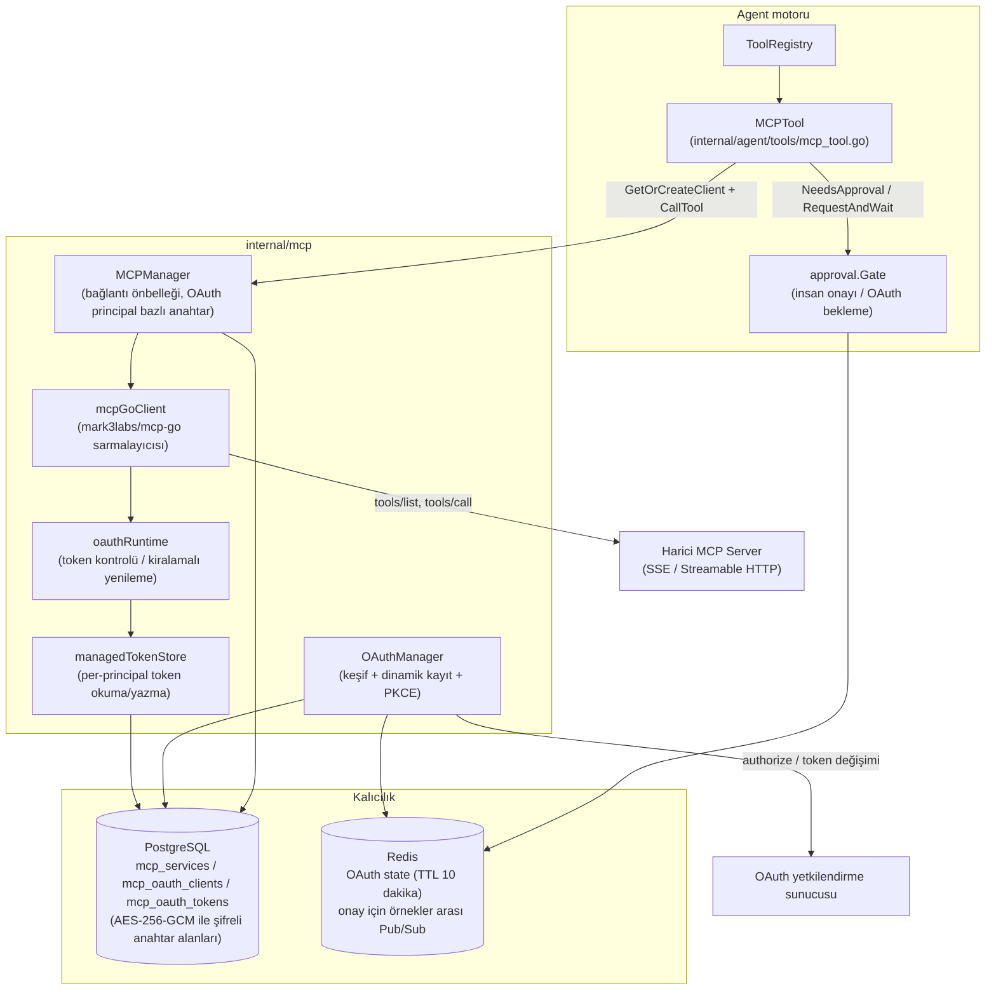
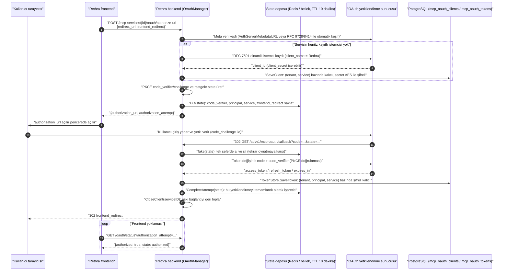
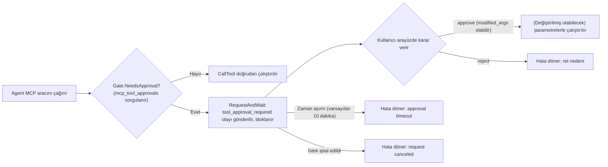
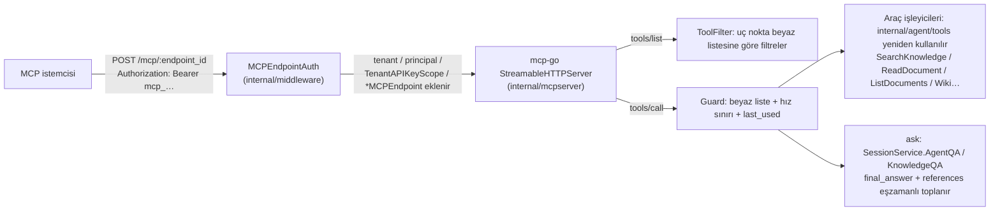

# MCP (Model Context Protocol) Entegrasyonu

MCP, ajanlar ile harici araçlar arasındaki bağlantı için kullanılır. Rethra harici MCP servislerine bağlanmayı destekler ve ayrıca diğer istemcilerin çağırması için bağımsız bir MCP Server sunar:

1. **MCP istemcisi olarak Rethra**: «Araç Kutusu → MCP Servisleri» bölümünden herhangi bir harici MCP server'a (SSE / Streamable HTTP) bağlanılır; araçları katalog üzerinden ihtiyaç anında yüklenir ve Agent tarafından sohbette çağrılır. API Key / Bearer / OAuth 2.0 (dinamik istemci kaydı ve PKCE dahil) olmak üzere üç kimlik doğrulama stratejisini, araç bazında açma/kapatmayı ve insan onayını, ayrıca sohbet içi (in-conversation) OAuth yetkilendirmesini destekler.
2. **MCP Server olarak Rethra**: «Ayarlar → Yayın Entegrasyonları → MCP Server» bölümünden mevcut alan için bir veya birden fazla MCP uç noktası oluşturulur. Her uç noktanın kendi token'ı, bilgi tabanı kapsamı ve araç listesi vardır; Claude Desktop, Cursor, Claude Code, VS Code Copilot gibi MCP istemcileri Streamable HTTP ile doğrudan bağlanır, ek bir süreç dağıtmaya gerek yoktur. Depodaki `mcp-server/` dizinindeki Python servisi eski çözümdür ve kullanımdan kaldırılmış olarak işaretlenmiştir.

Harici servislere bağlanmak Rethra ajanlarının araçlarını genişletir; Rethra MCP Server'ı çalıştırmak ise harici istemcilerin bilgi tabanı arama, soru-cevap ve yönetim yeteneklerini kullanmasını sağlar.

Alan Admin'i kenar çubuğundaki «Araç Kutusu → MCP Servisleri» bölümünden yeni servis oluşturur (eski «Ayarlar → MCP Servisleri» bağlantısı otomatik olarak buraya yönlendirir). Bağlantıyı doldurduktan sonra araçları eşitler ve kullanım açıklamasını yazar, ardından ajanda gereken servisi seçer. Yazma veya dışarı gönderme işlemlerini denetlemek gerektiğinde ilgili araçlar için insan onayı açılabilir; çağrıdan önce bir onay kartı gösterilir.

<Screenshot
  src="/screenshots/mcp-services.png"
  caption="MCP servis yapılandırması: harici araç servislerine bağlantı ve araç listesi"
  hint="MCP servis listesini, bir servisin yapılandırma formunu (URL, kimlik doğrulama yöntemi) ve bağlantı testinden sonra bulunan araç listesini gösterir." />

Bağlantı yöntemleri, kimlik doğrulama yapılandırması ve araç kapsamı aşağıdadır.

---

## Harici Araçlara Bağlanma {#harici-araclara-baglanma}

Yeni servis oluşturma iki adımdan oluşur:

1. **Bağlantı yapılandırması**: Ad ve servis URL'si girilir, SSE veya Streamable HTTP aktarımı seçilir ve kimlik doğrulama (yok / özel Header, API Key / Token, OAuth 2.0) ile zaman aşımı ve yeniden deneme ayarlanır. «Koddan içe aktar» ile standart `mcpServers` JSON'u yapıştırılarak form otomatik doldurulabilir; yalnızca `command` / `args` içeren stdio yapılandırmaları desteklenmez. Kaydettikten sonra bağlantı test edilebilir; OAuth servislerinde «Yetkilendir»e tıklandığında önce otomatik kaydedilir, ardından mevcut kullanıcı için yetkilendirme başlatılır.
2. **Araçlar ve kullanım açıklaması**: Bağlanıp Tools çekilir; sistem tam araç açıklamalarını ve parametre tanımlarını kaydeder. Ardından servisin amacını, uygun senaryoları ve temel kısıtları anlatan «Kullanım açıklaması» doldurulur. Araçlar eşitlendikten sonra «AI ile üret»e tıklanarak etkin araçlara göre kısa bir açıklama üretilebilir; kontrol edip kaydedin. Araç listesinde her araç için «Aracı etkinleştir» ve «Çağrı onay gerektirir» ayrı ayrı ayarlanabilir; değişiklikler anında geçerli olur ve kataloğu yenilemek bu ayarların üzerine yazmaz.

Model önce servisin kullanım açıklamasını okur, sonra gerektiğinde belirli araçları yükler; bu nedenle kullanım açıklaması Agent'ın doğru servisi seçip seçemeyeceğini doğrudan etkiler. OAuth servisleri her çağıran için ayrı ayrı yetkilendirilir. Araç onay gerektirdiğinde parametreler sohbette kontrol edilip onaylanır; bir araç tek başına devre dışı bırakıldığında çalışma zamanında o araç çalıştırılmaz. Rethra'nın MCP istemcisi stdio aktarımını desteklemez.

## Harici İstemcilerin Çağırması İçin {#harici-istemcilerin-cagirmasi-icin}

«Ayarlar → Yayın Entegrasyonları → MCP Server» bölümünde yeni uç nokta oluşturulur: ad girilir, erişilebilecek bilgi tabanları seçilir (boş bırakılırsa tümü), sunulacak araçlar işaretlenir ve gerekirse `ask` için kullanılacak varsayılan Agent (boş bırakılırsa yerleşik hızlı soru-cevap kullanılır) ile dakikalık çağrı sınırı (varsayılan 60) belirlenir. Oluşturulduktan sonra token ve `/mcp/<endpoint_id>` adresi bir kez gösterilir; sayfa ayrıca Cursor / VS Code / Claude Desktop için `mcpServers` yapılandırmasını, Claude Code için tek satırlık komutu ve yalnızca stdio destekleyen istemcilerin `mcp-remote` ile köprülenme biçimini verir.

Özel bir reverse proxy kullanılıyorsa `/api/` dışında `/mcp/` yolunun da olduğu gibi Rethra backend'ine iletilmesi, `Authorization` ve MCP protokol başlıklarının korunması, yanıt tamponlamanın kapatılması ve uzun bağlantılar için yeterli okuma/yazma zaman aşımı ayarlanması gerekir. Depoyla gelen Nginx, Vite geliştirme ve önizleme yapılandırmaları bu proxy'yi zaten içerir; web sitesi alan adıyla doğrudan bağlanılabilir, backend'in 8080 portunu ayrıca açmaya gerek yoktur.

<Screenshot
  src="/screenshots/mcp-server-endpoint.png"
  caption="Yayın Entegrasyonları → MCP Server: uç nokta oluşturulduktan sonra adres, token ve istemci yapılandırması"
  hint="Yeni uç nokta oluşturulduktan sonraki sonuç sayfası: tek seferlik token ve /mcp/<endpoint_id> adresi, Cursor / Claude Desktop için mcpServers yapılandırması ve Claude Code komutu; arka planda uç noktanın bilgi tabanı kapsamı ve dört araç grubunun işaretleri görünür." />

Bir alanda birden fazla uç nokta oluşturulabilir. Örneğin müşteri hizmetleri ekibine yalnızca arama ve soru-cevabı açık, yalnızca iki bilgi tabanını gören bir uç nokta; içerik ekibine ise yazma araçları açık başka bir uç nokta verilebilir. Token'lar istenildiği zaman döndürülebilir, uç noktalar istenildiği zaman devre dışı bırakılabilir; bir uç nokta silindiğinde onu kullanan istemcilerin bağlantısı hemen kesilir.

Uç noktanın sunduğu araçlar dört grup halinde işaretlenir; varsayılan olarak yalnızca salt okunur araçlar açıktır:

| Grup | Araçlar | Açıklama |
|---|---|---|
| Arama ve okuma | `list_knowledge_bases`, `search_knowledge`, `grep_chunks`, `list_documents`, `read_document` | Bilgi tabanı parametresi ID veya ad kabul eder; `search_knowledge` arama yöntemini `mode` (hybrid / semantic / keyword) ile seçer ve `limit` ayarlanabilir (varsayılan 10, üst sınır 30); `grep_chunks` büyük/küçük harfe duyarsız regex semantiğini korur: desenden sabit kelimeleri çıkarıp anahtar kelime indeksinde arama terimi olarak kullanır (anahtar kelime indeksi olmayan kütüphaneler adayları semantik indeksten alır), ardından her birini regex ile doğrular; dönen parçaların tümü desene uyar. Hiç sabit kelime içermeyen desenler (ör. `^\d+$`) reddedilir; `read_document` `offset` / `limit` ile sayfalanır veya `query` ile belge içinde ifade aranır |
| Soru-cevap | `ask` | Yalnızca uç noktada yapılandırılan varsayılan Agent'ı çalıştırır (istemci Agent seçemez; yapılandırılmamışsa yerleşik hızlı soru-cevap kullanılır). Sunucu tarafı otomatik oturum oluşturur, alıntılı tam yanıtı ve `session_id` değerini döndürür; sohbete devam etmek için bunu geri göndermek yeterlidir. Web araması açılmaz |
| Wiki | `wiki_search`, `wiki_read_page`, `wiki_index` | Yalnızca Wiki'si açık bilgi tabanlarında çalışır; `wiki_search` içindeki `query` mevcut regex semantiğini korur (büyük/küçük harfe duyarsız), geçerli regex olmayan metin sabit olarak eşleştirilir; `regex=false` sabit eşleşmeyi zorlar, `regex=true` geçerli regex gerektirir |
| Yazma | `add_document`, `update_document`, `delete_document` | Varsayılan olarak kapalıdır; Markdown metni veya URL içe aktarmayı destekler |

Mevcut MCP araçlarının dönüş sonuçları REST/IM'in kaynak bağlantısı dönüşümünü yeniden kullanır: metin gövdesi, Wiki içeriği ve yapısal verilerdeki resim referansları yetki kontrolünden sonra doğrudan erişilebilir HTTP(S) bağlantılarına dönüştürülür; yeni araç eklemek veya uç nokta araç listesini değiştirmek gerekmez. `ask` yanıtındaki `references[].images` resim URL'sini, caption'ı ve OCR metnini korur; metin referans listesi de resim bağlantılarını içerir. Böylece gövde özeti kırpıldığında resim bilgisi kaybolmaz.

Yerel veya özel depolama için harici istemcilerin erişebileceği bir `APP_EXTERNAL_URL` yapılandırın ve reverse proxy'nin `/r/` yolunu ilettiğinden emin olun. `resource://` resimleri süreli `/r/<token>` bağlantılarını kullanmaya devam eder; diğer depolama adresleri ilgili depolama servisinin ürettiği HTTP(S) URL'lerini kullanır. Tek bir araç çağrısında aynı kaynak yalnızca bir kez dönüştürülür ve dönen bağlantılar belgeye veya oturum kaydına geri yazılmaz. Erişilebilir bağlantı üretilemezse orijinal referans korunur ve metin sonucu kesilmez.

Bağlantı üretilmeden önce uç noktanın bilgi tabanı kapsamı, paylaşım yetkileri, kaynağın ait olduğu alan ve geçerli belge bağlaması yeniden kontrol edilir; bilgi tabanı resim önizlemesinin yetki kuralları kullanılır. Bilgi tabanı sınırlanmamış uç noktalar çağıranın görebildiği bilgi tabanlarına göre değerlendirilir; bu yüzden `ask` tarafından ajan aramasıyla bulunan paylaşılan bilgi tabanı resimleri de dönüştürülebilir. Orijinal yüklenen dosyalar yalnızca sonuç metninde göründükleri için indirme bağlantısı kazanmaz. Bağlaması olan eski depolama yolları dönüştürülebilir. Resim bağlaması eksik eski belgeler için yetkili bir yöneticinin belgeyi yeniden ayrıştırması ve ardından yeniden arama yapılması gerekir; yalnızca düzenlenebilir gövde metnine veya `image_info` alanına dayanarak dosya yetkisi otomatik verilemez.

> **`grep_chunks` geri getirmesinin bir üst sınırı vardır.** Adayları indeks üzerinden alır, her seferinde en fazla 30 tane, sonra regex ile filtreler. Bu yüzden dönen her kayıt desene uyar, ancak kapsamlı olması garanti edilmez: kütüphanede var olan eşleşmeler aday havuzuna girmemiş olabilir. Kaçırmanın kolay olduğu üç durum vardır: `foo.*bar` gibi birleşik desenlerde adaylar foo ve bar ile ilgililiğe göre sıralanır, bunların gerçekten yan yana geçtiği parçalar ilk 30'a giremeyebilir; `C++` gibi neredeyse yalnızca sembol kalan desenlerde çıkarılan sabit kelime yalnızca `C` olur ve indekste neredeyse hiç ayırt edicilik taşımaz; anahtar kelime indeksi olmayan kütüphaneler adayları semantik indeksten alır ve sabit eşleşme daha çok şansa kalır. Eski uygulama chunks tablosunda tam tablo regex taraması yapıyordu ve "varsa bulunur" garantisi veriyordu, ancak veri büyüdüğünde maliyeti çok yüksekti ve kaldırıldı. Bir belgede kapsamlı arama gerektiğinde `read_document`'in `query` parametresini kullanın; belgenin tamamını sırayla tarar.

Araç uygulaması doğrudan Agent'ın yerel araçlarını (`internal/agent/tools/`) yeniden kullanır; kimlik doğrulama API Key'in kapsam modelini kullanır: uç nokta yalnızca retrieve / chat / ingest gibi yetenekleri içeren ve bilgi tabanı kapsamı sınırlanmış bir kapsama dönüştürülür. Böylece backend servislerinin bu uç nokta için yaptığı kontroller kısıtlı API Key ile tamamen aynıdır. Uygulama ayrıntıları için aşağıdaki yerleşik MCP Server referansına bakın.

## Bağlantı Yöntemlerinin Karşılaştırması {#baglanti-yontemlerinin-karsilastirmasi}

| Boyut | MCP istemcisi olarak Rethra | MCP Server olarak Rethra |
|---|---|---|
| Kod konumu | `internal/mcp/` + handler/service/repository + `internal/agent/tools/` | `internal/mcpserver/` + `internal/middleware/mcp_endpoint_auth.go` + `internal/handler/mcp_endpoint.go` |
| Protokol kütüphanesi | `github.com/mark3labs/mcp-go` (client) | `github.com/mark3labs/mcp-go` (server, Streamable HTTP, durumsuz mod) |
| Aktarım | SSE, Streamable HTTP (stdio güvenlik nedeniyle devre dışı) | Streamable HTTP; stdio istemcileri `mcp-remote` ile köprülenir |
| Kimlik doğrulama | API Key / Bearer / OAuth 2.0 (DCR + PKCE, token AES ile şifreli, principal bazında yalıtılmış) | Gelen `Authorization: Bearer mcp_…`, her uç nokta için bağımsız token (SHA-256 ile saklanır, döndürülebilir) |
| Güvenlik denetimi | Araç düzeyinde insan onayı, SSRF doğrulaması, güvenilmeyen çıktı öneki, DTO düzeyinde anahtar yalıtımı | Uç nokta düzeyinde araç beyaz listesi (listeleme ve çağrıda çift doğrulama), bilgi tabanı kapsamı, dakikalık hız sınırı, token yalnızca bir kez gösterilir |
| Tüketici | Rethra Agent (sohbette otomatik çağırır) | Claude Desktop / Cursor / Claude Code / VS Code Copilot gibi herhangi bir MCP istemcisi |

## Yapılandırma ve Uygulama Referansı {#yapilandirma-ve-uygulama-referansi}

### MCP İstemcisi Referansı {#mcp-istemcisi-referansi}

#### Genel Mimari {#genel-mimari}

MCP istemcisiyle ilgili kodun dağılımı:

| Katman | Yol | Sorumluluk |
|---|---|---|
| Protokol istemcisi | `internal/mcp/client.go`, `types.go`, `errors.go` | `github.com/mark3labs/mcp-go` üzerine `MCPClient` arayüzünü sarar (Connect / Initialize / ListTools / CallTool / ListResources / ReadResource) |
| Bağlantı yönetimi | `internal/mcp/manager.go` | `MCPManager` bağlantıları önbelleğe alıp yeniden kullanır; OAuth servislerinde bağlantılar principal bazında yalıtılır |
| OAuth | `internal/mcp/oauth_manager.go`, `oauth_lifecycle.go`, `oauth_state.go`, `oauth_tokenstore.go` | Yetkilendirme kodu akışının düzenlenmesi, token yaşam döngüsü ve yenileme, in-flight state depolama, token kalıcılığı |
| Veri modeli | `internal/types/mcp.go`, `internal/types/mcp_oauth.go` | `MCPService`, `MCPAuthConfig`, `MCPToolApproval`, `MCPOAuthClient`, `MCPOAuthToken` (AES şifreleme kancaları dahil) |
| HTTP katmanı | `internal/handler/mcp_service.go`, `mcp_credentials.go`, `mcp_oauth.go`, `internal/handler/dto/mcp.go` | MCP servis CRUD, kimlik bilgisi alt kaynakları, OAuth yetkilendirme ve onay kaldırma arayüzleri; DTO yanıtların anahtar sızdırmamasını sağlar |
| İş katmanı | `internal/application/service/mcp_service.go`, `mcp_tool_approval_service.go` | Servis CRUD, bağlantı testi, kimlik bilgisi değişikliğinden sonra bağlantı geri toplama, onay politikaları |
| Depo katmanı | `internal/application/repository/mcp_service.go`, `mcp_oauth.go`, `mcp_tool_approval_repository.go` | GORM kalıcılığı (`mcp_services` / `mcp_oauth_clients` / `mcp_oauth_tokens` / araç onay tablosu) |
| Agent entegrasyonu | `internal/agent/tools/mcp_tool.go`, `mcp_oauth.go`, `internal/agent/approval/gate.go` | MCP araçlarını Agent Tool olarak sarma, insan onay geçidi (Gate), sohbet içi OAuth bekleme |



#### Veri Modeli ve Aktarım Yöntemleri {#veri-modeli-ve-aktarim-yontemleri}

`internal/types/mcp.go` içinde tanımlanan temel varlık `MCPService`:

```go
type MCPService struct {
    ID             string             `json:"id"                     gorm:"type:varchar(36);primaryKey"`
    TenantID       uint64             `json:"tenant_id"              gorm:"uniqueIndex:idx_tenant_name"`
    Name           string             `json:"name"                   gorm:"type:varchar(255);not null;uniqueIndex:idx_tenant_name"`
    Enabled        bool               `json:"enabled"                gorm:"default:true;index"`
    TransportType  MCPTransportType   `json:"transport_type"         gorm:"type:varchar(50);not null"`
    URL            *string            `json:"url,omitempty"          gorm:"type:varchar(512)"`
    Headers        MCPHeaders         `json:"headers"                gorm:"type:json"`
    AuthConfig     *MCPAuthConfig     `json:"auth_config"            gorm:"type:json"`
    AdvancedConfig *MCPAdvancedConfig `json:"advanced_config"        gorm:"type:json"`
    IsBuiltin      bool               `json:"is_builtin"             gorm:"default:false"`
    // ... StdioConfig / EnvVars / zaman damgaları / soft delete
}
```

Aktarım yöntemleri (`MCPTransportType`):

| Aktarım türü | Sabit değer | Durum | Açıklama |
|---|---|---|---|
| SSE | `sse` | ✅ Destekleniyor | Server-Sent Events; `client.NewSSEMCPClient` / OAuth'ta `client.NewOAuthSSEClient` |
| Streamable HTTP | `http-streamable` | ✅ Destekleniyor | MCP Streamable HTTP; `client.NewStreamableHttpClient` / OAuth'ta `client.NewOAuthStreamableHttpClient` |
| Stdio | `stdio` | ❌ **Devre dışı** | Güvenlik nedeniyle (komut enjeksiyonu riski) `NewMCPClient`, `MCPManager.GetOrCreateClient`, `CreateMCPService`, `UpdateMCPService` olmak üzere dört yerde birlikte reddedilir: `"stdio transport is disabled for security reasons"` |

> Not: Tip sisteminde `MCPTransportStdio` ve `StdioConfig` (`command` + `args`) alanları hâlâ duruyor, `mcp_tool.go` içinde de stdio için bağlantı serbest bırakma dalı var; ancak çalışma zamanında stdio istemcisi oluşturan tüm girişler engellenir ve fiilen yalnızca SSE ile Streamable HTTP kullanılabilir.

Gelişmiş yapılandırma `MCPAdvancedConfig` (varsayılanlar `types.GetDefaultAdvancedConfig()` fonksiyonundan gelir): `timeout` 30 saniye, `retry_count` 3, `retry_delay` 1 saniye. `timeout` hem HTTP client zaman aşımına hem de initialize el sıkışma zaman aşımına uygulanır (`manager.go` içinde initialize zaman aşımının üst sınırı 60 saniyedir). Agent'ın tek araç çağrısı için varsayılan olarak 60 saniyelik bir penceresi vardır; servisin `timeout` değeri 60 saniyeden büyükse o servisin CallTool penceresi buna göre uzatılır, 60 saniyeden küçükse kısaltılmaz (`internal/agent/tools/mcp_tool.go` içindeki `callToolTimeout`).

#### Kimlik Doğrulama Stratejileri {#kimlik-dogrulama-stratejileri}

`MCPAuthConfig.AuthType` dört strateji tanımlar (`internal/types/mcp.go`):

| `auth_type` | Davranış (`internal/mcp/client.go` içindeki `applyAuthHeaders`) |
|---|---|
| `""` (none) | Kimlik doğrulama yok. Geriye dönük uyumluluk: eski verilerde `api_key` / `token` varsa ilgili header eski davranışla yine eklenir |
| `api_key` | `<APIKeyHeader>: <APIKey>` eklenir; header adı varsayılan olarak `X-API-Key` olur, gizli olmayan `api_key_header` alanıyla özelleştirilebilir |
| `bearer` | `Authorization: Bearer <Token>` eklenir |
| `oauth` | Kullanıcı (principal) başına OAuth 2.0 yetkilendirme kodu akışı; token `mcp_oauth_tokens` içinde saklanır, ayrıntılar 1.6'da |

Stratejiler **birbirini dışlar**: `applyAuthHeaders`, `AuthType` değerine göre yalnızca seçilen stratejinin header'ını ekler (eski uygulama api_key ile bearer'ı aynı anda gönderiyordu). `custom_headers` yapısal bir yapılandırmadır; her zaman eklenir ve strateji header'ının üzerine yazabilir.

**Anahtarların şifreli saklanması**: `MCPAuthConfig`, `driver.Valuer` / `sql.Scanner` arayüzlerini uygular. Veritabanına yazılırken `SYSTEM_AES_KEY` yapılandırılmışsa `APIKey` ve `Token` önce AES-256-GCM ile şifrelenir (`enc:v1:` önekiyle); okunurken şeffaf biçimde çözülür. Çözme başarısız olursa (anahtar kaybı/rotasyonu) değer «yapılandırılmamış» sayılır ve loglanır; şifreli metin asla düz metin olarak kullanılmaz.

#### Bağlantı Yaşam Döngüsü ve MCPManager {#baglanti-yasam-dongusu-ve-mcpmanager}

`internal/mcp/manager.go` içindeki `MCPManager`, `map[cacheKey]MCPClient` bağlantı önbelleğini yönetir:

- **Önbellek anahtarı** (`cacheKey` fonksiyonu): OAuth olmayan servisler `service.ID` bazında tek bağlantıyı paylaşır; OAuth servisleri `service.ID + "\x00" + principal.StorageID()` ile **her kimlik için bir bağlantı** kullanır, böylece her kullanıcı kendi token'ıyla bağlanır.
- **GetOrCreateClient**: Önce önbelleğe bakar (yalnızca `IsConnected()` ise yeniden kullanır); bulunamazsa `NewMCPClient` → `Connect` (manager'ın uzun ömürlü context'iyle; SSE kalıcı bağlantı gerektirir) → `Initialize` (timeout ile sınırlı) → önbelleğe kaydeder. OAuth servisleri ctx'ten `TenantID` ve `MCPOAuthPrincipalFromContext` değerini alır (embed senaryosunda per-visitor principal'a eşlenir).
- **CloseClient(serviceID)**: Servisin önbellekteki tüm bağlantılarını keser ve siler; `serviceID\x00principal` biçimindeki tüm per-principal OAuth bağlantıları da buna dahildir. Kimlik bilgisi değişikliği, servisin devre dışı bırakılması/yapılandırma değişikliği, OAuth yetkilendirmesinin tamamlanması/iptali sonrasında çağrılarak bir sonraki çağrıda yeniden bağlanma zorlanır.
- **Arka plan temizliği**: Her 5 dakikada bir `removeDisconnectedClients()` bağlantısı kopmuş istemcileri kaldırır.
- **Oturum geçersizliğinden otomatik kurtulma**: `client.go` içindeki `checkErrorAndDisconnectIfNeeded`, sunucunun döndürdüğü `"Invalid session ID"` / `"No active connection"` hatalarını tanır (SSE ve Streamable HTTP ikisi de `Mcp-Session-Id` oturumu kullanır) ve bağlantıyı kendisi keserek bir sonraki çağrıda oturumun yeniden kurulmasını sağlar; `OnConnectionLost` geri çağrısı da aynı şekilde çalışır.

`Initialize` el sıkışmasında istemci kimliği şöyledir:

```go
ClientInfo: mcp.Implementation{ Name: "Rethra", Version: "1.0.0" }
```

#### REST API Uç Noktaları {#rest-api-uc-noktalari}

Rotalar `internal/router/router.go` içindeki `RegisterMCPServiceRoutes` ile kaydedilir (tümü `/api/v1` altındadır):

| Metot | Yol | Yetki | Açıklama |
|---|---|---|---|
| POST | `/mcp-services` | Admin+ | MCP servisi oluşturur (URL, `secutils.ValidateURLForSSRF` ile SSRF doğrulamasından geçer) |
| GET | `/mcp-services` | Viewer+ | Mevcut alanın MCP servislerini listeler (builtin dahil) |
| GET | `/mcp-services/{id}` | Viewer+ | Servis ayrıntıları (DTO ile maskelenmiş) |
| PUT | `/mcp-services/{id}` | Admin+ | Servisi günceller; ana PUT `auth_config.api_key` / `auth_config.token` alanlarını **yok sayar** (deprecated uyarısı loglar) |
| DELETE | `/mcp-services/{id}` | Admin+ | Servisi siler (soft delete, önce `CloseClient`) |
| POST | `/mcp-services/{id}/test` | Admin+ | Bağlantı testi: geçici istemciyle Connect + Initialize + ListTools + ListResources; `MCPTestResult` döndürür (`oauth_required` işareti dahil) |
| GET | `/mcp-services/{id}/tools` | Viewer+ | MCP servisinin araç listesini çeker |
| GET | `/mcp-services/{id}/resources` | Viewer+ | MCP servisinin kaynak listesini çeker |
| PUT | `/mcp-services/{id}/credentials` | Admin+ | `api_key` / `token` kimlik bilgilerini yazar (aşağıya bakın) |
| DELETE | `/mcp-services/{id}/credentials/{field}` | Admin+ | Tek bir kimlik bilgisi alanını (`api_key` veya `token`) temizler; idempotent, başarıda 204 döner |
| GET | `/mcp-services/{id}/tool-approvals` | Viewer+ | Servisin araç onay politikalarını listeler |
| PUT | `/mcp-services/{id}/tool-approvals/{tool_name}` | Admin+ | Aracı açar/kapatır veya onayı günceller: `{"enabled":bool,"require_approval":bool}`, en az biri gerekir |
| POST | `/mcp-services/{id}/oauth/authorize-url` | Viewer+ | Mevcut kullanıcı için OAuth yetkilendirmesi başlatır; `authorization_url` ve `authorization_attempt` döndürür |
| GET | `/mcp-services/{id}/oauth/status` | Viewer+ | Yetkilendirme durumunu sorgular; `authorization_attempt` parametresi verilirse yalnızca bu yetkilendirme akışını kabul eder |
| DELETE | `/mcp-services/{id}/oauth/token` | Viewer+ | Mevcut kullanıcının bu servis için token'ını iptal eder ve bağlantıyı geri toplar |
| GET | `/mcp-oauth/callback` | **Herkese açık** | Yetkilendirme sunucusu geri çağrısı (tek kullanımlık `state` parametresi kimlik doğrulama işlevi görür); `:id` rotasıyla çakışmaması için `/mcp-services` grubunun dışında kaydedilir |
| POST | `/agent/tool-approvals/{pending_id}` | Viewer+ | Bekleyen bir araç çağrısını onaylar/reddeder `{"decision": "approve"\|"reject", "reason"?, "modified_args"?}` |
| POST | `/agent/mcp-oauth-resolutions/{pending_id}` | Viewer+ | Sohbet içi OAuth tamamlandıktan sonra duraklatılmış Agent'ı sürdürür (`{"service_id", "decision": "authorize"\|"cancel"}`) |
| POST | `/agent/mcp-oauth-resolutions/{pending_id}/cancel` | Viewer+ | Sohbet içi OAuth istemini bilerek atlar |

Embed kanalının da karşılık gelen oturum düzeyi rotaları vardır (`/embed/sessions/{session_id}/mcp-oauth-resolutions/...`, `/embed/sessions/{session_id}/mcp-services/{id}/oauth/...`; `internal/handler/embed_channel.go` ve router.go dosyalarına bakın).

##### Kimlik Bilgisi Alt Kaynağı (mcp_credentials.go) {#kimlik-bilgisi-alt-kaynagi-mcp-credentials-go}

Anahtarlar (`api_key` / `token`) **ana PUT üzerinden gitmez**; ayrı bir `/credentials` alt kaynağı kullanılır. `internal/handler/mcp_credentials.go` içindeki yorum üç neden verir:

1. Ana PUT gövdesi hiçbir zaman anahtar taşımaz; böylece «maskelenmiş değerin geri yazılıp gerçek anahtarın üzerine yazılması» türündeki hatalar sözleşme düzeyinde ortadan kalkar;
2. Düzenleme penceresini kaydetmek (timeout / enabled vb. değiştirmek) yapılandırılmış kimlik bilgilerine yanlışlıkla zarar veremez;
3. «Yapılandırılmış mı» meta verisi ana kaynakla birlikte döner (`MCPServiceResponse.Credentials` içindeki `{"api_key": {"configured": bool}, "token": {...}}`), ek bir GET gerekmez.

PUT gövdesindeki alanlar pointer semantiği taşır: **belirtilmemiş = mevcut değer korunur**, **boş string = no-op** (silmek için DELETE kullanın), boş olmayan = değiştirilir. Kimlik bilgisi değişikliği başarılı olunca `UpdateMCPCredentials` `CloseClient` ile bağlantıyı geri toplar ve sonraki çağrı yeni kimlik bilgisini kullanır. Yanıt tarafında `internal/handler/dto/mcp.go` içindeki `MCPServiceResponse`, **derleme zamanında** hiçbir anahtar alanı içermemeyi garanti eder (`MCPAuthConfigResponse` `APIKey` / `Token` alanlarını içermez).

#### OAuth 2.0 Yetkilendirme Akışının Tamamı {#oauth-2-0-yetkilendirme-akisinin-tamami}

MCP server OAuth istediğinde (`auth_type: "oauth"`) Rethra tam bir yetkilendirme kodu akışı uygular: **RFC 9728 / RFC 8414 keşfi → RFC 7591 dinamik istemci kaydı → Authorization Code + PKCE → token'ın şifreli kalıcılığı → dağıtık kiralamalı otomatik yenileme**. Token'lar `(tenant_id, principal_type, principal_id, service_id)` boyutunda yalıtılır; aynı serviste her kullanıcı (veya embed ziyaretçisi, IM kullanıcısı gibi principal'lar; `internal/types/principal.go` dosyasına bakın) kendi token'ına sahiptir.

##### Yetkilendirme Sıralaması {#yetkilendirme-siralamasi}



##### Akışın Temel Noktaları (Kaynak Koda Karşılık) {#akisin-temel-noktalari-kaynak-koda-karsilik}

- **Keşif ve dinamik kayıt** (`internal/mcp/oauth_manager.go`): `StartAuthorization` önce `transport.OAuthHandler` oluşturur (`AuthServerMetadataURL` boşsa mcp-go yetkilendirme sunucusunu MCP URL'sine göre otomatik keşfeder); `mcp_oauth_clients` tablosunda bu `(tenant, service)` için henüz istemci yoksa `h.RegisterClient(ctx, "Rethra")` ile tek seferlik RFC 7591 kaydı yapar ve `SaveClient` ile kalıcılaştırır; sonrasında tüm kullanıcılar aynı client_id'yi kullanır.
- **PKCE**: `transport.GenerateCodeVerifier()` / `GenerateCodeChallenge()` / `GenerateState()`; `code_verifier` gizlidir ve **yalnızca sunucu tarafı state içinde saklanır** (`internal/mcp/oauth_state.go` yorumu state parametresine kodlanmasını açıkça yasaklar).
- **State deposu** (`oauth_state.go`): Redis varsa `rethra:mcp_oauth_state:<state>` anahtarına yazar (`RETHRA_REDIS_NAMESPACE` ad alanını destekler; geri çağrı herhangi bir backend kopyasına düşebilir); Lite modda GC'li bir bellek map'ine geriler. TTL 10 dakikada sabittir; `Take` **alınca silinen** tek seferlik tüketimdir. Ayrıca gizli bilgi içermeyen bir `OAuthAttempt` kaydı tutulur ve `CompleteAttempt` yalnızca token başarıyla veritabanına yazıldıktan sonra `Completed=true` yapar; bu yüzden yeni pencerenin yetkilendirme durumu sorgusu (`status?authorization_attempt=`) **eski token nedeniyle asla yanlışlıkla tamamlanmış sayılmaz**.
- **Geri çağrı** (`oauth_manager.go` içindeki `CompleteAuthorization` + `internal/handler/mcp_oauth.go` içindeki `Callback`): Geri çağrı rotası kimlik doğrulamasız ve herkese açıktır, tek seferlik state ile doğrulanır. Tarayıcı yönlendirmeyi aldıktan sonra Gin istek ctx'i iptal edildiği için token değişimi `context.WithoutCancel + 60s` zaman aşımıyla (`oauthCallbackTimeout`) istek yaşam döngüsünden ayrılır. Değişim başarılı olunca `CloseClient(serviceID)` eski kayıt bilgisini taşıyabilecek bağlantıları geri toplar; son olarak sonuç URL fragment'ine kodlanarak (`#mcp_oauth_result=success` / `#mcp_oauth_error=...`) frontend'e geri yönlendirilir.
- **Yeniden oluşturulan handler'ın CSRF kontrolü**: Geri çağrı isteğinde handler yeniden oluşturulduğu için beklenen state'in `h.SetExpectedState(state)` ile tekrar verilmesi gerekir; ancak böyle mcp-go'nun CSRF doğrulaması geçer.

##### Token'ın Şifreli Saklanması (oauth_tokenstore.go + types/mcp_oauth.go) {#token-in-sifreli-saklanmasi-oauth-tokenstore-go-types-mcp-oauth-go}

`mcp_oauth_tokens` tablo modeli `MCPOAuthToken`: benzersiz indeks `(tenant_id, principal_type, principal_id, service_id)`; `AccessToken` / `RefreshToken` GORM kancaları `BeforeCreate` / `BeforeSave` ile AES-256-GCM kullanılarak şifrelenir (`SYSTEM_AES_KEY`), `AfterFind` ile çözülür; iki alan da `json:"-"` olduğundan API yanıtlarında asla görünmez. `mcp_oauth_clients` içindeki `client_secret` de aynı şekilde şifrelenir.

`internal/mcp/oauth_tokenstore.go` iki katmanlı TokenStore sağlar:

- `dbTokenStore`: mcp-go'nun `transport.TokenStore` arayüzünü uygular; yetkilendirme/yenileme başarılı olunca mcp-go `SaveToken` geri çağrısıyla veritabanına yazar (`TokenType` eksikse `Bearer` yapılır, `ExpiresIn` `ExpiresAt` değerine çevrilir).
- `managedTokenStore`: Çalışma zamanı aktarımının fiilen kullandığı sarmalayıcıdır. **`GetToken`, `ExpiresAt` değerini siler**; böylece mcp-go token'ı her zaman süresi dolmamış sayar ve bağımlı kütüphanenin kendi otomatik yenilemesi devre dışı kalır. Yenileme kararı tamamen Rethra'nın koordineli yaşam döngüsüne bırakılır (aksi halde örnekler arası kiralama atlanır ve yenileme hataları genel bir authorization-required hatasına indirgenirdi).

##### Token Yenileme ve Örnekler Arası Kiralama (oauth_lifecycle.go) {#token-yenileme-ve-ornekler-arasi-kiralama-oauth-lifecycle-go}

Her MCP işlemi (Connect / Initialize / ListTools / CallTool / …) `client.go` içindeki generic sarmalayıcı `oauthCall` üzerinden çalışır:

```go
// İşlemden önce: ensureFresh(force=false) ön kontrolü;
// İşlem 401 dönerse: ensureFresh(force=true) ile bir kez zorla yenile ve bir kez yeniden dene;
// Diğer hatalarda yeniden denenmez; belirsiz ağ durumlarında araç yan etkilerinin tekrar tetiklenmesi önlenir.
```

`oauthRuntime.ensureFresh` kuralları:

- Süre dolumu tahmininde **30 saniyelik skew** (`oauthRefreshSkew`) kullanılır: `ExpiresAt` 30 saniye içinde doluyorsa yenileme gerekli sayılır; ancak **refresh_token'ı olmayan token'lar gerçek geçerlilik süresinin tamamını kullanır**, skew ömürlerini kısaltmaz.
- Süresi dolmuş ve refresh_token yoksa → token satırı silinir ve `OAuthReauthorizationRequiredError` döndürülür (kullanıcının yeniden yetki vermesi gerekir).
- Yenileme gerektiğinde `refreshWithLease` kullanılır: `mcp_oauth_tokens` satırındaki `refresh_lease_id` / `refresh_lease_until` sütunlarıyla **veritabanı düzeyinde yenileme kiralaması** uygulanır (varsayılan 45 saniye, HTTP zaman aşımına göre artar); `TryAcquireTokenRefreshLease` koşullu UPDATE ile kiralamayı kapar. Kapamayan örnekler her 100 ms'de yoklar; token materyalinin eşzamanlı yenileyen tarafından güncellendiğini ve süresinin dolmak üzere olmadığını görünce doğrudan yeniden kullanır. Böylece **çok örnekli dağıtımlarda aynı refresh_token yalnızca bir kez tüketilir** (refresh token rotasyonu güvenliği).
- Yenileme hataları derecelendirilir (`permanentRefreshFailure`): `invalid_grant` / `invalid_token` / `bad_refresh_token` / `expired_token` (veya HTTP 400) → kalıcı hata, token silinir ve yeniden yetkilendirme istenir; `invalid_client` / `unauthorized_client` (veya HTTP 401) → `mcp_oauth_clients` içindeki dinamik kayıtla birlikte silinir (sonraki yetkilendirmede yeniden kayıt yapılır); diğerleri (ağ dalgalanması vb.) → `OAuthRefreshTemporaryError`, **token korunur** ve operasyonel hata olarak yukarı iletilir, yeni yetkilendirme penceresi açılmaz.

`AuthorizationStatus` bu durumları üç hâl olarak sunar: `authorized` (şu anda kullanılabilir) / `refreshable` (süresi dolmuş ama refresh_token var) / `reauth_required`.

##### «Sunucu OAuth İstiyor» Yönlendirmesi {#sunucu-oauth-istiyor-yonlendirmesi}

Servis OAuth ile yapılandırılmamış **olsa bile**, hedef MCP server el sıkışmada RFC 9728 protected-resource meta verisi taşıyan bir 401 döndürürse `client.go` içindeki `asOAuthRequired` bunu `OAuthRequiredError` olarak sarar; `TestMCPService` (`internal/application/service/mcp_service.go` içindeki `mcpTestFailure`) buna göre test sonucunda `oauth_required: true` ayarlar ve arayüz, çıplak bir 401 göstermek yerine kullanıcıyı kimlik doğrulama yöntemini OAuth'a çevirmeye yönlendirir. Not: **Meta veri taşımayan çıplak 401 yanlışlıkla OAuth'a yönlendirmez** (sadece API key hatalı olabilir).

##### Sohbet İçi OAuth (in-conversation OAuth) {#sohbet-ici-oauth-in-conversation-oauth}

Agent sohbet sırasında OAuth kullanan bir MCP aracını çağırdığında mevcut kullanıcı henüz yetki vermemişse çağrı doğrudan başarısız olmaz (`internal/agent/tools/mcp_oauth.go`):

1. `getOrCreateMCPClientWithOAuthRetry` authorization-required türündeki hataları yakalar (`isAuthorizationRequired`);
2. `approval.Gate.RequestOAuthAndWait` ile frontend EventBus'a `EventMCPOAuthRequired` olayı gönderilir (`pending_id`, servis ve araç adı, zaman aşımı saniyesi dahil) ve **bloklayarak beklenir**; bekleme süresi Agent yapılandırmasındaki `mcp_auth_wait_timeout` değeridir (`internal/types/custom_agent.go`), yapılandırılmamışsa Gate'in varsayılan zaman aşımı kullanılır;
3. Kullanıcı açılan yetkilendirme penceresinde 1.6'daki standart akışı tamamladıktan sonra frontend `POST /agent/mcp-oauth-resolutions/{pending_id}` çağırır; handler (`mcp_oauth.go` içindeki `ResolveMCPOAuth`) **önce `(tenant, principal, service)` için gerçekten token bulunduğunu doğrular**, sonra devam ettirir (aksi halde 409), böylece sürdürme sonrası yeniden başarısızlık önlenir; kullanıcı `cancel` ile de atlayabilir;
4. İzin verildikten sonra `CloseClient` + yeniden bağlanma ile asıl çağrı bir kez yeniden denenir; zaman aşımı/iptal durumunda ret kararı döndürülür.
5. **Etkileşimsiz kanallar** (IM botları vb.; ctx'te `types.WithMCPOAuthNonInteractive` işareti bulunur) bloklanmaz: `emitMCPOAuthRequiredNotice` yalnızca `TimeoutSeconds: 0` olan bir bildirim olayı gönderir, kullanıcıya Web konsolundan bant dışı yetki vermesini hatırlatır ve Agent o aracı atlayıp devam eder.

#### Araç Keşfi ve Agent Entegrasyonu (mcp_tool.go) {#arac-kesfi-ve-agent-entegrasyonu-mcp-tool-go}

Agent başlarken `internal/application/service/agent_service.go` Agent yapılandırmasına göre MCP servislerini seçer:

| `mcp_selection_mode` | Davranış |
|---|---|
| `all` (varsayılan) | Kiracıdaki tüm etkin MCP servislerini kaydeder (builtin dahil) |
| `selected` | Yalnızca `mcp_services` listesinde belirtilen servisleri kaydeder |
| `none` | Hiçbir MCP aracı kaydetmez |

Üretimde varsayılan olarak kalıcı katalog ve ihtiyaç anında yükleme kullanılır. Geri yüklenecek eski araç yoksa modele başlangıçta yalnızca `discover_mcp_tools` ve yetkili servislerin kaynak özetleri verilir; kullanılabilir tam tanım alındıktan sonra ilgili fonksiyon ve `call_mcp_tool` birlikte sunulur. Tüm üst akış şemaları modele tek seferde gönderilmez.

1. `PrepareMCPTools` kalıcı anlık görüntüyü önceden okur ve ön yükleme için üst akışa bağlantı kurmaz; eksik veya güncelliğini yitirmiş kataloglar ilgili durumu gösterir. Çalışma zamanındaki katalog tamamlama yine yetkiler ve OAuth öznesiyle sınırlıdır.
2. Model `list_tools` / `search` ile konumu bulur, ardından `describe` ile tam araç tanımını ve `tool_ref` değerini alır. Liste özeti doğrudan çağrı tanımı olarak kullanılamaz.
3. Describe edilmiş araçlar bir sonraki model isteğinden önce normal fonksiyon olarak yayınlanır; yeni engine kullanılmış araçları oturum geçmişinden geri yükleyebilir veya `call_mcp_tool` vekili üzerinden çağırabilir.
4. Çalıştırma anında servis, özne, araç politikası ve parametre şeması yeniden kontrol edilir, ardından onay/OAuth/uzak çağrı zincirine girilir. Katalog önbelleği yetki kararlarını önbelleğe almaz.

Fonksiyon adları, temizleme sonrası çakışmaları önlemek için servis ID'si ve orijinal araç adının kararlı hash sonekini kullanır; referans belirli bir şemaya bağlanır, tanım değişirse yeniden okunması gerekir. Şema doğrulaması harici URL'lere veya dosyalara erişmez; onayda değiştirilen parametreler de doğrulanır. Servis açıklamaları ve araç sonuçları harici veri olarak işlenir; kullanıcı isteğini geçersiz kılma veya yetkiyi genişletme etkisi yoktur.

Mention yalnızca öncelikli seçimdir, Agent'ın `all / selected / none` kapsamını değiştirmez. Tüm fonksiyonları sunma yolu uyumluluk için korunur, üretim varsayılanı değildir.

##### Kalıcı Kataloğun Yönetimi {#mcp-tool-directory}

Ayarlar sayfasında önce bağlantı kaydedilir, sonra kullanım açıklaması düzenlenir ve araçlar eşitlenir. Mevcut katalog çevrimdışı görüntülenebilir; bağlantı veya kimlik doğrulama değiştirildikten sonra eski anlık görüntü `stale` olarak işaretlenir ve çalışma zamanında kullanılabilmesi için yenilenmesi gerekir. Yenileme başarısız olursa eksik katalog önceki anlık görüntünün üzerine yazılmaz.

| İçerik | Saklama yeri ve güncelleme |
| --- | --- |
| Elle yazılan kullanım açıklaması | `mcp_services.usage_instructions`; yenileme üzerine yazmaz. `description` yalnızca eski sürüm uyumluluğu içindir |
| Üst akış açıklaması, servis kimliği, tam tools/schema | `mcp_metadata`; tam çekme başarılı olduktan sonra atomik olarak kaydedilir |
| Araç bazında etkinleştirme ve onay | `mcp_tool_approvals`; katalog yenilemesinden bağımsızdır |
| Katalog yalıtımı | `(tenant_id, service_id, principal)`; statik kimlik doğrulama aynı alanda paylaşılır, OAuth geçerli yetkili özneye göre yalıtılır |

`GET /mcp-services/:id/metadata` yalnızca önbelleği okur, eşitlenmemişse `data:null` döner; `POST /mcp-services/:id/metadata/refresh` açıkça üst akışa bağlanıp eşitler. Statik kimlik doğrulamada yenileme için Admin veya ilgili yönetim yeteneği gerekir; OAuth kullanıcıları kendi yetki kataloglarını yenileyebilir. Arayüz öneki `/api/v1`'dir, bkz. [MCP API](../04-api/02-api-agent-mcp.md).

Çalışma zamanındaki `list_tools(refresh=true)` yalnızca veritabanını yeniden okumaz; üst akışı yeniden çeker ve mevcut öznenin anlık görüntüsünü kaydetmeye çalışır. Yenilemenin zaman aşımı ve katalog boyutu sınırları vardır; başarısızlıkta hata durumu korunur. Önbelleğin başarılı olması üst akışın şu anda kesin erişilebilir olduğu şeklinde yorumlanamaz. Yükseltmeden önce tam kataloğu olmayan servislerin ilk eşitlemeyi yapması gerekir.

#### Araçlar İçin İnsan Onayı (issue #1173) {#araclar-icin-insan-onayi-issue-1173}

**Onay ayrıntı düzeyi**: `(tenant_id, service_id, tool_name)` üçlüsü; bir `MCPToolApproval` kaydı `enabled` ve `require_approval` alanlarını tutar, bunlar sırasıyla aracın kullanılabilir olup olmadığını ve çağrının onay gerektirip gerektirmediğini belirler. Araç listesinin kendisi MCP `ListTools` çağrısından gelir; bu tablo yalnızca geçersiz kılmaları saklar (`internal/types/mcp.go` yorumu). Depo katmanı (`internal/application/repository/mcp_tool_approval_repository.go`) `ON CONFLICT (tenant_id, service_id, tool_name)` ile atomik Upsert yapar; `IsRequired` kayıt bulamazsa onay gerekmediğini kabul eder.

**Onay akışı** (`internal/agent/approval/gate.go`):



Temel uygulama noktaları:

- **Bloklama ve sürdürme**: `RequestAndWait` bir `pending_id` üretir, EventBus'a `EventToolApprovalRequired` gönderir (araç adı, parametre JSON'u, zaman aşımı saniyesi dahil) ve bellekteki waiter üzerinde bekler; kullanıcı `POST /agent/tool-approvals/{pending_id}` ile `decision: approve|reject` göndererek beklemeyi sonlandırır. Onay verildikten sonra `mcp_tool.go` **araç çalıştırma zaman aşımının tamamını ApprovalCtx'ten yeniden türetir** (onay süreci ilk 60 saniyelik bütçeyi tüketmiş olabilir).
- **Parametre değişikliği**: approve sırasında `modified_args` eklenebilir (null olmayan bir JSON object olmalıdır; handler tarafı `"null"` değerini açıkça reddeder); orijinal parametrelerin yerine geçerek çalıştırılır.
- **Yetkilendirme**: Resolve, tenant ve session sahibini doğrular (`ErrTenantMismatch` / `ErrUserMismatch`; boş userID eşleşmiyor sayılır, fail-close); tekrarlanan karar `ErrAlreadyResolved` döndürür.
- **Örnekler arası**: Waiter beklemeyi başlatan örneğin belleğindedir; Redis yapılandırılmışsa başka bir kopyaya düşen Resolve `rethra:mcp_approval:resolve` Pub/Sub ile yayınlanır, sahip örnek kararı iletir ve per-pending yanıt kanalıyla ack döner (3 saniyelik pencere); böylece HTTP durum kodu örnekler arasında da doğru kalır. Redis yoksa tek örneğe geriler (sticky session gerekir).
- **Zaman aşımı ve hata stratejisi**: Bekleme zaman aşımı varsayılan olarak 10 dakikadır ve `config.Agent.ToolApprovalTimeoutSeconds` ile ayarlanabilir. Onay kontrolü varsayılan olarak **fail-close** çalışır: veritabanı sorgusu hata verirse «onay gerekli» kabul edilir; eski fail-open davranışı `RETHRA_AGENT_TOOL_APPROVAL_FAIL_OPEN=true` ile geri getirilebilir.

#### Araç Bazında Açma/Kapatma {#arac-bazinda-acma-kapatma}

MCP servisinin araç listesinde tek bir araç devre dışı bırakılırken servisin diğer araçları korunabilir. Kaydı olmayan araçlar enabled=true sayılır; devre dışı bırakma çalışma zamanındaki araç kaydını etkiler ve çağrı anında da tekrar kontrol edilir, böylece açık oturumların devre dışı bırakılmış aracı çağırmaya devam etmesi önlenir.

`PUT /mcp-services/:id/tool-approvals/:tool_name` enabled ve require_approval alanlarından en az birini kabul eder, gönderilmeyen alanlar mevcut değerini korur. İnsan onayını kapatmak aracı devre dışı bırakmak anlamına gelmez; ilgili [API referansı](../04-api/02-api-agent-mcp.md).

#### Yerleşik (builtin) MCP Servisleri {#yerlesik-builtin-mcp-servisleri}

`mcp_services.is_builtin` işareti (`migrations/versioned/000017_mcp_builtin.up.sql` migration'ı ile eklendi) alanlar arasında paylaşılan yerleşik servisleri belirtir:

- **Görünürlük**: Depo katmanındaki tüm sorgular `tenant_id = ? OR is_builtin = true` kullanır (`internal/application/repository/mcp_service.go`), yani builtin satırlar tüm kiracılara görünür.
- **Değiştirilemezlik**: `UpdateMCPService` / `DeleteMCPService` / `UpdateMCPCredentials` / `ClearMCPCredential` builtin satırları her durumda reddeder ("builtin MCP services cannot be updated/deleted/have credentials modified").
- **Yanıt maskeleme**: `dto.NewMCPServiceResponse` builtin servislerden ayrıca `URL` / `Headers` / `EnvVars` / `StdioConfig` / `AuthConfig` ve `Credentials` meta verisini çıkarır; bu alanlar platformun üst akış sağlayıcısını nasıl yapılandırdığını açığa çıkarabilir ve kiracılara sızdırılmamalıdır.

Kodda sabit kodlanmış bir builtin MCP hazır listesi yoktur (`config/` altındaki `builtin_agents.yaml` / `builtin_models.yaml.example` MCP ile ilgili değildir); builtin satırlar platform operatörü tarafından doğrudan veritabanında hazırlanır (`is_builtin = true`), uygulama katmanı yalnızca yukarıdaki kurallara göre gösterme ve korumadan sorumludur.

---

### Yerleşik MCP Server Referansı {#yerlesik-mcp-server-referansi}

#### Veri Modeli ve Yönetim API'si {#veri-modeli-ve-yonetim-api-si}

`mcp_endpoints` tablosunda (PostgreSQL migration'ı `000102_mcp_endpoints`, SQLite `000022_mcp_endpoints`) her satır bir uç noktadır: `tenant_id`, `name`, `description`, `enabled`, `token_hash` (SHA-256), `token_hint` (önek gösterimi için), `knowledge_base_ids` (boş dizi alandaki tümü demektir), `tools` (beyaz liste), `default_agent_id` (boşsa yerleşik hızlı soru-cevap), `rate_limit_per_minute` (varsayılan 60, üst sınır 6000), `last_used_at`. Tip tanımı `internal/types/mcp_endpoint.go` dosyasında, araç kataloğu `internal/types/mcp_endpoint_tools.go` dosyasındadır.

Yönetim arayüzü `/api/v1/mcp-endpoints` altındadır; okuma için Viewer, değişiklik için Admin gerekir, API Key için `manage_channels` yeteneği gerekir (alanlar ve örnekler için bkz. [MCP API](../04-api/02-api-agent-mcp.md#mcp-server-uc-noktalari-api-v1-mcp-endpoints)):

| Metot | Yol | Açıklama |
|---|---|---|
| GET | `/mcp-endpoints` | Liste |
| GET | `/mcp-endpoints/tools` | Araç kataloğu (gruplar, varsayılan işaretler) |
| POST | `/mcp-endpoints` | Oluşturma; yanıt tek seferlik `token` içerir |
| GET / PUT / DELETE | `/mcp-endpoints/:endpoint_id` | Ayrıntı / güncelleme / silme |
| POST | `/mcp-endpoints/:endpoint_id/rotate-token` | Token döndürme; yanıt yeni `token` içerir |

Uç nokta token'ı yeni bir kimlik bilgisidir; bu nedenle kısıtlı bir API Key yalnızca kendi yetkisini aşmayan uç noktaları oluşturabilir, değiştirebilir veya token'ını döndürebilir: uç noktanın bilgi tabanları Key'in bilgi tabanı beyaz listesi içinde olmalıdır (Key'in beyaz listesi varsa uç nokta boş bırakılamaz, çünkü boş alandaki tümü demektir) ve uç nokta araçlarının gerektirdiği yetenekler (retrieve / chat / ingest vb.) de Key'de bulunmalıdır; aksi halde 403 döner.

#### İstek Yolu {#istek-yolu}



- Herkese açık `/mcp/:endpoint_id` rotası global Auth ara katmanından önce, embed herkese açık rotalarıyla aynı düzeyde kaydedilir; `MCPEndpointAuth` token'ı çözdükten sonra `applyAuthSession` ile kiracıyı, sentetik kullanıcıyı, `mcp_endpoint` principal'ını ve uç noktadan türetilen `TenantAPIKeyScope` değerini (`types.MCPEndpointScope`) yazar; alt servisler bilgi tabanı kapsamı ve yetenek kontrollerini buna göre yapar.
- Global olarak tam araç kataloğunu kaydeden tek bir `MCPServer` örneği vardır; `WithToolFilter` istek bağlamındaki uç noktaya göre `tools/list` sonucunu filtreler, `WithToolHandlerMiddleware` `tools/call` sırasında beyaz listeyi bir kez daha doğrular ve uç nokta başına kayan pencere hız sınırı uygular (öncelik Redis, yerel yedek).
- Aktarım `WithStateLess(true)` kullanır; herhangi bir kopya herhangi bir isteği işleyebilir, istemcinin `Mcp-Session-Id` tutması gerekmez.
- `ask` aracının oturum sahipliği `mcp_endpoint:<tenant>:<endpoint>` biçimindedir; sohbete devam ederken `session_id` değerinin aynı uç noktaya ait olduğu doğrulanır; tek bir yanıt en fazla 4 dakika sürebilir.
- Belge düzeyi araçlar (listeleme, okuma, yazma) önce `access.ResolveKB` ile yetkiyi çözümler, sonra bilgi tabanının ait olduğu alanda çalışır; bu yüzden organizasyon tarafından paylaşılan bilgi tabanları da okunup yazılabilir ve yeni belgeler sahibin alanında oluşturulur.

#### İstemci Yapılandırma Örnekleri {#istemci-yapilandirma-ornekleri}

```json
{
  "mcpServers": {
    "rethra-docs": {
      "url": "https://your-rethra.example.com/mcp/<endpoint_id>",
      "headers": { "Authorization": "Bearer mcp_xxxxxxxx" }
    }
  }
}
```

Claude Code:

```bash
claude mcp add --transport http rethra-docs https://your-rethra.example.com/mcp/<endpoint_id> --header "Authorization: Bearer mcp_xxxxxxxx"
```

Yalnızca stdio destekleyen istemciler:

```json
{
  "mcpServers": {
    "rethra-docs": {
      "command": "npx",
      "args": ["-y", "mcp-remote", "https://your-rethra.example.com/mcp/<endpoint_id>", "--header", "Authorization: Bearer mcp_xxxxxxxx"]
    }
  }
}
```

### Python MCP Server Referansı (Eski Sürüm, Kullanımdan Kaldırıldı) {#python-mcp-server-referansi-eski-surum-kullanimdan-kaldirildi}

::: warning Kullanımdan kaldırıldı
`mcp-server/` altındaki Python servisi, yerleşik MCP Server'dan önceki çözümdür: her süreç bir API Key'e bağlıdır, yalnızca tek bir alana erişebilir ve araçlar REST arayüzleriyle birebir eşleşir. Yeni kurulumlarda yukarıdaki yerleşik MCP Server'ı kullanın; bu bölüm yalnızca eski çözümü kullanmaya devam edenler için referanstır ve dizin sonraki sürümlerde kaldırılacaktır.
:::


`mcp-server/` bağımsız bir Python paketidir; PyPI adı **`rethra-mcp`** (şu an 1.1.1, Python ≥ 3.10, bağımlılıklar `mcp>=2,<3`, `requests>=2.31.0`, `starlette`, `uvicorn`). Temel uygulama `mcp-server/rethra_mcp_server.py` dosyasındadır: `RethraClient`, `requests.Session` ile `X-API-Key` taşıyarak Rethra REST API'sini çağırır; `MCPServer("rethra-server", version="1.1.1")` araçları kaydeder ve seçilen aktarım üzerinden dışarıya hizmet verir.

::: warning Paket adı ve API değişiklikleri (v1.1.x)
- Resmî paket adı `rethra-mcp`'dir (acrbaran/rag tarafından Trusted Publishing ile yayınlanır). Komut satırı girişleri hâlâ `rethra-mcp-server` / `rethra-server`'dır.
- Uygulama mcp 2.x'in üst düzey API'sine taşındı: araçlar `@mcp.tool()` dekoratörü eklenmiş normal fonksiyonlardır; girdi JSON Schema'sı tip açıklamalarından otomatik türetilir, açıklama docstring'den alınır, dönüş değeri otomatik serileştirilir. Eski `handle_list_tools()` / `handle_call_tool()` dağıtım yöntemi kaldırıldı; araç eklemek için yalnızca dekoratörlü yeni bir fonksiyon eklemek yeterlidir.
- Bloklayan ağ G/Ç'si (`chat` / `agent_chat`) iş parçacığı havuzunda çalıştırılır ve asyncio olay döngüsünü bloklamaz.
:::

#### Kurulum Yöntemleri {#kurulum-yontemleri}

Aşağıdaki komutlar `mcp-server/setup.py`, `pyproject.toml`, `Dockerfile` ve `INSTALL.md` ile tutarlıdır:

**Kaynaktan çalıştırma**:

```bash
cd mcp-server
pip install -r requirements.txt
python main.py            # veya python run.py / python run_server.py
```

**PyPI'dan kurulum** (iki console girişi sağlar: `rethra-mcp-server` ve `rethra-server`):

```bash
pip install rethra-mcp
rethra-mcp-server

# veya önceden kurmadan doğrudan uvx ile çalıştırın
uvx --from rethra-mcp rethra-mcp-server
```

**Yerel geliştirme kurulumu**:

```bash
cd mcp-server
pip install -e .          # geliştirme modu; veya pip install .
rethra-mcp-server
```

**Docker** (`mcp-server/Dockerfile`, `python:3.11-slim` tabanlı; varsayılan olarak Streamable HTTP aktarımıyla başlar ve 8000 portunu açar):

```dockerfile
ENV MCP_HOST=0.0.0.0
ENV MCP_PORT=8000
ENV RETHRA_BASE_URL=http://app:8080/api/v1
EXPOSE 8000
CMD ["rethra-mcp-server", "--transport", "http", "--host", "0.0.0.0", "--port", "8000"]
```

Konteyner çalıştırılırken `MCP_SERVER_AUTH_TOKEN` mutlaka verilmelidir (HTTP aktarımı bu değer olmadan başlamayı reddeder, bkz. 2.3).

Üç giriş betiğinin görevleri: `main.py` en kapsamlı ana giriştir (`--check-only` ortam kontrolü, `--verbose`, `--transport/--host/--port`); `run.py`, `main.sync_main` fonksiyonunu çağıran basitleştirilmiş betiktir; `run_server.py` ise `rethra_mcp_server.run` yolunu kullanır (stdio takma adı).

::: tip stdio aktarımında tanılama çıktısı
stdio aktarımı stdout'u protokol kanalı olarak kullanır; fazladan her `print` protokol akışını kirletir ve istemci doğrudan «başlatma başarısız» kararı verir. Bu nedenle giriş betiklerindeki tüm tanılama bilgileri stderr'e yazılır (#2371). Kendi başlatma betiğinizi yazarken aynı kurala mutlaka uyun.
:::

#### Ortam Değişkenleri {#ortam-degiskenleri}

Tümü `rethra_mcp_server.py` / `upload_paths.py` dosyalarının fiilen okuduğu değerlere göredir:

| Ortam değişkeni | Varsayılan | Açıklama |
|---|---|---|
| `RETHRA_BASE_URL` | `http://localhost:8080/api/v1` | Rethra API temel URL'si |
| `RETHRA_API_KEY` | boş | Kiracı API Key'i, `X-API-Key` header'ı ile gönderilir |
| `RETHRA_CHAT_TIMEOUT` | `300` | chat / agent_chat için SSE okuma zaman aşımı (saniye); geçersiz değer 300'e döner |
| `RETHRA_VERIFY_SSL` | `true` | `false` yapılırsa SSL sertifika doğrulaması kapanır (yalnızca kendinden imzalı sertifikalı geliştirme ortamları için) |
| `MCP_TRANSPORT` | `stdio` | Aktarım yöntemi: `stdio` / `sse` / `http` (CLI `--transport` önceliklidir) |
| `MCP_HOST` | `127.0.0.1` | Ağ aktarımının bağlanacağı adres |
| `MCP_PORT` | `8000` | Ağ aktarımının bağlanacağı port |
| `MCP_SERVER_AUTH_TOKEN` | boş | **SSE/HTTP aktarımı için zorunlu** paylaşılan anahtar; yapılandırılmamışsa süreç doğrudan `sys.exit(1)` ile çıkar |
| `MCP_ALLOWED_UPLOAD_DIRS` | boş | Virgülle ayrılmış dizin beyaz listesi; `create_knowledge_from_file` aracının okuyabileceği yerel yolları sınırlar |

#### Aktarım Yöntemleri ve Ağ Kimlik Doğrulaması {#aktarim-yontemleri-ve-ag-kimlik-dogrulamasi}

`main()` üç aktarımı destekler (öncelik: `--transport` CLI parametresi > `MCP_TRANSPORT` ortam değişkeni > varsayılan stdio):

| Aktarım | Uç nokta | Uygun senaryo |
|---|---|---|
| `stdio` | stdin/stdout borusu | Claude Desktop, VS Code Copilot gibi yerel istemciler (varsayılan) |
| `sse` | `http://host:port/sse` (mesaj geri dönüşü `/sse/messages/`) | Eski uzak MCP istemcileri |
| `http` | `http://host:port/mcp` | Streamable HTTP (MCP 2025-03-26 spesifikasyonu), varsayılan olarak `stateless_http` ile çalışır |

SSE mesaj geri dönüş yolu `SSE_MESSAGE_PATH = "/sse/messages/"` ile açıkça belirtilir: mcp 2.x'e geçişten sonra varsayılan yol gerçek bağlama noktasıyla uyuşmuyordu ve istemcilerin başlatmada zaman aşımına uğramasına yol açıyordu.

SSE ve HTTP aktarımlarında kimlik doğrulama `MCPAuthMiddleware` (ASGI ara katmanı) ile ortak yapılır: istemci `Authorization: Bearer <MCP_SERVER_AUTH_TOKEN>` veya `X-MCP-Auth-Token` header'ı taşımalıdır; karşılaştırma zamanlama saldırılarına karşı `secrets.compare_digest` ile yapılır, başarısızlıkta 401 döner. `require_network_transport_auth`, token yoksa ağ aktarımının hiç başlamamasını sağlar.

#### Sunulan MCP Araçları Listesi {#sunulan-mcp-araclari-listesi}

Toplam 31 araç vardır; bunlar `rethra_mcp_server.py` içindeki `@mcp.tool()` dekoratörlü fonksiyonlara karşılık gelir (parametre sütununda `*` zorunlu demektir; `RethraClient.update_knowledge_base` metodu vardır ancak araç olarak **kaydedilmemiştir**):

**Kiracı yönetimi**

| Araç adı | Parametreler | Açıklama |
|---|---|---|
| `create_tenant` | `name`\*, `description`\*, `business`\*, `retriever_engines` | Kiracı oluşturur; arama motoru belirtilmezse varsayılan olarak postgres'in keywords + vector çift motoru kullanılır |
| `list_tenants` | yok | Tüm kiracıları listeler |

**Bilgi tabanı yönetimi**

| Araç adı | Parametreler | Açıklama |
|---|---|---|
| `create_knowledge_base` | `name`\*, `description`\*, `embedding_model_id`, `summary_model_id` | Bilgi tabanı oluşturur; varsayılan parçalama: `chunk_size` 1000, `chunk_overlap` 200, ayırıcı `["."]`, multimodal açık |
| `list_knowledge_bases` | yok | Mevcut kiracının kendi bilgi tabanlarını listeler |
| `list_shared_knowledge_bases` | yok | Organizasyon/paylaşılan alan üzerinden mevcut kiracıya yetki verilmiş bilgi tabanlarını listeler |
| `get_knowledge_base` | `kb_id`\* | Bilgi tabanı ayrıntıları |
| `delete_knowledge_base` | `kb_id`\* | Bilgi tabanını siler |
| `hybrid_search` | `kb_id`\*, `query`\*, `vector_threshold`(0.5), `keyword_threshold`(0.3), `match_count`(5) | Vektör + anahtar kelime hibrit arama; `kb_id` UUID **veya ad** kabul eder (`resolve_kb_id` otomatik çözümler) |

**Bilgi yönetimi**

| Araç adı | Parametreler | Açıklama |
|---|---|---|
| `create_knowledge_from_file` | `kb_id`\*, `file_path`\*, `enable_multimodel`(true), `file_name` | Sunucudaki yerel dosyadan bilgi içe aktarır; `file_name`, `docs/spec/design.pdf` gibi dizinli bir ad olabilir ve bilgi tabanındaki ilgili klasöre konur; yol `upload_paths.resolve_upload_file_path` ile doğrulanır (bkz. 2.6) |
| `create_knowledge_from_url` | `kb_id`\*, `url`\*, `enable_multimodel`(true) | Web sayfası URL'sinden bilgi içe aktarır |
| `create_knowledge_from_text` | kb_id, title, content zorunlu; tag_ids, status | Markdown'dan elle bilgi oluşturur; status varsayılan olarak publish'tir, draft yalnızca kaydeder |
| `update_knowledge_from_text` | knowledge_id, content zorunlu; title, status | Elle yazılmış Markdown'u günceller; title boşsa eski başlık korunur, publish yeniden indeksler, draft taslak olarak kaydeder |
| `list_knowledge` | `kb_id`\*, `page`(1), `page_size`(20), `folder_path`, `folder_scope` | Bilgi kayıtlarını sayfalı listeler; `folder_path` klasöre göre filtreler (`""` kök dizindir) |
| `get_knowledge` | `knowledge_id`\* | Bilgi ayrıntıları |
| `delete_knowledge` | `knowledge_id`\* | Bilgiyi siler |

**Model yönetimi**

| Araç adı | Parametreler | Açıklama |
|---|---|---|
| `create_model` | `name`\*, `type`\*, `description`\*, `source`("local"), `base_url`, `api_key`, `is_default`(false) | Model yapılandırması oluşturur; `type` KnowledgeQA / Embedding / Rerank olabilir |
| `list_models` | yok | Tüm modelleri listeler |
| `get_model` | `model_id`\* | Model ayrıntıları |

**Oturum yönetimi**

| Araç adı | Parametreler | Açıklama |
|---|---|---|
| `create_session` | `kb_id`\*, `max_rounds`(5), `enable_rewrite`(true), `fallback_response`, `summary_model_id`, `title`, `description` | Bilgi tabanına bağlı sohbet oturumu oluşturur (yerleşik `embedding_top_k` 10, `keyword_threshold` 0.5, `vector_threshold` 0.7 gibi stratejilerle) |
| `get_session` | `session_id`\* | Oturum ayrıntıları |
| `list_sessions` | `page`(1), `page_size`(20) | Oturumları listeler |
| `delete_session` | `session_id`\* | Oturumu siler |

**Sohbet**

| Araç adı | Parametreler | Açıklama |
|---|---|---|
| `chat` | `session_id`\*, `query`\*, `knowledge_base_ids`, `web_search_enabled`(false) | RAG hattı (`/knowledge-chat/{session_id}`): ilgili parçaları bulduktan sonra LLM özetler; SSE akışını tüketip `{answer, references}` olarak birleştirir; `knowledge_base_ids` (ad veya UUID) verilmesi şiddetle önerilir |
| `agent_chat` | `session_id`\*, `query`\*, `agent_id`\*, `knowledge_base_ids`, `web_search_enabled`(false) | Agent hattı (`/agent-chat/{session_id}`): Agent araçları kendisi çağırır; ön kontrol vardır: Agent'ın `kb_selection_mode` değeri `none` veya `selected` olup yerleşik bilgi tabanı yoksa ve `knowledge_base_ids` de verilmemişse, backend'in anlaşılması zor hatası yerine kullanılabilir bilgi tabanlarının listesi doğrudan bildirilir |
| `list_agents` | `page`(1), `page_size`(50) | Mevcut kiracının kullanabildiği özel Agent'ları listeler |
| `get_agent` | `agent_id`\* | Agent'ın tam yapılandırmasını UUID veya ada göre gösterir (`kb_selection_mode` kontrolü için) |

**Parça yönetimi**

| Araç adı | Parametreler | Açıklama |
|---|---|---|
| `list_chunks` | `knowledge_id`\*, `page`(1), `page_size`(20) | Bilgi kaydının metin parçalarını listeler |
| `delete_chunk` | `knowledge_id`\*, `chunk_id`\* | Parçayı siler |

**Wiki (salt okunur)**

| Araç adı | Parametreler | Açıklama |
|---|---|---|
| `wiki_search` | `kb_id`\*, `query`\*, `limit`(10) | Wiki sayfalarında tam metin araması (başlık, slug, özet, bölüm) |
| `wiki_read_page` | `kb_id`\*, `slug`\* | Slug'a göre sayfanın tüm Markdown'unu, meta verisini ve gelen/giden bağlantılarını okur |
| `wiki_index_view` | `kb_id`\*, `limit`(50) | Türe göre (entity / concept / summary vb.) gruplanmış yapısal Wiki indeksi |

Kolaylıklar: `resolve_kb_id` / `resolve_agent_id` insan tarafından okunabilir adları (büyük/küçük harfe duyarsız) UUID'ye çözümler; bu yüzden `hybrid_search` / `chat` / `agent_chat` / `create_session` / `get_agent` hem ad hem UUID kabul eder. Ad çözümleme hem kendi bilgi tabanlarında hem paylaşılan bilgi tabanlarında arama yapar, paylaşılan kütüphanelere de doğrudan adla başvurulabilir; `resolve_agent_id` UUID biçiminde olmayan Agent tanımlayıcılarına izin verir. Tüm araç sonuçları biçimlendirilmiş JSON içeren `TextContent` olarak döner; istisnalar yakalanır ve `Error executing <name>: ...` metni döndürülür.

#### Claude Desktop Gibi İstemcilerde Yapılandırma {#claude-desktop-gibi-istemcilerde-yapilandirma}

stdio aktarımı (Claude Desktop'ın `claude_desktop_config.json` dosyası):

```json
{
  "mcpServers": {
    "rethra": {
      "command": "python",
      "args": ["/path/to/Rethra/mcp-server/main.py"],
      "env": {
        "RETHRA_BASE_URL": "http://localhost:8080/api/v1",
        "RETHRA_API_KEY": "your-rethra-api-key"
      }
    }
  }
}
```

PyPI'dan kurulduysa `command` doğrudan `rethra-mcp-server` olarak yazılabilir veya kurulum yapmadan `uvx` ile çalıştırılabilir:

```json
{
  "mcpServers": {
    "rethra": {
      "command": "uvx",
      "args": ["--from", "rethra-mcp", "rethra-mcp-server"],
      "env": {
        "RETHRA_BASE_URL": "http://localhost:8080/api/v1",
        "RETHRA_API_KEY": "your-rethra-api-key"
      }
    }
  }
}
```

Uzak dağıtımda (Docker / `--transport http`) istemci `http://<host>:8000/mcp` adresine bağlanır ve `Authorization: Bearer <MCP_SERVER_AUTH_TOKEN>` taşır.

Bu arada: Rethra ana programı (birinci bölüm) da MCP istemcisi olarak bu mcp-server'a bağlanabilir. «Araç Kutusu → MCP Servisleri» bölümünde `/mcp` uç noktasını gösteren yeni bir Streamable HTTP servisi oluşturun, kimlik doğrulama yöntemi olarak «API Key / Token» seçin, header adına `Authorization`, anahtar değerine `Bearer <MCP_SERVER_AUTH_TOKEN>` yazın; böylece Rethra Agent başka bir Rethra örneğini yönetebilir.

#### Dosya Yükleme Yolu Güvenliği (upload_paths.py) {#dosya-yukleme-yolu-guvenligi-upload-paths-py}

`create_knowledge_from_file`, **MCP server sürecinin çalıştığı makinedeki** yerel dosyayı okur; `mcp-server/upload_paths.py` yol için koruma uygular:

- Boş yollar ve `\x00` içeren yollar reddedilir; `os.path.realpath` ile normalleştirildikten sonra var olan normal bir dosya olmalıdır;
- Beyaz liste dizinleri: `MCP_ALLOWED_UPLOAD_DIRS` (virgülle ayrılmış) açıkça yapılandırılmışsa o geçerlidir; yapılandırılmamışsa **ağ aktarımları (sse/http) varsayılan olarak yalnızca mevcut çalışma dizinine izin verir** (uzak çağıranın diskte istediği dosyayı okumasını önler), stdio aktarımı varsayılan olarak sınırlamaz (yerel istemci zaten o makinede yetkilidir);
- `_path_within_root`, `os.path.commonpath` ile içerme kontrolü yapar; `..` ve sembolik bağlantı kaçışlarını önler.

---
