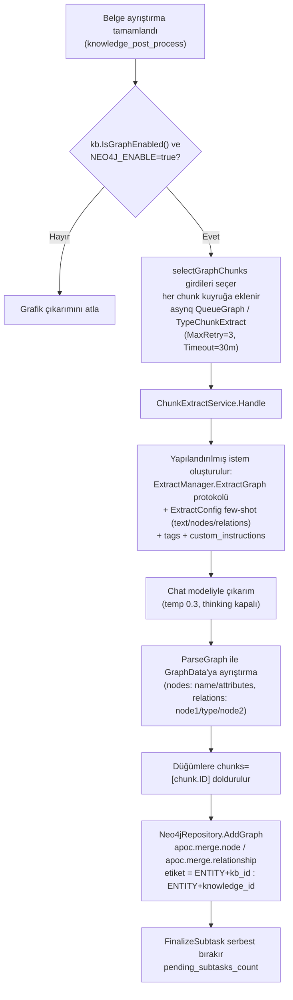
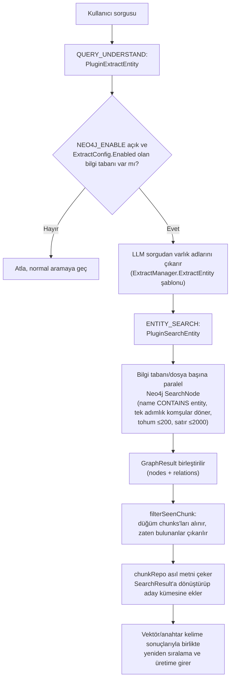

# Bilgi grafiği

Bilgi grafiği, belgeler içe alınırken varlıkları ve ilişkileri çıkarır, soru yanıtlama sırasında ilişkiler boyunca ilerleyerek daha fazla ilgili parça bulur. Vektör ve anahtar kelime aramasıyla birlikte kullanılarak yanıtlara ilişki bağlamı ekler.

Bu özellik kişiler, kuruluşlar, ürünler veya maddeler arasında çok sayıda ilişki içeren belgeler için uygundur. Etkinleştirildiğinde içe alma aşamasında model çağrıları artar ve Neo4j dağıtımı gerekir.

Grafik depolama Neo4j kullanır ve APOC eklentisine dayanır.

## Etkinleştirme yapılandırması

Grafik özelliği için **iki düzeydeki anahtarın** birlikte açık olması gerekir:

### Genel anahtar: Neo4j ortam değişkenleri {#genel-anahtar-neo4j-ortam-degiskenleri}

`NEO4J_ENABLE` bilgi grafiğinin tek genel anahtarıdır (`docker-compose.yml` açıklaması bunu açıkça belirtir: `ENABLE_GRAPH_RAG` v0.1.6'dan beri `NEO4J_ENABLE` ile değiştirilmiştir ve Go ana uygulaması artık onu okumaz).

| Ad | Tür | Varsayılan | Açıklama |
|------|------|--------|------|
| `NEO4J_ENABLE` | string | boş (kapalı) | Grafiği etkinleştirmek için `true` yapın; `internal/container/container.go` içindeki `initNeo4jClient` ile görev kuyruğa ekleme / arama hatları bunu kontrol eder |
| `NEO4J_URI` | string | `bolt://neo4j:7687` | Neo4j bağlantı adresi |
| `NEO4J_USERNAME` | string | `neo4j` | Kullanıcı adı |
| `NEO4J_PASSWORD` | string | `password` | Parola |

`initNeo4jClient` başlangıçta bağlantıyı kurup doğrulamak için en fazla 30 kez (2 sn arayla) dener; etkin değilse `nil` driver döndürür ve bu durumda `Neo4jRepository` yöntemlerinin tümü no-op'a düşer (log: `NOT SUPPORT RETRIEVE GRAPH`). `GET /system` bilgi uç noktası `getGraphDatabaseEngine()` ile `"Neo4j"` veya `"Not Enabled"` bildirir (`internal/handler/system.go`).

docker-compose'daki `neo4j` hizmetinde APOC önceden kuruludur: `NEO4JLABS_PLUGINS=["apoc"]` (grafik yazma `apoc.merge.node` / `apoc.merge.relationship`, silme ise `apoc.periodic.iterate` kullanır).

### Bilgi tabanı düzeyindeki anahtar: IndexingStrategy + ExtractConfig {#bilgi-tabani-duzeyindeki-anahtar-indexingstrategy-extractconfig}

`internal/types/knowledgebase.go`:

```go
// IsGraphEnabled checks if knowledge graph extraction is enabled.
// Requires both the IndexingStrategy flag and a valid ExtractConfig.
func (kb *KnowledgeBase) IsGraphEnabled() bool {
    return kb != nil && kb.IndexingStrategy.GraphEnabled &&
        kb.ExtractConfig != nil && kb.ExtractConfig.Enabled
}
```

- `IndexingStrategy.GraphEnabled` (`internal/types/indexing_strategy.go`): bilgi tabanı indeksleme stratejisindeki grafik anahtarıdır, varsayılan `false`; eski `ExtractConfig.Enabled` alanı okunurken tek yönlü olarak `IndexingStrategy.GraphEnabled`'e eşitlenir (`knowledgebase.go` içindeki legacy sync).
- `ExtractConfig` (`internal/types/knowledgebase.go`) çıkarımın few-shot yapılandırmasını taşır:

| Ad | Tür | Varsayılan | Açıklama |
|------|------|--------|------|
| `enabled` | bool | false | Çıkarımın etkin olup olmadığı |
| `text` | string | boş | few-shot örnek metni |
| `tags` | []string | nil | İlişki türü etiketleri kümesi |
| `nodes` | []*GraphNode | nil | Örnek varlık düğümleri (name / attributes) |
| `relations` | []*GraphRelation | nil | Örnek ilişkiler (node1 / node2 / type) |
| `custom_instructions` | string | boş | Alana özgü özel çıkarım talimatları (sistem istemine eklenir, yapılandırılmış çıktı protokolü yine sistemce denetlenir) |

Yapılandırma sihirbazı yardımcı API'leri (`internal/handler/initialization.go`, rotalar `internal/router/routes_infra.go` içinde kayıtlı, Admin gerekir; API Key için `manage_models` yeteneği gerekir):

- `POST /initialization/extract/text-relation` (`ExtractTextRelations`): bir metin parçası (≤5000 karakter) üzerinde seçilen etiketlerle ilişki çıkarımını deneme amaçlı çalıştırır, sonucu önizlemek için kullanılır;
- `POST /initialization/extract/fabri-text` / `fabri-tag` (`FabriText` / `FabriTag`): LLM'e örnek metin üretir / etiket önerir, kullanıcının `ExtractConfig`'i hızla kurmasına yardım eder.

## Varlık-ilişki çıkarım akışı (oluşturma)

### Tetikleme ve görev düzenleme

Belge ayrıştırma bittikten sonra `internal/application/service/knowledge_post_process.go`, zenginleştirme dağıtım aşamasında `selectGraphChunks` ile çıkarım girdilerini seçer (`eff.GraphEnabled` ise `graphChunkCount = len(graphChunks)`) ve `internal/application/service/extract.go` içindeki `NewChunkExtractTask` ile her chunk'ı ayrı ayrı kuyruğa ekler. Seçim kuralları:

- Gövde metni olan metin chunk'ları çıkarıma katılır; yalnızca görsel bağlantısı içeren metin chunk'ları atlanır;
- Üst metin chunk'ının gövdesi yoksa (tipik olarak taranmış PDF sayfa görselleri) onun `image_ocr` alt chunk'ı kullanılır, böylece OCR ile çıkarılan metin de grafiğe girer;
- `image_caption` alt chunk'ları OCR içeriğiyle tekrarlanmamak için katılmaz.

```go
func NewChunkExtractTask(...) (bool, error) {
    if strings.ToLower(os.Getenv("NEO4J_ENABLE")) != "true" {
        logger.Warn(ctx, "NEO4J is not enabled, skip chunk extract task")
        return false, nil
    }
    ...
    task := asynq.NewTask(types.TypeChunkExtract, payload,
        asynq.Queue(types.QueueGraph), asynq.MaxRetry(3), asynq.Timeout(30*time.Minute))
    ...
}
```

Görevler ayrı bir asynq `QueueGraph` kuyruğundan geçer; her chunk için bir LLM çağrısı yapılır (kaynak kod açıklaması bunu "hattaki en pahalı zenginleştirme dağıtımı" olarak adlandırır) ve model düzeyindeki arka plan eşzamanlılık sınırlayıcısına (limiter) tabidir. İptal edilen / silinen / yeni ayrıştırma denemesiyle geçersiz kılınan (`attemptSuperseded`) görevler çalıştırılmadan atlanır ve üst görevin `pending_subtasks_count` sayacını serbest bırakır.

### Çıkarımın yürütülmesi (ChunkExtractService.Handle)

`internal/application/service/extract.go`:

1. Chunk, bilgi tabanı ve dosya düzeyindeki `ProcessOverrides` yüklenir; `ResolveProcessConfig` ile geçerli `ExtractConfig` hesaplanır (etkin değilse atlanır).
2. Yapılandırılmış istem şablonu oluşturulur: sistem protokolü kısmı `config.ExtractManager.ExtractGraph`'ten gelir (`config/config.yaml` içindeki `extract.extract_graph`; varlık çıkarımı + öznitelik zenginleştirme + ilişki çıkarımı adımlarını içeren çok adımlı bir talimat), üzerine bilgi tabanının `custom_instructions`, `tags` değerleri ve `ExtractConfig`'in few-shot örnekleri (`Text/Nodes/Relations`) eklenir.
3. `chatpipeline.NewExtractor(chatModel, template).Extract(ctx, chunk.Content)` Chat modelini çağırır (`temperature 0.3`, `max_tokens 8192`, thinking kapalı; çıktı sınırı çok sayıda düğüm ve ilişkiyi alacak kadar büyüktür, JSON'un kesilmesini önler); sonuç `Formater.ParseGraph` ile `types.GraphData`'ya ayrıştırılır (`internal/types/extract_graph.go`):

```go
type GraphNode struct {
    Name       string   `json:"name,omitempty"`
    Chunks     []string `json:"chunks,omitempty"`
    Attributes []string `json:"attributes,omitempty"`
}
type GraphRelation struct {
    Node1 string `json:"node1,omitempty"`
    Node2 string `json:"node2,omitempty"`
    Type  string `json:"type,omitempty"`
}
```

4. Her düğüm için `node.Chunks = []string{chunk.ID}` doldurulur, ardından `graphEngine.AddGraph(ctx, NameSpace{KnowledgeBase, Knowledge}, ...)` ile Neo4j'ye yazılır.
5. Tüm süreç SpanTracker ile izlenir (`postprocess.graph.chunk[i]` alt span'i, nodes/relations sayılarını ve örneklerini kaydeder).

### Depolama arka ucu: Neo4j

`internal/application/repository/retriever/neo4j/repository.go`, `interfaces.RetrieveGraphRepository` arayüzünü uygular (`AddGraph` / `DelGraph` / `SearchNode`):

- **Ad alanı etikettir**: `NameSpace{KnowledgeBase, Knowledge}`, `ENTITY<kb_id>` ve `ENTITY<knowledge_id>` düğüm etiketlerine eşlenir (tireler alt çizgiyle değiştirilir); düğüm öznitelikleri `name`, `kg` (knowledge_id), `attributes` ve `chunks` içerir.
- Yazma işlemi APOC ile idempotent birleştirme kullanır; aynı adlı varlıkların `chunks` değerleri birleştirilir:

```cypher
UNWIND $data AS row
CALL apoc.merge.node(row.labels, {name: row.name, kg: row.knowledge_id}, row.props, {}) YIELD node
SET node.chunks = apoc.coll.union(node.chunks, row.chunks)
```

- Bilgi / bilgi tabanı silinirken (`knowledge_delete.go`, `knowledgebase.go`) `DelGraph` çağrılır; `apoc.periodic.iterate` ile 1000'lik gruplar halinde kenarlar ve düğümler paralel silinir.
- `SearchNode` sorgusunun, çok kısa veya çok yaygın bir varlık adının tüm grafiği geri getirmesini önleyen iki sınırı vardır:
  - Yalnızca en az bir ilişkisi olan varlıklar genişletme başlangıcı olabilir, en fazla 200 tohum varlık; sıralama önce adı tam eşleşenler, sonra adı kısa olanlar, sonra alfabetik şeklindedir;
  - Döndürülen (varlık, ilişki) satırları en fazla 2000'dir ve aynı sıralamayı izler; kesme sırasında üst sıradaki tohumların komşulukları korunur. Satır sınırına ulaşıldığında sonuçların kesildiğini bildiren bir Warn logu yazılır.

## Arama sırasında grafik zenginleştirme (GraphRAG)

Geleneksel sohbet hattında (`internal/application/service/chat_pipeline`) iki eklenti vardır:

1. **PluginExtractEntity** (`extract_entity.go`, `QUERY_UNDERSTAND` olayına bağlı): `NEO4J_ENABLE=true` ise önce `ExtractConfig.Enabled` olan bilgi tabanlarını seçer (`chatManage.EntityKBIDs` / `EntityKnowledge` içine kaydeder), ardından `ExtractManager.ExtractEntity` şablonu + Chat modeliyle **kullanıcı sorgusundan** varlık adlarını çıkarıp `chatManage.Entity` içine kaydeder.
2. **PluginSearchEntity** (`search_entity.go`, `ENTITY_SEARCH` olayına bağlı): grafiği etkin her bilgi tabanı / dosya için `graphRepo.SearchNode`'u paralel çağırır — Cypher `n.name CONTAINS nodeText` ile varlıkları bulanık eşler, tek adımlık komşuları ve ilişkileri döndürür, bunlar `chatManage.GraphResult` içinde birleştirilir (sorgu sınırları için aşağıya bakın); ardından `filterSeenChunk` grafik düğümlerinin taşıdığı `chunks` değerlerini alır (vektör aramasının zaten bulduklarını çıkarır), `chunkRepo`'dan asıl metni çekip `SearchResult`'a dönüştürür ve aday kümesine ekler; böylece "varlık → ilişkili chunk" grafik tamamlayıcı geri çağırması sağlanır.

Agent modu `query_knowledge_graph` aracını sunar (`internal/agent/tools/query_knowledge_graph.go`): her bilgi tabanında grafik yapılandırılıp yapılandırılmadığını denetler (`ExtractConfig.Nodes/Relations` boş değil), birden çok tabanda eşzamanlı arama yapar, chunk'a göre tekilleştirip sıralar ve çıktıya her tabanın grafik yapılandırma durumunu (varlık türleri / ilişki türleri listesi) ekler; grafik yapılandırılmamış tabanlar normal hibrit arama sonucuna düşer. Bu aracın yetenek gereksinimi `all_of: [graph]`'tir ve yalnızca Agent kapsamında grafiği etkin bir bilgi tabanı varsa modele sunulur — `agent_service.go` araç beyaz listesini kurarken grafik tabanı olmayan kapsamlardan onu çıkarır; böylece model yalnızca zayıf sonuç döndürebilen bir aracı tekrar tekrar çağırmaz.

## Akış diyagramları

### Oluşturma akışı



### Sorgu akışı



## Görselleştirme

- **Mermaid diyagramı üretimi**: `internal/application/service/graph.go` içindeki `graphBuilder`, `types.GraphBuilder` arayüzünün bellek içi uygulamasıdır (LLM varlıkları çıkarır → ilişkileri çıkarır → PMI×0.6 + Strength×0.4 ile ilişki ağırlığı hesaplanıp 1-10'a normalize edilir → varlık dereceleri hesaplanır → chunk ilişki grafiği kurulur); `generateKnowledgeGraphDiagram` DFS ile bağlı bileşenleri bulur ve Mermaid `graph TD` alt grafikleri üretir (sık geçen varlıklar vurgulanır, gücü >7 olan ilişkiler kalın okla gösterilir). Not: `NewGraphBuilder` şu anda konteyner kurulumunda çağrılmıyor (depoda başka başvuru yok); bağımsız/eski bir grafik oluşturma ve görselleştirme uygulamasıdır ve üretilen Mermaid diyagramı log'a yazılır.
- **Dış API**: Bilgi grafiğinin kendine özel bir görselleştirme REST uç noktası yoktur; `query_knowledge_graph` aracının yapılandırılmış çıktısı (`graph_configs`, sonuç listesi) Agent ön yüzünde gösterilir. `GET /wiki/graph` (`wikiHandler.GetGraph`) Wiki özelliğinin kendi grafik arayüzüdür ve bu belgedeki varlık-ilişki grafiğiyle ilgisi yoktur.
- **İstem şablonları**: `config/prompt_templates/graph_extraction.yaml`, `default_extract_entities` gibi şablonlar sağlar (Person/Organization/Location/... varlık türü listesi ve JSON çıktı protokolü); bunlar `internal/config/config.go` içindeki `extract_entities_prompt_id` / `extract_relationships_prompt_id` ile `Conversation.ExtractEntitiesPrompt` / `ExtractRelationshipsPrompt`'a çözümlenir ve yukarıdaki bellek içi `graphBuilder` tarafından kullanılır; üretimdeki asenkron çıkarım yolu ise `config.yaml` içindeki `extract.extract_graph` / `extract.extract_entity` şablonlarını (`ExtractManagerConfig`) kullanır.
