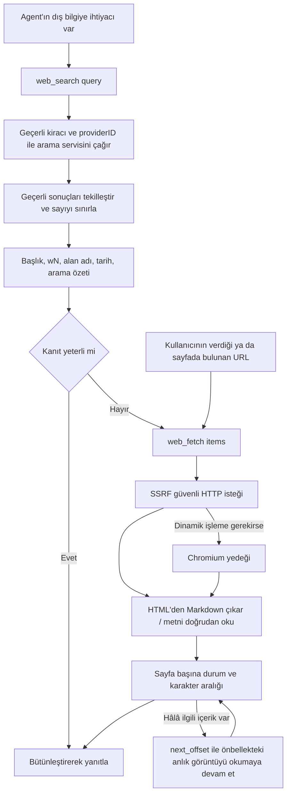

# Web araması ve web sayfası çekme

Web araması, bilgi tabanının dışındaki bilgileri tamamlamak için kullanılır. Agent sonuçları `web_search` ile bulur, ardından sayfa metnini `web_fetch` ile okur. Bir arama servisi bağlanabilir ya da SearXNG kurulabilir.

"Ayarlar → Web araması" bölümünde sağlayıcıyı seçin, kimlik bilgilerini girin ve bağlantıyı test edin; ardından bu arama yapılandırmasını Agent'ta seçin. Sonuç sayısı, Agent'ın en fazla sonuç sayısı ayarıyla sınırlıdır.

## Desteklenen arama motorları

Motorlar `internal/container/container.go` içindeki `registerWebSearchProviders` fonksiyonunda kaydedilir:

```go
registry.Register("duckduckgo", infra_web_search.NewDuckDuckGoProvider)
registry.Register("google", infra_web_search.NewGoogleProvider)
registry.Register("bing", infra_web_search.NewBingProvider)
registry.Register("tavily", infra_web_search.NewTavilyProvider)
registry.Register("baidu", infra_web_search.NewBaiduProvider)
registry.Register("searxng", infra_web_search.NewSearxngProvider)
registry.Register("keenable", infra_web_search.NewKeenableProvider)
registry.Register("zhipu", infra_web_search.NewZhipuProvider)
registry.Register("exa", infra_web_search.NewExaProvider)
registry.Register("metaso", infra_web_search.NewMetasoProvider)
registry.Register("bocha", infra_web_search.NewBochaProvider)
registry.Register("brave", infra_web_search.NewBraveProvider)
registry.Register("serply", infra_web_search.NewSerplyProvider)
```

| Motor | Kaynak dosya | API Key gerekli mi | Uç nokta | Not |
|------|---------|-----------------|------|------|
| DuckDuckGo | `duckduckgo.go` | Hayır | Önce HTML kazıma, yedek olarak API | Ücretsiz; `proxy_url` yapılandırılabilir |
| Google | `google.go` | Evet (ayrıca `engine_id` gerekir) | Google Custom Search API (resmî SDK `customsearch/v1`) | |
| Bing | `bing.go` | Evet | `https://api.bing.microsoft.com/v7.0/search` (sabit kodlu) | |
| Tavily | `tavily.go` | Evet | `https://api.tavily.com/search` (sabit kodlu) | |
| Baidu Qianfan AI Search | `baidu.go` | Evet | `https://qianfan.baidubce.com/v2/ai_search/web_search` (sabit kodlu) | |
| SearXNG | `searxng.go` | Hayır | Kiracının girdiği `base_url` (kendi barındırılan örnek) | Özel adrese izin veren tek motor; SSRF denetiminden geçmesi gerekir |
| Keenable | `keenable.go` | İsteğe bağlı | `https://api.keenable.ai` (sabit kodlu) | Key yoksa hız sınırlı genel uç nokta kullanılır, Key varsa sınır kalkar |
| Zhipu Search | `zhipu.go` | Evet | `https://open.bigmodel.cn/api/paas/v4/web_search` (sabit kodlu), varsayılan motor `search_std` | |
| Metaso | `metaso.go` | Evet | `https://metaso.cn/api/v1/search` | extra_config.scope kaynak kapsamını seçer, varsayılan webpage |
| Exa | `exa.go` | Evet | `https://api.exa.ai/search` | Varsayılan highlights; metin için extra_config.include_text kullanılabilir |
| Bocha | `bocha.go` | Evet | `https://api.bochaai.com/v1/web-search` | extra_config.freshness, summary |
| Brave Search | `brave.go` | Evet | `https://api.search.brave.com/res/v1/web/search` | Çağrı başına country/freshness desteklenir |
| Serply | `serply.go` | Evet | `https://api.serply.io/v1/search` | Google sonuçları; çağrı başına country/freshness desteklenir (yalnızca pd/pw/pm/py) |

Şu anda toplam 14 motor kayıtlıdır.

| Sağlayıcıya özel ek yapılandırma | Değer |
| --- | --- |
| Metaso scope | webpage (varsayılan), document, scholar, podcast, video, image |
| Exa include_text | Dize biçiminde boolean, örneğin `"true"`; varsayılan olarak metin alınmaz |
| Bocha freshness | noLimit (varsayılan), oneDay, oneWeek, oneMonth, oneYear |
| Bocha summary | Varsayılan olarak özet istenir; `"false"` yapılırsa kapanır |
| Brave çağrı başına filtre | country/freshness, web_search aracının parametreleridir (aşağıya bakın); Bocha'nın sabit yapılandırmasındaki alan değerlerinden farklıdır |
| Serply çağrı başına filtre | Brave ile aynı; country Google'ın gl parametresine eşlenir, freshness yalnızca pd/pw/pm/py kabul eder, tarih aralığı desteklenmez |

SearXNG dışındaki tüm motorların uç noktaları sabit kodludur ve kiracı tarafından yapılandırılamaz; bu, SSRF'ye karşı ilk önlemdir (kaynak koddaki yorum: `Not configurable by tenants — prevents SSRF`).

## Arama motoru yapılandırması (Provider varlığı)

Her çalışma alanı birden çok arama motoru yapılandırma örneği oluşturabilir (örneğin "Production Bing", "Test Google"). Bunlar `web_search_providers` tablosunda `WebSearchProviderEntity` (`internal/types/web_search_provider.go`) olarak saklanır ve Agent tarafından ID ile referans verilir. Parametre yapısı `WebSearchProviderParameters`:

| Ad | Tür | Varsayılan | Açıklama |
|------|------|--------|------|
| `api_key` | string | Boş | Arama servisi anahtarı; AES-GCM ile şifrelenip kaydedilir; yalnızca `/credentials` alt kaynağı üzerinden değiştirilir ve yanıtlarda asla döndürülmez |
| `engine_id` | string | Boş | Yalnızca Google Custom Search için gerekir |
| `base_url` | string | Boş | Yalnızca SearXNG: kendi barındırılan örneğin adresi; `utils.ValidateURLForSSRF` ile doğrulanır, iç ağ adresleri `SSRF_WHITELIST` listesine eklenmelidir |
| `proxy_url` | string | Boş | İsteğe bağlı giden HTTP/HTTPS proxy'si (yalnızca trafiği tüneller, API uç noktasını değiştirmez); o da SSRF denetiminden geçer |
| `extra_config` | map[string]string | nil | Sağlayıcıya özel parametreler; örneğin Metaso scope, Exa include_text, Bocha freshness/summary |

CRUD rotaları (`RegisterWebSearchProviderRoutes`, `internal/router/routes_infra.go`): `/web-search-providers` altında oluşturma, okuma, güncelleme ve silme; `POST /test` (kaydedilmemiş parametrelerle bağlantı denemesi), `POST /:id/test` (kaydedilmiş yapılandırmayı test etme), `PUT /:id/credentials` ve `DELETE /:id/credentials/:field`. Test ve yazma işlemleri Admin yetkisi ister. Ayrıca `GET /web-search/providers` kullanılabilir motor türleri kataloğunu döndürür. Arayüzlerin tamamı için bkz. [Altyapı API'si](../04-api/02-api-infra.md).

## Agent araması ve sayfa okuma

`web_search` kaynakları keşfeder, `web_fetch` seçilen sayfaları okur. Kullanıcı bir web sayfası belirttiğinde doğrudan okunabilir; kullanıcı dış ya da güncel bilgi istediğinde doğrudan arama yapılabilir. Bilgi tabanında arama gerekip gerekmediği görevin ilgisine ve o anda kullanılabilen araçlara bağlıdır; önce `search_knowledge` çağrısı artık zorunlu değildir.



### web_search

Çağrı örneği:

```json
{"query":"Python release notes","count":5}
{"query":"Rust release notes","country":"DE","freshness":"pw","content":true}
```

- `count` sonuç sayısını belirtir; aralık 1 ile geçerli Agent yapılandırmasındaki en fazla sonuç sayısı (en çok 20) arasındadır. Belirtilmezse mevcut Agent varsayılanı kullanılır.
- `country` / `freshness` Brave ve Serply sağlayıcılarında etkilidir. Bölge iki harfli kod ya da `ALL` kabul eder; güncellik `pd` / `pw` / `pm` / `py` ya da `YYYY-MM-DDtoYYYY-MM-DD` kabul eder. `country` belirtilmezse bu parametre Brave'e gönderilmez (Brave kendi başına varsayılan olarak US kullanır); açıkça `ALL` verilmesi küresel sonuç demektir. Serply'de `country` Google'ın `gl` parametresine eşlenir (belirtilmezse ya da `ALL` ise `gl` gönderilmez ve bölgeyi Google belirler); `freshness` yalnızca `pd` / `pw` / `pm` / `py` kabul eder. Diğer sağlayıcılar bu filtreleri henüz desteklemez; açıkça verildiklerinde sessizce yok sayılmaz, hata döner. Parametre değerleri için bkz. [Brave resmî API belgeleri](https://api-dashboard.search.brave.com/api-reference/web/search/get).
- `content` varsayılan olarak kapalıdır. `true` yapıldığında ilk 3 sonucun metni paralel olarak çekilir (tüm grup için 15 saniyelik bütçe, sayfa başına en fazla 5.000 karakterlik alıntı); diğer sonuçlarda arama özeti kalır ve sayfayı okumak için `web_fetch` kullanılmalıdır. Çekme başarısız olsa bile özet korunur; tam metnin adresi `full_output_path` ile döndürülür. Arama ve bağımsız `web_fetch` bu turun anlık görüntüsünü paylaşır; kısa zaman aşımı, devam eden ortak çekmeyi iptal etmez.
- Brave'in göreli `age` değeri olduğu gibi korunur; böylece "2 days ago" kesin bir yayın tarihi gibi gösterilmez.
- Boş sorgular, geçersiz URL'ler ve yinelenen sonuçlar ayıklanır; en fazla sonuç sayısı Agent yapılandırmasından gelir, üst sınır 20'dir.
- Agent araması artık `CompressWithRAG` çağırmaz, geçici bilgi tabanı oluşturmaz, embedding/rerank modeline ya da Redis'teki geçici duruma bağlı değildir. Sohbetin hızlı yanıt hattındaki RAG sıkıştırma yapılandırması hâlâ o hat tarafından işlenir.
- Model çıktısı başlık, alan adı, varsa tarih ve wN sayfa ID'sini içerir. Özetler ve provider content, sayfayla doğrulanmamış arama kanıtı olarak işaretlenir; her bölüm en fazla 1.500 karakterdir, tüm kanıt grubunun bütçesi 16.000 karakterdir.

### web_fetch

Çağrı örneği:

```json
{"items":[{"url":"w1"},{"url":"https://example.com/guide","limit":4000}]}
```

- Bilinen wN sayfa ID'lerini de, kullanıcının verdiği ya da sayfada bulunan HTTP(S) URL'lerini de kabul eder. Kısa ID'ler model bağlamı sınırında geri çözülür; UI ve kalıcı sonuçlar gerçek URL'yi korur.
- `prompt` parametresi kaldırıldı; araç şeması yalnızca `url`, `offset`, `limit` alanlarını açar. Özet için artık ikinci bir model çağrılmaz; web sayfası metnini ana Agent doğrudan analiz eder.
- HTML'de metin önce Readability ile çıkarılır; başarılı olursa çıkarılan sonucun tamamı doğrudan dönüştürülür, yalnızca başarısız olursa main/article/body'ye geri dönülür. Böylece iç `.content` düğümünün ikinci kez seçilmesiyle komşu paragrafların kaybolması önlenir. Markdown'a dönüştürüldükten sonra başlıklar, paragraflar, bağlantılar, tablolar ve kod korunur. Göreli bağlantılar son HTTP URL'sine göre çözülür; gömülü kaynaklar otomatik indirilmez.
- Düz metin, Markdown, JSON/XML doğrudan okunur; böylece `<...>` içerikleri HTML sanılıp atılmaz. İkili biçimler açıkça `unsupported_content` olarak raporlanır.
- Önce HTTP denenir; mevcut Chromium dinamik sayfa yedeği korunur. Ağ istekleri yine ortak SSRF denetiminden, güvenli istemciden ve DNS pinning'den geçer.
- Her grupta en fazla 8 öğe bulunur; aynı normalleştirilmiş URL, offset ve limit tekilleştirilir. Her öğe bağımsız olarak `success` / `failed` / `skipped` döndürür; kısmi başarısızlıkta başarılı metinler korunur.
- `offset` 0'dan başlayan Unicode karakter ofsetidir; `limit` varsayılanı ve üst sınırı 8.000'dir. Grup, metin alanını çıktı bütçesine göre dağıtır ve `offset`, `returned_chars`, `content_length`, `truncated` döndürür; kalan içerik varsa `next_offset` döndürür.
- Okumaya aynı URL ve `offset=next_offset` ile devam edilir. Bellek önbelleği en fazla 8 sayfa anlık görüntüsü tutar ve yalnızca bu çalışmadaki karakter bazlı devam okuması için kullanılır; anlık görüntü önbellekten atıldıktan sonra, dönen `full_output_path` ile aynı tam metin sayfa yeniden çekilmeden okunmaya devam edilebilir. Eski usul karakter bazlı devam okuması önbellek geçersizleştiğinde yeniden denenebilir `snapshot_expired` döndürür (offset 0'dan yeniden çekin ya da `read_file` kullanın); böylece sayfanın farklı sürümleri birbirine eklenmez. Aynı gruptaki devam okumaları ilk çekmenin bitmesini bekler.
- Çekmeden sonra Markdown'ın tamamı oturumun ait olduğu kiracının dosya deposuna kaydedilir ve `web://...` biçiminde `full_output_path` döndürülür. `read_file` bu dosyaları turlar arasında okuyabilir; sandbox'ın etkin olması gerekmez. Metin onu üreten assistant mesajına bağlıdır; okuma sırasında kiracı, oturum sahibi, oturum, mesaj ve web sayfasına özel bağlama denetlenir; sıradan ekler web sayfası olarak okunamaz. Mesaj ya da oturum silindikten sonra erişilemez; depolama saklama ilkesi mevcut yumuşak silinmiş mesaj ekleriyle aynıdır.
- Kaydetme başarısız olsa da çekilmiş metin atılmaz: sonuç `storage_error` içerir ve bu durumda devam okuması yalnızca bu turun bellek önbelleğiyle sınırlıdır. Kaydedilen tek bir Markdown'ın üst sınırı 8 MiB'tir.
- `read_file` için `offset` 1'den başlayan satır numarasıdır; `limit` en fazla 2.000 satırdır, web sayfası okuması en fazla 50 KiB'tir ve yine Agent çıktı bütçesiyle sınırlıdır. Çok uzun tek bir satırla karşılaşıldığında `next_offset` ve `next_line_offset` döndürülür; özgün satırı okumaya `offset` ile `line_offset` kullanarak devam edilir. Böylece sandbox'sız Agent'ın da shell çalıştırması gerekmez.
- Agent için tek sayfa indirme sınırı 2 MiB'tir; aşılırsa `body_too_large` raporlanır ve sessizce kesilmiş HTML tam sayfa gibi sunulmaz. İstek zaman aşımı hâlâ 60 saniyedir; Agent çekmesi HTTP 2xx yanıtlarını kabul eder.
- Başarısızlıklarda yine kararlı hata kodları ve yeniden denenebilirlik işareti döner. Geçici hatalar makul biçimde yeniden denenebilir; kalıcı hatalarda başka ilgili kaynaklar seçilebilir, kanıt yetersizse eksik açıklanır. Tüm grubun bir kez başarısız olması araştırmayı zorla sonlandırmaz, doğrulama başarılı da sayılmaz.
- Web erişimi kapalıyken eski `allowed_tools` bu iki aracı listelese bile çalışma zamanında kaydedilmezler. Başarısız sayfalar artık başarılı web kaynağı olarak gösterilmez.

Ortak çekicinin hızlı yanıt yolu `NewPipelineFetcher` kullanmaya devam eder: 15 saniye zaman aşımı, 100 KiB indirme sınırı, yalnızca HTTP ve eski düz metin çıkarımı.

## docker/searxng'nin rolü

SearXNG kendi barındırılan bir üst arama motorudur (birden çok üst kaynak motoru birleştirir). Rethra onu **API Key gerektirmeyen, varsayılan isteğe bağlı arama arka ucu** olarak `docker-compose.yml` içindeki `searxng` / `full` profiline paketler:

- `docker/searxng/settings.yml`: Önemli özelleştirmeler şunlardır: `search.formats` içinde `json` açılır (Rethra arka ucu `/search?format=json` kullanır); `server.limiter: false` (IP hız sınırlaması kapatılır, aksi hâlde arka uç kısıtlanır; herkese açık kurulumlarda yeniden açıp izin listesi yapılandırın); `secret_key` giriş betiği tarafından `SEARXNG_SECRET` ortam değişkeniyle değiştirilir.
- `searxng-init` yardımcı konteyneri şablonu önce ayrı bir volume'a kopyalar; böylece SearXNG giriş betiğinin yerinde sed ile yaptığı değişiklik çözümlenmiş anahtarı depo çalışma alanına geri yazmaz.
- Ana makine bağlantı noktası `SEARXNG_PORT` (varsayılan 8888) ve `SEARXNG_BIND` (varsayılan `127.0.0.1`) ile denetlenir. `SEARXNG_PORT` değerini `APP_PORT` (varsayılan 8080) ile aynı yapmayın: Linux'ta ikisi aynı bağlantı noktasını yayımladığında `localhost:8080` isteği önce SearXNG'ye düşebilir ve giriş arayüzü SearXNG'nin HTML 404 sayfasını döndürür.
- Uygulama konteyneri varsayılan olarak `searxng` ana makine adını SSRF beyaz listesine ekler: `SSRF_WHITELIST_EXTRA=searxng,qdrant,...`; bu yüzden kiracının `base_url: http://searxng:8080` yapılandırması kutudan çıktığı gibi çalışır.
- İstemci zaman aşımı 12 saniyedir (`defaultSearxngTimeout`); bu, SearXNG'nin `outgoing.max_request_timeout: 10.0` değerinden biraz yüksektir, böylece yavaş üst kaynak motorları istemci iptali olarak değil SearXNG tarafı hatası olarak görünür. `ValidateSearxngBaseURL` "kaydetme" ve "kullanma" aşamalarında ortak kullanılır ve yapılandırma denetiminin tutarlı olmasını sağlar.

## Uygulama ve genişletme başvurusu

### Giden isteklerde SSRF koruması

`internal/infrastructure/web_search/proxy.go` içindeki `NewSearchHTTPClient` tüm motorlar için ortak ve güvenli bir HTTP istemcisi oluşturur:

- `DialContext`, `utils.SSRFSafeDialContext` kullanır (bağlanırken hedef IP'yi doğrular, DNS rebinding'i önler);
- Yönlendirmelerin her adımı `ssrfSafeRedirect` ile `ValidateURLForSSRF` üzerinden yeniden doğrulanır; en fazla adım sayısı aşılırsa istek başarısız olur;
- Açıkça verilen `proxy_url` SSRF denetiminden geçmelidir; yapılandırılmamışsa `ProxyFromEnvironment` kullanılır.

`SSRF_DNS_WHITELIST_ONLY` açıldığında arama servisi alan adları, SearXNG ana makine adı ve `web_fetch` ile okunacak web sayfası alan adları `SSRF_WHITELIST` listesine yazılmalıdır; aksi hâlde DNS sorgusundan önce reddedilir. Ayrıntılar için bkz. [Yapılandırma başvurusu](../01-getting-started/04-configuration.md).

### Arayüz soyutlaması

Arama yeteneği iki katmanlı arayüzle tanımlanır (`internal/types/interfaces/web_search.go`):

```go
// WebSearchProvider defines the interface for web search providers
type WebSearchProvider interface {
    Name() string
    Search(ctx context.Context, query string, maxResults int, includeDate bool) ([]*types.WebSearchResult, error)
}

// WebSearchService defines the interface for web search services
type WebSearchService interface {
    Search(ctx context.Context, providerID string, config *types.WebSearchConfig, query string) ([]*types.WebSearchResult, error)
    CompressWithRAG(ctx context.Context, sessionID string, tempKBID string, questions []string, ...) (...)
}
```

`internal/infrastructure/web_search/registry.go` **provider türü -> fabrika fonksiyonu** kayıt tablosunu tutar; örnekler çağrı sırasında kiracı parametreleriyle oluşturulur:

```go
type ProviderFactory func(params types.WebSearchProviderParameters) (interfaces.WebSearchProvider, error)

func (r *Registry) Register(id string, factory ProviderFactory)
func (r *Registry) CreateProvider(providerType string, params types.WebSearchProviderParameters) (interfaces.WebSearchProvider, error)
```

### Yeni bir arama motoru ekleme

1. `internal/infrastructure/web_search/` altında `<engine>.go` oluşturun, `interfaces.WebSearchProvider` arayüzünü (`Name()` + `Search()`) uygulayın ve `func New<Engine>Provider(params types.WebSearchProviderParameters) (interfaces.WebSearchProvider, error)` fabrika fonksiyonunu sağlayın; resmî uç nokta sabit olarak kodlanmalı, HTTP istemcisi `NewSearchHTTPClient(timeout, params.ProxyURL)` ile oluşturulmalıdır.
2. `internal/types/web_search_provider.go` içine `WebSearchProviderType` sabitini ekleyin.
3. `internal/container/container.go` içindeki kayıt noktasına `registry.Register("<engine>", infra_web_search.New<Engine>Provider)` ekleyin.
4. Anahtar/ek parametre doğrulaması gerekiyorsa bunu web search provider servisinin parametre doğrulama dalına ekleyin (`ValidateSearxngBaseURL` ortak doğrulama kalıbına bakın) ve ön yüzdeki `GET /web-search/providers` kataloğu için gösterim bilgilerini tamamlayın.
5. Üst kaynağı `httptest` ile taklit eden birim testleri yazmak için `searxng_test.go` / `zhipu_test.go` dosyalarına bakın.
