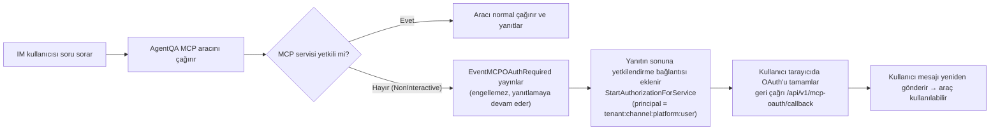
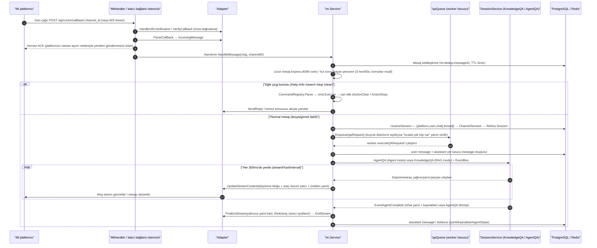

# IM Entegrasyonu (IM Integration)

IM entegrasyonu, ajanları Slack, Telegram, WeChat ve QQBot'a bağlar. Kullanıcılar platformda robota soru sorabilir; Rethra, bağlı ajan yapılandırmasına göre arama yapar ve yanıt verir.

"Ayarlar → IM Entegrasyonu" bölümünde yeni bir kanal oluşturun; platformu seçin, uygulama kimlik bilgilerini girin, ajanı bağlayın ve ardından etkinleştirin. Webhook modu, platform yönetim panelinde geri çağrı adresinin girilmesini gerektirir; uzun bağlantı modu ise mesaj almak için genel erişimli bir geri çağrı adresi yapılandırmayı gerektirmez. Her kanal için ayrı bir "yanıt dili" ayarlanabilir; bu, ajanın o kanaldaki yanıt dilini sabitler. Boş bırakıldığında dağıtım varsayılan dili kullanılır.

<Screenshot
  src="/screenshots/im-channels.png"
  caption="IM kanal yapılandırması: platform, kimlik bilgileri ve bağlı Agent"
  hint="Kanal listesini ve bir kanalın yapılandırma formunu gösterir (platform türü, kimlik bilgileri, bağlı Agent, geri çağrı adresi)." />

Desteklenen platformlar, alınan dosyaları bilgi tabanına aktarabilir ve `/help` gibi yerleşik komutlar sunabilir. Belirli davranış platform özelliklerine ve kanal yapılandırmasına bağlıdır.

## Desteklenen Platformlar ve Yetenek Karşılaştırması

`internal/handler/im.go` içindeki `validIMPlatforms`, 4 geçerli platform tanımlar. Platform yetenekleri (ilgili `factory.go` dosyaları ve adapter derleme zamanı doğrulamaları esas alınır):

| Platform | Bağlantı modu (varsayılan kalın) | Akışlı yanıt StreamSender | Dosya indirme FileDownloader | İş parçacığı/konu ThreadID | Ana kimlik bilgisi alanları (credentials JSON) |
| --- | --- | --- | --- | --- | --- |
| Slack `slack` | **websocket** (Socket Mode) / webhook (Events API) | Evet | Evet | Evet (`thread_ts`) | websocket: `app_token` + `bot_token`; webhook: `bot_token` + `signing_secret` |
| Telegram `telegram` | **websocket** (uzun yoklama getUpdates) / webhook | Evet (mesaj düzenleme) | Evet | Evet (Forum Topics için `message_thread_id`) | `bot_token`; webhook için ayrıca `secret_token` |
| WeChat `wechat` (iLink botu) | **longpoll** (zorunlu; oluşturulurken arka uç `mode=longpoll`, `output_mode=full` ayarlarını zorunlu kılar) | Hayır (yalnızca tam çıktı) | Evet | Hayır | `bot_token`, `ilink_bot_id` (ikisi de zorunlu) |
| QQ botu `qqbot` | **websocket** (yalnızca desteklenir) | Hayır | Hayır | Hayır | `app_id`, `client_secret`, `api_base_url`, `gateway_url` |

## Yerleşik komut sistemi

Komut çatısı `command.go` / `command_registry.go` içindedir: komutlar yalnızca niyeti (`CommandResult.Action`) bildirir, yan etkiler Service tarafından yürütülür; `LooksLikeCommand`, "komut denemesi"ni (`/help`) QA'ya iletilmesi gereken yol metninden (`/api/v2/users`) ayırır — ilki kayıtlı değilse "bilinmeyen komut" yanıtı verilir, ikincisi normal şekilde soru-cevap akışına girer.

`NewService` içinde kaydedilen tüm komutlar:

| Komut | Uygulama dosyası | İşlev | Yan etki |
| --- | --- | --- | --- |
| `/help [komut_adı]` | `cmd_help.go` | Tüm kullanılabilir komutları listeler veya belirli bir komutun ayrıntılı kullanımını gösterir | Yok |
| `/info` | `cmd_info.go` | Mevcut bağlı Agent'ın bilgilerini ve yeteneklerini gösterir: Agent/RAG modu, etkin bilgi tabanı listesi (`KBSelectionMode` all/selected/none), Skills, MCP hizmetleri, internet araması anahtarı, çıktı modu | Yok |
| `/search <anahtar_kelime>` | `cmd_search.go` | Agent'ın erişebildiği bilgi tabanlarında doğrudan hibrit arama (vektör+anahtar kelime) yapar, özgün metin parçalarını döndürür (**AI özeti olmadan**); en fazla 5 kayıt, her biri 200 rune ve eşleşme yüzdesiyle gösterilir. Bilgi tabanı kapsamı, QA işlem hattındaki `resolveKnowledgeBasesFromAgent` ile aynıdır (Agent modu yetenek filtreleme dahil) | Yok |
| `/stop` | `cmd_stop.go` | Devam eden mevcut yanıtı durdurur (uzun ReAct akıl yürütme zincirlerini kesebilir) | `ActionStop`: önce kuyruktan çıkarır veya yerel in-flight işlemini iptal eder; ardından StreamManager'a stop olayı yazar (Web tarafındaki StopSession ile aynı mekanizma, **örnekler arası** durdurmayı destekler — `im:inflight:` eşlemesinden sessionID/messageID bulunur); son olarak Redis `im:stop:` işaretini, "kuyruğa alınmış ancak çalıştırılmamış" istekler için yedek olarak yazar |
| `/clear` | `cmd_clear.go` | Konuşma belleğini temizler | `ActionClear`: mevcut `ChannelSession` için mantıksal silme uygular, sonraki mesaj yeni bir Rethra oturumu oluşturur |

## Grup sohbeti ve özel sohbet davranışı

- `ChatType` adaptör tarafından belirlenir: `direct` (özel sohbet, `ChatID` boş) veya `group`.
- **Slack**: Grup sohbeti mesajları `AppMentionEvent` (@bot) ile channel/group `MessageEvent` olaylarından gelir (`BotID` değeri boş olmayan bot mesajları ve `file_share` olmayan subtype'lar filtrelenir); yanıtlar sabit olarak thread içinde gönderilir (`thread_ts`, üst düzey mesajlar için kendi zaman damgasını kullanır).
- **Telegram**: `group`/`supergroup` grup sohbeti olarak belirlenir, `@botname` bahsetme öneki kaldırılır; yanıtlar `reply_to_message_id` içerir.
- Oturum yalıtımı: `user` modunda aynı kullanıcının "özel sohbet", "grup A" ve "grup B" oturumları ayrı `ChannelSession` örnekleridir (anahtar `chat_id` içerir); `thread` modunda aynı thread içindeki tüm kullanıcılar oturumu paylaşır.

## Dosya mesajı işleme

Dosyalar ve görseller QA ekleri olarak işlenir: belge içeriği modele sağlanır, görseller ise model desteklediğinde doğrudan tanınır. Bu nedenle, kanal için dosya bilgi tabanı yapılandırılmamış olsa bile bot ek içeriğine göre normal şekilde yanıt verir.

`knowledge_base_id`, eklerin bilgi tabanına ayrıca kaydedilip kaydedilmeyeceğini belirler; kanalın bulunduğu alandaki bir bilgi tabanı olmalıdır (kısıtlı API key için ayrıca bilgi tabanı izin listesinde bulunması gerekir), aksi hâlde kanal oluşturulurken veya güncellenirken 400 döner. Yapılandırıldıktan sonra kaydetme görevi arka planda çalışır; mevcut QA yanıtını etkilemez ve ayrıca "bilgi tabanına eklendi" ya da "ayrıştırma tamamlandı" mesajı göndermez. Ayrıştırılan metinde en fazla ilk 500 satır ve 32 KiB korunur; sınırlardan herhangi birine ulaşıldığında model genel bir kesilme bildirimi alır. Ek okunamıyorsa, platform indirmeyi desteklemiyorsa veya dosya 32 MiB'yi aşıyorsa bot kullanıcıdan metinle açıklama yapmasını ya da dosyayı yeniden göndermesini ister.

## Yanıtlardaki harici görsel bağlantıları (`resource://` yeniden yazımı)

Yanıtta bilgi tabanı görsellerine atıf yapıldığında, metinde `resource://` veya `local://` / `minio://` gibi dahili başvurular bulunur; IM istemcisi bunları doğrudan çekemez. `rewriteStorageURLs` (`internal/im/service.go`), göndermeden önce bunları erişilebilir http(s) URL'lerine dönüştürür:

- Ayrıştırma sonucu http(s) **değilse** (örneğin hâlâ dahili bir `storage://` yoluysa), IM tarafında kesinlikle yüklenemeyecek bir bağlantı göndermek yerine özgün başvuru korunur ve işlem yapılabilir bir WARN kaydı yazılır;
- Başarılı yeniden yazımlar INFO günlüğüne kaydedilir (imzalı URL dahil; sorun gidermeyi kolaylaştırır, ancak günlük erişimi olan kişiler bağlantıyı geçerlilik süresi içinde kullanabilir).

Görsellerin düzgün görüntülenmesi için iki seçenekten biri:

1. **Depolama arka ucuna genel ağdan erişilebilir**: Nesne depolama genel ağ endpoint'i kullanır (veya `MINIO_ENDPOINT` genel ağ host'u olarak ayarlanırsa), `resource://` arka ucun ön imzalı URL'sine geri döner;
2. **`APP_EXTERNAL_URL` yapılandırın**: `resource://`, `<APP_EXTERNAL_URL>/r/<token>` olarak yeniden yazılır; istek nginx'in `location ^~ /r/` ters vekili üzerinden app'e geri iletilir. Resmi ön yüz imajı bu location'ı zaten içerir; özel ters vekilde bunun eklenmesi gerekir, aksi halde istek SPA fallback'e düşer ve boş sayfa döner.

Varsayılan MinIO iç ağ kurulumu (`minio:9000`) ve `local` arka ucu yalnızca ikinci yöntemi kullanabilir. IM kanalı etkin olduğu halde `APP_EXTERNAL_URL` boşsa, `LoadAndStartChannels` başlangıçta bir kez uyarı yazdırır (`imImageConfigWarning`).

Görseller hâlâ görüntülenmiyorsa, [görsel ve dosyaların dış erişimi](21-file-access.md) bölümündeki sorun giderme tablosunu madde madde karşılaştırın; burada dört URL biçimi ve her kanalın bunları alma yöntemi özetlenir.

## MCP OAuth yetkilendirme bildirimi (kimlik bağlama)

IM senaryosunda, MCP hizmetinin oturum içi OAuth yetkilendirmesini tamamlamak için etkileşimli bir ön yüz yoktur; bu nedenle:

- `withIMIdentity`, bağlama `MCPOAuthNonInteractive` işaretini ekler; Agent yetkilendirilmemiş bir OAuth MCP hizmetiyle karşılaştığında **bekleyerek engellenmez**, bunun yerine tek seferlik bir `EventMCPOAuthRequired` olayı gönderir;
- `handleMessageStream` bu olayları toplar (`ServiceID` bazında yinelerden arındırır); yanıt tamamlandıktan sonra `buildIMMCPAuthNotice`, yanıtın sonuna eklenecek yetkilendirme istemini üretir: `APP_EXTERNAL_URL` yapılandırılmış ve OAuthManager kullanılabilir durumdaysa, her hizmet için özel bir yetkilendirme bağlantısı oluşturur (geri çağırma adresi `<APP_EXTERNAL_URL>/api/v1/mcp-oauth/callback`, özne `PrincipalIMUser` olur; yani yetkilendirme "kiracı+kanal+platform+IM kullanıcısı" ile bağlanır); aksi halde Rethra yönetim panelinde yetkilendirmenin tamamlanmasını ister;
- Kullanıcı bağlantıya tıklayıp yetkilendirmeyi tamamladıktan sonra, bu MCP hizmetini kullanmak için **aynı mesajı yeniden gönderir**.



## Yapılandırma ve çalışma başvurusu

### Kanal modeli ve yapılandırması (`internal/im/types.go`)

Bir `IMChannel` (`im_channels` tablosu), bir platform botunu belirli bir Agent'a bağlar:

| Alan | Açıklama |
| --- | --- |
| `AgentID` | Bağlanan özel akıllı ajan; yanıtlar bu Agent'ın yapılandırmasını kullanır (model, bilgi tabanı, Skills, MCP, çevrim içi arama) |
| `Platform` / `Mode` | Platform ve bağlantı modu. Varsayılanlar: wechat → `longpoll` (ayrıca `output_mode=full` zorunludur), diğerleri → `websocket` |
| `OutputMode` | `stream` (varsayılan, akışlı) veya `full` (tam yanıt beklendikten sonra tek seferde yanıt) |
| `Locale` | Yanıt dili: `en-US` / `tr-TR`; diğer değerler 400 döndürür. Boş bırakılırsa (varsayılan), `RETHRA_LANGUAGE` kullanılır; ayarlanmamışsa `tr-TR` olur. IM geri çağırma istek başlığındaki `Accept-Language`, soruyu sorandan değil platformdan gelir; bu nedenle yanıt dilini belirlemede kullanılmaz |
| `KnowledgeBaseID` | İsteğe bağlı "dosya bilgi tabanı". Yapılandırılsın ya da yapılandırılmasın, dosyalar/görseller indirilerek QA tarafından anlaşılır; yapılandırıldığında ayrıca arka planda bilgi tabanına eklenir (aşağıya bakın) |
| `SessionMode` | `user` (varsayılan, oturumları platform+kullanıcı+grup boyutunda eşler) veya `thread` (platform+iş parçacığı+grup boyutunda; her üst düzey mesaj yeni bir oturum açar) |
| `BotIdentity` | Platform+mod+kimlik bilgilerinden türetilen botun benzersiz tanımlayıcısı (`computeBotIdentity`, ör. `slack:<botID>`, `telegram:<botID>`); veritabanı benzersiz indeksi aynı botun iki kanala yapılandırılmasını önler (`checkDuplicateBot`, `duplicate_bot:` önekli hata döndürür → HTTP 409) |
| `Credentials` | JSONB kimlik bilgileri. Liste API'si (`IMChannelSummary`) **kimlik bilgisi içeriğini asla döndürmez**, yalnızca `credentials_configured` mantıksal değerini döndürür |

`ChannelSession` (`im_channel_sessions` tablosu), IM tarafında konuşma sürekliliğini sağlamak için `(platform, user_id, chat_id, thread_id, tenant_id)` değerlerini Rethra `session_id` ile eşler. Alttaki Session Web UI üzerinden silinirse, `HandleMessage` `ErrSessionNotFound` durumunu algılar, eski eşlemeyi yumuşak siler ve otomatik olarak yeniden oluşturur (#1046 ve #1499'daki "botun kalıcı olarak bağlantısının kesilmesi" sorununu düzeltir).

#### Kanal yönetimi API'si (`internal/handler/im.go` + `routes_agent.go`)

| Yöntem ve yol | Açıklama |
| --- | --- |
| `POST /api/v1/agents/:id/im-channels` | Agent için kanal oluşturur (platform geçerliliğini doğrular, varsayılan mode/output_mode değerlerini doldurur) |
| `GET /api/v1/agents/:id/im-channels` | Agent kanallarını listeler (kimlik bilgileri hariç) |
| `GET /api/v1/im-channels` | Kiracı içindeki Agent'lar arası kanal genel görünümü |
| `PUT /api/v1/im-channels/:id` | Kısmi güncelleme (`name/mode/output_mode/locale/session_mode/knowledge_base_id/credentials/enabled/agent_id`); `knowledge_base_id` için boş dize gönderilmesi dosya bilgi tabanının bağlantısını kaldırır |
| `DELETE /api/v1/im-channels/:id` | Sil |
| `POST /api/v1/im-channels/:id/toggle` | Etkinleştir/devre dışı bırak |
| `POST /api/v1/wechat/qrcode`, `POST /api/v1/wechat/qrcode/status` | WeChat (iLink) QR kodu tarayarak bağlama: QR kodu oluşturur ve durumu yoklar |
| `GET / POST /api/v1/im/callback/:channel_id` | **Platform geri çağrı adresi** (webhook modunda her platformun yönetim panelinde yapılandırılır; platformun kendi imza doğrulamasını kullanır, Rethra API Key gerekmez) |

Webhook modunda entegrasyon için `https://<alan_adiniz>/api/v1/im/callback/<channel_id>` adresini platformun olay aboneliği/geri çağrı adresi alanına girin; Rethra önce platformun URL doğrulama isteğine (`HandleURLVerification`) yanıt verir, ardından her geri çağrı `VerifyCallback` imza doğrulamasından geçer. WebSocket/kalıcı bağlantı modu ise genel erişilebilir bir geri çağrı adresi gerektirmez; Rethra platform ağ geçidine etkin olarak bağlanır.

#### Kalıcı bağlantı güvenilirliği: leader seçimi ve Supervisor

- **Çoklu örnek leader seçimi** (`service.go`): websocket/longpoll kanalları, çoklu örnek dağıtımında (Redis ile) `SETNX im:ws:leader:<channelID>` (TTL 15s, her 5s'de yenileme) aracılığıyla kalıcı bağlantıyı **yalnızca bir örneğin** sürdürmesini sağlar; leader olmayan örnekler kilidi almak için her 10s'de yeniden dener ve leader çöktüğünde otomatik olarak devralır. longpoll kanalı durduktan sonra kilit süresi dolana kadar korunur; TTL'nin doğal olarak sona ermesi beklenerek eski ve yeni örneklerin kısa süreli çift yazması önlenir. Yenileme başarısız olduğunda (leader kimliği kaybedildiğinde) `handleWSLeadershipLoss` çalışır: önce bu örnekteki adaptör durdurulur, ardından kanal kilit alma yeniden deneme döngüsüne geri alınır — yeniden denemeden önce veritabanındaki kanal satırı tekrar okunur; böylece bu sırada silinen, devre dışı bırakılan veya yapılandırması değiştirilen kanallar eski çalışma zamanı tarafından yeniden etkinleştirilmez.
- **Bağlantı canlı tutma** (`supervisor.go` içindeki `RunSupervised`): platform bağlantısının iç yeniden bağlanma işlemi, bağlantı nesnesinin var olduğu ancak mesaj alamadığı durumlara yol açabilir. Supervisor her 6 saatte bir (`defaultRecycleInterval`) bağlantıyı etkin olarak yeniden kurar; bağlantı başarısız olursa 5s geri çekilmeyle yeniden dener ve en kötü kesinti süresini geri dönüşüm aralığıyla sınırlar.

### Çoklu örnek dağıtımı için önemli noktalar

Tüm dağıtık durumlar, `service.go` içindeki Redis key önek sabitlerinde merkezi olarak tanımlanır:

| Redis Key | Amaç |
| --- | --- |
| `im:ws:leader:<channelID>` | WebSocket/uzun yoklama kanalı leader seçimi (TTL 15s, 5s yenileme, 10s kilit alma yeniden denemesi) |
| `im:dedup:<messageID>` | Örnekler arası mesaj tekilleştirme (TTL 5min) |
| `im:stop:<userKey>` | Örnekler arası /stop ön yürütme işareti (TTL 30s) |
| `im:inflight:<userKey>` | userKey → `sessionID:messageID` eşlemesi; örnekler arası /stop için StreamManager durdurma olayını yazar |
| `im:queue:user:<userKey>` | Genel tek kullanıcı kuyruk sayacı |
| `im:ratelimit:<key>` | Kayan pencere hız sınırlandırması (ZSET) |
| `im:global:active` | Genel eşzamanlı QA worker sayacı (Lua atomik INCR+doğrulama, TTL 5min ile kendi kendini iyileştirme) |

Redis olmadığında (Lite/tek örnek modu) tümü yerel bellek uygulamasına geri döner; işlevsellik değişmez, yalnızca örnekler arası anlam kaybolur.

### Mesaj işleme akışı

`IMCallback` (webhook) veya kalıcı bağlantı geri çağrıları nihayetinde `Service.HandleMessage` içine girer, ardından kuyruk üzerinden QA yürütmesine geçer:



Temel ayrıntılar (tamamı `service.go` içinde):

- **Yinelenenleri kaldırma**: `MessageID`, Redis'e `im:dedup:` olarak (TTL 5 dakika) veya yerel `sync.Map` içine (tek örnek modu) yazılır; IM platformunun yeniden gönderdiği geri çağrılar doğrudan atlanır.
- **Hız sınırlama**: `channelID:userID:chatID[:threadID]` bazında kayan pencere hız sınırlaması uygulanır (varsayılan olarak 60 sn içinde 10 ileti, `config.IM` ile geçersiz kılınabilir); **eğik çizgi komutları hız sınırlamasını atlar**, böylece kullanıcı fırtına sırasında da `/stop` kullanabilir.
- **QA kuyruğu** (`qaqueue.go`): Sınırlı kuyruk + sabit worker havuzu (varsayılan workers=5, kuyruk üst sınırı 50, kullanıcı başına kuyruk üst sınırı 3, kuyruk zaman aşımı 60 sn); çoklu örneklerde Redis sayacı aracılığıyla **genel kullanıcı başına üst sınır** (`im:queue:user:`) ve isteğe bağlı **genel eşzamanlılık kapısı** (`im:global:active` + Lua betiği, `GlobalMaxWorkers` yapılandırması) uygulanarak alt LLM katmanında geri basınç oluşturulur. Kuyruk konumu > 0 olduğunda önce bir "Kuyrukta" bildirimi gönderilir.
- **Kimlik enjeksiyonu** (`withIMIdentity`): IM geri çağrıları Rethra oturumu yerine platform imzasıyla doğrulanır; bu nedenle sentetik kimlik `system-<tenantID>` + `PrincipalIMUser` (`tenantID:channelID:platform:userID`) + Viewer rolü enjekte edilir. Böylece organizasyonla paylaşılan bilgi tabanları gibi UserID'ye bağlı mantık normal çalışır. Aynı anda `MCPOAuthNonInteractive` işaretlenir (bkz. [MCP OAuth yetkilendirme bildirimi](#mcp-oauth-yetkilendirme-bildirimi-kimlik-bağlama)).
- **Akışlı işleme** (`handleMessageStream` + `think.go` + `tool_display.go`): EventBus'tan `EventAgentThought` (düşünme), `EventAgentToolCall`/`EventAgentToolResult` (araç durum satırları; dahili araçlar `isToolVisibleToUser` ile filtrelenir; hızlı soru-cevap yalnızca iki RAG işlem hattı aracı olan `query_understand`/`knowledge_search` öğelerini gösterir), `EventAgentFinalAnswer` (yanıt parçaları), `EventAgentReferences` (alıntılar), `EventAgentComplete` olaylarına abone olunur. Agent modunda, sonraki aşamada yeniden araç çağrısı başlatıldığında "iyimser yanıt" **geri çekilerek** düşünme bloğuna alınır (`retractAgentLiveAnswer`, Web tarafındaki superseded preamble ile tutarlıdır). Her 300 ms'de arabellek içeriğinin tamamı gönderilir (`UpdateStreamContent` değiştirme anlamına sahiptir); `holdbackCutoff`, titreşen yarım içerikleri önlemek için parçalar arası sınırdaki eksik `provider://` URL'lerini, Markdown görsellerini ve XML etiketlerini bekletir. Son `FinalizeStream` yalnızca yanıt metnini korur (`StripThinkBlocks`), `<kb/>`, `<web/>` alıntı etiketlerini ve `<image>` XML'ini temizler, ayrıca `provider://` depolama URL'lerini erişilebilir bağlantılara dönüştürür (`cleanIMContent` / `rewriteStorageURLs`).
- **Akış sonlandırma**: Agent modunda, `EventAgentComplete` alınması veya AgentQA çağrısının dönmesi (hangisi önce gerçekleşirse) akışlı yanıtı sonlandırır; böylece kartın "Oluşturuluyor" durumunda kalması önlenir. Tamamlanma olayından sonra oluşan hatalar yine toplanır ve son yanıta eklenir. Hızlı soru-cevapta (KnowledgeQA) yanıt akışı eşzamansızdır ve akışın bitmesi esas alınır.
- **Akışsız yol**: Kanal `output_mode=full` olduğunda, adaptör `StreamSender` desteklemediğinde veya `StartStream` başarısız olduğunda, tam yanıt `runQA` ile birleştirilir ve ardından `SendReply` ile tek seferde gönderilir.
- **Alıntılanan ileti** (`Quote`, alıntıyı destekleyen adaptörler tarafından doldurulur): Metin alıntıları, LLM bağlamına `<quoted_message>` ile sarılı olarak eklenir (üst sınır 500 rune'dur ve "botun kendi yanıtını alıntılama" durumu ayırt edilir); görsel/dosya/video gibi metin dışı iletiler alıntılandığında, modelin okuyamadığı içeriği tahmin etmesini önlemek için "kullanıcının bu içeriği görüntüleyemediğini açıkça bildiren" bir talimat eklenir.

### Mimariye genel bakış

#### Adapter arayüzü (internal/im/adapter.go)

Her platform adaptörü birleşik `Adapter` arayüzünü uygular ve platform farklılıklarını dört yöntemde toplar:

```go
type Adapter interface {
    Platform() Platform
    // VerifyCallback geri çağrı isteğinin imzasını/Token'ını doğrular
    VerifyCallback(c *gin.Context) error
    // ParseCallback platformun ham geri çağrısını birleşik IncomingMessage'a dönüştürür (mesaj dışı olaylarda nil döner)
    ParseCallback(c *gin.Context) (*IncomingMessage, error)
    // SendReply yanıtı IM platformuna geri gönderir
    SendReply(ctx context.Context, incoming *IncomingMessage, reply *ReplyMessage) error
    // HandleURLVerification platformun URL doğrulama sınamasını işler
    HandleURLVerification(c *gin.Context) bool
}
```

İki **isteğe bağlı** genişletme arayüzü, platform yeteneklerindeki farklılıkları belirler:

- `StreamSender` — Akışlı yanıt (`StartStream` → `UpdateStreamContent` (tam metni değiştirme anlamı) → `FinalizeStream` (sonda yalnızca yanıt korunur, düşünme/araç süreci kaldırılır) → `EndStream`). Uygulayanlar: Slack, Telegram (ileti düzenleme).
- `FileDownloader` — Kullanıcının platformdan gönderdiği dosya/görselleri indirir (`DownloadFile`). Uygulayanlar: Slack, Telegram, WeChat.

Birleşik ileti modeli `IncomingMessage`; `Platform`, `MessageType` (`text`/`file`/`image`), `UserID`, `ChatID`, `ChatType` (`direct`/`group`), `Content`, `MessageID` (yinelenenleri kaldırmak için), `FileKey`/`FileName`/`FileSize`, `ThreadID` (konu/iş parçacığı ID'si), `Quote` (alıntılanan ileti) ve diğer alanları taşır.

#### Service düzenlemesi (internal/im/service.go)

`im.Service`, ileti işlemenin merkezidir; sorumlulukları (kaynak kod yorumlarına bakınız):

1. Adapter'dan birleşik `IncomingMessage` alır;
2. Bu IM kanalı için Rethra oturumu (Session) çözümler veya oluşturur;
3. Eğik çizgi komutlarını öncelikle dağıtır (QA işlem hattına girmez);
4. Normal iletilerde Rethra QA işlem hattını çağırır (`KnowledgeQA` / `AgentQA`);
5. Akışlı yanıtları toplar ve Adapter aracılığıyla geri gönderir.

Platform adaptörleri `AdapterFactory` üzerinden kaydedilir (`internal/container/container.go` içindeki `registerIMAdapterFactories`):

```go
imService.RegisterAdapterFactory("slack", slack.NewFactory())
imService.RegisterAdapterFactory("telegram", telegram.NewFactory())
imService.RegisterAdapterFactory("wechat", wechat.NewFactory())
imService.RegisterAdapterFactory("qqbot", qqbot.NewFactory())
```

## Uygulama referansı

- Temel çerçeve ve düzenleme: `internal/im/` (`adapter.go`, `service.go`, `supervisor.go`, `command*.go`, `qaqueue.go`, `session/stream/think/tool_display` vb.)
- Her platform için bağdaştırıcılar: `internal/im/{slack,telegram,wechat,qqbot}/`
- HTTP arayüz katmanı: `internal/handler/im.go`
- Yönlendirme: `internal/router/routes_agent.go` içindeki `RegisterIMRoutes` / `RegisterIMChannelRoutes`
