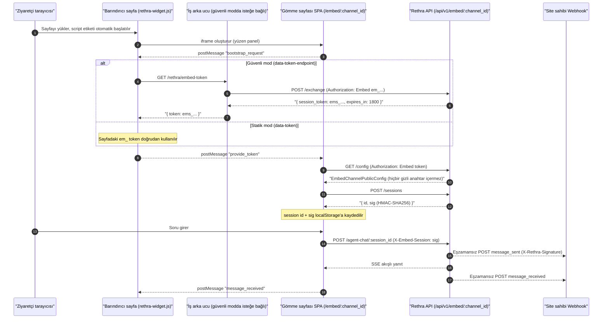

# Web Sayfasına Gömme (Embed Channel)

Gömme kanalı, resmi web sitesinde veya yardım merkezinde bilgi tabanı soru-cevap bileşeni sunmak için kullanılır. Bir kanal oluşturup bir ajana bağladıktan sonra üretilen betiği web sayfasına eklediğinizde ziyaretçiler Rethra hesabı olmadan sohbet edebilir. Ziyaretçinin arama kapsamı ve modeli tamamen kanala bağlı ajan tarafından belirlenir: sunucu, istekteki bilgi tabanı, belge, etiket, @bahsetme, beceri ve model geçersiz kılmalarını yok sayar.

"Ayarlar → Web Sayfasına Gömme" bölümünden yeni bir kanal oluşturun, ajanı bağlayın ve gömmeye izin verilen alan adlarını ayarlayın, ardından entegrasyon kodunu kopyalayın. Herkese açık kullanımdan önce erişim kaynağını ve istek hacmini sınırlamak için alan adı beyaz listesi ve hız sınırı yapılandırılmalıdır.

<Screenshot
  src="/screenshots/embed-channel.png"
  caption="Web sayfasına gömme kanalı: yapılandırma, kod parçacığı ve bileşen görünümü"
  hint="Kanal yapılandırmasını (bağlı Agent, izin verilen alan adları, görünüm ayarları) ve üretilen script parçacığını gösterin; mümkünse bileşenin web sayfasında açılmış hâlinin bir görselini de ekleyin." />

Kanal, statik token ve güvenli mod ile entegrasyonu destekler; ayrıca Webhook üzerinden sohbet olayları alınabilir.

Ziyaretçi tarafındaki görseller ana siteden farklı olarak kanal düzeyinde kimlik doğrulamalı bir proxy üzerinden sunulur; görseller görünmüyorsa [Görsellere ve dosyalara dışarıdan erişim](21-file-access.md) sayfasına bakın.

## Ön Uç Bileşeni Entegrasyonu

Bileşen SDK'sı, bağımlılığı olmayan bir loader betiğidir: `frontend/public/rethra-widget.js` (dağıtımdan sonra Rethra servis kök yolundan sunulur). Yüzen düğmeyi ve iframe panelini çizer; iframe, gömme sayfası SPA'sı `/embed/{channel_id}` adresini gösterir (giriş noktası `frontend/src/embed-main.ts`).

### Yöntem 1: Statik Token modu (token ziyaretçiye görünür) {#yontem-1-statik-token-modu-token-ziyaretciye-gorunur}

```html
<script
  src="https://your-rethra.example.com/rethra-widget.js"
  data-channel="kanal-UUID'niz"
  data-token="em_publish_tokeniniz"
  data-position="bottom-right"
  data-primary-color="#07C05F"
  data-title="AI Assistant"
></script>
```

Publish token doğrudan sayfa HTML'ine yazılır ve her ziyaretçi tarafından görülebilir; token döndürüldüğünde dağıtılmış tüm sayfaların da güncellenmesi gerekir. Dahili siteler veya düşük hassasiyetli senaryolar için uygundur.

### Yöntem 2: Güvenli mod (Secure Mode, önerilen)

Publish token yalnızca iş arka ucunda saklanır; sayfa, `data-token-endpoint` ile iş arka ucundaki bir değişim arayüzünü gösterir:

```html
<script
  src="https://your-rethra.example.com/rethra-widget.js"
  data-channel="kanal-UUID'niz"
  data-token-endpoint="https://your-backend.example.com/rethra/embed-token"
  data-position="bottom-right"
></script>
```

İş arka ucu bu endpoint'i uygular: sunucu `em_` token'ını tutar, `POST /api/v1/embed/{channel_id}/exchange` çağrısıyla kısa ömürlü `ems_` token alır ve `{ "token": "ems_...", "expiresIn": 1800 }` döndürür. Bileşen, TTL'nin yaklaşık %80'inde (30 saniyeden erken olmamak üzere) token'ı otomatik yeniler (bkz. `rethra-widget.js` içindeki `scheduleRefresh`). **Publish token asla tarayıcıya ulaşmaz.**

Değişim arayüzü önce iş tarafındaki Session/JWT'nin geçerliliğini ve ziyaretçinin erişim yetkisini doğrulamalıdır; yalnızca Cookie veya Authorization başlığının varlığını kontrol etmek kimlik doğrulama sayılmaz. Sunucu exchange çağrısını yaparken kanal beyaz listesiyle eşleşen iş sitesi `Origin` değerini elle göndermelidir, örneğin `Origin: https://shop.example.com`; Rethra yönetim Token'ını ziyaretçilere açmayın.

Diğer isteğe bağlı öznitelikler: `data-base-url` (varsayılan olarak script src'den türetilir), `data-width` / `data-height` (panel boyutu, varsayılan 400×600), `data-sandbox` (iframe sandbox politikası; alanlar arası gömmede otomatik olarak `allow-scripts allow-forms allow-popups allow-modals allow-same-origin` eklenir).

### Yöntem 3: Programatik API

```html
<script src="https://your-rethra.example.com/rethra-widget.js"></script>
<script>
  Rethra.init({
    channel: 'kanal-UUID',
    tokenEndpoint: 'https://your-backend.example.com/rethra/embed-token', // veya token: 'em_...'
    position: 'bottom-right',
    primaryColor: '#07C05F',
    title: 'AI Assistant',
    baseUrl: 'https://your-rethra.example.com',
  });
  Rethra.setContext({ userId: 'u_123', page: location.pathname }); // bağlam her soruyla birlikte eklenir
  Rethra.setLocale('en-US');
  Rethra.openWithQuery('Parolamı nasıl sıfırlarım?');   // paneli açar ve soruyu otomatik gönderir
  Rethra.on('ready', () => console.log('widget ready'));
  // Diğerleri: Rethra.open() / close() / toggle() / destroy() / off(event, fn)
</script>
```

### Doğrudan iframe entegrasyonu

Loader kullanmadan iframe doğrudan da gömülebilir (bu durumda token URL/postMessage ile sağlanmalıdır; genellikle loader kullanılması önerilir):

```html
<iframe src="https://your-rethra.example.com/embed/kanal-UUID"
        width="400" height="600" style="border:none"></iframe>
```

### postMessage Bridge protokolü

Barındırıcı sayfa (loader) ile iframe içindeki gömme sayfası `postMessage` ile iletişim kurar ve iki taraf da sıkı Origin doğrulaması yapar (loader yalnızca türetilen `embedOrigin` adresine mesaj gönderir, asla `*` kullanmaz; gömme sayfası ilk güvenilir mesajın origin değerini sabitler — bkz. `frontend/src/composables/useEmbedBridge.ts`):

- Barındırıcı → iframe (`source: "rethra-host"`): `provide_token` (token iletir), `set_context`, `set_locale`, `open_with_query`;
- iframe → barındırıcı (`source: "rethra-embed"`): `ready`, `bootstrap_request` (token ister), `message_sent`, `message_received`.

## Kimlik Doğrulama ve Anonim Oturum

### İki tür Token

| Token | Önek | Ömür | Kullanım |
| --- | --- | --- | --- |
| Publish Token | `em_` | Uzun ömürlü (döndürülene kadar) | Kanal yayın token'ı; doğrudan sayfaya gömülebilir (statik mod) veya yalnızca iş arka ucunda saklanabilir (güvenli mod) |
| Session Token | `ems_` | **30 dakika** (Redis TTL) | Publish token ile `/exchange` üzerinden alınan, tarayıcı tarafında kullanılan kısa ömürlü token |

Tüm herkese açık arayüzler token'ı `Authorization: Embed <token>` istek başlığıyla taşır (**query string kabul edilmez**). `EmbedAuth` ara katmanı (`internal/middleware/embed_auth.go`) sırasıyla şunları yapar:

1. `channel_id` ile kanalı bulur; token'ın `publish_token` ile eşleştiğini ya da Redis'te (anahtar `embed:session:{token}`) bu kanala ait bir session token olduğunu doğrular;
2. Kanalın `enabled` olduğunu doğrular;
3. iframe içindeki aynı kaynaklı API isteklerine izin verir; kaynaklar arası API isteklerinin ve güvenli modda sunucu tarafı exchange çağrısının `Origin` değeri `allowed_origins` ile eşleşmelidir. Boş beyaz liste yine her şeyi reddeder; barındırıcı kısıtlaması gömme HTML'inin CSP'si ile uygulanır;
4. Hız sınırı (Redis Lua betiği, kayan pencere):
   - IP başına dakikada ≤ `RateLimitPerMinute`;
   - Kanal genelinde dakikada ≤ `max(RateLimitPerMinute × 20, 120)` — saldırganın IP değiştirerek IP başına sınırı aşmasını önler;
   - Kanalın günlük toplamı ≤ `RateLimitPerDay`.

### Barındırıcı kaynağı ve dağıtım

A sitesi B'deki Rethra'yı gömdüğünde beyaz listeye A yazılır. Standart Nginx, kanal politikasını `/api/v1/embed-frame-policy` ile alır (token gerekmez, yalnızca CSP döner, kanal yapılandırmasını döndürmez) ve `/embed/:channelId` HTML yanıtında `frame-ancestors` ayarlar; Lite aynı politikayı kullanır. Bu sayfa önbelleğe alınmaz; politika alınamazsa gömme HTML'i döndürülmez.

Yükseltmede, önceden yalnızca B yazılmış kanallar gerçek barındırıcı A ile güncellenmeli ve ön uç ile arka uç birlikte güncellenmelidir. Özel ters proxy'ler CSP'yi, orijinal Host'u (port dahil), protokolü ve `Sec-Fetch-Site` değerini korumalıdır. Beyaz liste tarayıcıda gömmeyi sınırlar; ziyaretçi kimlik doğrulamasının yerini tutmaz ve token'a sahip tarayıcı dışı istemcileri engellemez. Bu tür erişim denetimi için güvenli mod ve hız sınırı kullanın.

#### Ayrı alt alan adı (isteğe bağlı) {#embed-subdomain}

Varsayılan olarak embed sayfası ile yönetim paneli aynı alan adını paylaşabilir. Ayrı bir giriş noktası veya Cookie yalıtımı gerekiyorsa embed sayfasını `https://embed.example.com` adresine koyabilir, yönetim panelini `https://app.example.com` adresinde bırakabilirsiniz; iş sitesi `https://shop.example.com` olur.

Yönetim paneli embed kaynak sitesini `frontend/public/config.js` içindeki `window.__RUNTIME_CONFIG__.EMBED_BASE_URL` ile ya da derleme zamanındaki `VITE_EMBED_BASE_URL` ile belirler; boş bırakılırsa geçerli sayfanın origin değeri kullanılır. Değişiklikten sonra üretilen Widget/iframe kodunun yeni adresi gösterdiğini doğrulayın.

Ayrı Nginx server yalnızca `/embed/*`, `/rethra-widget.js`, `/assets/*` ve gerekli arka uç proxy'lerini sunar; yönetim paneli `index.html` dosyasını sunmaz. Standart `frontend/nginx.conf` içindeki `/embed/` için `auth_request`, dahili `/_embed-frame-policy` ve CSP yanıt başlıkları korunmalıdır: politika alınamazsa sayfa döndürülmemeli, ağ geçidi/CDN bu politikayı önbelleğe almamalı veya düşürmemelidir.

Beyaz listeye yine gerçek iş sitesi `https://shop.example.com` yazılır ve güvenli moddaki exchange aynı Origin'i bildirir; normal aynı kaynaklı sohbet istekleri için embed kaynak sitesini ayrıca eklemeye gerek yoktur. Barındırıcı ile embed farklı kaynaklardaysa Widget iframe sandbox'ı otomatik ekler. Doğrulama sırasında sayfayı gerçek barındırıcıdan açın; iframe, API, CSP ve üretilen kodu kontrol edin, yalnızca yönetim panelindeki önizlemeye güvenmeyin.

### Token değişimi (güvenli modun çekirdeği)

`POST /api/v1/embed/:channel_id/exchange`, istek başlığı `Authorization: Embed em_xxx` (**yalnızca publish token kabul edilir**, session token reddedilir). Yanıt:

```json
{ "success": true, "data": { "session_token": "ems_...", "expires_in": 1800 } }
```

Uygulama: `internal/application/service/embed_session.go` içindeki `IssueSessionToken`. Rastgele 32 baytlık base64 değerine `ems_` öneki eklenir, Redis'e yazılır, TTL 30 dakikadır.

### Anonim oturum oluşturma

`POST /api/v1/embed/:channel_id/sessions` bir sohbet oturumu oluşturur ve şunu döndürür:

```json
{ "success": true, "data": { "id": "<session_uuid>", "sig": "<HMAC-SHA256 base64>" } }
```

- Oturum `sessions` tablosuna yazılır; `Description` değeri `embed_channel:{channel_id}` olarak işaretlenir, `UserID` için `EmbedSessionPrincipal(tenantID, channelID, sessionID).StorageID()` ile üretilen opak ziyaretçi kimliği kullanılır;
- `sig` bir **oturum imzasıdır**: `HMAC-SHA256(channel.PublishToken, "{channel_id}|{session_id}")`. Bundan sonra `/sessions/:session_id/*` adresine her erişimde `X-Embed-Session: <sig>` istek başlığı gönderilmelidir; sunucu sabit zamanlı karşılaştırma yapar (`internal/handler/embed_channel.go`). Bu, yalnızca session_id ile başkasının oturumunun kullanılmasını önler; publish token döndürüldüğünde tüm imzalar aynı anda geçersiz olur.

Ön uç, ziyaretçi bazında istatistik için `X-Embed-Visitor: <uuid>` de gönderebilir. Oturum id'si ve sig kanal bazında `localStorage` içinde saklanır; sayfa yenilendiğinde oturum doğrudan geri yüklenir (`frontend/src/composables/useEmbedBridge.ts`).

## Webhook Geri Çağrısı

`webhook_url` yapılandırılmış kanallar aşağıdaki olaylarda iş arka ucuna JSON POST eder (`internal/application/service/embed_webhook.go`):

| Olay | Tetiklenme zamanı | Yük alanları |
| --- | --- | --- |
| `message_sent` | Ziyaretçi soru gönderdiğinde | `type`, `channel_id`, `session_id`, `timestamp`, `query` |
| `message_received` | Asistan yanıtı tamamlandığında | `type`, `channel_id`, `session_id`, `timestamp`, `content` |

Güvenlik ve teslim davranışı:

- `webhook_secret` yapılandırıldığında imza başlığı eklenir: `X-Rethra-Signature: sha256=<hex(HMAC-SHA256(secret, raw_body))>`;
- URL HTTPS olmalıdır; giden istekler SSRF güvenli istemciden geçer (her yönlendirmede yeniden doğrulanır, en fazla 5 atlama), zaman aşımı 5 saniyedir, User-Agent `Rethra-Embed-Webhook/1.0` olur;
- Eşzamansız best-effort teslim yapılır; başarısızlık yalnızca loglanır, **yeniden denenmez**;
- Ön uç, olayları `POST /api/v1/embed/:channel_id/sessions/:session_id/events` ile açıkça da iletebilir.

## Yapılandırma ve Arayüz Başvurusu

### Veri modeli

`internal/types/embed_channel.go` içindeki `EmbedChannel`, kanalın tam tanımıdır (tablo `embed_channels`, yumuşak silme, `publish_token` üzerinde kısmi benzersiz dizin):

```go
type EmbedChannel struct {
    ID                     string         // UUID birincil anahtar
    TenantID               uint64         // Ait olduğu kiracı
    AgentID                string         // Bağlı Agent (varsayılan builtin-quick-answer)
    Name                   string         // Kanal adı
    Enabled                bool           // Etkin mi
    PublishToken           string         // Uzun ömürlü yayın token'ı, "em_" önekli
    AllowedOrigins         JSON           // İzin verilen kaynak Origin listesi (JSONB)
    WelcomeMessage         string         // Karşılama mesajı
    RateLimitPerMinute     int            // IP başına dakikalık hız sınırı (varsayılan 30)
    RateLimitPerDay        int            // Kanal düzeyinde günlük hız sınırı (varsayılan 10000)
    PrimaryColor           string         // Tema rengi
    PageTitle              string         // Sayfa başlığı
    HeaderTitleMode        string         // "channel" | "session"
    ShowSuggestedQuestions bool           // Önerilen sorular anahtarı
    WidgetPosition         string         // Bileşen konumu
    AllowWebSearch         bool           // Web aramasına izin ver
    AllowFileUpload        bool           // Dosya/görsel yüklemeye izin ver
    DefaultLocale          string         // Varsayılan dil
    WebhookURL             string         // Giden webhook (HTTPS)
    WebhookSecret          string         // HMAC-SHA256 imza anahtarı
    ...
}
```

#### Kanal yapılandırma seçenekleri

Kanal oluşturulurken/güncellenirken (`internal/handler/embed_channel.go` içindeki `embedChannelRequest`) şunlar yapılandırılabilir:

| Seçenek | Tür | Varsayılan | Açıklama |
| --- | --- | --- | --- |
| `name` | string | — | Kanalın görünen adı |
| `enabled` | bool | `true` | Kanal anahtarı; kapatıldığında tüm herkese açık arayüzler erişimi reddeder |
| `agent_id` | string | `builtin-quick-answer` | Bağlı Agent; bilgi tabanı kapsamını ve sohbet yeteneklerini belirler |
| `allowed_origins` | string[] | — | **En az bir öğe zorunludur; Rethra adresi B'yi değil, gömen barındırıcı A'yı yazın**. Üç biçim desteklenir: tam `http(s)://` Origin (yol ve sorgu parametresi olmadan), alt alan adı joker karakteri `*.example.com` (yalnızca alt alan adlarıyla eşleşir, `example.com`'un kendisiyle eşleşmez; port yazılmazsa herhangi bir portla eşleşir), tam joker `*` (`GIN_MODE=release` iken kaydedilmesi reddedilir, yalnızca geliştirme içindir) |
| `welcome_message` | string | boş | Bileşen açıldığında gösterilen karşılama mesajı |
| `rate_limit_per_minute` | int | `30` | IP başına dakikalık istek üst sınırı |
| `rate_limit_per_day` | int | `10000` | Kanal düzeyinde günlük toplam istek üst sınırı |
| `primary_color` | string | — | Bileşen tema rengi (CSS renk değeri, ör. `#0052d9`) |
| `page_title` | string | boş | Gömme sayfasının tarayıcı başlığı |
| `header_title_mode` | string | `channel` | Başlık modu: `channel` (sabit kanal adı) / `session` (oturuma göre otomatik üretilir) |
| `show_suggested_questions` | bool | `true` | Önerilen sorular gösterilsin mi |
| `widget_position` | string | `bottom-right` | `bottom-right` \| `bottom-left` \| `top-right` \| `top-left` |
| `allow_web_search` | bool | `false` | Ziyaretçi tarafında web araması anahtarına izin verilsin mi |
| `allow_file_upload` | bool | `false` | Ziyaretçi tarafında görsel/dosya yüklemeye izin verilsin mi |
| `default_locale` | string | boş (ziyaretçinin seçtiği dil, yoksa Türkçe) | `en-US` \| `tr-TR` |
| `webhook_url` | string | boş | Olay geri çağrı adresi; **HTTPS olmalı ve SSRF doğrulamasından geçmelidir** (iç ağ/link-local adresler yasaktır) |
| `webhook_secret` | string | boş | Webhook imza anahtarı (API yanıtlarında asla geri gösterilmez) |

### Yönetim API'si (oturum açma gerektirir)

`RegisterEmbedChannelRoutes` (`internal/router/routes_agent.go`) tarafından kaydedilir; API Key'in `ManageChannels` yeteneğini destekler:

| Yöntem | Yol | Yetki | Açıklama |
| --- | --- | --- | --- |
| POST | `/api/v1/agents/:id/embed-channels` | Admin | Agent için kanal oluşturur |
| GET | `/api/v1/agents/:id/embed-channels` | Viewer | Bir Agent'ın kanallarını listeler |
| GET | `/api/v1/embed-channels` | Viewer | Kiracının tüm kanallarını listeler |
| GET | `/api/v1/embed-channels/:channel_id` | Viewer | Kanal ayrıntıları (`publish_token` dahil) |
| PUT | `/api/v1/embed-channels/:channel_id` | Admin | Kanal yapılandırmasını günceller |
| DELETE | `/api/v1/embed-channels/:channel_id` | Admin | Kanalı siler (yumuşak silme) |
| POST | `/api/v1/embed-channels/:channel_id/rotate-token` | Admin | `publish_token`'ı döndürür (eski token ve verilmiş tüm oturum imzaları hemen geçersiz olur) |
| POST | `/api/v1/embed-channels/:channel_id/preview-session` | Viewer | Önizleme için kısa ömürlü oturum token'ı verir (yönetim panelinde bileşen önizlemesi) |
| GET | `/api/v1/embed-channels/:channel_id/stats` | Viewer | Kanal oturum istatistikleri |

### Herkese açık API (anonim erişim, Embed kimlik doğrulaması)

`RegisterEmbedPublicRoutes` tarafından `/api/v1/embed/:channel_id` öneki altında kaydedilir; tümü `middleware.EmbedAuth` ara katmanından geçer (token doğrulama + Origin doğrulama + hız sınırı):

```go
embed := r.Group("/api/v1/embed/:channel_id", middleware.EmbedAuth(embedService, tenantService, redisClient))
{
    embed.POST("/exchange", embedHandler.ExchangeEmbedSession)
    embed.GET("/config", embedHandler.GetEmbedConfig)
    embed.GET("/suggested-questions", embedHandler.GetEmbedSuggestedQuestions)
    embed.GET("/chunks/:chunk_id", embedHandler.GetEmbedChunk)
    embed.POST("/sessions", embedHandler.CreateEmbedSession)
    embed.POST("/knowledge-chat/:session_id", embedHandler.EmbedKnowledgeChat)
    embed.POST("/agent-chat/:session_id", embedHandler.EmbedAgentChat)
    embed.GET("/messages/:session_id/load", embedHandler.EmbedLoadMessages)
    embed.POST("/sessions/:session_id/stop", embedHandler.EmbedStopSession)
    embed.POST("/sessions/:session_id/events", embedHandler.EmbedRelayWebhookEvent)
    // Mesaj önerilen soruları, MCP OAuth, araç onayı, dosya servisi vb. rotalar atlanmıştır
    embed.GET("/files", newFileServeHandler(...))
}
```

#### Herkese açık yapılandırmanın iletilmesi

`GET /api/v1/embed/:channel_id/config`, `EmbedChannelPublicConfig` (`internal/types/embed_channel.go`) döndürür — yalnızca bileşeni çizmek için gereken görünüm ve yetenek bilgilerini içerir:

- İletilenler: `channel_id`, `name`, `display_title` (sunucu `PageTitle → Name → AgentName → "AI Assistant"` sırasıyla çözer), `agent_id/agent_name/agent_avatar`, `knowledge_base_ids`, `welcome_message`, `primary_color`, `header_title_mode`, `show_suggested_questions`, `widget_position`, `allow_web_search`, `allow_file_upload`, `agent_web_search_enabled`, `agent_image_upload_enabled`, `default_locale` vb.;
- **Asla iletilmeyenler**: `publish_token`, `webhook_url`, `webhook_secret`.

### Uçtan uca akış



### Güvenlik özeti

- **Barındırıcı beyaz listesi**: Gömme HTML'i kanal düzeyinde `CSP frame-ancestors` ayarlar ve tüm üst sayfaları sınırlar; iframe içindeki aynı kaynaklı API istekleri normal şekilde geçer. `allowed_origins` boşsa tüm istekler reddedilir; `*` yalnızca geliştirme modunda kullanılabilir; `*.example.com` alt alan adı joker karakteri desteklenir. Aynı kaynaklı yönetim paneli önizlemesine izin verilir.
- **Çift token sistemi**: Güvenli modda publish token sunucudan çıkmaz; tarayıcı yalnızca 30 dakikalık kısa ömürlü `ems_` token tutar.
- **Oturum imzası**: `X-Embed-Session` HMAC imzası oturumu (kanal, oturum, geçerli publish token) üçlüsüne bağlar; token döndürülerek tümü birden iptal edilebilir.
- **Üç katmanlı hız sınırı**: IP/dakika, kanal/dakika (IP sınırının 20 katı, en az 120) ve kanal/gün; Redis Lua ile atomik olarak uygulanır.
- **Webhook SSRF koruması**: Yalnızca HTTPS, iç ağ adresleri reddedilir, yönlendirmeler her atlamada doğrulanır, 5 saniye zaman aşımı.

## Uygulama Başvurusu

Aşağıdaki yollar depo köküne görelidir:

| Katman | Dosya |
| --- | --- |
| Veri yapısı | `internal/types/embed_channel.go` |
| HTTP Handler | `internal/handler/embed_channel.go` |
| Kanal servisi | `internal/application/service/embed_channel.go` |
| Anonim oturum/Token | `internal/application/service/embed_session.go` |
| Webhook dağıtımı | `internal/application/service/embed_webhook.go` |
| Kimlik doğrulama ara katmanı | `internal/middleware/embed_auth.go` |
| Rota kaydı | `internal/router/routes_agent.go` (`RegisterEmbedPublicRoutes` / `RegisterEmbedChannelRoutes` / gömme sayfası CSP politikası) |
| Barındırıcı kaynak kuralları | `internal/embedpolicy/origin.go` |
| Bileşen yükleyici (SDK) | `frontend/public/rethra-widget.js` |
| Gömme sayfası SPA girişi | `frontend/src/embed-main.ts`, `frontend/src/composables/useEmbedBridge.ts`, `useEmbedChatSession.ts` |
| Veritabanı taşıması | `migrations/versioned/000060_embed_channels.up.sql` |
