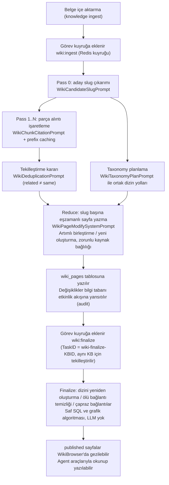

# Wiki Yeteneği

Wiki, bilgi tabanı içeriğini birbirine bağlı Markdown sayfaları hâlinde düzenler. Belgeler içe aktarıldıktan sonra model kişi, ürün ve kavram gibi girdileri çıkarır ve kaynak alıntıları içeren sayfalar üretir; böylece içerik konuya göre gezilebilir.

Kullanıcılar üretilen sayfaları doğrudan düzenleyebilir, geçmiş sürümleri görüntüleyip geri alabilir. Ajanlar da Wiki araçlarıyla sayfaları okuyup güncelleyebilir; erişim kapsamı yine bilgi tabanı izinleriyle belirlenir.

<Screenshot
  src="/screenshots/wiki-browser.png"
  caption="Wiki tarayıcısı: solda dizin ağacı, sağda üretilen girdi sayfası ve kaynakları"
  hint="Solda türe göre gruplanmış dizin ağacını, bir varlık sayfasının gövdesini, sayfa içi wiki bağlantılarını ve kaynak belge alıntılarını gösterin." />

## Wiki'yi Açma ve Gezme {#wiki-yi-acma-ve-gezme}

1. Bilgi tabanını düzenleyin → "İndeksleme stratejisi" bölümünde **Wiki**'yi açın;
2. Belgeleri yükleyin (mevcut belgeler de dahil edilir, yeniden yüklemeye gerek yoktur);
3. Üretimin bitmesini bekleyin. Wiki üretimi eşzamansızdır ve belge sayısı fazlaysa bir süre devam eder; bilgi tabanı gezinme yolunda "İndeksleniyor" göstergesi görünür;
4. Tamamlandıktan sonra bilgi tabanının **Wiki** sekmesinden gezinin; **Grafik** sekmesinde girdiler arasındaki bağlantıları görebilirsiniz.

Wiki üretimi model çağrılarını artırır; kullanım belge hacmine ve çıkarım yoğunluğuna bağlıdır. Bilgi tabanı Wiki yapılandırmasında `focused`, `standard` veya `exhaustive` seçilebilir; ayrıntılar için [Çıkarım ayrıntı düzeyi](#cikarim-ayrinti-duzeyi) bölümüne bakın.

<Screenshot
  src="/screenshots/wiki-graph.png"
  caption="Wiki grafik görünümü: girdiler arasındaki bağlantılar"
  hint="Grafik genel bakış modunu gösterin; düğümler sayfa türüne göre renklendirilir ve tıklanınca ilgili sayfaya gidilir." />

## Sayfaları Düzenleme ve Geri Alma

Wiki sayfasında gövdeyi düzenledikten sonra sürüm geçmişini görüntüleyip değişiklikleri karşılaştırabilirsiniz. Geçmiş kayıtları otomatik üretim, ajan, elle düzenleme ve geri alma kaynaklarını ayırt eder. Geri alma, seçilen geçmiş içerikle yeni bir sürüm oluşturur ve sürüm numarası artmaya devam eder.

Sistem önce otomatik üretilen eski sürümleri temizler: 50 geçmiş sürüme ulaşıldığında kırpılabilir anlık görüntüler temizlenir, 200'e ulaşıldığında katı üst sınır gereği tüm kaynaklar temizlenir. Uzun süre saklanması gereken içerik ayrıca arşivlenmelidir. Yükseltmeden önce yazılmış veya temizlenmiş sürümlerin anlık görüntüsü yoktur: böyle bir sürüm seçildiğinde geçmiş paneli fark yerine bir uyarı gösterir; karşılaştırma tabanı yoksa seçilen sürümün tam metni doğrudan gösterilir. Diğer sürümlerin karşılaştırılması ve geri alınması etkilenmez.

## Değişiklikleri ve Üretim Durumunu Görüntüleme

Sayfa oluşturma, güncelleme, silme ve toplu üretim işlem kayıtları "Bilgi Tabanı → Ayarlar → Etkinlik" bölümünde bir arada gösterilir. Belge işleme sırasında indeksleme durumu görülebilir; servis yeniden başladıktan sonra sistem kalıcı olarak saklanan bekleyen Wiki görevlerini geri yükler. Bilgi tabanı silindiğinde Wiki sayfaları, dizinleri, sorunları ve sürüm geçmişi de temizlenir. Arayüz uyumluluğu ve kurtarma mekanizması için başvuru bölümüne bakın.

## Sürüm ve Çalışma Başvurusu

### Elle düzenleme ve sürüm geçmişi

Wiki sayfaları elle düzenlemeyi ve sürüm geri almayı destekler; kullanıcılar üretilen içeriği düzeltebilir ve her sürümün kaynağını, işlemi yapanı ve zamanını görebilir. Sürüm kayıtları `000075` taşımasıyla eklenmiştir.

#### Sürüm kaynağı ve işlemi yapan {#surum-kaynagi-ve-islemi-yapan}

`wiki_pages` üzerinde iki köken alanı vardır; `last_edit_source` **geçerli sürümün** yazar türünü işaretler:

| `edit_source` | Anlamı |
| --- | --- |
| `pipeline` | Wiki üretim hattı tarafından yazılmıştır (eski kayıtlarda boş dize olabilir, `pipeline` olarak işlenir) |
| `agent` | Agent tarafından `wiki_write_page` / `wiki_replace_text` gibi araçlarla yazılmıştır |
| `user` | Bir kişi tarafından düzenleyicide değiştirilmiştir |
| `revert` | Geri alma sonucu oluşan sürüm |

Buna eşlik eden `last_editor_id` işlemi yapanı kaydeder (arka plandaki hat yazdığında boştur). Arayüz buna göre her sürümün düzenleme kaynağını gösterir.

#### Anlık görüntü ve geri alma

- Sayfanın her üzerine yazılışından önce **eski sürümün** tam anlık görüntüsü `wiki_page_revisions` tablosuna alınır (başlık, gövde, özet, sayfa türü, durum, takma adlar ve o sürümün yazarı ile zamanı); geçerli sürüm yalnızca `wiki_pages` içinde bulunur. `(page_id, version)` üzerindeki benzersiz dizin, `ON CONFLICT DO NOTHING` ile birlikte "önce anlık görüntü, sonra güncelleme" yazma yolunu yeniden denemelerde idempotent tutar;
- `GET /revisions/*slug` geçmiş sürümleri listeler (ters sırada, gövde olmadan, geçerli sürüm numarasıyla); `?version=N` verilirse o sürümün tam metni diff için döndürülür;
- `POST /revert` ile `{slug, version}` gönderilerek geri alınır. Geri alma, hedef sürümün içeriğiyle yeni bir sürüm oluşturur, sürüm numarası artmaya devam eder ve `edit_source` `revert` olarak kaydedilir; bu nedenle geri almanın kendisi de geri alınabilir. Geçerli sürüme geri almak 400 döndürür (bu genellikle ön ucun eski bir geçmiş listesi kullandığı anlamına gelir).

#### Geçmiş saklama politikası

Sürüm geçmişi iki kademeli üst sınıra göre temizlenir (`internal/types/wiki_page.go`):

- **Esnek üst sınır 50 sürüm**: yalnızca "kırpılabilir" anlık görüntüler, yani `pipeline` tarafından yazılanlar ve eski boş kaynaklılar temizlenir;
- **Katı üst sınır 200 sürüm**: yazar ayırt edilmeksizin kırpılır; böylece tamamen elle bakılan sayfaların depolaması da sınırlı kalır.

Katı üst sınıra ulaşılmadan önce sistem otomatik üretilen geçmişi önce temizler ve elle düzenleme kayıtlarını korur.

<Screenshot
  src="/screenshots/wiki-revision-history.png"
  caption="Wiki sayfası sürüm geçmişi: kaynağa göre ayrılmış sürüm listesi ve geri alma girişi"
  hint="Bir wiki sayfasının geçmiş çekmecesini gösterin: sürüm numarası, düzenleme kaynağı (hat/elle/Agent/geri alma), düzenleyen ve zaman ile karşılaştır/geri al düğmeleri." />

### İşlem geçmişi (bilgi tabanı etkinlik akışı)

Wiki eskiden ayrı bir işlem günlüğü tutuyordu (`wiki_log_entries` tablosu + `GET /wiki/log` arayüzü + WikiBrowser içindeki günlük sekmesi). Bu akış bilgi tabanı etkinlik akışıyla örtüştüğü için `000077_remove_wiki_log` taşımasıyla tamamen kaldırıldı: tablo DROP edildi, eski `page_type = 'log'` sayfaları da silindi ve `log` artık geçerli bir sayfa türü değil.

Artık **bilgi tabanı etkinlik akışı tek işlem geçmişi girişidir**:

- Bir ingest partisi bittiğinde `wiki_ingest_batch.go` bu partideki eylem sayılarını türlerine göre toplar ve `service.RecordWikiContentActivity()` çağrısıyla bir `wiki_content_changed` etkinliği yazar;
- Bir kişi WikiBrowser'da sayfa oluşturduğunda/güncellediğinde/sildiğinde `internal/handler/wiki_page.go` de `manual_create` / `manual_update` / `manual_delete` kayıtlarını etkinlik akışına yansıtır;
- Etkinlik kayıtları denetim günlüğü sistemine yazılır (`kb_activity.go` → `AuditLogService`); "Bilgi Tabanı → Ayarlar → Etkinlik" bölümünden görüntülenebilir ve saklama politikası diğer denetim günlükleriyle aynıdır (bkz. [Gözlemlenebilirlik ve denetim](16-observability.md));
- Yazma best-effort'tur: etkinlik kaydı başarısız olsa da wiki düzenlemesinin kendisi başarısız olmaz.

Yükseltme notu: Harici entegrasyonlar hâlâ `GET /api/v1/knowledgebase/:kb_id/wiki/log` çağırıyorsa bilgi tabanı etkinlik akışı arayüzü `GET /api/v1/knowledge-bases/:id/activity` kullanılmalıdır.

### Hata kurtarma

`internal/container/recover_pending_wiki_tasks.go`, servis başlarken Lite modda (süreç içi `SyncTaskExecutor`) veya Redis kuyruğa ekleme kesintisinde oluşan boşlukları kapatır:

1. Kalıcı `task_pending_ops` tablosunda `scope = knowledge_base` ve `task_type ∈ {wiki:ingest, wiki:finalize}` olan bekleyen kombinasyonları tarar;
2. Silinmiş KB'lere veya kiracısı silinmiş KB'lere ait kalıntı satırları temizler (fail-closed);
3. Her etkin KB için tetikleyici görevleri yeniden kuyruğa ekler: `wiki:ingest` TaskID taşımaz (birden çok partinin eşzamanlı çalışmasına izin verir), `wiki:finalize` ise `"wiki-finalize-" + KB_ID` ile tekilleştirilir (aynı KB için yalnızca bir finalize tutulur). Yinelenen kuyruğa ekleme zararsızdır — ingest birbiriyle kesişmeyen satırları üstlenir, finalize lane içinde birleştirilir.

Çalışma sırasındaki diğer korumalar:

- **Kiracı silinmiş**: ingest / finalize görevleri modeli çağırmadan önce kiracının hâlâ var olup olmadığını kontrol eder; kiracı silinmişse o bilgi tabanının kuyruğu atılır ve artık model isteği üretilmez;
- **Wiki çalışamıyor**: Tetikleme sırasında bilgi tabanında Wiki'nin kapatıldığı, sentez modeli olmadığı veya modelin silindiği görülürse henüz üstlenilmemiş ingest işlemleri temizlenir ve ilgili belgeler serbest bırakılır; belgeler sürekli "İndeksleniyor" durumunda kalmaz;
- **Tetikleyici görev kaybolmuş**: Yalnızca kalıcı işlemi olup tetikleyici görevi olmayan bilgi tabanları arka plan denetimiyle yeniden tetiklenir; her bilgi tabanı için her denetim eşiği döneminde en fazla bir kez;
- **Geçici hatalarda yeniden deneme**: Model çağrısında 408/429/5xx, zaman aşımı, bağlantı sıfırlanması veya hız sınırı ifadesi içeren (ör. 「调用频率超限」 yani "çağrı sıklığı aşıldı", `rate limit`) 403 alındığında üstel geri çekilmeyle yeniden denenir; kimlik doğrulama kaynaklı 403 yeniden denenmez;
- **Hata sayısına göre öncelik**: Bekleyen belgeler üstlenilirken hata sayısı az olanlar önce işlenir; sürekli başarısız olan belgeler yeni belgeleri engellemez.

## Sayfa ve Arayüz Başvurusu

### Sayfa modeli ve hiyerarşi

#### Sayfa türleri (PageType)

`internal/types/wiki_page.go` 6 sayfa türü tanımlar:

| Tür | Açıklama |
| --- | --- |
| `summary` | Tek bir kaynak belgenin özet sayfası (slug biçimi `summary/<knowledge-uuid>`) |
| `entity` | Varlık sayfası (kişi, kuruluş, ürün, teknoloji vb.) |
| `concept` | Kavram/konu sayfası |
| `index` | Wiki düzeyinde dizin sayfası (meta veri) |
| `synthesis` | Kapsamlı analiz sayfası; **yalnızca Agent tarafından `wiki_write_page` aracıyla oluşturulur** |
| `comparison` | Karşılaştırma sayfası; **yalnızca Agent tarafından `wiki_write_page` aracıyla oluşturulur** |

Sayfa durumu (`WikiPageStatus`): `draft` / `published` (varsayılan) / `archived`.

#### Dizin ağacı (Folder Hierarchy)

`000061_wiki_page_hierarchy.up.sql` taşıması bağımsız bir `wiki_folders` tablosu (bitişiklik listesi modeli) ekler:

- `WikiFolder`, ağacı `ParentID` (boş dize kök demektir) + somutlaştırılmış `Path` (`/` ile birleştirilmiş ad zinciri) ile düzenler; boş klasörler bağımsız var olabilir, kullanıcılar önce iskeleti kurabilir;
- `WikiPage.FolderID` sayfanın ait olduğu yerin **tek doğruluk kaynağıdır** (FK → `wiki_folders.id`; boş dize wiki kökü demektir);
- Sayfadaki `CategoryPath` / `WikiPath` / `Depth` / `SortOrder` alanları klasör zincirinden türetilen **önbellek yansımalarıdır**;
- Modelin ürettiği kategori yolu en fazla 3 düzey derinliktedir (sabit `WikiCategoryMaxDepth = 3`); `CleanWikiCategoryPath()` tam genişlikli ayırıcıları (`／`, `｜` → `/`) normalleştirir ve 「实体」 (varlık), 「概念」 (kavram) gibi tür etiketlerini ayıklar;
- Sayfa kullanıcının oluşturduğu bir klasöre konduğunda klasör yolu olduğu gibi kategori yolu olarak kullanılır; 「概念」 (kavram), "Concepts" gibi adlara sahip klasörler tür etiketi sayılarak ayıklanmaz.

#### Temel alanlar

- `Slug`: Sayfanın KB içindeki benzersiz tanımlayıcısı (bkz. sonraki bölüm);
- `SourceRefs`: Kaynak alıntıları, biçim `"<knowledge_id>|<doc_title>"`; `ChunkRefs`: parça düzeyinde kanıt alıntıları;
- `InLinks` / `OutLinks`: wiki-link geri/ileri bağlantıları; grafik yapısını korur, `GET /graph` ile genel veya ego görünümü sorgulanabilir;
- `Aliases`: Takma adlar (arama ve tekilleştirme birleştirmesinden sonra eski adların yönlendirilmesi için); `Version`: sürüm numarası.

### Yayınlama ve erişim

Tüm Wiki rotaları `/api/v1/knowledgebase/:kb_id/wiki` altında bulunur (`internal/router/routes_knowledge.go`); **oturum açmadan herkese açık erişim modu yoktur**, okuma ve yazma RBAC ile KB erişim denetimine tabidir:

#### Okuma arayüzleri (Viewer + KBAccessRead)

| Yöntem | Yol | Açıklama |
| --- | --- | --- |
| GET | `/pages` | Sayfa listesi |
| GET | `/pages/*slug` | Slug ile tek sayfa alır |
| GET | `/folders` | Dizin ağacı |
| GET | `/index` | Dizin sayfası |
| GET | `/graph` | Bağlantı grafiği (genel bakış / ego modu) |
| GET | `/stats` | İstatistikler |
| GET | `/search?q=...` | Arama |
| GET | `/lint` / `/issues` | Kalite denetimi sonuçları / sorun listesi |
| GET | `/revisions/*slug` | Sürüm geçmişi listesi; `?version=N` ile o sürümün tam metni |

`KBAccessRead` kapsamı: KB sahibi, kuruluş paylaşımı ve paylaşılan Agent üzerinden kazanılan erişim.

#### Yazma arayüzleri (OwnedWikiKBOrAdmin + KBAccessWrite)

| Yöntem | Yol | Açıklama |
| --- | --- | --- |
| POST / PUT / DELETE | `/pages`, `/pages/*slug` | Sayfa oluşturma / güncelleme / silme |
| POST / PUT / DELETE | `/folders`, `/folders/:folder_id` | Dizin yönetimi |
| PUT | `/move-page` | Sayfayı dizine taşır |
| POST | `/rebuild-links` | Bağlantı grafiğini yeniden oluşturur |
| POST | `/auto-fix` | Otomatik düzeltmeyi tetikler |
| PUT | `/issues/:issue_id/status` | Sorun durumunu günceller |
| POST | `/revert` | Belirtilen sürüme geri alır (body: `{slug, version}`) |

Yazma izni KB sahipliğine göre belirlenir: katkıda bulunan kişi KB'nin sahibiyse wiki'sini yönetebilir, aksi hâlde 403 döner. API Key senaryolarında `ingest` / `retrieve` yeteneğine göre eşlenir.

Ön uçta tarama arayüzünü `WikiBrowser.vue` sağlar; belge ayrıştırma sırasında `wikiStatusRefresh.ts` `parse_status` değerini (`pending` / `processing` / `finalizing`) yoklar ve ayrıştırma bitmiş ama özet hâlâ üretiliyorsa yoklamaya devam eder. Dizin ağacının açık/kapalı durumu `wikiDirectoryState.ts` tarafından ayrıca tutulur: yeni klasör oluşturulduğunda veya veri yenilendiğinde `expandWikiDirectoryPath()` geçerli yoldaki her düzeyi "kullanıcı tarafından açıldı" olarak işaretler; böylece yenilemede tüm ağaç varsayılan kapalı duruma dönmez.

### Agent ile ilişkisi

Ajanlar aşağıdaki 9 Wiki aracıyla sayfaları okuyabilir, değiştirebilir ve sorunları işleyebilir (kaynak belgeyi yeniden okumak için genel `read_document` kullanılır); araç tanımları `internal/agent/tools/definitions.go` içindedir:

| Araç | İşlevi | Temel parametreler |
| --- | --- | --- |
| `wiki_read_page` | Slug ile sayfaların tam metnini toplu okur | `slugs: string[]` |
| `wiki_search` | Sayfaları arar (başlık / slug / takma ad / özet / içerik; `query` büyük/küçük harfe duyarsız POSIX düzenli ifadesi olarak yorumlanır, `C++` gibi geçerli düzenli ifade olmayan metinler harfiyen eşleştirilir; `regex=false` harfiyen eşleşmeyi zorlar) | `query`, `regex?`, `knowledge_base_ids?`, `limit?` (eski `queries`, `knowledge_base_id` parametreleri hâlâ kabul edilir) |
| `wiki_write_page` | Oluşturur/sayfanın tamamını üzerine yazar (`synthesis`, `comparison` sayfaları yalnızca bununla oluşturulabilir) | `slug`, `title`, `summary`, `content`, `page_type`, `aliases?`, `source_refs?` |
| `wiki_replace_text` | Sayfa içinde tam metin değiştirme | `slug`, `old_text`, `new_text` |
| `wiki_rename_page` | Slug'ı yeniden adlandırır, geri bağlantıları otomatik günceller | `slug`, `new_slug` |
| `wiki_delete_page` | Sayfayı siler ve ölü bağlantıları temizler | `slug` |
| `read_document` | Kaynak belgenin özgün metnini yeniden okur: meta veri başlığı + parçalar; sayfalanabilir veya `query` ile belge içinde konum bulunabilir (eski `wiki_read_source_doc` yerine geçer; parçalar her zaman veritabanına yazıldığından yalnızca Wiki kullanan bilgi tabanlarında da çalışır) | `id` (`dN` / `cN`), `offset?`, `limit?`, `query?`, `regex?`, `context?` |
| `wiki_flag_issue` | Sayfa sorununu işaretler | `slug`, `issue_type ∈ {mixed_entities, contradictory_facts, out_of_date, other}`, `description` |
| `wiki_read_issue` | Sorun ayrıntılarını görüntüler | Sorun ID'si |
| `wiki_update_issue` | Sorun durumunu günceller | Sorun ID'si, `status ∈ {pending, ignored, resolved}` |

Önerilen okuma sırası `wiki_search` → `wiki_read_page` → `read_document`'tir: önce sayfayı bulun, sonra sayfanın tamamını okuyun, kesin alıntı gerektiğinde özgün kaynağın `cN` parçasına dönün. Araç çıktısı XML benzeri bir yapıdadır (`<wiki_page><metadata>...<summary>...<content>...`); ön uç bunu `frontend/src/utils/wikiToolReferences.ts` içindeki `parseWikiToolReferences()` ile alıntı kartlarına ayrıştırıp sohbette gösterir.

Eşlik eden mekanizmalar:

- **Wiki Scope**: Agent oturumu wiki KB beyaz listesini tutar; `@mention` ile kapsam belirli belgelere/etiketlere daraltılabilir ve araçlar çalışırken `source_refs` otomatik filtrelenir (`internal/agent/tools/wiki_tools.go`);
- **Yazma izni**: Arama kapsamı yalnızca okuma izni gerektirir; değiştirme araçları (`wiki_write_page`, `wiki_replace_text`, `wiki_rename_page`, `wiki_delete_page`, `wiki_flag_issue`, `wiki_update_issue`) ise yalnızca çağıranın düzenleyebildiği bilgi tabanlarında, yani bu alanın bilgi tabanlarında veya kuruluş paylaşımıyla editor ve üzeri izin alınmış bilgi tabanlarında çalışır. Çağıranın kendisinin de yazma izni olmalıdır: alan rolü Contributor ve üzeri, kısıtlı API key'ler için `ingest` yeteneği gerekir. Bu nedenle Viewer kimliğiyle çalışan IM, web sayfasına gömme ve MCP uç noktaları salt okunurdur. Kapsamda düzenlenebilir wiki bilgi tabanı yoksa bu araçlar kaydedilmez. Paylaşılan ajanlar her zaman salt okunurdur;
- **Wiki Fixer**: Wiki sorunlarını (ölü bağlantılar, varlık karışıklığı vb.) otomatik düzelten yerleşik Agent'tır (`types.BuiltinWikiFixerID`). Paylaşılan bir KB'ye kiracılar arası erişimde kiracı rolünün ≥ Editor olması gerekir ve kaynak kiracı bağlamına otomatik yükseltilir (`internal/handler/session/wiki_fixer_scope.go`). Yükseltmeden sonra yerleşik varsayılan yapılandırma kullanılır, yalnızca bu KB hedeflenir; MCP, beceriler, sandbox ve web araması etkinleştirilmez, model o KB'nin kendi modeline geri döner ve çağıranın fixer için özel yapılandırması kaynak alana taşınmaz;
- **Sorun döngüsü**: `wiki_page_issues` tablosu + lint arayüzü + `auto-fix`; hem kişiler hem Agent sorun bildirebilir/işleyebilir.

### Üretim akışı

Wiki üretimi **belge içe aktarma (knowledge ingest) ile tetiklenir** ve Redis görev kuyruğu üzerinden eşzamansız çalışır. Görev türleri `internal/types/task.go` içinde tanımlıdır:

```go
TypeWikiIngest   = "wiki:ingest"
TypeWikiFinalize = "wiki:finalize"
```

Hattın tamamı dört aşamadan oluşur (Map-Reduce yapısı):

| Aşama | Görev | Ne yapar | LLM istemi (`internal/agent/prompts_wiki.go`) |
| --- | --- | --- | --- |
| Pass 0: aday çıkarımı | `wiki:ingest` | Belgeden aday slug iskeletini çıkarır (entities + concepts JSON'u) | `WikiCandidateSlugPrompt` |
| Pass 1..N: parça alıntıları | `wiki:ingest` | Her chunk için aday slug'lara alıntı işaretler ve `{ citations: {"slug": ["c001", ...]}, new_slugs: [...] }` üretir; uzun ön ekler prefix caching ile yeniden kullanılır | `WikiChunkCitationPrompt` |
| Reduce: sayfa birleştirme | `wiki:ingest` | Slug'a göre sayfaları artımlı günceller veya birleştirir, `SUMMARY: ...` + Markdown gövdesi üretir; kaynağa sıkı bağlılık, halüsinasyon yasağı, tekilleştirme ve kendine bağlantı yasağı uygulanır | `WikiPageModifySystemPrompt` + `WikiPageModifyUserPrompt` |
| Finalize: kapanış | `wiki:finalize` | Dizin sayfasını yeniden oluşturur, ölü bağlantıları temizler, çapraz bağlantılar ekler, dizini budar — saf SQL/grafik algoritmasıdır, **LLM çağırmaz** | — |

Yardımcı istemler:

- `WikiTaxonomyPlanPrompt`: Aynı partideki tüm varlıklar/kavramlar için dizin yollarını tek seferde planlar (en fazla 2 düzey, mevcut klasörleri öncelikle yeniden kullanır); dizin ağacının tutarlı olmasını sağlar;
- `WikiDeduplicationPrompt`: Yeni çıkarılan öğenin mevcut bir sayfayla aynı şeyi anlatıp anlatmadığına karar verir; temel ilke **"related ≠ same"** (ilgili olmak aynı olmak değildir) ve `{ merges: { "entity/new": "entity/existing" } }` döndürür. Adlar ve takma adlar iki yönlü karşılaştırılır (ad ile takma ad, takma ad ile takma ad); ancak paylaşılan bir takma ad veya kısaltma tek başına aynı şey olduğuna karar vermek için yeterli değildir.

Tekilleştirme ve yazmaya ilişkin diğer kurallar:

- **Aynı adın türler arasında yeniden kullanımı**: Yeniden ayrıştırmada model aynı şeyi önce `concept/X`, sonra `entity/X` olarak sınıflandırabilir. Aynı türde sayfa yoksa başlığı normalleştirildikten sonra aynı olan diğer türdeki sayfa doğrudan güncellenir; ikiz bir sayfa oluşturulmaz;
- **Alıntılanan görseller açıklamayla gelir**: Reduce aşamasında alıntılanan parçalar okunurken görsellerin caption / OCR metni parça içeriğine satır içi eklenir; model görselin sayfayla ilgili olup olmadığını değerlendirebilir;
- **Tam sayfa yeniden yazımı kesilirse**: Tam sayfa yeniden yazımı çıktı uzunluğu sınırı nedeniyle kesilirse en fazla 3 tur devam ettirilir ve kesintisiz birleştirilir; yine bitmezse bu yazma bırakılır ve uyarı kaydedilir, yarım sayfa içerik sayfaya yazılmaz;
- **Tek Çince karakter otomatik bağlantılanmaz**: Başlığı tek bir Çince karakterden oluşan sayfalar yine var olabilir, ancak bu karakter diğer sayfaların gövdesinde otomatik bağlantıya dönüştürülmez; böylece 「风沙」 (kum fırtınası), 「核心」 (çekirdek) gibi sözcüklerin içindeki tek karakterin yanlışlıkla bağlantılanması önlenir.

#### Çıkarım ayrıntı düzeyi {#cikarim-ayrinti-duzeyi}

`WikiConfig` (`knowledge_bases.wiki_config` JSONB sütununda saklanır) içindeki `WikiExtractionGranularity` çıkarım yoğunluğunu denetler:

| Ayrıntı düzeyi | Davranış |
| --- | --- |
| `focused` | Yalnızca 3-7 ana konu |
| `standard` (varsayılan) | Konular + esaslı biçimde ele alınan (bir paragraf/birden çok madde/2-3 cümleden fazla) varlıklar ve kavramlar |
| `exhaustive` | Adı geçen tüm şeyleri ve yerleşik kavramları eksiksiz çıkarır |

#### Eşzamanlılık ve toplu işleme

`WikiConfig` ile ilgili parametreler (`internal/types/wiki_page.go`):

| Parametre | Varsayılan | Açıklama |
| --- | --- | --- |
| `IngestBatchSize` | 5 | Bir partide üstlenilen bekleyen belge sayısı |
| `IngestMapParallel` | 10 | Map aşamasında (belge başına çıkarım + alıntı) errgroup eşzamanlılığı |
| `IngestReduceParallel` | 10 | Reduce aşamasında (slug başına sayfa yazma) eşzamanlılık |
| `IngestMaxInflight` | 4 | Aynı KB için en fazla eşzamanlı parti sayısı (KB'ler arası adaleti sağlar) |

Dizin planlama aşamasında klasör ve girdilerin embedding'leri hesaplanırken, diğer embedding çağrılarında olduğu gibi `BATCH_EMBED_SIZE` değerine göre partiler hâlinde istek gönderilir; tek seferde çok fazla girdi nedeniyle model servisi tarafından reddedilmez.

#### Üretim akış şeması



### Slug mekanizması

- **Biçim**: `<type>/<name>`, ör. `entity/acme-corp`, `concept/rag`, `summary/<knowledge-uuid>`; küçük harf, tire ile ayrılır, Latin olmayan adlar romanize edilir/pinyin'e çevrilir;
- **Benzersizlik**: Veritabanı benzersiz dizini (`000037_wiki_and_indexing.up.sql`):

  ```sql
  CREATE UNIQUE INDEX idx_kb_slug ON wiki_pages (knowledge_base_id, slug) WHERE deleted_at IS NULL
  ```

  Yani slug **tek bir bilgi tabanı içinde benzersizdir**, KB'ler arasında tekrarlanabilir;
- **Kararlılık**: Belge güncellenip yeniden çıkarım yapıldığında istem, modelin eski slug'ları yeniden kullanmasını zorlar —

  > If an entity or concept from the previous extraction still exists in the current document, **reuse its exact slug** from the previous list. Do NOT generate a new slug for the same thing.

  Yalnızca yeni ortaya çıkan şeyler için yeni slug üretilir, kaybolan öğeler artık çıktıya yazılmaz;
- **Slug Handle (tanıtıcı vekili)**: ingest LLM çağrılarında yüksek entropili gerçek slug'lar (özellikle UUID içeren `summary/...`) kısa tanıtıcılarla (`ref-1`, `ref-2`) değiştirilir; model `[[ref-1|title]]` ürettikten sonra arka uç bunu gerçek slug'a geri çevirir; böylece modelin UUID'yi yanlış kopyalaması önlenir (`internal/application/service/wiki_slug_handles.go`);
- **Alıntıların işlevi**: Agent yanıtlarındaki wiki alıntıları `[[slug|title]]` biçiminde görünür; `InLinks`/`OutLinks` slug'a göre sayfa grafiğini korur; slug yeniden adlandırıldığında (`wiki_rename_page` aracı) tüm geri bağlantılar otomatik güncellenir.

## Uygulama Başvurusu

Aşağıdaki yollar depo köküne görelidir:

| Katman | Dosya |
| --- | --- |
| Veri yapısı | `internal/types/wiki_page.go` |
| HTTP Handler | `internal/handler/wiki_page.go` |
| Üretim hattı | `internal/application/service/wiki_ingest.go`, `wiki_ingest_batch.go`, `wiki_ingest_cite.go`, `wiki_ingest_dedup.go`, `wiki_ingest_taxonomy.go` |
| Sayfa servisi | `internal/application/service/wiki_page.go`, `wiki_linkify.go`, `wiki_lint.go`, `wiki_slug_handles.go` |
| LLM istemleri | `internal/agent/prompts_wiki.go` |
| Agent araçları | `internal/agent/tools/wiki_*.go` (`internal/agent/tools/definitions.go` içinde kaydedilir) |
| Hata kurtarma | `internal/container/recover_pending_wiki_tasks.go` |
| Rotalar | `internal/router/routes_knowledge.go` içindeki `RegisterWikiPageRoutes` (davranış testleri: `internal/router/router_wiki_test.go`) |
| Veritabanı taşımaları | `migrations/versioned/000037_wiki_and_indexing.up.sql`, `000061_wiki_page_hierarchy.up.sql`, `000077_remove_wiki_log.up.sql` |
| Ön uç | `frontend/src/views/knowledge/wiki/WikiBrowser.vue`, `frontend/src/api/wiki/`, `frontend/src/utils/wikiToolReferences.ts` |
