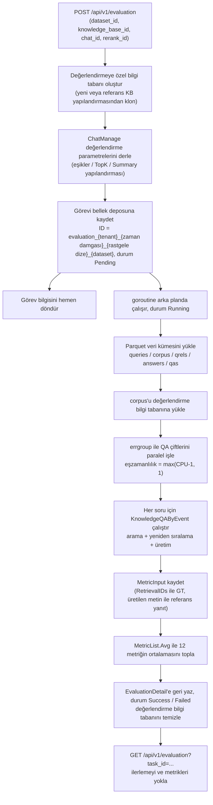

# Değerlendirme (Evaluation)

Değerlendirme, referans yanıtları olan bir soru-cevap veri kümesi kullanarak parçalama, model ve arama yapılandırmalarının etkisini karşılaştırır. Sistem bir değerlendirme bilgi tabanı oluşturup derlemi içe aktarır, her soru için arama ve üretim çalıştırır ve Precision, Recall, NDCG, MRR, MAP, BLEU ve ROUGE gibi metrikler üretir.

::: tip API üzerinden kullanım
Değerlendirmenin şu an ayrı bir arayüz girişi yoktur; `POST /api/v1/evaluation` ile başlatılır ve sonuç `GET /api/v1/evaluation?task_id=...` ile yoklanır. Oluşturmak için Admin, sorgulamak için Viewer yetkisi gerekir. Veri kümesi Parquet biçimindedir; biçim gereksinimleri aşağıda açıklanmıştır.
:::

Yapılandırmaları karşılaştırırken veri kümesini sabit tutun, her seferinde tek bir değişkeni değiştirin ve sonuçları aynı metrik grubuyla karşılaştırın.

## Değerlendirme çalıştırma

1. Yerleşik örnek veri kümesini kullanın ya da aşağıdaki biçimde Parquet dosyaları hazırlayıp hizmet çalışma dizinindeki `dataset/samples/` içindeki aynı adlı dosyaların yerine koyun (konteyner içinde `/app/dataset/samples/`).
2. Referans bilgi tabanını, sohbet modelini ve yeniden sıralama modelini seçip `POST /api/v1/evaluation` ile görev oluşturun. Referans bilgi tabanı yapılandırmayı kopyalamak için kullanılır; değerlendirme ayrı bir bilgi tabanı kullanır.
3. Dönen görev ID'sini kaydedin ve durumu ile ilerlemeyi `GET /api/v1/evaluation?task_id=...` ile sorgulayın.
4. Görev başarıyla bitince arama ve üretim metriklerini karşılaştırın; başarısız olursa önce görev hatasını inceleyin, sonra yapılandırmayı ayarlayıp yeniden çalıştırın.

Görev oluşturmak için Admin, sonuçları sorgulamak için Viewer yetkisi gerekir; API Key için ayrıca `run_evaluations` yeteneği veya full-access gerekir.

## Veri kümesi biçimi

Veri kümesi hizmeti (`internal/application/service/dataset.go`) `./dataset/samples/` dizininden 5 **Parquet** dosyası yükler:

| Dosya | Schema | Anlamı |
| --- | --- | --- |
| `queries.parquet` | `id: int64, text: string` | Soru kümesi |
| `corpus.parquet` | `id: int64, text: string` | Derlem paragrafları (değerlendirmede bilgi tabanına yüklenir) |
| `answers.parquet` | `id: int64, text: string` | Referans yanıtlar |
| `qrels.parquet` | `qid: int64, pid: int64` | Soru → ilgili paragraf ground truth ilişkisi (arama metriklerinin temeli) |
| `qas.parquet` | `qid: int64, aid: int64` | Soru → yanıt eşlemesi (üretim metriklerinin temeli) |

Karşılık gelen Go yapıları:

```go
type TextInfo struct {
    ID   int64  `parquet:"id"`
    Text string `parquet:"text"`
}
type RelsInfo struct {
    QID int64 `parquet:"qid"`
    PID int64 `parquet:"pid"`
}
type QaInfo struct {
    QID int64 `parquet:"qid"`
    AID int64 `parquet:"aid"`
}
```

Yüklendikten sonra örnek başına `QAPair` olarak birleştirilir (`internal/types/dataset.go`):

```go
type QAPair struct {
    QID      int      // Soru ID'si
    Question string   // Soru metni
    PIDs     []int    // İlgili paragraf ID'leri (ground truth)
    Passages []string // Paragraf metinleri
    AID      int      // Yanıt ID'si
    Answer   string   // Referans yanıt metni
}
```

Hizmet bu 5 dosyayı her zaman `./dataset/samples/` dizininden okur; `dataset_id` şu an yalnızca görev ID'sini oluşturmak için kullanılır ve başka bir dizine geçiş yapmaz. Özel veri kümesi kullanırken yukarıdaki Schema'ya göre aynı adlı Parquet dosyaları üretip bu dizinin içeriğini değiştirin (Docker kurulumunda `/app/dataset/samples/` yoluna bağlanabilir). Yükleme sırasında hizmet istatistikleri yazdırır (soru sayısı, derlem sayısı, ortalama ilgili paragraf sayısı, yanıt kapsama oranı vb.).

## Sonuç sorgulama

`GET /api/v1/evaluation?task_id=<oluşturmada dönen görev ID'si>` çağrısı `EvaluationDetail` döndürür:

```json
{
  "success": true,
  "data": {
    "task": {
      "id": "evaluation_1_1758600000000_1a2b3c4d_default",
      "dataset_id": "default",
      "status": 2,
      "total": 100,
      "finished": 100
    },
    "params": { "...": "ChatManage değerlendirme parametreleri anlık görüntüsü" },
    "metric": {
      "retrieval_metrics": {
        "precision": 0.85, "recall": 0.92,
        "ndcg3": 0.88, "ndcg10": 0.86,
        "mrr": 0.95, "map": 0.87
      },
      "generation_metrics": {
        "bleu1": 0.72, "bleu2": 0.65, "bleu4": 0.58,
        "rouge1": 0.78, "rouge2": 0.71, "rougel": 0.75
      }
    }
  }
}
```

Görev çalışırken `finished / total` ilerlemesini almak için bu arayüz yoklanabilir; `status = 3` olduğunda `err_msg` başarısızlık nedenini taşır.

> **Not**: Değerlendirme sonuçları **bellekte** saklanır (`evaluationMemoryStorage`: `map[string]*EvaluationDetail` + `sync.RWMutex`; bkz. `internal/application/service/evaluation.go`). Hizmet yeniden başlatılınca görevler ve sonuçlar kaybolur, değerlendirmenin yeniden başlatılması gerekir.

## Metrik listesi

Metrik kaydı `internal/application/service/metric_hook.go` içindedir; iki grupta toplam 12 metrik vardır. Metin önce `metric/common.go` ile belirteçlere ayrılır: Çince Jieba ile bölünür, İngilizce boşluklara göre ayrılır, cümleler `。` (Çince tam nokta) / `.` ile bölünür.

### Arama metrikleri (Retrieval Metrics)

| Metrik | Alan | Uygulama dosyası | Anlamı |
| --- | --- | --- | --- |
| Precision | `precision` | `metric/precision.go` | Arama kesinliği: isabet eden ilgili belge sayısı / dönen toplam sonuç sayısı, GT kümesi üzerinden ortalaması alınır |
| Recall | `recall` | `metric/recall.go` | Arama duyarlılığı: isabet eden ilgili belge sayısı / toplam ilgili belge sayısı |
| NDCG@3 | `ndcg3` | `metric/ndcg.go` | Normalleştirilmiş indirimli kümülatif kazanç (ilk 3 sıra); ilgili belgeleri öne yerleştirmeyi ödüllendirir |
| NDCG@10 | `ndcg10` | `metric/ndcg.go` | Aynısı, ilk 10 sıra |
| MRR | `mrr` | `metric/mrr.go` | İlk ilgili belgenin ters sıralamasının ortalaması: `sum(1/rank) / N` |
| MAP | `map` | `metric/map.go` | Ortalama kesinliklerin ortalaması: her isabet konumu için `Precision@k` biriktirilip normalleştirilir |

NDCG'nin temel hesabı (`metric/ndcg.go`):

```go
// DCG = sum((2^rel_i - 1) / log2(i+2)), rel 0/1 değerindedir
dcg += (math.Pow(2, float64(relevance)) - 1) / math.Log2(float64(i+2))
// NDCG = DCG / IDCG (ideal sıralamanın DCG değeri)
```

MRR'nin temel hesabı (`metric/mrr.go`):

```go
for i, predID := range ids {
    if _, ok := gtSet[predID]; ok {
        sumRR += 1.0 / float64(i+1) // İlk isabet konumunun tersi
        break
    }
}
```

### Üretim metrikleri (Generation Metrics)

| Metrik | Alan | Uygulama dosyası | Anlamı |
| --- | --- | --- | --- |
| BLEU-1 | `bleu1` | `metric/bleu.go` | 1-gram kesinliği (ağırlıklar `[1.0, 0, 0, 0]`) |
| BLEU-2 | `bleu2` | `metric/bleu.go` | 1-gram ve 2-gram için %50'şer (ağırlıklar `[0.5, 0.5, 0, 0]`) |
| BLEU-4 | `bleu4` | `metric/bleu.go` | 1~4-gram eşit ağırlık (`[0.25, 0.25, 0.25, 0.25]`), brevity penalty içerir |
| ROUGE-1 | `rouge1` | `metric/rouge.go` | Tekli kelime örtüşmesi F1 |
| ROUGE-2 | `rouge2` | `metric/rouge.go` | İkili kelime grubu örtüşmesi F1 |
| ROUGE-L | `rougel` | `metric/rouge.go` | En uzun ortak alt dizi (LCS) F1 |

BLEU'nun özü (`metric/bleu.go`): düzeltilmiş n-gram kesinliklerinin ağırlıklı geometrik ortalaması kısalık cezasıyla çarpılır: `bp * exp(sum(w_i * log(p_i)))`. ROUGE F1 değerini alır: `F1 = 2PR / (P + R + 1e-8)` (`metric/rouge_score.go`).

## Arayüz ve çalışma başvurusu

### API

`internal/router/routes_infra.go`:

```go
evaluationRoutes := g.apiKeyGroup(r.Group("/evaluation"), apiKeyRunEvaluations(apiKeyFullAccess()))
{
    evaluationRoutes.POST("", g.Admin(), handler.Evaluation)
    evaluationRoutes.GET("", g.Viewer(), handler.GetEvaluationResult)
}
```

| Yöntem | Yol | Yetki | Açıklama |
| --- | --- | --- | --- |
| POST | `/api/v1/evaluation` | Admin (API Key için `run_evaluations` yeteneği veya full-access gerekir) | Değerlendirme görevi oluşturur, görev bilgisini hemen döndürür |
| GET | `/api/v1/evaluation?task_id=...` | Viewer | Görev durumunu, ilerlemeyi ve metrik sonuçlarını sorgular |

#### Değerlendirme görevi oluşturma

İstek parametreleri (`internal/handler/evaluation.go`):

```go
type EvaluationRequest struct {
    DatasetID       string `json:"dataset_id"`        // Veri kümesi ID'si, varsayılan "default"
    KnowledgeBaseID string `json:"knowledge_base_id"` // Referans bilgi tabanı (yapılandırması yeniden kullanılır)
    ChatModelID     string `json:"chat_id"`           // Sohbet modeli
    RerankModelID   string `json:"rerank_id"`         // Yeniden sıralama modeli
}
```

| Parametre | Zorunlu | Varsayılan davranış |
| --- | --- | --- |
| `dataset_id` | Hayır | Varsayılan `default`; yalnızca görev ID'si için kullanılır, veriler her zaman `dataset/samples/` içinden okunur |
| `knowledge_base_id` | Hayır | Verilmezse değerlendirmeye özel yeni bilgi tabanı oluşturulur; verilirse yapılandırması kopyalanarak değerlendirme KB'si oluşturulur |
| `chat_id` | Hayır | Verilmezse varsayılan Chat modeli otomatik seçilir |
| `rerank_id` | Hayır | Verilmezse varsayılan Rerank modeli otomatik seçilir |

Görev ID'si `utils.GenerateTaskID` ile üretilir; biçimi `evaluation_{tenantID}_{milisaniye zaman damgası}_{8 karakterlik rastgele dize}_{datasetID}` olup her oluşturmada farklıdır, bu yüzden oluşturma yanıtındaki ID ile sorgulanmalıdır. Görev nesnesi (`internal/types/evaluation.go`):

```go
type EvaluationTask struct {
    ID        string           `json:"id"`
    TenantID  uint64           `json:"tenant_id"`
    DatasetID string           `json:"dataset_id"`
    StartTime time.Time        `json:"start_time"`
    Status    EvaluationStatue `json:"status"`
    ErrMsg    string           `json:"err_msg,omitempty"`
    Total     int              `json:"total,omitempty"`    // Toplam örnek sayısı
    Finished  int              `json:"finished,omitempty"` // Tamamlanan sayı
}
```

Görev durumu sabitleri (kaynak kodda `EvaluationStatue` olarak yazıldığına dikkat edin):

```go
const (
    EvaluationStatuePending EvaluationStatue = iota // 0 başlamayı bekliyor
    EvaluationStatueRunning                          // 1 çalışıyor
    EvaluationStatueSuccess                          // 2 başarılı
    EvaluationStatueFailed                           // 3 başarısız
)
```

### Değerlendirme akışı

`internal/application/service/evaluation.go` içinde POST arayüzü **hazırlığı eşzamanlı tamamlar, değerlendirmeyi eşzamansız çalıştırır**:

1. **Bilgi tabanı hazırlığı**: Değerlendirmeye özel bilgi tabanı yeni oluşturulur (ya da referans KB yapılandırmasına göre klonlanır), varsayılan Embedding ve LLM modelleri alınır;
2. **Parametre derleme**: Sistem yapılandırmasından `ChatManage` değerlendirme parametreleri derlenir: `VectorThreshold`, `KeywordThreshold`, `EmbeddingTopK`, `RerankTopK`, `RerankThreshold`, `MaxRounds`, `SummaryConfig` (MaxTokens / TopK / TopP / RepeatPenalty / Prompt / ContextTemplate vb.), `FallbackResponse`, yeniden yazma istemleri vb.;
3. **Görev kaydı**: Görev ID'siyle bellek deposuna `Pending` durumunda kaydedilir ve yanıt hemen döndürülür;
4. **Arka planda çalıştırma** (goroutine): Veri kümesinin corpus'u değerlendirme KB'sine yüklenir → her QA çifti paralel değerlendirilir → metrikler toplanır → kaynaklar temizlenir.

Eşzamanlılık `max(GOMAXPROCS - 1, 1)` olarak alınır (errgroup ile sınırlandırılır):

```go
var g errgroup.Group
metricHook := NewHookMetric(len(dataset))
g.SetLimit(max(runtime.GOMAXPROCS(0)-1, 1))
for i, qaPair := range dataset {
    g.Go(func() error {
        // 1. ChatManage yapılandırmasını klonla
        // 2. KnowledgeQAByEvent tam hattını çalıştır (arama + yeniden sıralama + üretim)
        // 3. MetricInput kaydet (bulunan passage ID'leri, üretilen metin, GT)
        // 4. Kilit alarak finished ilerlemesini güncelle
    })
}
g.Wait()
```

Her örnek bir `MetricInput` üretir (`internal/types/evaluation.go`):

```go
type MetricInput struct {
    RetrievalGT    [][]int // Arama ground truth'u (ilgili passage ID listesi)
    RetrievalIDs   []int   // Aramanın gerçekte döndürdüğü passage ID'leri
    GeneratedTexts string  // Modelin ürettiği metin
    GeneratedGT    string  // Referans yanıt
}
```

`metric_hook.go` her örnek için kayıtlı tüm metrik hesaplayıcılarını çalıştırıp puan alır; sonunda `Avg()` tüm örnekler üzerinden her metriğin ortalamasını alıp `MetricResult` içine yazar.

::: warning RetrievalIDs'in anlamı
`RetrievalIDs` **veri kümesindeki passage ID'leri** olmalıdır; arama sonuçlarındaki `ChunkIndex` doğrudan kullanılamaz. `ChunkIndex` yalnızca parçanın bilgi tabanındaki sıra numarasıdır ve passage ID ile bir karşılığı yoktur; doğrudan kullanılırsa tüm arama metrikleri sürekli 0 çıkar. Bu yüzden `recordFinish`, her arama sonucunun metnini ilgili örneğin ground truth passage'larıyla iki yönlü içerme eşleştirmesinden geçirip karşılık gelen pid'i bulur ve tekrarları ayıklar. Yeniden sıralama sonucu boş olduğunda özgün arama sonuçlarına geri dönülür; böylece örnek "hiçbir şey bulunamadı" olarak kaydedilmez.

Derlem yüklemesi de **indeksleme tamamlanana kadar eşzamanlı beklemelidir** (`CreateKnowledgeFromPassageSync`): eşzamansız yüklemede değerlendirme sorguları indeks hazır olmadan çalışır ve yine metrikler sürekli 0 çıkar. Ayrıca passage listesinin uzunluğu `maxPID + 1` olarak ayrılır; pid 0 tabanlıdır ve son değeri de içerir.
:::

#### Değerlendirme akış şeması



## Uygulama başvurusu

Aşağıdaki yolların tümü depo kök dizinine görelidir:

| Katman | Dosya |
| --- | --- |
| HTTP Handler | `internal/handler/evaluation.go` |
| Değerlendirme hizmeti | `internal/application/service/evaluation.go` |
| Metrik kaydı ve toplama | `internal/application/service/metric_hook.go` |
| Metrik uygulamaları | `internal/application/service/metric/` (`precision.go`, `recall.go`, `ndcg.go`, `mrr.go`, `map.go`, `bleu.go`, `rouge.go`, `rouge_score.go`, `common.go`) |
| Veri kümesi yükleme | `internal/application/service/dataset.go` |
| Tip tanımları | `internal/types/evaluation.go`, `internal/types/dataset.go` |
| Yerleşik örnek veri kümesi | `dataset/samples/` (Parquet dosyaları) |
| Rota kaydı | `internal/router/routes_infra.go` içindeki `RegisterEvaluationRoutes` |
