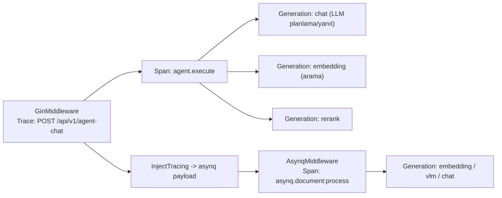
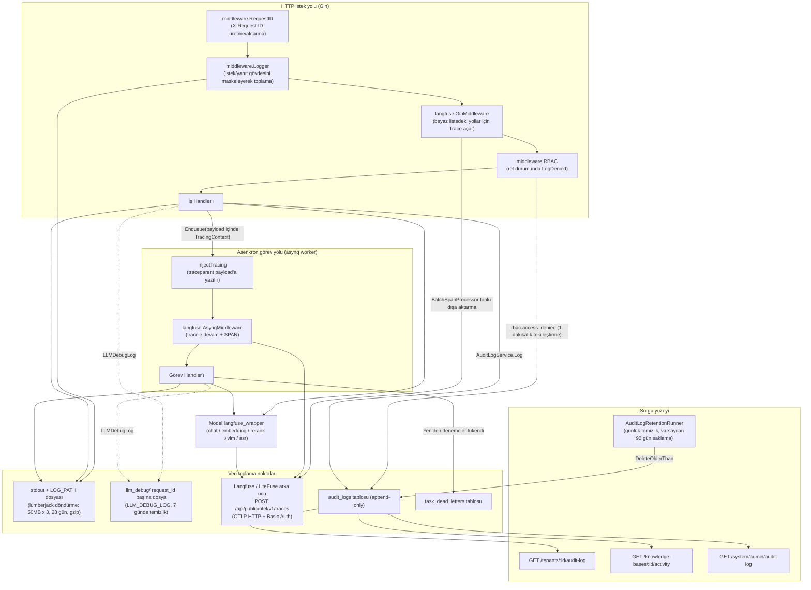

# Gözlemlenebilirlik ve Denetim

Günlükler ve çağrı izleri istek hatalarını, gecikmeyi ve model kullanımını analiz etmek için kullanılır; denetim günlükleri kaynak değişikliklerini kaydeder; görev kuyruğu paneli arka plandaki birikmeleri, hataları ve yeniden denemeleri incelemek için kullanılır.

| Sorun giderme hedefi | Nereye bakılır |
| --- | --- |
| Bir soru-cevapta neyin arandığı, modelin kaç kez çağrıldığı, kaç token harcandığı | Langfuse bağlandıktan sonra Langfuse'ta tam çağrı zincirine bakın |
| Bilgi tabanı, üye veya sistem ayarlarındaki değişiklikler | Bilgi tabanı ayarlarındaki "Etkinlik" ve "Ayarlar → Denetim günlüğü" |
| Arka plandaki ayrıştırma, özet ve Wiki görevlerinin birikip birikmediği veya başarısız olup olmadığı | "Ayarlar → Çalışma zamanı kuyruğu" |
| Hizmetin ayakta olup olmadığı | `GET /health` |
| Aynı isteğe ait hizmet günlüklerini ilişkilendirme | Yanıt başlığındaki `X-Request-ID` ile günlüklerde arama |

<Screenshot
  src="/screenshots/queue-dashboard.png"
  caption="Çalışma zamanı görev kuyruğu: her kuyruğun birikme, hata ve yeniden deneme durumu"
  hint="Kuyruk adı, bekleyen/işlenen/başarısız sayıları ve ölü mektup görev işlemleri girişini içeren kuyruk panelini gösterir." />

<Screenshot
  src="/screenshots/observability-langfuse.png"
  caption="Langfuse izi: bir soru-cevabın tam çağrı zinciri"
  hint="Langfuse'ta bir trace'in açılmış görünümünü gösterir; arama, yeniden sıralama ve üretim span'larını ve token kullanımını içerir." />

İstek sorunlarını giderirken önce yanıt başlığındaki `X-Request-ID` değerini alın, ardından günlükleri ve iz kayıtlarını ilişkilendirin.

## Operasyon Hızlı Başvurusu {#operasyon-hizli-basvurusu}

| Öğrenmek istediğiniz… | Nereye bakılır |
| --- | --- |
| Bir isteğin tüm zincirinde ne olduğu | Yanıt başlığındaki `X-Request-ID` ile uygulama günlüğünde grep yapın; `LLM_DEBUG_LOG` açıldıktan sonra `llm_debug/<request_id>.log` dosyasına bakın |
| Bir sohbet/ayrıştırmanın LLM çağrı ağacı ve token tüketimi | Langfuse UI (trace adı `POST /api/v1/agent-chat` veya `asynq.document:process`) |
| Kimin ne zaman neyi değiştirdiği | Alan denetimi `/tenants/:id/audit-log`; KB etkinliği `/knowledge-bases/:id/activity`; platform denetimi `/system/admin/audit-log` |
| Bir belgenin neden sürekli başarısız olduğu | `task_dead_letters` tablosu (scope=knowledge/knowledge_base) + çalışma zamanı panelindeki archived görevlerin `last_error` alanı |
| Hizmetin ayakta olup olmadığı | `GET /health` (200 `{"status":"ok"}`) |
| Yapılandırmanın beklendiği gibi yüklenip yüklenmediği | Başlangıç günlüğündeki `[startup-env]` başlığı (`internal/runtime/startup.go`; hassas değerlerin yalnızca uzunluğu gösterilir) |

## Sağlık Denetimi {#saglik-denetimi}

`internal/router/router.go` kimlik doğrulama gerektirmeyen sağlık yoklamasını kaydeder (`internal/middleware/auth.go` içindeki herkese açık yol beyaz listesi `/health` içerir):

```go
// internal/router/router.go
r.GET("/health", func(c *gin.Context) {
    c.JSON(200, gin.H{"status": "ok"})
})
```

Bu yalnızca bir canlılık yoklamasıdır (liveness; DB/Redis bağımlılıklarını denetlemez) ve kapsayıcı / LB sağlık denetimi hedefi olarak uygundur. `langfuse.shouldTrace` ve istek günlüğü örneklemesi de yoklama gürültüsünü önlemek için bu yolu hariç tutar. Süreç çalışma süresi, `internal/runtime/server.go` içindeki `MarkServerStarted`/`ServerUptime` tarafından operasyon paneline sağlanır.

## Günlük, İz ve Denetim Başvurusu

### Günlük sistemi (`internal/logger`) {#gunluk-sistemi-internal-logger}

#### Biçim ve düzeyler {#bicim-ve-duzeyler}

- Altta **özel** bir logrus örneği (`appLogger`; harici bağımlılıkların genel logrus'u değiştirip günlük kaybına yol açmasını önler) ve özel `CustomFormatter` kullanılır.
- Varsayılan tek satır biçimi: `LEVEL[zaman damgası] [request_id alanları...] caller | message`; caller `dosya:satır[fonksiyon adı]` biçimindedir (`addCaller`).
- `LOG_FORMAT` ortam değişkeniyle şablon verilebilir. Yer tutucular: `%d`=zaman, `%level`=düzey, `%thread`=goroutine ID (her günlükte `runtime.Stack` çalışmaması için yalnızca şablonda kullanıldığında alınır), `%logger`=caller, `%traceId`=request_id, `%msg`=mesaj+yapılandırılmış alanlar. Tek geçişli `strings.NewReplacer` ile değiştirme, çift değiştirme sorununu önler.
- Düzey `LOG_LEVEL` ile denetlenir (`debug`/`info`/`warn`/`error`/`fatal`; ayarlanmamışsa veya geçersizse **varsayılan debug**).
- Renk: stdout bir terminalse ANSI renkleri etkinleşir; terminal değilse (Docker toplama) devre dışıdır; dosyaya yazarken `ansiStripWriter` ANSI dizilerini temizleyerek düz metin korur.
- Yapılandırılmış alan API'si: `logger.WithField(ctx, k, v)` / `WithFields` alan içeren entry'yi context'e (`types.LoggerContextKey`) kaydeder; sonraki `logger.Infof(ctx, ...)` çağrıları bunu otomatik taşır. `WarnWithFields` denetimle ilgili olaylar (kiracılar arası yoklama, değişmez ihlali) için ayrılmıştır; günlük toplayıcıların tenant/kaynağa göre dizinlemesini kolaylaştırır.
- `CloneContext`, arka plan goroutine'i türetilirken temel context anahtarlarını (tenant/user/request_id/rol/dil vb.) kopyalar; ayrıca Langfuse `*Trace` tutamacını ve **etkin OTel span'ını** korur, böylece alt span'ların sahipsiz trace'e dönüşmesini önler.

#### Çıktı ve döndürme {#cikti-ve-dondurme}

`ConfigureFromEnv()` (init sırasında çalışır; `main` `.env` dosyasını yükledikten sonra yeniden çağrılabilir): her zaman stdout'a yazar; `LOG_PATH` boş değilse (veya macOS `.app` paketi olarak çalışırken otomatik olarak `~/Library/Logs/<App>/<App>.log` konumuna) lumberjack aracılığıyla ek olarak diske yazar:

```go
// internal/logger/logger.go openLogFile()
return &lumberjack.Logger{
    Filename:   logPath,
    MaxSize:    50, // megabytes
    MaxBackups: 3,
    MaxAge:     28, // days
    Compress:   true,
}, nil
```

#### LLM hata ayıklama günlüğü (`internal/logger/llm_logger.go`) {#llm-hata-ayiklama-gunlugu-internal-logger-llm-logger-go}

`LLM_DEBUG_LOG=true|1|<dizin>` açıldığında her model çağrısı (Chat / Chat Stream / Embedding / Rerank / VLM) **eksiksiz** giriş mesajlarını, araç çağrılarını, çıktıyı ve hataları `llm_debug/` dizinine yazar. **Aynı request_id'ye ait tüm çağrılar aynı dosyaya eklenir** (`<request_id>.log`); böylece bir oturumdaki tüm model etkileşimleri yeniden oluşturulabilir. Dizindeki 7 günden eski dosyalar başlangıçta arka planda temizlenir (`cleanupOldDebugFiles`).

#### İstek günlüğü ara katmanı (`internal/middleware/logger.go`) {#istek-gunlugu-ara-katmani-internal-middleware-logger-go}

- `RequestID()`: `X-Request-ID` değerini okur veya üretir, yanıt başlığına geri yazar ve request_id'yi alan içeren logger ile birlikte gin context'ine ve `http.Request` context'ine koyar; tüm zincirdeki günlükler (asynq worker tarafına aktarılan session etiketleri dahil) request_id ile ilişkilendirilebilir.
- `Logger()`: method, path (query, `sanitizeQuery` ile `token`/`code`/`state` gibi OAuth'a özgü hassas parametrelerden arındırılır), status_code, latency, client_ip, size ve en fazla 10KB istek/yanıt gövdesini kaydeder. İstek/yanıt gövdeleri `sensitiveFieldRegex` ile maskelenir (password/token/api_key/secret/private_key gibi alanların değerleri `"***"` ile değiştirilir; snake_case/camelCase uyumludur); SSE yanıt gövdesi `[SSE stream skipped]` olarak kaydedilir; `/assets/` ve wiki stats yoklama yolları doğrudan atlanır.
- Güvenilir proxy: `r.SetTrustedProxies(...)` (`RETHRA_TRUSTED_PROXIES`), sahte `X-Forwarded-For` ile `ClientIP` tabanlı hız sınırlamasının aşılmasını önler.

### Langfuse izleme (`internal/tracing/langfuse`) {#langfuse-izleme-internal-tracing-langfuse}

Dağıtık izleme OpenTelemetry Go SDK kullanır; span öznitelikleri Langfuse anlamsal kurallarına göre (`langfuse.observation.*`) yazılır ve OTLP/HTTP ile `POST <host>/api/public/otel/v1/traces` adresine aktarılır; Langfuse v3+ ve LiteFuse ile uyumludur. İzleme varsayılan olarak kapalıdır; etkin değilse ilgili girişler dışa aktarım yapmaz.

#### Yapılandırma (ortam değişkenleri, `config.go`) {#yapilandirma-ortam-degiskenleri-config-go}

| Ortam değişkeni | Varsayılan | Açıklama |
| --- | --- | --- |
| `LANGFUSE_ENABLED` | Açık/gizli anahtar varsa otomatik etkin | Ana anahtar (Python SDK kuralıyla aynı) |
| `LANGFUSE_HOST` | `https://cloud.langfuse.com` | Langfuse/LiteFuse temel adresi (kendi sunucunuz olabilir) |
| `LANGFUSE_PUBLIC_KEY` / `LANGFUSE_SECRET_KEY` | — | Basic Auth proje kimlik bilgileri |
| `LANGFUSE_RELEASE` / `LANGFUSE_ENVIRONMENT` | — | UI filtrelemesi için her trace'e eklenir |
| `LANGFUSE_FLUSH_AT` | 15 | Toplu dışa aktarma parti boyutu (BatchSpanProcessor `MaxExportBatchSize`) |
| `LANGFUSE_FLUSH_INTERVAL` | 3s | Toplu dışa aktarmanın en uzun aralığı (`BatchTimeout`) |
| `LANGFUSE_QUEUE_SIZE` | 2048 | Bellek arabelleği üst sınırı (uç noktaya ulaşılamadığında sınırsız büyümeyi önler) |
| `LANGFUSE_REQUEST_TIMEOUT` | 10s | Tek ingestion HTTP isteğinin zaman aşımı |
| `LANGFUSE_SAMPLE_RATE` | 1.0 | `ParentBased(TraceIDRatioBased)` örnekleme oranı, 0..1 |
| `LANGFUSE_DEBUG` | false | Toplu gönderim hataları için ayrıntılı günlük |

#### Dışa aktarıcı (`exporter.go`) {#disa-aktarici-exporter-go}

OTLP/HTTP exporter, `Authorization: Basic base64(public:secret)` kullanır. Bu exporter kendi HTTP istemcisini kullanır, SSRF korumasından geçmez ve `SSRF_DNS_WHITELIST_ONLY` açıldığında da beyaz listeye tabi değildir. `x-langfuse-ingestion-version: 4`, Langfuse v3/LiteFuse OTel doğrudan yazma yolu için zorunlu başlıktır (eksikse 400 döner); `x-langfuse-sdk-name/version` uyumluluk işaretidir. `Manager` (`manager.go`) bağımsız bir `TracerProvider` (`service.name=rethra` resource) tutar ve süreçteki diğer OTel ölçümlerini etkilememek için `otel.SetTextMapPropagator` gibi genel OTel değişiklikleri yapmaz; W3C `TraceContext` propagator paket düzeyinde özel bir değerdir.

#### Gözlem modeli ve ölçüm noktaları {#gozlem-modeli-ve-olcum-noktalari}

Üç tutamaç türü vardır (`tracer.go`): `Trace` (kök, bir istek), `Span` (LLM olmayan mantıksal iş birimi) ve `Generation` (bir model çağrısı; `TokenUsage` token istatistiklerini ve akışlı time-to-first-token için `MarkCompletionStart` içerir). Üst-alt ilişkisi OTel span context ile otomatik kurulur; trace yoksa sahipsiz span'ları önlemek için otomatik auto-trace açılır.

Başlıca ölçüm noktaları:

| Nokta | Kaynak kod | Çıktı |
| --- | --- | --- |
| HTTP girişi | `middleware.go` `GinMiddleware` | `shouldTrace` beyaz listesindeki yollar için (knowledge-chat / agent-chat / knowledge-search / çeşitli ingestion POST/PUT / FAQ içe aktarma / wiki auto-fix / evaluation / initialization algılama vb.) kök Trace açar; ad `METHOD /path` biçimindedir, metadata http.method/path/query/request_id içerir, çıktı status ve response.size'dır; üst akıştaki W3C `traceparent` başlığını çıkararak harici çağıranın trace id'sini devralır |
| asynq worker | `asynq.go` `AsynqMiddleware` | payload'dan traceparent'ı geri yükleyerek HTTP trace'ine devam eder, yoksa yeni bir `asynq.<task_type>` trace'i açar; bir SPAN ile sarar, metadata task_id/queue/retry/max_retry/payload_bytes içerir; payload'ın yalnızca ilk 1KB'lık önizlemesi alınır |
| Kuyruğa ekleme tarafında enjeksiyon | `asynq.go` `InjectTracing` + `internal/types/tracing.go` `TracingContext` | traceparent ve user/session etiketlerini `lf_*` JSON alanları olarak görev payload'ına gömer ve süreçler arasında taşır |
| Model çağrısı | `internal/models/{chat,embedding,rerank,vlm,asr}/langfuse_wrapper.go` | Her çağrı için bir Generation (model adı, girdi, parametreler, çıktı, token usage, hata) |
| Arama/yeniden sıralama özeti | `retrieval_obs.go` | `SummarizeRetrieveOutput` / `SummarizeSearchResults` vb. getirilen sonuçları top-25 önizlemeye (rank/chunk_id/score/160 karakterlik preview) sıkıştırır; tam metnin trace'e girmesini önler |
| Agent çalıştırma | `internal/agent/engine.go`, `act.go` | agent.execute gibi SPAN'lar; `logger.CloneContext` sayesinde HTTP kök trace'iyle aynı ağaçta kalır |

Raporlanan içerik (span öznitelikleri, `events.go`): `langfuse.observation.type/input/output/metadata/model.name/model.parameters/usage_details/completion_start_time`, `langfuse.trace.name/input/output/metadata/tags`, `user.id` (açık user veya `tenant:<id>`), `session.id`, `langfuse.environment/release`.



#### Tur başına kullanım, çağrı amacı ve önbellek

Her model çağrısı ayrı bir Generation üretmeye devam eder; mesajın usage alanı bu turun toplam Token kullanımını saklar, Agent tamamlanma olayı turn_usage ile döner ve geçmiş mesajlar yeniden açıldığında da okunabilir. prompt_tokens, completion_tokens ve total_tokens toplamlardır; cached_tokens, cache_read_tokens için uyumluluk takma adıdır; cache_read/write/miss girdi Token'larının alt kırılımıdır ve prompt_tokens'a ayrıca eklenmemelidir.

cache_reported ve cache_status; hit, miss, unreported ve unsupported durumlarını ayırt eder; raporlanmamış olması önbellek ıskalaması sayılmaz. Generation metadata'sı call_purpose ve istem ön eki parmak izini kaydeder; bu, yanıt, yeniden yazma, özet gibi amaçları ayırt etmek ve önbellek değişimlerini açıklamak için kullanılır.

İstem birleştirme, sabit açıklamaları başa, dinamik oturum içeriğini sona koyar; desteklenen sağlayıcılarda cache marker kullanılır. İsabet yine de sağlayıcı protokolüne, modele ve istek ön ekine bağlıdır; her istekte önbellek garanti edilmez. Sorun giderirken önce çağrı amacını, ön ek parmak izini ve modeli karşılaştırın, ardından raporlama durumuna bakın.

Sanal alan çağrılarının da Langfuse span'ı vardır; örnek işlemleri ve araç çalıştırma sürelerini geçerli trace'e bağlayarak sanal alanı bekleme ile modeli bekleme arasındaki farkı gösterir. Sanal alan arka plan bakımı (ör. oturum geri toplama) yalnızca bir üst trace varsa alt span kaydeder, ayrıca trace oluşturmaz; beceri kurma, silme ve bakım görevleri kendi trace'lerini açar. İzleme anahtarı etkin değilse Langfuse'a dışa aktarım yapılmaz.

### Denetim günlüğü {#denetim-gunlugu}

#### Veri modeli (`internal/types/audit_log.go`) {#veri-modeli-internal-types-audit-log-go}

`audit_logs` tablosu **yalnızca eklemeli**dir (UpdatedAt yok, yumuşak silme yok); monoton artan id hem birincil anahtar hem de imleç olarak kullanılır:

| Alan | Tür | Açıklama |
| --- | --- | --- |
| `id` | uint64 otomatik artan | Birincil anahtar + sayfalama imleci (`WHERE id < after_id ORDER BY id DESC`) |
| `tenant_id` | uint64 | Alan; `0` = sistem düzeyi (system-scope) olay |
| `actor_user_id` / `actor_role` | varchar | İşlemi yapan ve o anki rolü (sistem tetiklediğinde boş) |
| `action` | varchar(64) | Noktalı adlandırma `<area>.<event>` (bkz. 4.2) |
| `scope_type` / `scope_id` | varchar | Kaynak kapsamı (ör. `knowledge_base` + kbID; KB etkinlik sayfasını besler) |
| `target_type` / `target_id` / `target_user_id` | varchar | Somut hedef kaynak / kullanıcı |
| `request_path` / `request_method` | varchar | Rota şablonu (ham URL değil, imleç tablosunun şişmesini önler; ham URL Details.raw_path içinde saklanır) |
| `outcome` | varchar(16) | `success` / `accepted` (asenkron kabul edildi, henüz son durumda değil) / `denied` / `failed` / `partial` / `canceled` |
| `details` | jsonb | Eyleme özgü yük; anahtar değerleri **asla** veritabanına yazılmaz (ör. vector_store yalnızca değişen alan adlarını kaydeder). API Key ile başlatılan bilgi tabanı etkinliklerine ayrıca `api_key_id` / `api_key_name` yazılır (ad anlık görüntüsü; düz metin Key içermez) |
| `created_at` | timestamp | Saklama politikası temizliğinin dayanağı |

#### Denetim eylemleri listesi {#denetim-eylemleri-listesi}

| Grup | Eylemler |
| --- | --- |
| RBAC / üyeler | `rbac.member_added`, `rbac.member_removed`, `rbac.member_role_changed`, `rbac.member_left`, `rbac.access_denied`, `rbac.invitation_sent`, `rbac.invitation_accepted`, `rbac.invitation_declined`, `rbac.invitation_revoked`, `rbac.invitation_expired` |
| Vektör deposu | `vector_store.created`, `vector_store.updated`, `vector_store.deleted` |
| OpenSearch türetilmiş kaynakları | `opensearch.index_created`, `opensearch.index_deleted`, `opensearch.reindex_executed` |
| Sistem yönetimi (tenant_id=0) | `system.setting_changed`, `system.admin_promoted`, `system.admin_revoked`, `system.user_created`, `system.user_password_reset`, `system.api_key_created`, `system.api_key_revoked` |
| Çalışma zamanı kuyruk işlemleri (tenant_id=0) | `system.queue_task_retried`, `system.queue_task_deleted`, `system.queue_task_run_now`, `system.queue_task_cancelled`, `system.queue_archived_purged` |
| Bilgi tabanı | `kb.created`, `kb.updated`, `kb.deleted`, `kb.duplicated`, `kb.clone_started`, `kb.clone_completed`, `kb.clone_failed`, `kb.share_added`, `kb.share_permission_changed`, `kb.share_removed` |
| Bilgi | `knowledge.created`, `knowledge.updated`, `knowledge.deleted`, `knowledge.batch_deleted`, `knowledge.reparse_started`, `knowledge.parse_canceled`, `knowledge.move_started`, `knowledge.move_completed`, `knowledge.move_failed` |
| Etiket / veri kaynağı | `tag.created`, `tag.updated`, `tag.deleted`, `datasource.created`, `datasource.updated`, `datasource.deleted`, `datasource.sync_started`, `datasource.sync_completed`, `datasource.sync_failed`, `datasource.paused`, `datasource.resumed` |
| Wiki / FAQ | `wiki.content_changed`, `faq.import_started`, `faq.import_completed`, `faq.import_failed` |

#### Yazma yolu (service + middleware) {#yazma-yolu-service-middleware}

- `auditLogService.Log` (`internal/application/service/audit_log.go`) standart yazma girişidir: varsayılan `outcome=success`, `CreatedAt` doldurulur; **yazma başarısız olursa yalnızca ERROR günlüğü yazılır, hata yukarı iletilmez**; denetim hatası asla iş işlemini kesmemelidir.
- `LogDenied` RBAC ara katmanının retlerini kaydeder: `(tenant_id, actor, action=rbac.access_denied, rota şablonu)` anahtarıyla **1 dakikalık kayan pencere tekilleştirmesi** yapar (`denyDedupWindow`, `repo.CountSinceForDedup`); böylece yoklama yapan istemcilerin tabloyu doldurması önlenir (aynı uç noktaya 100 RPS gelse bile dakikada yalnızca 1 satır oluşur). Tekilleştirme anahtarı olarak ham URL yerine rota şablonu kullanılır; böylece UUID taraması ile pencere aşılamaz. stderr tarafındaki `[rbac] role insufficient` günlüğü tekilleştirmeden etkilenmez, her retle yazılır.
- `middleware/audit_provider.go` içindeki `AuditServiceProvider`, service'i gin context'ine enjekte eder (anahtar `rethra.audit_service`); RBAC ara katmanı bunu `AuditServiceFromContext` ile alır ve nil güvenlidir (Lite modunda denetim yapılandırılmayabilir).

#### Sorgu API'si (`internal/handler/audit_log.go`) {#sorgu-api-si-internal-handler-audit-log-go}

| Rota | Yetki | Açıklama |
| --- | --- | --- |
| `GET /api/v1/tenants/:id/audit-log` | PathTenantMatch + Admin | Alan denetim akışı; yalnızca `scope_type=''` olan alan düzeyindeki satırları döndürür (`UnscopedOnly`) |
| `GET /api/v1/knowledge-bases/:id/activity` | KB oluşturucusu veya alan Admin'i; ayrıca owner alanı olmalıdır (organizasyon paylaşımını kullanan taraf okuyamaz) | `scope_type=knowledge_base` + `scope_id=kbID` olan KB etkinlik görünümü |
| `GET /api/v1/system/admin/audit-log` | SystemAdmin (+ platform API Key `system.audit_read`) | `tenant_id=0` olan platform düzeyindeki olaylar (settings / promote / queue işlemleri vb.) |

Ortak sorgu parametreleri: `after_id` (imleç; daha küçük id'li satırları döndürür), `limit` (1–100, varsayılan 50, kesin üst sınır `auditLogListLimitMax=100`), `action` / `outcome` / `actor` tam eşleşme filtreleri. Yanıt `next_cursor` içerir (sayfadaki en küçük id; 0 sonuna gelindiğini gösterir).

#### Saklama politikası (`internal/application/service/audit_log_retention.go`) {#saklama-politikasi-internal-application-service-audit-log-retention-go}

- Yapılandırma: `audit.retention_days` (YAML) / `RETHRA_AUDIT_RETENTION_DAYS` (env ile geçersiz kılma); `audit:` bölümü atlanırsa varsayılan **90 gün**; açıkça 0 verilirse temizlik devre dışı kalır (uyumluluk senaryolarında veritabanı dışında arşivleme), negatif değerler config doğrulamasında hata verir.
- `AuditLogRetentionRunner`: yalın `time.Ticker` kullanan arka plan goroutine'i (cron / asynq bağımlılığı yok); başlangıçta 10 dakika gecikir (geçişlerden ve başlangıç trafiğinden kaçınmak için), ardından **her 24 saatte** bir `Purge` → `DeleteOlderThan(now - retention_days)` çalıştırır (tek satırlık dizinli DELETE, 30 sn zaman aşımı). Silinen sayısı INFO, hata WARN olarak kaydedilir (bir sonraki turda yeniden denenir). `internal/container/container.go` tarafından kurulur ve düzgün durdurma için `ResourceCleaner` kaydı yapılır (`Stop` idempotenttir; Start edilmemişse doğrudan döner).

### Hız sınırlama (`internal/ratelimit` ve ara katman) {#hiz-sinirlama-internal-ratelimit-ve-ara-katman}

#### Genel kayan pencere hız sınırlayıcısı (`internal/ratelimit/limiter.go`) {#genel-kayan-pencere-hiz-sinirlayicisi-internal-ratelimit-limiter-go}

- Önce Redis: Lua betiği "süresi dolmuş ZSET üyelerini ayıkla → `ZCARD` ile say → sınır aşılmadıysa `ZADD` + `PEXPIRE`" adımlarını atomik olarak tamamlar; birden çok örnek aynı bütçeyi paylaşır; üye `<instanceID>:<ms>` biçiminde olduğundan benzersizdir.
- Redis kullanılamadığında (hata veya Redis'siz Lite) süreç içi `localLimiter`'a **otomatik olarak geriler** (`sync.Map` + key başına zaman damgası dizisi); `StartCleanup` boş key'leri dönemsel olarak çıkarır.
- `max` her `Allow` çağrısında verilir; aynı limiter farklı key'ler için farklı bütçeler kullanabilir (ör. her embed kanalının kendi kotası).
- Kullananlar: Web embed herkese açık arayüzleri (dakika başına + 24 saat başına iki limiter, channel+ClientIP'ye göre, `internal/middleware/embed_auth.go`) ve IM hizmeti (`internal/im/service.go`).

#### Herkese açık kimlik doğrulama uç noktalarında IP hız sınırlaması (`internal/middleware/auth_public_ratelimit.go`) {#herkese-acik-kimlik-dogrulama-uc-noktalarinda-ip-hiz-sinirlamasi-internal-middleware-auth-public-ratelimit-go}

`PublicAuthRateLimit()` kimliği doğrulanmamış davet bağlantısı uç noktalarını (`/auth/invitations/lookup`, `/auth/register-by-invite`) korur: süreç içi kayan pencere, IP başına **dakikada 30 istek** (iki uç nokta aynı kovayı paylaşır); sınır aşılırsa 429 döner (`ErrTooManyRequests`). Tamamen yerel bir uygulamadır (düşük trafikli uç noktalar); yorumlarda yatay ölçekleme sırasında `internal/ratelimit`'in Redis sürümüne geçilmesi gerektiği açıkça belirtilir.

### Model referans istatistikleri (`internal/application/repository/model_usage.go`) {#model-referans-istatistikleri-internal-application-repository-model-usage-go}

Bu dosya **model referans (usage-by-reference) sorgusu** sağlar; yani "hangi kaynaklar bir modeli kullanıyor" sorusunu yanıtlar. Model silinmeden önce bağımlılık koruması için kullanılır, token kullanımı faturalaması için değildir:

- `scopeKnowledgeBasesByModelID`: `knowledge_bases` içindeki model bağlama alanlarından herhangi biriyle eşleşir: `embedding_model_id`, `summary_model_id`, `image_processing_config.model_id`, `vlm_config.model_id`, `asr_config.model_id`, `wiki_config.synthesis_model_id`, `auto_tag_config.model_id` (Postgres'te `->>` JSON operatörü, SQLite'ta `json_extract` kullanılır; iki lehçe eşdeğerdir).
- `scopeCustomAgentsByModelID`: `custom_agents.config` içindeki `model_id`, `rerank_model_id`, `vlm_model_id`, `asr_model_id`, `query_understand_model_id`, `question_suggestions.follow_ups.model_id` ile eşleşir.
- Alanın uzun süreli bellek yapılandırması: `memory_config` içindeki `extract_model_id` ve `embedding_model_id` de referans sayılır ve `long_term_memory.bindings` içinde görünür.
- Kullananlar: `knowledgebase.go` / `custom_agent.go` depolarındaki `ListModelUsages` yukarıdaki scope'ları yeniden kullanır ve kiracıdaki etkin nesnelerin en küçük görünümünü (`id`, `name`, birleştirilmiş `bindings`) döndürür; kayıt sayısı üst sınırı `ModelUsageListLimit` (50) değeridir. `internal/application/service/model.go` içindeki silme koruması, engelleme kararı için `knowledge_base_total` / `agent_total` ve uzun süreli bellek bağlamalarını kullanır; HTTP 400 yanıtının `error.details` alanında kesilmiş listeyi, toplamı ve `long_term_memory` bilgisini birlikte döndürür.

Token düzeyindeki model kullanımı ise Langfuse Generation'ın `usage_details` alanıyla (`TokenUsage`: input/output/total/cache_*) raporlanır ve Langfuse UI'da model / kullanıcı (`tenant:<id>`) / oturuma göre toplu olarak görüntülenir.

### Gözlemlenebilirlik veri akışına genel bakış {#gozlemlenebilirlik-veri-akisina-genel-bakis}



## Uygulama Başvurusu

Aşağıdaki yolların tümü depo kök dizinine görelidir:

| Yetenek | Kaynak kod yolu |
| --- | --- |
| Uygulama günlüğü | `internal/logger/logger.go` |
| LLM çağrısı hata ayıklama günlüğü | `internal/logger/llm_logger.go` |
| İstek günlüğü / RequestID ara katmanı | `internal/middleware/logger.go` |
| Langfuse izleme (OTel SDK) | `internal/tracing/langfuse/` (`config.go`, `manager.go`, `exporter.go`, `tracer.go`, `middleware.go`, `asynq.go`, `events.go`, `retrieval_obs.go`, `context.go`) |
| Süreçler arası trace taşıyıcısı | `internal/types/tracing.go` |
| Denetim günlüğü handler / service / repo | `internal/handler/audit_log.go`, `internal/application/service/audit_log.go`, `internal/application/repository/audit_log.go` |
| Denetim saklama politikası | `internal/application/service/audit_log_retention.go`, `internal/config/config.go` (`applyAuditDefaults`) |
| Denetim eylemleri / modeli | `internal/types/audit_log.go` |
| Hız sınırlama | `internal/ratelimit/limiter.go`, `internal/middleware/auth_public_ratelimit.go` |
| Sağlık denetimi | `internal/router/router.go` (`GET /health`) |
| Model referans istatistikleri | `internal/application/repository/model_usage.go` |
