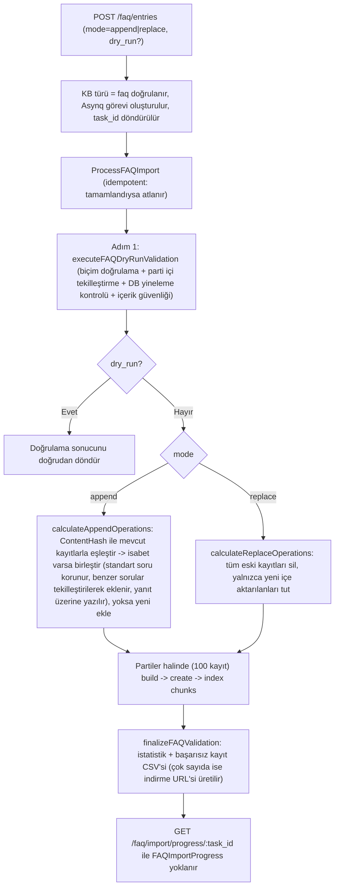
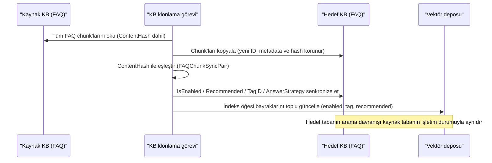

# FAQ özelliği

FAQ bilgi tabanı iade politikası, masraf iade süreci ve sık görülen arıza çözümleri gibi standart soru-cevapları yönetmek için kullanılır. Her kayıt bir standart soru, benzer sorular, karşı örnek sorular ve yanıtlardan oluşur; arama sırasında soru eşleştirilir ve isabet stratejisine göre yanıt döndürülür.

FAQ türünde bir bilgi tabanı oluşturduktan sonra soru-cevapları Excel veya CSV ile toplu olarak içe aktarabilir, ardından benzer soruları ve karşı örnek soruları ekleyebilirsiniz. FAQ tabanı belge tabanlarıyla birlikte agent aramasına sunulabilir; FAQ önceliği etkinse ve doğrudan yanıt eşiği karşılanıyorsa standart yanıt doğrudan döndürülebilir.

<Screenshot
  src="/screenshots/faq-management.png"
  caption="FAQ yönetimi: kayıt listesi, filtreleme ve toplu içe aktarma"
  hint="FAQ kayıt listesini (standart soru, benzer soru sayısı, etiket, durum) ve içe aktarma girişini/içe aktarma sonucu bildirimini gösterir." />

Kayıt yönetimi, içe aktarma ve arama yapılandırması aşağıda anlatılmıştır; tekilleştirme ve senkronizasyon mekanizmaları başvuru bölümündedir.

## Soru-cevap oluşturma ve bakımı

FAQ bilgi tabanını oluşturduktan sonra her kayıt için standart soruyu ve yanıtı girin. Benzer sorular farklı ifadeleri kapsamak, karşı örnek sorular ise kolayca yanlış eşleşen soruları dışlamak için kullanılır. Bir kaydın birden çok yanıtı olabilir; hepsinin mi yoksa rastgele birinin mi döndürüleceği seçilebilir.

Kayıtlar kategoriye göre yönetilebilir, geçici olarak kullanılmayan soru-cevaplar tek tek devre dışı bırakılabilir ya da kaydın önerilerde görünmesi engellenebilir. FAQ kategorileri tek etiketlidir ve belge bilgi tabanlarının çoklu etiket mekanizmasından ayrı yönetilir.

## İçe ve dışa aktarma

Şablonu kullanarak standart soruları, benzer soruları, karşı örnek soruları ve yanıtları hazırlayın; çok değerli alanlar `##` ile ayrılır. İçe aktarırken ekleme veya değiştirme seçilir: ekleme, içerik hash'ine göre eşleştirip yinelenen kayıtları birleştirir; değiştirme eski kayıtları silip yalnızca bu partide içe aktarılanları bırakır. Önce verileri kontrol etmek gerekiyorsa API'deki `dry_run` ile yalnızca doğrulama çalıştırılabilir.

İçe aktarma sonucu başarılı, başarısız, kısmen başarısız ve atlanan kayıtları ayırır ve başarısızlık nedenlerini verir. CSV ve JSON dışa aktarma yedekleme, düzenleme ve yeniden içe aktarma için kullanılabilir.

## İsabet sonuçlarını kontrol etme

FAQ araması vektör, anahtar kelime ve etiket önceliğini birlikte değerlendirir; karşı örnek soruyla tam eşleşen kayıtlar dışlanır. Sonuçlar eşleşen soruyu, puanı ve isabet türünü içerir; bunlar benzer soruları, karşı örnek soruları ve eşikleri ayarlamak için kullanılabilir.

## İçe aktarma ve arama başvurusu

### Toplu içe aktarma {#toplu-ice-aktarma}

`internal/application/service/knowledge_faq_import.go`. Giriş noktası `POST /knowledge-bases/:id/faq/entries`:

```go
type FAQBatchUpsertPayload struct {
    Entries     []FAQEntryPayload `json:"entries" binding:"required"` // EntriesURL ile nesne depolamadan da çekilebilir
    Mode        string            `json:"mode" binding:"oneof=append replace"`
    KnowledgeID string            `json:"knowledge_id"`
    TaskID      string            `json:"task_id"` // İsteğe bağlı, verilmezse otomatik üretilir; özel değerde yalnızca [A-Za-z0-9_-] kullanılabilir, ≤128 karakter
    DryRun      bool              `json:"dry_run"` // Yalnızca doğrular, veritabanına yazmaz
}
```

İçe aktarma alanları (CSV şablon sütunları, dışa aktarma biçimiyle simetriktir, çok değerli alanlar `##` ile ayrılır): standart soru (zorunlu), benzer sorular, karşı örnek sorular, yanıt (zorunlu), tümüyle yanıtla, devre dışı, öneri yasağı, kategori (varsayılan "Kategorisiz"). Şablondaki sütun başlıkları uygulamanın beklediği özgün adlarla kalır.



İlerleme nesnesi `FAQImportProgress` istatistik alanları: `success_count` / `failed_count` / `partial_failed_count` (benzer soru veya karşı örnek çıkarıldı ama kayıt yine de içe aktarıldı) / `skipped_count` (yineleme nedeniyle atlandı) / `merged_count` / `added_count`, `failed_entries[]` (başarısızlık nedeni ve özgün içerikle) ve `failed_entries_url`, `import_mode`, `processing_time`; görev durumu `pending → processing → completed / failed`.

Dışa aktarma iki biçimi destekler: CSV (sütunlar: kategori, soru, benzer sorular, karşı örnek sorular, bot yanıtı, tümüyle yanıtla, devre dışı, öneri yasağı; Excel'de UTF-8 uyumluluğu için BOM içerir) ve JSON (`FAQExportEntry`; içe aktarma payload'ıyla uyumludur ve "dışa aktar → düzenle → yeniden içe aktar" döngüsünü destekler).

### Arama isabet stratejisi {#arama-isabet-stratejisi}

`internal/handler/faq.go` içindeki `SearchFAQ` + `internal/application/service/knowledgebase_search_faq.go`:

```go
type FAQSearchRequest struct {
    QueryText            string  `binding:"required"`
    VectorThreshold      float64 // Vektör benzerlik eşiği (varsayılan 0.7)
    MatchCount           int     // Döndürülecek sayı (varsayılan 10, üst sınır 50)
    FirstPriorityTagIDs  []int64 // Birinci öncelikli etiketler (sonuçlarda öne alınır)
    SecondPriorityTagIDs []int64 // İkinci öncelikli etiketler
    OnlyRecommended      bool    // Yalnızca önerilebilir kayıtları döndür
}
```

İsabet akışı:

1. **Hibrit geri getirme**: Sorgu metni normalleştirildikten sonra vektör araması + BM25 anahtar kelime araması yapılır, sonuçlar birleştirilip tekilleştirilir;
2. **İki düzeyli etiket önceliği**: `FirstPriorityTagIDs` ile eşleşen kayıtlar en öne, ardından `SecondPriorityTagIDs` ile eşleşenler gelir;
3. **Karşı örnek filtresi** (`filterByNegativeQuestions`): Sorgu metni bir kaydın herhangi bir karşı örnek sorusuyla tam eşleşirse (küçük harfe çevrilerek karşılaştırılır) → kayıt sonuçlardan çıkarılır. Tipik senaryo: kullanıcı "X desteklenmiyor mu" diye sorduğunda "X desteklenir" kaydının dönmesini önlemek;
4. **Yinelemeli geri getirme** (`applyFAQPostProcessing`): Filtrelemeden sonra benzersiz kayıt sayısı `match_count` değerinin altında kalır ve bir vektör sonuç listesi doluysa `iterativeRetrieveWithDeduplication` tetiklenir. En fazla 5 yineleme yapılır, her seferinde TopK iki katına çıkar (ilk turun derinliğinin 2 katından başlar, üst sınır 500'dür, sınıra ulaşınca durur). Her tur ilk turla aynı şekilde birleştirilip puanlanır, karşı örnek filtresi önbelleği kullanılır ve hiçbir liste dolu değilse erken sonlandırılır;
5. Sonuçlar `score`, `match_type` ve `matched_question` (asıl isabet eden standart soru mu, hangi benzer soru mu) içerir; yanıtlar `answer_strategy` (all / random) değerine göre döndürülür.

Arama kapsamında FAQ tabanı yoksa bu son işlem atlanır ve normal hibrit arama etkilenmez. Kapsamda bir FAQ tabanı olduğu sürece (ana KB belge tabanı olsa ya da FAQ tabanı organizasyon paylaşımından gelse bile) karşı örnek filtresi uygulanır; yinelemeli geri getirme yalnızca ana KB bir FAQ tabanıysa tetiklenir. Agent arama zinciri FAQ tabanlarında da aynı son işlem yolundan geçer.

## Kayıt ve arayüz başvurusu

### Veri modeli {#veri-modeli}

#### Depolama biçimi: FAQ kaydı = bir Chunk {#depolama-bicimi-faq-kaydi-bir-chunk}

Her FAQ kaydı bir `Chunk` kaydına karşılık gelir (`chunk_type = "faq"`) ve bilgi tabanındaki `faq` türündeki `Knowledge`'a aittir (bu Knowledge ilk kayıt oluşturulurken otomatik yaratılır). Kaydın yapılandırılmış içeriği `Chunk.Metadata` (JSON) içinde saklanır:

```go
// internal/types/faq.go
type FAQChunkMetadata struct {
    StandardQuestion  string         `json:"standard_question"`
    SimilarQuestions  []string       `json:"similar_questions,omitempty"`
    NegativeQuestions []string       `json:"negative_questions,omitempty"` // Karşı örnek sorular: eşleşirse filtrelenir
    Answers           []string       `json:"answers,omitempty"`
    AnswerStrategy    AnswerStrategy `json:"answer_strategy,omitempty"`    // all | random
    Version           int            `json:"version,omitempty"`            // Her güncellemede artar
    Source            string         `json:"source,omitempty"`
}

const (
    AnswerStrategyAll    AnswerStrategy = "all"    // Tüm yanıtları döndür
    AnswerStrategyRandom AnswerStrategy = "random" // Rastgele birini döndür
)
```

Chunk üzerinde yeniden kullanılan ortak alanlar: `SeqID` (otomatik artan tam sayı, dış API'deki kayıt ID'si), `TagID` (kategori etiketi; varsayılan etiket adı sabiti `UntaggedTagName = "未分类"`, yani "Sınıflandırılmamış"), `IsEnabled` (devre dışı bırakma anahtarı), `Flags` (bit0 `ChunkFlagRecommended`: önerilebilir mi), `ContentHash` (tekilleştirme hash'i; bkz. [Normalleştirme ve içerik hash'i (tekilleştirmenin çekirdeği)](#normallestirme-ve-icerik-hash-i-tekillestirmenin-cekirdegi)).

#### API izdüşümü: FAQEntry {#api-izdusumu-faqentry}

```go
type FAQEntry struct {
    ID                int64          `json:"id"`        // chunk.SeqID
    ChunkID           string         `json:"chunk_id"`
    KnowledgeID       string         `json:"knowledge_id"`
    KnowledgeBaseID   string         `json:"knowledge_base_id"`
    TagID             int64          `json:"tag_id"`
    TagName           string         `json:"tag_name"`
    IsEnabled         bool           `json:"is_enabled"`
    IsRecommended     bool           `json:"is_recommended"`
    StandardQuestion  string         `json:"standard_question"`
    SimilarQuestions  []string       `json:"similar_questions"`
    NegativeQuestions []string       `json:"negative_questions"`
    Answers           []string       `json:"answers"`
    AnswerStrategy    AnswerStrategy `json:"answer_strategy"`
    IndexMode         FAQIndexMode   `json:"index_mode"`
    Score             float64        `json:"score,omitempty"`            // Arama puanı
    MatchType         MatchType      `json:"match_type,omitempty"`
    MatchedQuestion   string         `json:"matched_question,omitempty"` // Asıl eşleşen soru metni
}
```

#### KB düzeyinde FAQ yapılandırması (FAQConfig) {#kb-duzeyinde-faq-yapilandirmasi-faqconfig}

| Yapılandırma | Değerler | Varsayılan | Açıklama |
| --- | --- | --- | --- |
| `index_mode` | `question_only` / `question_answer` | `question_answer` | İndekslenen içeriğin yanıtı da içerip içermediği |
| `question_index_mode` | `combined` / `separate` | `combined` | Standart soru + benzer sorular tek indeks öğesinde birleştirilir ya da her soru ayrı indeks öğesi olur |

`separate` modunda her benzer soru için ayrı indeks öğesi üretilir, `SourceID = fmt.Sprintf("%s-%s", chunk.ID, hashQuestion(similarQ))`; bu, benzer soru düzeyinde hassas ekleme ve silmeyi destekler.

### API uç noktaları {#api-uc-noktalari}

`internal/handler/faq.go` (rotalar `internal/router/routes_knowledge.go` içinde kaydedilir; KB erişim denetimi bilgi tabanıyla aynıdır: okuma KBAccessRead, yazma KBAccessWrite üzerinden geçer; API Key için `ingest` / `retrieve` yeteneği gerekir):

| Yöntem | Yol | İşlev |
| --- | --- | --- |
| GET | `/knowledge-bases/:id/faq/entries` | Kayıt listesi (sayfalama / etiket / anahtar kelime / etkinlik durumu) |
| GET | `/knowledge-bases/:id/faq/entries/:entry_id` | Tek kayıt ayrıntısı |
| POST | `/knowledge-bases/:id/faq/entry` | Tek kaydı eşzamanlı oluşturma |
| PUT | `/knowledge-bases/:id/faq/entries/:entry_id` | Tek kaydı güncelleme (artımlı indeksleme) |
| POST | `/knowledge-bases/:id/faq/entries` | Toplu içe aktarma / güncelleme (eşzamansız, append/replace) |
| POST | `/knowledge-bases/:id/faq/entries/:entry_id/similar-questions` | Benzer soru ekleme |
| PUT | `/knowledge-bases/:id/faq/entries/fields` | Alanları toplu güncelleme (etkinlik / öneri / strateji) |
| PUT | `/knowledge-bases/:id/faq/entries/tags` | Etiketleri toplu güncelleme |
| DELETE | `/knowledge-bases/:id/faq/entries` | Toplu silme |
| POST | `/knowledge-bases/:id/faq/search` | FAQ araması (hibrit arama) |
| GET | `/knowledge-bases/:id/faq/entries/export` | Dışa aktarma (CSV / JSON) |
| GET | `/faq/import/progress/:task_id` | İçe aktarma görevi ilerlemesi |
| PUT | `/knowledge-bases/:id/faq/import/last-result/display` | İçe aktarma sonuç panelinin görünürlüğü (open/close) |

Liste sorgu parametreleri: `page` / `page_size`, `tag_id` (etiket seq_id'si, eski tek etiket sürümüyle uyumlu) veya `tag_ids` (etiket UUID'leri, virgülle ayrılır, OR anlamında), `keyword` + `search_field` (`standard_question` / `similar_questions` / `answers`; verilmezse hepsinde arar), `sort_order` (`asc`; varsayılan güncelleme zamanına göre azalan), `is_enabled` (`true` / `false` ile etkinlik durumuna göre filtreler, verilmezse hepsini döndürür).

**Yazma doğrulaması** (`sanitizeFAQEntryPayload` + `checkFAQQuestionDuplicate`): standart soru zorunludur; en az bir yanıt gerekir; `answer_strategy` yalnızca `all` / `random` olabilir (varsayılan `all`); benzer sorular / karşı örnekler / yanıtlar boşluklardan arındırılıp tekilleştirilir. Ayrıca dört düzeyli yineleme kontrolü yapılır: benzer soru ile standart soru, benzer soruların kendi aralarında, karşı örnek ile standart ve benzer sorular, veritabanında kayıtlar arası çakışma (ayrıntılı çakışma bilgisi döndürülür).

### Normalleştirme ve içerik hash'i (tekilleştirmenin çekirdeği) {#normallestirme-ve-icerik-hash-i-tekillestirmenin-cekirdegi}

FAQ "**özgün metni sakla, normalleştirilmiş metinle eşitlik kontrolü yap**" ilkesine dayanan katmanlı bir tasarım kullanır:

```go
// Yazma: DB özgün veriyi tutar, ContentHash normalleştirilmiş kopyaya dayanır
func (c *Chunk) SetFAQMetadata(meta *FAQChunkMetadata) error {
    meta.Sanitize()                          // Yalnızca temel temizlik
    c.Metadata, _ = json.Marshal(meta)
    normalized := meta.Normalize()           // Normalleştirilmiş kopya
    c.ContentHash = CalculateFAQContentHash(normalized)
    return nil
}
```

`NormalizeQuestion` işlem zinciri (sıra önemlidir): baştaki ve sondaki boşlukları sil → URL'leri kaldır → küçük harfe çevir → baştaki ve sondaki noktalamayı sil (tam genişlikli Çince `？。，；、：！` ve yarım genişlikli `?.,;!:'"` vb.) → **geleneksel Çinceyi basitleştirilmiş Çinceye çevir** → **tam genişlikli karakterleri yarım genişliğe çevir** → akıllı boşluk (Çince karakterler arasındaki boşluklar silinir, İngilizce / rakamlar arasında korunur).

`CalculateFAQContentHash` = SHA256(normalleştirilmiş standart soru + sıralanmış benzer sorular + sıralanmış karşı örnekler + sıralanmış yanıtlar). `internal/types/faq_test.go` hash'in temel değişmezlerini sabitler: büyük/küçük harf ve noktalamaya duyarsız, geleneksel/basitleştirilmiş Çinceye duyarsız, tam/yarım genişliğe duyarsız, dizi sırasına duyarsız, yazma ve okuma yollarında tutarlı. Bu hash, içe aktarmada tekilleştirme ve klon senkronizasyonunda kayıt eşleştirme için kullanılır.

### Normal bilgiden (Document) farkları {#normal-bilgiden-document-farklari}

| Boyut | FAQ | Document |
| --- | --- | --- |
| KB türü | `faq` | `document` |
| Knowledge.Type | `faq` (genellikle taban başına tek birleşik Knowledge) | Dosya / `manual` / URL |
| Chunk kaynağı | Kullanıcının doğrudan girdiği yapılandırılmış kayıtlar | Ayrıştırıcının otomatik parçalaması |
| Chunk.ChunkType | `faq` | `text` / `image_ocr` / `summary` vb. |
| Metadata | `FAQChunkMetadata` (soru / yanıt / karşı örnek / strateji) | Belge meta verisi (AI tarafından üretilen sorular vb.) |
| Chunk.Content | `buildFAQChunkContent` ile oluşturulur: `"Q: standart soru\nSimilar Questions:\n- ..."`; `question_answer` modunda `Answers` eklenir; **karşı örnek sorular asla Content'e yazılmaz (indekslenmez)** | Özgün metin parçası |
| ContentHash | Normalleştirilmiş tekilleştirme hash'i (temel mekanizma) | Genellikle kullanılmaz |
| İndeks ayrıntı düzeyi | `question_index_mode` değerine göre bir veya birden çok indeks öğesi | Chunk başına bir indeks öğesi (üst-alt parçalama ayrıca sayılır) |
| İşlem hattı | Eşzamanlı oluşturma / eşzamansız toplu içe aktarma, indeks hemen etkin olur | Eşzamansız DocReader ayrıştırma hattı |
| Arama sonrası işlem | Karşı örnek filtresi + yinelemeli geri getirme (bkz. [Arama isabet stratejisi](#arama-isabet-stratejisi)) | Olağan birleştirme ve yeniden sıralama |
| Durum anahtarları | `is_enabled` + `is_recommended` (Flags) + `answer_strategy` | `enable_status` |

Kayıt güncellemeleri **artımlı indeksleme** (`incrementalIndexFAQEntry`) kullanır: yalnızca değişen kısımlar için yeniden embedding yapılır. Standart soru değişirse yeniden indekslenir; benzer sorular tek tek diff'lenip eklenir veya silinir; yanıt değişikliği yalnızca `question_answer` modunda yeniden indekslemeyi tetikler; `SourceID` yardımıyla geçersiz indeks öğeleri tam olarak silinir.

### Klonlama / paylaşım senkronizasyon mekanizması {#klonlama-paylasim-senkronizasyon-mekanizmasi}

`internal/application/service/faq_clone_sync.go`. Tetikleme senaryoları: **bilgi tabanı klonlama (copy)** ve **paylaşılan bilgi tabanı içerik senkronizasyonu**. Klonlamayla oluşan hedef tabandaki FAQ chunk'ları yeni kayıtlardır; işletim durumlarının (etkin/devre dışı / öneri / etiket / yanıt stratejisi) kaynak tabanla hizalanması gerekir:

- **Eşleştirme**: Kaynak / hedef kayıtlar `ContentHash` ile eşleştirilir ve `FAQChunkSyncPair{SrcChunkID, DstChunkID}` elde edilir (normalleştirilmiş hash, geleneksel/basitleştirilmiş Çince, tam/yarım genişlik ve sıra farklarının eşleştirmeyi bozmamasını sağlar; `internal/types/faq_sync_test.go` bunu doğrular);
- **Senkronize edilen içerik**: `IsEnabled` etkinlik durumu, `Flags` içindeki `ChunkFlagRecommended` öneri biti, `TagID` etiket aidiyeti, `AnswerStrategy` yanıt stratejisi;
- **İndeks tarafında etki**: DB güncellendikten sonra vektör deposundaki ilgili indeks öğelerinin `enabled` / `tag` / `recommended` bayrakları toplu olarak yenilenir ve arama filtreleri hemen etkinleşir (fark hesaplaması için bkz. `internal/application/repository/chunk_faq_diff_test.go`).



## Uygulama başvurusu

Aşağıdaki yolların tümü depo kök dizinine görelidir:

| Katman | Dosya |
| --- | --- |
| FAQ türleri ve normalleştirme / hash | `internal/types/faq.go` (ve `faq_test.go`, `faq_sync_test.go`) |
| FAQ Handler | `internal/handler/faq.go` |
| Kayıt CRUD / dışa aktarma hizmeti | `internal/application/service/knowledge_faq.go` |
| Eşzamansız içe aktarma hizmeti | `internal/application/service/knowledge_faq_import.go` |
| Klonlama / senkronizasyon | `internal/application/service/faq_clone_sync.go` |
| FAQ arama sonrası işlem | `internal/application/service/knowledgebase_search_faq.go` |
| KB düzeyinde FAQ yapılandırması | `internal/types/knowledgebase.go` (`FAQConfig`) |
