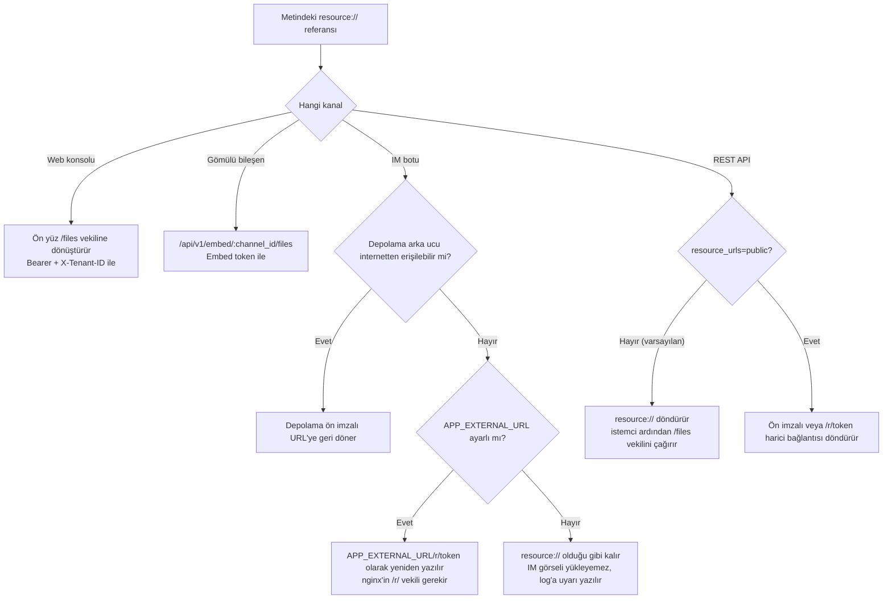

# Görsellerin ve dosyaların dışarıdan erişimi

Görseller ve dosyalar farklı kanallarda farklı yollarla erişilir. Web konsolu ve gömülü bileşen kimlik bilgisiyle vekile erişebilir; IM platformları herkese açık yüklenebilen süreli bağlantılara ihtiyaç duyar; API istemcileri amaca göre dahili referans veya harici bağlantı seçebilir.

Entegrasyon sırasında referans biçimini, çağıranın yetkisini ve adresin erişilebilirliğini birlikte doğrulayın. Görsel görüntülenmiyorsa sayfa sonundaki sorun giderme tablosunu kullanın.

## Dosya referansları ve erişim yolları {#dosya-referanslari-ve-erisim-yollari}

Bilgi tabanı görselleri ve ekleri dosya depolamada tutulur. Metin gövdesi kararlı dahili referanslar kullanır; yanıt veya görüntüleme sırasında kanala göre erişim adresine dönüştürülür:

| Biçim | Örnek adres | Erişim koşulu | Geçerlilik |
| --- | --- | --- | --- |
| **Dahili referans** | `resource://<handle>` | Sunucu tarafında çözülen kararlı tanıtıcı, doğrudan URL olarak erişilemez | — |
| **Yetkili vekil** | `/files`, `/api/v1/knowledge-bases/:id/files`, `/api/v1/embed/:channel_id/files`, mesaj düzeyinde `/api/v1/sessions/:id/messages/:message_id/files` | İlgili kimlik bilgisini taşıyan istemci (oturum / KB erişim yetkisi / Embed token) | Kimlik bilgisiyle birlikte |
| **Yetenek kısa bağlantısı** | `/r/<token>` | Bağlantıya sahip herkes (**anonim okunabilir**) | Rethra'nın verdiği grant, 2 saat |
| **Depolama ön imzalı** | Depolama arka ucunun doğrudan verdiği http(s) bağlantısı | Bağlantıya sahip herkes (**anonim okunabilir**) | Depolamaya bağlı, MinIO varsayılanı 24 saat |

Yetenek kısa bağlantıları ve depolama ön imzalı bağlantıları, geçerlilik süresi boyunca sahibinin dosyayı anonim okumasına izin verir. Bu bağlantıları paylaşırken veya kaydederken dosyanın kendi erişim kapsamına göre davranın. Kuruluş paylaşımını geri almak veya kuruluştan ayrılmak, önceden verilmiş bağlantıları erken geçersiz kılmaz; süreleri dolana kadar kullanılabilirler (kısa bağlantı 2 saat, depolama ön imzalı en fazla 24 saat).

::: tip Varsayılan erişim yolu
Sistem varsayılan olarak dahili referans döndürür; kimlik bilgili istemci bunu yetkili vekil üzerinden okur. Harici bağlantılar için internetten erişilebilir bir depolama uç noktası ya da `APP_EXTERNAL_URL` yapılandırılıp Rethra'nın erişim bağlantısı vermesi gerekir. Varsayılan MinIO adresi `minio:9000` yalnızca konteyner ağı içinden erişilebilir.
:::

## Kanala göre dosya erişimi {#kanala-gore-dosya-erisimi}

### Web konsolu

Web ön yüzü `resource://` ve `provider://` referanslarını yetkili vekil adreslerine dönüştürür. Normal kaynaklar `/files` kullanır ve istek Bearer token ile `X-Tenant-ID` taşır; alanlar arası paylaşılan bilgi tabanları `/api/v1/knowledge-bases/:id/files` kullanır, kaynak alanın dosyalarını bilgi tabanı erişim yetkisine göre okur ve ek yapılandırma gerektirmez.

Paylaşılan Agent veya kuruluşça paylaşılan bilgi tabanı yanıtlarındaki görseller öncelikle `/api/v1/sessions/:id/messages/:message_id/files?file_path=...` üzerinden gider. Sunucu, çağıranın bu mesajı okuyabildiğini ve istenen kaynağın gerçekten mesajda referans verildiğini doğrular, ardından kaynağın ait olduğu bilgi tabanı veya paylaşılan Agent yetkisini yeniden denetler. Paylaşım geri alındıktan sonra geçmiş mesajlar kaynak erişimi vermeye devam etmez. Normal bilgi tabanı gezinmesi KB düzeyindeki vekili kullanmaya devam eder; ikisi kendi bağlamlarını kullanır.

### IM botları {#im-botlari}

IM platformları Rethra kimlik bilgisini taşıyamaz, herkese açık erişilebilir bir HTTP(S) URL gerekir. Mesaj gönderilmeden önce sistem, depolama ve dağıtım yapılandırmasına göre harici bağlantı üretir:

1. **Depolama arka ucunun kendisi internetten erişilebilir** — nesne depolama için genel endpoint kullanın veya `MINIO_ENDPOINT` değerini genel bir host yapın. Bu durumda depolama ön imzalı URL'ye geri dönülür, ek yapılandırma gerekmez;
2. **`APP_EXTERNAL_URL` yapılandırın** — referans `<APP_EXTERNAL_URL>/r/<token>` olarak yeniden yazılır, istek nginx'teki `location ^~ /r/` ile app'e ters vekil edilir. Resmi ön yüz imajında bu location hazır gelir; kendi ters vekilinizi kuruyorsanız eklemeniz gerekir, aksi halde istek SPA fallback'e düşer ve boş sayfa döner.

Varsayılan dahili ağdaki MinIO dağıtımı ve `local` depolama için `APP_EXTERNAL_URL` yapılandırılmalıdır. Harici bağlantı koşulları sağlanmazsa sistem orijinal referansı korur ve uyarı kaydeder; IM platformu görseli doğrudan gösteremez. IM kanalı etkinken `APP_EXTERNAL_URL` boşsa başlangıçta da uyarı verilir.

### Gömülü bileşen

Gömülü bileşen kanal dosya vekilini (`/api/v1/embed/:channel_id/files`) kullanır. Embed token kanalın ait olduğu alanı belirler, sunucu kaynak yolunun sahipliğini denetler. Gömülü kanal her zaman dahili referans döndürür; `RESOURCE_URL_MODE=public` ve `?resource_urls=public` bu davranışı değiştirmez, böylece okumalar kanal yetkilendirmesinden geçer.

### REST API ve SDK

API varsayılan olarak `resource://` döndürür, istemci dosyayı yetkili vekil üzerinden alır. Harici bağlantıyı doğrudan göstermek gerekiyorsa şunlar ayarlanabilir:

- Tek istek: `?resource_urls=public`
- Tüm dağıtım: `RESOURCE_URL_MODE=public`

Tek istek parametresi ortam değişkeninden önceliklidir; bu yüzden dağıtım varsayılanı `public` yapıldıktan sonra bile `?resource_urls=handle` ile tek tek geri dönülebilir. Bu parametreyi destekleyen uç noktalar, kapsam ve güvenlik sınırları için [API genel bakışı](../04-api/01-api-overview.md) içindeki "Dosya referans biçimleri" bölümüne bakın.

Bilgi tabanı kapsamıyla sınırlı API Key ile `public` kullanmak 403 döndürür; bu tür anahtarlar genel `/files` vekiline de erişemez. Harici bağlantı koşulları yoksa yanıt `resource://` olarak kalır, uygun yetkiye sahip istemciler yetkili vekili kullanabilir.

## Erişim sorunlarını giderme {#erisim-sorunlarini-giderme}

| Belirti | Olası neden | Çözüm |
| --- | --- | --- |
| IM'de görsel görünmüyor | `APP_EXTERNAL_URL` ayarlı değil ve depolama internetten erişilemiyor | `APP_EXTERNAL_URL` ayarlayın, nginx'in `/r/` yolunu vekil ettiğini doğrulayın; app log'unda `rewriteStorageURLs no-op` WARN kaydına bakın |
| IM görsel bağlantısı açılıyor ama boş sayfa dönüyor | nginx'te `location ^~ /r/` eksik, istek SPA fallback'e düşüyor | Bu location'ı ekleyin (resmi ön yüz imajında hazır), bkz. [Web ön yüzü](../05-clients/01-frontend.md) |
| `APP_EXTERNAL_URL` dahili ağ adresine veya `localhost` değerine ayarlı | IM platformu internet tarafında, erişemiyor | IM platformunun erişebileceği bir adresle değiştirin; yerel geliştirmede ngrok / cloudflared / frp kullanın |
| API'nin döndürdüğü görsel adresi `resource://` | Varsayılan zaten dahili referanstır | `?resource_urls=public` ekleyin veya `/files` vekilini çağırın |
| `resource_urls=public` eklendiği halde `resource://` dönüyor | Dağıtımın harici bağlantı yeteneği yok (ör. `local` depolama ve `APP_EXTERNAL_URL` ayarlanmamış) | Harici bağlantı koşullarını sağlayın veya `/files` vekilini kullanın |
| `resource_urls=public` eklenince 403 dönüyor | Bilgi tabanıyla sınırlı API Key kullanılıyor | `handle` moduna geçin veya yetkilendirilmiş full-access Key kullanın |
| Gömülü bileşende görsel görünmüyor ama web tarafında normal | Bileşen kanal vekilini kullanır, ana sitenin kimlik bilgisinden farklıdır | Bileşen sayfasının geçerli bir Embed token taşıdığını doğrulayın; `resource_urls=public` gömülü kanalda etkisizdir |
| Paylaşılan yanıttaki görsel 403/404 | Mesaj bağlamı eksik, kaynak bağlanmamış veya paylaşım geri alınmış | Mesaj düzeyindeki vekili kullanın ve mevcut paylaşım yetkisini kontrol edin; sahip kiracının /files adresini elle oluşturmayın |
| Yükseltme veya anahtar değişikliğinden sonra verilmiş bağlantılar geçersiz | İmza anahtarı (`SYSTEM_SIGNING_KEY` ya da geri dönüş olarak kullanılan `SYSTEM_AES_KEY`) değişince eski imzalar doğrulanamaz | Bağlantıyı yeniden alın; çok kopyalı dağıtımlarda tüm örneklerin aynı anahtarı kullandığını doğrulayın |
| Harici bağlantı bir süre sonra geçersiz oluyor | Harici bağlantılar sürelidir (grant 2 saat / MinIO ön imzalı 24 saat) | Harici bağlantının kendisini önbelleğe almayın, gerektiğinde yeniden alın; aynı dosya geçerlilik süresi içinde aynı bağlantıyı yeniden kullanır |
| Web tarafında görsel 404, log'da kiracı uyuşmazlığı | Kiracılar arası paylaşılan bilgi tabanının görseli sahip kiracıda tutulur | Bu senaryo `/api/v1/knowledge-bases/:id/files` üzerinden gitmelidir; ön yüzün KB düzeyindeki vekil adresini aldığını doğrulayın |

## Yapılandırma başvurusu {#yapilandirma-basvurusu}

| Yapılandırma | İşlev |
| --- | --- |
| `APP_EXTERNAL_URL` | IM kanalı görsel harici bağlantıları için dışarıdan erişilebilir adres; `resource://` referansının `<APP_EXTERNAL_URL>/r/<token>` olarak yeniden yazılmasının ön koşulu |
| `RESOURCE_URL_MODE` | API yanıtlarındaki dosya referanslarının varsayılan biçimi (`handle` / `public`) |
| `MINIO_ENDPOINT` vb. depolama endpoint'leri | Genel adres olarak ayarlanırsa harici bağlantı depolama ön imzasıyla sağlanabilir, `APP_EXTERNAL_URL` gerekmez |
| `SYSTEM_SIGNING_KEY` (ayarlanmamışsa `SYSTEM_AES_KEY` kullanılır) | İmza anahtarı. `/api/v1/files/presigned` ön imzalı bağlantıları buna dayanır; ayrıca geçerlilik süresi içinde `/r/<token>` grant'lerini yeniden kullanmak, doğrudan bağlantı URL'lerini kararlı tutmak ve okuma uç noktalarının yazma yükünü azaltmak için kullanılır. Ayarlanmamışsa, 16 karakterden kısaysa veya örnek değerse ön imzalı bağlantı verilemez; değiştirildiğinde önceden verilmiş bağlantılar geçersiz olur |

## İlgili belgeler {#ilgili-belgeler}

- [IM entegrasyonu](12-im-integration.md): yeniden yazma mantığı ve başlangıç uyarıları
- [Web sayfasına gömme](13-embed-channel.md): kanal yetkilendirmesi ve anonim oturumlar
- [API genel bakışı](../04-api/01-api-overview.md): `resource_urls` parametresinin tam anlamı
- [Yapılandırma ayrıntıları](../01-getting-started/04-configuration.md): yukarıdaki ortam değişkenleri
- [Web ön yüzü](../05-clients/01-frontend.md): nginx'in `/files` ve `/r/` vekilleri

## Uygulama başvurusu

- `frontend/src/utils/protectedFileAccess.ts`: web dosya referansları ve vekil yolları.
- IM mesajları gönderilmeden önce `rewriteStorageURLs()` ile harici bağlantıya dönüştürülür.
