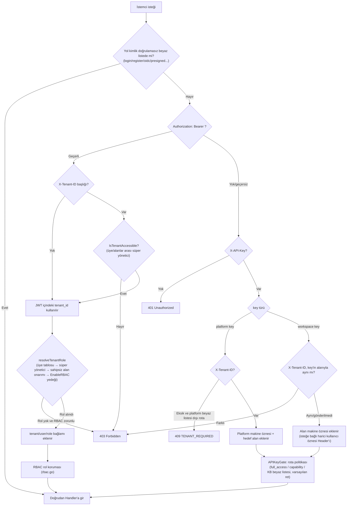

# API genel bakış

Rethra HTTP API, `/api/v1` önekini kullanır ve JWT, API Key ve Embed token kimlik doğrulamasını destekler; yerleşik MCP Server uç noktası ise ayrı olarak uç nokta belirteci kimlik doğrulamasını kullanır. Her kaynak arayüzünü çağırmadan önce istemci türüne göre kimlik bilgilerini seçmek ve birleşik yanıt, hata işleme, sayfalama ve akış olayları kurallarına uymak gerekir.

## Base URL ve sürüm öneki

- Tüm iş API'leri `/api/v1` öneki altında bağlanır (`router.go` içindeki `r.Group("/api/v1")`).
- Sağlık denetimi: `GET /health` (kimlik doğrulaması gerekmez), `{"status":"ok"}` döndürür.
- Swagger UI: backend'deki `/swagger/index.html`; yalnızca `release` dışı modda (`GIN_MODE != release`) kaydedilir. Docker Compose varsayılan olarak `release` kullanır; etkinleştirme adımları, backend portu ve boş sayfa sorun giderme için bkz. [Geliştirme kılavuzu](../06-development/01-dev-guide.md#gin-mode-ve-swagger).
- Kimlik doğrulama dışındaki özel yollar: `GET|HEAD /r/:token` (kısa süreli kaynak yetkilendirme URL'si), `GET /files` (kimlik doğrulama sonrası dosya vekili), `GET|HEAD /api/v1/files/presigned` (HMAC imzalı URL, kimlik doğrulama gerektirmez), `GET /api/v1/files/presigned-preview` (Admin tanılama).

```
BASE=http://localhost:8080
```

## Kimlik doğrulama yöntemleri

Kimlik doğrulama, `internal/middleware/auth.go` içindeki `Auth` ara yazılımı tarafından merkezi olarak işlenir ve aşağıdaki sırayla denenir:

### JWT Bearer (Web kullanıcısı) {#jwt-bearer-web-kullanicisi}

```
Authorization: Bearer <access_token>
```

- `POST /api/v1/auth/login` (veya register / OIDC) aracılığıyla `token` ve `refresh_token` alınır; `POST /api/v1/auth/refresh` yeni token verir.
- İsteğe bağlı `X-Tenant-ID: <tenant_id>` istek başlığı: JWT'nin işaret ettiği alanın dışında hedef alanı değiştirir (bu alanın etkin üyesi olunmalı veya `CanAccessAllTenants` alanlar arası süper yönetici niteliğine sahip olunmalıdır). Hatalı biçimlendirilmiş veya `0` değeri doğrudan 400 döndürür.
- JWT herhangi bir alan çözümlemezse ve uç nokta “kullanılabilir alan yok” izin listesindeki bir uç nokta değilse (ör. `/auth/me`, `/me/invitations`), 409 `{"code":"TENANT_REQUIRED"}` döndürülür.

### API Key (makine öznesi) {#api-key-makine-oznesi}

```
X-API-Key: <api_key>
```

- Alan düzeyi (workspace) key: `POST /api/v1/tenants/:id/api-keys` ile oluşturulur ve tek bir alana bağlanır; başka bir alanı işaret etmek için `X-Tenant-ID` gönderilirse 403 alınır.
- Platform düzeyi (platform) key: `POST /api/v1/system/admin/api-keys` ile oluşturulur; hedef alanı seçmek için `X-Tenant-ID` zorunludur (`/system/admin/*`, `/tenants/all|search`, `POST /tenants` hariç), aksi halde 409 `TENANT_REQUIRED` döndürülür.
- Yetkilendirme modeli (`internal/middleware/api_key_gate.go`, varsayılan olarak reddeder): Her `/api/v1` rotası API key politikasını açıkça bildirmelidir; bildirilmemiş rotalar tüm key türleri için 403 döndürür.
  - `full_access` key: alan içinde tam yetki (Owner rolünün makine biçimine eşdeğer).
  - Kısıtlı (scoped) key: capability temelinde izin verilir ve `knowledge_base_ids` beyaz listesiyle sınırlıdır. Capability sabitleri için `internal/types/tenant_api_key.go` dosyasına bakın: `retrieve`, `ingest`, `chat`, `read_agents`, `manage_kbs`, `manage_agents`, `message_history`, `manage_models`, `manage_mcp_services`, `manage_datasources`, `manage_channels`, `manage_vector_stores`, `manage_storage_backends`, `manage_web_search`, `run_evaluations`, `manage_members`, `manage_spaces`, `manage_tenant_settings`; platform capability'leri: `system_tenants_read/manage`, `system_settings_read/manage`, `system_runtime_read/manage`, `system_audit_read`.
- Harici kullanıcı öznesi (isteğe bağlı, alanın `api-principal-config` yapılandırmasına göre):
  - `direct` modu: `X-External-User-ID: <harici_kullanıcı_ID>` (≤128 karakter).
  - `signed_token` modu: `X-External-User-Token: <HS256 JWT>`; `aud=rethra`, `exp` (geçerlilik süresi ≤24h), hedef alanla aynı `tenant_id` claim'i ve harici kullanıcı ID'si olarak `sub` gerektirir.

### Embed publish token (anonim gömme ucu) {#embed-publish-token-anonim-gomme-ucu}

`/api/v1/embed/:channel_id/*` herkese açık rotaları, ayrı `EmbedAuth` ara yazılımını (`internal/middleware/embed_auth.go`) kullanır:

```
Authorization: Embed <publish_token veya session_token>
```

- `POST /embed/:channel_id/exchange`, publish token'ı kısa süreli session token ile değiştirir; oturum düzeyindeki işlemler ayrıca `X-Embed-Session: <sig>` gerektirir (oturum oluşturulurken döndürülen imzalı tanıtıcı).
- IM geri çağırım rotası (`/api/v1/im/callback/:channel_id`), genel kimlik doğrulama ara yazılımından önce kaydedilir ve her IM platformunun kendi imza doğrulamasını kullanır.

### MCP uç nokta belirteci (yerleşik MCP Server)

`/mcp/:endpoint_id` (`/api/v1` öneki olmadan), alanın dışarıya sunduğu MCP Streamable HTTP uç noktasıdır ve `internal/middleware/mcp_endpoint_auth.go` tarafından doğrulanır:

```
Authorization: Bearer <endpoint_token>
```

Belirteç, uç nokta oluşturulurken «Ayarlar → Entegrasyonları yayımla → MCP Server» bölümünde yalnızca bir kez gösterilir ve değiştirilebilir. İstekler, uç noktanın ait olduğu alanın makine öznesi olarak yürütülür; izinler, uç noktada seçilen araçlar ve bilgi tabanları kapsamıyla sınırlıdır. Uç nokta yönetim arayüzü `/api/v1/mcp-endpoints`'tir (Viewer+ okuma, Admin+ değişiklik, API Key için `manage_channels` gerekir); kullanım için [MCP Entegrasyonu](../03-features/08-mcp.md) bölümüne bakın.

### Kimlik doğrulama akış şeması



## Roller ve Yetki Modeli (RBAC)

`internal/middleware/rbac.go` + `internal/middleware/access.go`:

| Rol | Açıklama |
| --- | --- |
| `owner` | Alan sahibi: alan yaşam döngüsü, API key, üye yönetimi |
| `admin` | Alan yöneticisi: model/altyapı/kanal gibi alan düzeyi yapılandırmalar |
| `contributor` | Katkıda bulunan: KB/Agent oluşturabilir, **kendisi tarafından oluşturulan** kaynakları değiştirebilir |
| `viewer` | Salt okunur üye: okuma ve oturum kullanımı |
| SystemAdmin | Platform düzeyi yönetici (`User.IsSystemAdmin`), alan rollerinden bağımsızdır, `/system/admin/*` erişimini korur ve her zaman zorunludur |

- Belgelerde “Viewer+ / Contributor+ / Admin+ / Owner” minimum rol gereksinimini belirtir; “oluşturan OR Admin+”, `RequireOwnershipOrRole` ile eşleşir (Contributor yalnızca kendi oluşturduğu KB/Agent/içeriği değiştirebilir).
- `cfg.Tenant.EnableRBAC=false` olduğunda rol korumaları yalnızca günlük kaydı tutar ve engellemez (rollout fail-open); SystemAdmin koruması bu anahtardan etkilenmez.
- KB düzeyi erişim koruması `KBAccessRead/Write` (`internal/middleware/kb_access.go`): “sahip olunan / kuruluşla paylaşılan / paylaşılan Agent aracılığıyla görünür” olmak üzere üç erişim türünü çözümler ve istek bağlamındaki tenant değerini KB sahibinin alanı olarak yeniden yazar.
- API key öznesi JWT rol korumalarını kısa devre yapar; gerçek yetkileri tamamen APIKeyGate (capability + KB beyaz listesi) tarafından belirlenir.
- Reddedilen istekler denetim günlüğüne yazılır (`middleware.AuditServiceProvider`, 1 dakikalık kayan pencereyle yinelenen kayıtlar kaldırılır).

## Genel Yanıt Biçimi ve Hata Kodları

Çoğu handler şunu döndürür:

```json
{ "success": true, "data": { ... } }
```

Liste türü uç noktaların yaygın ek alanları: `total`, `page`, `page_size`. Az sayıdaki istisna: `/system/admin/*` altındaki bazı okuma uç noktaları ham satır/dizi döndürür (sarmalayıcı olmadan); `/system/info` ve benzerleri `{"code":0,"msg":"success","data":...}` kullanır.

Hatalar tek biçimde `internal/middleware/error_handler.go` tarafından (`internal/errors/errors.go` içindeki `AppError`) çıktı olarak verilir:

```json
{ "success": false, "error": { "code": 1003, "message": "...", "details": null } }
```

Ara katman (kimlik doğrulama/RBAC) doğrudan `{"error": "..."}` döndürür (bazılarında `TENANT_REQUIRED` gibi `"code"` dizeleri bulunur).

| Hata kodu | Anlamı | HTTP |
| --- | --- | --- |
| 1000 | ErrBadRequest hatalı istek | 400 |
| 1001 | ErrUnauthorized kimlik doğrulanmadı | 401 |
| 1002 | ErrForbidden yetki yok | 403 |
| 1003 | ErrNotFound kaynak bulunamadı | 404 |
| 1004 | ErrMethodNotAllowed | 405 |
| 1005 | ErrConflict çakışma | 409 |
| 1006 | ErrTooManyRequests hız sınırı/kota | 429 |
| 1007 | ErrInternalServer iç hata | 500 |
| 1008 | ErrServiceUnavailable geçici olarak kullanılamıyor | 503 |
| 1009 | ErrTimeout zaman aşımı | — |
| 1010 | ErrValidation parametre doğrulaması başarısız | 400 |
| 2000-2005 | Alan sınıfı: mevcut değil/zaten mevcut/devre dışı/ad zorunlu/geçersiz durum/kendi kendine oluşturma devre dışı | 404/409/403/… |
| 2100-2103 | Agent sınıfı: düşünme modeli eksik/izin verilen araçlar eksik/geçersiz yineleme sayısı(1-20)/geçersiz sıcaklık(0-2) | 400 |
| 2200-2201 | VectorStore bağlaması geçersiz / şu anda kullanılamıyor | 400 |

Kodlanmamış hatalar da vardır: `types.StorageQuotaExceededError` (depolama kotası aşıldı), `types.DuplicateKnowledgeError` (yinelenen dosya/URL, yükleme arayüzü 409 döndürür ve `data` mevcut Knowledge bilgisini içerir).

## Sayfalama kuralları

`internal/handler/list_pagination.go`:

| Parametre | Tür | Zorunlu | Açıklama |
| --- | --- | --- | --- |
| `page` | int | Hayır | Sayfa numarası, varsayılan 1, ≥1 olmalıdır |
| `page_size` | int | Hayır | Sayfa başına kayıt sayısı, varsayılan 20, aralık 1-100 |

Aralık dışındaki veya geçersiz değerler doğrulama hatası döndürür (kod 1010). Liste yanıtları `total/page/page_size` içerir. Bazı arayüzler imleç tabanlı sayfalama kullanır: denetim günlükleri (`after_id`+`limit`, yanıt `next_cursor` içerir), sistem çalışma zamanı görevleri (`cursor`+`page_size`, yanıt `next_cursor/has_more` içerir), Wiki index/log (`cursor`+`limit`).

## Akış arayüzü protokolü (SSE)

Sohbet arayüzleri (`POST /api/v1/knowledge-chat/:session_id`, `POST /api/v1/agent-chat/:session_id`, `GET /api/v1/sessions/continue-stream/:session_id` ve embed tarafındaki karşılık gelen rotalar) Server-Sent Events döndürür:

```
Content-Type: text/event-stream
Cache-Control: no-cache
Connection: keep-alive
X-Accel-Buffering: no
```

Her olay `event: message` şeklindedir, `data:` ise `types.StreamResponse` JSON verisidir:

| Alan | Tür | Açıklama |
| --- | --- | --- |
| `id` | string | İstek ID'si |
| `response_type` | string | `answer` / `references` / `thinking` / `tool_call` / `tool_result` / `command_output` / `reflection` / `session_title` / `agent_query` / `artifacts_pending` / `memory_recalled` / `user_message_injected` / `context_compacted` / `tool_approval_required` / `tool_approval_resolved` / `mcp_oauth_required` / `mcp_oauth_resolved` / `error` / `complete`; beceri kurulum kayıt akışında ayrıca `install_prompt` / `install_output` bulunur |
| `content` | string | Artımlı metin |
| `done` | bool | Bu türdeki olayın sona erip ermediği |
| `knowledge_references` | []SearchResult | `references` olayının taşıdığı başvurular |
| `tool_calls` | []LLMToolCall | Araç çağrısı olayları |
| `data` | object | Olay ek meta verileri (örneğin araç sonucunun `success` değeri, yanıtın `truncated` değeri) |
| `session_id` / `assistant_message_id` | string | `agent_query` olayının taşıdığı değerler |
| `usage` | TokenUsage | `prompt_tokens/completion_tokens/total_tokens/cache_*` |
| `finish_reason` | string | Bitiş nedeni |

`SearchResult` içindeki (`knowledge_references`, arama arayüzü sonuçları) `source_locators`, bu parçanın özgün dosyadaki konumudur; buna göre alıntı özgün metinde bulunabilir (bu özellik kullanıma sunulmadan önce depoya eklenen belgelerde boş olur):

| Alan | Geçerli `type` | Açıklama |
| --- | --- | --- |
| `type` | — | `pdf` / `docx` / `slide` / `sheet` / `text` / `time` / `section` |
| `page`, `bbox` | `pdf` | Sayfa numarası (1'den başlar); `bbox`, `[x0,y0,x1,y1]` biçimindedir, sayfa genişliği ve yüksekliğine göre oranı belirtir, başlangıç noktası sayfanın sol üst köşesidir, belirtilmeyebilir |
| `block` | `docx` | Ana metindeki paragraf veya tablonun sırası (1'den başlar) |
| `slide` | `slide` | Slayt numarası (1'den başlar) |
| `sheet`, `row_start`, `row_end` | `sheet` | Çalışma sayfası adı (CSV için boş) ve satır numarası (1'den başlar, Excel satır numarasıyla aynıdır) |
| `start`, `end` | `text` | Özgün dosya metninin karakter aralığı (Unicode kod noktaları) |
| `start_ms`, `end_ms` | `time` | Ses zaman aralığı (milisaniye) |
| `section`, `title` | `section` | EPUB omurgasındaki öğe sırası (1'den başlar) ve bölüm başlığı |
| `quote` | Tümü | Alıntılanan metin, en fazla 300 karakter |

Değeri 0 olan sayısal alanlar atlanır. Birleştirilmiş arama sonuçları, birleştirilen parçaların konumlarının birleşimini taşır.

Akış, `response_type:"complete"` (`done:true`) ile sonlanır; hata durumunda `response_type:"error"` (`done:true`) ile sonlanır. Araç yürütme hataları `tool_result` (`data.success=false`) ile döner; `error` yalnızca tüm turdaki hatayı belirtir. Yanıt çıktı sınırı nedeniyle kesilirse, `answer` olayı `data.truncated=true` taşır. `continue-stream`, yeniden oynatma + artışları almak için 100ms yoklama kullanan devam ettirme anlamını benimser (`?message_id=` zorunludur).

## Dosya başvuru biçimi (resource_urls)

Yanıtlarda ve arama sonuçlarında başvurulan görseller/ekler varsayılan olarak dahili tanıtıcı `resource://<handle>` ile döner; istemcinin içeriği alabilmesi için kimlik doğrulamalı `/files` vekilini bir kez daha çağırması gerekir. Üçüncü taraf App'ler doğrudan işlenebilir bağlantılar almak isterse doğrudan bağlantı moduna geçebilir:

| Kapsam | Kullanım |
| --- | --- |
| Tek istek | URL'ye `?resource_urls=public` ekleyin |
| Tüm dağıtım | Ortam değişkeni `RESOURCE_URL_MODE=public` |

Yalnızca `handle` (varsayılan) ve `public` değerleri desteklenir; başka değerler 400 döndürür. Tek istek parametresi ortam değişkeninden önceliklidir; bu nedenle dağıtım varsayılanını `public` yaptıktan sonra bile `?resource_urls=handle` ile tekil olarak geri dönülebilir.

Bu parametreyi destekleyen arayüzler: `POST /knowledge-chat/{session_id}`, `POST /agent-chat/{session_id}`, `GET /sessions/continue-stream/{session_id}`, `GET /messages/{session_id}/load`, `POST /knowledge-search`, `POST /knowledge-bases/{id}/hybrid-search` (GET ile uyumlu). Yeniden yazma; yanıt gövdesini, arama sonuçlarındaki `content` / `image_info` alanlarını, `knowledge_references` öğelerini, Agent yürütme adımlarını ve araç sonuçlarını, ayrıca iletilerdeki görsel eklerini kapsar; akışlı yanıtlarda chunk'lar arasında kesilen başvurular önce arabelleğe alınır, ardından yeniden yazılır; istemci her zaman tam bağlantıyı alır.

Kullanmadan önce bilinmesi gerekenler:

- **Harici bağlantı özelliği gerekir**: Doğrudan bağlantılar depolama arka ucunun önceden imzalanmış bağlantılarından veya `APP_EXTERNAL_URL` + `/r/<token>` yolundan gelir. İkisi de yoksa (örneğin local depolama kullanılıyorsa ve `APP_EXTERNAL_URL` ayarlanmamışsa), başvuru `resource://` olarak kalır; istemci yine `/files` yoluna geri dönebilir;
- **Doğrudan bağlantılar süreli ve anonim okunabilirdir** (Rethra tarafından verilen grant 2 saat, MinIO önceden imzalı bağlantısı 24 saat geçerlidir); bağlantıyı alan herkes süre dolmadan okuyabilir, bu nedenle günlüklere yazmayın veya görmemesi gereken kişilere iletmeyin;
- **Gömülü kanallar desteklenmez**: `/api/v1/embed/...` altındaki arayüzler `handle` kullanımını zorunlu kılar; ziyaretçi görselleri kanal düzeyindeki kimlik doğrulama vekili üzerinden gönderilmeye devam eder;
- **Belirli bir bilgi tabanıyla sınırlı API Key için `public` 403 döndürür**: Bu tür Key'lerin zaten `/files` vekiline erişmesi yasaktır; anonim doğrudan bağlantı alabilmeleri aynı kısıtlamayı aşmak anlamına gelir;
- **Aynı dosyanın doğrudan bağlantısı geçerlilik süresi boyunca yeniden kullanılır**; yinelenen isteklerde kimlik bilgileri tekrar tekrar verilmez, bu sayede istemci ve CDN önbellekleri isabet alabilir.

Her kanalın (Web / IM / gömülü bileşen / API) hangi biçimi aldığı ve görseller yüklenemediğinde nasıl sorun giderileceği için bkz. [Görsellere ve dosyalara dış erişim](../03-features/21-file-access.md).

## Arama arayüzü nasıl seçilir {#retrieval-api}

Dış kullanıma açık iki arama arayüzü vardır; ikisi de API Key için `retrieve` (veya full) izni gerektirir ve `SearchResult` listesi döndürür.

**Varsayılan olarak `POST /knowledge-search` kullanın**. Ürün içindeki soru-cevap ile aynı arama akışını kullanır (geri çağırma → rerank → birleştirme → kırpma) ve sayfadaki soru-cevapta kullanılan parçaları döndürür. `POST /knowledge-bases/{id}/hybrid-search` daha alt seviyeli bir geri çağırma arayüzüdür: varsayılan olarak rerank yapmaz, puanlar geri çağırma puanlarıdır; geri çağırmanın ham sonuçlarını görmek veya kontrol etmek gereken durumlar için uygundur.

### Senaryoya göre seçin

| İstediğim şey… | Hangisini kullanmalıyım | İstek gövdesi noktaları |
| --- | --- | --- |
| Kendi RAG / ajanım için arama sonuçları almak; sıralama sayfadaki soru-cevapla aynı olsun | `knowledge-search` | `query` + `knowledge_base_ids`, diğerlerini boş bırakın |
| Birden fazla bilgi tabanında aynı anda aramak ve bunların embedding modellerinin farklı olması | `knowledge-search` | `knowledge_base_ids` |
| Yalnızca belirli birkaç belgede veya etikette aramak | `knowledge-search` | `knowledge_ids` / `tag_ids` |
| Dönen sonuç sayısını veya geri çağırma eşiğini ayarlamak, ancak rerank kullanmaya devam etmek | `knowledge-search` | `match_count`, `vector_threshold`, `keyword_threshold` |
| Başka bir rerank modeli kullanmak veya rerank eşiğini değiştirmek | `knowledge-search` | `rerank.model_id`, `rerank.threshold` |
| Rerank istememek, geri çağırma sonuçlarını doğrudan almak | `knowledge-search` veya `hybrid-search` | İlkinde `"rerank":{"enabled":false}` gönderin; ikincisinde `rerank` göndermeyin |
| Sonuçlar boş; nedenini öğrenmek istiyorum | `knowledge-search` | Yanıttaki `meta.rerank.outcome` alanına bakın |
| Sorgu vektörünü zaten kendim hesapladım | `hybrid-search` | `query_embedding` + `disable_keywords_match: true` |
| Geri çağırma kalitesini değerlendirmek: tek bir tabanı ve sabit parametreleri kullanarak ham geri çağırma puanlarını görmek | `hybrid-search` | `rerank` göndermeyin |
| Yukarıdaki değerlendirmeye ek olarak rerank sonrası etkiyi karşılaştırmak | `hybrid-search` | Aynı isteğe `rerank` ekleyin |
| Üst blokların ve komşu blokların gövde metnine eklenmesi yerine ayrı sonuç satırları olarak dönmesi | `hybrid-search` | Varsayılan davranış budur; `skip_context_enrichment: true` ile kapatılabilir |

### İkisi arasındaki farklar

| | `knowledge-search` | `hybrid-search` |
| --- | --- | --- |
| rerank | Varsayılan olarak açık (alan yapılandırması kullanılır); `rerank` nesnesiyle geçersiz kılınabilir veya kapatılabilir | Varsayılan olarak kapalıdır; yalnızca `rerank` nesnesi gönderilirse açılır |
| Çoklu bilgi tabanı | Kullanılabilir; embedding modelleri farklı olabilir | `knowledge_base_ids` kullanılabilir, ancak embedding modelleri aynı olmalı ve yoldaki `{id}` de bunlardan biri olmalıdır |
| Önceden hesaplanmış vektör | Desteklenmez | `query_embedding` |
| Bağlam blokları | Sonucun `content` alanında birleştirilir | Ek sonuç satırları olarak döndürülür |
| `match_count` atlandığında | Alan yapılandırmasındaki `rerank_top_k` (varsayılan 10) | 50 |
| `meta.rerank` | Her seferinde döndürülür | Yalnızca `rerank` gönderildiğinde döndürülür |

İki arayüzün geri çağırma parametreleri (`vector_threshold`, `keyword_threshold`, `match_count`, `disable_keywords_match`, `disable_vector_match`) ve `rerank` nesnesi aynı anlama sahiptir; `knowledge-search` için atlanan parametreler alanın arama yapılandırmasını kullanır (`GET /tenants/kv/retrieval-config`).

### rerank nesnesi

İki uç noktanın `rerank` alan yapısı aynıdır:

| Alan | Tür | Varsayılan değer | Açıklama |
| --- | --- | --- | --- |
| `enabled` | bool | `true` | `false` olarak ayarlandığında rerank kapatılır, sonuçlar geri çağırma sırasını korur |
| `model_id` | string | Aşağıya bakın | rerank model kimliği (`GET /models` içinde `type` değeri `Rerank` olan model). Kimlik yoksa, etkin değilse veya rerank modeli değilse 400 döner; sessizce başka bir modele geçilmez |
| `top_k` | int | Uç noktanın dönen sonuç sayısı | rerank sonrasında en fazla kaç sonuç tutulacağı; negatifse veya 200'ü aşarsa 400 döner |
| `threshold` | float | Alan arama yapılandırmasındaki `rerank_threshold` (yapılandırılmadıysa 0.2) | Model puanı alt sınırı; `0` ve negatif değerler geçerlidir |

`model_id` gönderilmediğinde sırasıyla şunlar kullanılır: alan arama yapılandırmasındaki `rerank_model_id` → alandaki ilk rerank modeli. Hiçbiri yoksa rerank yapılmaz, geri çağırma sırasıyla döner ve `meta.rerank.outcome` değeri `no_model` olur.

rerank süreci, soru-cevap akışı ve akıllı çıkarımdaki `search_knowledge` aracı aynı uygulama kümesini (`internal/reranking`) paylaşır:

1. Puanlama için modele gönderilen metin = belge başlığı + Markdown işaretleri kaldırılmış parça gövdesi + görsel açıklamaları ve OCR metni + oluşturulan soru. FAQ girdilerine başlık eklenmez. Modelde belge başına veya istek başına uzunluk sınırı (`max_document_chars` / `max_request_chars`) yapılandırılmışsa, aşırı uzun metinler sınırda kuyruktan kesilir ve sonra gönderilir; önce ek görsel metinleri ve oluşturulan soru kesilir. Tek bir aşırı uzun metin, tüm puanlama grubunun başarısız olmasına neden olmaz.
2. Puanı `threshold` değerinden düşük olmayan sonuçlar tutulur. Hiç sonuç yoksa ve `threshold` 0.3'ten yüksekse, eşik `max(threshold×0.7, 0.3)` değerine düşürülerek yeniden filtrelenir. Yine sonuç yoksa, en yüksek puan en az 0.15 ise yalnızca bu sonuç tutulur; aksi halde boş liste döner.
3. Sıralama puanı = `0.6×model puanı + 0.3×geri çağırma puanı + 0.1×kaynak ağırlığı`; sonucun `metadata` alanında `model_score` ve `base_score` bulunur.
4. İçerik tekrarını azaltmak için MMR (λ=0.7) ile bunlardan `top_k` sonuç seçilir.

`hybrid-search` rerank etkin olduğunda, geri çağırma derinliği en az `top_k` kadar olur; aday havuzu, birleştirme sonrası sıralamada ilk `max(top_k, 50)` parçalardan oluşur. Bu nedenle `match_count` çok küçük olsa bile modelin seçebileceği yeterli aday vardır.

rerank modelinin yüklenmesi başarısız olursa veya çağrı hatası oluşursa istek başarısız olmaz; bunun yerine geri çağırma sırasıyla sonuç döner ve neden `meta.rerank` içinde belirtilir.

### meta.rerank tanı bilgileri

`knowledge-search` yanıtı her zaman `meta.rerank` içerir; `hybrid-search` ise yalnızca istekte `rerank` nesnesi varsa içerir.

```json
{
  "success": true,
  "data": [],
  "meta": {
    "rerank": {
      "applied": true,
      "outcome": "all_below_threshold",
      "model_id": "rr-1",
      "model_source": "tenant",
      "threshold": 0.3,
      "effective_threshold": 0.3,
      "top_score": 0.08,
      "candidate_count": 24,
      "result_count": 0
    }
  }
}
```

| Alan | Açıklama |
| --- | --- |
| `applied` | rerank puanının dönen sıralamayı belirleyip belirlemediği |
| `outcome` | Aşağıdaki tabloya bakın |
| `model_id` / `model_source` | Kullanılan model ve kaynağı: `request` (istekte belirtilmiş), `tenant` (alan yapılandırması), `auto` (otomatik seçim) |
| `threshold` / `effective_threshold` | İstek eşiği ve düşürme sonrasında fiilen kullanılan eşik |
| `top_score` | Adaylar arasındaki en yüksek model puanı |
| `candidate_count` / `result_count` | rerank için gönderilen aday sayısı / dönen sonuç sayısı |
| `error` | `model_error`, `model_unavailable` durumlarındaki hata bilgisi |

| `outcome` | Anlamı |
| --- | --- |
| `ok` | Eşiğe ulaşan sonuç var |
| `threshold_degraded` | Özgün eşikte sonuç yok, yalnızca eşik düşürüldükten sonra var |
| `fallback_top1` | Hiçbir eşik geçilmedi, yalnızca en yüksek puanlı sonuç korundu |
| `all_below_threshold` | Model hiçbir adayın ilgili olmadığını düşünüyor, sonuç boş. Farklı bir ifadeyle yeniden sorabilir veya `rerank.threshold` değerini düşürebilirsiniz |
| `model_error` | Model çağrısı başarısız oldu, geri çağırma sırasına göre döndürülür |
| `model_unavailable` | Model yüklenemedi (kimlik bilgileri, adres vb. yapılandırma sorunları), geri çağırma sırasına göre döndürülür |
| `no_model` | Alanda rerank modeli yok, geri çağırma sırasına göre döndürülür |
| `disabled` | İstekte `rerank.enabled` değeri `false` |
| `no_candidates` | Geri çağırma aşamasında sonuç yok |

## Hız sınırlaması açıklaması

| Alan | Sınır | Kaynak |
| --- | --- | --- |
| Herkese açık paylaşım bağlantısı arayüzü (`/auth/invitations/lookup`, `/auth/register-by-invite`) | IP başına dakikada 30 kez (iki uç nokta kotayı paylaşır), sınır aşılırsa 429 (code 1006) | `internal/middleware/auth_public_ratelimit.go` |
| Embed herkese açık rotaları | Her (channel, IP) için dakikada `rate_limit_per_minute` (varsayılan 30); channel düzeyinde dakikada `rate_limit_per_minute*20` (alt sınır 120); channel düzeyinde günde `rate_limit_per_day` (varsayılan 10000); sınır aşılırsa 429 | `internal/middleware/embed_auth.go` |
| Ters vekil güveni | Hız sınırlamasını sahte IP ile aşmayı önlemek için yalnızca `RETHRA_TRUSTED_PROXIES` tarafından güvenilen (varsayılan olarak geri döngü+özel ağ aralıkları) `X-Forwarded-For` kullanılır | `router.go` `trustedProxies()` |

Diğer iş arayüzlerinde genel hız sınırlaması yoktur; alanı kendi kendine oluşturma gibi kota tabanlı reddetmeler de 429 (code 1006) kullanır.

## API grup gezintisi

| Grup | Belge | Ana önek |
| --- | --- | --- |
| Kimlik doğrulama ve kullanıcılar | [02-api-auth.md](./02-api-auth.md) | `/auth`, `/me/invitations` |
| Kiracı (alan) ve üyeler | [02-api-tenant.md](./02-api-tenant.md) | `/tenants` |
| Kuruluşlar ve paylaşım | [02-api-org.md](./02-api-org.md) | `/organizations`, `/shared-*`, `/knowledge-bases/:id/shares`, `/agents/:id/shares` |
| Bilgi tabanları ve bilgi | [02-api-knowledge.md](./02-api-knowledge.md) | `/knowledge-bases`, `/knowledge`, bilgi tabanı klasörleri |
| Parçalar ve etiketler | [02-api-chunks.md](./02-api-chunks.md) | `/chunks`, `/knowledge-bases/:id/tags` |
| FAQ ve Wiki | [02-api-faq-wiki.md](./02-api-faq-wiki.md) | `/knowledge-bases/:id/faq`, `/faq`, `/knowledgebase/:kb_id/wiki`, `/wiki-search` |
| Oturumlar, mesajlar ve sohbet | [02-api-chat.md](./02-api-chat.md) | `/sessions`, `/messages`, `/knowledge-chat`, `/agent-chat`, `/knowledge-search` |
| Model ve başlatma | [02-api-model-system.md](./02-api-model-system.md) | `/models`, `/initialization`, `/evaluation` |
| Sistem ve platform yönetimi | [02-api-system.md](./02-api-system.md) | `/system`, `/system/admin` |
| Altyapı ve veri kaynakları | [02-api-infra.md](./02-api-infra.md) | `/vector-stores`, `/storage-backends`, `/web-search-providers`, `/datasource` |
| Agent ve MCP | [02-api-agent-mcp.md](./02-api-agent-mcp.md) | `/agents`, `/mcp-services`, `/agent`, `/user/favorites` |
| Yerleşik MCP Sunucusu | [MCP entegrasyonu](../03-features/08-mcp.md) | `/mcp-endpoints`, `/mcp/:endpoint_id` |
| Yerel tarayıcı | [Yerel tarayıcı](../05-clients/09-local-browser.md) | `/me/browser`, `/local-browser` |
| Korumalı alan, beceriler ve kişisel değişkenler | [02-api-sandbox-skills.md](./02-api-sandbox-skills.md) | `/sandbox-configs`, `/skills`, `/me/env-vars` |
| Uzun süreli bellek | [02-api-memory.md](./02-api-memory.md) | `/memory`, `/tenants/kv/memory-config` |
| IM, Embed ve dosya hizmetleri | [02-api-channels.md](./02-api-channels.md) | `/im`, `/im-channels`, `/wechat`, `/embed-channels`, `/embed`, `/files`, `/r/:token` |

Ek yapılandırmalar ve kişisel arayüzler için sırasıyla [korumalı alan, beceriler ve kişisel değişkenler](02-api-sandbox-skills.md) ile [uzun süreli bellek](02-api-memory.md) sayfalarına bakın; oluşturulan dosya listesi ve indirme için [oturumlar ve sohbet](02-api-chat.md) sayfasına bakın.
