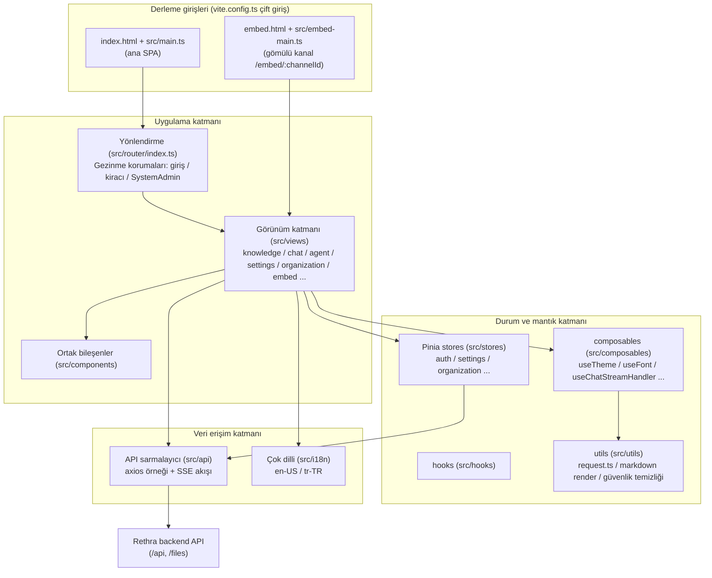

# Web ön yüzü (frontend/)

Rethra'nın Web ön yüzü, bilgi tabanı yönetimi, Agent sohbeti, organizasyon iş birliği ve sistem ayarları gibi tüm etkileşim arayüzlerini barındıran, **Vue 3 + TypeScript + Vite** tabanlı tek sayfalı bir uygulamadır (SPA). Ön yüz iki tür Web biçimine hizmet verir:

1. **Standart Web dağıtımı**: Vite derleme çıktısı nginx konteyneri tarafından sunulur, `/api` arka uca ters proxy ile yönlendirilir;
2. **Web sayfasına gömme (Embed)**: Bağımsız hafif giriş noktası `frontend/embed.html` + `frontend/src/embed-main.ts`, üçüncü taraf web sitelerinin akıllı ajan sohbetini iframe / kayan pencere yoluyla gömmesi için kullanılır;

## Teknoloji yığınına genel bakış

`frontend/package.json` temel alınarak (sürüm 0.8.2):

| Kategori | Tercih | Sürüm | Açıklama |
| --- | --- | --- | --- |
| Çerçeve | Vue | ^3.5.34 | Composition API, `<script setup>` stili |
| Dil | TypeScript | ~6.0.3 | `vue-tsc` tür denetimi yapar (`npm run type-check`) |
| Derleme aracı | Vite | ^7.3.5 | Eklentiler: `@vitejs/plugin-vue`, `@vitejs/plugin-vue-jsx` |
| UI bileşen kütüphanesi | TDesign (tdesign-vue-next) | ^1.19.2 | `tdesign-icons-vue-next` 0.4.4 ile birlikte kullanılır (sürüm overrides tarafından sabitlenir) |
| Durum yönetimi | Pinia | ^3.0.4 | Tüm store'lar `frontend/src/stores/` altında bulunur |
| Yönlendirme | Vue Router | ^4.5.0 | `createWebHistory`, bkz. `frontend/src/router/index.ts` |
| Çoklu dil | vue-i18n | ^11.4.2 | en-US / tr-TR |
| HTTP | axios | ^1.16.0 | Ortak örnek `frontend/src/utils/request.ts` içinde sarmalanmıştır |
| SSE akışı | @microsoft/fetch-event-source | ^2.0.1 | Sohbet için akışlı yanıtlar, bkz. `frontend/src/api/chat/streame.ts` |
| Markdown işleme | marked / marked-katex-extension / katex / highlight.js / mermaid | — | Sohbet yanıtlarının zengin metin olarak işlenmesi (formüller, kod vurgulama, grafikler) |
| Güvenlik | dompurify | ^3.4.11 | v-html içeriği tek noktadan temizlenir (`frontend/src/utils/markdownDomPurify.ts`) |
| Belge önizleme | docx-preview / @vue-office/pptx / xlsx / papaparse | — | Site içinde Word / PPT / Excel / CSV önizleme |
| Uzun liste | vue-virtual-scroller | 2.0.0-beta.8 | Mesaj listesinde sanal kaydırma |
| Stil | Less + CSS Variables | less ^4.6.4 | Tema değişkenleri için bkz. `frontend/src/assets/theme/theme.css` |

Dikkat edilmesi gereken bağımlılık ayrıntıları:

- `xlsx`, SheetJS resmi sabit adresinden `0.20.2` olarak kurulur; `package-lock.json` bütünlük doğrulama değerini korur; kaynak kod deposu bileşen paketini içermez, çevrim dışı derleme için npm önbelleği önceden hazırlanmalıdır;
- `frontend/pnpm-workspace.yaml`, alt paket workspace'lerini bildirmez; yalnızca `allowBuilds` izin listesini içerir (`@vue-office/pptx`, `esbuild`, `vue-demi` derleme betiklerini çalıştırabilir); pnpm'nin derleme betiği güvenlik politikası için kullanılır;
- `overrides` / `resolutions` içinde `lightningcss` devre dışı bırakılır ve `esbuild`, `serialize-javascript` sürümleri birleştirilir.

## Modül yapısı

### Dizinlere hızlı bakış

| Dizin | Sorumluluk |
| --- | --- |
| `frontend/src/main.ts` | Ana SPA giriş noktası: TDesign / Pinia / Router / i18n kurulur, tema ve yazı tipleri başlatılır, TDesign simgeleri için çevrim dışı koruma (`installTDesignIconOfflineGuard`, çalışma zamanında `tdesign.gtimg.com` isteğini önler) kaydedilir; ilk ekran titremesini önlemek için `router.isReady()` beklendikten sonra bağlanır |
| `frontend/src/embed-main.ts` | Gömülü giriş noktası: bağımsız Vue uygulaması ve bağımsız yönlendirme (yalnızca `/embed/:channelId`), `#embed-app` bağlanır, bağımsız i18n (`src/i18n/embed.ts`) kullanılır |
| `frontend/src/views/` | Sayfa düzeyindeki bileşenler, iş alanlarına göre dizinlenir (aşağıdaki yönlendirme tablosuna bakın) |
| `frontend/src/components/` | Sayfalar arası ortak bileşenler (mesaj balonları, yükleme kaplaması, komut paneli vb.) |
| `frontend/src/stores/` | Pinia durumları (aşağıdaki store tablosuna bakın) |
| `frontend/src/api/` | Arka uç API sarmalayıcıları (aşağıdaki API modül tablosuna bakın) |
| `frontend/src/composables/` | Bileşimsel işlevler: tema, yazı tipi, sohbet akışı işleme, alıntı açılır katmanı, Embed köprüleme vb. |
| `frontend/src/hooks/` | İş hook'ları (örneğin `useKnowledgeBase`) |
| `frontend/src/utils/` | Araç seti: axios örneği, markdown işleme hattı, DOMPurify temizleme, Agent araç gösterimi vb. |
| `frontend/src/i18n/` | vue-i18n yapılandırması ve dil paketleri |
| `frontend/src/assets/theme/` | Tema CSS değişkenleri (light / dark) |
| `frontend/src/directives/`, `frontend/src/types/`, `frontend/src/config/` | Özel yönergeler, tür tanımları, yapılandırma |
| `frontend/public/` | Statik kaynaklar: `rethra-widget.js` (üçüncü taraf siteler için gömme yükleyicisi), `config.js` (çalışma zamanı yapılandırma yer tutucusu, kapsayıcı başlatılırken üzerine yazılır), çevrim dışı TDesign simgeleri |

## Sayfa yönlendirme listesi

Yönlendirmeler `frontend/src/router/index.ts` içinde tanımlanır, `createWebHistory` kullanılır; tüm sayfa bileşenleri dinamik import edilir (yönlendirmeye göre paketlenmiş gecikmeli yükleme).

### Üst düzey yönlendirmeler

| Yol | Ad | Bileşen | İşlev |
| --- | --- | --- | --- |
| `/` | — | Yeniden yönlendirme | `/platform/knowledge-bases` adresine yeniden yönlendirir |
| `/login` | `login` | `src/views/auth/Login.vue` | Giriş sayfası (OIDC, dil değiştirme, animasyonlu arka plan içerir) |
| `/register` | `registerByInvite` | `src/views/auth/Login.vue` | Davetle kayıt açılış sayfası — Login bileşeni yeniden kullanılır; bağlanırken `?token=xxx` algılanarak davetle kayıt moduna geçilir |
| `/onboarding/workspace` | `workspaceOnboarding` | `src/views/auth/WorkspaceOnboarding.vue` | Kiracısı olmayan kullanıcılar için çalışma alanı yönlendirme sayfası (oluşturma veya davet edilmeyi bekleme); giriş gerektirir ancak mevcut kiracı gerektirmez |
| `/join` | `joinOrganization` | Yeniden yönlendirme | Organizasyona katılma davet bağlantısı; `?code=` değerini `invite_code` parametresine dönüştürür ve `/platform/organizations` adresine gider |
| `/knowledgeBase` | `home` | `src/views/knowledge/KnowledgeBase.vue` | Bilgi tabanı ayrıntıları (eski üst düzey yol) |
| `/platform` | `Platform` | `src/views/platform/index.vue` | Platform ana düzeni (sol menü + yönlendirme çıkışı + genel ayarlar penceresi + sürükle-bırak yükleme kaplaması); varsayılan olarak bilgi tabanı listesine yönlendirir |
| `/platform/dev/markdown` | `markdownTest` | `src/views/dev/MarkdownTestPage.vue` | Yalnızca geliştirme modunda (`import.meta.env.DEV`) kaydedilen Markdown işleme görsel regresyon test sayfası |

### `/platform` alt rotaları

| Yol | Ad | Bileşen | İşlev |
| --- | --- | --- | --- |
| `/platform/knowledge-bases` | `knowledgeBaseList` | `src/views/knowledge/KnowledgeBaseList.vue` | Bilgi tabanı listesi: alan kenar çubuğu (tümü/benim/kuruluşa göre/sık kullanılanlar/son kullanılanlar), kart listesi, oluşturma girişi; güncelleme zamanı / oluşturma zamanı / ada göre sıralamayı destekler (`components/ResourceSortControl.vue`, etmen listesi için de geçerlidir) |
| `/platform/knowledge-bases/:kbId` | `knowledgeBaseDetail` | `src/views/knowledge/KnowledgeBase.vue` | Bilgi tabanı ayrıntıları: belge listesi (güncelleme zamanı / oluşturma zamanı / dosya adına göre sıralanabilir; sıralama sunucuda yapılır, varsayılan olarak oluşturma zamanı azalan sıradadır), yükleme, ayrıştırma durumu, sohbet girişi, Wiki vb. |
| `/platform/agents` | `agentList` | `src/views/agent/AgentList.vue` | Akıllı etmen (Agent) listesi ve yönetimi, düzenleme `AgentEditorModal.vue` üzerinden yapılır; `agents` dağıtım yeteneği gerekir |
| `/platform/toolbox/:section?` | `toolbox` | `src/views/toolbox/Toolbox.vue` | Araç kutusu: `skills` (beceriler), `mcp` (MCP hizmetleri), `browserconnection` (tarayıcı bağlantısı) olmak üzere üç sekme; aşağıdaki “Araç kutusu” bölümüne bakın |
| `/platform/artifacts` | `artifactLibrary` | `src/views/artifacts/ArtifactLibrary.vue` | Çıktı kütüphanesi: etmenlerin farklı sohbetlerde oluşturduğu dosyaları toplar; `settings.sandbox` dağıtım yeteneği gerekir |
| `/platform/creatChat` | `globalCreatChat` | `src/views/creatChat/creatChat.vue` | Yeni sohbet sayfası: önerilen sorular, bilgi tabanı/Agent/model seçildikten sonra sohbet başlatma |
| `/platform/knowledge-bases/:kbId/creatChat` | `kbCreatChat` | `src/views/creatChat/creatChat.vue` | Belirli bir bilgi tabanı bağlamından yeni sohbet başlatma (aynı bileşen) |
| `/platform/chat/:chatid` | `chat` | `src/views/chat/index.vue` | Sohbet sayfası: ileti akışı (SSE akışlı işleme, iskelet ekranı, sanal kaydırma), alıntı paneli, ek önizlemesi |
| `/platform/organizations` | `organizationList` | `src/views/organization/OrganizationList.vue` | Kuruluş listesi: kuruluş oluşturma/kuruluşa katılma, üye ve paylaşılan kaynak yönetimi (`OrganizationSettingsModal.vue` ile birlikte); `organizations` dağıtım yeteneği gerekir, Lite sürümünde her zaman gizlidir. Üye eklerken alan adına göre belirsiz arama yerine tam alan ID'siyle kesin arama yapılır |
| `/platform/settings` | `settings` | `src/views/settings/Settings.vue` | Ayarlar merkezi (tam ekran modal biçimi); bölümler için aşağıdaki “Ayarlar merkezinin bölümleri ve görünürlüğü” kısmına bakın |
| `/platform/tenant` | — | Yönlendirme | Eski yol uyumluluğu → `/platform/settings` |
| `/platform/knowledge-search` | — | Yönlendirme | Eski genel arama yolu → bilgi tabanı listesi ve `?cmdk=` aracılığıyla genel komut panelini (⌘K) açar |
| `/platform/integrations` | — | Yönlendirme | → `/platform/settings?section=integration-im` (eski `?tab=` `integration-<tab>` biçimine normalleştirilir; görünüm `src/views/integrations/` içindedir) |
| `/platform/system`, `/platform/system/settings`, `/platform/system/admins` | `systemSettings` / `systemAdmins` | Yönlendirme | Sistem yönetimi eski yolları → `/platform/settings?section=system-global`, `requiresSystemAdmin` gerektirir (görünümler `src/views/system/` içindedir: `SystemSettings.vue`, `SystemAuditLog.vue`, `PlatformAPIKeys.vue` vb.) |
| `/platform/system/queues` | `systemQueues` | Yönlendirme | → `/platform/settings?section=runtime-queues` (çalışma zamanı görev kuyruğu `src/views/system/RuntimeQueues.vue`) |

### Bağımsız giriş: gömülü sayfa

`/embed/:channelId` ana SPA rotasına ait değildir; bunun yerine `frontend/embed.html` + `frontend/src/embed-main.ts` tarafından oluşturulan bağımsız bir giriş noktasıdır (nginx ve Vite dev server, `/embed/*` için `embed.html` dosyasına fallback uygular). Bileşeni `src/views/embed/EmbedPage.vue`'dur (eşlik eden `EmbedChatView.vue` / `EmbedChatCore.vue` / `EmbedBotMessage.vue` vb. ile); Embed token kimlik doğrulaması kullanır ve üçüncü taraf web sitelerinde iframe olarak gömülmek üzere tasarlanmıştır.

### Ayarlar merkezinin bölümleri ve görünürlüğü

`Settings.vue`, tüm bölümleri yedi grup halinde sunar ve konumlandırma için `?section=` kullanır:

| Grup | Bölüm (`section` değeri) |
| --- | --- |
| Hesap | `general` (kişisel tercihler), `userprofile`, `mymemory` (kişisel bellek), `envvars` (kişisel değişkenler) |
| Alan | `tenant` (alan bilgileri), `members` (üyeler), `chathistory`, `memory` (alan belleği) |
| Yayınlama entegrasyonları | `integration-im`, `integration-embed`, `integration-api`, `integration-mcpserver` |
| Veri ve genişletmeler | `vectorstore`, `parser`, `storage`, `sandbox`, `websearch` |
| Sistem yönetimi | `system-global`, `runtime-queues`, `platform-api-keys`, `system-audit-log` |
| Platform | `system` (sürüm bilgisi) |

Yayınlama entegrasyonlarının sekmeleri, `frontend/src/config/integrations.ts` içindeki `INTEGRATION_TABS` / `INTEGRATION_PREVIEW_ITEMS` tarafından kaydedilir; bölüm değerleri standart olarak `integration-<tab>` biçimindedir; eski `/platform/integrations?tab=<tab>` ilgili bölüme normalleştirilir.

v0.8.2'den itibaren beceriler, MCP servisleri ve tarayıcı bağlantıları artık ayarlar bölümü değildir; [Araç kutusu](#arac-kutusu) altına taşındı. Eski `/platform/settings?section=skills|mcp|browserconnection` yer imleri, yönlendirme koruması tarafından `/platform/toolbox/<section>` adresine yönlendirilir (`skills`, `sandboxId` parametresini korur).

Görünürlük üç kural kümesiyle belirlenir ve **ön uç yalnızca daraltılmış görünümü sunar; yetkili kaynak arka uç rota koruyucusudur**:

- **Dağıtım yetenekleri**: `frontend/src/config/deploymentCapabilities.ts` içindeki `SETTINGS_SECTION_CAPABILITY` / `INTEGRATION_TAB_CAPABILITY`, bölümleri `GET /api/v1/system/capabilities` tarafından döndürülen yetenek anahtarlarına (`settings.sandbox`, `integrations.mcpserver` gibi) eşler; yetenek açıkça `supported: false` olduğunda giriş gizlenir. Aşağıdaki "Ayar gezintisi ve dağıtım yetenekleri" bölümüne bakın.
- **Sistem yöneticisi izin listesi**: `SYSTEM_ADMIN_SETTINGS_SECTIONS` (`system-global`, `runtime-queues`, `platform-api-keys`, `system-audit-log`) yalnızca sistem yöneticilerine gösterilir ve alan rollerinden bağımsızdır; ayrıntılar için [Kiracılar, kullanıcılar ve kimlik doğrulama yetkilendirmesi](../03-features/01-tenant-auth.md) içindeki "Sistem yöneticileri ve platform konsolu" bölümüne bakın.

### Araç Kutusu {#arac-kutusu}

Sol menüdeki "Araç Kutusu" (`/platform/toolbox/:section?`, `src/views/toolbox/Toolbox.vue`), etmenlerin kullanabileceği araçları merkezi olarak yönetir. Sekmeler, `frontend/src/config/toolbox.ts` içindeki `TOOLBOX_ITEMS` kapsamında tanımlanır:

| Sekme (`section`) | İçerik | Görünürlük koşulu |
| --- | --- | --- |
| `skills` | Beceri yönetimi (`SkillSettings.vue` yeniden kullanılır), `?sandboxId=` ile sanal alan yapılandırmasına konumlanabilir | `admin` ve üzeri, ayrıca dağıtım `settings.sandbox` desteklemelidir |
| `mcp` | MCP hizmetleri (`McpSettings.vue` yeniden kullanılır) | `admin` ve üzeri, ayrıca dağıtım `settings.mcp` desteklemelidir |
| `browserconnection` | Tarayıcı bağlantısı (`BrowserConnectionSettings.vue` yeniden kullanılır), sekmede bağlantı durumu gösterilir | `viewer` ve üzeri |

Sekmeler, özgün ayar bölümlerinin rol ve dağıtım yeteneği eşiklerini (`canAccessToolboxSection`) kullanmaya devam eder; geçerli alanda görünür sekme yoksa boş durum gösterilir. Kenar çubuğu menü öğesinin üzerine gelindiğinde kullanılabilir araçlar önizlenir ve tarayıcı bağlantısı durumu da kenar çubuğunda gösterilir. Tarayıcı bağlantısının kullanımı için [Yerel tarayıcı](09-local-browser.md) bölümüne bakın.

<Screenshot
  src="/screenshots/toolbox.png"
  caption="Araç Kutusu: becerileri, MCP hizmetlerini ve tarayıcı bağlantılarını tek sayfada yönetin"
  hint="Sol menüdeki "Araç Kutusu" girişini (üzerine gelindiğinde araç simgelerinin önizlemesiyle birlikte) ve Araç Kutusu sayfasının üstündeki üç sekmeyi (beceriler / MCP hizmetleri / tarayıcı bağlantıları; sayı ve bağlantı durumuyla birlikte) gösterir; şu anda beceriler sekmesi açıktır." />

### Bilgi tabanı düzenleme penceresindeki bölümler

Birçok yapılandırma **ayar merkezinde değil, bilgi tabanı düzenleme penceresindedir** (`KnowledgeBaseEditorModal.vue`), çünkü bunlar taban bazında uygulanır. Kenar çubuğu bölümleri beş grup halinde düzenlenir; bunların üçü yalnızca "mevcut bilgi tabanını düzenle" sırasında görünür:

| Grup | Bölüm (`key`) | Notlar |
| --- | --- | --- |
| Temel | `basic`, `models` | Ad, tür, sohbet/vektör/özet modelleri |
| İşleme | `parser`, `multimodal`, `asr`, `chunking` | Ayrıştırma motoru ve ilk satır başlığı, görsel anlama, konuşmadan metne dönüştürme, parçalama parametreleri |
| Veri | `vectorStore`, `storage`, `faq` | `faq` yalnızca FAQ türü tabanlar içindir; `vectorStore` bağlandıktan sonra değiştirilemez |
| Entegrasyonlar | `datasource` | **Yalnızca düzenleme modunda**; Feishu / Lark (bilgi tabanı ve bulut diski), Notion, Confluence, Yuque, DingTalk belgeleri, Tencent IMA, RSS / Atom, GitLab vb. senkronizasyonları burada yapılandırılır, genel ayarlarda değil (bağlayıcı tanımları için `views/knowledge/settings/DataSourceEditorDialog.vue` dosyasına bakın) |
| Yönetim | `graph`, `advanced`, `share`, `activity` | Bilgi grafiği, gelişmiş öğeler, kuruluşa paylaşım, etkinlik akışı; son ikisi yalnızca düzenleme modunda |

### Genel komut paneli (⌘K / Ctrl+K)

`components/GlobalCommandPalette.vue`, kenar çubuğunun yanı sıra ikinci ana gezinme yoludur:

- Bilgi tabanlarında, belgelerde ve oturumlarda arama yapar; aramadan önce kapsamı belirli bir bilgi tabanına daraltmayı (kapsam etiketi) destekler;
- Boş durumda son aramaları ve hızlı eylemleri (bilgi tabanı oluşturma, yükleme, yeni oturum oluşturma vb.) gösterir;
- Sağ üstteki giriş, **arama ayarları çekmecesini** (`views/settings/RetrievalSettings.vue`) açar. TopK, vektör/anahtar sözcük eşiklerini ve yeniden sıralama parametrelerini ayarlama yeri burasıdır; **ayar merkezinde değildir**, bulamazsanız buradadır.

### Gezinme korumaları

`router.beforeEach` içinde tam bir kimlik doğrulama zinciri uygulanmıştır (`frontend/src/router/index.ts`):

1. **OIDC geri çağrısına izin verme**: URL hash'i `oidc_result=` / `oidc_error=` içerdiğinde doğrudan izin verilir ve işlenmesi için `App.vue`'ya bırakılır;
2. **Araç kutusu eski yer imleri**: `/platform/settings?section=skills|mcp|browserconnection`, `/platform/toolbox/<section>` adresine yönlendirilir;
3. **Lite derin bağlantı geri yükleme**: Lite modunda sert yenileme varsayılan ana sayfaya düştüğünde, son ziyaret edilen `/platform` alt yolu `sessionStorage` üzerinden geri yüklenir (kuruluş sayfasına geri yüklenmez);
4. **Oturum geri yükleme**: Giriş yapılmadığında, önce `localStorage` içindeki `rethra_token` ile `getCurrentUser()` çağrılarak oturum geri yüklenir (rol değişikliklerinin gecikmesini önlemek için memberships de yenilenir);
6. **Kiracı eşiği**: Giriş yapılmış ancak geçerli kiracı yoksa → `/onboarding/workspace` adresine gider;
7. **Dağıtım yeteneği eşiği**: Rota `meta.requiredCapability` değeri (ör. `agents`, `organizations`, `settings.sandbox`) mevcut dağıtım tarafından desteklenmiyorsa, bildirimden sonra bilgi tabanı listesine dönülür; yetenek tespiti başarısız olursa izin verilir ve yedek kontrol arka uç API'si tarafından yapılır;
8. **SystemAdmin eşiği**: `requiresSystemAdmin` rotaları, sistem yöneticisi olmayan kullanıcıları bilgi tabanı listesine geri gönderir (yalnızca UI katmanında engellenir; sunucu tarafında ayrıca sıkı doğrulama vardır).

## Durum yönetimi (Pinia)

`frontend/src/stores/` altındaki store ve yardımcı modüller:

| Dosya | Store ID / tür | Sorumluluk |
| --- | --- | --- |
| `stores/auth.ts` | `useAuthStore` | Kimlik doğrulama çekirdeği: user / token / refreshToken / tenant / memberships / rol denetimi (`hasRole`, `isSystemAdmin`), Lite mod işareti; çıkışta diğer store'ların alan düzeyi önbelleklerini zincirleme temizler ve tercihleri (tema/yazı tipi) kullanıcıya göre yeniden yükler |
| `stores/chatResources.ts` | `useChatResourcesStore` | Alan düzeyi kaynak önbelleği (TTL 60s): sohbet/yeni konuşma seçicilerinin yeniden kullanması için bilgi tabanları, Agent'lar, modeller ve Web arama provider listeleri |
| `stores/editorResources.ts` | `useEditorResourcesStore` | Düzenleyici/ayarlarla ilgili kaynak önbelleği (TTL 60s): depolama motoru yapılandırması ve durumu, Prompt şablonları, ayrıştırma motorları, sistem bilgileri, MCP hizmetleri, Skill'ler, Agent türü ön ayarları, arama yapılandırması |
| `stores/commandPalette.ts` | `useCommandPaletteStore` | Genel komut paneli (⌘K / Ctrl+K) açma/kapatma ve sorgular; son aramalar, hesaplar arası sızıntıyı önlemek için (user, tenant) kapsamına göre depolanır |
| `stores/organization.ts` | `useOrganizationStore` | Kuruluş iş birliği: kuruluş listeleri, üyeler, paylaşılan bilgi tabanları/Agent'lar, katılım başvuruları ve incelemeleri, rol yükseltmeleri gibi tüm işlemler |
| `stores/organizationState.ts` | Saf fonksiyon modülü | Kuruluş listesi upsert / merge, katılım incelemesinin üye sayısına etkisi gibi saf mantıklar (eşlik eden birim testi: `organizationState.test.ts`) |
| `stores/settingsStorage.ts` | Saf fonksiyon modülü | Ayar kalıcılığı: (`Rethra_settings` anahtarı) okuma, klonlama ve yerleşik Agent modu düzeltmesi (eşlik eden `settingsStorage.test.mjs`) |
| `stores/menu.ts` | `useMenuStore` | Sol gezinme menüsü yapısı (yeni sohbet, bilgi tabanı, Agent vb. öğeler) ve i18n başlıkları |
| `stores/knowledge.ts` | `knowledgeStore` | Bilgi kartı listesi ve toplam sayı (hafif) |
| `stores/ui.ts` | `useUIStore` | Genel UI durumu: ayarlar modalı, bilgi tabanı düzenleme modalı, manuel belge düzenleyicisi, kenar çubuğu daraltma gibi anahtarlar ve parametreler |
| `stores/uploadConfirm.ts` | Yükleme onay store'u | Yükleme/URL içe aktarma/manuel giriş/yeniden ayrıştırma öncesindeki işlem parametreleri onay iletişim kutusu durumu |
| `stores/versionedRequest.ts` | Saf fonksiyon modülü | `createVersionedRequestCoordinator`: sürüm numaralı önbellek isteği düzenleyicisi; eski yanıtların yeni yazımları ezmesini önler (eşlik eden `versionedRequest.test.ts`) |
| `stores/deploymentCapabilities.ts` | `useDeploymentCapabilitiesStore` | Dağıtım yetenekleri anlık görüntüsü (`GET /api/v1/system/capabilities`); rota koruyucuları, kenar çubuğu, ayarlar ve araç kutusunun girişin gösterilip gösterilmeyeceğini belirlemesi için kullanılır |
| `stores/modelProviders.ts` | `useModelProvidersStore` | Model sağlayıcıları katalog önbelleği (`GET /api/v1/models/providers`, model türüne göre yüklenir); model düzenleyicisi ve model kartları sağlayıcı bilgilerini buradan tutarlı biçimde okur |
| `stores/uploadTasks.ts` (+ `uploadQueue.ts` / `uploadTasksCore.ts` / `uploadTasksState.ts`) | `useUploadTasksStore` | Bilgi dosyası yükleme kuyruğu: eşzamanlı aktarım sınırı, iptal / yeniden deneme, ayrıştırma ilerlemesini yoklama; yüzen yükleme ilerleme panelini yönetir; bilgi tabanı sayfasından ayrıldıktan sonra yükleme sürer |
| `stores/browserConnection.ts` | `useBrowserConnectionStore` | Araç kutusu sekmesi ve kenar çubuğu durum göstergesi için yerel tarayıcı bağlantı durumu |
| `stores/sessionActivity.ts` | `useSessionActivityStore` | Kenar çubuğu oturumlarının devam eden durumu |

## API sarmalayıcıları (frontend/src/api/)

### İstek temeli

- **axios örneği**: `frontend/src/utils/request.ts`, birleşik örneği oluşturur (`baseURL`, `frontend/src/utils/api-base.ts` içindeki `getApiBaseUrl()` kaynaklıdır; alt yol ters vekil dağıtımını desteklemek için Vite `BASE_URL` değerine uyar; normal istek zaman aşımı 30 sn'dir). Dosya yüklemeleri (`postUpload`) için zaman aşımı yük boyutuna göre hesaplanır (`utils/requestTimeouts.ts` içindeki `uploadTimeoutMs`; alt sınır 5 dakika, yaklaşık 10MB/dakika oranında artırılır); `MAX_FILE_SIZE_MB` artırıldıktan sonra büyük dosyalar 30 sn varsayılan değeriyle kesilmez; çağıranın açıkça ilettiği `timeout` önceliklidir.
- **İstek önleyicisi**: Otomatik olarak `Authorization: Bearer <rethra_token>` ekler (Embed kanalındaki `Embed ` token'ı değiştirilmez), `Accept-Language` (geçerli i18n dili), `X-Request-ID` (rastgele dize), `X-Tenant-ID` (alanlar arası erişim; alan değişiminden sonra header kaybını önlemek için etkin alan id'sini her zaman taşır).
- **Yanıt önleyicisi**: 2xx için `data` paketten çıkarılıp döndürülür; 401, tek uçuşlu (single-flight) refresh token yenilemesini tetikler ve başarısız istek kuyruğunu yeniden oynatır; herkese açık uç noktaların (`/auth/login`, `/auth/register`, `/auth/oidc/`, `/auth/invitations/lookup`, `/api/v1/embed/`; yani `PUBLIC_AUTH_PATHS`) 401 yanıtları, girişe yönlendirilmeden doğrudan sayfaya iletilir; Embed sayfaları hiçbir zaman `/login` adresine yönlendirilmez.
- **HTTP durum kodu (`$httpStatus`)**: `get` / `post` / `put` / `patch` / `del` / `postUpload` dönüş türü `WithStatus<T>` şeklindedir; JSON nesnesi veya dizi yanıtlarına numaralandırılamayan `$httpStatus` özelliği eklenir; bu özellik, başarılı ancak biçimi aynı sonuçları ayırt etmek için kullanılabilir (örneğin sistem yöneticisinin kullanıcı oluşturmasında 201 yeni oluşturmayı, 200 ise idempotent yeniden denemeyi belirtir). Nesne yayılımında, `JSON.stringify` ve `Object.keys` içinde görünmez; Blob, dize ve SSE yanıtlarında bu özellik yoktur.
- **SSE akışı**: `frontend/src/api/chat/streame.ts`, `@microsoft/fetch-event-source` temelinde `useStream()` işlevini sarmalar; akış çıktısını, yükleme durumunu, hata durumunu ve istek hata ayıklama üst verilerini destekler; üst katman bunları `frontend/src/composables/useChatStreamHandler.ts` aracılığıyla sohbet mesaj akışı olarak düzenler. Sohbet akışı el sıkışması 401 döndürdüğünde, axios ile `utils/authRefresh.ts` içindeki tek uçuşlu yenilemeyi paylaşır; yeni token alındıktan sonra isteği aynen bir kez yeniden oynatır, dolayısıyla access token süresinin dolması başlatılmakta olan sohbeti kesmez.

### Modül listesi

| Modül | Sorumluluk |
| --- | --- |
| `api/auth/` | Giriş, kayıt, OIDC, `getCurrentUser` oturum geri yükleme |
| `api/tenant/` (`index` / `members` / `invitations` / `audit-log`) | Kiracı (çalışma alanı) bilgileri, üye yönetimi, davetler, denetim günlükleri |
| `api/organization/` | Organizasyon CRUD, üyeler, paylaşılan bilgi tabanı/Agent, katılım başvuruları |
| `api/knowledge-base/` | Bilgi tabanı CRUD ve dosya/bilgi öğesi yönetimi |
| `api/chat/` (`index` / `streame` / `steer` / `temporary-attachments`) | Oturum CRUD, başlık oluşturma, SSE akışlı soru-cevap, çalışmakta olan akıllı aracı turlarına mesaj ekleme (`steer`), geçici ekler |
| `api/artifacts.ts` | Çıktı kitaplığı listesi ve silme (`/api/v1/artifacts`) |
| `api/memory.ts` / `api/env-vars.ts` | Alan / kişisel bellek, kişisel değişkenler |
| `api/mcp-endpoint.ts` | Yerleşik MCP Server uç nokta yönetimi (entegrasyonu yayımla → MCP Server) |
| `api/chat-history.ts` | Sohbet geçmişi kayıtları |
| `api/agent/` | Özel Agent CRUD, tür ön ayarları, yer tutucular (yerleşik Quick Answer / Smart Reasoning id dahil) |
| `api/model/` | Model yapılandırma yönetimi |
| `api/retrieval.ts` | Kiracı alma yapılandırması |
| `api/vector-store.ts` / `api/storage-backend.ts` / `api/chunker/` | Vektör veritabanı, depolama arka ucu, parçalama aracı yapılandırması |
| `api/datasource/` | Veri kaynağı bağlantısı |
| `api/embed/` | Web gömme kanalı yönetimi (kanal oluşturma, hız sınırlama vb.) |
| `api/initialization/` | Sistem başlatma süreci |
| `api/system/` | Sistem bilgileri, depolama motoru durumu, Prompt şablonları, ayrıştırma motoru gibi sistem düzeyi arayüzler |
| `api/mcp-service.ts` / `api/skill/` | MCP hizmeti ve Skill yönetimi |
| `api/web-search.ts` / `api/web-search-provider.ts` | Web araması ve sağlayıcı yapılandırması |
| `api/wiki/` | Bilgi tabanı Wiki oluşturmayla ilgili arayüzler |
| `api/message-suggestion.ts` | Önerilen sorular |
| `api/user-favorites.ts` | Kullanıcı favorileri (bilgi tabanı/Agent favori listesi) |

## Sohbet zaman çizelgesindeki bekleme durumu

RAG işlem hattının görsel ilerlemesinde (`views/chat/components/RagPipelineProgress.vue`), “tüm görünür adımlar tamamlandı” ile “model ilk sözcüğü üretti” arasında sessiz bir dönem bulunur. Bu boşluk `utils/rag-pipeline-state.ts` tarafından açıklanır:

- `getRagPipelineWaitKind()` bekleme türünü belirler: yalnızca alma adımları gerçekten tamamlandıysa `model` (yanıt üretiliyor) olarak adlandırılır; saf ek soru-cevap gibi alma adımı olmayan turlara, hiçbir geri bildirim vermemek yerine nötr `preparing` atanır;
- `createRagWaitController()` sunum ayrıntılarından sorumludur: model hızlı yanıt verdiğinde kısa süreli yanıp sönmeyi önlemek için yalnızca `RAG_WAIT_REVEAL_DELAY_MS` (250ms) sonrasında gösterilir; `RAG_WAIT_STALL_DELAY_MS` (60s) aşıldığında “takıldı” durumuna geçer — SSE bağlantısı kesildiğinde arka uç artık `is_completed` göndermez; bu üst sınır olmadan ilerleme çubuğu sonsuza dek “hemen hazır” iddiasında kalır;
- Durum değişiklikleri kalıcı bir `aria-live` alanı üzerinden duyurulur; ekran okuyucu kullanıcıları düğümün tamamen değiştirilmesi nedeniyle metni kaçırmaz.

## Çoklu dil (i18n)

`frontend/src/i18n/index.ts` içinde uygulanmıştır; `vue-i18n` temel alınır (`legacy: false` Composition modu, `globalInjection: true`):

- **Desteklenen diller** (`frontend/src/i18n/locales/`):
  - `en-US` (İngilizce)
  - `tr-TR` (Türkçe, varsayılan ve yedek)
- Dil seçimi `localStorage` içindeki `locale` anahtarında kalıcı olarak saklanır; axios interceptor mevcut dili `Accept-Language` istek başlığına yazar, böylece arka uç yerelleştirilmiş içerik döndürür.
- Bazı çeviriler gömülü `<strong>` etiketleri içerir (`DOMPurify` ile temizlendikten sonra v-html ile işlenir); vue-i18n HTML uyarılarını kapatmak için `warnHtmlMessage: false` yapılandırılmıştır.
- **Bağımsız Embed i18n**: Ziyaretçi tarafındaki gömülü sayfa, ayrı bir `frontend/src/i18n/embed.ts` kullanır (`embed-main.ts` tarafından yüklenir); yönetim tarafındaki "web sayfası gömme" metinleri ana dil paketinde kalır; `frontend/src/i18n/locales/embed/index.ts`, dil normalleştirme yardımcılarını tek noktadan re-export eder (URL parametrelerinden embed dilinin senkronizasyonunu destekler).
- **Denetim ve budama araçları**: Dil paketleri büyük olduğundan, kullanılmayan anahtarlar veya çevirisi eksik yeni anahtarlar kolayca birikebilir; bu nedenle üç yardımcı betik sağlanmıştır (`frontend/package.json`):

  | Komut | İşlev |
  | --- | --- |
  | `npm run check-i18n` | `src/i18n/localeKeyAudit.test.ts` çalıştırır; tüm dil paketlerinin anahtar kümelerinin tutarlılığını ve eksik başvuruların olmadığını doğrular |
  | `npm run scan-i18n-gaps` | Kaynak kodda gerçekten kullanılan anahtarları dil paketleriyle karşılaştırır, tanımsız ve kullanılmayan anahtarları raporlar |
  | `npm run regenerate-i18n-locales` | Tarama sonuçlarına göre budanmış dil paketlerini yeniden oluşturur |

  Denetim günlüklerindeki eylem adları ayrı bir kayıt defteri kullanır (`i18n/auditActionRegistry.ts` + `auditActionLocaleDefaults.ts`); yeni bir denetim eylemi eklerken kayıt defterine bir satır eklemek yeterlidir; böylece budama araçlarının bunları başvurulmamış, kullanılmayan anahtarlar olarak silmesi önlenir.

## Tema ve görünüm

- **Tema modu**: `frontend/src/composables/useTheme.ts`, `light | dark | system` olmak üzere üç durum sağlar. Etkinleştirme, `document.documentElement` üzerinde `theme-mode` niteliği ayarlanarak yapılır; `system` modu, otomatik uyum için `prefers-color-scheme` medya sorgusunu dinler.
- **CSS değişkenleri**: `frontend/src/assets/theme/theme.css`, TDesign token sistemini (`--td-brand-color-*`, `--td-bg-color-*`, `--td-text-color-*`, yazı tipi/kenar yuvarlama/gölge vb.) kullanarak `:root[theme-mode="light"]` ve `:root[theme-mode="dark"]` için iki değişken seti tanımlar; marka renkleri yeşil tonlarındadır. Bileşen stilleri, tek tıklamayla tema değiştirme için yalnızca değişkenleri kullanır.
- **Tercihlerin kalıcı saklanması**: Tema ve yazı tipi tercihleri, `frontend/src/composables/preferenceStorage.ts` aracılığıyla kullanıcı id alanında `localStorage` içine kaydedilir; giriş/çıkış/hesap değişimi sırasında `reloadThemeFromStorage()` / `reloadFontFromStorage()` tarafından yeniden yüklenir (`stores/auth.ts` içinde tetiklenir).
- **Yazı tipi**: `frontend/src/composables/useFont.ts`, arayüz yazı tipi seçimini yönetir; başlangıçta `main.ts`, `initTheme()` + `initFont()` çalıştırır.

## Derleme ve dağıtım

### Geliştirme ve derleme (`vite.config.ts`)

`frontend/vite.config.ts` önemli noktaları:

- **Çift girişli derleme**: `rollupOptions.input`, `index.html` (ana SPA) ve `embed.html` (gömülü sayfa) dosyalarını aynı anda derler; geliştirme ortamında özel `embedHtmlDevFallback()` eklentisi, nginx davranışıyla uyumlu olacak şekilde `/embed/:channelId` isteklerini `/embed.html` dosyasına yeniden yazar.
- **Kod parçalama**: `manualChunks`, mermaid/dagre/cytoscape, marked/katex ve highlight.js paketlerini sırasıyla `vendor-mermaid`, `vendor-markdown`, `vendor-highlight` olarak ayırır; embed girişi, `modulePreload.resolveDependencies` üzerinden ağır sohbet chunk'larını filtreler ve gömülü sayfanın ilk ekranında yalnızca token değişimi için gereken kodun yüklenmesini sağlar.
- **Sürüm ekleme**: `__FRONTEND_VERSION__` (`package.json` version) ve `__FRONTEND_COMMIT__` (`VITE_FRONTEND_COMMIT` / `GITHUB_SHA` / `git rev-parse`) derleme zamanında eklenir.
- **Geliştirme proxy'si**: Dev server (port 5173) ve preview (port 4173), `/api`, `/files`, `/mcp/` yollarını `VITE_DEV_PROXY_TARGET` (veya varsayılanı `http://localhost:8080` olan `FRONTEND_BACKEND_URL`) hedefine proxy'ler. `/api`, WebSocket yönlendirmesini etkinleştirir (sandbox terminali vb.) ve zaman aşımı 180s olarak genişletilmiştir; `/mcp/`, yerleşik MCP Server için Streamable HTTP uzun bağlantısıdır ve zaman aşımı 1 saattir.
- **Takma adlar**: `@` → `frontend/src`; ayrıca `@vue-office/pptx` için giriş dosyası algılama düzeltmesi uygulanır.
- Sık kullanılan betikler: `npm run dev` / `npm run build` / `npm run preview` (üretim derleme çıktısıyla yerel olarak hizmet başlatır; yayın imajına en yakın doğrulama ortamıdır) / `npm run type-check` / `npm run test` (tsx --test).

### Üretim imajı (Dockerfile + nginx)

`frontend/Dockerfile`:

- v0.8.2'den itibaren iki aşamalı derleme kullanılır: digest ile sabitlenmiş `node:24-bookworm-slim`, `$BUILDPLATFORM` üzerinde `npm ci` + `npm run build` çalıştırır, ardından `dist/` çalışma katmanına kopyalanır. Derleme sırasında artık ana makinede Node / npm kurulu olması gerekmez ve `dist/` önceden oluşturulmak zorunda değildir (`scripts/build_frontend_dist.sh` Lite / masaüstü paketleme için kullanılmaya devam eder);
- Çalışma katmanının temel imajı digest ile sabitlenmiş `nginx:1.30.3-alpine` olarak belirlenmiştir (yorum, bunun değişken bir tag'e geri döndürülmesini açıkça yasaklar — daha yeni Alpine 3.24+ sürümleri CentOS 7 eski çekirdeklerinde başlatılamaz; bu durum v0.7.0 arızasına yol açmıştır);
- `nginx.conf`, şablon olarak `/etc/nginx/templates/default.conf.template` içine yerleştirilir; `/api/`, `/mcp/` ve beceri yüklemelerinin ortak vekil parametreleri `nginx-api-proxy.conf` içindedir (değiştirilmeden `/etc/nginx/api-proxy.conf` olarak kopyalanır), http düzeyi parça ise `nginx-http.conf` içindedir (sorgu dizesi kaldırılmış `api_no_query` günlük biçimi). 80 portu açılır, giriş noktası `docker-entrypoint.sh` olur.

İmaj derleme parametreleri:

| Ad | Tür | Varsayılan | Açıklama |
| --- | --- | --- | --- |
| `NPM_REGISTRY` | build-arg | boş | `npm ci` tarafından kullanılan kayıt kaynağı; boşsa npm varsayılan kaynağı kullanılır |
| `NODE_MAX_OLD_SPACE_SIZE` | build-arg | `4096` | Derleme aşamasındaki Node yığın sınırı (MB); Vite derlemesinde OOM'u önler |
| `VITE_FRONTEND_COMMIT` | build-arg | `unknown` | Sayfaya eklenen ön yüz commit'i; `npm ci` sonrasında tanımlanır, değiştirilmesi bağımlılık katmanı önbelleğini geçersiz kılmaz |

`frontend/docker-entrypoint.sh` (çalışma zamanı yapılandırma ekleme):

1. `/usr/share/nginx/html/config.js` oluşturur, `MAX_FILE_SIZE_MB`, `MAX_SKILL_BUNDLE_SIZE_MB` ve `DEFAULT_LOCALE` değerlerini ön yüzün çalışma zamanında okuması için `window.__RUNTIME_CONFIG__` içine yazar;
2. nginx şablonunu `envsubst` ile işler;
3. nginx'i ön planda başlatır.

| Ad | Tür | Varsayılan | Açıklama |
| --- | --- | --- | --- |
| `MAX_FILE_SIZE_MB` | tam sayı (MB) | `50` | Site genelindeki istek gövdesi sınırı ve ön yüz yükleme boyutu sınırı |
| `MAX_SKILL_BUNDLE_SIZE_MB` | tam sayı (MB) | `256` | Yalnızca beceri ZIP yükleme rotalarında geçerlidir; `MAX_FILE_SIZE_MB` değerinden küçükse bu değere yükseltilir, en fazla 512 olabilir |
| `DEFAULT_LOCALE` | dize | boş | Varsayılan arayüz dili; yalnızca `en-US` / `tr-TR` kabul edilir, diğer değerler atılır |
| `APP_HOST` | dize | `app` | Arka uç ana makine adı |
| `APP_PORT` | tam sayı | `8080` | Arka uç portu |
| `APP_SCHEME` | dize | `http` | Arka uç protokolü; uzak HTTPS arka ucu için `https` ayarlanabilir |

`frontend/nginx.conf` temel davranışları:

- **SPA geri dönüşü**: `/` altında `try_files ... /index.html` kullanılır ve `index.html` için `no-cache` ayarlanır (yükseltmeden sonra kullanıcıların eski sürümü almasını önlemek için); hash içeren `/assets/*` için bir yıllık immutable önbellek ayarlanır;
- **API vekili**: `/api/` ve `/files`, `${APP_SCHEME}://${APP_HOST}:${APP_PORT}` adresine ters vekil olarak yönlendirilir; `/api/` için SSE kapsamında `proxy_buffering` / önbellek / parçalı kodlama kapatılır, okuma ve yazma zaman aşımları 3600s'ye yükseltilir ve 3 upstream yeniden denemesi yapılandırılır;
- **Yerleşik MCP Server `/mcp/`**: Özgün yol arka uca ters vekil olarak yönlendirilir, vekil parametreleri `/api/` ile aynıdır; harici MCP istemcileri doğrudan site alan adını kullanarak `/mcp/<endpoint_id>` adresine bağlanabilir;
- **WebSocket kanalları**: `/api/v1/sessions/<id>/sandbox/(terminal|desktop)` (sandbox terminali ve grafik masaüstü) ile `/api/v1/local-browser/extension` (BrowserSkill tarayıcı eklentisi bağlantısı) için Upgrade ayrı olarak etkinleştirilir, el sıkışma biletlerinin kaydedilmemesi için erişim günlüğünden sorgu dizesi çıkarılır; küme içi yol `/api/v1/local-browser/internal` doğrudan 404 döndürür;
- **Beceri paketi yükleme**: `/api/v1/skills/catalog` ve `/api/v1/sandbox-configs/<id>/skills` adlı iki koleksiyon rotası `MAX_SKILL_BUNDLE_SIZE` değerini ayrı olarak kullanır; diğer yükleme uç noktaları hâlâ `MAX_FILE_SIZE` sınırına tabidir;
- **Kaynak kısa bağlantısı `/r/`**: `location ^~ /r/` de arka uca ters vekil olarak yönlendirilir. IM kanalı, `resource://` görsellerini `<APP_EXTERNAL_URL>/r/<token>` olarak yeniden yazar; bu yapılandırma olmadığında istek SPA fallback'e düşer ve IM tarafında görseller boş görünür (ayrıntılar için [IM entegrasyonu](../03-features/12-im-integration.md));
- **Gömülü sayfa**: `/embed/*`, `embed.html` döndürür (ayrı bir location'dır ve ana sitenin `X-Frame-Options: SAMEORIGIN` ayarını devralmaz). nginx, önce dahili alt istek `/_embed-frame-policy` üzerinden arka uca `GET /api/v1/embed-frame-policy` sorgusu göndererek bu kanal için izin verilen ana kaynakları sorgular ve dönen `Content-Security-Policy` değerini yanıta ekler; kanal yoksa, devre dışıysa, izin verilen ana kaynak yoksa veya arka uca ulaşılamıyorsa yüklemeyi reddeder. Özel ters vekil bu adımı korumalıdır, aksi halde ana kaynak izin listesi çalışmaz. `/rethra-widget.js`, üçüncü taraf siteler için statik yükleyicidir; dosya başlığında ayrıca isteğe bağlı bağımsız embed alt alan adı server bloğu örneği bulunur;
- gzip'i (yorumlarda ölçülen kazanç belirtilmiştir: düşük bant genişliğinde ilk ekran 25 sn'den 3-5 sn'ye düşer) ve bir dizi güvenlik yanıt başlığını (`X-Frame-Options`, `X-Content-Type-Options`, `Referrer-Policy` vb.) etkinleştirin; nginx `add_header` devralma sorununu önlemek için bunlar her location içinde tekrar tanımlanır.

## Ayar gezintisi ve dağıtım yetenekleri

Ayar girişleri görevlere göre gruplandırılır; yayımlama entegrasyonları IM, web gömme, API, MCP Server ve benzeri bağlantı sayfalarını içerir. Sandbox yapılandırması, kişisel değişkenler ile alan / kişisel bellek için ayar merkezinde ayrı yönetim arayüzleri vardır; beceriler, MCP hizmetleri ve tarayıcı bağlantıları araç kutusundadır. Yeni girişler, `frontend/src/config/integrations.ts`, `frontend/src/config/toolbox.ts`, `frontend/src/config/settingsAccess.ts` ve benzeri mevcut kayıt bilgilerini yeniden kullanmalı, ayrıca kenar çubuğu gruplamasını da kontrol etmelidir.

`GET /api/v1/system/capabilities`, edition ile yetenek `supported/reason` değerlerini döndürür. Ön yüz, gerçek dağıtım yeteneklerine göre girişleri gizler veya devre dışı bırakır (rota koruyucuları, sol menü, ayar bölümleri ve araç kutusu sekmeleri aynı anlık görüntüyü okur): yetenek algılama başarısız olursa veya eski arka uçta bir anahtar yoksa varsayılan olarak görünür kalır; `organizations`, Lite sürümünde her zaman gizlidir; `settings.sandbox.docker` / `settings.sandbox.host` yalnızca arka uç açıkça `supported: true` döndürdüğünde gösterilir. Ön yüz görünürlüğü yalnızca kullanım deneyimini iyileştirir; arka uç rotaları rol ve yetenek kontrollerini sürdürür. Arayüz için bkz. [Sistem API](../04-api/02-api-system.md).
