# Veritabanı ve geçişler

Rethra, veritabanı yapısını sürümlemeli geçişlerle yönetir; PostgreSQL ve SQLite kendi geçiş dizinlerini kullanır. Uygulama başlatılırken geçişler otomatik olarak çalıştırılabilir veya betikler aracılığıyla elle yürütülebilir; yeni alanlar ya da tablolar eklenirken her iki yolun da eşzamanlı olarak sürdürülmesi gerekir.

## Desteklenen veritabanları {#desteklenen-veritabanlari}

Ana uygulama veritabanına GORM üzerinden bağlanır; sürücü `DB_DRIVER` ortam değişkeniyle belirlenir. `internal/container/container.go` içindeki `initDatabase()` fonksiyonunun switch yapısı **yalnızca iki değeri kabul eder**:

| `DB_DRIVER` | Açıklama |
| --- | --- |
| `postgres` | Standart mod. Hem yerel PostgreSQL'i (+pgvector) hem de **ParadeDB**'yi (yerleşik `pg_search`/BM25 içeren PostgreSQL dalı; resmi compose varsayılan imajı `paradedb/paradedb:v0.22.6-pg17`) destekler. GORM DSN'si `DB_HOST/DB_PORT/DB_USER/DB_PASSWORD/DB_NAME` ile oluşturulur; `sslmode=disable` ve `TimeZone=UTC` zorunlu kılınır |
| `sqlite` | Lite modu. Yol `DB_PATH` değerinden alınır (varsayılan `./data/rethra.db`); DSN'ye `_journal_mode=WAL&_busy_timeout=5000&_foreign_keys=on` eklenir ve vektör araması için `sqlite-vec` uzantısı (`sqlite_vec.Auto()`) yüklenir |
| Diğer değerler | Doğrudan `unsupported database driver` hatası verir |

**MySQL ana veritabanı seçeneği değildir**: `go.mod` içindeki `go-sql-driver/mysql`, Doris arama motoru (MySQL protokolü, `database/sql`) için protokol sürücüsünü kaydetmek amacıyla kullanılır (bkz. `container.go` import açıklaması). `migrations/mysql/00-init-db.sql`, yalnızca 10 çekirdek tabloyu (tenants/models/knowledge_bases/knowledges/sessions/messages/message_suggestion_sets/message_suggestion_events/chunks/chunk_revisions) içeren tek seferlik bir MySQL tablo oluşturma betiğidir; **hiçbir Go kodu veya betiği buna başvurmaz**, uygulama başlatma akışına bağlı değildir ve eski/harici başlatma amacıyla değerlendirilebilir.

Arama motoru (vektör/anahtar sözcük indekslerinin depolaması) ana veritabanından ayrıdır ve `RETRIEVE_DRIVER` tarafından kontrol edilir (postgres / elasticsearch / qdrant / milvus / sqlite vb.; ayrıntılar için «Genişletme Noktaları Kılavuzu»na bakın). `RETRIEVE_DRIVER` `postgres` içermediğinde, geçiş DSN'si `options=-c app.skip_embedding=true` içerir; `embeddings` tablosuyla ilgili geçişler bu GUC koşuluyla atlanır.

## Geçiş dizini yapısı {#gecis-dizini-yapisi}

```text
migrations/
├── versioned/     # PostgreSQL/ParadeDB sürümlü geçişleri: 000000-000110, toplam 111 sürüm (222 .up/.down.sql dosyası)
├── sqlite/        # SQLite geçişleri: 000000_init (düzleştirilmiş tam şema) + 000001-000030 artımlı sürümler
├── paradedb/      # ParadeDB ek betikleri: 00-init-db.sql, 01-migrate-to-paradedb.sql (mevcut veritabanını geçirme)
└── mysql/         # 00-init-db.sql, eski tek seferlik MySQL tablo oluşturma betiği (koda bağlı değil)
```

- PostgreSQL için `versioned/`, `000000_init` ile `000110_im_channel_locale` arasındadır;
- `sqlite/`, düzleştirilmiş tam başlatma olarak `000000_init` kullanır (JSONB→TEXT, SERIAL→AUTOINCREMENT gibi lehçe farkları uyarlanmıştır); ardından artımlı sürümler eklenir (şu anda `000030_im_channel_locale`'ye kadar) ve bunlar da golang-migrate tarafından sırayla yürütülür;
- `uuid-ossp`, `vector`, `pg_trgm`, `pg_search` ve benzeri uzantılar `versioned/` geçişleri tarafından oluşturulur (000000, 000002); BM25 indeksi, `embeddings.content` üzerinde Çince Lindera ayrıştırıcısı kullanılarak oluşturulur;
- `paradedb/00-init-db.sql`, uzantılara ek olarak eski bir tablo oluşturma ifadeleri kümesi de içerir ve **compose veya kod tarafından başvurulmaz**. Bunu veritabanı initdb betiği olarak bağlamayın: önce oluşturduğu eski tablolar `000000_init` işleminin başarısız olmasına neden olur.

### versioned/ geçiş geçmişine genel bakış (konuya göre) {#versioned-gecis-gecmisine-genel-bakis-konuya-gore}

| Sürüm aralığı | Konu | Eklenen önemli tablo/sütunlar |
| --- | --- | --- |
| 000000 | Çekirdek başlatma | `tenants`, `models`, `knowledge_bases`, `knowledges`, `chunks`, `sessions`, `messages` |
| 000001 | Kullanıcı kimlik doğrulama + Agent + MCP | `users`, `auth_tokens`, `custom_agents`, `mcp_services`, `knowledge_tags` |
| 000002-000011 | Vektör/arama | `embeddings` (HNSW + BM25, `app.skip_embedding` tarafından denetlenir), `chunks.flags`, `seq_id`, ParadeDB BM25 indeksi |
| 000012-000018 | Kiracılar arası iş birliği | `organizations`, `organization_members`, `kb_shares`, `agent_shares`, `organization_join_requests` |
| 000019-000028 | Mesaj/IM geliştirmeleri | `messages` genişletilmiş sütunları (images, rendered_content, agent_duration_ms), `im_channels`, `im_channel_sessions` |
| 000029-000036 | Veri kaynakları ve vektör veritabanı soyutlaması | `data_sources`, `sync_logs`, `web_search_providers`, `vector_stores`, KB için asr_config/vector_store_id |
| 000037-000041 | Wiki ve görev kuyruğu | `wiki_pages`, `wiki_folders`, `wiki_page_issues`, `wiki_log_entries` (000077'de kaldırıldı), `task_pending_ops`, `task_dead_letters` |
| 000042-000054 | RBAC / denetim / davet / sistem ayarları | `mcp_tool_approvals`, `tenant_members`, `audit_logs`, `organization_tenant_members` (eski `organization_members` yeniden adlandırılarak arşivlendi), `user_resource_favorites`, `tenant_invitations`, `user_kb_pins`, `system_settings` ve `users.is_system_admin` (000053), davet bağlantısı sütunları `tenant_invitations.token`/`accepted_count` (000054) |
| 000055-000060 | İşleme hattı ve gömme kanalları | `knowledge_processing_spans`, `knowledges.pending_subtasks_count` (000056, `finalizing` durum sayacı), `embed_channels`, HNSW 1024 boyutlu indeks |
| 000061-000067 | Wiki hiyerarşisi / OAuth / belge çoklu etiketleri / özne kimliği / önerilen sorular | `wiki_pages` hiyerarşi sütunları, `mcp_oauth_clients`, `mcp_oauth_tokens`, `knowledge_tag_relations`, özne kimliği sütunları (000064: `tenants.api_principal_config`, `mcp_oauth_tokens.principal_type`/`principal_id`), `tenant_api_keys` (000065, aynı zamanda `tenants.api_key` kaldırılır), `message_suggestion_sets`, `message_suggestion_events` |
| 000068-000074 | Depolama/kaynak/geçici belgeler | `storage_backends`, `resources`, `resource_bindings`, `resource_access_grants`, `temporary_documents`, platform düzeyi API anahtarı, OAuth yenileme kira süresi |
| 000075-000076 | Wiki sürüm geçmişi ve indeksi | `wiki_page_revisions`, `wiki_pages.last_edit_source`/`last_editor_id`, `knowledges.metadata->>'external_id'` önek indeksi |
| 000077 | Wiki işlem günlüğünün kaldırılması | DROP `wiki_log_entries` ve geçmişten kalan `page_type = 'log'` sayfalarını silme; Wiki değişiklikleri birleşik olarak bilgi tabanı etkinlik akışına kaydedilir |
| 000078 | Parçalı düzenleme ve özel meta veriler | `chunks` tablosuna `source_content`/`content_revision`/`index_status`/`last_editor_id`/`context_header` eklendi, `chunk_revisions` tablosu oluşturuldu, `knowledges` tablosuna `custom_metadata` eklendi |
| 000079 | Bilgi tabanı klasör ağacı | `knowledges` tablosuna `folder_path` sütunu eklendi ve geçmiş klasör yüklemeleri dolduruldu (önceden yol `file_name` içinde tutuluyordu), `(tenant_id, knowledge_base_id, folder_path)` indeksi eklendi |

### 000080 sonrasındaki geçişler {#000080-sonrasindaki-gecisler}

| Sürüm | Değişiklik |
| --- | --- |
| 000080 | knowledge_bases.auto_tag_config |
| 000081 | messages.artifacts, oluşturulan dosyaları kalıcılaştırır (`message_artifacts` tablosunda depolamaya 000103 itibarıyla geçildi) |
| 000082 | tenant_sandbox_configs, çok adlandırmalı arka uçlar ve yapılandırma değişikliği kira süresi |
| 000083 | sessions.sandbox_config_id |
| 000084 | Kişisel bellek için altı tablo, tenants.memory_config, messages.used_memories |
| 000085 | messages.usage |
| 000086 | tenant_skills, tenant_skill_snapshots, kurulum ve anlık görüntü defteri |
| 000087 | Beceri install_session_id / install_message_id, kurulum konuşması günlükleri |
| 000088 | Anlık görüntü planned_name, oluşturmadan önce planlanan adı kaydeder |
| 000089 | Beceri envs, tenant_user_env_vars |
| 000090 | tenant_skill_catalog; tenant_skills.catalog_id, mevcut kurulumlar dolduruldu |
| 000091 | mcp_tool_approvals.enabled, varsayılan olarak true |
| 000092 | mcp_services.usage_instructions; `mcp_metadata` tablosu, MCP hizmetlerinin araç dizini anlık görüntüsünü kalıcılaştırır |
| 000093 | `browser_devices`, `browser_pairings`, `browser_task_interruptions`, tarayıcı bağlantıları için cihaz yetkilendirmesi ve eşleştirme |
| 000094 | memory_subjects.extraction_state, memory_items.replaces_id, `memory_extraction_sessions` tablosu (oturum bazında çıkarma ilerlemesini kaydeder); eski sürümlerde onay bekleyen çıkarımların yürürlükteki belleği çok erken değiştirmesine yol açan veri sorunu düzeltildi |
| 000095 | memory_item_embeddings.embedding (halfvec, yalnızca `vector` uzantısı kuruluysa eklenir) ve alma indeksi |
| 000096 | Veri geçişi: DingTalk kanalı `mode`, webhook yerine websocket (Stream) olarak değiştirildi. DingTalk geliştirici panelinde Stream modu etkinleştirilmelidir; down işlemi boş işlemdir |
| 000097 | Oturum dallandırma: sessions.parent_session_id / forked_from_message_id / fork_bootstrap, messages.sandbox_checkpoint |
| 000098 | `fork_snapshot_leases` tablosu, dallanmış oturumlar veritabanına kaydedilmeden önce alınan sandbox anlık görüntülerini kaydeder ve geri kazanımı kolaylaştırır |
| 000099 | Kurulu pg_search 0.22.2–0.22.5 sürümlerini 0.22.6'ya yükseltir; imaj 0.22.6'yı sağlamıyorsa, başka sürümler varsa veya `app.skip_embedding=true` ise atlanır |
| 000100 | `chunks` üzerindeki yazmayı yalnızca yavaşlatan üç indeks kaldırıldı: `idx_chunks_chunk_type`, `idx_chunks_content_hash`, `idx_chunks_tenant_kg` |
| 000101 | knowledges.profile (belge profili), knowledge_bases.profile_config / generated_profile (AI bilgi tabanı açıklaması) |
| 000102 | `mcp_endpoints` tablosu, alanın dışarıya sunduğu MCP uç noktaları |
| 000103 | `message_artifacts` tablosu, `messages.artifacts` üzerinden doldurulur; bundan sonra yalnızca yeni tablo okunur ve yazılır. Doldurma sonrasında eski sütunda içerik bulunan satırlar NULL olarak ayarlanır (sütun korunur, aşamalı yükseltmedeki eski örneklerle uyumluluk sağlar); ayrıştırılamayan `file_size`/`created_at`, geçişi kesintiye uğratmadan 0 ve mesaj oluşturma zamanına geri döner. down geçişi yeni tabloyu eski sütuna geri yazar |
| 000104 | tenant_skills.served, yeni sürüm kurulurken veya başarısız olduğunda kayıtta hâlâ imajda sağlanan sürüm bulunur |
| 000105 | messages.context_checkpoint, Agent bağlamı sıkıştırma özeti |
| 000106 | messages `(session_id, created_at DESC, id DESC)` indeksi `idx_messages_session_created_id`, `CREATE INDEX CONCURRENTLY` ile oluşturulur ve yazmaları engellemez; derlemenin kesilmesi INVALID bir indeks bırakır, önce `DROP INDEX` çalıştırılmalı, ardından geçiş yeniden yürütülmelidir |
| 000107 | message_artifacts.deleted_at, kullanıcının sildiği dosyalar mezar taşı satırları olarak tutulur |
| 000108 | sessions.sandbox_config_tenant_id (BIGINT, varsayılan 0), oturumun kullandığı sanal alan yapılandırmasının hangi alana ait olduğunu kaydeder; sanal alan yapılandırmasına göre paylaşımlı Agent kullanan oturumları geri doldurur |
| 000109 | sessions.host_workspace_dir (VARCHAR(1024)), Lite masaüstü sürümündeki ana bilgisayar sanal alanının proje dizini; oluşturulduktan sonra değiştirilmez |
| 000110 | im_channels.locale (VARCHAR(16), varsayılan boş dize), IM kanalının sabit yanıt dili; boş dize dağıtım varsayılanını kullanır |

SQLite sürüm numaraları bağımsız olarak gelişir ve PostgreSQL numaralarıyla bire bir eşleştirilemez:

| SQLite sürümü | Değişiklik |
| --- | --- |
| 000001–000002 | Wiki günlükleri, klasör yolları kaldırıldı |
| 000003–000004 | Otomatik etiketler, uzun süreli bellek |
| 000005 | Mesaj ekleri ve davet alanları |
| 000006–000008 | Görev/ölü mektup, sistem yönetimi ve ayarları, işleme spans/bekleyen alt görev sayısı |
| 000009 | Eski Embed memory bayrak sütunu; mevcut kanal arayüzü bu alanı göstermez |
| 000010–000011 | Çoklu etiket ilişkileri, principal modeli |
| 000012–000013 | Mesaj usage, MCP aracı enabled (000085, 000091'e karşılık gelir) |
| 000014–000016 | Tarayıcı yetkilendirmesi, bellek tutarlılığı, bellek vektör arama indeksi (000093–000095'e karşılık gelir; SQLite'ta vektör sütunu yoktur, sıralama yine uygulama içinde yapılır) |
| 000017 | DingTalk kanalı websocket olarak değiştirildi (000096'ya karşılık gelir) |
| 000018–000019 | Oturum çatallama, çatallanmış anlık görüntü kiralaması (000097–000098'e karşılık gelir) |
| 000020–000022 | chunks'tan gereksiz indeks kaldırma, bilgi profili, MCP uç noktası (000100–000102'ye karşılık gelir) |
| 000023 | `message_artifacts` tablosu, geri doldurma ve eski sütunların temizlenmesi (000103'e karşılık gelir) |
| 000024–000026 | messages.context_checkpoint, messages oturum zaman indeksi, message_artifacts.deleted_at (000105–000107'ye karşılık gelir) |
| 000027 | sessions.sandbox_config_tenant_id (000108'e karşılık gelir; Lite'ta paylaşımlı alan yoktur, geri doldurulmaz) |
| 000028 | `tenant_skills`, `tenant_skill_snapshots`, `tenant_skill_catalog`, `tenant_user_env_vars` yeniden oluşturulur (000086–000090 ve 000104'e karşılık gelir). Daha önce Lite'ta bu dört tablo yoktu; beceri kimlik bilgilerini okurken `no such table` hatası veriliyordu |
| 000029–000030 | sessions.host_workspace_dir, im_channels.locale (000109–000110'a karşılık gelir) |

000092 (`mcp_metadata`, `mcp_services.usage_instructions`) ve 000099'un (pg_search yükseltmesi) SQLite karşılık sürümü yoktur.

Temel schema ve sonraki artışlar birlikte yeni oluşturulan ve mevcut veritabanlarının nihai sonucunu belirler; Lite'ta belirli bir tablonun olup olmadığını yalnızca yeni migration dosya adına bakarak değerlendiremezsiniz.

## Nihai tablo yapısı {#nihai-tablo-yapisi}

Aşağıda tüm up migration'ların birleştirilmesinden sonraki **nihai etkin yapı** yer almaktadır (sonraki migration'ların ilk tablolara yönelik ALTER işlemleri birleştirilmiştir). İş tablolarının çoğunda `created_at` / `updated_at`, önemli bir kısmında da `deleted_at` (GORM geçici silme) bulunur; bunlar tek tek tekrar listelenmemiştir.

### Kiracılar ve kullanıcılar {#kiracilar-ve-kullanicilar}

| Tablo | Amaç | Temel alanlar |
| --- | --- | --- |
| `tenants` | Kiracı (çalışma alanı), çok kiracılı yapının kökü | `id` (SERIAL, başlangıç 10000), `name`, `retriever_engines` (JSONB), `status`, `storage_quota`/`storage_used`, `agent_config`/`context_config`/`conversation_config`/`web_search_config`/`credentials`/`api_principal_config`/`memory_config` (JSONB), `default_storage_backend_id`. Eski `api_key` sütunu 000065 ile `tenant_api_keys` tablosuna taşınmış ve silinmiştir |
| `users` | Oturum açan kullanıcılar | `id` (UUID), `username` (benzersiz), `email` (benzersiz), `password_hash`, `tenant_id` (FK→tenants, ON DELETE SET NULL), `is_active`, `can_access_all_tenants` (alanlar arası erişim), `is_system_admin` (sistem yöneticisi, 000053), `preferences` (JSON) |
| `auth_tokens` | Oturum açma belirteçleri | `id`, `user_id` (FK→users, CASCADE), `token`, `token_type` (access/refresh), `expires_at` (TIMESTAMPTZ, 000072'den itibaren), `is_revoked` |
| `tenant_members` | Kiracı düzeyinde RBAC üye ilişkileri | `user_id`+`tenant_id` (geçici silme altında benzersiz), `role` (owner/admin/contributor/viewer), `status`, `invited_by`, `joined_at` |
| `tenant_invitations` | Sistem içi davetler ve davet bağlantıları | `tenant_id`, `invitee_user_id`, `role`, `status` (pending/accepted/rejected), `expires_at`; pending için benzersizlik kısıtlaması; `token` (davet bağlantısı, benzersiz)/`accepted_count` (000054) |
| `tenant_api_keys` | Kiracı/platform API Key | `tenant_id` (platform kapsamındaysa NULL), `scope_type` (tenant/platform, CHECK kısıtlaması), `key_hash` (benzersiz), `full_access`, `knowledge_base_ids`, `capabilities`, `expires_at`/`revoked_at` |
| `user_kb_pins` | Kullanıcı düzeyinde bilgi tabanı sabitlemeleri | PK (`tenant_id`,`user_id`,`kb_id`) + `pinned_at` |
| `user_resource_favorites` | Kullanıcı favorileri | PK (`user_id`,`tenant_id`,`resource_type`,`resource_id`) |
| `system_settings` | Sistem düzeyi ayarlar (000053) | `key`, `value`/`value_type`, `category`, `is_secret`, `requires_restart`, `last_modified_by` |
| `audit_logs` | Denetim günlükleri (000044) | `tenant_id`, `actor_user_id`/`actor_role`, `action`, `target_type`/`target_id`/`target_user_id`, `request_path`/`request_method`, `outcome` (success/denied), `scope_type`/`scope_id`, `details` (JSONB) |

### Modeller ve bilgi tabanları {#modeller-ve-bilgi-tabanlari}

| Tablo | Amaç | Temel alanlar |
| --- | --- | --- |
| `models` | AI model yapılandırmaları (LLM/embedding/rerank vb.) | `id`, `tenant_id` (FK→tenants, CASCADE), `name`/`display_name`, `type` (`KnowledgeQA` / `Embedding` / `Rerank` / `VLLM` / `ASR`), `source`, `parameters` (JSONB; v0.8.2'den itibaren isteğe bağlı `spec`, migration gerektirmeden protokolü ve yetenekleri geçersiz kılabilir), `is_default`, `is_builtin`, `managed_by`, `status` |
| `knowledge_bases` | Bilgi tabanları | `id` (UUID), `tenant_id`, `name`, `type` (document/faq/wiki), `chunking_config`/`image_processing_config`/`vlm_config`/`faq_config`/`asr_config`/`wiki_config`/`indexing_strategy`/`auto_tag_config`/`profile_config`/`generated_profile` (JSONB), `embedding_model_id`/`summary_model_id` (FK→models), `vector_store_id` (FK→vector_stores), `storage_backend_id` (FK→storage_backends), `creator_id` (FK→users), `is_temporary`, `activity_scope` |
| `knowledges` | Bilgi girdileri (belge/web sayfası/FAQ vb.) | `id`, `tenant_id`, `knowledge_base_id` (FK), `type`, `title`, `source` (VARCHAR(2048)), `parse_status` (pending/processing/finalizing/completed/failed/cancelled/deleting), `pending_subtasks_count` (000056, `finalizing` aşamasında tamamlanmamış zenginleştirme alt görevlerinin sayısı), `enable_status`, `file_name`/`file_type`/`file_size`/`file_path`/`file_hash`, `metadata` (dahili içe aktarma durumu), `custom_metadata` (JSONB, kullanıcının girdiği metadata, 000078), `folder_path` (dizin ağacı yolu, 000079), `summary_status`, `profile` (JSONB, belge profili: gist/konu/tür/tipik sorular, 000101), `channel`, `processed_at`/`error_message`. **`tag_id` sütunu yoktur** — 000063'ten itibaren etiketler `knowledge_tag_relations` ilişki tablosu üzerinden yürütülür |
| `chunks` | Parçalar (geri getirmenin en küçük birimi) | `id`, `tenant_id`, `knowledge_base_id`, `knowledge_id` (FK), `content`, `source_content` (ayrıştırıcının ham çıktısı, değişmez), `content_revision`, `index_status` (ready/processing/failed), `last_editor_id`, `context_header` (indeks için başlık kırıntısı), `chunk_index`, `start_at`/`end_at`, `pre_chunk_id`/`next_chunk_id` (bağlı liste), `parent_chunk_id` (üst-alt parça öz başvurusu), `chunk_type` (text/image/…), `image_info`/`video_info`, `relation_chunks`/`indirect_relation_chunks` (JSONB), `source_locators` (JSONB, parçanın özgün dosyadaki konumu, 000114), `is_enabled`, `flags`, `status`, `content_hash`, `seq_id`, `tag_id` |
| `chunk_revisions` | Parça geçmiş sürümleri (000078) | `id`, `tenant_id`, `knowledge_base_id`, `knowledge_id`, `chunk_id`+`revision` (benzersiz indeks), `content`, `is_enabled`, `editor_id`, `edit_source`, `edited_at` |
| `embeddings` | Vektör + BM25 indeksi (yalnızca Postgres/ParadeDB geri getirme motoru için, `app.skip_embedding` tarafından denetlenir) | `id`, `source_id`+`source_type` (benzersiz, chunk/wiki sayfası vb. kaynaklar), `chunk_id`/`knowledge_id`/`knowledge_base_id`, `content` (BM25 tam metin), `dimension`, `embedding` (halfvec, HNSW indeksleri 768/1024/3584 boyut için ayrı oluşturulur), `is_enabled`, `tag_id` |
| `knowledge_tags` | Bilgi etiketleri (FAQ sınıflandırması vb.) | `id`, `tenant_id`, `knowledge_base_id`, `name`, `seq_id` |
| `knowledge_tag_relations` | Belge ↔ etiket çoktan çoğa (000063) | Bileşik birincil anahtar (`knowledge_id`,`tag_id`) + `created_at`; her iki tarafta da indeks oluşturulur. **`knowledges.tag_id` sütunu da kaldırıldı** (mevcut tek etiketli veriler bu tabloya taşındı). FAQ öğelerinin etiketleri burada değildir, hâlâ `chunks.tag_id` tek etikettir |
| `vector_stores` | Harici vektör veritabanı bağlantı yapılandırması (000032) | `id`, `tenant_id`, `name` (kiracı içinde benzersiz), `engine_type`, `connection_config`/`index_config` (JSONB) |

### Oturumlar ve mesajlar {#oturumlar-ve-mesajlar}

| Tablo | Amaç | Temel alanlar |
| --- | --- | --- |
| `sessions` | Oturum (iletişim bağlamı ve arama parametresi anlık görüntüsü) | `id`, `tenant_id`, `title`, `knowledge_base_id`, `agent_id` (FK→custom_agents), `user_id`, `max_rounds`, `enable_rewrite`, `fallback_strategy`/`fallback_response`, `keyword_threshold`/`vector_threshold`, `embedding_top_k`/`rerank_top_k`/`rerank_threshold`, `rerank_model_id`/`summary_model_id`, `agent_config`/`context_config` (JSONB), `sandbox_config_id`/`sandbox_config_tenant_id` (kum havuzu yapılandırması ve ait olduğu alan, 0 oturumun kendi alanını belirtir, 000108), `parent_session_id`/`forked_from_message_id`/`fork_bootstrap` (oturum dallanması, 000097; yabancı anahtar tanımlanmaz), `host_workspace_dir` (Lite masaüstü sürümü proje dizini, 000109) |
| `messages` | Mesajlar | `id`, `request_id`, `session_id` (FK), `role`, `content`/`rendered_content`, `knowledge_references` (JSONB referansları), `agent_steps` (JSONB, Agent çıkarım izi), `mentioned_items`/`images` (JSONB), `is_completed`/`is_fallback`, `channel` (web/IM kanalı), `agent_id`+`agent_tenant_id`, `model_id`, `knowledge_id`, `agent_duration_ms`, `execution_context`, `attachments`, `used_memories`/`usage` (JSONB), `sandbox_checkpoint` (dallanma noktasının kum havuzu denetim noktası, 000097), `context_checkpoint` (Agent bağlamı sıkıştırma özeti, 000105). `artifacts` sütunu 000103'ten itibaren artık okunmaz veya yazılmaz ve temizlenmiştir (yalnızca geri alma ve kademeli yükseltme için tutulur); oluşturulan dosyalar `message_artifacts` içinde bulunur |
| `message_artifacts` | Beceri tarafından oluşturulan dosyalar, her satırda bir dosya (000103) | `session_id`, `message_id`, `position` (mesaj içi sıra numarası, yani indirme arayüzündeki index; `message_id` ile birlikte benzersiz), `url` (depolama veya resource:// referansı, istemciye döndürülmez), `file_name`/`file_type`/`file_size`, `content_hash`, `source_path` (aynı oturumda aynı yol, aynı dosyanın birden çok sürümü sayılır), `mod_time` (RFC 3339 metni, toplayıcı karşılaştırması için nanosaniye hassasiyeti korunur), `created_at`, `deleted_at` (000107, kullanıcı dosyayı sildikten sonra mezar taşı satırı korunur; `position` sabit kalır ve yeniden toplanmaz). Mesaj geçici olarak silindiğinde dosyaları da birlikte gizlenir |
| `message_suggestion_sets` | Önerilen soru kümesi (000067) | `tenant_id`, `session_id`, `assistant_message_id`, `placement` (starter/follow_up), `config_hash`+`locale` (önbellek anahtarı, benzersiz), `status`, `questions` (JSONB), token/gecikme istatistikleri, `lease_until` |
| `message_suggestion_events` | Önerilen soru gösterim/tıklama olayları | `suggestion_set_id` (FK, CASCADE), `question_id`, `event_type`, `actor_id` |
| `temporary_documents` | Oturum içindeki geçici belgeler (000070) | `tenant_id`, `session_id`, `resource_ref`, `file_name`/`file_type`/`file_size`, `status` (uploaded/processing/ready/expired), `content`, `chunks` (JSONB), `expires_at` |

### Agent ve MCP {#agent-ve-mcp}

| Tablo | Amaç | Temel alanlar |
| --- | --- | --- |
| `custom_agents` | Özel Agent | **Bileşik birincil anahtar (`id`,`tenant_id`)** , `name`, `is_builtin`, `created_by` (FK→users), `runnable_by_viewer`, `config` (JSONB: mod/model/araç/bilgi kapsamı) |
| `mcp_services` | MCP hizmet yapılandırması | `id`, `tenant_id`, `name`, `enabled`, `transport_type` (stdio/sse/…), `url`/`headers`/`auth_config`/`advanced_config`/`stdio_config`/`env_vars` (JSONB), `is_builtin`, `usage_instructions` (yerelde tutulan kullanım talimatları, 000092) |
| `mcp_metadata` | MCP araç kataloğu anlık görüntüsü (000092) | PK (`tenant_id`,`service_id`,`principal`); statik kimlik doğrulamada `principal` boş dizgedir, OAuth hizmetleri kullanıcı öznesine göre satırlanır; `config_fingerprint`, `tools` (JSONB), `instructions`, `server_name`/`server_version`/`server_description`, `synced_at`; hizmet silinince basamaklı olarak silinir |
| `mcp_endpoints` | Alanın dışarıya yayımladığı MCP uç noktaları (000102) | `tenant_id`, `name`/`description`, `enabled`, `token_hash` (Bearer tokeninin SHA-256'sı, silinmemiş satırlarda benzersizdir, açık metin yalnızca bir kez gösterilir)/`token_hint`, `knowledge_base_ids` (JSONB, boş dizi tüm bilgi tabanlarını belirtir), `tools` (JSONB izin listesi), `default_agent_id`, `rate_limit_per_minute` (varsayılan 60), `last_used_at` |
| `mcp_tool_approvals` | MCP araç onay politikası (000042) | (`tenant_id`,`service_id`,`tool_name`) benzersiz, `require_approval`, `enabled` (varsayılan true) |
| `mcp_oauth_clients` | MCP OAuth istemcisi (000062) | (`tenant_id`,`service_id`) benzersiz, `client_id`/`client_secret`/`redirect_uri` |
| `mcp_oauth_tokens` | MCP OAuth belirteçleri | (`tenant_id`,`principal_type`,`principal_id`,`service_id`) benzersiz (000064'ten itibaren özneye göre, önceden `user_id` ile), `access_token`/`refresh_token`, `expires_at`, `refresh_lease_id`/`refresh_lease_until` (000074, eşzamanlı yenilemeyi önler) |

### Tarayıcı bağlantısı

| Tablo | Amaç ve temel alanlar |
| --- | --- |
| `browser_devices` | Yetkilendirilmiş tarayıcı eklentisi cihazları (000093), her alanda kullanıcı başına bir cihaz; label, token_hash/previous_hash (yalnızca SHA-256 saklanır, belirteç döndürmede ek süre vardır), expires_at/renew_after, last_seen_at, revoked_at, çevrimiçi kiralama owner/lease_until |
| `browser_pairings` | Tek kullanımlık eşleştirme belirteci karması ve sona erme zamanı |
| `browser_task_interruptions` | Kullanıcının açıkça sürdürmesini gerektiren kesintiye uğramış görevler (scope_key + session) |

### Kum havuzu ve beceriler

| Tablo | Amaç ve temel alanlar |
| --- | --- |
| `tenant_sandbox_configs` | id, tenant_id, name, sandbox_type, config (JSONB), cordoned_at; silinmemiş yapılandırmaların adları alan içinde benzersizdir |
| `tenant_skill_catalog` | Alan becerisi tanımları; name/version/description/instructions, bundle_ref/bundle_sha256, ad alan içinde benzersizdir |
| `tenant_skills` | catalog_id ve sandbox_config_id bir kuruluma karşılık gelir; enabled/status/error, installed_snapshot_id, installing_since, install_session_id/install_message_id, envs, served (yeni sürüm kurulurken veya başarısız olduğunda hâlâ sunulan sürüm, 000104) |
| `tenant_skill_snapshots` | sandbox_config_id, skill_id, snapshot_id/parent_snapshot_id, generation, trigger/state, planned_name, superseded_at |
| `tenant_user_env_vars` | tenant_id, principal_type/principal_id, sandbox_config_id, skill_id, name, şifreli value; boş skill_id yapılandırma düzeyi değişkenini belirtir |
| `fork_snapshot_leases` | snapshot_id (PK), tenant_id, sandbox_config_id, created_at; oturum çatallanırken önce sandbox anlık görüntüsü kaydedilir, çatallanma başarısız olursa veya işlem kesilirse arka plan tarafından geri alınır (000098) |

Katalog tanımı ve kurulum ayrıdır; beceriyi devre dışı bırakmak yalnızca görünürlüğü değiştirir. Kişisel değişkenler tam principal kimliğini kullanır ve IM tarafından paylaşılan birleştirilmiş user_id değerine göre birleştirilemez. Alan değişkenleri ve kişisel değerler şifreli saklanır; yanıtta kişisel değerlerin düz metni geri gönderilmez.

### Uzun süreli bellek

| Tablo | Amaç ve temel alanlar |
| --- | --- |
| `memory_subjects` | (tenant_id,subject_id) benzersizdir; kişisel enabled, kalıcı block_text, item_count, extract_cursor/pending_sessions/extract_scheduled_at, extraction_state (000094), düzenleme zamanı |
| `memory_extraction_sessions` | PK (tenant_id,subject_id,session_id); oturum bazında çıkarma imleci, pending işareti ve başarısızlık aralıklarını kaydeder (000094) |
| `memory_items` | kind/content/topic/normalized_key, importance/origin/status, kaynak oturum/mesaj, valid_from/invalid_at/expires_at, superseded_by, replaces_id (onay bekleyen öğenin değiştireceği eski öğe, 000094) |
| `memory_tombstones` | Silinen/reddedilen konular ve içerik parmak izleri; yinelenen çıkarımı engellemek için kullanılır, özgün metin saklanmaz |
| `memory_topic_stats` | topic/aliases, hits, last_seen_at/promoted_at |
| `memory_doc_affinity` | knowledge_id/knowledge_base_id/title, hits/last_used_at |
| `memory_item_embeddings` | item_id, model_id, dims, vector; PostgreSQL'de `vector` eklentisi yüklüyse veritabanı içi arama için ayrıca embedding (halfvec, 000095) bulunur, SQLite uygulama içinde sıralar; öğelerden ayrı tabloda saklanır |

subject_id, Principal.StorageID() kullanır ve kimliği tenant_id ile birlikte yalıtır. Vektör kayıtları öğe listesine konmaz ve özgün bilgi tabanının erişim yetkisini değiştirmez.

### Kiracılar arası iş birliği (organizasyon) {#kiracilar-arasi-is-birligi-organizasyon}

| Tablo | Amaç | Temel alanlar |
| --- | --- | --- |
| `organizations` | Organizasyon (kiracılar arası iş birliği birimi, 000012) | `id`, `name`, `owner_id` (FK→users), `owner_tenant_id`, `invite_code` (benzersiz) + süre sonu denetimi, `require_approval`, `searchable`, `member_limit` |
| `organization_members_pre_plan3` | Eski organizasyon kullanıcı üyelik tablosu (000045'te `organization_members` adı değiştirilerek arşivlendi, yalnızca geri alma için) | `organization_id`, `user_id`, `tenant_id`, `role`; üyelik ilişkileri artık `organization_tenant_members` tarafından yönetilir |
| `organization_tenant_members` | Organizasyonun kiracı üyeleri (000045) | (`organization_id`,`tenant_id`) benzersiz, `role` (admin/editor/viewer), `representative_user_id` |
| `organization_join_requests` | Katılma/yükseltme başvuruları | `organization_id`, `user_id`, `status` (pending benzersiz), `requested_role`, `request_type` (join/upgrade), onay alanları |
| `kb_shares` | Bilgi tabanının organizasyonla paylaşılması | (`knowledge_base_id`,`organization_id`) mantıksal silme altında benzersiz, `source_tenant_id`, `permission` |
| `agent_shares` | Agent'ın organizasyonla paylaşılması | FK (`agent_id`,`source_tenant_id`)→custom_agents bileşik birincil anahtarı, `organization_id`, `permission` |
| `tenant_disabled_shared_agents` | Kiracı belirli bir paylaşılan Agent'ı devre dışı bırakır | PK (`tenant_id`,`agent_id`,`source_tenant_id`) |

### Wiki {#_3-6-wiki}

| Tablo | Amaç | Temel alanlar |
| --- | --- | --- |
| `wiki_pages` | Yapay zeka tarafından oluşturulan Wiki sayfaları (000037) | `id`, `tenant_id`, `knowledge_base_id`, `slug` (KB içinde benzersiz), `title`, `page_type` (summary/index/...), `status`, `content`/`summary`, hiyerarşi sütunları (000061: `parent_slug`, `folder_id`, `category_path`, `wiki_path`, `depth`, `sort_order`), `source_refs`/`chunk_refs`/`in_links`/`out_links` (JSONB), `version`; tam metin GIN/tsvector + trigram indeksleri |
| `wiki_folders` | Wiki klasör ağacı | `knowledge_base_id`, `parent_id` (komşuluk tablosu), `name` (aynı üst öğe altında benzersiz), `path` (somutlaştırılmış yol), `depth`, `sort_order` |
| `wiki_page_issues` | Sayfa sorun bildirimleri | `knowledge_base_id`, `slug`, `issue_type`, `description`, `suspected_knowledge_ids`, `status`, `reported_by` |
| `wiki_page_revisions` | Wiki sayfası sürüm geçmişi (000075) | `page_id`+`version` (benzersiz indeks), başlık/gövde/özet/tür/durum/takma ad anlık görüntüsü, `edit_source` (pipeline/agent/user/revert), `editor_id`, `edited_at`; iki kademeli saklama sınırı: yumuşak 50 sürüm (yalnızca pipeline ve boş kaynaklar budanır) / katı 200 sürüm |

### Veri kaynakları / Kanallar / Arama {#veri-kaynaklari-kanallar-arama}

| Tablo | Amaç | Temel alanlar |
| --- | --- | --- |
| `data_sources` | Harici veri kaynağı bağlantıları (Feishu/Lark bilgi tabanı ve bulut diski, Notion, Confluence, Yuque, DingTalk, IMA, RSS, GitLab, 000029) | `id`, `tenant_id`, `knowledge_base_id`, `type`, `config` (JSONB kimlik bilgileri), `sync_schedule` (cron), `sync_mode` (incremental/full), `conflict_strategy`, `sync_deletions`, `last_sync_at`/`last_sync_cursor`/`last_sync_result` |
| `sync_logs` | Her eşitlemenin yürütme kaydı | `data_source_id` (FK, CASCADE), `status`, `started_at`/`finished_at`, `items_total/created/updated/deleted/skipped/failed`, `error_message` |
| `im_channels` | IM kanalı entegrasyon yapılandırması (WeCom/Feishu/Slack vb.) | `tenant_id`, `platform`, `agent_id`, `knowledge_base_id`, `mode` (websocket/webhook; DingTalk 000096'dan itibaren yalnızca websocket kullanır), `output_mode`, `session_mode`, `bot_identity`, `credentials`, `locale` (sabit yanıt dili, boş dize dağıtım varsayılanını kullanır, 000110) |
| `im_channel_sessions` | IM kullanıcı/iş parçacığı ↔ session eşlemesi | `im_channel_id`, `session_id`, `agent_id`, platform kullanıcı/oturum kimliği |
| `embed_channels` | Web sayfasına gömülü sohbet bileşeni kanalı (000060) | `tenant_id`, `agent_id`, genel token/alan adı yapılandırması |
| `web_search_providers` | İnternet arama motoru yapılandırması (000030) | `id`, `tenant_id`, `name`, `provider` (bing/google/tavily/searxng...), `parameters` (JSONB API key), `is_default` |

### Depolama / Kaynaklar / Görevler / Gözlemlenebilirlik {#depolama-kaynaklar-gorevler-gozlemlenebilirlik}

| Tablo | Amaç | Temel alanlar |
| --- | --- | --- |
| `storage_backends` | Nesne depolama arka uç yapılandırması (000068) | `id`, `tenant_id`, `name` (kiracı içinde benzersiz), `provider` (local/minio/cos/oss/s3/obs/tos/ks3), `config` (JSONB), `source` (user/system), `legacy_alias` |
| `resources` | Birleşik kaynak kayıt defteri (000069) | `id`, `handle` (22 karakterlik kısa tanıtıcı, benzersiz), `tenant_id`, `storage_backend_id`, `provider`, `physical_path`, `location_hash` (kiracı içinde benzersiz), `mime_type`/`original_name`/`size`/`content_hash`, `lifecycle` (persistent/temporary)+`expires_at`, `state` |
| `resource_bindings` | Kaynak ↔ sahip (mesaj/bilgi/oturum) çok biçimli bağlama | (`resource_id`,`owner_type`,`owner_id`,`relation`) benzersiz |
| `resource_access_grants` | Kaynak geçici erişim belirteci | `token_hash` (benzersiz), `resource_id`, `access_scope`, `expires_at`/`revoked_at` |
| `task_pending_ops` | Genel bekleyen görev kuyruğu (000041) | `tenant_id`, `task_type`, `scope`+`scope_id`, `op`, `dedup_key`, `payload` (JSONB), `fail_count`, `enqueued_at`/`claimed_at` (eşzamanlı alma) |
| `task_dead_letters` | Başarısız görev ölü mektup arşivi | `task_type`, `scope`/`scope_id`/`related_id`, `payload`, `last_error`, `fail_count`, `failed_at` |
| `knowledge_processing_spans` | Belge işleme işlem hattı trace'i (000055) | (`knowledge_id`,`attempt`,`span_id`) benzersiz, `parent_span_id`, `name` (DocReader/Chunking/Embedding...), `kind`, `status`, `input`/`output`/`metadata` (JSONB), `error_code`/`error_message`, `duration_ms` |
| `schema_migrations` | golang-migrate durum tablosu (otomatik yönetilir) | `version`, `dirty` |

## ER diyagramı (temel tablolar) {#er-diyagrami-temel-tablolar}

```mermaid
erDiagram
    tenants ||--o{ users : "tenant_id (SET NULL)"
    tenants ||--o{ tenant_members : "kiracı üyeleri"
    users ||--o{ tenant_members : "user_id"
    users ||--o{ auth_tokens : "oturum belirteçleri"
    tenants ||--o{ models : "model yapılandırması"
    tenants ||--o{ knowledge_bases : "bilgi tabanları"
    tenants ||--o{ tenant_api_keys : "API Key"
    tenants ||--o{ audit_logs : "denetim"
    users ||--o{ audit_logs : "actor_user_id"

    knowledge_bases ||--o{ knowledges : "belgeler"
    knowledge_bases }o--|| models : "embedding_model_id"
    knowledge_bases }o--o| vector_stores : "vector_store_id"
    knowledge_bases }o--o| storage_backends : "storage_backend_id"
    knowledge_bases }o--o| users : "creator_id"
    knowledges ||--o{ chunks : "parçalar"
    chunks ||--o| chunks : "parent_chunk_id (üst-alt parçalama)"
    chunks ||--o| embeddings : "source_id (vektör/BM25)"
    knowledge_bases ||--o{ knowledge_tags : "etiketler"
    knowledge_tags ||--o{ knowledge_tag_relations : "çoklu etiket ilişkisi"
    knowledges ||--o{ knowledge_tag_relations : "knowledge_id"

    tenants ||--o{ sessions : "oturumlar"
    sessions ||--o{ messages : "mesajlar"
    sessions ||--o{ sessions : "parent_session_id (çatallanma)"
    messages ||--o{ message_artifacts : "üretilen dosyalar"
    sessions }o--o| custom_agents : "agent_id"
    sessions }o--o| knowledge_bases : "knowledge_base_id"
    messages }o--o| knowledges : "knowledge_id"
    messages ||--o{ message_suggestion_sets : "önerilen sorular"
    message_suggestion_sets ||--o{ message_suggestion_events : "olaylar"
    sessions ||--o{ temporary_documents : "geçici belgeler"

    tenants ||--o{ custom_agents : "özel Agent"
    tenants ||--o{ mcp_services : "MCP hizmetleri"
    mcp_services ||--o{ mcp_tool_approvals : "araç onayları"
    mcp_services ||--o{ mcp_oauth_clients : "OAuth istemcileri"
    mcp_services ||--o{ mcp_oauth_tokens : "OAuth belirteçleri"
    mcp_services ||--o{ mcp_metadata : "araç kataloğu anlık görüntüsü"
    tenants ||--o{ mcp_endpoints : "dışa açık MCP uç noktaları"

    users ||--o{ organizations : "owner_id"
    organizations ||--o{ organization_tenant_members : "kiracı üyeleri"
    organizations ||--o{ kb_shares : "bilgi tabanı paylaşımı"
    organizations ||--o{ agent_shares : "Agent paylaşımı"
    organizations ||--o{ organization_join_requests : "katılım başvuruları"
    knowledge_bases ||--o{ kb_shares : "paylaşılır"
    custom_agents ||--o{ agent_shares : "paylaşılır (id, tenant_id)"

    knowledge_bases ||--o{ wiki_pages : "Wiki sayfaları"
    wiki_pages }o--o| wiki_folders : "folder_id"
    wiki_folders ||--o{ wiki_folders : "parent_id (ağaç)"
    knowledge_bases ||--o{ wiki_page_issues : "sorun bildirimleri"

    knowledge_bases ||--o{ data_sources : "veri kaynakları"
    data_sources ||--o{ sync_logs : "senkronizasyon logları"
    tenants ||--o{ web_search_providers : "web arama yapılandırması"
    tenants ||--o{ im_channels : "IM kanalları"
    im_channels ||--o{ im_channel_sessions : "kanal oturum eşlemesi"
    im_channel_sessions }o--|| sessions : "session_id"
    tenants ||--o{ embed_channels : "gömme kanalları"

    tenants ||--o{ storage_backends : "depolama arka uçları"
    tenants ||--o{ resources : "kaynaklar"
    resources }o--o| storage_backends : "storage_backend_id"
    resources ||--o{ resource_bindings : "çok biçimli bağlama (message/knowledge/session)"
    resources ||--o{ resource_access_grants : "erişim izinleri"

    tenants ||--o{ task_pending_ops : "görev kuyruğu"
    tenants ||--o{ task_dead_letters : "ölü mektuplar"
    knowledges ||--o{ knowledge_processing_spans : "işleme trace"
```



## Geçiş mekanizması (golang-migrate) {#gecis-mekanizmasi-golang-migrate}

Geçiş aracı **golang-migrate/migrate v4**'tür (`go.mod`: `github.com/golang-migrate/migrate/v4 v4.19.1`); durum `schema_migrations` tablosunda (`version` + `dirty`) kaydedilir. İki yürütme yolu vardır:

### Uygulama başlatıldığında otomatik taşıma (varsayılan) {#uygulama-baslatildiginda-otomatik-tasima-varsayilan}

`internal/container/container.go` içindeki `initDatabase()` işlevi:

- `AUTO_MIGRATE != "false"` olduğunda (**varsayılan olarak etkin**), `database.RunMigrationsWithOptions(migrateDSN, opts)` çağrılır;
- `AUTO_RECOVER_DIRTY != "false"` olduğunda (**varsayılan olarak etkin**) `MigrationOptions.AutoRecoverDirty = true` ayarlanır ve dirty state ile karşılaşıldığında otomatik olarak kurtarma denenir;
- Taşıma başarısızlığı **yalnızca Warn günlüğüne yazılır ve başlatmayı engellemez** (taşımanın harici olarak yönetilebileceği varsayılır); sorun giderirken başlatma günlüklerini mutlaka inceleyin;
- postgres için migrate DSN'sine `options=-c app.skip_embedding=<true|false>` eklenir (`RETRIEVE_DRIVER` içinde `postgres` bulunup bulunmamasına bağlıdır); bu, `embeddings` ile ilgili taşımaların gerçekten tablo ve dizin oluşturup oluşturmayacağını denetler.

`internal/database/migration.go` içindeki yol seçimi mantığı:

```go
// internal/database/migration.go
migrationsPath := "file://migrations/versioned"
if strings.HasPrefix(dsn, "sqlite3://") {
    migrationsPath = "file://migrations/sqlite"
}
```

Yani postgres/ParadeDB `migrations/versioned/` yolunu, SQLite ise `migrations/sqlite/` yolunu kullanır.

### Elle çalıştırma: scripts/migrate.sh {#elle-calistirma-scripts-migrate-sh}

`scripts/migrate.sh`, `migrate` CLI için bir sarmalayıcıdır (Makefile içindeki `migrate-*` hedefleri bunu çağırır):

- Kök dizindeki `.env` otomatik olarak yüklenir;
- DSN için önce `DB_URL` alınır (`sslmode=require/prefer` zorla `disable` ile değiştirilir); aksi halde `DB_HOST/DB_PORT/DB_USER/DB_PASSWORD/DB_NAME` ile oluşturulur (varsayılan `localhost:5432/postgres/Rethra`); özel karakterlerle uyumluluk için parola Python `urllib.parse.quote` ile URL kodlanır;
- Varsayılan taşıma dizini `MIGRATIONS_DIR=migrations/versioned` şeklindedir;
- `migrate` kurulu değilse şu ileti gösterilir: `go install -tags 'postgres' github.com/golang-migrate/migrate/v4/cmd/migrate@latest`.

```bash
make migrate-up                    # bekleyen tüm geçişleri uygular
make migrate-down                  # geri alır
make migrate-version               # mevcut sürümü ve dirty bayrağını gösterir
make migrate-create name=add_xxx   # bir sonraki boş sürüm için add_xxx.up.sql / .down.sql oluşturur
make migrate-force version=74      # sürümü zorla işaretler (dirty durumundan kurtarma)
make migrate-goto version=60       # belirtilen sürüme ilerler/geri alır
```

## Yeni bir taşıma nasıl eklenir {#yeni-bir-tasima-nasil-eklenir}

1. **Dosyaları oluşturun**: `make migrate-create name=add_my_feature`; `migrations/versioned/` altında sonraki sürüm numarası oluşturulur (oluşturmadan önce dizin denetlenir ve sonraki boş sürümün up/down dosyaları kullanılır);
2. **up SQL yazın**: PostgreSQL lehçesine dikkat edin (JSONB, kısmi dizinler, `TIMESTAMP WITH TIME ZONE`); `embeddings` tablosu söz konusuysa, postgres olmayan arama motoru dağıtımlarının da taşımayı geçebilmesini sağlamak için mevcut taşımalardaki gibi koşullu denetim amacıyla `app.skip_embedding` GUC kullanın (`SELECT current_setting('app.skip_embedding', true)`);
3. **down SQL yazın**: Mutlaka geri alınabilir olmalıdır (drop column/table/index); aksi halde geri alma zinciri kopar;
4. **SQLite ile eşitleyin**: `migrations/sqlite/` içine sonraki boş sürümün artımlı taşımasını ekleyin ve aynı değişikliği yansıtın (lehçe dönüşümlerine dikkat edin: JSONB→TEXT, SERIAL→INTEGER AUTOINCREMENT, TIMESTAMPTZ→DATETIME vb.). Mevcut Lite veritabanları `000000_init` dosyasını yeniden çalıştırmaz; yalnızca tabanı değiştirmek eski veritabanlarında eksik sütun/tablo oluşmasına neden olur. Ayrıca `internal/database/migration_sqlite_versioned_schema_test.go` içindeki tablo/sütun listesini ve beklenen sürüm numarasını güncelleyin;
5. **GORM modelini eşitleyin**: `internal/types/` altında ilgili struct'a alan ekleyin (GORM yalnızca ORM eşlemesi yapar; üretim veritabanında tablo oluşturmak için **AutoMigrate kullanılmaz**, schema tamamen SQL taşımaları tarafından yönetilir);
6. **Doğrulayın**: Geri alınabilirliği doğrulamak için `make migrate-up` → `make migrate-down` → `make migrate-up` üçlüsünü çalıştırın; SQLite tarafında başlatma betiğini doğrulamak için Lite sürümünü `DB_DRIVER=sqlite` ile bir kez başlatın.

## Yaygın taşıma sorunlarını giderme {#yaygin-tasima-sorunlarini-giderme}

Dağıtıma yönelik tanılama sırası, ek denetimler ve kurtarma sınırları için bkz. [veritabanı taşıma sorun giderme](../01-getting-started/05-troubleshooting.md#database-migrations). `force` yalnızca sürüm işaretini değiştirir, SQL'i geri almaz; önce yedek alın ve gerçek schema'yı doğrulayın, başarısız taşımanın tamamen geri alındığını varsaymayın.

### dirty state (en yaygın) {#dirty-state-en-yaygin}

Taşıma sırasında hata oluştuğunda veya işlem sonlandırıldığında, `schema_migrations.dirty = true` olur ve sonraki taşımaların çalıştırılması reddedilir.

```bash
# 1. Durumu doğrulayın
make migrate-version            # "74 (dirty)" benzeri çıktı verir
# veya tabloyu doğrudan sorgulayın
# SELECT version, dirty FROM schema_migrations;

# 2. Yazmayı durdurun, yedek alın, gerçek şemayı ve başarısız SQL'in nerede kaldığını kontrol edin

# 3. Yalnızca şemanın sürüm 73 ile uyumlu olduğu ve başarısız geçişin güvenle yeniden çalıştırılabileceği doğrulandıktan sonra çalıştırın
# 73 yalnızca örnektir, başarısız sürümden mekanik olarak bir çıkarılmamalıdır
make migrate-force version=73
make migrate-up
```

Uygulamada `AUTO_RECOVER_DIRTY` varsayılan olarak açıktır (`container.go`); başlangıçta otomatik kurtarma denenir. Kapatılırsa (`false` olarak ayarlanırsa), günlükler force işleminin elle kullanılmasını bildirir.

### Geçiş "başarılı" ama tablo oluşmadı {#gecis-basarili-ama-tablo-olusmadi}

Başlangıç günlüklerini kontrol edin: otomatik geçiş hatası yalnızca Warn düzeyindedir (`Database migration failed ... Continuing with application startup`); işlemin çıkmasına neden olmaz. Ayrıca `embeddings` ile ilgili nesneler `app.skip_embedding` tarafından denetlenir — `RETRIEVE_DRIVER` `postgres` içermiyorsa, `embeddings` dizininin oluşturulmaması beklenen davranıştır.

### Paroladaki özel karakterler bağlantı hatasına yol açıyor {#paroladaki-ozel-karakterler-baglanti-hatasina-yol-aciyor}

`migrate` CLI, URL biçiminde DSN gerektirir; parolada `@ # !` gibi karakterler varsa URL kodlaması yapılmalıdır. `scripts/migrate.sh` ve `container.go` bunu zaten işler (sırasıyla Python `quote` ve Go `url.QueryEscape` kullanır); `DB_URL` değerini kendiniz oluşturuyorsanız kodlamayı da kendiniz yapmalısınız.

### ParadeDB / yerel Postgres farkları {#paradedb-yerel-postgres-farklari}

BM25 dizinleri (`USING bm25`, Lindera Çince sözcük ayrıştırma) yalnızca ParadeDB'de kullanılabilir; yerel Postgres dağıtımlarında ilgili geçişlerin koşullu dallarının etkin olduğundan emin olun veya Elasticsearch gibi harici bir arama motoru kullanın. Mevcut yerel Postgres veritabanını ParadeDB'ye geçirmek için `migrations/paradedb/01-migrate-to-paradedb.sql` dosyasına başvurabilirsiniz.

Resmi imaj, v0.8.2 sürümünden itibaren `paradedb/paradedb:v0.22.6-pg17`'dir. Geçiş 000099 yalnızca yüklü pg_search 0.22.2–0.22.5 sürümlerini 0.22.6'ya yükseltir: başlangıç günlüğünde `pg_search 0.22.6 is not available` görünüyorsa, veritabanı imajı henüz değiştirilmemiştir; imajı değiştirdikten sonra `ALTER EXTENSION pg_search UPDATE TO '0.22.6'` komutunu elle çalıştırın. Diğer sürüm hatları otomatik olarak yükseltilmez veya düşürülmez.

### Sürüm dosyası çakışmaları {#surum-dosyasi-cakismalari}

Birden fazla dalın aynı anda aynı sürüm numarasını eklemesi (örneğin iki dalın da aynı sayısal öneki üretmesi) çakışmaya neden olur: golang-migrate sayısal sıralama kullanır ve sürüm numaraları benzersiz olmalıdır; dizinde yinelenen sürümler bulunduğunda dizinin tamamı yüklenemez ve tüm dağıtımlarda geçiş başarısız olur. Birleştirme sırasında sonradan eklenen taraf kendi geçişini sonraki boş sürüm numarasına değiştirmelidir (`up`/`down` dosyalarının ikisi de yeniden adlandırılmalıdır). `internal/database/migration_versions_test.go`, `versioned/` ve `sqlite/` dizinlerinin ikisini de yükler; bu tür çakışmalar CI içinde tespit edilebilir (000105 bu nedenle 000104'ten yeniden numaralandırılmıştır).
