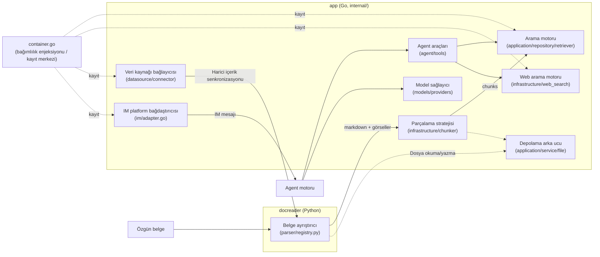

# Genişletme Noktaları Rehberi

Rethra'nın ayrıştırıcıları, parçalara ayırma stratejileri, getirme motorları, model sağlayıcıları, arama motorları, veri kaynakları, IM bağdaştırıcıları, Agent araçları ve depolama arka uçları arayüzler üzerinden entegre edilir. Yeni bir uygulama eklerken önce ilgili arayüzü uygulayın, ardından kayıt giriş noktasında birleştirin ve mevcut çağrı zincirini doğrulayın. Aşağıda genişletme türüne göre arayüzler, mevcut uygulamalar ve entegrasyon adımları listelenmiştir.

## Genişletme Noktalarına Genel Bakış {#genisletme-noktalarina-genel-bakis}



Go tarafındaki genişletme noktalarının çoğunun **kayıt merkezi**, `internal/container/container.go` dosyasıdır (bağımlılık enjeksiyonu kapsayıcısı): getirme motoru `initRetrieveEngineRegistry()`, web araması `registerWebSearchProviders()`, IM bağdaştırıcıları `registerIMAdapterFactories()`, veri kaynağı bağlayıcıları `initConnectorRegistry()`.

---

## Yeni Belge Ayrıştırıcısı Ekleme (docreader, Python) {#yeni-belge-ayristiricisi-ekleme-docreader-python}

### Arayüz Tanımı

Temel sınıf `docreader/parser/base_parser.py` dosyasındadır. Hafifletilmiş yeniden yapılandırmanın ardından BaseParser yalnızca belgeyi markdown metni + ham görsel başvurularına dönüştürür (parçalara ayırma, görsel depolama, OCR ve VLM caption işlemlerinin tümü Go tarafında yapılır):

```python
# docreader/parser/base_parser.py
class BaseParser(ABC):
    """Base parser interface."""

    def __init__(self, file_name: str = "", file_type: Optional[str] = None, **kwargs):
        self.file_name = file_name
        self.file_type = file_type or os.path.splitext(file_name)[1].lstrip(".")

    @abstractmethod
    def parse_into_text(self, content: bytes) -> Document:
        """Parse document content into markdown text.

        Returns:
            Document with ``content`` (markdown string) and optional
            ``images`` dict mapping storage-relative paths to base64 data.
        """
```

Dönüş değeri olan `Document`un (`docreader/models/document.py`, pydantic modeli) temel alanları `content: str` (markdown) ve `images: Dict[str, str]` (yol → base64) şeklindedir.

### Kayıt Mekanizması

`docreader/parser/registry.py` içindeki `ParserEngineRegistry`, ayrıştırıcıları "motor adı → {dosya uzantısı → Parser sınıfı}" şeklinde iki düzeyli eşlemeyle yönetir; istenen motor bu dosya türünü desteklemediğinde otomatik olarak `builtin` motoruna geri düşer. Varsayılan kayıt tablosu `_build_default_registry()` tarafından oluşturulur; modül düzeyindeki tekil örnek `registry = _build_default_registry()` şeklindedir.

```python
# docreader/parser/registry.py (alıntı)
class ParserEngineRegistry:
    def register(self, name: str, file_types: Dict[str, Type[BaseParser]],
                 description: str = "", check_available: Callable = None,
                 unavailable_hint: str = ""): ...
    def get_parser_class(self, engine: str, file_type: str) -> Type[BaseParser]: ...
```

### Mevcut Uygulamalar

| Motor | Parser | Dosya |
| --- | --- | --- |
| `builtin` | `Docx2Parser` / `DocParser` / `PDFParser` / `MarkdownParser` / `ExcelParser` / `EPUBParser` / `HTMLParser` / `MHTMLParser` / `ImageParser` (jpg/png/gif/bmp/tiff/webp vb.) | `docreader/parser/docx2_parser.py`, `doc_parser.py`, `pdf_parser.py`, `markdown_parser.py`, `excel_parser.py`, `epub_parser.py`, `html_parser.py`, `mhtml_parser.py`, `image_parser.py` |
| `markitdown` | `MarkitdownParser` (Microsoft MarkItDown, çoklu biçim) | `docreader/parser/markitdown_parser.py` |
| `opendataloader` | `OpenDataLoaderParser` (PDF düzen analizi, Java 11+ gerektirir, `check_available` denetimi içerir) | `docreader/parser/opendataloader_parser.py` |

### Ekleme Adımları

1. `docreader/parser/` altında `my_parser.py` oluşturun, `BaseParser` sınıfından türetin ve `parse_into_text(content: bytes) -> Document` metodunu uygulayın;
2. **Kayıt noktası: `docreader/parser/registry.py`** — `_build_default_registry()` içine şunu ekleyin:

```python
reg.register(
    "my_engine",
    {"myext": MyParser},
    description="Ayrıştırma motorum",
    check_available=lambda overrides: (True, ""),   # İsteğe bağlı: bağımlılık kullanılabilirlik yoklaması
    unavailable_hint="Bağımlılık eksik olduğunda kullanıcıya gösterilen ipucu",          # İsteğe bağlı
)
```

3. Mevcut bir uzantının uygulamasını değiştirmek için yalnızca `builtin` eşlemesine `"ext": MyParser` satırını ekleyebilirsiniz;
4. `docreader/tests/` altında unittest ekleyin (`test_parser_routing.py` dosyasını örnek alın), `uv run python -m unittest` ile doğrulayın.

---

## Yeni Parçalara Ayırma Stratejisi Ekleme (internal/infrastructure/chunker) {#yeni-parcalara-ayirma-stratejisi-ekleme-internal-infrastructure-chunker}

### Arayüz Tanımı

Parçalara ayırma için bir interface yoktur; bunun yerine **strateji katmanı (tier) + paket düzeyinde işlev değişkeni geçersiz kılma** modeli kullanılır. Genel giriş noktası `internal/infrastructure/chunker/strategy.go` dosyasındadır:

```go
// internal/infrastructure/chunker/strategy.go
// Strategy values for SplitterConfig.Strategy.
const (
    StrategyAuto      = "auto"
    StrategyHeading   = "heading"
    StrategyHeuristic = "heuristic"
    StrategyRecursive = "recursive"
    StrategyLegacy    = "legacy"
)

func Split(text string, cfg SplitterConfig) []Chunk
func SplitParentChild(text string, parentCfg, childCfg SplitterConfig) ParentChildResult
```

Yapılandırma ve sonuç türleri `internal/infrastructure/chunker/splitter.go` dosyasındadır:

```go
// internal/infrastructure/chunker/splitter.go
type Chunk struct {
    Content       string
    ContextHeader string
    Seq           int
    Start         int
    End           int
}

type SplitterConfig struct {
    ChunkSize    int
    ChunkOverlap int
    Separators   []string
    Strategy     string   // Boş = legacy (geriye dönük uyumluluk)
    TokenLimit   int      // Parça boyutunu yaklaşık token sayısıyla sınırlar, 0 = ChunkSize karakter sayısı kullanılır
    Languages    []string // Çok dilli sezgisel ipucu, boş = otomatik algılama
}
```

Strateji dağıtımı `runTier()` içinde yapılır; heading / heuristic uygulamalarının ikisi de kendi dosyalarındaki `init()` içinde paket düzeyindeki işlev değişkenlerini geçersiz kılar:

```go
// internal/infrastructure/chunker/strategy.go
func runTier(tier StrategyTier, text string, cfg SplitterConfig, profile *DocProfile) []Chunk {
    switch tier {
    case TierHeading:
        return splitByHeadings(text, cfg, profile)
    case TierHeuristic:
        return splitByHeuristics(text, cfg, profile)
    case TierLegacy:
        return SplitText(text, cfg)
    }
    return SplitText(text, cfg)
}

var splitByHeadings = func(text string, cfg SplitterConfig, _ *DocProfile) []Chunk {
    return SplitText(text, cfg) // heading_splitter.go'daki init() tarafından değiştirilir
}
var splitByHeuristics = func(text string, cfg SplitterConfig, _ *DocProfile) []Chunk {
    return SplitText(text, cfg) // heuristic_splitter.go'daki init() tarafından değiştirilir
}
```

### Mevcut uygulama

| Strateji katmanı | Açıklama | Dosya |
| --- | --- | --- |
| `TierHeading` | Markdown başlık düzeylerine göre parçalama | `internal/infrastructure/chunker/heading_hierarchy.go` vb. |
| `TierHeuristic` | Çok dilli sezgisel parçalama | `internal/infrastructure/chunker/heuristic_splitter.go` |
| `TierLegacy` (=`recursive`) | Özyinelemeli ayırıcılarla parçalama (ilk uygulama) | `internal/infrastructure/chunker/splitter.go` içindeki `SplitText()` |
| Doğrulayıcı | Her katmanın çıktısı `ValidateChunks` ile doğrulanır; başarısız olursa zincir boyunca geri düşer | `internal/infrastructure/chunker/validator.go` |

### Ekleme adımları

1. `internal/infrastructure/chunker/` altında `my_splitter.go` oluşturun ve `func(text string, cfg SplitterConfig, profile *DocProfile) []Chunk` uygulayın;
2. **Kayıt noktası: `internal/infrastructure/chunker/strategy.go`** —
   - Strateji sabiti (ör. `StrategyMine = "mine"`) ve yeni bir `StrategyTier` ekleyin;
   - `resolveChain`/`resolveChainWithProfile` içindeki switch yapısında, yeni strateji için katman zincirini döndürün (`TierLegacy` yedek olarak önerilir);
   - `runTier()` içinde yeni bir case ekleyin;
3. Çağıran tarafın değiştirilmesi gerekmez: bilgi tabanının `chunking_config.strategy` (JSONB) değeri, `internal/application/service/knowledge_process.go` içindeki `buildSplitterConfigFromChunking` aracılığıyla aktarılır;
4. Katman seçimini ve `ValidateChunks` doğrulama davranışını test etmek için `Split` ile birim testleri yazın.

---

## Yeni alma motoru (Retriever Engine) {#yeni-alma-motoru-retriever-engine}

### Arayüz tanımı

Arayüz, `internal/types/interfaces/retriever.go` içindedir (üç katman: motor → depo → hizmet + kayıt defteri):

```go
// internal/types/interfaces/retriever.go
type RetrieveEngine interface {
    EngineType() types.RetrieverEngineType
    Retrieve(ctx context.Context, params types.RetrieveParams) ([]*types.RetrieveResult, error)
    Support() []types.RetrieverType // Desteklenen arama türleri (vektör/anahtar kelime)
}

type RetrieveEngineRepository interface {
    Save(ctx context.Context, indexInfo *types.IndexInfo, params map[string]any) error
    BatchSave(ctx context.Context, indexInfoList []*types.IndexInfo, params map[string]any) error
    EstimateStorageSize(ctx context.Context, indexInfoList []*types.IndexInfo, params map[string]any) int64
    DeleteByChunkIDList(ctx context.Context, indexIDList []string, dimension int, knowledgeType string) error
    DeleteBySourceIDList(ctx context.Context, sourceIDList []string, dimension int, knowledgeType string) error
    CopyIndices(ctx context.Context, sourceKnowledgeBaseID string,
        sourceToTargetKBIDMap map[string]string,
        sourceToTargetChunkIDMap map[string]string,
        targetKnowledgeBaseID string, dimension int, knowledgeType string) error
    DeleteByKnowledgeIDList(ctx context.Context, knowledgeIDList []string, dimension int, knowledgeType string) error
    BatchUpdateChunkEnabledStatus(ctx context.Context, chunkStatusMap map[string]bool) error
    BatchUpdateChunkTagID(ctx context.Context, chunkTagMap map[string]string) error
    RetrieveEngine
}

type RetrieveEngineRegistry interface {
    Register(indexService RetrieveEngineService) error
    GetRetrieveEngineService(engineType types.RetrieverEngineType) (RetrieveEngineService, error)
    GetAllRetrieveEngineServices() []RetrieveEngineService
    GetByStoreID(storeID string) (RetrieveEngineService, error)
}
```

Motor türü numaralandırması `internal/types/retriever.go` içindedir:

```go
// internal/types/retriever.go
const (
    PostgresRetrieverEngineType        RetrieverEngineType = "postgres"
    ElasticsearchRetrieverEngineType   RetrieverEngineType = "elasticsearch"
    InfinityRetrieverEngineType        RetrieverEngineType = "infinity"
    ElasticFaissRetrieverEngineType    RetrieverEngineType = "elasticfaiss"
    QdrantRetrieverEngineType          RetrieverEngineType = "qdrant"
    MilvusRetrieverEngineType          RetrieverEngineType = "milvus"
    WeaviateRetrieverEngineType        RetrieverEngineType = "weaviate"
    DorisRetrieverEngineType           RetrieverEngineType = "doris"
    SQLiteRetrieverEngineType          RetrieverEngineType = "sqlite"
    TencentVectorDBRetrieverEngineType RetrieverEngineType = "tencent_vectordb"
    OpenSearchRetrieverEngineType      RetrieverEngineType = "opensearch"
)
```

### Mevcut uygulamalar

Tümü `internal/application/repository/retriever/` altındadır: `postgres/` (pgvector + BM25/ParadeDB), `elasticsearch/v7/`, `elasticsearch/v8/`, `qdrant/`, `milvus/`, `weaviate/`, `doris/`, `sqlite/` (sqlite-vec + FTS5), `tencentvectordb/`, `opensearch/`.

### Ekleme adımları

1. `internal/types/retriever.go` içine bir `RetrieverEngineType` sabiti ekleyin;
2. `internal/application/repository/retriever/myengine/` altında yeni bir paket oluşturun ve `RetrieveEngineRepository` arayüzünü uygulayın (`qdrant/` veya `sqlite/` örnek alınabilir);
3. **Kayıt noktası: `internal/container/container.go` içindeki `initRetrieveEngineRegistry()`** — `RETRIEVE_DRIVER` ortam değişkenine (virgülle ayrılmış) göre koşullu kayıt yapın:

```go
// internal/container/container.go (alıntı)
retrieveDriver := strings.Split(os.Getenv("RETRIEVE_DRIVER"), ",")
if slices.Contains(retrieveDriver, "postgres") {
    postgresRepo := postgresRepo.NewPostgresRetrieveEngineRepository(db)
    if err := registry.Register(
        retriever.NewKVHybridRetrieveEngine(postgresRepo, types.PostgresRetrieverEngineType),
    ); err != nil { ... }
}
```

   Yeni motor için yukarıdaki örneğe benzer bir dal ekleyin, `retriever.NewKVHybridRetrieveEngine(repo, motor türü)` ile sarmaladıktan sonra kaydedin;
   Bilgi tabanları arasında belge taşırken mevcut vektörlerin yeniden kullanılmasını desteklemek için isteğe bağlı `KnowledgeIndexMover` arayüzünü de uygulayın (`MoveKnowledgeIndices`: chunk ID'lerini ve vektörleri korur, yalnızca ait olunan bilgi tabanını değiştirir ve güvenle yeniden denenebilir); uygulanmadığında vektörleri yeniden kullanan taşıma reddedilir, yalnızca yeniden ayrıştırma modu kullanılabilir;
4. Motorun ayrı dağıtılması gerekiyorsa, `docker-compose.dev.yml` dosyasına profile içeren bir servis ekleyin (`qdrant`/`opensearch` örnek alın) ve `.env.example` dosyasına bağlantı değişkenlerini ekleyin.

---

## Yeni model sağlayıcı ekleme (internal/models/providers) {#yeni-model-saglayici-ekleme-internal-models-providers}

Model entegrasyonu protokol, sağlayıcı, katalog ve çalışma zamanı olmak üzere dört katmandan oluşur (genel bakış için bkz. [Model yönetimi](../03-features/06-models.md#katmanli-yapi)). Yeni sağlayıcıların çoğu için yalnızca bir sağlayıcı tanımı ekleyip model kataloğunu tamamlamak ve mevcut protokolü yeniden kullanmak yeterlidir.

### Arayüz tanımı

Sağlayıcı tanımı bir arayüz uygulaması değil, `internal/models/providers/definition.go` içinde bulunan bir yapıdır:

```go
// internal/models/providers/definition.go (alıntı)
type Definition struct {
    ID           string            // models.parameters.provider içine yazılan kalıcı kimlik
    Name         string
    Names        map[string]string // Dile göre adlar, ör. "zh-CN"
    Website      string
    Icon         []byte            // SVG
    API          api.API           // Varsayılan sohbet protokolü
    RerankAPI    api.RerankAPI     // Belirtilmezse varsayılan cohere-rerank
    EmbeddingAPI api.EmbeddingAPI  // Belirtilmezse varsayılan openai-embeddings
    TranscriptionAPI api.TranscriptionAPI // Belirtilmezse varsayılan openai-transcriptions
    DefaultBaseURLs  map[types.ModelType]string
    ModelTypes       []types.ModelType
    RequiresAuth     bool
    Auth             AuthStyle          // bearer / api-key / x-api-key / x-goog-api-key / none / signed
    URLPatterns      []string           // Eski satırlarda provider boşsa URL'ye göre tanıma
    ExtraFields      []ExtraField       // Düzenleyicinin dinamik olarak oluşturduğu ek alanlar
    CredentialLabels []CredentialLabel  // Kimlik bilgisi giriş kutularını yeniden adlandırır (imzalı arayüzler)
    Compat           VendorCompat       // Protokol başına sağlayıcı düzeyinde uyumluluk varsayılanları
    ThinkingLevels   api.ThinkingLevelMap
    Order            int                // Sağlayıcı listesindeki sıra
    // İsteğe bağlı kancalar
    Endpoint  func(req EndpointRequest) (url string, query map[string]string)
    PreferAPI func(baseURL string, spec models.ModelSpec) api.API
    Signer    func(creds api.Credentials) api.AuthFunc
}
```

Protokol katmanında, her yetenek için ayrı bir asgari arayüz bulunur; yeni bir protokol bunu uyguladığında entegre olabilir:

```go
// internal/models/api/rerank.go
type Reranker interface {
    Rerank(ctx context.Context, query string, documents []string) ([]RerankResult, error)
}

// internal/models/api/embeddings.go
type Embedder interface {
    Embed(ctx context.Context, texts []string, kind EmbedInputType) ([][]float32, error)
}

// internal/models/api/transcriptions.go
type Transcriber interface {
    Transcribe(ctx context.Context, req TranscriptionRequest) (*Transcription, error)
}
```

Sohbet protokolü istemcisi, `internal/models/chat` içindeki `Chat` arayüzünü uygular (`Chat` / `ChatStream` / `GetModelName` / `GetModelID`).

### Mevcut uygulamalar

- **Sağlayıcılar**: `internal/models/providers/` altında 26 dosya bulunur, her sağlayıcı için bir dosya vardır (`aliyun.go`, `deepseek.go`, `generic.go` vb.); bunlar `builtin.go` içindeki `Builtins()` tarafından açıkça listelenir. Simgeler `providers/assets/<id>.svg` yolundadır.
- **Protokoller**: `internal/models/api/<protocol>`. Sohbet: `openaicompletions`, `openairesponses`, `anthropicmessages`, `googlegenai`; vektör: `openaiembeddings`, `dashscopeembeddings`, `arkembeddings`, `googleembeddings`; yeniden sıralama: `cohererank`, `dashscoperank`, `nimrerank`, `tencentlkeap`, `volcengineknowledge`; ses: `openaitranscriptions`, `openaichataudio`.
- **Model kataloğu**: `internal/models/catalog/data/seed.json` (model meta verileri) + `overrides.json` (protokol, düşünme eşlemesi ve compat düzeltmeleri) → komut dosyasıyla `models.generated.json` oluşturulur ve derleme sırasında gömülür.
- **Çalışma zamanı**: `internal/models/runtime`, sağlayıcı tanımlarını ve kataloğu (`New()`) birleştirir; uygulama dağıtımı `config/models.json` katmanını ekler ve her model satırı için protokolü, uç noktayı ve uyumluluk ayarlarını çözümler.

### Ekleme adımları

1. **Yeni sağlayıcı tanımı oluşturun**: `internal/models/providers/<id>.go` içinde ad, desteklenen model türleri, her tür için varsayılan adresler, kimlik doğrulama yöntemi, protokol varsayılanları ve özel uç nokta kancalarını tanımlayın; paket açıklamasında resmi dokümantasyon dayanağını belirtin;
2. **Birinci kayıt noktası: `internal/models/providers/builtin.go`** — `new<Id>Provider()` öğesini `Builtins()` içine ekleyin; simgeyi `providers/assets/<id>.svg` içine koyun;
3. **İkinci kayıt noktası: model kataloğu** — Bu sağlayıcı için `internal/models/catalog/data/seed.json` içinde bir kayıt ekleyin (geçici olarak model olmasa bile boş bir liste bulunmalıdır; çalışma zamanı kataloğu sağlayıcı ID'sine göre okur) ve model meta verilerini yönetin; protokol, düşünme eşlemesi ve compat düzeltmelerini `overrides.json` içine yazın. Model anahtarları tür ile id / match içerir; aynı adlı sohbet ve vektör modelleri birlikte bulunabilir;
4. **Kataloğu oluşturun**: `make model-catalog-generate` çalıştırın. Oluşturulan dosyaları elle düzenlemeyin;
5. **Yeni protokol (isteğe bağlı)**: Mevcut protokoller kapsam sağlıyorsa doğrudan yeniden kullanın; gerçekten yeni bir protokol gerekiyorsa `internal/models/api/<protocol>` paketi ekleyin ve ilgili fabrikanın protokol dalına bağlayın (sohbet için `internal/models/chat/chat.go` içindeki `NewRemoteChat`, vektör için `internal/models/embedding/protocol.go`, yeniden sıralama için `internal/models/rerank/reranker.go`, ses için `internal/models/asr/protocol.go`);
6. **Doğrulama**: `make model-catalog-check` çalıştırın.

`make model-catalog-check` önce oluşturulan verilerin güncelliğini denetler, ardından `internal/models/...` kapsamındaki tüm testleri çalıştırır: `providers` için kayıt ve simge kontrolleri; `runtime` için çözümleme ve katmanlama; `parity` paketi için **değişmezler** (her model kaydındaki alanların geçerliliği, compat anahtar adlarının çözümlenebilmesi, bağlam ile azami çıktının tutarlılığı) ve **model bazında giden istek kontrolleri** (her sohbet modelinde düşünmenin açık / kapalı olduğu iki durumda yalnızca bir çıktı sınırı alanı bulunabilir; örnekleme parametrelerini desteklemeyen modellerde temperature olmamalıdır; her zaman düşünen modellere kapatma anahtarı gönderilmemelidir vb.). Yeni sağlayıcılar ve yeni modeller bu kuralları ihlal ettiğinde testler doğrudan başarısız olur; ayrı test senaryosu yazmaya gerek yoktur.

Ön yüzde değişiklik gerekmez: sağlayıcı açılır listesi, simgeler, ek alanlar ve model kataloğu `GET /api/v1/models/providers` tarafından dinamik olarak oluşturulur. Kullanıma hazır yerleşik model satırları, sağlayıcı tanımlarından bağımsız olarak operasyon ekibi tarafından `config/builtin_models.yaml` içinde tanımlanır.

### Mevcut sağlayıcıların bakımı

**Model meta verisi ekleme veya güncelleme** (yeni model id'si, bağlam penceresi, fiyat): Önce fark raporunu oluşturun, ardından sağlayıcı dokümantasyonuna göre `seed.json` dosyasını güncelleyin ve son olarak kataloğu yeniden oluşturun.

```bash
make model-catalog-diff                 # Tüm sağlayıcılar
make model-catalog-diff VENDOR=deepseek # Yalnızca bir sağlayıcı
```

Rapor, [models.dev](https://models.dev/api.json) genel meta verilerini karşılaştırır: `+`, üst kaynakta olup katalogda olmayan modeli; `~`, sayısal farkı; `?`, üst kaynakta yer almayan kaydı belirtir (yerel sağlayıcılarda ve takma adlarda bu sık görülür, hata olduğu anlamına gelmez). Komut dosyası yalnızca okur, yazmaz ve çalışma zamanında hiçbir zaman çağrılmaz. Alan adları ve düşünme biçimi gibi davranışsal bilgiler otomatik olarak eşitlenmez; bunlar sağlayıcı dokümantasyonuna göre elle yönetilmelidir.

**Sağlayıcı API davranışını değiştirdi** (çıktı sınırı alanı değişti, yeni effort değerleri eklendi, düşünme anahtarı biçimi değişti): `providers/<id>.go` içindeki `Compat`ı veya `overrides.json` içindeki ilgili modelin `compat`ını değiştirin, dizini yeniden oluşturun ve yorumlardaki dokümantasyon bağlantılarını eşzamanlı güncelleyin. `internal/models/api/openaicompletions/golden_test.go` gibi anlık görüntü testleri giden JSON'u sabitler; değişiklikten önce test beklentileri değiştirilmelidir.

**Acil düzeltme**: Sürüm yayımlanmasını beklemeden önce [dağıtım katmanı `config/models.json`](../03-features/06-models.md#dagitim-katmani-config-models-json) ile dağıtım tarafında değişiklik yapabilir, doğruladıktan sonra koda geri ekleyebilirsiniz.

---

## Yeni web arama motoru ekleme (internal/infrastructure/web_search) {#yeni-web-arama-motoru-ekleme-internal-infrastructure-web-search}

### Arayüz tanımı

```go
// internal/types/interfaces/web_search.go
type WebSearchProvider interface {
    // Name returns the name of the provider
    Name() string
    // Search performs a web search
    Search(ctx context.Context, query string, maxResults int, includeDate bool) ([]*types.WebSearchResult, error)
}
```

Kayıt defteri bir fabrika eşlemesidir (gerektiğinde kiracı parametreleriyle örneklenir):

```go
// internal/infrastructure/web_search/registry.go
type ProviderFactory func(params types.WebSearchProviderParameters) (interfaces.WebSearchProvider, error)

type Registry struct {
    factories map[string]ProviderFactory
    mu        sync.RWMutex
}

func (r *Registry) Register(id string, factory ProviderFactory)
func (r *Registry) CreateProvider(providerType string, params types.WebSearchProviderParameters) (interfaces.WebSearchProvider, error)
```

Bölgeye ve güncelliğe göre filtrelemeyi destekleyen motorlar isteğe bağlı `FilteredWebSearchProvider` (`SearchWithFilters`) arayüzünü ayrıca uygulayabilir; filtrelemeyi desteklemeyen motorlar, çağıranın istediği filtre koşullarını sessizce yok saymamalıdır.

### Mevcut uygulamalar


### Ekleme adımları

1. `internal/types/web_search_provider.go` içine `WebSearchProviderType` sabitini ekleyin;
2. `internal/infrastructure/web_search/` altında `mysearch.go` oluşturun, `WebSearchProvider`ı uygulayın ve `func NewMySearchProvider(params types.WebSearchProviderParameters) (interfaces.WebSearchProvider, error)` fabrikasını dışa açın;
3. **Kayıt noktası: `internal/container/container.go` içindeki `registerWebSearchProviders()`**:

```go
func registerWebSearchProviders(registry *infra_web_search.Registry) {
    registry.Register("duckduckgo", infra_web_search.NewDuckDuckGoProvider)
    registry.Register("google", infra_web_search.NewGoogleProvider)
    // ... buraya ekleyin:
    registry.Register("mysearch", infra_web_search.NewMySearchProvider)
}
```

4. Yeni motorun ön yüzdeki sağlayıcı açılır listesinde ve parametre formunda gösterilmesi gerekiyorsa, `frontend/` içindeki ilgili yapılandırma sayfası bileşenlerini eşzamanlı güncelleyin; kiracı yapılandırması `web_search_providers` tablosunda kalıcı olarak saklanır.

---

## Yeni veri kaynağı bağlayıcısı ekleme (internal/datasource/connector) {#yeni-veri-kaynagi-baglayicisi-ekleme-internal-datasource-connector}

> Dizin, karşılaştırarak inceleyebileceğiniz `internal/datasource/CONNECTOR_IMPLEMENTATION_GUIDE.md` uygulama kılavuzunu içerir.

### Arayüz tanımı

```go
// internal/datasource/connector.go
type Connector interface {
    // Type returns the connector type identifier (e.g., "feishu", "notion")
    Type() string

    // Validate verifies that the provided configuration is valid by testing
    // connectivity and checking credentials.
    Validate(ctx context.Context, config *types.DataSourceConfig) error

    // ListResources lists available resources that can be synced.
    // parentID hiyerarşik kaynakların tembel yüklenmesini destekler: "" üst düzeyi, boş olmayan değer o kaynağın doğrudan alt düğümlerini döndürür.
    ListResources(ctx context.Context, config *types.DataSourceConfig, parentID string) ([]types.Resource, error)

    // ResolveResourceAncestors tembel yüklenen ağaçta mevcut seçili öğelerin üst zincirini çözer (O(depth)).
    ResolveResourceAncestors(
        ctx context.Context, config *types.DataSourceConfig, resourceIDs []string,
    ) ([]string, error)

    // FetchAll performs a full sync of the specified resources.
    FetchAll(ctx context.Context, config *types.DataSourceConfig, resourceIDs []string) ([]types.FetchedItem, error)

    // FetchIncremental performs an incremental sync based on the provided cursor.
    FetchIncremental(ctx context.Context, config *types.DataSourceConfig, cursor *types.SyncCursor) ([]types.FetchedItem, *types.SyncCursor, error)
}
```

İsteğe bağlı akış arayüzü (büyük veri hacminde sayfalama checkpoint'i; bellekte yalnızca tek bir item tutulur):

```go
// internal/datasource/connector.go
type StreamHandler interface {
    Emit(ctx context.Context, item types.FetchedItem) error
    Checkpoint(ctx context.Context, cursor *types.SyncCursor) error
}

type StreamingConnector interface {
    Connector
    FetchStream(ctx context.Context, config *types.DataSourceConfig,
        cursor *types.SyncCursor, h StreamHandler) (*types.SyncCursor, error)
}
```

Tam eşzamanlamada silme mutabakatını korumak için iki isteğe bağlı arayüz daha vardır: `FullStreamingConnector` (`FetchFullStream`) ve `FullSyncWithCursor` (`FetchAllFromCursor`). Zorunlu tam eşzamanlamada veya `sync_mode=full` durumunda tüm öğeleri yeniden çeker ve silinmiş belgeleri belirlemek için önceki imleci korur. Uygulanmadığında, tam eşzamanlama silme olayı üretemez.

Kayıt defteri aynı dosyadadır: `ConnectorRegistry` (`NewConnectorRegistry()` / `Register(connector)` / `Get(type)` / `List()`); bağlayıcının UI meta verileri (ad, AuthType, capabilities) aynı dosyadaki `ConnectorMetadataRegistry` map'inde bulunur.

### Mevcut uygulamalar

| Tür | Dizin | Açıklama |
| --- | --- | --- |
| `feishu` / `lark` | `internal/datasource/connector/feishu/wiki/` | Feishu / Lark bilgi tabanı, aynı uygulama bölgeye göre ayrılır |
| `feishu_drive` / `lark_drive` | `internal/datasource/connector/feishu/drive/` | Feishu / Lark bulut diski |
| `notion` | `internal/datasource/connector/notion/` | Sayfalar ve veritabanları |
| `confluence` | `internal/datasource/connector/confluence/` | Confluence |
| `yuque` | `internal/datasource/connector/yuque/` | Yuque |
| `dingtalk` | `internal/datasource/connector/dingtalk/` | DingTalk belgeleri |
| `ima` | `internal/datasource/connector/ima/` | Tencent ima bilgi tabanı |
| `rss` | `internal/datasource/connector/rss/` | RSS aboneliği |
| `gitlab` | `internal/datasource/connector/gitlab/` | GitLab deposu |

`internal/types/datasource.go` içinde ayrıca henüz uygulanıp kaydedilmemiş `github`, `google_drive` vb. tür sabitleri bulunur.

### Ekleme adımları

1. `internal/datasource/connector/mysource/` içinde yeni bir paket oluşturun, `Connector` uygulayın (büyük veri hacimleri için aynı zamanda `StreamingConnector` uygulanması önerilir) ve `NewConnector()` sağlayın;
2. **Kayıt noktası bir: `internal/container/container.go` içindeki `initConnectorRegistry()`**:

```go
if err := registry.Register(mysourceConnector.NewConnector()); err != nil {
    errs = errors.Join(errs, fmt.Errorf("register mysource connector: %w", err))
}
```

3. **Kayıt noktası iki: `internal/datasource/connector.go` içindeki `ConnectorMetadataRegistry`** — tür sabiti (`internal/types` içindeki `ConnectorTypeXxx`) ve meta veri girdisi (Name/Description/AuthType/Capabilities) ekleyin;
4. Yapılandırma yapısını eşzamanlayın: `types.DataSourceConfig` yeni kimlik bilgisi alanları gerektiriyorsa şifreli depolama kuralına dikkat edin; ön uç veri kaynağı entegrasyon sayfası meta verilere göre oluşturulur;
5. `internal/datasource` içindeki ortak araçları yeniden kullanın: Kullanıcının girebileceği API adresleri önce `ValidateConnectorBaseURL` ile SSRF doğrulamasından geçirilmelidir, HTTP istekleri `NewConnectorHTTPClient` kullanmalıdır (yönlendirme ve bağlantı kurma aşamasında SSRF koruması içerir), dosya adları oluşturulurken `SanitizeFileName` kullanılmalıdır.

---

## Yeni IM platformu adaptörü ekleme (internal/im) {#yeni-im-platformu-adaptoru-ekleme-internal-im}

### Arayüz tanımı

```go
// internal/im/adapter.go
type Platform string // "slack" / "telegram" / "wechat" / "qqbot"

// Adapter is the interface every IM platform must implement.
type Adapter interface {
    // Platform returns the platform identifier.
    Platform() Platform

    // VerifyCallback verifies the signature/token of an incoming callback request.
    VerifyCallback(c *gin.Context) error

    // ParseCallback parses the raw IM callback request into a unified IncomingMessage.
    // Returns nil message for non-message events (e.g., URL verification).
    ParseCallback(c *gin.Context) (*IncomingMessage, error)

    // SendReply sends a reply back to the IM platform.
    SendReply(ctx context.Context, incoming *IncomingMessage, reply *ReplyMessage) error

    // HandleURLVerification handles the initial URL verification challenge.
    HandleURLVerification(c *gin.Context) bool
}
```

İki isteğe bağlı yetenek arayüzü:

```go
// internal/im/adapter.go
// StreamSender: uygulanırsa IM servisi akış yanıtlarını gerçek zamanlı iletir (ör. Telegram'da mesaj düzenleme)
type StreamSender interface {
    StartStream(ctx context.Context, incoming *IncomingMessage) (string, error)
    UpdateStreamContent(ctx context.Context, incoming *IncomingMessage, streamID string, fullContent string) error
    FinalizeStream(ctx context.Context, incoming *IncomingMessage, streamID string, finalContent string) error
    EndStream(ctx context.Context, incoming *IncomingMessage, streamID string) error
}

// FileDownloader: uygulanırsa knowledge_base_id yapılandırılmış kanallar dosya mesajlarını bilgi tabanına alır
type FileDownloader interface {
    DownloadFile(ctx context.Context, msg *IncomingMessage) (io.ReadCloser, string, error)
}
```

Adaptörler, kanal bazında fabrika tarafından örneklenir (`internal/im/service.go`):

```go
// internal/im/service.go
type AdapterFactory func(ctx context.Context, channel *IMChannel,
    msgHandler func(ctx context.Context, msg *IncomingMessage) error,
) (Adapter, context.CancelFunc, error)

func (s *Service) RegisterAdapterFactory(platform string, factory AdapterFactory)
```

### Mevcut uygulamalar

`internal/im/` altında her platform için bir alt paket vardır: `slack/`, `telegram/`, `wechat/`, `qqbot/`.

### Ekleme adımları

1. `internal/im/adapter.go` içine `Platform` sabiti ekleyin;
2. `internal/im/myplatform/` oluşturun, `Adapter` uygulayın (gerektiğinde `StreamSender`/`FileDownloader` ekleyin) ve `NewFactory() im.AdapterFactory` sağlayın;
3. **Kayıt noktası: `internal/container/container.go` içindeki `registerIMAdapterFactories()`**:

```go
func registerIMAdapterFactories(imService *imPkg.Service) {
    imService.RegisterAdapterFactory("slack", slack.NewFactory())
    // ... buraya ekleyin:
    imService.RegisterAdapterFactory("myplatform", myplatform.NewFactory())
    if err := imService.LoadAndStartChannels(); err != nil { ... }
}
```

4. Kanal yapılandırması `im_channels` tablosunda, oturum eşlemesi ise `im_channel_sessions` tablosunda kalıcı olarak saklanır; ön uç kanal yönetimi sayfasına ilgili platformun yapılandırma formu eklenmelidir.

---

## Yeni Agent aracı ekleme (internal/agent/tools) {#yeni-agent-araci-ekleme-internal-agent-tools}

### Arayüz tanımı

Araç arayüzü `internal/types/agent.go` içinde tanımlanır:

```go
// internal/types/agent.go
type Tool interface {
    // Name returns the unique identifier for this tool
    Name() string

    // Description returns a human-readable description of what the tool does
    Description() string

    // Parameters returns the JSON Schema for the tool's parameters
    Parameters() json.RawMessage

    // Execute runs the tool with the given arguments
    Execute(ctx context.Context, args json.RawMessage) (*ToolResult, error)
}
```

Çalışma zamanı kayıt defteri `internal/agent/tools/registry.go` içindedir:

```go
// internal/agent/tools/registry.go
type ToolRegistry struct {
    tools             map[string]types.Tool
    maxToolOutputSize int
}

// RegisterTool adds a tool to the registry.
// Aynı adlı araçlarda first-wins uygulanır; ad çakışmasıyla ele geçirme önlenir (GHSA-67q9-58vj-32qx).
func (r *ToolRegistry) RegisterTool(tool types.Tool)
func (r *ToolRegistry) GetTool(name string) (types.Tool, error)
func (r *ToolRegistry) ListTools() []string
```

### Mevcut uygulama

Araç adı sabitleri `internal/agent/tools/definitions.go` içinde toplanmıştır: `thinking`, `todo_write`, bilgi getirme araçları (`search_knowledge`, `read_document`, `list_documents`, `query_knowledge_graph`), `database_query`, `data_analysis`, `data_schema`, `web_search`, `web_fetch`, isteğe bağlı MCP çağrı araçları (`discover_mcp_tools`, `call_mcp_tool`), sanal alan/beceri araçları (`shell_exec`, `read_file`, `list_sandbox_files`, `write_sandbox_file`, `edit_sandbox_file`, `write_skill_file`, `edit_skill_file`), bellek araçları (`search_memory`, `search_conversations`), wiki araçları (`wiki_read_page`, `wiki_write_page`, `wiki_replace_text`, `wiki_rename_page`, `wiki_delete_page`, `wiki_search`, `wiki_flag_issue`, `wiki_read_issue`, `wiki_update_issue`); yerel tarayıcı aracı `local_browser`, `browserskill*.go` içinde uygulanır. Uygulama dosyaları çoğunlukla araçlarla aynı adı taşır (ör. `search_knowledge.go`, `read_document.go`, `list_documents.go`, `data_analysis.go`; `mcp_tool.go` / `mcp_catalog.go`, MCP hizmetlerinin uzak araçlarını isteğe bağlı olarak keşfetmekten ve çağırmaktan sorumludur).

Kullanımdan kaldırılan sanal alan araç adları (`execute_skill_script`, `read_skill`, `read_sandbox_file`) yalnızca geçmiş kayıtların kodunu çözmek için tutulur ve artık kaydedilmez; kullanımdan kaldırılan getirme araç adları (`knowledge_search`, `grep_chunks`, `list_knowledge_chunks`, `get_document_info`, `wiki_read_source_doc`) hâlâ `LegacyTool*` sabitleri olarak korunur: `legacyToolSuccessors` bunları `search_knowledge` / `read_document` ile eşler, `NormalizeAllowedTools` araçlar kaydedilirken saklanmış Agent yapılandırmalarındaki eski adları otomatik olarak yeniden yazar, `SuccessorToolName` / `IsLegacyRetrievalTool` ise diğer hizmetlerin karar vermesi için kullanılır. Araçları yeniden adlandırırken veya birleştirirken veri taşıması yapmak yerine bu mekanizmayı kullanın.

### Ekleme adımları

1. `internal/agent/tools/` altında `my_tool.go` oluşturun ve `types.Tool` için dört yöntemi uygulayın (`Parameters()` JSON Schema döndürür; `definitions.go` içindeki `maxFunctionNameLength` bölümüne bakın, araç adı için OpenAI sınırı ≤ 64 karakterdir);
2. **Birinci kayıt noktası: `internal/agent/tools/definitions.go`** — `ToolMyTool = "my_tool"` sabitini ekleyin ve aracı `AvailableToolDefinitions()` içine dahil edin (arayüzdeki seçilebilir araç listesi; yorum, kayıtlı araçlarla eşzamanlı tutulmasını açıkça gerektirir);
3. **İkinci kayıt noktası: Agent motorunun araç birleştirme yeri** — `ToolRegistry` oluşturan hizmet mantığına (Agent oturum başlatma sırasında, Agent yapılandırmasının izin verilen araç listesine göre örneklenir ve `RegisterTool` çağrılır) yeni aracın oluşturulmasını ekleyin; kaynak temizleme gereksinimi varsa `Cleanup` uygulayın (`types.Cleanable`);
4. Büyük çıktılar üreten araçlarda `ToolRegistry` içindeki `maxToolOutputSize` kesme davranışına dikkat edin; araç için bir `_test.go` yazın (aynı dizinde `search_knowledge_test.go`, `scope_authorization_test.go` gibi çok sayıda örnek vardır).

---

## Yeni depolama arka ucu (nesne depolama) {#yeni-depolama-arka-ucu-nesne-depolama}

### Arayüz tanımı

Dosya hizmeti arayüzü `internal/types/interfaces/file.go` içindedir:

```go
// internal/types/interfaces/file.go
type FileService interface {
    CheckConnectivity(ctx context.Context) error
    SaveFile(ctx context.Context, file *multipart.FileHeader, tenantID uint64, knowledgeID string) (string, error)
    SaveBytes(ctx context.Context, data []byte, tenantID uint64, fileName string, temp bool) (string, error)
    GetFile(ctx context.Context, filePath string) (io.ReadCloser, error)
    GetFileURL(ctx context.Context, filePath string) (string, error)
    DeleteFile(ctx context.Context, filePath string) error
    CopyFile(ctx context.Context, srcPath string, tenantID uint64, knowledgeID string) (string, error)
}
```

Çoklu arka uç çözümleme (kiracı düzeyindeki `storage_backends` tablo yapılandırması → FileService örneği) `internal/types/interfaces/storagebackend.go` üzerinden yapılır:

```go
// internal/types/interfaces/storagebackend.go
type StorageBackendService interface {
    Create(ctx context.Context, backend *types.StorageBackend) error
    Update(ctx context.Context, backend *types.StorageBackend) error
    Delete(ctx context.Context, tenantID uint64, id string) error
    SetDefault(ctx context.Context, tenantID uint64, id string) error
    Test(ctx context.Context, backend *types.StorageBackend) error
}

type StorageBackendResolver interface {
    ResolveFileService(ctx context.Context, tenant *types.Tenant, backendID, provider, localBaseDir string) (FileService, string, error)
    ResolveBackend(ctx context.Context, tenant *types.Tenant, backendID, provider string) (*types.StorageBackend, error)
}
```

### Mevcut uygulamalar

Tümü `internal/application/service/file/` altındadır:

| sağlayıcı | dosya | açıklama |
| --- | --- | --- |
| `local` | `local.go` | Yerel dosya sistemi |
| `minio` | `minio.go` | MinIO / S3 uyumlu |
| `cos` | `cos.go` | Tencent Cloud COS |
| `tos` | `tos.go` | Volcengine TOS |
| `s3` | `s3.go` | AWS S3 ve uyumlu hizmetler |
| `obs` | `obs.go` | Huawei Cloud OBS |
| `oss` | `oss.go` | Alibaba Cloud OSS |
| `ks3` | `ks3.go` | Kingsoft Cloud KS3 |

### Ekleme adımları

1. `internal/application/service/file/` altında `mystore.go` oluşturun ve tüm `FileService` yöntemlerini uygulayın (`CheckConnectivity`, ön yüzdeki "bağlantıyı test et" düğmesi, yani `StorageBackendService.Test` için kullanılır);
2. **Kayıt noktası: `internal/application/service/file/factory.go` içindeki `NewFileServiceFromStorageConfig()`** — provider switch'ine case ekleyin:

```go
switch p {
case "local":  // NewLocalFileService(...)
case "minio":  // NewMinioFileService(...)
// ... buraya ekleyin:
case "mystore":
    return NewMyStoreFileService(cfg), p, nil
default:
    return nil, p, fmt.Errorf("unsupported storage provider: %s", p)
}
```

3. Yeni provider yeni yapılandırma alanları gerektiriyorsa (endpoint/bucket/region vb.), `internal/types` içindeki `StorageEngineConfig` / `StorageBackend.config` (JSONB) yapısını genişletin;
4. Ön uç depolama arka ucu yönetim sayfasına ilgili provider için form alanları ekleyin; kiracı yapılandırması `storage_backends` tablosunda tutulur (`provider` sütunu switch'in anahtarıdır).

---

## Ek: Genişletme noktaları hızlı başvuru tablosu

| Genişletme noktası | Temel arayüz | Arayüz dosyası | Kayıt noktası |
| --- | --- | --- | --- |
| Belge ayrıştırıcı | `BaseParser.parse_into_text` | `docreader/parser/base_parser.py` | `docreader/parser/registry.py` içindeki `_build_default_registry()` |
| Parçalama stratejisi | tier işlevi `func(text, cfg, profile) []Chunk` | `internal/infrastructure/chunker/strategy.go` | Aynı dosyadaki `runTier()` + strateji sabitleri |
| Arama motoru | `RetrieveEngineRepository` | `internal/types/interfaces/retriever.go` | `container.go` içindeki `initRetrieveEngineRegistry()` (`RETRIEVE_DRIVER` denetimi) |
| Model sağlayıcısı | `providers.Definition` (+ protokol katmanı `Reranker` / `Embedder` / `Transcriber`, `chat.Chat`) | `internal/models/providers/definition.go` | `internal/models/providers/builtin.go` içindeki `Builtins()` + `internal/models/catalog/data/seed.json` |
| İnternet araması | `WebSearchProvider` | `internal/types/interfaces/web_search.go` | `container.go` içindeki `registerWebSearchProviders()` |
| Veri kaynağı bağlayıcısı | `Connector` / `StreamingConnector` | `internal/datasource/connector.go` | `container.go` içindeki `initConnectorRegistry()` + `ConnectorMetadataRegistry` |
| IM bağdaştırıcısı | `Adapter` (+`StreamSender`/`FileDownloader`) | `internal/im/adapter.go` | `container.go` içindeki `registerIMAdapterFactories()` |
| Agent aracı | `types.Tool` | `internal/types/agent.go` | `internal/agent/tools/definitions.go` + `ToolRegistry.RegisterTool` |
| Depolama arka ucu | `FileService` | `internal/types/interfaces/file.go` | `internal/application/service/file/factory.go` switch'i |
